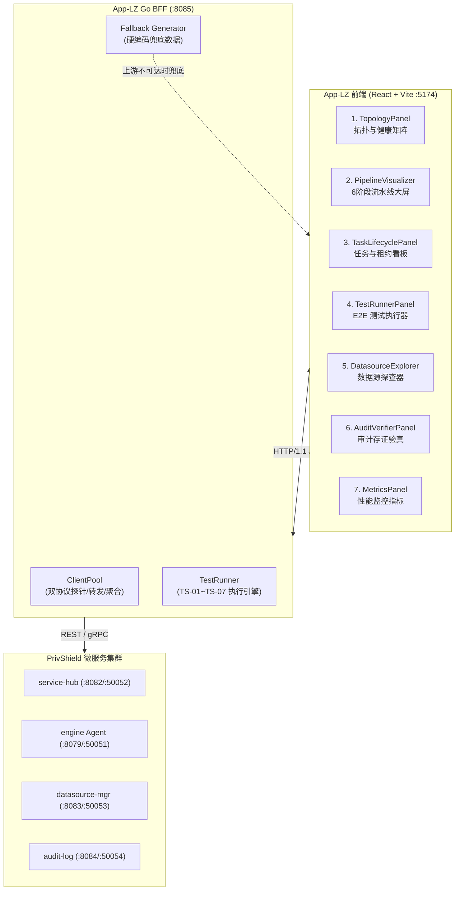

# 调度之眼 · 测试数据源头与生命周期全景文档

> **Console App-LZ (Eye of Dispatch) — Test Data Source & Lifecycle Specification**  
> 适用版本：`v1.8.0+` · 归属模块：`console/app-lz`  
> **最后更新**：2026-08-26

---

## 1. 文档概述与数据架构总览

`console/app-lz`（调度之眼）作为 **PrivShield 调度中枢与多微服务全栈观测测试控制台**，打通了调度中枢（`service-hub`）、隐私计算引擎（`engine / PrivShield Agent`）、数据源管理（`datasource-mgr`）以及脱敏审计日志（`audit-log`）四大微服务。

前端共 **7 大工作台**，所展示的数据根据来源可划分为 **三层数据供给模型**：

| 数据供给层级 | 说明 | 占比 |
|---|---|---|
| **L1 — 实时上游数据** | BFF 调用真实微服务接口获取的运行时数据 | ~70% |
| **L2 — BFF 内置兜底数据** | 上游不可达时 BFF 返回的硬编码模拟数据 | ~20% |
| **L3 — 前端硬编码数据** | 完全由前端组件内部硬编码的静态展示数据 | ~10% |



---

## 2. 七大工作台数据来源逐层剖析

### 2.1 模块一：四微服务拓扑与健康矩阵 (TopologyPanel)

| 数据项 | 来源层级 | 具体来源 | 代码位置 |
|---|---|---|---|
| 4 服务 REST RTT / 状态 | **L1 实时** | BFF `ClientPool.ProbeNode()` → HTTP `GET /api/health` 探测各服务 | `clients.go` L60~L99 |
| 4 服务 gRPC RTT / 状态 | **L1 实时** | BFF `net.DialTimeout("tcp", grpcAddr, 800ms)` TCP 拨测 | `clients.go` L103~L117 |
| 节点固定排列顺序 | **L3 前端** | 前端 `FIXED_ORDER` 数组排序 | `TopologyPanel.tsx` L40 |
| 服务角色/端口/图标元数据 | **L3 前端** | 前端 `getServiceMeta()` switch-case 硬编码 | `TopologyPanel.tsx` L49~L96 |
| 上游全部不可达时的兜底 | **L2 BFF** | BFF 标记各节点 `status: "unreachable"` 但不阻塞响应 | `clients.go` L188~L193 |
| 前端请求失败时的兜底 | **L3 前端** | `App.tsx` catch 块内硬编码 4 个服务的假 RTT 数据 | `App.tsx` L50~L60 |

**数据刷新机制**：
- 页面加载时立即触发一次全量探测
- 之后每 **15 秒** 自动刷新一次拓扑（`App.tsx` L163~L165 `setInterval`）
- 用户手动点击"刷新"按钮即时触发

**生命周期**：纯内存态，无持久化。每次探测生成新的 RTT 快照，前端 React state 更新后即丢弃旧值。

---

### 2.2 模块二：6 阶段流水线动态大屏 (PipelineVisualizer)

| 数据项 | 来源层级 | 具体来源 | 代码位置 |
|---|---|---|---|
| 6 阶段名称/标题/基准耗时 | **L3 前端** | BFF `defaultStages()` 硬编码 6 个阶段的名称与 `avg_duration_ms` | `clients.go` L247~L256 |
| 阶段实时状态 (idle/processing) | **L1 实时** | BFF `GetPipelineStatus()` → `service-hub /api/hub/pipeline` | `clients.go` L197~L245 |
| Agent 连通状态 | **L1 实时** | 上游 `pipeline` 接口返回的 `agent_ok` 字段 | `clients.go` L239 |
| QPS 数值 | **L1 实时** ✅ G-3 已改进 | BFF `GetPipelineStatus()` 从 Prometheus 指标动态计算 | `clients.go` parsePrometheusMetrics |
| 医保预设样本数据 | **L3 前端** | 前端 `sampleYibao` 对象硬编码（张三/510101199001011234 等） | `PipelineVisualizer.tsx` L34~L44 |
| 康养预设样本数据 | **L3 前端** | 前端 `sampleKangyang` 对象硬编码（李建国/KY-8802 等） | `PipelineVisualizer.tsx` L46~L56 |
| 脱敏后对比数据 | **L1 实时** ✅ G-6 已改进 | BFF `InvokeDataApi()` 调用 `engine /v1/privacy/mask_record` 真实脱敏，失败时 fallback 到本地掩码 | `handlers.go` InvokeDataApi, `clients.go` MaskRecordViaEngine |
| 任务分发结果 | **L1 实时** | BFF `DispatchTask()` → `service-hub /api/hub/dispatch` | `clients.go` L258~L280 |
| 分类调度结果 | **L1 实时** | BFF `ClassifyDispatch()` → `service-hub /api/hub/classify` | `clients.go` L282~L304 |
| 6 阶段流转动画 | **L3 前端** | 前端 `setTimeout` 依次 200ms 间隔推进 `activeStageIndex` | `PipelineVisualizer.tsx` L85~L90 |

**生命周期**：
- 阶段定义/预设数据：**静态不变**，随前端代码部署更新
- 流水线状态：**请求级**，每次查询获取最新值，不缓存
- 用户提交的 dispatch 结果：由 `service-hub` 持久化到 SQLite/PostgreSQL `tasks` 表
- 前端脱敏对比数据：**瞬时态**，仅存在于当次 `lastResult` state 中，页面刷新即丢失

---

### 2.3 模块三：任务生命周期与租约看板 (TaskLifecyclePanel)

| 数据项 | 来源层级 | 具体来源 | 代码位置 |
|---|---|---|---|
| 任务列表 | **L1 实时** | BFF `ListTasks()` → `service-hub /api/hub/tasks?status=&limit=50&offset=0` | `clients.go` L331~L351 |
| 任务列表前端兜底 | **L3 前端** | `App.tsx` catch 块硬编码 2 条样本任务 | `App.tsx` L75~L102 |
| Phase B 租约数据 | **L1 实时** ✅ G-1 已改进 | BFF `GetLeasesFromHub()` → `service-hub /api/hub/tasks?status=running`，按 `lease_owner` 分组 | `clients.go` (新增) |
| 租约 Worker/任务/TTL | **L1 实时** ✅ G-1 已改进 | 从真实 running tasks 推导，上游不可达时返回空数据 | `handlers.go` GetLeases |

**G-1 改进说明**：租约数据已改为查询 `service-hub` 真实 running 状态任务并按 `lease_owner` 聚合分组，不再 100% 硬编码。上游不可达时降级返回空 `leased_tasks` 列表。

**生命周期**：
- 任务实体：由 `service-hub` 持久化在 SQLite / PostgreSQL `tasks` 表中，长期存在
- 租约数据：**请求级**，每次从 `service-hub` 实时获取 running tasks 推导，BFF 重启后不影响
- 前端兜底任务：仅当 `service-hub` 不可达时出现在 UI 中，页面刷新后重新请求

---

### 2.4 模块四：E2E 自动化测试执行器 (TestRunnerPanel)

| 数据项 | 来源层级 | 具体来源 | 代码位置 |
|---|---|---|---|
| TS-01~TS-07 用例定义 | **L2 BFF** | BFF `TestRunner.GetAvailableSuites()` 硬编码 7 个用例的 ID/标题/描述 | `runner.go` L26~L78 |
| 测试执行结果 | **L1 实时** | BFF `TestRunner.RunSuites()` 实际调用上游服务执行断言 | `runner.go` L81~L135 |
| TS-01 测试输入数据 | **L2 BFF** | 硬编码患者数据（张三/510101199001011234/高血压） | `runner.go` L166~L176 |
| TS-02 测试输入数据 | **L2 BFF** | 硬编码康养数据（王五/KY-9901/血压145/95） | `runner.go` L232~L241 |
| TS-06 压测载荷 | **L2 BFF** | 硬编码测试用户数据，并发协程池实际调用 `service-hub` | `runner.go` L434~L556 |
| TS-07 租约争抢模拟 | **L1 实时** ✅ G-4 已改进 | 5 worker × 4 tasks = 20 真实并发 `DispatchTask` 到 service-hub，检测重复 task_id | `runner.go` TS-07 |
| 断言结果 (expected/actual) | **L1 实时** ✅ G-5 已改进 | TS-01/02/03/07 全部基于真实响应数据断言（task_id/level/records_count/零重复） | `runner.go` 各用例 |
| 测试日志流 | **L2 BFF** | 执行过程中 `logs` 切片追加，返回后前端展示 | `runner.go` 各用例 |

**G-4/G-5 改进说明**：
- **G-4**：TS-07 已从纯内存 `rand.Intn` 模拟改为 5 worker × 4 tasks = 20 真实并发 `DispatchTask` 到 service-hub，通过 `sync.Map` 检测 task_id 重复，验证零重复与零死锁。
- **G-5**：TS-01 新增 `MaskRecordViaEngine()` 验证脱敏效果（检查 `*` 掩码字符）；TS-02 基于真实 `ClassifyDispatch` 响应的 `level` 和 `auto_operation` 断言；TS-03 基于真实 `TriggerDatasourcePipeline` 响应的 `task_id`/`records_count`/`status` 断言。

**生命周期**：
- 用例定义：**编译期固定**，随 BFF 二进制部署更新
- 执行结果：**请求级内存态**，`RunTestSuiteResponse` 返回前端后即脱离 BFF 控制
- 前端 `lastRun` state：页面刷新即丢失
- TS-06/TS-07 压测产生的任务：真实写入 `service-hub` 存储，可在任务看板中查看

---

### 2.5 模块五：数据源资产探查器 (DatasourceExplorer)

| 数据项 | 来源层级 | 具体来源 | 代码位置 |
|---|---|---|---|
| 数据源元数据列表 | **L1 实时** | BFF `GetDatasources()` → `datasource-mgr /api/v1/datasources` | `clients.go` L379~L415 |
| 数据源元数据兜底 | **L2 BFF** | `defaultDatasources()` 硬编码 `ds_yibao` + `ds_kangyang` 的 ID/名称/字段列表 | `clients.go` L417~L434 |
| 切片采样数据 | **L1 实时** | BFF `GetDatasourceSlice()` → `datasource-mgr /api/v1/{yibao\|kangyang}/slice?limit=N` | `clients.go` L437~L474 |
| 切片采样兜底 | **L2 BFF** | `generateSampleSlice()` 按行数循环生成合成记录（医保: YB-2026-XXXXX; 康养: KY-XXXX） | `clients.go` L476~L511 |

**兜底数据详细结构**：

| 数据源 | 兜底字段 | 生成规则 |
|---|---|---|
| `ds_yibao` (医保) | record_id, patient_name, id_card, phone, diagnosis, hospital_name, total_fee, yibao_pay, settle_date | `YB-2026-{i:05d}` / `李四{i}` / 固定身份证 / 固定电话 / 高血压合并冠心病 / 华西医院 / 费用递增 |
| `ds_kangyang` (康养) | elder_id, name, age, gender, heart_rate, blood_pressure, blood_glucose, room_no, emergency_contact | `KY-{i:04d}` / `张老{i}` / 年龄 70+(i%20) / 心率 72+(i%15) / 固定血压 / A-{i:03d} 房间 |

**生命周期**：
- 数据源元数据：由 `datasource-mgr` 持久化在 SQLite 中，长期存在
- 切片采样数据：**请求级**，每次从 `datasource-mgr` 实时提取或兜底生成
- 兜底合成数据：**纯内存态**，不持久化，每次请求重新生成

---

### 2.6 模块六：不可篡改审计存证与 Merkle 验真 (AuditVerifierPanel)

| 数据项 | 来源层级 | 具体来源 | 代码位置 |
|---|---|---|---|
| 审计日志流水 | **L1 实时** | BFF `GetAuditLogs()` → `audit-log /api/v1/audit/logs?limit=&offset=` | `clients.go` L514~L537 |
| 审计日志兜底 | **L2 BFF** | `defaultAuditLogs()` 硬编码 2 条存证记录 | `clients.go` L539~L565 |
| Merkle 验真结果 | **L1 实时** | BFF `VerifyAudit()` → `audit-log /api/v1/audit/verify` | `clients.go` L568~L597 |
| Merkle 验真兜底 | **L2 BFF** | 硬编码 `merkle_valid: true` + 固定 root_hash + `total_entries: 128` | `clients.go` L577~L595 |

**兜底审计记录详情**：

| 字段 | 记录 1 | 记录 2 |
|---|---|---|
| id | audit-log-001 | audit-log-002 |
| task_id | task-1787554500-eabf3934 | task-1787554501-89bcdef1 |
| source | ds_yibao | ds_kangyang |
| operation | mask | classify_and_mask |
| data_hash | e3b0c44...（SHA-256 空串哈希） | a591a6d... |
| timestamp | 当前 UTC 时间 | 当前 UTC 时间 |

**生命周期**：
- 审计存证实体：由 `audit-log` 持久化在 SQLite `audit_logs` 表，**Append-Only 不可篡改**
- 兜底审计记录：**请求级**，每次请求重新生成（时间戳取当前时间）
- Merkle 验真结果：**请求级**，不缓存

---

### 2.7 模块七：性能监控与耗时直方图 (MetricsPanel)

| 数据项 | 来源层级 | 具体来源 | 代码位置 |
|---|---|---|---|
| Prometheus 原始指标文本 | **L1 实时** | BFF `GetHubMetrics()` → `service-hub /metrics` | `clients.go` GetHubMetrics |
| Prometheus 兜底 | **L2 BFF** | 返回静态字符串 `# HELP service_hub_status...` | `handlers.go` GetHubMetrics |
| 6 阶段耗时瀑布图 | **L1 实时** ✅ G-2 已改进 | BFF `GetParsedMetrics()` → 解析 `service-hub /metrics` Prometheus 文本提取各阶段 histogram | `clients.go` parsePrometheusMetrics |
| P50/P90/P95/P99 分位数 | **L1 实时** ✅ G-2 已改进 | BFF 从 Prometheus histogram 动态计算分位数 | `clients.go` calculatePercentiles |
| QPS 与总请求数 | **L1 实时** ✅ G-2/G-3 已改进 | BFF 从 Prometheus `http_requests_total` / `http_request_duration` 动态计算 | `clients.go` parsePrometheusMetrics |
| 数据源标识 | **L1 实时** ✅ G-2 已改进 | `source: "prometheus"` 或 `"fallback"` 标识数据来源 | `MetricsPanel.tsx` |

**G-2/G-3 改进说明**：
- **G-2**：新增 `GET /api/lz/metrics/parsed` 接口，BFF 内部解析 Prometheus 文本格式（`histogram_bucket`/`counter`/`gauge`），提取 6 阶段 `stage_durations`、`percentiles`（P50/P90/P95/P99）、`qps`、`total_requests`。前端 `MetricsPanel` 新增 `parsedMetrics` prop，动态渲染所有指标，并显示 `● LIVE Prometheus` 或 `○ Fallback Defaults` 数据源标识。
- **G-3**：流水线 QPS 不再固定为 12.5，改为从 Prometheus `http_requests_total` 指标动态计算（每秒请求数）。

**生命周期**：
- Prometheus 原始文本：**请求级**，每次刷新从 `service-hub` 实时拉取
- 解析后的阶段耗时 / 分位数 / QPS：**请求级**，每次从 Prometheus 指标实时解析计算

---

## 3. 数据来源汇总矩阵

| 工作台 | L1 实时上游 | L2 BFF 兜底 | L3 前端硬编码 | 持久化 |
|---|---|---|---|---|
| **1. 拓扑健康矩阵** | REST/gRPC 探针 RTT | 节点标记 unreachable | 排列顺序/角色元数据/前端 catch 兜底 | ❌ 纯内存 |
| **2. 流水线大屏** | 阶段状态/Agent 连通/**QPS 动态计算**/ **Engine 真实脱敏** | — | 预设样本/动画/基准耗时 | ❌ 纯内存 |
| **3. 任务与租约** | 任务列表/**租约真实查询** | — | 前端 catch 兜底任务 | ✅ service-hub DB |
| **4. 测试执行器** | 执行结果(调用上游)/**真实断言**/**真实并发** | 用例定义/测试输入 | — | ❌ 纯内存 |
| **5. 数据源探查** | 元数据 + 切片采样 | 元数据/切片合成兜底 | — | ✅ datasource-mgr DB |
| **6. 审计验真** | 审计流水 + Merkle 验真 | 审计兜底 + 验真兜底 | — | ✅ audit-log DB |
| **7. 性能指标** | Prometheus 原始文本/**解析后耗时+分位数+QPS** | 兜底静态文本 | — | ❌ 纯内存 |

---

## 4. 测试数据生命周期五阶段模型

```text
┌─────────────────┐     ┌─────────────────┐     ┌─────────────────┐
│ 1. 产生与就绪   │ ──▶ │ 2. 传输与路由   │ ──▶ │ 3. 消费与渲染   │
│ Creation        │     │ Transmission    │     │ Presentation    │
└─────────────────┘     └─────────────────┘     └─────────────────┘
                                                         │
                                                         ▼
┌─────────────────┐                             ┌─────────────────┐
│ 5. 过期与清理   │ ◀────────────────────────── │ 4. 持久化与归档 │
│ Reclamation     │                             │ Persistence     │
└─────────────────┘                             └─────────────────┘
```

### 阶段 1：产生与就绪 (Creation)

| 数据类型 | 产生方式 | 触发时机 |
|---|---|---|
| 拓扑探针数据 | BFF `ProbeNode()` 主动发起 HTTP/TCP 探测 | 页面加载 + 每 15 秒定时 + 手动刷新 |
| 流水线阶段状态 | `service-hub` 处理 `/api/hub/pipeline` 请求时实时计算 | 前端请求时 |
| 任务实体 | 用户通过流水线大屏/测试执行器触发 dispatch | 用户操作 |
| 测试套件定义 | BFF 编译期硬编码在 `runner.go` | BFF 启动即就绪 |
| 数据源元数据 | `datasource-mgr` 启动时从 SQLite 加载 | 服务启动即就绪 |
| 审计存证记录 | `service-hub` 流水线处理完成后异步写入 `audit-log` | 任务完成 Audit 阶段 |
| Prometheus 指标 | `service-hub` 内建 Prometheus Collector 持续采集 | 服务运行期间持续 |
| 前端硬编码数据 | 随前端 JS Bundle 加载 | 页面加载即就绪 |

### 阶段 2：传输与路由 (Transmission)

```text
前端 React ──HTTP/1.1 JSON──▶ BFF Gin (:8085) ──REST/gRPC──▶ 上游微服务
                                    │
                              ┌─────┴─────┐
                              │ 路由决策  │
                              ├───────────┤
                              │ [转发]    │ → 单一上游，透传请求+注入 Auth Header
                              │ [聚合]    │ → 并发调用多个上游，合并结果
                              │ [本地]    │ → BFF 内部直接返回（测试套件/租约）
                              │ [兜底]    │ → 上游不可达时返回硬编码数据
                              └───────────┘
```

- **入站**：前端 `fetch()` → BFF，携带 `Content-Type: application/json`
- **出站**：BFF `http.Client`（10s 超时）→ 上游 REST；gRPC 拨测仅做 TCP 连通性
- **降级路由**：`datasource-mgr` 不可达时尝试 `service-hub` 代理端点 (`/api/hub/datasources`)

### 阶段 3：消费与渲染 (Presentation)

- **React State 驱动**：`App.tsx` 中 7 个 `useState` 分别持有各工作台数据，`useEffect` 在挂载时触发全量初始加载
- **增量刷新**：拓扑面板 15 秒轮询；其余面板由用户手动触发或操作后联动刷新
- **联动刷新**：dispatch/测试执行完成后自动调用 `fetchTasksAndLeases()` 刷新任务看板

### 阶段 4：持久化 (Persistence)

| 数据实体 | 承载服务 | 存储介质 | 表/载体 | 持久化策略 |
|---|---|---|---|---|
| 任务实体与租约 | `service-hub` | SQLite / PostgreSQL | `tasks` | 长期持久化；完成后保留 |
| 审计存证日志 | `audit-log` | SQLite | `audit_logs` | Append-Only 不可篡改 |
| 数据源资产定义 | `datasource-mgr` | SQLite | `datasources` | 静态资产库持久化 |
| 隐私预算 (DP) | `engine` Agent | SQLite / 内存 | `budget.db` | 按窗口期重置或长期累加 |
| 拓扑探针结果 | BFF | 内存 | `ServiceNode` struct | 15 秒 TTL，不持久化 |
| 测试执行结果 | BFF | 内存 | `RunTestSuiteResponse` | 请求级，返回即释放 |
| 前端硬编码数据 | 浏览器 | JS Bundle | 组件常量 | 随代码部署更新 |

### 阶段 5：过期与清理 (Reclamation)

| 清理对象 | 触发条件 | 清理方式 |
|---|---|---|
| 前端 React State | 页面刷新 / 路由切换 / 组件卸载 | JavaScript GC 自动回收 |
| 拓扑探针快照 | 每 15 秒新一轮探测 | 新值覆盖旧值，无历史留存 |
| 测试执行会话 | 页面刷新 | `lastRun` state 丢失；BFF 侧 `RunSuites` 返回值无持久化 |
| 任务数据 | `service-hub` 管理 | 完成任务保留在 DB；超时租约由 Reaper 协程自动回收 |
| 审计存证 | **永不清理** | Append-Only 设计，只增不删 |
| 测试环境数据 | 手动执行 `docker-stop.sh` | 容器停止后 SQLite 文件保留，容器重建时可清理 |

---

## 5. 降级兜底策略详解 (Fallback Strategy)

当部分或全部后端微服务未启动时（本地独立开发场景），BFF 和前端通过**三层降级链**保证 UI 可交互：

```text
请求 → BFF 调用上游 → 成功？→ 返回真实数据
                        ↓ 失败
                    BFF 返回硬编码兜底 → 前端收到数据 → 渲染
                        ↓ BFF 自身异常
                    前端 catch → 渲染前端内置兜底数据
```

### 5.1 各接口降级行为一览

| 接口 | 上游不可达时的 BFF 行为 | 前端 catch 兜底 |
|---|---|---|
| `GET /api/lz/topology` | 返回各节点 `status: "unreachable"` | ✅ 硬编码 4 服务假数据 |
| `GET /api/lz/pipeline/status` | 返回 `defaultStages()` 全 idle 状态 | ❌ 无（显示空状态） |
| `POST /api/lz/pipeline/dispatch` | 返回含 `error` 的 DispatchResponse | ❌ 无（alert 报错） |
| `GET /api/lz/tasks` | 返回 `{total:0, tasks:[]}` | ✅ 硬编码 2 条样本任务 |
| `GET /api/lz/tasks/leases` | 调用 `service-hub /api/hub/tasks?status=running` 按 lease_owner 分组 ✅ G-1 | ❌ 不需要（返回空列表） |
| `GET /api/lz/suites` | 返回 BFF 内存中的用例定义 | ❌ 无 |
| `POST /api/lz/suites/run` | 执行测试（部分用例会因上游不可达而 FAIL） | ❌ 无 |
| `GET /api/lz/datasources` | 返回 `defaultDatasources()` | ❌ 无 |
| `GET /api/lz/datasources/:id/slice` | 返回 `generateSampleSlice()` 合成数据 | ❌ 无 |
| `GET /api/lz/audit/logs` | 返回 `defaultAuditLogs()` 2 条假记录 | ❌ 无 |
| `POST /api/lz/audit/verify` | 返回硬编码 `merkle_valid: true` | ❌ 无 |
| `GET /api/lz/metrics` | 返回静态 Prometheus 文本 | ❌ 无 |
| `GET /api/lz/metrics/parsed` ✅ G-2 | 解析 Prometheus 返回 stage_durations/qps/percentiles | 返回 fallback 默认值 |

---

## 6. 测试数据治理与运维命令

```bash
# 1. 启动全栈真实微服务环境（4 微服务 + App-LZ 控制台）
bash ./scripts/dev/docker-start-app-lz.sh --force

# 2. 检查四微服务拓扑探针状态 (REST 模式)
curl -s http://localhost:8085/api/lz/topology?protocol=rest | jq .

# 3. 检查四微服务拓扑探针状态 (gRPC 模式)
curl -s http://localhost:8085/api/lz/topology?protocol=grpc | jq .

# 4. 执行全量 7 项端到端自动化测试套件
curl -s -X POST http://localhost:8085/api/lz/suites/run \
  -H "Content-Type: application/json" \
  -d '{"suite_ids": []}' | jq .

# 5. 查看当前任务列表（验证 L1 实时数据 vs L2 兜底数据）
curl -s http://localhost:8085/api/lz/tasks | jq .

# 6. 查看租约数据（已改为真实查询 service-hub running tasks）
curl -s http://localhost:8085/api/lz/tasks/leases | jq .

# 7. 校验审计存证 Merkle 树真实性
curl -s -X POST http://localhost:8085/api/lz/audit/verify | jq .

# 8. 查看数据源元数据（可能为 L1 真实数据或 L2 兜底数据）
curl -s http://localhost:8085/api/lz/datasources | jq .

# 9. 一键停止所有测试容器并清理临时数据
bash ./scripts/dev/docker-stop-app-lz.sh
```

---

## 7. 已知限制与改进状态

| 编号 | 原限制 | 改进措施 | 状态 |
|---|---|---|---|
| G-1 | 租约看板 100% 硬编码 | 改为查询 `service-hub /api/hub/tasks?status=running` 按 lease_owner 分组 | ✅ 已完成 |
| G-2 | MetricsPanel 耗时/分位数 100% 硬编码 | 新增 Prometheus 文本解析器 + `GET /metrics/parsed` 接口，前端动态渲染 | ✅ 已完成 |
| G-3 | 流水线 QPS 固定 12.5 | 从 Prometheus `http_requests_total` 动态计算 | ✅ 已完成 |
| G-4 | TS-07 纯内存模拟 | 改为 5×4=20 真实并发 `DispatchTask` 到 service-hub + 零重复检测 | ✅ 已完成 |
| G-5 | 断言硬编码 `Passed: true` | TS-01/02/03/07 全部基于真实响应数据断言 | ✅ 已完成 |
| G-6 | 前端脱敏为本地字符串替换 | `InvokeDataApi` 优先调用 `engine /v1/privacy/mask_record`，失败 fallback 本地 | ✅ 已完成 |
