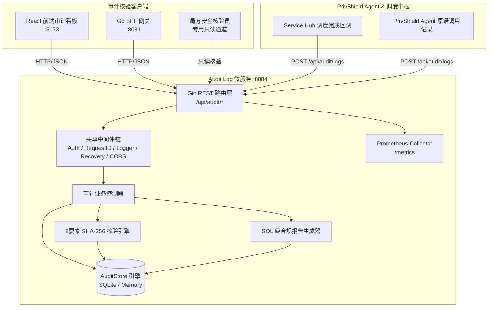

# 脱敏审计日志 (Audit Log) — 详细设计文档

> 本文档定义 **数联天下 · 数盾 (`PrivShield`)** 脱敏审计日志模块（`console/audit-log`）的系统架构、日志模型、8 要素增强完整性校验、合规报告生成与高可用持久化设计。

---

## 1. 背景与业务定位

在国家数据安全法与等保合规要求下，数据流通全链路必须具备**「可追溯、防篡改、抗抵赖」**的审计存证能力。**脱敏审计日志服务器 L (Audit Log)** 作为独立的安全审计节点，承担着以下核心职责：

1. **全量治理事件审计**：完整记录所有脱敏（Masking）、K-匿名（K-Anonymity）、差分隐私（DP）、数据分类（Classify）及查询混淆（QOL）操作明细；
2. **8 要素增强防篡改哈希存证**：采用 SHA-256 密码学哈希对审计事件全字段签名，自动生成存证快照；
3. **在线完整性校验**：提供存证真实性核验端点，实时检测并告警任何底层数据篡改；
4. **SQL 级多维统计与合规报告**：基于 SQLite SQL 聚合引擎提供毫秒级操作概览（`GetStats`）与合规报告（`GenerateReport`），彻底杜绝内存加载溢出风险；
5. **企业级持久化与安全防护**：基于纯 Go SQLite 实现 WAL 读写分离持久化，配备 API Key 鉴权、常量时间比对防时序攻击与 Prometheus 监控。

---

## 2. 总体架构拓扑



---

## 3. 核心机制与算法设计

### 3.1 8 要素增强完整性哈希算法 (Enhanced 8-Factor SHA-256)

#### 3.1.1 历史痛点与漏洞修复
旧版实现仅对 3 个字段（`log_id + timestamp + algorithm`）进行简单拼接哈希，攻击者即便篡改了 `input_hash`、`output_hash`、执行用户 `user`、敏感度等级 `security_level` 或算法配置 `parameters`，重新校验时哈希值依然看似“合法”，存在重大安全合规漏洞。

#### 3.1.2 8 要素增强哈希算法公式
新版实现将所有关键治理要素全面纳入哈希计算，公式如下：

$$\text{Data} = \text{logID} \parallel \text{timestamp (RFC3339Nano)} \parallel \text{algorithm} \parallel \text{inputHash} \parallel \text{outputHash} \parallel \text{user} \parallel \text{securityLevel} \parallel \text{parametersJSON}$$

$$\text{IntegrityHash} = \text{SHA256}(\text{Data})$$

```go
func computeIntegrityHash(logID string, timestamp time.Time, algorithm, inputHash, outputHash, user, securityLevel, paramsJSON string) string {
    data := fmt.Sprintf("%s|%s|%s|%s|%s|%s|%s|%v",
        logID, timestamp.Format(time.RFC3339Nano), algorithm,
        inputHash, outputHash, user, securityLevel, paramsJSON)
    hash := sha256.Sum256([]byte(data))
    return fmt.Sprintf("%x", hash)
}
```

任何微小篡改（甚至是配置 JSON 中的空格或敏感度等级由 L4 改为 L3）都将导致 SHA-256 产生雪崩效应，使 `VerifyIntegrity` 立即识别并报警。

---

### 3.2 SQL 级高性能统计与合规报告

#### 3.2.1 统计概览 (`GetStats`)
通过 SQL 聚合函数一次性汇总：
- 总操作次数与平均耗时：`SELECT COUNT(*), COALESCE(AVG(duration_ms), 0) FROM audit_logs`
- 按操作类型分布：`SELECT operation, COUNT(*) FROM audit_logs GROUP BY operation`
- 按状态分布：`SELECT status, COUNT(*) FROM audit_logs GROUP BY status`
- 按敏感等级分布：`SELECT security_level, COUNT(*) FROM audit_logs WHERE security_level != '' GROUP BY security_level`

#### 3.2.2 周期性合规审计报告 (`GenerateReport`)
支持指定周期（`1h`、`24h`、`7d`、`30d`），利用 SQLite 原生时间函数 `timestamp > datetime('now', ?)` 在数据库底层完成时间窗口过滤，直接计算：
1. **成功率**：`COALESCE(SUM(CASE WHEN status = 'success' THEN 1 ELSE 0 END), 0) / COUNT(*)`
2. **高频操作 Top 5**：`ORDER BY count DESC LIMIT 5`
3. **智能合规建议**：
   - 当 `L4` 敏感操作频繁时提示审查差分隐私预算消耗；
   - 当 `L5` 绝密数据操作增加时提示强化访问控制白名单；
   - 当操作成功率低于 95% 时触发排查预警。

---

## 4. 数据持久化设计 (`pkg/store/sqlite`)

### 4.1 表结构与索引 DDL

```sql
-- 审计日志主表
CREATE TABLE IF NOT EXISTS audit_logs (
    id TEXT PRIMARY KEY,
    timestamp DATETIME NOT NULL,
    operation TEXT,
    datasource TEXT,
    input_hash TEXT,
    output_hash TEXT,
    algorithm TEXT,
    parameters_json TEXT,
    input_rows INTEGER DEFAULT 0,
    output_rows INTEGER DEFAULT 0,
    duration_ms INTEGER DEFAULT 0,
    user_name TEXT,
    status TEXT,
    error_message TEXT,
    security_level TEXT
);

-- 存证快照表
CREATE TABLE IF NOT EXISTS snapshots (
    id TEXT PRIMARY KEY,
    audit_log_id TEXT,
    timestamp DATETIME NOT NULL,
    input_sample TEXT,
    output_sample TEXT,
    algorithm TEXT,
    parameters_json TEXT,
    integrity_hash TEXT,
    FOREIGN KEY(audit_log_id) REFERENCES audit_logs(id)
);

CREATE INDEX IF NOT EXISTS idx_audit_logs_ts ON audit_logs(timestamp);
CREATE INDEX IF NOT EXISTS idx_audit_logs_op ON audit_logs(operation);
CREATE INDEX IF NOT EXISTS idx_snapshots_audit ON snapshots(audit_log_id);
```

---

## 5. API 接口规范

| 方法 | 路径 | 描述 | 请求参数 / 请求体 | 响应说明 |
|---|---|---|---|---|
| `GET` | `/health` | 服务健康检查 | — | `200 OK` (连通性状态) |
| `GET` | `/api/health` | 内部健康检查端点 | — | `200 OK` |
| `GET` | `/api/audit/logs` | 多维度过滤分页查询审计日志 | `operation`, `datasource`, `user`, `status`, `security_level`, `limit`, `offset` | `200 OK` (total, logs) |
| `POST` | `/api/audit/logs` | 写入一条脱敏审计事件（自动生成防篡改快照） | `operation, datasource, input_hash, output_hash, input_sample, output_sample, algorithm, parameters, input_rows, output_rows, duration_ms, user, status, error, security_level` | `201 Created` (id) |
| `GET` | `/api/audit/logs/:id` | 根据 ID 获取单个审计日志详情 | URL 路径参数 `:id` | `200 OK` / `404` |
| `GET` | `/api/audit/stats` | 获取系统治理操作统计指标概览 | `period` (默认 `24h`) | `200 OK` (按操作/等级/状态统计) |
| `GET` | `/api/audit/snapshots` | 获取脱敏存证快照列表（分页） | `limit`, `offset` | `200 OK` (total, snapshots) |
| `POST` | `/api/audit/snapshots/verify` | 对指定快照执行 8 要素完整性真伪核验 | `{"snapshot_id": "snap-..."}` | `200 OK` (`valid`: bool, `expected`, `actual`) |
| `POST` | `/api/audit/report` | 自动生成周期合规审计分析报告 | `{"period": "24h"}` | `200 OK` (合规指标与改进建议) |
| `GET` | `/metrics` | Prometheus 监控指标抓取 | — | `200 OK` |
