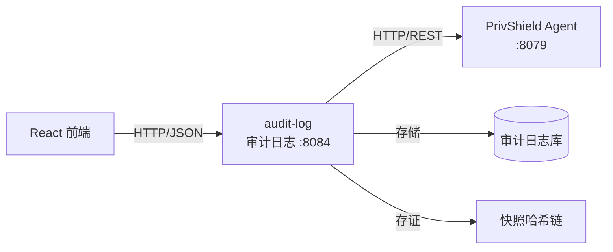

# 脱敏审计日志 — 设计文档

## 1. 背景与定位

在 design.md 描述的政务云数据安全架构中，**脱敏审计日志服务器 L** 位于独立安全审计节点（主机乙），负责：
- 接收脱敏明文快照与算法流水
- 提供局方专属只读核验看板（无外网通道）
- 确保脱敏操作的可追溯性与不可篡改性

`audit-log` 模块即为该审计日志服务器的控制台后端实现。

## 2. 总体架构



## 3. 核心设计

### 3.1 审计日志模型

每条审计日志包含：
- 操作信息（类型、数据源、算法、参数）
- 数据信息（输入/输出行数、哈希）
- 执行信息（耗时、用户、状态、错误）
- 安全信息（安全等级 L1~L5）

### 3.2 存证快照

每次脱敏操作自动生成存证快照：
- 快照 ID 关联审计日志
- 输入/输出数据样本（截断）
- 算法与参数
- 完整性哈希（SHA256）

### 3.3 完整性校验

使用 SHA256 哈希确保存证不可篡改：
```
hash = SHA256(log_id + timestamp + algorithm)
```

校验时重新计算哈希并与存储值对比。

### 3.4 合规报告

根据审计数据生成合规报告：
- 统计周期内操作总数
- 成功率
- 按安全等级分布
- 高频操作 Top 5
- 合规建议

## 4. 目录结构

```text
console/audit-log/
├── cmd/server/main.go        # 程序入口
├── internal/
│   ├── agent/client.go       # 上游 Agent HTTP 客户端
│   ├── config/config.go      # 环境变量配置
│   ├── handlers/handlers.go  # HTTP 处理器与路由
│   └── models/models.go      # 共享数据结构
├── docs/                     # 文档
├── Dockerfile                # 容器构建
├── Makefile                  # 构建自动化
├── run.sh                    # 开发启动脚本
└── go.mod                    # Go 模块定义
```

## 5. 扩展方向

- 持久化：将审计日志存储到数据库（PostgreSQL/ClickHouse）
- 日志采集：接入 Fluentd/Logstash 实现分布式日志采集
- 告警：基于规则的安全事件告警（如高频 L4/L5 操作）
- 区块链存证：将哈希链上链，增强不可篡改性
- 导出：支持审计日志导出为 CSV/PDF 格式
