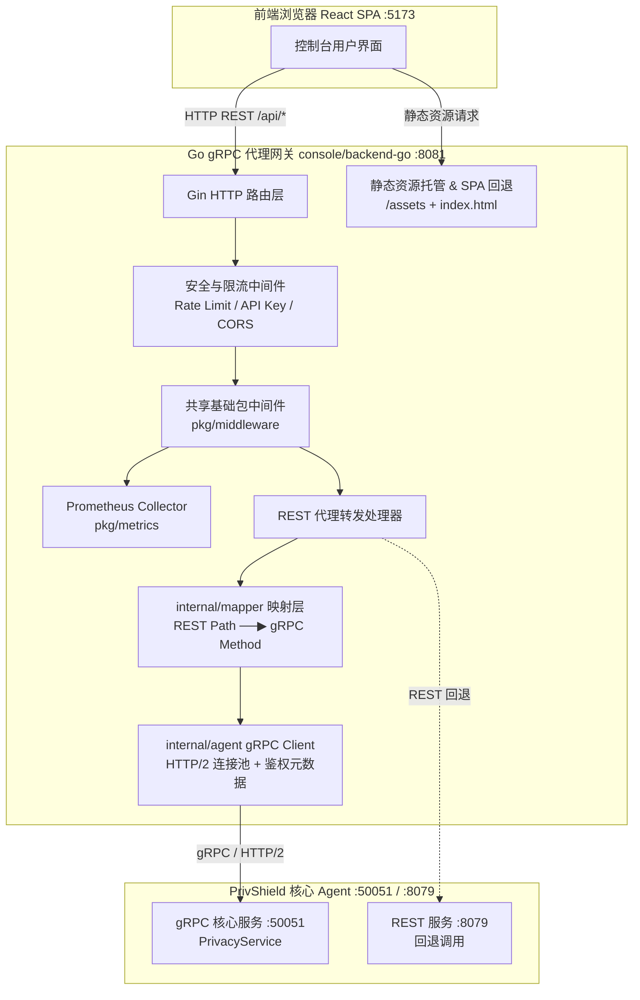

# Go gRPC 代理网关后端 (backend-go) — 详细设计文档

> 本文档定义 **数联天下 · 数盾 (`PrivShield`)** Go gRPC 代理后端（`console/backend-go`）的技术架构、模块职责、协议转换与安全治理设计。

---

## 1. 背景与选型原因

`PrivShield` 的核心隐私治理服务基于 gRPC（默认端口 `50051`）与 REST（默认端口 `8079`）双协议暴露全部隐私原语（脱敏、差分隐私、K-匿名、查询混淆、数据分类分级）。

为了为前端控制台提供高性能、强类型安全的通信通道，并探索 Go 在高并发隐私网关/Sidecar 中的架构优势，我们构建了 **`console/backend-go`**：

1. **强类型编译期校验**：依托 Protobuf 生成的 Go 结构体，消除手写字典在字段类型、拼写错误上的隐患；
2. **HTTP/2 多路复用与低延迟**：通过 gRPC 长连接复用底层 TCP，吞吐大幅提升，单次原语调用延迟较短连接显著降低；
3. **与 Python 后端完全一致的契约 (Contract Parity)**：对外提供与 Python 后端（`console/backend`）完全相同的 REST JSON 接口，前端只需切换 API Base URL 即可无缝热切换；
4. **内置单页应用独立托管**：支持直接托管前端构建产物（`web/dist`），使 Go 后端可独立提供完整 Web UI，无需依赖外部 Web 服务器或 Python 环境。

---

## 2. 总体架构拓扑



---

## 3. 核心子模块与设计细节

### 3.1 REST 到 gRPC 的智能映射 (`internal/mapper`)

前端所有针对隐私原语的操作通过 `POST /api/proxy` 发送统一请求：

```json
{
  "method": "POST",
  "path": "/v1/privacy/mask",
  "body": {
    "field_name": "id_card",
    "value": "110101199001011234"
  }
}
```

`mapper.Dispatch(ctx, client, req)` 根据 `path` 路由到对应的专用映射器：

| REST 路径 | 对应 Mapper 模块 | 调用的 gRPC 方法 | Protobuf 请求模型 |
|---|---|---|---|
| `/v1/privacy/mask` | `mapper/mask.go` | `client.Mask` | `MaskRequest` |
| `/v1/privacy/mask_record` | `mapper/mask.go` | `client.MaskRecord` | `MaskRecordRequest` |
| `/v1/privacy/dp_laplace_count` | `mapper/dp.go` | `client.DPLaplaceCount` | `DPLaplaceCountRequest` |
| `/v1/privacy/dp_gaussian` | `mapper/dp.go` | `client.DPGaussian` | `DPGaussianRequest` |
| `/v1/privacy/dp_budget` | `mapper/dp.go` | `client.GetBudget` | `BudgetRequest` |
| `/v1/privacy/kano_eval` | `mapper/kano.go` | `client.KAnonymityEval` | `KAnonymityEvalRequest` |
| `/v1/privacy/qol_obfuscate` | `mapper/qol.go` | `client.QOLObfuscate` | `QOLObfuscateRequest` |
| `/v1/dynclassification/classify`| `mapper/profile.go`| `client.Classify` | `ClassifyRequest` |

响应数据统一包装为 `{status: 200, duration_ms: 12.5, data: {...}, via: "go-grpc", protocol: "gRPC"}`，方便前端统一展示通信协议。

---

### 3.2 共享基础库深度整合 (`pkg/`)

`backend-go` 全面接入 `console/pkg`：
- **`pkg/middleware`**：集成 `RequestID()`、`StructuredLogger()`、`CORS()`、`SecurityHeaders()`；
- **`pkg/metrics`**：引入独立的 Prometheus 收集器暴露 `GET /metrics`；
- **`pkg/config`**：使用 `SetupLogger` 实现 JSON/Text 日志格式动态切换。

---

### 3.3 静态 UI 独立托管 (`registerStatic`)

通过 `PRIVACY_CONSOLE_STATIC_DIR` 环境变量配置前端 `web/dist` 路径：
1. **带哈希静态资源**：`/assets/*` 映射到 `dist/assets`，由 Gin 提供强缓存；
2. **SPA 前端路由回退**：对非 `/api/*` 路由统一回退输出 `index.html`，并设置 `Cache-Control: no-cache`，确保版本更新无缝感知；
3. **目录不存在优雅降级**：若未构建前端静态文件，服务打印告警并无缝降级为纯 API 模式启动。

---

## 4. 路由清单与 API 规范

| 方法 | 路径 | 描述 | 响应包装 |
|---|---|---|---|
| `GET` | `/health` | 服务健康检查 | `{backend: "ok", agent: {...}, via: "go-grpc"}` |
| `GET` | `/api/health` | 内部健康检查端点 | 同上 |
| `GET` | `/api/samples` | 获取全部端点的请求样例与元数据 | `{samples: [...]}` |
| `POST` | `/api/proxy` | 单请求代理转发（REST ──▶ gRPC） | `{status, duration_ms, data, via, protocol}` |
| `POST` | `/api/batch` | 批量请求顺序代理转发 | `{results: [...]}` |
| `POST` | `/api/upload` | CSV/JSON 文件上传与批量脱敏/分类 | `{records, masked_records, summary, ...}` |
| `POST` | `/api/lb_test` | 网关负载均衡策略仿真压测 | `{results, summary, latency_p95, ...}` |
| `POST` | `/api/concurrency_test` | 模拟多并发请求测试 | `{total, successful, failed, avg_latency}` |
| `POST` | `/api/medical_pipeline` | 医疗病历多阶段脱敏流水线测试 | `{stages, result}` |
| `POST` | `/api/yibao_pipeline` | 医保结算流水线脱敏测试 | `{stages, result}` |
| `POST` | `/api/pipeline/process` | 自定义流水线处理端点 | `{processed_records}` |
| `GET` | `/metrics` | Prometheus 指标采集 | 标准 Prometheus 文本格式 |
