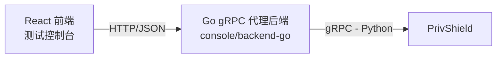

# Go gRPC 代理后端设计

## 1. 背景与选型原因

`PrivShield` 的核心服务基于 gRPC 暴露所有隐私原语（脱敏、差分隐私、K-匿名、查询混淆、数据分类）。
前端测试控制台（React）已经通过统一的 JSON 契约与 Python REST 代理后端交互。
为了复用同一套前端代码，并验证 Go 作为网关/代理层的可行性，我们新增了 Go gRPC 代理后端。

**为什么选择 Go + gRPC？**

- **类型安全**：使用 `proto` 生成的 Go 代码，请求/响应结构在编译期即可校验。
- **性能**：Go 的协程与 gRPC 的 HTTP/2 多路复用适合作为高并发代理。
- **可测试性**：`grpc/test/bufconn` 可以在内存中启动完整 gRPC 服务器，无需真实 TCP 连接。
- **部署友好**：Go 编译为单一二进制，容器镜像小，适合 K8s Sidecar 部署。

## 2. 总体架构



Go 代理后端本身不实现隐私算法，只负责：

1. 接收前端的 HTTP/JSON 请求；
2. 通过 `internal/mapper` 将 REST 路径与 JSON 体映射为对应的 protobuf 请求；
3. 调用 `PrivShield` 的 gRPC 方法；
4. 将 protobuf 响应转换为前端可展示的 JSON；
5. 可选：挂载前端构建产物（`web/dist`）直接提供 Console UI，无需依赖 Python 后端。

静态 UI 托管由 `PRIVACY_CONSOLE_STATIC_DIR`（默认 `../web/dist`）控制：目录存在时挂载 `/assets` 静态资源并对非 `/api` 路由回退 `index.html`；不存在时降级为纯 API 模式。

## 3. 目录布局

```text
console/backend-go/
├── cmd/server/             # 程序入口
│   └── main.go             # 加载配置、创建 gRPC 客户端、启动 HTTP 服务
├── internal/
│   ├── agent/              # gRPC 客户端封装
│   │   ├── client.go       # Client、New、NewFromConnection、WithAuth
│   │   └── client_test.go
│   ├── config/             # 环境变量配置
│   │   ├── config.go
│   │   └── config_test.go
│   ├── fileparse/          # CSV/JSON 文件解析
│   │   ├── fileparse.go
│   │   └── fileparse_test.go
│   ├── handlers/           # HTTP 处理器 + 共享中间件集成
│   │   ├── handlers.go     # /api/* 路由 + /metrics + 共享中间件链
│   │   └── handlers_test.go
│   ├── lbtest/             # 负载均衡策略测试
│   │   ├── lbtest.go
│   │   └── lbtest_test.go
│   ├── mapper/             # REST -> gRPC 路由映射
│   │   ├── mapper.go       # Dispatch 与各 path handler
│   │   ├── dp.go / kano.go / mask.go / qol.go / ldp.go / profile.go
│   │   └── mapper_test.go
│   ├── models/             # 与前端共享的 JSON 结构体
│   │   └── models.go
│   └── samples/            # 示例 payload + CSV 样本
│       ├── samples.go
│       ├── kangyang.csv
│       └── yibao.csv
├── proto/                  # 生成的 protobuf 代码
│   ├── privacy.pb.go
│   └── privacy_grpc.pb.go
├── scripts/                # 运维脚本
│   └── gen-certs.sh        # 生成 mTLS 测试证书链（CA/服务端/客户端）
├── tests/                  # 端到端集成测试
│   └── integration_test.go
├── docs/                   # 设计、API、测试文档
│   ├── design.md
│   ├── api.md
│   └── testing.md
└── go.mod / go.sum
```

**共享库依赖**：backend-go 通过 `go.mod` 中的 `replace` 指令引用 `console/pkg/` 共享基础库，
复用 Agent HTTP Client、中间件（CORS/Auth/RequestID/StructuredLogger）、Prometheus 指标与结构化日志。
详见 [console/design.md](../../design.md) §共享基础库。

## 4. REST 到 gRPC 的映射方式

前端所有 gRPC 支持的操作都通过 `/api/proxy` 统一代理，请求体格式如下：

```json
{
  "method": "POST",
  "path": "/v1/privacy/mask",
  "body": {
    "field_name": "email",
    "value": "alice@example.com"
  }
}
```

`mapper.Dispatch` 根据 `path` 查找对应的 handler，handler 负责：

1. 解析 JSON body；
2. 构造 protobuf 请求；
3. 调用 `pb.PrivacyServiceClient` 的对应方法；
4. 将 protobuf 响应转换为 `map[string]any` 等 JSON 可序列化结构。

例如 `/v1/privacy/mask` 映射为 `client.Mask`，返回 `{"result": "..."}`。

## 5. 可测试性设计

- `agent.NewFromConnection(conn *grpc.ClientConn)` 允许测试注入一个已经建立好的连接。
- 单元测试使用 `bufconn` 在内存中启动伪造的 `PrivacyServiceServer`，无需启动真实 agent。
- 每个 RPC 测试独立覆盖，验证请求转换与响应形状。
- 集成测试在 `tests/integration_test.go` 中，连接真实 `127.0.0.1:50051`，如果 agent 未启动则自动跳过。

## 6. 安全与可观测性

### 6.1 共享中间件链

所有请求经过以下中间件链（顺序固定）：

```
RequestID → StructuredLogger → CORS → SecurityMiddleware
```

| 中间件 | 来源 | 功能 |
|---|---|---|
| `RequestID` | `pkg/middleware` | 透传或生成 `X-Request-ID`，写入响应头供追踪 |
| `StructuredLogger` | `pkg/middleware` | `log/slog` JSON 格式记录每个请求（method/path/status/latency_ms/request_id） |
| `CORS` | `pkg/middleware` | 可配置来源的跨域策略（backend-go 默认允许所有来源） |
| `SecurityMiddleware` | `handlers` 本地 | API Key 鉴权 + 速率限制（`console/backend-go` 特有逻辑） |

### 6.2 Prometheus 指标

通过 `GET /metrics` 暴露 Prometheus 指标，使用 `pkg/metrics.Collector` 独立注册表：

| 指标 | 类型 | 说明 |
|---|---|---|
| `http_requests_total{module="backend-go"}` | Counter | HTTP 请求计数（method/path/status） |
| `http_request_duration_seconds{module="backend-go"}` | Histogram | HTTP 延迟分布 |
| `agent_requests_total{module="backend-go"}` | Counter | 上游 Agent 调用计数 |
| `agent_request_duration_seconds{module="backend-go"}` | Histogram | 上游 Agent 调用延迟 |

### 6.3 gRPC 安全

- **认证**：`agent.Client.WithAuth` 在 gRPC 元数据中附加 `authorization: Bearer <key>`；
  通过环境变量 `PRIVACY_AGENT_API_KEY` 启用。
- **TLS/mTLS**：`agent.buildTransportCredentials` 根据配置选择传输凭证：
  默认 `insecure.NewCredentials()`（本地开发）；设置 `PRIVACY_AGENT_TLS_ENABLED=true` 后
  加载 CA 校验服务端证书、强制最低 TLS 1.2，并可选加载客户端证书/私钥完成 mTLS 双向认证
  （`PRIVACY_AGENT_TLS_CERT_FILE` / `_KEY_FILE` / `_CA_FILE` / `_SERVER_NAME`）。
  证书生成与一键启动见 [ops.md](ops.md) 第 5 节。

### 6.4 HTTP Client 复用

`Server` 结构体持有共享 `httpClient *http.Client`（60s 超时），所有 `callRest` 调用复用同一连接池，
避免每次请求创建新客户端导致的 TCP 连接浪费。

## 7. 扩展方式

新增 gRPC 端点时：

1. 在 `proto/privacy.proto` 中定义 RPC 与消息；
2. 重新生成 Go 代码；
3. 在 `internal/mapper/mapper.go` 中添加 path 到 handler 的映射；
4. 在 `internal/samples/samples.go` 中添加示例 payload；
5. 在 `internal/mapper/mapper_test.go` 和 `internal/handlers/handlers_test.go` 中添加测试用例。
