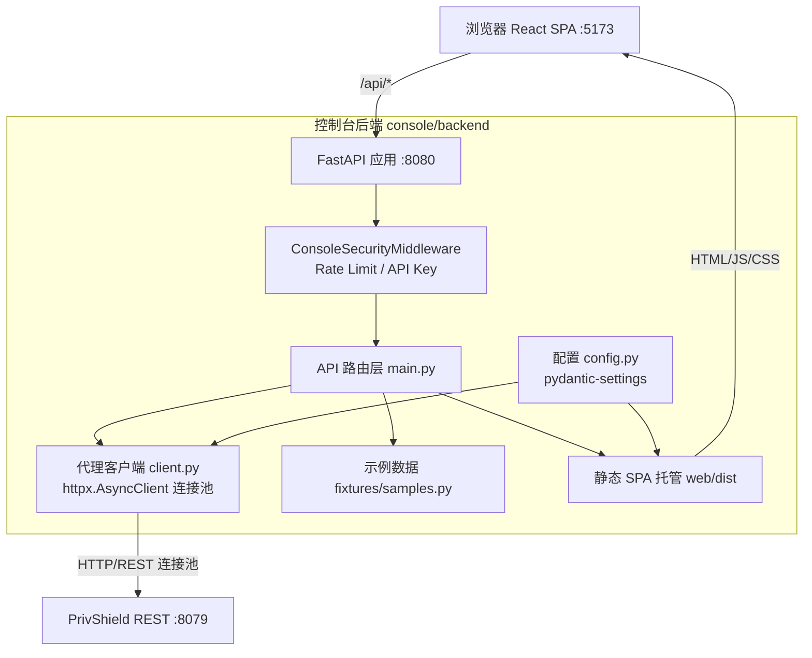

# 测试控制台后端 (Python FastAPI) — 详细设计文档

> 本文档定义 **数联天下 · 数盾 (`PrivShield`)** Python REST 代理后端（`console/backend`）的技术架构、模块划分、转发机制与双后端对齐规范。

---

## 1. 背景与选型

`PrivShield` 核心服务通过 FastAPI（REST 端口 `8079`）与 gRPC（端口 `50051`）暴露全部隐私原语。前端测试控制台（React SPA）需要代理层屏蔽跨域、统一响应结构并托管静态构建产物。

本后端选择 **Python + FastAPI + httpx** 构建，核心考量如下：

1. **同构极速适配**：与 Agent 核心服务同属 Python 生态，请求/响应的 Pydantic v2 模型与字段命名完全一致，零模型转换开销；
2. **原生异步连接池**：基于 ASGI 架构与 `httpx.AsyncClient` 连接池，高并发转发无阻塞；
3. **二进制流友好**：借助 `pyarrow` 原生解析 Arrow IPC 二进制流，将其反序列化为前端可直接渲染的 JSON 表格；
4. **与 Go 后端双向对齐 (Dual-Backend Parity)**：与 `console/backend-go` 对外提供严格一致的 JSON 契约，前端支持一键无感热切换。

---

## 2. 总体架构拓扑



---

## 3. 核心设计与数据流

### 3.1 通用代理转发 (`POST /api/proxy`)

前端将请求目标封装为 `ProxyRequest`：

```python
class ProxyRequest(BaseModel):
    method: str = Field(..., examples=["POST"])
    path: str = Field(..., examples=["/v1/privacy/mask"])
    body: dict[str, Any] | None = None
    raw_payload_b64: str | None = None
    content_type: str | None = None
```

处理流程：
1. 从 `client.py` 单例连接池借用连接；
2. 注入 `Authorization`（若配置）与入站 `X-Request-ID`；
3. 区分 Content-Type：如果是 `application/vnd.apache.arrow.stream` 则自动使用 `pyarrow` 反序列化 RecordBatch 并转为字典列表；
4. 包装为统一响应 `ProxyResponse`：`{status: 200, duration_ms: 15.2, data: {...}, via: "python-rest", protocol: "REST"}`。

### 3.2 批量转发 (`POST /api/batch`)

- 顺序执行 `requests` 列表中的子请求；
- 单次批量请求最大限制 100 条（`le=100`），防止长连接 DoS 攻击；
- 聚合每个子请求的耗时与返回数据。

### 3.3 文件上传与脱敏处理 (`POST /api/upload`)

支持上传 CSV、JSON 或文本文件：
- 流式解析记录（限制 50MB）；
- 依据选择的操作（`mask`、`k_anon`、`classify`）逐条或批量调用 Agent 处理；
- 返回原始记录、脱敏后记录与摘要统计对比。

---

## 4. 路由与 API 规范

| 端点 | 方法 | 作用 | 响应特征 |
|---|---|---|---|
| `/health` / `/api/health` | `GET` | 代理自身与 Agent 连通性检查 | `{backend: "ok", agent: {...}, via: "python-rest"}` |
| `/api/samples` | `GET` | 提供全部隐私原语测试用例数据 | `{samples: [...]}` |
| `/api/proxy` | `POST` | 通用单接口透明代理转发 | `{status, duration_ms, data, via, protocol}` |
| `/api/batch` | `POST` | 批量接口代理转发 | `{results: [...]}` |
| `/api/upload` | `POST` | 文件上传与隐私脱敏批处理 | `{records, masked_records, summary}` |
| `/api/lb_test` | `POST` | 网关多节点负载均衡测试 | `{results, summary}` |
| `/api/concurrency_test` | `POST` | 并发请求压力模拟测试 | `{summary, concurrency, ...}` |
| `/api/medical_pipeline` | `POST` | 医疗病历脱敏流水线 | `{stages, result}` |
| `/api/yibao_pipeline` | `POST` | 医保结算脱敏流水线 | `{stages, result}` |
| `/{full_path:path}` | `GET` | 静态 SPA 资源托管与前端路由回退 | HTML / CSS / JS |
