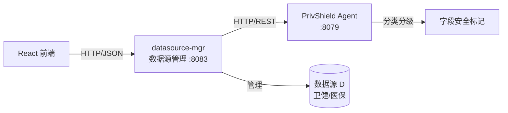

# 数据源管理 — 设计文档

## 1. 背景与定位

在 design.md 描述的政务云数据安全架构中，**柳树数据局原始数据库 D** 位于局方高密物理隔离环境，存储卫健/医保全量原始高密数据。

`datasource-mgr` 模块即为该数据源的管理控制台后端实现，提供：
- 数据源连接管理（注册、测试、删除）
- 元数据浏览（表结构、字段类型、安全等级）
- 访问审计（谁在何时访问了哪些数据）

## 2. 总体架构



## 3. 核心设计

### 3.1 数据源模型

每个数据源包含：
- 连接信息（host/port/database）
- 安全等级（high/medium/low）
- 业务标签（卫健/医保等）
- 连接状态（connected/disconnected/error）

### 3.2 元数据自动分类

查询元数据时：
1. 获取数据源表结构
2. 对每个字段调用 Agent 分类接口
3. 自动标记安全等级（L1~L5）
4. 敏感字段打标（PII、医疗数据等）

### 3.3 访问审计

所有对数据源的操作（创建/删除/测试/查询/导出/脱敏）都会记录到审计日志，包括：
- 操作类型
- 操作人
- 时间戳
- 操作结果

## 4. 目录结构

```text
console/datasource-mgr/
├── cmd/server/main.go        # 程序入口
├── internal/
│   ├── agent/client.go       # 上游 Agent HTTP 客户端
│   ├── config/config.go      # 环境变量配置
│   ├── handlers/handlers.go  # HTTP 处理器与路由
│   └── models/models.go      # 共享数据结构
├── docs/                     # 文档
├── Dockerfile                # 容器构建
├── Makefile                  # 构建自动化
├── run.sh                    # 开发启动脚本
└── go.mod                    # Go 模块定义
```

## 5. 扩展方向

- 持久化：将数据源信息和审计日志存储到数据库
- 权限控制：基于角色的数据源访问控制
- 连接池：对数据库类型数据源实现连接池管理
- 元数据同步：定期自动同步数据源 schema 变化
