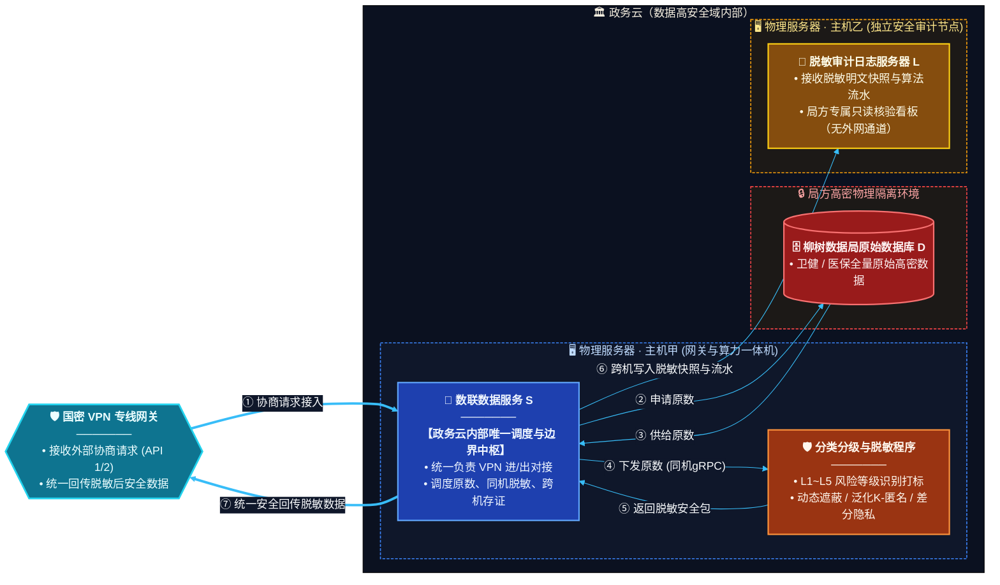

---

## Console 模块差距分析与补充

### 现有 Console 模块覆盖情况

| 架构组件 | Console 已有模块 | 覆盖状态 |
|---|---|---|
| 分类分级与脱敏程序 | Overview / Endpoint（Masking, Hash, DP, LDP, K-Anonymity, QOL）/ DynClassification / MedicalPipeline / YibaoPipeline | ✅ 已覆盖 |
| 负载均衡网关 | LbTest / ConcurrencyTestPanel | ✅ 已覆盖 |
| 运维诊断 | OpsPanel | ⚠️ 部分覆盖（偏通用运维，缺少审计专项） |
| 国密 VPN 专线网关 | 无 | ❌ 缺失 |
| 数联数据服务 S（调度中枢） | `console/service-hub` (Go/Gin) | ✅ 已实现 |
| 原始数据库 D（数据源管理） | `console/datasource-mgr` (Go/Gin) | ✅ 已实现 |
| 脱敏审计日志服务器 L | `console/audit-log` (Go/Gin) | ✅ 已实现 |
| 隐私预算管控 | Budget 端点测试（仅单点查询） | ❌ 缺失仪表盘 |
| 个性化隐私配置管理 | Profile 端点测试（仅单点推荐） | ❌ 缺失配置管理 |

### 需要补充的 6 个 Console 模块

#### 1. 🛡️ VPN 网关管理模块 (`VpnGatewayPanel`)

**对应架构组件**：国密 VPN 专线网关

**功能说明**：
- VPN 隧道状态监控（连接/断开/证书有效期）
- 国密算法配置（SM2/SM3/SM4 密钥管理与轮换）
- 外部协商请求接入日志与流量统计
- 进出域数据量实时监控
- 证书管理与自动续期告警

**侧边栏入口**：`VPN 网关管理`，图标 `shield`，配色 `cyan` 系

---

#### 2. 🔄 数据服务调度中枢模块 (`ServiceHubPanel`)

**对应架构组件**：数联数据服务 S（政务云内部唯一调度与边界中枢）

**功能说明**：
- 请求调度流水线可视化（①~⑦ 全链路时序图实时渲染）
- 当前并发调度任务数、排队队列深度
- 原数取用 → 同机脱敏 → 跨机存证 → 安全回传各环节耗时统计
- gRPC 通道健康状态与吞吐量监控
- 调度策略配置（优先级、超时、重试）

**侧边栏入口**：`调度中枢`，图标 `activity`，配色 `blue` 系

---

#### 3. 🗄️ 数据源管理模块 (`DataSourcePanel`)

**对应架构组件**：柳树数据局原始数据库 D（局方高密物理隔离环境）

**功能说明**：
- 数据源连接管理（卫健/医保等多库注册、连通性测试）
- 数据表/字段元数据浏览（高密标识、分级标签）
- 数据源安全等级标记（高密/高密隔离）
- 原数申请审批流程（申请 → 授权 → 取用 → 回收）
- 数据源访问审计（谁在何时取用了哪些数据）

**侧边栏入口**：`数据源管理`，图标 `database`（或 `inbox`），配色 `red` 系

---

#### 4. 📜 脱敏审计日志模块 (`AuditLogPanel`)

**对应架构组件**：脱敏审计日志服务器 L（独立安全审计节点）

**功能说明**：
- 脱敏明文快照查看（每次脱敏的输入/输出对比）
- 算法流水线流水（使用了哪种脱敏算法、参数、时间戳）
- 局方只读核验看板（无外网通道标识，强调安全隔离）
- 审计日志检索与过滤（按时间/数据源/算法/操作人）
- 存证完整性校验（快照哈希链验证）
- 合规报告导出（满足数据安全法/个保法审计要求）

**侧边栏入口**：`审计日志`，图标 `file-text`，配色 `amber` 系

---

#### 5. 💰 隐私预算仪表盘模块 (`BudgetDashboardPanel`)

**对应架构组件**：差分隐私预算管控（贯穿全部 DP/LDP 操作）

**功能说明**：
- 全局隐私预算消耗总览（ε 累计消耗 vs 预算上限）
- 按数据源/算法/时间维度的预算消耗明细
- 预算告警阈值配置（消耗达 80%/90% 时预警）
- 预算分配策略管理（为不同业务线/数据源分配子预算）
- 预算消耗趋势图（预测剩余预算可用时长）
- 与 Budget 端点联动，支持实时查询与手动刷新

**侧边栏入口**：`隐私预算`，图标 `bar-chart`，配色 `lime` 系

---

#### 6. ⚙️ 个性化隐私配置管理模块 (`ProfileConfigPanel`)

**对应架构组件**：个性化隐私参数配置（personalized-profiles.yaml 的管理界面）

**功能说明**：
- 隐私配置 Profile 的 CRUD（创建/查看/编辑/删除）
- L1~L5 风险等级与脱敏算法的映射规则配置
- 按数据源/字段/业务场景的个性化参数推荐与调整
- 配置版本管理与回滚（修改历史对比）
- YAML 配置导入/导出（与 `personalized-profiles.yaml` 双向同步）
- 配置生效状态监控（当前活跃 Profile、灰度发布状态）

**侧边栏入口**：`隐私配置`，图标 `sliders`，配色 `fuchsia` 系

---

### 补充后 Console 侧边栏完整结构（规划）

```
┌─────────────────────────────┐
│ 🔍 搜索框                    │
├─────────────────────────────┤
│ 📋 接口总览                  │  ← 已有
│ ▶️ 批量测试                  │  ← 已有
│ 📁 文件处理                  │  ← 已有
│ ⚖️ 负载均衡测试              │  ← 已有
│ 🔥 并发压测                  │  ← 已有
│ ✨ 动态分类分级              │  ← 已有
│ 🔧 运维诊断                  │  ← 已有
│ 🏥 医疗敏感数据治理          │  ← 已有
│ 📄 医保结算数据治理          │  ← 已有
│ ─ ─ ─ ─ ─ ─ ─ ─ ─ ─ ─ ─ │
│ 🛡️ VPN 网关管理     🆕      │  ← 新增
│ 🔄 调度中枢          🆕      │  ← 新增
│ 🗄️ 数据源管理        🆕      │  ← 新增
│ 📜 审计日志          🆕      │  ← 新增
│ 💰 隐私预算          🆕      │  ← 新增
│ ⚙️ 隐私配置          🆕      │  ← 新增
├─────────────────────────────┤
│ 📂 分类分组列表              │  ← 已有
│   Health / Masking / ...    │
└─────────────────────────────┘
```

### 与架构组件的映射关系

```
design.md 架构组件              →  Console 模块
─────────────────────────────────────────────────────────────
国密 VPN 专线网关               →  VpnGatewayPanel        🆕
数联数据服务 S（调度中枢）       →  ServiceHubPanel         ✅ Go/Gin :8082
分类分级与脱敏程序              →  Overview + Endpoint + DynClassification + Medical + Yibao  ✅
柳树数据局原始数据库 D          →  DataSourcePanel         ✅ Go/Gin :8083
脱敏审计日志服务器 L            →  AuditLogPanel           ✅ Go/Gin :8084
差分隐私预算管控                →  BudgetDashboardPanel    🆕
个性化隐私配置                  →  ProfileConfigPanel      🆕
```

---

## 三个新模块实现概要

### 模块 1：数据服务调度中枢 (`console/service-hub`)

| 属性 | 值 |
|---|---|
| 语言/框架 | Go / Gin |
| 默认端口 | 8082 |
| 与脱敏模块集成 | 调用 Agent `/v1/dynclassification/classify` 分类分级 → 根据 L1-L5 等级自动选择脱敏策略 → 调用 `/v1/privacy/mask` 下发脱敏 |
| 核心 API | `POST /api/hub/dispatch` 任务分发、`POST /api/hub/classify` 分类+自动脱敏、`GET /api/hub/pipeline` 流水线状态 |
| 部署 | Dockerfile + Docker Compose `service-hub` 服务 |

**调度流水线 6 阶段**：① 请求接入 → ② 申请原数 → ③ 分类分级 → ④ 下发脱敏 → ⑤ 返回结果 → ⑥ 存证写日志

**L1-L5 脱敏策略自动映射**：
- L1 (公开) → 无需脱敏
- L2 (内部) → 字段级脱敏 (mask)
- L3 (机密) → K-匿名 (k_anon)
- L4 (秘密) → 差分隐私 (dp)
- L5 (绝密) → 差分隐私 + 完全匿名 (dp)

### 模块 2：数据源管理 (`console/datasource-mgr`)

| 属性 | 值 |
|---|---|
| 语言/框架 | Go / Gin |
| 默认端口 | 8083 |
| 与脱敏模块集成 | 元数据查询时自动标注 L1-L5 安全等级、调用 Agent 分类接口验证数据可访问性 |
| 核心 API | `CRUD /api/datasources`、`POST /api/datasources/:id/test` 连通性测试、`GET /api/datasources/:id/metadata` 元数据（含分级标签） |
| 部署 | Dockerfile + Docker Compose `datasource-mgr` 服务 |

### 模块 3：脱敏审计日志 (`console/audit-log`)

| 属性 | 值 |
|---|---|
| 语言/框架 | Go / Gin |
| 默认端口 | 8084 |
| 与脱敏模块集成 | 记录每次脱敏操作的算法/参数/输入输出哈希、自动生成存证快照（含 SHA256 完整性校验） |
| 核心 API | `GET/POST /api/audit/logs` 日志查询/写入、`GET /api/audit/stats` 统计、`POST /api/audit/snapshots/verify` 完整性校验、`POST /api/audit/report` 合规报告 |
| 部署 | Dockerfile + Docker Compose `audit-log` 服务 |

### 一键运行

```bash
# 开发模式：一键启动三个模块
bash console/scripts/dev-start-new-modules.sh

# 集成测试（需先启动 Agent）
bash console/scripts/integration-test-new-modules.sh

# 停止
bash console/scripts/dev-stop-new-modules.sh

# Docker Compose 部署（含三个新模块）
cd deploy/docker-compose
docker compose up -d
```