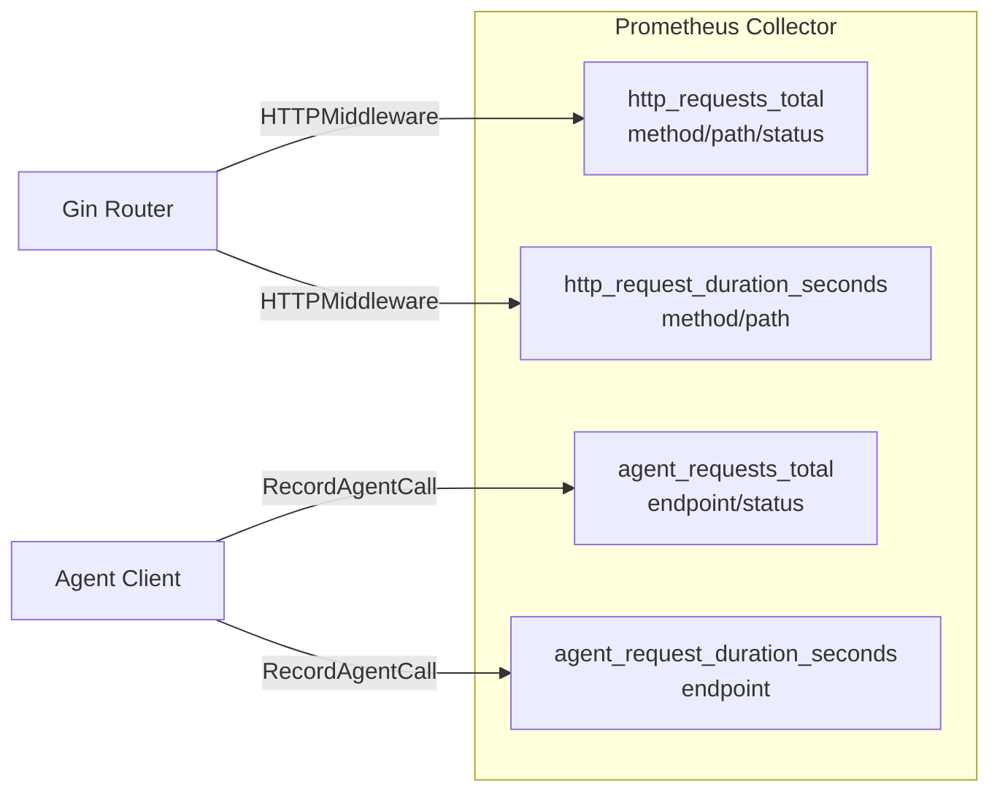

# 控制台共享公共库 (Shared PKG) — 设计文档

> 本文档定义 **数联天下 · 数盾 (`PrivShield`)** 控制台共享基础包（`console/pkg`）的架构设计、接口契约与通用组件实现。

---

## 1. 背景与定位

控制台包含多个独立的 Go 微服务（`backend-go`、`service-hub`、`datasource-mgr`、`audit-log`）。在初期演进中，各服务各自维护了相似的配置读取、中间件、指标采集、Agent 客户端以及内存存储代码。

为了消灭重复代码、统一安全标准、实现生产级持久化与高可用治理，我们将通用能力抽取为独立的 Go 模块 **`console/pkg`**。

### 1.1 设计目标

1. **统一契约与持久化**：定义 `store.TaskStore`、`store.DataSourceStore`、`store.AuditStore` 接口，提供开箱即用的 SQLite 持久化（生产）与内存存储（开发/测试）两套实现。
2. **安全中间件链**：提供常量时间比较 API Key 鉴权、精确 Origin 匹配 CORS、密码学安全 Request ID、Panic 捕获 Recovery、以及推荐安全响应头 SecurityHeaders。
3. **可观测性统一**：基于 Prometheus Client 提供模块级隔离的指标收集器（`Collector`），提供请求计数、延迟分布、上游调用统计与自动 Gin 中间件。
4. **统一 Agent 通信**：封装具备熔断保护（Circuit Breaker）、超时控制、64 MiB 响应防爆内存、链路追踪 ID 注入的高可靠 Agent HTTP 客户端。
5. **严密输入校验**：提供白名单校验、端口范围限制、字符串长度限制、抗碰撞唯一 ID 生成与安全分页解析。

---

## 2. 模块结构与包划分

```text
console/pkg/
├── agent/                  # 上游 PrivShield Agent REST API 客户端封装
│   ├── client.go           # Client（熔断器、鉴权头、超时、64MiB 限制）
│   └── client_test.go      # 基础请求、鉴权、熔断器状态流转单测
├── config/                 # 环境变量配置解析与结构化日志
│   ├── env.go              # EnvString, EnvInt, EnvBool, EnvStringSlice, SetupLogger
│   └── env_test.go         # 环境变量与日志级别单测
├── metrics/                # Prometheus 模块级指标
│   ├── metrics.go          # Collector（CounterVec, HistogramVec, HTTPMiddleware, Handler）
│   └── metrics_test.go     # 指标记录与 HTTP 端点单测
├── middleware/             # Gin 共享中间件链
│   ├── auth.go             # API Key / Bearer 鉴权（常量时间比较）
│   ├── middleware.go       # CORS, RequestID, StructuredLogger, Recovery, SecurityHeaders
│   └── middleware_test.go  # 跨域、鉴权、请求 ID、Panic 恢复单测
├── store/                  # 数据持久化接口与实现
│   ├── store.go            # 核心数据模型与 TaskStore/DataSourceStore/AuditStore 接口
│   ├── memory/             # 内存存储实现（带安全切片与容量上限控制）
│   │   ├── memory.go
│   │   └── memory_test.go
│   └── sqlite/             # SQLite 纯 Go 驱动持久化（无 CGO，WAL 模式，连接池）
│       ├── init.go         # 数据库连接池初始化与 DDL 迁移
│       ├── tasks.go        # 任务流水线持久化
│       ├── datasources.go  # 数据源与访问审计持久化
│       ├── audit.go        # 脱敏审计日志与快照持久化，SQL 级聚合统计
│       └── sqlite_test.go
├── validation/             # 输入安全校验与工具函数
│   ├── validation.go       # AllowedValues, PortRange, GenerateID, ParsePagination
│   └── validation_test.go
├── go.mod                  # github.com/fengzhizi319/PrivShield/console/pkg
└── go.sum
```

---

## 3. 核心子包设计

### 3.1 存储接口与 SQLite 引擎 (`pkg/store`)

#### 3.1.1 接口定义

- **`TaskStore`**：服务于 `service-hub`，支持任务保存（`Save`）、单个查询（`Get`）、分页/状态过滤（`List`）、阶段更新（`Update`）、状态聚合（`Counts`）。
- **`DataSourceStore`**：服务于 `datasource-mgr`，支持数据源 CRUD（`SaveDS`、`GetDS`、`ListDS`、`UpdateDS`、`DeleteDS`）及数据源访问审计（`SaveAudit`、`ListAudit`）。
- **`AuditStore`**：服务于 `audit-log`，支持脱敏日志保存与检索（`SaveLog`、`GetLog`、`ListLogs`）、SQL 聚合统计（`GetStats`）、合规报告（`GenerateReport`）、以及快照存证（`SaveSnapshot`、`ListSnapshots`、`GetSnapshot`）。

#### 3.1.2 SQLite 高性能与稳定性配置

采用 `modernc.org/sqlite` 纯 Go 驱动，无需系统安装 gcc 或 libsqlite3 动态库，具备极佳的跨平台与容器构建兼容性。初始化时自动配置：

1. **WAL 模式** (`PRAGMA journal_mode=WAL`)：读写分离，读不阻塞写，写不阻塞读。
2. **忙等待锁超时** (`PRAGMA busy_timeout=5000`)：5 秒重试缓冲，防止并发锁争用直接报错。
3. **写入同步级别** (`PRAGMA synchronous=NORMAL`)：在 WAL 模式下兼顾掉电安全与极高写入吞吐。
4. **连接池精细化**：`SetMaxOpenConns(4)`、`SetMaxIdleConns(2)`，适应 SQLite 单写多读特性。
5. **外键约束** (`PRAGMA foreign_keys=ON`)：保证快照关联审计日志的数据完整性。

---

### 3.2 共享安全中间件 (`pkg/middleware`)

| 中间件 | 职责与安全特性 |
|---|---|
| `RequestID()` | 读取或使用 `crypto/rand` 密码学随机数生成 `req-<timestamp>-<8_hex>` 唯一追踪 ID，注入 Context 与响应头 |
| `StructuredLogger()` | 基于 Go 标准库 `log/slog` 输出包含 `time, level, request_id, method, path, status, latency_ms, client_ip, module` 的结构化日志 |
| `CORS()` | 支持特定来源列表精确匹配（附带 `Vary: Origin`），开发模式可配置 `*` 通配放行 |
| `Auth()` | Bearer Token 提取，采用 `crypto/subtle.ConstantTimeCompare` 常量时间比对防时序攻击；`/health` 端点自动豁免 |
| `Recovery()` | 捕获运行时 Handler Panic，记录结构化错误日志，返回标准 500 JSON，防止单个异常请求导致服务崩溃 |
| `SecurityHeaders()` | 设置 `X-Content-Type-Options: nosniff`、`X-Frame-Options: SAMEORIGIN`、`X-XSS-Protection: 1; mode=block`、`Referrer-Policy: strict-origin-when-cross-origin` |

---

### 3.3 Prometheus 模块级指标 (`pkg/metrics`)

每个微服务在初始化时调用 `metrics.NewCollector(module)` 获得独立的指标收集器，注册以下 4 项核心黄金指标：



- **自定义 Registry 隔离**：每个 Collector 持有独立的 `prometheus.Registry`，避免单进程多实例或测试场景下的全局指标注册冲突。
- **自动中间件**：提供 `collector.HTTPMiddleware()`，自动捕获端点耗时与状态码，并主动跳过 `/metrics` 自身避免自递归。

---

### 3.4 上游 Agent 客户端与熔断保护 (`pkg/agent`)

- **熔断器三态流转**：
  - `CircuitClosed`：正常调用。连续失败次数达到 `CBThreshold`（默认 5）后进入 `CircuitOpen`；调用成功立即重置连续失败计数器为 0。
  - `CircuitOpen`：直接拒绝请求（返回 `circuit breaker open`）。持续 `CBCooldown`（默认 30s）后进入 `CircuitHalfOpen`。
  - `CircuitHalfOpen`：允许单个探测请求通过；若成功则恢复为 `CircuitClosed`，若失败则重新开启 `CircuitOpen` 并重置冷却时间。
- **内存安全**：响应体强制通过 `io.LimitReader` 限制为 64 MiB，超出直接拦截并记录失败，杜绝上游异常导致 OOM。
- **链路追踪**：`PostWithRequestID` 自动将当前请求的 `X-Request-ID` 传递给上游 PrivShield Agent。

---

### 3.5 输入校验与工具 (`pkg/validation`)

- **白名单校验**：`AllowedValues(field, value, whitelist)` 校验数据源类型（`database/api/file`）、安全级别（`high/medium/low`、`L1~L5`）、调度操作（`mask/k_anon/dp/classify/none`）、任务状态（`pending/running/completed/failed`）。
- **参数范围与长度**：`PortRange(port)`（1~65535）、`MaxLength(field, value, max)`（防止大字符串耗尽 SQLite 空间）。
- **抗碰撞 ID**：`GenerateID(prefix)` 采用 `<prefix>-<unix_seconds>-<8_random_hex>` 格式，高并发下无碰撞风险。
- **统一安全分页**：`ParsePagination(c, defaultLimit, maxLimit)` 自动解析 `limit` 与 `offset` 查询参数并设置安全阈值边界。
