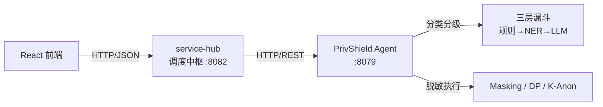

# 数据服务调度中枢 — 设计文档

## 1. 背景与定位

在 design.md 描述的政务云数据安全架构中，**数联数据服务 S** 是政务云内部唯一的调度与边界中枢，负责：
- 统一接收 VPN 进出的协商请求
- 调度原数取用、同机脱敏、跨机存证
- 协调分类分级与脱敏程序的执行

`service-hub` 模块即为该调度中枢的控制台后端实现，提供 HTTP REST API 供前端调用。

## 2. 总体架构



## 3. 核心设计

### 3.1 流水线模型

调度中枢将每个数据请求抽象为 6 阶段流水线：

```
① ingest → ② fetch → ③ classify → ④ desensitize → ⑤ return → ⑥ audit
```

每个任务在内存中维护状态机，前端通过 `/api/hub/pipeline` 实时查询各阶段状态。

### 3.2 分类分级联动

`POST /api/hub/classify` 是关键集成端点：

1. 调用 Agent 的 `/v1/dynclassification/classify` 获取敏感度等级
2. 根据 L1~L5 等级自动映射为对应脱敏操作
3. 创建任务并异步执行完整流水线

### 3.3 任务管理

- 内存存储：任务状态保存在进程内存中（开发阶段足够）
- 异步处理：任务分发后立即返回 task_id，后台 goroutine 执行流水线
- 状态查询：支持按 status 过滤、按时间排序

## 4. 目录结构

```text
console/service-hub/
├── cmd/server/main.go        # 程序入口
├── internal/
│   ├── agent/client.go       # 上游 Agent HTTP 客户端
│   ├── config/config.go      # 环境变量配置
│   ├── handlers/handlers.go  # HTTP 处理器与路由
│   └── models/models.go      # 共享数据结构
├── docs/                     # 文档
├── Dockerfile                # 容器构建
├── Makefile                  # 构建自动化
├── run.sh                    # 开发启动脚本
└── go.mod                    # Go 模块定义
```

## 5. 扩展方向

- 持久化：将内存任务存储替换为 SQLite / Redis
- 优先级队列：实现基于优先级的任务调度
- gRPC 支持：添加 gRPC 接口与 Agent 直接通信
- 指标采集：接入 Prometheus 暴露调度指标
