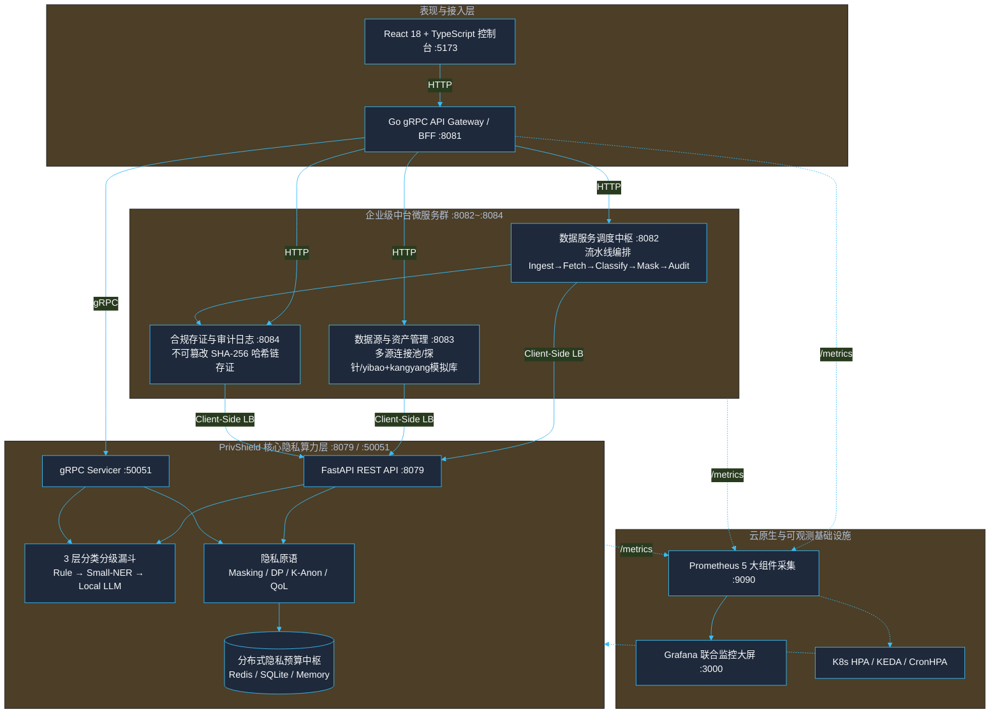
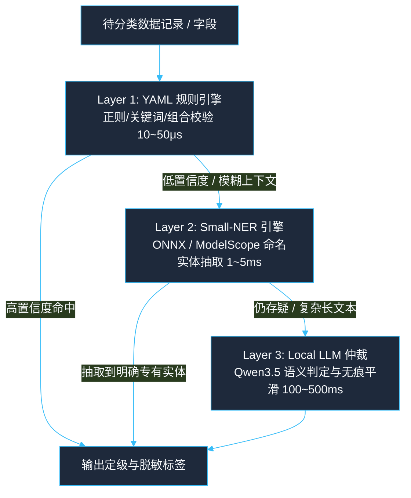
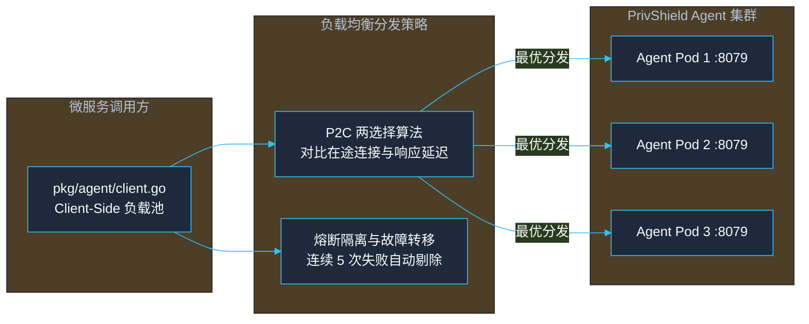

# PrivShield 架构设计文档 (Architecture Design Document)

> **版本**：v2.0.0  
> **适用范围**：`PrivShield` 核心算力引擎、企业级中台微服务群（`service-hub` / `datasource-mgr` / `audit-log`）、控制台 BFF 体系（`bff-go` / `web`）及云原生部署与监控套件。  
> **关联文档**：[unified_design_specifications.md](unified_design_specifications.md)（全栈统一设计规范）、[new_api_design.md](new_api_design.md)（新增数据接口扩展 SOP）、[architecture-summary.md](architecture-summary.md)（工程实践速览）、[services.md](services.md)（微服务体系）、[console.md](console.md)（控制台体系）、[production_optimization_design.md](production_optimization_design.md)（生产级优化设计）。

---

## 一、总体架构与设计哲学

### 1.1 业务定位与全景拓扑

PrivShield 实现了**「三层四柱五御六类」数据安全与隐私治理架构**：
- **算力面**：以独立高性能 Sidecar / 微服务形式提供确定性脱敏、差分隐私、K-匿名与三层分类分级算力；
- **调度面**：企业级微服务群串联数据源接入、元数据探查、流水线编排调度与不可篡改存证；
- **展现面**：双 BFF 聚合网关与现代响应式 Web UI 控制台。



---

### 1.2 核心设计哲学

| 原则 | 含义 | 架构落地体现 |
|---|---|---|
| **确定性优先** | 隐私算法与安全定级必须具备可证明的数学与规则依据 | 规则引擎优先于 AI 模型；DP/K-Anon 采用经典数学机制 |
| **优雅降级** | 复杂重依赖缺失或硬件受限时不崩溃，自动回退可用子集 | LLM/NER 缺失回退规则层；Redis 缺失回退 SQLite/内存 |
| **算力调度解耦** | 纯算力计算与上层业务流水线解耦为独立微服务 | Python 专攻 AI 隐私算力，Go 专攻高并发调度与存证 |
| **双栈同源** | 一套核心业务逻辑，同时支持高性能 RPC 与易调试 REST | `PrivacyService` 同时驱动 REST 路由与 gRPC Servicer |
| **云原生韧性** | 具备自愈、自适应负载均衡与细粒度事件驱动弹性扩缩 | P2C 动态分流、KEDA 业务指标扩容、CronHPA 预测调度 |

---

### 1.3 分层 Monorepo 代码架构

```text
PrivShield/ (Repo Root)
├── PrivShield/                # 核心隐私算力与动态分类分级引擎 (Python 3.13+)
│   ├── privacy/               # 隐私原语 (Masking, DP, K-Anon, QoL, Budget)
│   ├── dynclassification/     # 3 层分类分级漏斗 (Rule, NER, LLM 适配器)
│   ├── security/              # 传输与身份安全 (TLS, mTLS, API Key, RateLimit)
│   ├── observability/         # 指标监控、链路追踪与结构化日志
│   └── gateway/               # 智能动态负载均衡网关 (P2C / WRR)
│
├── services/                  # 企业级中台微服务群 (Go 1.25 集群)
│   ├── service-hub/           # 数据服务调度中枢 (:8082)
│   ├── datasource-mgr/        # 数据源资产管理与模拟库 (:8083)
│   └── audit-log/             # 脱敏审计与 SHA-256 存证 (:8084)
│
├── console/                   # 统一管理与测试控制台
│   ├── bff-go/                # Go BFF 代理网关 / REST 入口 + gRPC 上游 (:8081)
│   └── web/                   # React 18 + TypeScript 前端单页应用 (:5173)
│
├── pkg/                       # Go 全局共享基础库 (Client-Side LB, Store, Metrics)
├── deploy/                    # 云原生部署套件 (Helm, K8s, Compose, Prometheus, Grafana)
├── scripts/                   # 统一自动化运维、测试与模型下载工具
└── rules/                     # 分类分级领域规则库与标准体系 YAML
```

---

## 二、算法与核心算力引擎（PrivShield Core）

### 2.1 三层动态分类分级漏斗 (3-Layer Funnel)

数据分类分级是数据治理的基石。传统方案要么纯靠正则无法识别复杂语义，要么全量走大模型导致成本与延迟爆炸。PrivShield 创新采用**三层递进漏斗机制**：



* **Layer-1 (规则层)**：`ConfigurableRuleEngine` 解析 `rules/domains/*.yaml` 与体系定义，支持正则匹配、枚举词典、Luhn 校验与条件组合规则，处理 85%+ 明确模式；
* **Layer-2 (实体抽取层)**：采用轻量级 ONNX NER 模型抽取疾病、药物、手术、生化指标等实体；
* **Layer-3 (大模型仲裁层)**：采用专精量化大模型（Qwen3.5）进行上下文语义推理与歧义仲裁，配备进程级并发信号量（`PRIVACY_LLM_MAX_CONCURRENCY`）防显存 OOM。

---

### 2.2 差分隐私与分布式预算一致性 (DP & Budget)

* **严格数学原语**：实现拉普拉斯机制（Laplace Mechanism）与高斯机制（Gaussian Mechanism），涵盖 `count` / `sum` / `mean` / `histogram` 及 Rényi 差分隐私（RDP）；
* **分布式预算记账中枢**：
  * 支持多后端切换：`PRIVACY_BUDGET_BACKEND=redis|sqlite|memory`；
  * **Redis 分布式原子记账**：基于 Redis Lua 脚本在集群多 Pod 间执行原子性 $(\epsilon, \delta)$ 扣减与滑动窗口重置，杜绝并发预算穿透；
  * **HMAC 审计防篡改**：`BudgetAuditLogger` 对每笔预算消耗记录进行 HMAC-SHA256 签名存证。

---

### 2.3 K-匿名与 Mondrian 多维泛化

* **记录级实时泛化**：针对单条业务请求中的准标识符（年龄、邮编、薪资等）按领域层次树做最小化泛化；
* **数据集级全局优化**：实现经典 **Mondrian 多维区间划分算法**，支持 pandas 向量化切片计算，确保整表发布时任意等价类规模 $\ge k$。

---

## 三、企业级中台微服务群（Enterprise Services）

中台微服务群位于 `services/`，基于 Go 1.25 构建，具备高并发、低内存占用与强类型安全的特性。

### 3.1 数据服务调度中枢 (Service Hub :8082)
* **流水线 6 阶段调度**：`Ingest` (请求接入) ➔ `Fetch` (拉取原数) ➔ `Classify` (分类定级) ➔ `Desensitize` (按级脱敏) ➔ `Return` (脱敏回传) ➔ `Audit` (异步存证)；
* **任务工作池与削峰**：引入 Worker Pool 与并发信号量，保障突发流量下流水线平稳调度；
* **崩溃恢复与自动重试**：启动时自动回收孤立任务（running 标记失败、pending 保留队列），周期性后台重试失败任务（指数退避 + RetryCount 结构化字段）；
* **完整性校验与备份**：启动时 `PRAGMA integrity_check` 阻断损坏数据库，统一备份脚本支持全量/增量/验证模式；
* **HTTP/gRPC 双协议 mTLS**：共享 `pkg/tlsutil` 工具库，TLS 1.3 强制最低版本，支持 require/verify/request 客户端认证模式与公钥固定（SPKI Pinning）；
* 📖 **可靠性能力详解**：[service-hub/docs/reliability.md](../../services/service-hub/docs/reliability.md)

### 3.2 数据源资产管理 (Datasource Manager :8083)
* **多源异构纳管**：统一管理 MySQL、PostgreSQL、API 及文件型数据源；
* **模拟数据集开箱即用**：内置医保结算（`yibao.csv`）与康养体检慢病（`kangyang.csv`）数据库，支持启动自动种子注入（`SeedMockDataSources`）、元数据自动探查与 `GET /api/datasources/:id/records` 真实数据抽样；
* **HTTP/gRPC 双协议 mTLS**：与 service-hub 共享 `pkg/tlsutil` 工具库，支持 TLS 1.3 双向认证与公钥固定；
* 📖 **可靠性能力详解**：[datasource-mgr/docs/reliability.md](../../services/datasource-mgr/docs/reliability.md)

### 3.3 脱敏合规存证审计 (Audit Log :8084)
* **不可篡改哈希链**：基于 8 维度特征（时间戳、任务 ID、用户、源库、操作、明文哈希、脱敏后哈希、上链指纹）生成 SHA-256 存证校验链，支持合规审计报告导出；
* **完整性校验与备份**：启动时 `PRAGMA integrity_check` 阻断损坏数据库，统一备份脚本支持全量/增量备份；
* **独立校验脚本**：`scripts/prod/verify_audit.sh` 独立验证审计数据完整性，支持 CI/CD 集成；
* 📖 **可靠性能力详解**：[audit-log/docs/reliability.md](../../services/audit-log/docs/reliability.md)

---

## 四、负载均衡、高可用与弹性扩缩容

针对 AI 与隐私计算中**算力异构（微秒级规则 vs 秒级大模型）**的特性，系统构建了全链路高可用调度网络：



### 4.1 Go Client-Side 多节点负载均衡
* `pkg/agent/client.go` 原生支持配置 `PRIVACY_AGENT_URLS` 集群列表；
* 内置平滑轮询（Round-Robin）与熔断状态机（Closed / Open / Half-Open），遇到单点宕机自动透明切换至存活节点；
* **熔断器 Prometheus 指标**：`circuit_breaker_state{node="..."}` 实时暴露熔断器状态，支持 Grafana 告警；
* 📖 **网关可靠性详解**：[gateway_balancer/reliability.md](../../gateway_balancer/reliability.md)

### 4.2 网关 P2C 动态负载调度
* `engine/gateway/balancer.py` 新增 **Power of Two Choices (P2C)** 算法，每次随机选取两个候选健康节点并路由至负载得分更低者，彻底消除大并发下的羊群聚集效应。

### 4.3 云原生多维自动扩缩容
* **业务指标 HPA**：支持基于 QPS 速率、LLM 排队深度与 P95 延迟进行水平扩缩；
* **KEDA 事件驱动扩展**：集成 `ScaledObject` 模板，支持直接绑定 Prometheus 实时指标秒级扩容；
* **CronHPA 预测调度**：预置政务就医业务潮汐策略（工作日 08:15 提前扩容至 10 副本，20:00 缩容至 2 副本）。

---

## 五、统一管理与测试控制台（Console & BFF）

### 5.1 统一 Go BFF 网关架构
* **`bff-go` (:8081)**：统一 BFF，采用 Go + Gin + gRPC，对外暴露 REST/JSON 接口，内部通过 gRPC 直连 Agent 算力层并聚合 3 大微服务 REST 接口；
  * **gRPC 自动重试**：内置可配置重试策略（默认最多 6 次，指数退避 1s→8s），`waitForReady=true` 连接等待就绪；
  * 📖 **可靠性能力详解**：[console/bff-go/docs/reliability.md](../../console/bff-go/docs/reliability.md)

### 5.2 前端 React 18 架构
* 基于 Vite 5 + React 18 + TypeScript + TailwindCSS 构建，具备毫秒级 HMR、强类型数据契约与 REST/gRPC 协议无感热切换能力。

---

## 六、可观测性、安全加固与压测基准

### 6.1 Prometheus 5 大组件监控与 Grafana 双大屏
* **采集全覆盖**：统一抓取 `Agent:8079`、`BFF-Go:8081`、`BFF-Go-gRPC:50055`、`Service-Hub:8082`、`Datasource-Mgr:8083`、`Audit-Log:8084`；
* **预置双仪表盘**：
  * `deploy/grafana/dashboard.json`（全平台总览大屏）；
  * `deploy/grafana/service-hub-dashboard.json`（Service Hub 专属流水线调度大屏）；
* **可靠性指标**：崩溃恢复数量、自动重试次数、熔断器状态、网关重试延迟等关键指标全覆盖。

### 6.2 全栈纵深防 DDoS 与安全加固体系
* **云原生入口层 (L4/L7 Ingress)**：预置 Nginx Ingress / Envoy 注解防护，实施单 IP 连接上限（`limit-connections: 50`）、速率上限（`limit-rps: 100`）与边缘大包拦截（`proxy-body-size: 64m`）；
* **传输与协议层 (Anti-Slowloris)**：全微服务（Go 与 Python）显式配置 `ReadHeaderTimeout: 5s`、`ReadTimeout: 30s` 与 `MaxHeaderBytes: 1MB`，强力抵御慢速连接与 Slow HTTP Header/POST 挂起攻击；
* **应用洪峰层 (RateLimit & Concurrency Cap)**：
  * `pkg/middleware` 内置线程安全 IP 令牌桶限流器（`RateLimit`，自动 GC 10分钟闲置 IP 桶），超额触发 `429 Too Many Requests`；
  * 内置全局并发信号量中间件（`MaxConcurrent`），超载即刻以 `503 Service Unavailable` 快速失败降级，保护进程协程池不被耗尽；
* **内存与带宽保护 (Payload Protection)**：
  * `MaxBodySize` 中间件与网关 `Content-Length` 预检结合，限制最大请求体（32MB/64MB），超出即切断传输并响应 `413 Payload Too Large`；
* **身份与数据安全**：支持全局 TLS 1.3 / mTLS 客户端证书白名单校验、Bearer API Key 常量时间防时序攻击鉴权、SQLite Limit/Offset 边界夹紧与 CSV 50,000 行加载沙箱保护。

### 6.3 极限性能压测与 SLA 基准套件
* 提供 `scripts/test/stress_test_suite.py` 自动化并发压测工具，实时生成包含总吞吐、QPS、P50/P90/P95/P99 延迟及错误率的 SLA 性能报告。

---

## 6.5 全链路可靠性能力矩阵

各微服务/模块均具备独立的可靠性保障能力，形成全链路纵深防御：

| 组件 | 崩溃恢复 | 自动重试 | 完整性校验 | 备份 | HTTP/gRPC mTLS | 可靠性文档 |
|---|---|---|---|---|---|---|
| **engine (Agent)** | ✅ 预算状态持久化 | ⚪ 不适用 | ✅ HMAC 审计 + 预算 DB 校验 | ✅ | ⚪ 不适用 | [docs/reliability.md](../reliability.md) |
| **service-hub** | ✅ 孤立任务回收 | ✅ 启动时 + 周期性 | ✅ SQLite integrity_check | ✅ 全量/增量/验证 | ✅ 双协议 mTLS | [service-hub/docs/reliability.md](../../services/service-hub/docs/reliability.md) |
| **audit-log** | ⚪ 不适用 | ⚪ 不适用 | ✅ PRAGMA + HMAC + 快照 | ✅ | ⚪ 不适用 | [audit-log/docs/reliability.md](../../services/audit-log/docs/reliability.md) |
| **datasource-mgr** | ⚪ 无状态 | ⚪ 无状态 | ⚪ 无持久化 | ⚪ 无持久化 | ✅ 双协议 mTLS | [datasource-mgr/docs/reliability.md](../../services/datasource-mgr/docs/reliability.md) |
| **gateway** | ⚪ 无状态 | ✅ HTTP/gRPC 重试 | ⚪ 无持久化 | ⚪ 无持久化 | ⚪ 不适用 | [gateway_balancer/reliability.md](../../gateway_balancer/reliability.md) |
| **bff-go** | ⚪ 无状态 | ✅ gRPC 重试 | ⚪ 无持久化 | ⚪ 无持久化 | ⚪ 不适用 | [bff-go/docs/reliability.md](../../console/bff-go/docs/reliability.md) |

---

## 七、技术选型总表

| 分层 | 核心技术组件 | 运行版本 | 核心选型考量 |
|---|---|---|---|
| **算力层** | Python / FastAPI / Pydantic v2 | 3.13+ / 0.115 / 2.10 | Rust 核心加速校验，支持异步 REST + gRPC 双协议 |
| **分类漏斗** | YAML Rules / ONNX / Qwen3.5 | — | 规则引擎确定性过滤 + 轻量 NER + 7B/14B 本地大模型语义仲裁 |
| **中台微服务** | Go / Gin / ByteDance Sonic | 1.25 / 1.12 / 1.15 | 超轻量 Goroutine 并发调度，JIT+SIMD 极速序列化 |
| **存储与持久化** | Redis / SQLite (Pure Go) | 7.x / WAL mode | 分布式原子预算记账与无 CGO 依赖轻量嵌入式存储 |
| **表现层** | React / TypeScript / Vite / Tailwind | 18.2 / 5.2 / 5.2 / 3.4 | 纯函数式组件、编译期严格契约校验与原子化极小 CSS 产物 |
| **云原生编排** | Helm / KEDA / CronHPA / Compose | v3 / v2 / v1 | 全套企业级声明式部署、自定义业务指标弹性扩缩容 |
| **可观测性** | Prometheus / Grafana / OTel | 2.50+ / 10.x | 5 大服务全链路指标采集、专属调度大屏与微服务告警组 |

---

## 八、总结与演进方向

PrivShield 通过**「算力引擎与中台微服务对等解耦」**与**「多语言 Monorepo 统一治理」**，构建了兼具端侧极速确定性与云端大模型泛化能力的工业级数据安全底座。

未来演进将持续聚焦于：
1. **硬件安全模块与 KMS 深度集成**：支持硬件加密机（HSM）与信封加密密钥自动轮换；
2. **异步流水线消息队列**：在千万级超大规模政务数据流通场景中接入 Kafka / Redis Streams 分布式任务削峰；
3. **TensorRT-LLM 编译加速**：进一步压低 Layer-3 大模型推理的尾延迟（P99）。
