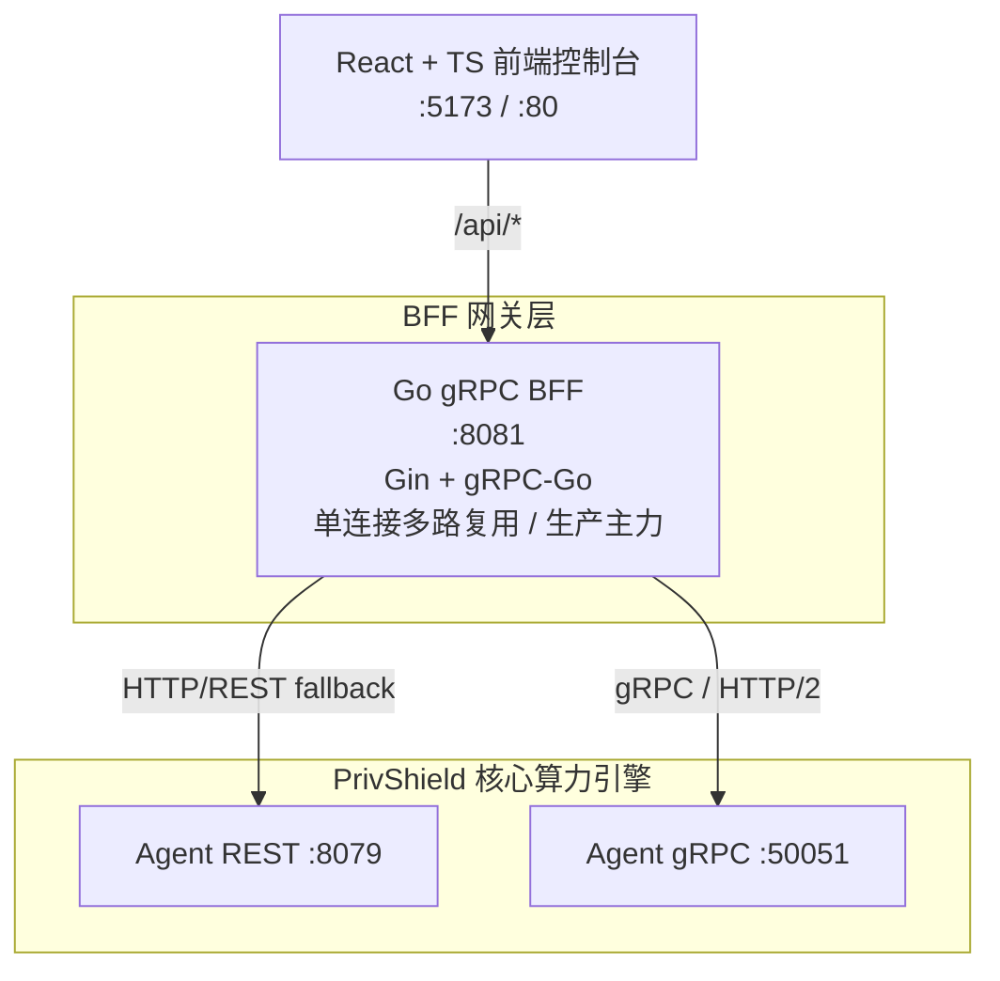

# 统一控制台与 BFF 代理网关 (Console & BFF Gateway)

数盾统一运维与测试控制台，提供现代化的 Web UI 交互界面与高性能的 API 代理网关（BFF），用于直观呈现隐私计算、动态分类分级、数据流通调度及合规审计全链路功能。

---

## 1. 统一 BFF 架构设计

数盾采用单一 Go BFF（Backend For Frontend）架构：



* **Go BFF (`bff-go:8081`)**：
  * 基于 Gin + gRPC-Go 构建；
  * 对外暴露 REST/JSON 接口，内部通过 gRPC 与 Agent 通信，部分场景通过 REST 回退；
  * 使用 Protobuf 结构体进行严格类型约束，通过 HTTP/2 多路复用大幅削减通信握手延迟；
  * 生产环境主力推荐，内置 mTLS 双向认证支持与前端静态文件独立托管；
  * **gRPC 自动重试**：内置可配置重试策略（默认最多 6 次，指数退避 1s→8s），`waitForReady=true` 连接等待就绪；
  * 📖 [可靠性能力详解](../../console/bff-go/docs/reliability.md)

> **历史说明**：早期版本曾存在 Python REST BFF（`console/bff-py`，端口 `:8080`）作为并行实现，用于开发调试。该实现已在后续重构中移除，当前统一由 `console/bff-go` 承载全部 BFF 职责。

---

## 2. 前端控制台 (Web UI)

* **技术栈**：React 18 + TypeScript + Vite + TailwindCSS + Lucide Icons；
* **极速热更新**：支持 Vite HMR（<50ms 本地热更新）；
* **功能工作台**：
  * 隐私原语交互面板（脱敏、DP 噪声注入、K-匿名分布、查询混淆对比）；
  * 动态分类分级评估面板（三层漏斗命中轨迹可视化、规则/NER/LLM 决策链呈现）；
  * 数据流通调度流水线大屏；
  * 模拟数据源资产目录与样本探查；
  * 不可篡改审计日志流水与哈希完整性核验工具。

---

## 3. 运行指南

```bash
# 启动 Agent + Go BFF + Web 前端（Vite 热更新）
bash ./scripts/dev/dev-bff-agent.sh

# 启用 mTLS 双向认证模式启动
bash ./scripts/dev/dev-bff-agent.sh --mtls

# 停止控制台服务
bash ./scripts/dev/dev-stop.sh
```
