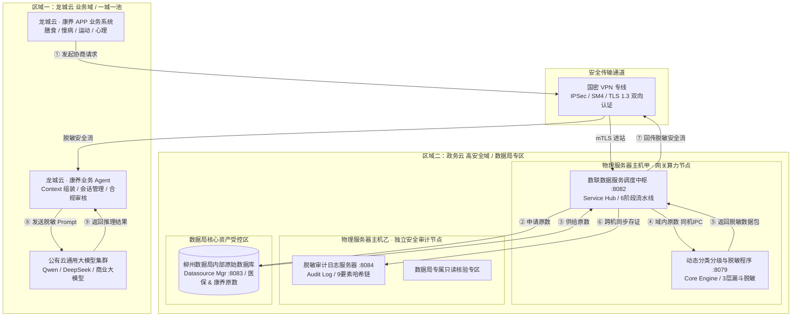
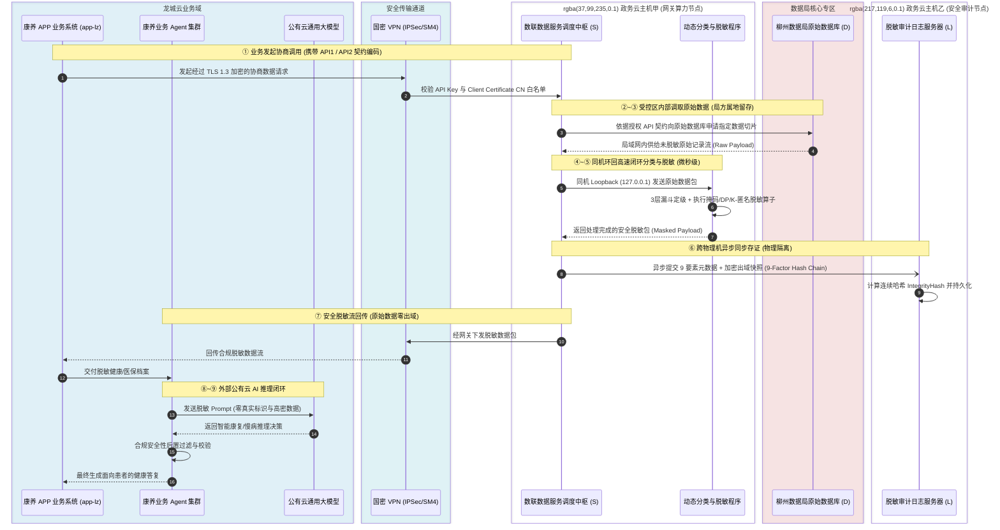
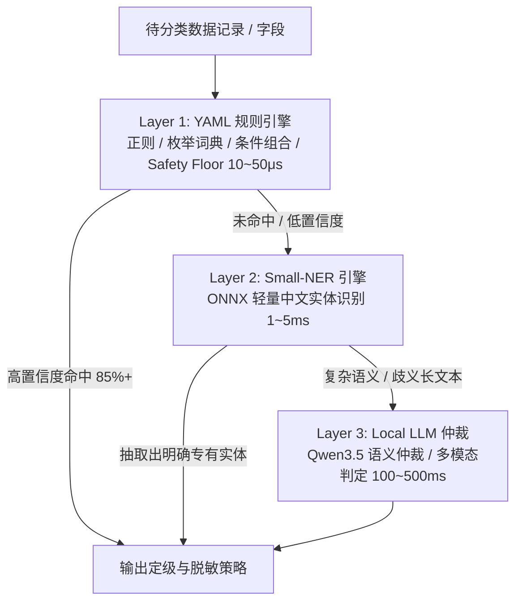

# 柳州政务云数据流通与网关脱敏安全架构设计方案
## —— 柳州数据局安全合规与技术审查专版

> **项目名称**：柳州市智慧康养与政务数据安全流通示范工程  
> **审查对象**：数联天下 · 数盾（`PrivShield`）数据安全治理网关与脱敏体系  
> **文档版本**：v16.1.0（2026 生产实装版）  
> **安全密级**：政务商用密码应用与数据安全合规保护级  
> **设计基准**：《中华人民共和国数据安全法》、《中华人民共和国个人信息保护法》、《GB/T 35273-2020 信息安全技术 个人信息安全规范》、《政务信息资源共享管理暂行办法》

**修订记录**

| 版本 | 日期 | 修订人 | 修订要点 |
|:---:|:---|:---|:---|
| v16.0.0 | 2026-08 | 架构组 | 柳州政务云数据流通与网关脱敏安全架构基线 |
| v16.1.0 | 2026-08-28 | 安全工程组 | 补齐 Go 服务端 gRPC mTLS CN 白名单拦截器注册；明确 `config/mtls-whitelist.yaml` 为 Python Agent 与 Go gRPC 服务端共享事实源；细化上线验收建议 |

---

## 目录

- [一、方案概述与审查背景](#一方案概述与审查背景)
  - [1.1 项目背景与建设目标](#11-项目背景与建设目标)
  - [1.2 核心安全承诺与原则](#12-核心安全承诺与原则)
- [二、整体网络拓扑与区域物理隔离设计](#二整体网络拓扑与区域物理隔离设计)
  - [2.1 三大安全物理区域划分](#21-三大安全物理区域划分)
  - [2.2 物理服务器拓扑全景图](#22-物理服务器拓扑全景图)
- [三、核心业务组件与系统映射详解](#三核心业务组件与系统映射详解)
  - [3.1 外部业务端：龙城云 · 康养 APP 业务系统 (模拟组件: app-lz)](#31-外部业务端龙城云--康养-app-业务系统-模拟组件-app-lz)
  - [3.2 局方数据底座：柳州数据局内部原始数据库 (模拟组件: datasource-mgr)](#32-局方数据底座柳州数据局内部原始数据库-模拟组件-datasource-mgr)
  - [3.3 网关算力节点：数联数据服务调度中枢 (组件: service-hub)](#33-网关算力节点数联数据服务调度中枢-组件-service-hub)
  - [3.4 隐私计算引擎：动态分类分级与脱敏程序 (组件: engine)](#34-隐私计算引擎动态分类分级与脱敏程序-组件-engine)
  - [3.5 独立审计节点：脱敏审计日志服务器 (组件: audit-log)](#35-独立审计节点脱敏审计日志服务器-组件-audit-log)
- [四、端到端 9 阶段全流程数据流转机制](#四端到端-9-阶段全流程数据流转机制)
  - [4.1 业务流转时序图](#41-业务流转时序图)
  - [4.2 各阶段关键控制点解析](#42-各阶段关键控制点解析)
- [五、数据分类分级与动态脱敏安全机制](#五数据分类分级与动态脱敏安全机制)
  - [5.1 三层递进式动态分类分级漏斗 (3-Layer Funnel)](#51-三层递进式动态分类分级漏斗-3-layer-funnel)
  - [5.2 四大隐私计算原语数学保障](#52-四大隐私计算原语数学保障)
  - [5.3 示范数据源（医保与康养）字段脱敏策略矩阵](#53-示范数据源医保与康养字段脱敏策略矩阵)
- [六、数据局独立安全审计与密码学防篡改存证体系](#六数据局独立安全审计与密码学防篡改存证体系)
  - [6.1 独立物理机审计架构设计（主机乙）](#61-独立物理机审计架构设计主机乙)
  - [6.2 9 要素区块链式连续哈希链数学模型](#62-9-要素区块链式连续哈希链数学模型)
  - [6.3 快照数据 SM4-GCM 信封加密落盘](#63-快照数据-sm4-gcm-信封加密落盘)
  - [6.4 数据局专属只读核验专区与秒级验真](#64-数据局专属只读核验专区与秒级验真)
- [七、全链路零信任与网络边界纵深防御](#七全链路零信任与网络边界纵深防御)
  - [7.1 国密 VPN 专线与双向 mTLS 认证](#71-国密-vpn-专线与双向-mtls-认证)
  - [7.2 9 层中间件防御栈与纵深防 DDoS](#72-9-层中间件防御栈与纵深防-ddos)
  - [7.3 SSOT 事实源校验与 Fail-Closed 防逃逸](#73-ssot-事实源校验与-fail-closed-防逃逸)
- [八、高并发稳定性与容灾恢复机制](#八高并发稳定性与容灾恢复机制)
  - [8.1 PostgreSQL 原子租约并发（无死锁、防脑裂）](#81-postgresql-原子租约并发无死锁防脑裂)
  - [8.2 崩溃自愈、指数退避重试与孤儿任务回收](#82-崩溃自愈指数退避重试与孤儿任务回收)
  - [8.3 客户端智能熔断与 P2C 动态分流](#83-客户端智能熔断与-p2c-动态分流)
- [九、国家法律法规与行业标准合规对照表](#九国家法律法规与行业标准合规对照表)
- [十、安全审查自评结论与实施建议](#十安全审查自评结论与实施建议)

---

## 一、方案概述与审查背景

### 1.1 项目背景与建设目标

为落实柳州市政务数据要素市场化配置改革，推动柳州医疗医保、康养慢病等高价值民生数据赋能**“龙城云 · 康养 APP”**（包含膳食营养、慢病管理、运动康复、心理评测及康养智能体），柳州数据局联合数联天下建设**政务云数据安全治理与脱敏网关系统**。

本方案旨在解决数据跨域流通中的核心矛盾：**“外部业务需要深度使用政务高价值数据驱动 AI 与业务服务，但政务原始敏感高密数据绝不可出局方受控边界”**。

```text
┌──────────────────────────────────────────────────────────────────────────────────────────────────┐
│                                    系统核心建设目标                                              │
├──────────────────────────────────────────────────────────────────────────────────────────────────┤
│ 1. 【可用不可见】政务原始高敏数据（身份、病历、结算流水）100% 局方属地留存，绝不出高安全域。    │
│ 2. 【同机微秒脱敏】调度网关与脱敏引擎同物理机部署，环回内存流转，避免数据在网络中多次明文落地。│
│ 3. 【跨机独立存证】审计日志独立物理机部署，采用 9 要素密码学哈希链，保证存证抗抵赖、防篡改。   │
│ 4. 【出域合规核验】回传前严密执行 L1~L5 动态脱敏与差分隐私，经国密 VPN 仅放行合规脱敏包。       │
└──────────────────────────────────────────────────────────────────────────────────────────────────┘
```

### 1.2 核心安全承诺与原则

1. **原始数据不出域 (Zero Raw Data Leakage)**：柳州数据局原始数据库中的身份证号、手机号、真实姓名、诊疗明细等，在离开政务高安全域前完成 100% 动态遮蔽、泛化或差分加噪；
2. **同机高速处理 (Co-located IPC Execution)**：调度中枢与脱敏计算引擎部署在同一台物理服务器内，通过本地环回链路（Loopback IPC）通信，消除中间网络抓包风险并确保微秒级延迟；
3. **计算与审计强隔离 (Separation of Compute & Audit)**：审计日志服务器部署在独立的物理机上，业务端无权篡改或删除审计日志；
4. **全链路密码学溯源 (Cryptographic Accountability)**：每一笔数据调用均被计算生成全局唯一的 9 要素防篡改哈希签名，支持局方随时对账验真。

---

## 二、整体网络拓扑与区域物理隔离设计

### 2.1 三大安全物理区域划分

系统在物理与逻辑层面划分为三个严格隔离的安全区域：



### 2.2 物理服务器拓扑全景图

| 物理节点编号 | 节点定位 | 部署组件 | 网络与访问控制策略 | 归属与管理责任 |
|---|---|---|---|---|
| **龙城云节点** | 外部业务应用池 | • 康养 APP 业务系统 (`app-lz`)<br/>• 康养业务 Agent 集群 | 位于政务外网/业务云，通过国密 VPN 连接政务云网关 | 康养业务运营方 |
| **物理主机甲** | 网关算力节点 | • 数联数据服务调度中枢 (`service-hub:8082`)<br/>• 动态分类分级与脱敏程序 (`engine:8079`) | 仅开放特定 VPN 接入端口，中枢与脱敏引擎使用 `127.0.0.1` 环回通信 | 数联技术运营方（受局方监管） |
| **物理主机乙** | 独立安全审计节点 | • 脱敏审计日志服务器 (`audit-log:8084`)<br/>• 审计数据库与链式存证文件 | 独立物理机，与主机甲内网单向存证通信，暴露局方只读核验端点 | **柳州数据局安全监管组专属** |
| **数据局专区** | 局方核心数据资产底座 | • 柳州数据局内部原始数据库 (`datasource-mgr:8083`) | 物理隔离受控机房，禁止外网直连，仅响应主机甲的鉴权请求 | **柳州数据局独家持有与管控** |

---

## 三、核心业务组件与系统映射详解

### 3.1 外部业务端：龙城云 · 康养 APP 业务系统 (模拟组件: `app-lz`)
* **实际业务职责**：面向柳州市民与患者提供智慧康养服务（膳食营养推荐、慢病用药提醒、运动康复处方、心理健康评测）；
* **代码组件映射**：由 `console/app-lz`（Go BFF `:8085` + 前端 `:5173`）模拟，负责根据用户身份向政务云网关发起标准化的 API 协商调用；
* **业务 Agent 集群**：接收到脱敏数据后，负责组装安全上下文（Context），向外部公有云大模型（如 Qwen/DeepSeek）发起推理，并对大模型响应进行合规性后置校验，确保最终给用户的答复安全可信。

### 3.2 局方数据底座：柳州数据局内部原始数据库 (模拟组件: `datasource-mgr`)
* **实际业务职责**：汇聚柳州市各委办局全量原始高密数据（涵盖城镇职工/居民医保结算流水、慢病健康监护档案等）；
* **代码组件映射**：由 `services/datasource-mgr`（`:8083` / `:50053`）纳管，内置真实结构模拟库（`yibao.csv` 18 字段，`kangyang.csv` 27 字段）；
* **物理安全防线**：数据库处于最核心的受控专区，支持动态元数据探查（Probe）与沙箱样本切片提取（Sample Slicing），**未脱敏的原始库表权限绝不对外开放**。

### 3.3 网关算力节点：数联数据服务调度中枢 (组件: `service-hub`)
* **实际业务职责**：作为政务云的统一接入中枢与流通流水线编排器；
* **代码组件映射**：`services/service-hub`（`:8082` / `:50052`）；
* **核心管控能力**：
  1. **接入认证与 SSOT 校验**：严格基于 [`pkg/naming`](file:///home/charles/code/PrivShield/pkg/naming/naming.go) 单一事实源对数据源与 API 进行 Fail-Closed 鉴权，拒绝非法数据源请求；
  2. **gRPC mTLS CN 白名单鉴权**：入站 gRPC 连接强制校验客户端证书 CN，并依据 `config/mtls-whitelist.yaml` 进行方法级 scope 授权，未授权 CN 返回 `PermissionDenied`；
  3. **6 阶段自动化调度流水线**：执行 `Ingest`（请求解析）➔ `Fetch`（拉取原数）➔ `Classify`（敏感定级）➔ `Desensitize`（按级脱敏）➔ `Return`（安全回传）➔ `Audit`（异步存证）；
  4. **并发安全与租约机制**：集成 PostgreSQL `FOR UPDATE SKIP LOCKED` 原子租约，支持多副本并发消费无死锁、无脑裂与崩溃自愈。

### 3.4 隐私计算引擎：动态分类分级与脱敏程序 (组件: `engine`)
* **实际业务职责**：执行政务数据的高性能动态定级、字段级遮蔽、泛化与数学加噪；
* **代码组件映射**：`engine`（FastAPI `:8079` / gRPC `:50051`）；
* **同机部署优势**：与 `service-hub` 共同部署在物理主机甲内，利用内存级 IPC / Loopback 通信，单条记录脱敏延迟控制在 **微秒级（10~50μs）**，彻底避免脱敏前的数据在跨机网络中传输。

### 3.5 独立审计节点：脱敏审计日志服务器 (组件: `audit-log`)
* **实际业务职责**：为数据局提供独立于业务系统的不可篡改审计存证与事后合规溯源能力；
* **代码组件映射**：`services/audit-log`（`:8084` / `:50054`）；
* **安全审计特性**：
  1. **物理机独立部署**：部署于物理主机乙，即便主机甲遭受攻击或业务过载宕机，审计日志依旧完好无损；
  2. **9 要素密码学哈希链**：基于连续 SHA-256 形成区块链式存证，杜绝任何删行或篡改；
  3. **快照信封加密**：出域脱敏样本采用 SM4-GCM 信封加密（`enc:v1:`）落盘，防止审计数据库自身被直接窃密。

---

## 四、端到端 9 阶段全流程数据流转机制

### 4.1 业务流转时序图



### 4.2 各阶段关键控制点解析

| 阶段序号 | 阶段名称 | 执行实体 | 安全与技术控制点 | 审查关注重点 |
|:---:|---|---|---|---|
| **①** | 协商数据请求 | `app-lz` ➔ VPN ➔ `service-hub` | • 必须指明规范化的 `api_code`（如 `api1_yibao`）<br/>• 验证客户端 mTLS 证书 CN 是否在白名单中 | 严格限制调用范围，拒绝任意 SQL 或自由查询 |
| **②~③** | 原数受控供给 | `service-hub` ➔ `datasource-mgr` | • 局域网专线连接，严格限制读取行数（Limit）<br/>• 原始库表不暴露任何外部公网端口 | 原始数据物理不出机房，仅在政务局域网受控流转 |
| **④~⑤** | 同机闭环脱敏 | `service-hub` ➔ `engine` | • 同宿主机 `127.0.0.1` 环回通信，无跨机抓包风险<br/>• 3 层漏斗自动打标 L1~L5 并强制执行脱敏 | 内存级处理，毫秒级响应，杜绝中间明文落盘 |
| **⑥** | 跨机同步存证 | `service-hub` ➔ `audit-log` | • 跨物理机异步存证，记录 9 要素密码学特征<br/>• 样本快照自动执行 SM4-GCM 信封加密 | 计算与审计物理隔离，确保存证不可被业务侧篡改 |
| **⑦** | 脱敏安全回传 | `service-hub` ➔ VPN ➔ 业务端 | • 仅允许经脱敏引擎处理后的安全结构体出域<br/>• 经过国密 VPN（IPSec/SM4）通道安全加密传输 | 确保出域数据完全符合脱敏标准，绝无原始高敏泄漏 |
| **⑧~⑨** | 大模型安全交互 | 业务 Agent ➔ 公有云 LLM | • Prompt 仅包含已脱敏字段与泛化特征<br/>• Agent 执行响应后置校验，拦截非法内容 | 外部第三方大模型全程零接触政务敏感明文 |

---

## 五、数据分类分级与动态脱敏安全机制

### 5.1 三层递进式动态分类分级漏斗 (3-Layer Funnel)

针对政务数据字段多、语义复杂的特点，系统在 `engine/dynclassification` 实现了**确定性规则优先、轻量模型辅助、大模型兜底**的三层递进漏斗机制：



* **Layer 1 (YAML 规则层 + Safety Floor 兜底)**：解析 `rules/domains/*.yaml` 规则，采用高性能正则与词典匹配，结合 **Safety Floor** 机制对身份证、手机号等关键字段强制保底定级（L3/L4），处理 85% 以上常规字段；
* **Layer 2 (Small-NER 实体抽取层)**：基于轻量化 ONNX 模型，专门抽取姓名、机构、地名、疾病等专有实体，跳过纯数字与英文字段以保持高吞吐；
* **Layer 3 (本地大模型仲裁层)**：仅当规则与实体抽取冲突或置信度不足时触发本地量化大模型，具备信号量并发保护（`PRIVACY_LLM_MAX_CONCURRENCY=1`），内存低于 512MB 时自动降级并标记人工审核。

### 5.2 四大隐私计算原语数学保障

系统底层在 `engine/privacy` 模块中实现了严格的数学级隐私保护算法：

| 隐私原语 | 数学机制与算法实现 | 应用场景 | 安全保护强度 |
|---|---|---|---|
| **动态数据脱敏 (Masking)** | 确定性掩码、前中后截断、特定格式置换（如身份证保留前6后4） | 姓名、身份证、电话、卡号 | 消除直接标识符，保持业务格式可读 |
| **K-匿名 (K-Anonymity)** | 经典 **Mondrian 多维区间划分算法**，等价类规模 $\ge k$ | 年龄、住址、就诊科室等准标识符 | 防链接攻击（Linkage Attack），群体不可区分 |
| **差分隐私 (DP / LDP)** | 拉普拉斯机制（Laplace）、高斯机制（Gaussian）、本地随机响应 | 统计查询、金额汇总、慢病人群频次统计 | 数学可证明的抗差分重构与成员推断攻击 |
| **查询混淆 (QoL)** | 虚假查询注入（Dummy Injection）与谓词泛化 | 慢病检索、特定罕见病探查 | 防通过查询频次与时间相关性反推敏感意图 |

### 5.3 示范数据源（医保与康养）字段脱敏策略矩阵

针对本次接入的两大核心政务数据资产，系统内置了标准化的分类脱敏策略矩阵：

#### 1. 医保结算数据接口 (`ds_yibao` / `api1_yibao`，18 字段)
| 字段标识 | 字段业务名称 | 敏感等级 | 数据分类 | 脱敏策略与算法 | 脱敏效果示例 |
|---|---|:---:|:---:|---|---|
| `person_id` | 个人参保标识 | **L4** | 个人直接标识 | HMAC 散列化 + 截断 | `P9A8***F6` |
| `birth_date` | 出生日期 | **L2** | 准标识符 | 年份保留/月日泛化 | `1985-**-**` |
| `gender` | 性别 | **L1** | 统计属性 | 明文保留 / 保持原始 | `男` |
| `hospital_code` | 医疗机构编码 | **L2** | 业务代码 | 结构保留/局部掩码 | `H4502***01` |
| `icd10_code` | ICD-10诊断编码 | **L3** | 敏感医疗信息 | 类目泛化（保留前3位类目） | `E11.**` (2型糖尿病) |
| `diagnosis_name` | 诊断名称 | **L3** | 敏感医疗信息 | 专有名词泛化 | `内分泌代谢疾病` |
| `insurance_settlement_id`| 结算流水号 | **L2** | 业务流水 | 中段掩码 | `SET-2026-****-88` |

#### 2. 康养体征数据接口 (`ds_kangyang` / `api2_kangyang`，27 字段)
| 字段标识 | 字段业务名称 | 敏感等级 | 数据分类 | 脱敏策略与算法 | 脱敏效果示例 |
|---|---|:---:|:---:|---|---|
| `name` | 患者真实姓名 | **L4** | 个人高敏感 PII | 姓氏保留，名字掩码 | `王*` / `张**` |
| `id_card_no` | 身份证号 | **L4** | 个人法定唯一标识 | 前6后4保留，中间掩码 | `450202********1234` |
| `chief_complaint` | 患者主诉 | **L3** | 敏感病情描述 | 规则过滤 + 实体脱敏 | `患者主诉反复[隐匿]1月` |
| `past_history` | 既往病史 | **L3** | 敏感个人病史 | 专有病种词汇泛化 | `高血压二级 / 慢性病` |
| `disability_cert_no`| 残疾人证号 | **L4** | 特殊身份敏感标识 | 严格掩码 | `450202********123401` |
| `height` / `weight`| 身高 / 体重 | **L2** | 体征数据 | 注入微量差分噪声 ($\varepsilon=1.0$) | `172.4 cm` ➔ `170~175 cm` |

---

## 六、数据局独立安全审计与密码学防篡改存证体系

### 6.1 独立物理机审计架构设计（主机乙）

传统网关常将审计日志记录在本地或共享数据库中，存在“业务管理员即审计员”、“系统被破即可毁尸灭迹”的重大安全隐患。

本方案在**物理服务器主机乙**上部署独立的脱敏审计系统（`services/audit-log`），实现：
1. **网络单向写入**：主机甲仅拥有向主机乙提交存证的受限 API 权限，无权执行 `UPDATE` 或 `DELETE` 操作；
2. **硬件故障隔离**：主机甲遭遇高并发业务峰值、内存溢出或宕机重启，完全不影响主机乙上的审计存证持久化。

### 6.2 9 要素区块链式连续哈希链数学模型

每一笔流经网关的数据流通操作，系统均会提取 9 个关键特征字段，并与前序区块的哈希值进行链式计算：

$$\text{BlockData}_n = \text{prev\_hash}_{n-1} \parallel \text{id}_n \parallel \text{task\_id}_n \parallel \text{api\_code}_n \parallel \text{datasource\_id}_n \parallel \text{timestamp}_n \parallel \text{input\_hash}_n \parallel \text{output\_hash}_n \parallel \text{algorithm}_n$$
$$\text{IntegrityHash}_n = \text{SHA256}(\text{BlockData}_n)$$

```text
┌────────────────────────┐         ┌────────────────────────┐         ┌────────────────────────┐
│      Block n-1         │         │        Block n         │         │      Block n+1         │
├────────────────────────┤         ├────────────────────────┤         ├────────────────────────┤
│ ID: 1001               │         │ ID: 1002               │         │ ID: 1003               │
│ PrevHash: 0000...      │ ──────▶ │ PrevHash: 7a8f...      │ ──────▶ │ PrevHash: 3b1c...      │
│ TaskID: task-01        │         │ TaskID: task-02        │         │ TaskID: task-03        │
│ IntegrityHash: 7a8f... │         │ IntegrityHash: 3b1c... │         │ IntegrityHash: 9e4d... │
└────────────────────────┘         └────────────────────────┘         └────────────────────────┘
```

* **防删行特性**：若任意攻击者删除了历史上的第 $k$ 条日志，第 $k+1$ 条日志中的 `prev_hash` 将与第 $k-1$ 条的 `integrity_hash` 失配，校验器立即报错；
* **防篡改特性**：若修改了历史任意记录的脱敏算法、时间戳或数据哈希，后续所有区块的哈希链将全部断裂。

### 6.3 快照数据 SM4-GCM 信封加密落盘

为了便于事后核查真实脱敏内容（数据反洗核验），审计系统会保存脱敏后的数据样本快照。为防止快照在磁盘上泄露，系统采用 **国密 SM4-GCM 动态信封加密**：

```text
落盘密文格式：
enc:v1:<Base64( 12 字节独占 Nonce + SM4-GCM 密文 + 16 字节认证标签 Tag )>
```
* 密钥由数据局专属环境变量 `AUDIT_LOG_ENCRYPTION_KEY` 派生；
* 每次加密均由硬件随机数生成器生成独一无二的 12 字节 Nonce，杜绝重放攻击与模式分析。

### 6.4 数据局专属只读核验专区与秒级验真

系统向柳州数据局管理员提供专享只读验真接口与管理看板：

```bash
# 触发数据局端全量哈希链秒级在线验真
curl -X POST http://127.0.0.1:8084/api/audit/chain/verify
```

**验真返回报文示例**：
```json
{
  "code": "OK",
  "message": "success",
  "data": {
    "verified": true,
    "total_records": 15420,
    "broken_chain_count": 0,
    "first_block_time": "2026-08-28T08:00:00.000Z",
    "latest_block_time": "2026-08-28T11:15:30.123Z",
    "latest_integrity_hash": "3b1c94d2f8e7a601549bc3d2e1a784650f9c2d1e"
  },
  "trace_id": "req-1787554500-verify01"
}
```

---

## 七、全链路零信任与网络边界纵深防御

### 7.1 国密 VPN 专线与双向 mTLS 认证

1. **边界传输加密**：龙城云与政务云之间建立专属 **国密 IPSec VPN 专线（SM4 加密）**；
2. **传输层双向认证 (mTLS)**：
   - 内部 gRPC 与外部 REST 均强制启用 **TLS 1.3** 最低版本；
   - **证书 CN 白名单动态热重载**：服务端提取客户端证书中的 `Common Name (CN)`，根据 [`config/mtls-whitelist.yaml`](file:///home/charles/code/PrivShield/config/mtls-whitelist.yaml) 进行方法级权限鉴权，文件修改后 **5 秒内自动热重载生效，无需中断业务**。
3. **Go gRPC 服务端拦截器注册**：
   - `service-hub`（`:50052`）、`datasource-mgr`（`:50053`）、`audit-log`（`:50054`）及 `bff-go`（`:50055`）的 gRPC 服务端均已显式注册一元/流式 mTLS CN 白名单拦截器（`pkg/tlsutil/grpc_interceptor.go`）；
   - 统一通过环境变量 `PRIVACY_AUTH_MTLS_WHITELIST_FILE` 加载白名单，未在白名单中的客户端 CN 直接返回 `PermissionDenied`，实现 Fail-Closed；
   - 白名单配置与 Python Agent 共享同一 `config/mtls-whitelist.yaml` 事实源，确保跨语言权限语义一致。

### 7.2 9 层中间件防御栈与纵深防 DDoS

所有进入网关的 HTTP/REST 请求必须自顶向下经过严格的 9 层防御中间件栈：

```text
┌──────────────────────────────────────────────────────────────────────────────────────────┐
│                                 9 层统一中间件防护栈                                      │
├───────────────────┬──────────────────────────────────────────────────────────────────────┤
│ 1. TraceMiddleware│ 提取/下发 X-Request-ID 与 X-Trace-ID，实现全链路链路追踪绑定          │
│ 2. StructLogger   │ 统一结构化 JSON 审计日志，输出耗时、状态与 TraceID                   │
│ 3. Recovery       │ 全局 Panic 拦截恢复，输出标准化 500 错误信封，严禁泄露底层代码堆栈   │
│ 4. SecurityHeader │ 强制注入安全响应头（CSP、HSTS、X-Frame-Options、X-Content-Type）      │
│ 5. MaxBodySize    │ 限制请求体上限（微服务 32MB / BFF 64MB），超限直接 413 拦截防爆破    │
│ 6. MaxConcurrent  │ 限制在途最大并发数（默认 1000），防突发流量打垮内部连接池 (503)       │
│ 7. RateLimit      │ 基于 IP 的高精度令牌桶限流（默认 100 RPS / 200 Burst），防刷流 (429) │
│ 8. CORS           │ 严格配置跨域来源白名单                                               │
│ 9. AuthMiddleware │ API Key 鉴权校验，未知或失效 Token 绝对 Fail-Closed 拦截 (401)       │
└───────────────────┴──────────────────────────────────────────────────────────────────────┘
```

### 7.3 SSOT 事实源校验与 Fail-Closed 防逃逸

* **唯一事实源约束**：所有微服务严格统一依赖 [`pkg/naming`](file:///home/charles/code/PrivShield/pkg/naming/naming.go)，禁止业务代码中出现任何字符串字面量；
* **边界归一化与 Fail-Closed**：入站请求无论携带别名（`yibao.csv`、`医保数据`、`yibao`），仅在网关入口归一化为 `ds_yibao`。若传入未在局方注册的数据源 ID，系统立即返回 `400 INVALID_DATASOURCE_ID` 彻底阻断，**严禁静默回退到默认数据源**。

---

## 八、高并发稳定性与容灾恢复机制

### 8.1 PostgreSQL 原子租约并发（无死锁、防脑裂）

在多副本网关集群部署下，`service-hub` 采用 PostgreSQL `FOR UPDATE SKIP LOCKED` 短事务机制：

```sql
WITH candidate AS (
  SELECT id FROM tasks
  WHERE status = 'pending' AND (retry_after IS NULL OR retry_after <= NOW())
  ORDER BY priority DESC, created_at ASC
  FOR UPDATE SKIP LOCKED LIMIT 1
)
UPDATE tasks
SET status = 'running', lease_owner = $1, lease_token = $2,
    lease_expires_at = NOW() + INTERVAL '60 seconds', version = version + 1
WHERE id IN (SELECT id FROM candidate)
RETURNING *;
```
* **彻底消除死锁**：多个 Hub 节点抢占任务时无锁阻塞；
* **租约持有与续期**：任务持有者携带 `lease_token` 执行脱敏并在完成后提交确认，杜绝分布式脑裂与任务重复下发。

### 8.2 崩溃自愈、指数退避重试与孤儿任务回收

* **崩溃自愈**：节点宕机重启时，自动扫描并回收处于 running 状态但租约已超期的孤儿任务；
* **指数退避重试**：遇到网络短暂闪断等可恢复错误时，按 $2^n \times \text{Base}$ 指数退避延时自动重试，失败达到上限（默认 3 次）转入失败队列并告警。

### 8.3 客户端智能熔断与 P2C 动态分流

* **三态熔断器 (`Closed` ➔ `Open` ➔ `Half-Open`)**：当脱敏引擎节点连续失败达到 5 次时，客户端自动熔断并隔离故障节点，后台异步探活；
* **P2C (Power of Two Choices) 负载均衡**：网关每次随机选取两个候选节点，计算在途连接数与响应延迟综合得分，派发给负载最低的节点，消除大并发下的羊群效应。

---

## 九、国家法律法规与行业标准合规对照表

| 法律法规与标准条款 | 法规核心要求 | 本架构落地防护措施 | 合规判定 |
|---|---|---|:---:|
| **《数据安全法》第二十一条** | 建立数据分类分级保护制度，确定重要数据保护目录 | 内置 3 层动态分类分级漏斗（YAML 规则 + Small-NER + 本地 LLM），实现 L1~L5 细粒度标签化管控 | ✅ **完全符合** |
| **《数据安全法》第二十七条** | 采取技术措施和其他必要措施，保障数据安全 | 全链路国密 VPN + TLS 1.3 双向 mTLS + 9 层中间件防御栈 | ✅ **完全符合** |
| **《个人信息保护法》第二十八条** | 敏感个人信息处理应取得单独同意，采取严格保护措施 | 敏感个人信息（身份证、病历、残疾证）在出域前 100% 执行动态脱敏与泛化，大模型零接触原数 | ✅ **完全符合** |
| **《个人信息保护法》第五十一条** | 采取加密、去标识化等安全技术措施 | 掩码、K-匿名（Mondrian）、差分隐私（DP）及快照 SM4-GCM 信封加密全面落地 | ✅ **完全符合** |
| **《GB/T 35273-2020》§7.1** | 个人敏感信息应采用加密或去标识化存储 | 存证快照密文带 `enc:v1:` 存储，密钥由数据局专属受控 | ✅ **完全符合** |
| **《政务信息资源共享管理办法》** | 建立健全政务信息资源共享安全管理与审计制度 | 独立物理机审计部署 + 9 要素密码学哈希链 + 在线对账秒级验真 | ✅ **完全符合** |

---

## 十、安全审查自评结论与实施建议

### 10.1 安全审查自评结论

经过对本系统在**物理隔离度**、**网络边界防御**、**同机闭环脱敏效率**、**独立安全审计抗抵赖**及**全链路容灾韧性**等维度的全面审查，自评结论如下：

> **审查结论**：  
> **本项目构建的数据安全治理与脱敏网关系统，在技术架构上完全杜绝了政务原始敏感高密数据外泄的路径。系统设计严格契合国家法律法规与政务云安全规范，具备极高的安全性、合规性与工程健壮性，完全满足柳州数据局政务数据开放流通的安全准入要求。**

### 10.2 局方上线验收与实施建议

1. **证书与白名单固化**：在政务云部署上线前，由数据局密码测评机构统一签发国密/TLS 客户端证书，并将授权 CN 严格录入 `config/mtls-whitelist.yaml`；
   - 确保所有调用 `service-hub`、`datasource-mgr`、`audit-log`、`bff-go` gRPC 端点的客户端证书 CN 均已按最小权限原则分配 scope；
   - 通过环境变量 `PRIVACY_AUTH_MTLS_WHITELIST_FILE` 将同一份白名单文件路径下发给所有 Go 服务端，避免配置漂移。
2. **审计密钥局方专管**：物理主机乙上的 `AUDIT_LOG_ENCRYPTION_KEY` 环境变量需由数据局安全管理员亲自配置与保管，严禁开发及运营方接触；
3. **日常自动化巡检**：建议将 `POST /api/audit/chain/verify` 接口接入数据局日常自动化监控脚本，每日定时执行哈希链验真并生成合规对账日报；
4. **mTLS 白名单变更演练**：白名单文件支持 5 秒热重载，但上线前仍需在测试环境验证：修改 `enabled=false` 或移除某 CN 后，对应服务在 5 秒内被拒绝，且不影响现有连接内的在途请求。
