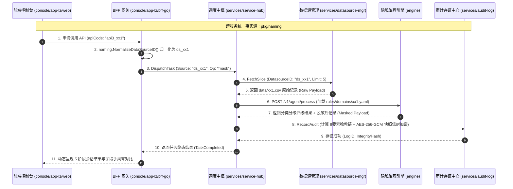
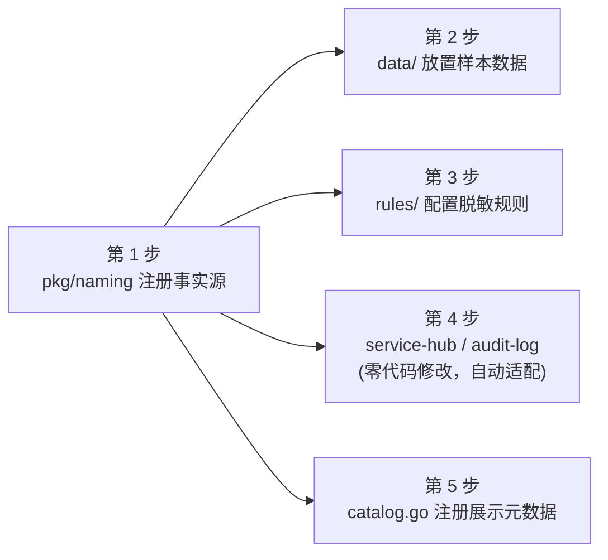

# 新增数据接口（Data API）全链路扩展与命名规范设计

> **本文档为 PrivShield 体系下新增业务数据接口（如 `ds_xx1` / `api3_xx1`）的标准架构设计与扩展实施指南（SOP）。**  
> 旨在确保跨服务（Go 微服务群、Python 隐私计算引擎、TypeScript 前端控制台）实现**统一命名规范**、**单一事实源（Single Source of Truth, SSOT）**、**零语义漂移**与**快速敏捷接入**。

---

## 1. 概述与设计哲学

在分布式数据流通与隐私治理平台中，业务数据源（如医保结算、康养体征、金融流水、政务协同等）的字段结构、分类分级策略与流转链路各不相同。如果各微服务独立维护数据源名称、接口路径与字段映射，极易导致：
1. **命名语义漂移**：前端传 `yibao`，调度中枢用 `ds_yibao`，审计存证记录 `medical_insurance`，导致全链路追踪断裂；
2. **重复开发与硬编码**：每增加一个数据接口，需要修改多个微服务中的路由、校验器和模型；
3. **安全漏洞**：未知或未校验的数据源标识被意外透传，破坏 Fail-closed 安全防御边界。

### 1.1 核心设计原则

- **单一事实源原则 (Single Source of Truth, SSOT)**：  
  跨服务业务标识在 [`pkg/naming/naming.go`](../../pkg/naming/naming.go) 集中注册，所有 Go 微服务（`service-hub`、`datasource-mgr`、`audit-log`、`console/bff-go`、`console/app-lz/bff-go`）直接依赖该包，实现**一处定义、全服务生效**。
- **边界归一化与 Fail-Closed**：  
  允许入站请求携带别名（如文件名 `xx.csv`、中文名 `XX数据`、Slug `xx`），但**只允许在服务入口边界被归一化一次**（`naming.NormalizeDataSourceID()`），内部流转统一使用 Canonical 标准标识。未知或预留标识直接拦截拒绝。
- **编译期静态约束**：  
  业务代码禁止出现裸字符串字面量（如 `"ds_xx1"`），一律引用 `naming.DSXX1` 常量，利用编译器消除拼写错误。
- **泛型数据负载流转**：  
  调度中枢与审计存证针对业务载荷采用泛型 JSON（`map[string]any`）传输，新增数据源无需重构数据传输对象（DTO）。

---

## 2. 全局命名规范与四位一体标准矩阵

为保证全局一致性，每个新增业务接口必须严格遵循**四位一体命名规范**：

```text
┌─────────────────────────────────────────────────────────────────────────────────────────────────┐
│                                  四位一体命名规范矩阵                                              │
├─────────────────────┬───────────────────────────┬───────────────────────────────────────────────┤
│ 规范维度             │ 格式命名约束              │ 示例 (`ds_xx1`)                               │
├─────────────────────┼───────────────────────────┼───────────────────────────────────────────────┤
│ **1. 数据源唯一标识** │ `^ds_[a-z][a-z0-9_]{1,30}$`│ `ds_xx1` (常量: `naming.DSXX1`)              │
│ **2. 业务 API 编码** │ `^api[1-9]_[a-z0-9_]{1,30}$`│ `api3_xx1` (常量: `naming.API3XX1`)          │
│ **3. 原始数据集文件** │ `<domain>.csv`            │ `data/xx1.csv`                                │
│ **4. 分类脱敏规则集** │ `rules/domains/<domain>.yaml` | `rules/domains/xx1.yaml`                     │
└─────────────────────┴───────────────────────────┴───────────────────────────────────────────────┘
```

### 2.1 规范详情说明

1. **数据源标识 (DataSource ID)**：全局唯一的底层数据源实体名，前缀固定为 `ds_`，用于数据源切片管理、任务元数据与审计存证。
2. **API 稳定编码 (API Code)**：面向外部调用方与控制台的 API 编号，前缀为 `api<序号>_`，用于服务目录展示与 API 申请调度。
3. **数据集文件 (Dataset File)**：存放于 `data/` 目录下，作为该数据源的静态样本与模拟数据源。
4. **领域规则文件 (Domain Rules)**：存放于 `rules/domains/` 目录下，定义该数据源特有字段的分类分级标准与脱敏策略。

---

## 3. 全链路架构拓扑与数据流转

新增数据接口在各核心组件之间的协同关系如下：



---

## 4. 新增数据接口标准实施路径 (5 步 SOP)

以下以新增 **`ds_xx1` / `api3_xx1`**（XX业务数据接口）为例，演示完整的标准化接入步骤。



---

### 第 1 步：在 `pkg/naming` 中注册核心事实源

打开 [`pkg/naming/naming.go`](../../pkg/naming/naming.go)，完成常量声明与注册表追加：

```go
// 1. 声明 canonical 常量
const (
    API3XX1 = "api3_xx1" // 新增 API 编码
    DSXX1   = "ds_xx1"   // 新增数据源 ID
)

// 2. 在 Registry 切片中追加条目
var Registry = []Entry{
    // ... 原有 DSYibao, DSKangyang 条目 ...
    {
        APICode:      API3XX1,
        DataSourceID: DSXX1,
        Seq:          3,
        DisplayName:  map[string]string{
            "zh-CN": "XX业务流转数据接口",
            "en-US": "XX Business Workflow API",
        },
        Category:     "business_flow",
        FileName:     "xx1.csv",
        FieldCount:   15,
        Aliases: []string{
            "xx1", "xx1.csv", "XX业务", "XX数据", "business_flow",
        },
        Status: StatusActive, // 标记为已激活
    },
}
```

> **底层生效机制**：
> - `naming.NormalizeDataSourceID("xx1")` 自动映射为 `"ds_xx1"`；
> - `naming.ValidateDatasourceID("ds_xx1")` 自动判定为合法并放行；
> - `service-hub`、`datasource-mgr`、`audit-log` 等服务即刻感知，**无需修改任何 Go 微服务的鉴权与校验逻辑**。

---

### 第 2 步：在 `services/datasource-mgr` 中接入数据资产

1. **放置样本数据文件**：  
   创建并放入 [`data/xx1.csv`](../../data/) 文件，包含真实或模拟的业务字段表头与行数据：
   ```csv
   trade_no,user_name,id_card,phone_number,trade_amount,trade_time,terminal_ip
   TX-2026-001,王建国,510101198505051234,13900001111,2500.00,2026-08-25 10:30:00,192.168.1.100
   TX-2026-002,李淑珍,510101199008085678,13811112222,880.50,2026-08-25 11:15:20,192.168.1.101
   ```
2. **验证数据源切片提取**：  
   `datasource-mgr` 会根据注册表中的 `FileName: "xx1.csv"` 自动定位文件，支持通过 REST 接口拉取数据切片：
   ```bash
   curl -s http://127.0.0.1:8083/api/datasources/ds_xx1/slice?limit=2 | jq .
   ```

---

### 第 3 步：在 `engine` 中配置动态分类分级与脱敏规则

1. **新建领域规则配置文件**：  
   在 [`rules/domains/`](../../rules/domains/) 目录下新建 `xx1.yaml`：
   ```yaml
   # rules/domains/xx1.yaml
   domain: xx1
   version: "1.0.0"
   description: "XX业务流转数据分类分级与脱敏治理规则"

   rules:
     - id: rule-xx1-name
       field: user_name
       level: L2
       category: pii
       matchers:
         - operator: regex
           pattern: "^[\\u4e00-\\u9fa5]{2,4}$"
       action: mask_name

     - id: rule-xx1-idcard
       field: id_card
       level: L3
       category: pii
       matchers:
         - operator: regex
           pattern: "^[1-9]\\d{5}(18|19|20)\\d{2}(0[1-9]|1[0-2])(0[1-9]|[12]\\d|3[01])\\d{3}[0-9Xx]$"
       action: mask_id_card

     - id: rule-xx1-phone
       field: phone_number
       level: L2
       category: pii
       matchers:
         - operator: regex
           pattern: "^1[3-9]\\d{9}$"
       action: mask_phone

     - id: rule-xx1-ip
       field: terminal_ip
       level: L1
       category: network
       matchers:
         - operator: regex
           pattern: "^\\d{1,3}\\.\\d{1,3}\\.\\d{1,3}\\.\\d{1,3}$"
       action: mask_ip
   ```
2. **验证引擎规则评估**：  
   调用 `engine` 的脱敏治理接口进行验证：
   ```bash
   curl -X POST http://127.0.0.1:8079/v1/agent/process \
     -H "Content-Type: application/json" \
     -d '{
       "source": "ds_xx1",
       "data": {
         "user_name": "王建国",
         "id_card": "510101198505051234",
         "phone_number": "13900001111"
       }
     }' | jq .
   ```

---

### 第 4 步：调度中枢 (`service-hub`) 与存证中心 (`audit-log`) 自动适配

- **`services/service-hub` 零代码修改**：
  - 任务分发接口 `POST /api/hub/dispatch` 接收到 `source: "ds_xx1"` 时，底层通过 `naming.NormalizeDataSourceID` 验证通过；
  - 自动创建调度任务，Worker 节点基于 Phase B PostgreSQL 租约（`FOR UPDATE SKIP LOCKED`）自动争抢任务并串联 6 阶段流水线。
- **`services/audit-log` 零代码修改**：
  - 存证接口 `POST /api/audit/logs` 自动提取 `datasource: "ds_xx1"`；
  - 自动为 `ds_xx1` 计算 9 要素区块链式哈希链（`prev_hash` + `integrity_hash`）；
  - 自动使用 AES-256-GCM 对原始与脱敏数据样本执行信封加密。

---

### 第 5 步：控制台与 BFF 展示层适配 (`console/app-lz`)

#### 1. 注册展示目录元数据（BFF 端）
打开 [`console/app-lz/bff-go/internal/catalog/catalog.go`](../../console/app-lz/bff-go/internal/catalog/catalog.go)，在 `schemas` map 中注册展示信息：

```go
var schemas = map[string]schema{
    // ... 原有 DSYibao, DSKangyang ...
    naming.DSXX1: {
        NameZh: "XX业务流转数据 API",
        NameEn: "XX Business Workflow API",
        Description: fmt.Sprintf(
            "企业核心业务交易与流转数据 (%s 15 字段)，包含交易流水号、用户姓名、身份证号、联系电话、交易金额、终端 IP 等敏感字段。",
            fileNameOf(naming.DSXX1)),
        Fields: []string{
            "trade_no", "user_name", "id_card", "phone_number",
            "trade_amount", "trade_time", "terminal_ip",
        },
    },
}
```

#### 2. 前端页面联动（Web 端）
- **预设数据 API 会话面板 ([`DataApiPanel.tsx`](../../console/app-lz/web/src/components/DataApiPanel.tsx))**：  
  **全动态驱动**。前端直接请求 `/api/lz/data-api/definitions`，页面会自动渲染出第 3 个 API 卡片，并支持一键发起全链路会话与手风琴逐字段比对，**无需修改前端代码**！
- **任务生命周期面板 ([`TaskLifecyclePanel.tsx`](../../console/app-lz/web/src/components/TaskLifecyclePanel.tsx))**：  
  若需在新建任务表单中支持 `ds_xx1`，在下拉框和负载模板中追加选项：
  ```tsx
  // 在 Source 下拉列表中追加
  <option value="ds_xx1">ds_xx1 (XX业务流转数据 API)</option>

  // 补充默认表单 JSON 模板
  const xx1PayloadTemplate = {
    trade_no: 'TX-2026-99001',
    user_name: '王建国',
    id_card: '510101198505051234',
    phone_number: '13900001111',
    trade_amount: '2500.00',
  };
  ```

---

## 5. 一致性保障机制与质量护栏

为防止代码迭代过程中发生接口名称漂移，PrivShield 建立了三重质量保障护栏：

### 5.1 编译期静态检查 (Go Type System)
所有微服务内部禁止使用裸字符串，必须引用 `naming` 常量。任何拼写错误将在 `go build` 或 `go test` 时直接引发编译失败：
```go
// ❌ 错误示范：硬编码裸字符串
req := models.DispatchRequest{ Source: "ds_xx_1" }

// ✅ 正确示范：引用统一命名常量
req := models.DispatchRequest{ Source: naming.DSXX1 }
```

### 5.2 边界归一化与 Fail-Closed 防护 (Runtime Normalization)
```go
// 在任何入站处理层
canonicalDS, err := naming.NormalizeDataSourceID(inboundSource)
if err != nil {
    // 未知或非法数据源直接拒绝，杜绝静默回退默认源的安全漏洞
    middleware.AbortWithError(c, http.StatusBadRequest, "INVALID_DATASOURCE_ID", err.Error(), nil)
    return
}
```

### 5.3 自动化一致性测试套件 (CI Guardrails)
在 CI 流水线中自动执行以下测试命令，确保注册表、目录元数据与各微服务对齐：

```bash
# 1. 运行 naming 事实源测试
go test -v ./pkg/naming/...

# 2. 运行 App-LZ BFF 目录一致性与端点测试
go test -v ./console/app-lz/bff-go/internal/catalog/... ./console/app-lz/bff-go/internal/handlers/...

# 3. 运行全栈集成测试
bash ./scripts/dev/integration-test-new-modules.sh
```

---

## 6. 变更检查清单 (Developer Checklist)

在提交新增接口的代码前，请对照以下清单逐项自检：

- [ ] **`pkg/naming/naming.go`**：已定义 `API<N><Domain>` 与 `DS<Domain>` 常量，并在 `Registry` 中注册完整元数据；
- [ ] **`data/<domain>.csv`**：已放置标准 CSV 样本数据，表头与字段名拼写一致；
- [ ] **`rules/domains/<domain>.yaml`**：已编写字段级动态分类分级与脱敏规则；
- [ ] **`console/app-lz/bff-go/internal/catalog/catalog.go`**：已在 `schemas` 中注册中文名与 `Fields` 字段清单；
- [ ] **单元测试与全栈测试**：`go test ./...` 100% 全部通过，无新增告警。
