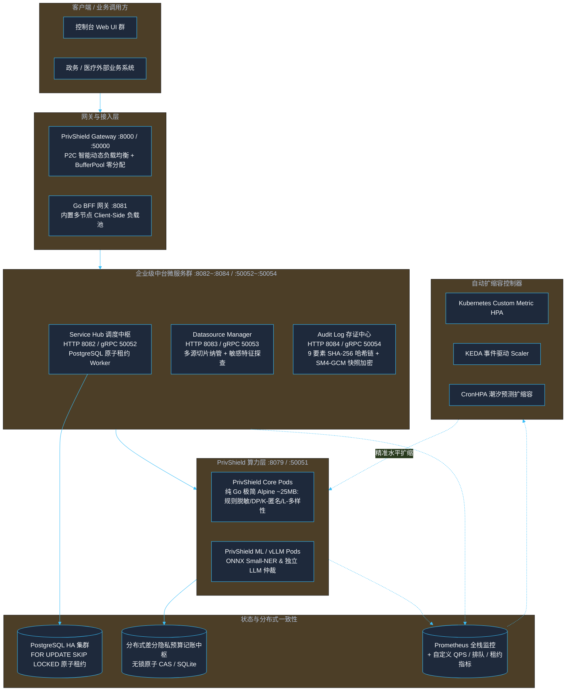

# PrivShield 生产级架构优化与高可用演进设计方案

> **版本**：v16.0.0  
> **适用范围**：`PrivShield` 核心算力引擎、中台微服务群（`service-hub` / `datasource-mgr` / `audit-log`）、控制台 BFF 及 Kubernetes 云原生部署套件。  
> **核心目标**：针对高并发政务与医疗数据流通场景，全面实现负载均衡、分布式预算一致性、PostgreSQL 原子租约并发、细粒度事件驱动自动扩缩容（KEDA/CronHPA）、异步任务队列与极限压测套件。

---

## 目录

- [1. 架构演进全景图](#1-架构演进全景图)
- [2. 核心高可用与优化模块实现](#2-核心高可用与优化模块实现)
  - [2.1 分布式全局隐私预算一致性中心 (Distributed Consistency Budget)](#21-分布式全局隐私预算一致性中心-distributed-consistency-budget)
  - [2.2 智能动态负载均衡 (Smart Load Balancing)](#22-智能动态负载均衡-smart-load-balancing)
  - [2.3 Service Hub 原子租约与异步工作池 (Atomic Leases & Worker Pool)](#23-service-hub-原子租约与异步工作池-atomic-leases--worker-pool)
  - [2.4 细粒度事件驱动自动扩缩容 (Advanced Auto-Scaling)](#24-细粒度事件驱动自动扩缩容-advanced-auto-scaling)
  - [2.5 极限压测与基准性能评估套件 (Stress & Benchmark Suite)](#25-极限压测与基准性能评估套件-stress--benchmark-suite)

---

## 1. 架构演进全景图



> **gRPC mTLS 接入**：service-hub、datasource-mgr、audit-log、bff-go 等 Go gRPC 服务器在 `PRIVACY_AUTH_MTLS_WHITELIST_FILE` 指向 `config/mtls-whitelist.yaml` 时，通过 `pkg/tlsutil.NewWhitelistInterceptor()` 注册 unary/stream CN 白名单拦截器，并支持 5 秒 mtime 轮询热载。

---

## 2. 核心高可用与优化模块实现

### 2.1 分布式全局隐私预算一致性中心 (Distributed Consistency Budget)

在 `privacy-go-sdk/budget/budget.go` 中，`BudgetAccountant` 通过纯 Go 原子无锁并发设计实现统一预算抽象：
1. **无锁原子 CAS 模式**（默认）：基于 `sync/atomic` 与 `math.Float64bits` 实现单机千万级 QPS 原子扣减与原子回滚，消除读陈旧与并发丢失风险；
2. **SQLite 模式**：通过环境变量 `PRIVACY_BUDGET_DB` 启用，支持单机本地持久化与跨实例共享；
3. **滑动时间窗口**：通过 `PRIVACY_BUDGET_WINDOW_SECONDS` 实现自动周期重置；
4. **HMAC/SM3 防篡改审计**：`BudgetAuditLogger` 对每笔预算消耗记录进行 HMAC-SHA256 / 国密 SM3 签名存证。

---

### 2.2 智能动态负载均衡与零分配网关 (Smart Load Balancing & BufferPool)

#### 1. Go 微服务共享客户端多节点池化 (`pkg/agent/client.go`)
- **多端点配置**：`Config.BaseURLs` 支持传入多个 Agent REST 地址；service-hub、audit-log 等模块的配置层读取环境变量 `PRIVACY_AGENT_URLS=http://agent-1:8079,http://agent-2:8079`（逗号分隔）并注入 `BaseURLs`；
- **客户端轮询与故障转移 (Client-Side Round-Robin & Failover)**：
  - 维护健康的节点列表，自动轮询分发；
  - 当某个节点连续失败达到阈值（如 5 次）时自动熔断并隔离，在后台异步进行心跳探活；
  - 探活恢复后通过半开（Half-Open）状态自动重新纳入可用节点池。

#### 2. Go 网关 P2C-EWMA 动态负载调度与 BufferPool (`engine-go/internal/gateway/`)
- **Power of Two Choices + EWMA 算法 (`balancer.go`)**：
  - 每次调度从健康节点列表中随机选取两个候选节点；
  - 基于指数加权移动平均（EWMA）计算候选节点的综合负载得分：
    $$\text{Score} = \text{InflightRequests} \times 1.0 + \text{EWMALatencyMs} \times 0.05$$
  - 将请求派发给负载得分最低的节点，有效消除羊群效应（Herd Effect）；
- **BufferPool 零堆分配反向代理 (`http_proxy.go`)**：
  - 基于 `sync.Pool` 复用 32KB 数据包内存切片，实现反向代理数据流转发 0 B/op。

---

### 2.3 Service Hub 原子租约与异步工作池 (Atomic Leases & Worker Pool)

#### 1. PostgreSQL 原子租约并发 (`LeasedTaskStore`)
在多副本 Hub 场景下，采用 `FOR UPDATE SKIP LOCKED` 短事务实现无阻塞并发抢占：
```sql
WITH candidate AS (
  SELECT id FROM tasks
  WHERE status = 'pending'
    AND (retry_after IS NULL OR retry_after <= NOW())
    AND retry_count < max_retries
  ORDER BY priority DESC, created_at ASC
  FOR UPDATE SKIP LOCKED LIMIT 1
)
UPDATE tasks
SET status = 'running', lease_owner = $1, lease_token = $2,
    lease_expires_at = NOW() + INTERVAL '60 seconds', version = version + 1
WHERE id IN (SELECT id FROM candidate)
RETURNING *;
```
- 彻底消除多副本重复读取同一任务导致的脑裂与重复执行；
- 支持租约续期（`RenewLease`）、状态完成（`CompleteLease`）与超期回收（`RequeueExpiredLeases`）。
- 后端限制：`LeasedTaskStore` 完整语义仅在 PostgreSQL 后端（`pkg/store/postgres`）实现；SQLite 与内存后端会返回 `ErrLeaseNotSupported`，避免多副本 Hub 误配时静默出错。

#### 2. 崩溃恢复与自动重试
- **启动时崩溃恢复**：自动扫描并回收孤立任务（running 标记失败、pending 保留队列），通过 Prometheus 指标 `orphaned_tasks_recovered_total` 记录恢复数量；
- **周期性后台重试**：定期扫描失败任务，自动重试可恢复错误，指数退避延迟 + `RetryCount` 结构化字段，通过 `tasks_retried_total` 指标监控重试活动；
- **完整性校验**：SQLite 模式启动时执行 `PRAGMA integrity_check` 阻断损坏数据库；
- **统一备份脚本**：支持全量/增量备份、`--verify` 恢复验证模式、自动过期清理。

---

### 2.4 细粒度事件驱动自动扩缩容 (Advanced Auto-Scaling)

#### 1. 基于自定义业务指标的 HPA 扩展
在 Helm Chart 中支持直接绑定 Prometheus 业务指标：
- **QPS 触发**：`rate(privacy_requests_total[1m]) > 200`
- **P95 延迟恶化触发**：`histogram_quantile(0.95, rate(privacy_request_duration_seconds_bucket[2m])) > 0.5`

#### 2. 算力分层 Deployment（Tiered Scaling）
- **`privshield-core`**：纯 CPU 算力（脱敏、K-匿名、差分隐私），极速秒级扩缩（副本数 3~30）；
- **`privshield-ml`**：GPU 显存算力（Small-NER 与本地 LLM），平稳扩缩（副本数 2~6）。

#### 3. CronHPA 潮汐预测调度
针对政务就医业务规律，预置工作日早高峰（08:15）提前扩容与夜间（20:00）自动缩容。

---

### 2.5 极限压测与基准性能评估套件 (Stress & Benchmark Suite)

新增 `scripts/test/stress_test_suite.py` 自动化压测套件：
- 支持并发模拟 50~500 用户持续压测；
- 统计并输出 QPS、总吞吐、P50、P90、P95、P99 延迟及错误率；
- 验证在极限压力下熔断器与多节点负载均衡的稳定性。
