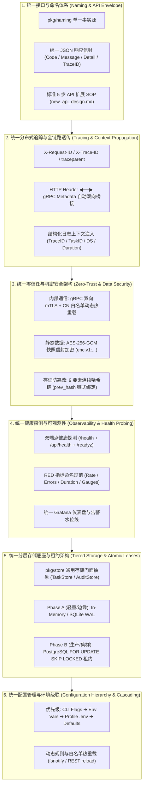
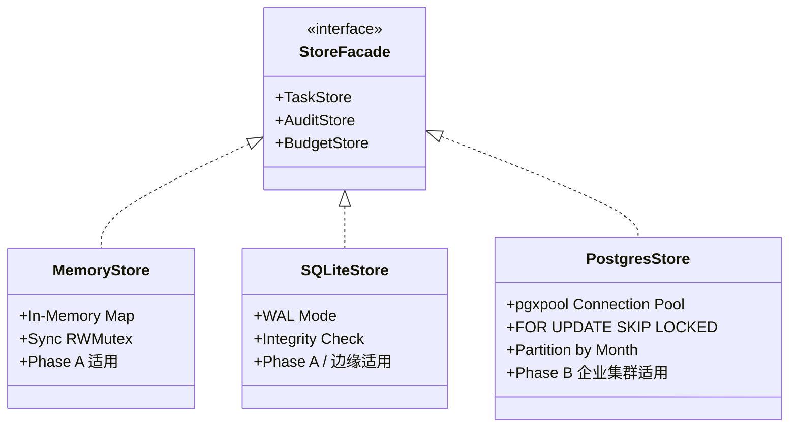

# PrivShield 全栈统一架构设计与跨层协同规范 (Unified Architecture Design Specifications)

> **版本**：v2.0.0  
> **适用范围**：PrivShield 核心隐私引擎（Python）、企业级中台微服务群（Go `service-hub` / `datasource-mgr` / `audit-log`）、控制台与 BFF 网关（`console/bff-go` / `console/app-lz` / `console/web`）及基础共享库（`pkg/`）。  
> **定位**：本文档沉淀 PrivShield 在多语言、分布式、高并发场景下的**跨层统一架构设计标准**，消除不同服务之间的语义分歧与实现割裂。

---

## 1. 总体设计规范全景 (Architecture Blueprint)



---

## 2. 统一错误码与 API 响应信封规范 (Unified Error Codes & API Envelope)

为了让前端、BFF 网关与各微服务实现统一的错误拦截、国际化提示与重试判定，全栈统一采用以下响应信封与错误码结构。

### 2.1 REST API 统一响应信封

所有 REST 接口在成功或失败时，均遵循标准化 JSON 结构：

#### 成功响应信封 (Success Envelope)
```json
{
  "code": 0,
  "message": "success",
  "data": { ... },
  "trace_id": "req-1787554500-abc12345",
  "timestamp": "2026-08-27T09:30:00.123Z"
}
```

#### 错误响应信封 (Error Envelope)
```json
{
  "code": "INVALID_DATASOURCE_ID",
  "message": "指定的业务数据源不存在或未激活",
  "detail": "datasource 'ds_unknown' is not registered in canonical naming",
  "trace_id": "req-1787554500-abc12345",
  "timestamp": "2026-08-27T09:30:00.123Z"
}
```

### 2.2 全栈标准错误码对照表

| 错误编码 (`code`) | HTTP 状态码 | gRPC 状态码 | 说明与处理建议 |
|---|---|---|---|
| `OK` / `0` | 200 OK | `OK` (0) | 请求成功处理 |
| `INVALID_ARGUMENT` | 400 Bad Request | `InvalidArgument` (3) | 参数校验失败（Pydantic / Go 校验器拦截） |
| `INVALID_DATASOURCE_ID` | 400 Bad Request | `InvalidArgument` (3) | 未知数据源标识（`pkg/naming` 拦截） |
| `UNAUTHORIZED` | 401 Unauthorized | `Unauthenticated` (16) | API Key 缺失或无效 / mTLS 证书校验失败 |
| `FORBIDDEN` | 403 Forbidden | `PermissionDenied` (7) | mTLS CN 白名单越权或不在授权 Scope 内 |
| `NOT_FOUND` | 404 Not Found | `NotFound` (5) | 目标资源（任务、数据源、审计日志）不存在 |
| `RESERVED_DATASOURCE` | 409 Conflict | `FailedPrecondition` (9) | 数据源条目已登记但尚未激活实现（写侧拒绝） |
| `RATE_LIMITED` | 429 Too Many Requests | `ResourceExhausted` (8) | 触发 API 限流阈值，建议客户端指数退避重试 |
| `BUDGET_EXHAUSTED` | 429 Too Many Requests | `ResourceExhausted` (8) | 差分隐私 $\epsilon$ 或 $\delta$ 预算耗尽，拒绝查询 |
| `INTERNAL_ERROR` | 500 Internal Server Error | `Internal` (13) | 服务内部不可预期异常（生产环境脱敏堆栈） |
| `UPSTREAM_UNAVAILABLE` | 503 Service Unavailable | `Unavailable` (14) | 上游核心引擎或数据库不可达，已进入降级模式 |

### 2.3 安全与防泄漏要求 (Fail-Closed & Sanitization)
- **生产模式禁止外抛堆栈**：生产环境（`GIN_MODE=release` / `PRIVACY_LOG_LEVEL=INFO`）下，禁止在 HTTP 响应中直接输出完整的 Python/Go 调用栈，详细 Trace 仅记录于服务端日志中；
- **未知数据源绝对 Fail-Closed**：遇到未在 `pkg/naming` 中登记的数据源，强制返回 `INVALID_DATASOURCE_ID`，禁止静默回退至默认数据源。

---

## 3. 全链路分布式追踪与上下文透传规范 (Distributed Tracing & Context Propagation)

在跨 Python FastAPI、Go 微服务群与 Web UI 的全链路调用中，必须保证**一次用户触发的所有日志、任务状态与审计快照具备相同的 Trace 标识**。

### 3.1 追踪标识标准命名
全栈统一使用以下 HTTP 请求头与 gRPC Metadata 字段：
- **`X-Request-ID`**：前端或客户端生成的唯一会话标识（格式：`req-{unix_timestamp}-{8位随机hex}`）；
- **`X-Trace-ID`**：与 `X-Request-ID` 保持同义并同步流转；
- **`traceparent`**：遵循 W3C Trace Context 标准（`00-{trace_id}-{span_id}-{flags}`），支持无缝对接 OpenTelemetry。

### 3.2 跨协议双向桥接机制

```text
┌────────────────┐  HTTP: X-Request-ID  ┌────────────────┐  gRPC: x-request-id  ┌────────────────┐
│   前端 Web UI  │ ───────────────────▶ │   BFF / Hub    │ ───────────────────▶ │ Engine / Audit │
│  (React/Axios) │                      │   (Go Gin)     │   (gRPC Metadata)    │ (Python/Go RPC)│
└────────────────┘                      └────────────────┘                      └────────────────┘
        ▲                                       ▲                                       ▲
        └───────────────────────────────────────┴───────────────────────────────────────┘
                               统一注入结构化日志 (Structured Log Context)
```

1. **HTTP 中间件自动提取/注入**：
   - 入站请求若包含 `X-Request-ID`，写入上下文并透传；
   - 入站请求若缺失，中间件自动生成并回写到 HTTP 响应头 `X-Request-ID`；
2. **gRPC 双向元数据转换**：
   - Go 客户端（`pkg/agent`）发起 gRPC 调用时，自动将上下文中的 `X-Request-ID` 写入 gRPC `metadata.Pairs("x-request-id", traceID)`；
   - Python gRPC Servicer（`engine/grpc_server.py`）自动从 `context.invocation_metadata()` 中提取并在日志中绑定；
3. **结构化日志标准输出字段**：
   ```json
   {
     "level": "INFO",
     "time": "2026-08-27T09:30:00.123Z",
     "logger": "service-hub.scheduler",
     "trace_id": "req-1787554500-abc12345",
     "task_id": "task-1787554500-f9a8b7c6",
     "datasource_id": "ds_yibao",
     "operation": "mask",
     "duration_ms": 2.45,
     "message": "Task completed successfully"
   }
   ```

---

## 4. 统一零信任安全与机密数据防护架构 (Zero-Trust & Data Security)

系统采用 **“边界外层防护、内部全链路 mTLS、数据落地信封加密、存证区块链化”** 的立体安全纵深防御体系。

### 4.1 传输安全：gRPC 双向 mTLS 与 CN 白名单动态授权

```text
┌───────────────────────────┐                           ┌───────────────────────────┐
│     客户端 (如 BFF / Hub)  │                           │   服务端 (如 Engine / Log) │
├───────────────────────────┤     gRPC TLS 1.3 mTLS     ├───────────────────────────┤
│ • 持有 Client Cert        │ ────────────────────────▶ │ • 校验 Client CA 信任链   │
│ • CN: bff-client          │    (双向证书握手认证)       │ • 提取客户端证书 CN        │
│                           │                           │ • 匹配 CN 授权白名单文件  │
└───────────────────────────┘                           └───────────────────────────┘
```

1. **强密码学通信**：微服务间跨机通信强制启用 TLS 1.3，禁用非安全老旧密码套件；
2. **证书 CN 授权与热重载 (`mtls-whitelist.yaml`)**：
   - 服务端提取客户端证书的 `Common Name (CN)`；
   - 根据白名单配置匹配客户端角色与允许调用的 RPC 方法（Scopes，如 `["*"]` 或 `["/PrivacyService/Process"]`）；
   - 支持通过 `fsnotify` 监听白名单文件，**动态热更新授权无需重启服务**。

### 4.2 数据安全：快照样本 AES-256-GCM 信封加密规范

对于在 `audit-log`、任务暂存库或冷存储中持久化的原始/脱敏数据样本（`input_sample` / `output_sample`），统一采用**信封加密 (Envelope Encryption)**：

```text
密文字符串格式规范：
enc:v1:<Base64( 12 字节随机 Nonce + AES-256-GCM 密文 + 16 字节 Auth Tag )>
```

- **加密标识与透明回退**：`crypto.IsEncrypted(s)` 通过 `enc:v1:` 前缀识别。若遇到历史未加密明文，自动透明回退读取，保证升级兼容；
- **密钥派生与隔离**：基于环境变量 `AUDIT_LOG_ENCRYPTION_KEY` 采用 SHA-256 派生固定 32 字节主密钥，每次加密使用 `crypto/rand` 生成独一无二的 12 字节 Nonce。

### 4.3 存证安全：9 要素区块链式防篡改哈希链

为了保证存证记录在物理介质上的不可篡改性与全链验真能力，`audit-log` 采用连续哈希链绑定：

$$\text{Data} = \text{prev\_hash} \parallel \text{log\_id} \parallel \text{timestamp} \parallel \text{algorithm} \parallel \text{input\_hash} \parallel \text{output\_hash} \parallel \text{user} \parallel \text{security\_level} \parallel \text{params\_json}$$
$$\text{IntegrityHash} = \text{SHA256}(\text{Data})$$

- 创世区块的 `prev_hash` 为 `"0000000000000000000000000000000000000000000000000000000000000000"`；
- 后续每一条存证的 `prev_hash` 严格等于前一条记录的 `integrity_hash`；
- 通过 `POST /api/audit/chain/verify` 可在 $O(N)$ 复杂度内快速检测出任何历史篡改、行删除或断链异常。

---

## 5. 统一健康探测与可观测性标准 (Observability & Health Probing)

### 5.1 双路径健康探测一致性规范

为了兼顾 Kubernetes 原生 Pod 探针、Docker HEALTHCHECK 以及通过 API 网关/BFF 进行的业务健康探测，**所有后端服务（FastAPI 与 Gin）必须统一注册以下三个标准端点**：

| 端点路径 | HTTP 动作 | 用途与判定逻辑 |
|---|---|---|
| **`/health`** | `GET` | **容器级存活探针 (Liveness Probe)**：进程启动且事件循环正常即返回 `200 OK` |
| **`/api/health`** | `GET` | **API 网关/BFF 业务探针**：逻辑与 `/health` 相同，专用于前端路由代理与 API 网关转发 |
| **`/readyz`** | `GET` | **就绪探针 (Readiness Probe)**：深度检查核心依赖（数据库连接池、引擎配置解析器、磁盘可写性），未就绪返回 `503` 自动从 Service 摘流 |

### 5.2 Prometheus 指标命名与 Label 规范 (RED 模式)

所有微服务统一遵循 Prometheus 官方命名规范：

```text
<命名空间>_<子系统>_<指标名称>_<单位>
```

#### 核心指标清单
1. **请求速率与计数 (Rate)**：
   - `privshield_http_requests_total{service="service-hub", method="POST", path="/api/hub/dispatch", status="200"}`
   - `privshield_grpc_requests_total{service="engine", method="Process", code="OK"}`
2. **请求延迟分布 (Duration)**：
   - `privshield_http_duration_seconds_bucket{service="audit-log", le="0.005"}`
   - `privshield_engine_process_duration_seconds{domain="yibao", algorithm="mask"}`
3. **并发与资源状态 (Gauges)**：
   - `privshield_hub_task_queue_depth`：Service Hub 队列积压任务数
   - `privshield_hub_active_leases`：当前由 Worker 持有的租约数
   - `privshield_audit_chain_length`：存证哈希链总区块高度
   - `privshield_privacy_budget_remaining_ratio`：差分隐私预算剩余比例

---

## 6. 统一分层存储底座与演进架构 (Tiered Storage Layer)

为了兼顾**轻量本地开发/单机边缘部署（Phase A）**与**企业级多副本高并发集群部署（Phase B）**，底层存储统一采用门面模式（Facade Pattern）进行抽象封装。



### 6.1 存储接口约束 (`pkg/store/store.go`)
- **`TaskStore`**：定义任务的原子存储、状态机流转、Phase B 分布式租约争抢（`ClaimTasks`）与孤儿租约回收；
- **`AuditStore`**：定义连续哈希链写入（`SaveLog` / `SaveLogsBatch`）、前序哈希获取（`GetLatestLog`）与全链验真（`VerifyChain`）；
- **`BudgetStore`**：定义差分隐私预算扣减与窗口重置。

### 6.2 部署选型与切换标准

| 运行环境 / 场景 | 推荐存储引擎 | 配置方式 | 架构优势 |
|---|---|---|---|
| **本地开发 / 单元测试** | `memory` | 默认（不配 DSN） | 内存常驻，零外部依赖，毫秒级快速启动 |
| **单机生产 / 边缘轻量节点** | `sqlite` | 指定本地文件路径<br/>`SERVICE_HUB_DB_PATH` | 单文件部署、自动开启 WAL 模式、支持热备份 |
| **企业级多副本高并发集群** | `postgres` (Phase B) | 指定数据库连接串<br/>`SERVICE_HUB_PG_DSN`<br/>`AUDIT_LOG_PG_DSN` | • `FOR UPDATE SKIP LOCKED` 原子租约争抢无死锁<br/>• `pgx.Batch` 高吞吐批量存证落盘<br/>• 月度分区表，百万级存证秒级对账 |

---

## 7. 统一配置管理与环境级联覆盖机制 (Configuration Hierarchy)

全栈所有微服务遵循严格的**多层级配置覆盖优先级阶梯**：

```text
┌─────────────────────────────────────────────────────────────────────────────┐
│ 优先级 1: 命令行参数 (CLI Flags，如 --port / --host / --mtls)                 │
│    ▲                                                                        │
│ 优先级 2: 操作系统/容器环境变量 (OS Environment Variables，如 PRIVACY_XXX)    │
│    ▲                                                                        │
│ 优先级 3: Profile 环境文件 (.env + config/env/<profile>.env，如 vllm.env)    │
│    ▲                                                                        │
│ 优先级 4: YAML 业务配置文件 (config/privacy-profile.yaml / rules/*.yaml)     │
│    ▲                                                                        │
│ 优先级 5: 代码内置缺省默认值 (Default Fallbacks)                             │
└─────────────────────────────────────────────────────────────────────────────┘
```

### 7.1 动态热重载规范 (Zero-Downtime Reload)
以下配置项支持在**不重启微服务进程**的情况下动态重载生效：
1. **分类脱敏规则库 (`rules/domains/*.yaml`)**：调用 `POST /v1/dynclassification/reload` 触发引擎无锁重载；
2. **mTLS CN 访问控制白名单 (`mtls-whitelist.yaml`)**：内置文件监听器（Watcher）在文件保存时毫秒级自动热更新内存白名单；
3. **数据源定义与别名注册 (`pkg/naming`)**：作为静态事实源编译固化，保证分布式集群间的一致性。

---

## 8. 统一架构决策与技术选型对齐表 (ADR Matrix)

| 架构决策维度 | 选定方案 | 替代方案（已废弃/不推荐） | 核心选型理由 |
|---|---|---|---|
| **跨服务命名治理** | `pkg/naming` 单一事实源注册表 | 各微服务独立维护字面量 | 杜绝语义漂移与拼写错误，实现编译期静态检查与入站自动归一化 |
| **存证数据防篡改** | 9 要素区块链式哈希链 + 链式验真 | 孤立 SHA-256 存证 / 外部签名服务 | 保证存证前后强关联，杜绝删行、篡改与重放，无需昂贵的外部硬件即可实现审计抗抵赖 |
| **机密数据保护** | AES-256-GCM 信封加密 (`enc:v1:`) | 明文落盘 / 全库全局对称加密 | 针对敏感字段按需加密，密文自带 Nonce 与 Auth Tag，具备版本前缀透明兼容回退能力 |
| **多副本分布式租约** | PostgreSQL `FOR UPDATE SKIP LOCKED` | Redis 分布式锁 / ZooKeeper 协调 | 利用成熟 RDBMS 的行级行锁实现原子任务争抢，免去第三方分布式锁运维与锁超时脑裂风险 |
| **微服务通信协议** | gRPC (Protobuf) + REST (HTTP/JSON) 双协议 | 仅 REST / 仅 RPC | 兼顾前端易用性与微服务间高性能二进制传输、强类型定义及双向流控 |

---

## 9. 开发者协作与演进指南

当您在 PrivShield 项目中进行代码开发或新增功能时，请遵循以下闭环流程：
1. **新增数据接口/API**：严格依照 [docs/architecture/new_api_design.md](new_api_design.md) 执行 5 步 SOP；
2. **新增配置项**：在 `internal/config/config.go` 中声明带有清晰默认值的结构体字段，并在对应的 `docs/ops.md` 环境变量表中补充；
3. **新增微服务调用**：统一通过 `pkg/` 共享基础库（`pkg/agent`、`pkg/naming`、`pkg/store`、`pkg/middleware`）进行标准化封装；
4. **提交前自检**：运行全栈测试套件 `go test ./...` 与 `PYTHONPATH=. pytest tests`，确保 100% 绿色通过。
