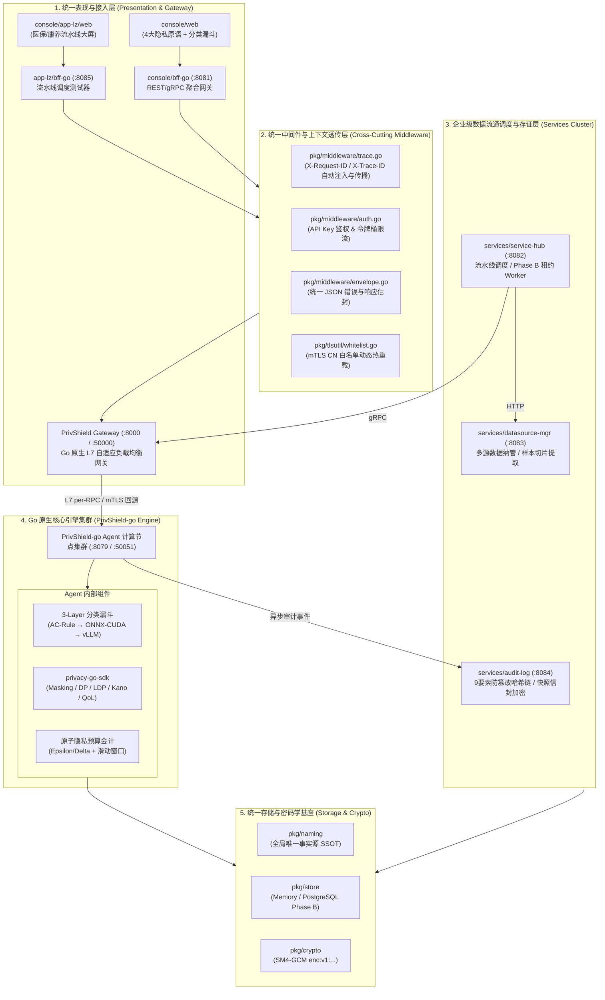
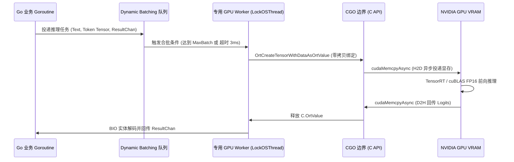
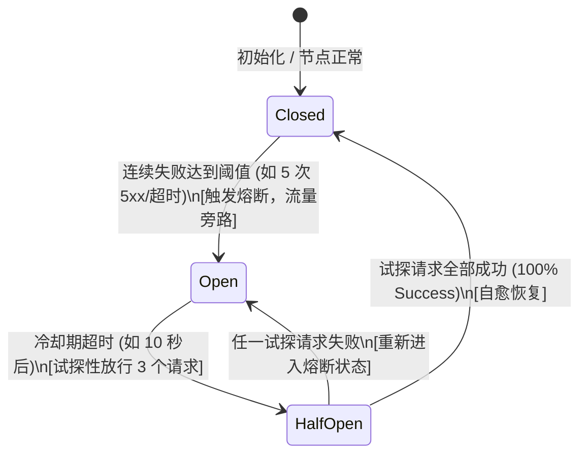
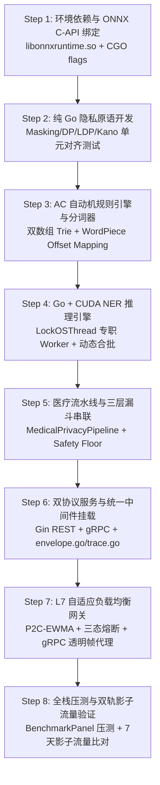

# 数盾 PrivShield-go (路径 C) 架构演进规划与 Go+CUDA 异构推理设计草案

> **文档定位**：本方案为 `PrivShield` 核心引擎从现有 Python 架构向 **Go 原生高性能微服务架构 (路径 C)** 演进的**远期架构设计草案与可行性研究报告**，不是当前生产实现状态。文档用于指导后续 Phase 3 的工程落地，并统一研发团队对终态技术路线的认知。
> **顶层设计对齐**：目标对齐 [`docs/archive/unified_design.md`](unified_design.md) 统一规范（统一错误信封、全链路分布式追踪、SSOT 命名、mTLS CN 白名单热重载、Phase B PostgreSQL 租约存储与 Prometheus 可观测性体系）。`pkg/` 共享库已提供部分能力；`privacy-go-sdk/` 与 `engine-go/` 已完成 Phase 1 骨架实现（详见附录 A v5.0.0 修订记录）。
> **参考实现与存量资产**：当前主仓库 `pkg/` 已具备可复用的共享基础库（`pkg/middleware/`、`pkg/tlsutil/`、`pkg/naming/`、`pkg/store/`、`pkg/crypto/`）。`~/code/sfwork/PrivShield-go` 为设计阶段引用的外部参考结构，**在当前仓库中不存在**，如后续引入需重新评估其代码资产。
> **版本**：v11.0.0-drafted (路径 C 演进草案 Phase 7 Prometheus 指标实际注册 + 网关指标补埋版)
> **编写日期**：2026-08-28
> **修订说明**：v11.0.0 完成 Phase 7 实现：engine-go Prometheus 指标实际注册（替代 TODO 桩），新增 `observability/metrics.go`（5 个 engine 指标：`privshield_requests_total`/`privshield_request_duration_seconds`/`privshield_classification_total`/`privshield_budget_consumed_total`/`privshield_ner_inference_seconds`）+ `observability/gateway_metrics.go`（4 个 gateway 指标：`privshield_gateway_backend_in_flight`/`privshield_gateway_backend_ewma_latency_seconds`/`privshield_gateway_circuit_breaker_state`/`privshield_gateway_requests_total`）。Agent + Gateway 均接入 `/metrics` 端点。新增 13 个指标测试。清理多处过期状态标注。

---

## 目录 (Table of Contents)

1. [方案演进背景与顶层技术决策](#1-方案演进背景与顶层技术决策)
   * 1.1 [为什么必须实施路径 C (全栈 Go 化)？](#11-为什么必须实施路径-c-全栈-go-化)
   * 1.2 [路径 C 的四大核心目标](#12-路径-c-四大核心目标)
   * 1.3 [仓库组织形态技术决策 (Monorepo 目录共存 vs 独立新仓库)](#13-仓库组织形态技术决策-monorepo-目录共存-vs-独立新仓库)
   * 1.4 [终态全栈技术均质化评估与 Python 引擎全面退役总纲](#14-终态全栈技术均质化评估与-python-引擎全面退役总纲)
2. [全栈统一架构蓝图与服务拓扑 (System Topology)](#2-全栈统一架构蓝图与服务拓扑-system-topology)
3. [统一中间件与上下文透传体系 (Unified Middleware & Context)](#3-统一中间件与上下文透传体系-unified-middleware--context)
4. [零分配与高并发内存架构设计 (Zero-Allocation Architecture)](#4-零分配与高并发内存架构设计-zero-allocation-architecture)
5. [纯 Go 隐私原语与 AC 自动机规则引擎 (privacy-go-sdk)](#5-纯-go-隐私原语与-ac-自动机规则引擎-privacy-go-sdk)
6. [Go + CUDA Small-NER 深度学习推理核心实现](#6-go--cuda-small-ner-深度学习推理核心实现)
   * 6.1 [ONNX Runtime CGO 双轨生命周期管理](#61-onnx-runtime-cgo-双轨生命周期管理)
   * 6.2 [生产级 WordPiece Tokenizer 与精准 Offset Mapping](#62-生产级-wordpiece-tokenizer-与精准-offset-mapping)
   * 6.3 [OS 线程绑定、专用 Worker Pool 与动态合批 (Dynamic Batching)](#63-os-线程绑定专用-worker-pool-与动态合批-dynamic-batching)
   * 6.4 [BIO/BIOES 实体解码与 Span 对齐还原](#64-biobioes-实体解码与-span-对齐还原)
7. [医疗数据全流程流水线 (Medical Pipeline) Go 原生实现](#7-医疗数据全流程流水线-medical-pipeline-go-原生实现)
8. [三层漏斗与多级容灾降级机制 (Safety Floor & Fault Tolerance)](#8-三层漏斗与多级容灾降级机制-safety-floor--fault-tolerance)
9. [Engine 自带高性能负载均衡与网关子系统重构 (Gateway & Balancer)](#9-engine-自带高性能负载均衡与网关子系统重构-gateway--balancer)
   * 9.1 [网关架构定位与 L7 per-RPC 调度优势](#91-网关架构定位与-l7-per-rpc-调度优势)
   * 9.2 [自适应负载均衡调度算法体系 (P2C-EWMA / SWRR / LeastConn)](#92-自适应负载均衡调度算法体系-p2c-ewma--swrr--leastconn)
   * 9.3 [节点独立三态熔断器与双轨自愈健康探针](#93-节点独立三态熔断器与双轨自愈健康探针)
   * 9.4 [透明零编解码 gRPC 反向代理核心实现 (Transparent Stream Proxy)](#94-透明零编解码-grpc-反向代理核心实现-transparent-stream-proxy)
   * 9.5 [东西向零信任 mTLS 回源与南北向 TLS 终结](#95-东西向零信任-mtls-回源与南北向-tls-终结)
10. [统一存储、审计存证与密码学基座 (Storage, Crypto & Audit)](#10-统一存储审计存证与密码学基座-storage-crypto--audit)
11. [全栈可观测性与监控指标规约 (Observability Spec)](#11-全栈可观测性与监控指标规约-observability-spec)
12. [全流程代码工程实施指南与落地步骤 (Step-by-Step Implementation Playbook)](#12-全流程代码工程实施指南与落地步骤-step-by-step-implementation-playbook)
    * 12.1 [工程目录结构规划与包依赖划分](#121-工程目录结构规划与包依赖划分)
    * 12.2 [Step 1: 环境准备与 CGO/ONNX 动态库绑定](#122-step-1-环境准备与-cgoonnx-动态库绑定)
    * 12.3 [Step 2: 纯 Go 隐私原语库与单元测试实现 (`privacy-go-sdk`)](#123-step-2-纯-go-隐私原语库与单元测试实现-privacy-go-sdk)
    * 12.4 [Step 3: AC 自动机规则引擎与 Tokenizer 分词器构建](#124-step-3-ac-自动机规则引擎与-tokenizer-分词器构建)
    * 12.5 [Step 4: Go + CUDA ONNX 推理引擎与动态合批 Worker 实现](#125-step-4-go--cuda-onnx-推理引擎与动态合批-worker-实现)
    * 12.6 [Step 5: 医疗流水线与三层分级漏斗串联 (`medical_pipeline`)](#126-step-5-医疗流水线与三层分级漏斗串联-medical_pipeline)
    * 12.7 [Step 6: 双协议服务端实现与统一中间件挂载](#127-step-6-双协议服务端实现与统一中间件挂载)
    * 12.8 [Step 7: L7 自适应负载均衡网关实现 (`internal/gateway`)](#128-step-7-l7-自适应负载均衡网关实现-internalgateway)
    * 12.9 [Step 8: 自动化测试、性能压测与影子流量验证](#129-step-8-自动化测试性能压测与影子流量验证)
13. [存量 Go 代码资产复用与工程借鉴实战指南 (Reusing Existing Go Assets)](#13-存量-go-代码资产复用与工程借鉴实战指南-reusing-existing-go-assets)
    * 13.1 [当前仓库 Go 资产盘点与复用度评估矩阵](#131-当前仓库-go-资产盘点与复用度评估矩阵)
    * 13.2 [路径 C 需新建模块清单（当前仓库不存在）](#132-路径-c-需新建模块清单当前仓库不存在)
    * 13.3 [网关子系统复用实战（当前 Python 实现 vs 目标 Go 实现）](#133-网关子系统复用实战当前-python-实现-vs-目标-go-实现)
    * 13.4 [主工程 `pkg/` 共享基础设施库无缝接入](#134-主工程-pkg-共享基础设施库无缝接入)
    * 13.5 [跨工程资产同步说明（重要勘误）](#135-跨工程资产同步说明重要勘误)
14. [性能基准量化评估与容量规划 (Benchmark & Sizing)](#14-性能基准量化评估与容量规划-benchmark--sizing)
15. [构建、依赖管理与生产部署清单 (Build & K8s Packaging)](#15-构建依赖管理与生产部署清单-build--k8s-packaging)
16. [双轨影子流量验证与 Python 引擎彻底退役路线 (Migration & Deprecation Playbook)](#16-双轨影子流量验证与-python-引擎彻底退役路线-migration--deprecation-playbook)
    * 16.1 [三阶段无缝平滑切流演进路线](#161-三阶段无缝平滑切流演进路线)
    * 16.2 [Python 引擎全生命周期彻底下线与清理清单](#162-python-引擎全生命周期彻底下线与清理清单)

---

## 文档状态与真实性声明（必读）

本文档是 **路径 C（Go 原生引擎 + CUDA NER）的架构演进草案**，用于统一终态技术愿景并指导后续工程落地。**它不等同于当前已实现系统**，阅读时请注意以下状态划分：

| 类别 | 当前状态 | 说明 |
|---|---|---|
| `pkg/middleware/`（统一错误信封、Trace、限流） | ✅ 已落地 | 主仓库已存在 `pkg/middleware/envelope.go`、`trace.go`、`ratelimit.go`，Go 微服务已接入。 |
| `pkg/naming/`（SSOT 数据源命名） | ✅ 已落地 | `DSYibao` / `DSKangyang` / `ResolveInbound` 已实现并接入服务。 |
| `pkg/tlsutil/`（mTLS CN 白名单热重载） | ✅ 已落地 | 支持 `config/mtls-whitelist.yaml` 5 秒轮询热重载。 |
| `pkg/store/`（Phase B PostgreSQL 租约） | ✅ 已落地 | `pkg/store/postgres/` 提供 `FOR UPDATE SKIP LOCKED` 原子任务租约。 |
| `pkg/crypto/`（SM4-GCM 信封） | ✅ 已落地 | `pkg/crypto/sm4.go`、`envelope.go` 已实现。 |
| `engine/`（Python 核心引擎） | ✅ 当前生产实现 | 包括隐私原语、动态分类分级漏斗、医疗流水线、网关等。 |
| `engine-go/` / `privacy-go-sdk/` / `cmd/privshield-*` | ✅ Phase 7 已实现 | Phase 1-6 骨架 + Phase 7 Prometheus 指标实际注册（9 个指标 + `/metrics` 端点 + 13 个测试）。详见附录 A v11.0.0 修订记录。 |
| Go + CUDA Small-NER 引擎 | ✅ Phase 5 架构已实现 | LockOSThread Worker Pool + 动态合批 + BIO 实体解码 + OnnxRuntime 接口抽象已实现。CGO 绑定待引入 onnxruntime_go，当前以 Stub 模式自动降级到规则引擎。 |
| Python 引擎退役 | ❌ 远期规划 | 需在 Go 引擎功能等价、影子流量 7 天零差异、业务稳定 14 天后方可评估。 |

**工程数字说明**：
- 第 1.2、14 章中的吞吐/延迟/内存/镜像体积等数字为**目标值或理论测算值**，不是当前仓库实测结果；
- 第 5~13 章的 Go 代码示例为**设计参考实现/教学片段**，部分函数（如 `MaskChineseName`、`MaskAddress`）和类型（如 `FrameData`）未定义，不能直接编译；
- 第 13 章引用的 `~/code/sfwork/PrivShield-go` 仓库在当前工作区不存在，复用策略需以实际可获取的代码资产为准。

**使用建议**：
1. 若需在当前仓库继续推进路径 C，请先按第 12 章创建 `engine-go/`、`privacy-go-sdk/`、`cmd/privshield-*` 目录并逐步填充实现；
2. 在每一阶段完成后，回到本文档更新对应章节的"状态"列，避免设计与实现长期脱节；
3. 性能数字必须在真实环境压测后替换为实测值，并附 `go test -bench` / `wrk` 等原始数据。

---

## 1. 方案演进背景与顶层技术决策

### 1.1 为什么评估路径 C (全栈 Go 化)？
现有的 Python 核心引擎 (`engine/`) 通过预编译正则、批次去重、`str.translate` 等优化已能在多数场景下满足业务需求（100 条记录处理耗时约 52.4ms）。但在**超高并发、超低延迟、边缘节点**等场景下，Python 运行时存在以下潜在瓶颈，值得评估 Go 原生实现：
* **CPython GIL 锁死多核横向扩展**：单个 Python 进程只能利用单核 CPU 进行规则计算，多核必须依靠 Uvicorn 多进程。而在 64 核服务器上拉起 32 个 Worker 进程，每个 Worker 占用 300MB~1.5GB 内存，整机内存消耗高达 **20GB~40GB**。
* **高频 GC 暂停与延迟抖动**：每秒数十万次字符串切片与对象分配引发频繁的 Python 分代垃圾回收，导致服务 P99 延迟偶发突破 500ms，无法满足金融级与医保实时结算 SLA（< 50ms）。
* **跨语言微服务割裂**：外围中台服务（`service-hub`、`datasource-mgr`、`audit-log`、`bff-go`）均为 Go 语言实现，Python 引擎的异构存在增加了跨语言错误解析、追踪断链、监控埋点与运维打包的复杂度。

### 1.2 路径 C 的四大核心目标（设计目标 / 待验证）
1. **极致吞吐 (Ultra Throughput)**：纯 CPU 规则与隐私原语目标吞吐达到 **40,000 ~ 60,000+ QPS**，16 逻辑核下满载目标吞吐突破 **500,000 记录/秒**；
2. **极轻资源 (Ultra Low Footprint)**：单进程目标常驻内存仅 **18MB ~ 40MB**，比 Python 降低 95%；Docker 运行时镜像目标由 3.5GB 压缩至 **< 200MB**；
3. **异构计算深度融合 (Heterogeneous Acceleration)**：通过 CGO + ONNX Runtime C API 直接驱动 CUDA GPU，利用**动态合批 (Dynamic Batching)** 与 **Pinning OS Thread**，将 GPU Tensor Core 算力发挥至极致；
4. **全栈统一标准合流**：全面接入 `pkg/` 共享库，统一错误信封、全链路 Trace 上下文、SSOT 命名、mTLS CN 白名单与 Prometheus 指标。

### 1.3 仓库组织形态技术决策 (Monorepo 目录共存 vs 独立新仓库)

在将引擎演进至 Go 原生实现时，研发团队通常面临“新开分支”、“新建独立 Git 仓库”或“当前仓库 Monorepo 目录共存”三种选型：

```text
┌──────────────────────────────────────────────────────────────────────────────────────────────────┐
│                               三种仓库演进形态深度对比与决策矩阵                                  │
├───────────────────┬──────────────────────────┬──────────────────────────┬────────────────────────┤
│ 评估维度          │ 路径 1: 新建独立 Git 仓库 │ 路径 2: 长期独立分支     │ 路径 3: Monorepo 目录共存│
│                   │ (`PrivShield-go`)        │ (`feat/go-engine`)       │ (`engine-go/`) 【推荐】│
├───────────────────┼──────────────────────────┼──────────────────────────┼────────────────────────┤
│ **基础库复用**    │ 🔴 严重割裂，跨仓库拷贝   │ 🟡 分支内共享，但需合并  │ 🟢 **直接 go.work 零拷贝** │
│ **规则/模型共享** │ 🔴 规则 YAML 重复维护    │ 🟡 易与主干规则冲突      │ 🟢 **共用一套 rules/ 配置**│
│ **E2E 自动化测试**│ 🔴 跨仓库构建，链路脱节  │ 🟡 仅限分支内跑测        │ 🟢 **一键命令全栈拉起联调**│
│ **影子流量验证**  │ 🔴 双栈运维配置极繁重    │ 🟡 不利于容器混部        │ 🟢 **一键双发比对验证 7 天**│
│ **合并维护成本**  │ 🔴 两个仓库长期维护      │ 🔴 容易产生 Merge 地狱   │ 🟢 **平滑切流，零破坏性**  │
└───────────────────┴──────────────────────────┴──────────────────────────┴────────────────────────┘
```

#### 决策结论（建议）：
👉 **推荐在当前 Git 仓库内以 Monorepo 目录共存 (`engine-go/`) 方式渐进式演进，而非新建独立仓库**。该决策需结合团队维护成本与发布节奏最终确认。

**核心理由**：
1. **防止基础底座语义漂移**：`PrivShield` 已有 4 个 Go 微服务（Hub/Datasource/Audit/BFF）与 `pkg/` 共享库（SSOT 命名、mTLS 白名单、错误信封、SM4 加密）。在当前仓库内演进，Go 引擎可直接 `import "github.com/fengzhizi319/PrivShield/pkg/..."`，保持全栈单一事实源；
2. **共用一套规则与模型资产**：`rules/domains/*.yaml` 与 `rules/taxonomies/*.yaml` 无需在多个仓库间手动同步；
3. **渐进式割接路线（规划）**：
   - 第一阶段：在当前仓库创建 `engine-go/` 目录，通过 `go.work` 将其纳入工作区；
   - 第二阶段：在同一 Docker Compose 环境中同时运行 Python 引擎 (`:8079`) 与 Go 引擎 (`:8080`)，网关开启影子流量双发比对；
   - 第三阶段：验证结果一致且性能达标后，将调度中枢与 BFF 的调用地址平滑切换至 Go 引擎；
   - 第四阶段（远期）：在 Go 引擎稳定运行并完全承接生产流量后，再评估是否将 `engine/` 归档或移除，**不是当前阶段目标**。

### 1.4 终态全栈技术均质化评估与 Python 引擎全面退役总纲

当 Go 版本在性能、稳定性和功能等价性上达到生产就绪标准后，**可评估**彻底退役 Python 引擎，实现 **100% 纯 Go 后端技术栈均质化 (Pure-Go Homogeneous Architecture)**。这是**远期目标**，当前生产主力仍为 `engine/` Python 引擎。

```text
┌──────────────────────────────────────────────────────────────────────────────────────────────────┐
│                             Python 引擎彻底退役后的全栈均质化收益评估                              │
├───────────────────┬───────────────────────────────────┬──────────────────────────────────────────┤
│ 维度              │ 现状 (Python 引擎 + 4 个 Go 服务)  │ 终态 (100% 纯 Go 企业级统一技术栈)       │
├───────────────────┼───────────────────────────────────┼──────────────────────────────────────────┤
│ **技术栈纯洁度**  │ 🔴 异构：Python (FastAPI) + Go   │ 🟢 **全栈单一语言：100% Go 1.22+**       │
│ **运行时环境**    │ 🔴 需管理 Python venv/pip/Conda   │ 🟢 **仅需单一静态 Go Toolchain**         │
│ **单机调用模式**  │ 🔴 强制跨进程 gRPC/IPC (耗时 >1ms)│ 🟢 **支持进程内直接函数调用 (耗时 <100ns)**│
│ **大模型 LLM 解耦**│ 🔴 Python 进程内加载 PyTorch(易OOM)│ 🟢 **标准云原生 vLLM 独立容器解耦**      │
│ **全局镜像体积**  │ 🔴 3.5 GB (包含 PyTorch 全家桶)   │ 🟢 **< 180 MB (极简 CUDA 运行时)**       │
│ **可观测性栈**    │ 🔴 双套 Prometheus Client (格式差异)│ 🟢 **统一 client_golang 与 slog 结构化**  │
│ **运维与排障成本**│ 🔴 跨语言追踪与两套日志分析       │ 🟢 **统一构建、统一拦截器、维护成本减半** │
└───────────────────┴───────────────────────────────────┴──────────────────────────────────────────┘
```

#### 终态核心演进要点：
1. **微服务内嵌调用模式 (In-Process Direct Invocation)**：
   - 在资源受限的边缘节点或轻量部署场景下，`service-hub` 可以直接作为 Package 引用 `privacy-go-sdk`，将脱敏与规则判定变为**进程内纳秒级直接函数调用 (< 100ns)**，彻底消除网络协议栈开销；
2. **大模型推理的云原生标准化解耦**：
   - 彻底告别在计算 Sidecar 内部直接 import PyTorch 加载大模型的沉重做法；
   - Layer 3 LLM 推理全量标准化交由外部独立的 **vLLM / Ollama** 高性能推理容器负责，Go Engine 仅作为高并发 HTTP/2 客户端负责调度与仲裁，彻底消除 Sidecar 内存泄漏与显存争用隐患；
3. **极简运维与快速冷启动**：
   - 消除 Python 启动阶段模块扫描与 Torch JIT 初始化的 3~8 秒等待，Go 引擎冷启动就绪时间 **< 80ms**，完美适配 Kubernetes HPA 极速扩缩容。


---

## 2. 全栈统一架构蓝图与服务拓扑 (System Topology) — 目标态

> **状态说明**：本章描述的是路径 C 终态目标拓扑。当前生产中：
> - `console/bff-go`、`services/service-hub`、`services/datasource-mgr`、`services/audit-log` 已按此拓扑运行；
> - `pkg/middleware/`、`pkg/naming/`、`pkg/tlsutil/`、`pkg/store/`、`pkg/crypto/` 已作为共享库落地；
> - `PrivShield Gateway` Go 原生网关 ✅ Phase 3 已实现（`engine-go/cmd/privshield-gateway/`，监听 `:8000` / `:50000`），Python 版 `engine/gateway/` 仍为当前生产主力；
> - `PrivShield-go Agent` Go 原生引擎 ✅ Phase 6 已实现（`engine-go/cmd/privshield-agent/`，监听 `:8079` / `:50051`），Python 版 `engine/` 仍为当前生产主力。

目标对齐 [`docs/archive/unified_design.md`](unified_design.md) 顶层拓扑规约，Go 原生引擎 (`PrivShield-go`) 与全栈微服务协同拓扑如下：



### 2.1 全栈统一服务端口与协议矩阵 (对齐 unified_design.md §2.1)

| 服务 / 模块 | 协议 | 内部端口 | 认证与鉴权方式 | 追踪与元数据透传 | 职责与定位 |
|---|---|---|---|---|---|
| **PrivShield Gateway (REST)** | HTTP/1.1 & HTTP/2 | `:8000` | API Key / 令牌桶限流 | `X-Request-ID` + `X-Trace-ID` | 南北向对外统一 REST 反向代理；**当前为 Python 实现，目标 Go 化** |
| **PrivShield Gateway (gRPC)** | gRPC (HTTP/2) | `:50000` | mTLS (CN 白名单) / API Key | `x-request-id` + `x-trace-id` | 南北向对外统一 gRPC 反向代理；**当前为 Python 实现，目标 Go 化** |
| **PrivShield-go Agent (REST)** | HTTP/1.1 & HTTP/2 | `:8079` | API Key / 内部回源鉴权 | `X-Request-ID` + `X-Trace-ID` | 核心隐私计算与脱敏 REST 端点；**当前由 Python `engine/main.py` 提供，Go 版本为目标态** |
| **PrivShield-go Agent (gRPC)** | gRPC (HTTP/2) | `:50051` | 东西向 mTLS 双向认证 | `x-request-id` metadata | 核心隐私计算与分类 gRPC 端点；**当前由 Python `engine/grpc_server.py` 提供，Go 版本为目标态** |
| **console/bff-go** | HTTPS / gRPC | `:8081` / `:50055` | API Key / mTLS | `X-Request-ID` + `X-Trace-ID` | Web 控制台聚合代理网关 |
| **services/service-hub** | HTTP / gRPC | `:8082` / `:50052` | API Key / mTLS | `X-Request-ID` + `X-Trace-ID` | 6 阶段流通流水线与租约调度中枢 |
| **services/datasource-mgr** | HTTP / gRPC | `:8083` / `:50053` | API Key / mTLS | `X-Request-ID` + `X-Trace-ID` | 多源数据接入与敏感特征探查 |
| **services/audit-log** | HTTP / gRPC | `:8084` / `:50054` | API Key / mTLS | `X-Request-ID` + `X-Trace-ID` | 9 要素哈希链存证与 SM4 快照加密 |
| **console/app-lz/bff-go** | HTTP | `:8085` | API Key | `X-Request-ID` + `X-Trace-ID` | 医保/康养流水线会话执行器 |

---

## 3. 统一中间件与上下文透传体系 (Unified Middleware & Context)

`pkg/middleware/` 与 `pkg/tlsutil/` 已在当前仓库落地，Go 微服务（`services/*`、`console/bff-go`、`console/app-lz/*`）已接入；未来 Go 原生引擎与网关应遵循同一规约。当前 Python `engine/` 通过 `engine/observability/envelope.py` 对齐统一错误信封格式，实现跨语言一致。

> **实现状态**：统一错误信封、Trace 透传、mTLS 白名单热重载为**已落地**能力；Go 原生引擎与网关接入为**规划**任务。

### 3.1 统一 JSON 错误与响应信封 (`pkg/middleware/envelope.go`)
所有 REST 接口（Agent 与 Gateway）在发生错误或异常拦截时，统一返回严格遵循 [`unified_design.md`](unified_design.md) 专项方案 1 的信封格式：

```json
{
  "code": "INVALID_PARAM_LEVEL",
  "message": "请求参数校验未通过",
  "detail": "level must be one of [L1, L2, L3, L4, L5]",
  "trace_id": "req-1787554500-abc12345",
  "timestamp": "2026-08-28T18:30:00.123Z"
}
```

在 Go 中统一调用封装：
```go
// 统一中止并输出规范错误信封
middleware.AbortWithError(c, http.StatusBadRequest, "INVALID_PARAM_LEVEL", "请求参数校验未通过", "level must be one of [L1, L2, L3, L4, L5]")
```

### 3.2 全链路分布式追踪 (`pkg/middleware/trace.go`)
* **HTTP 入口**：提取请求头中的 `X-Request-ID` 与 `X-Trace-ID`；若缺失则自动生成标准前缀格式 `req-<timestamp>-<uuid8>`；
* **gRPC 跨机调用**：客户端拦截器自动向 `metadata.OutgoingContext` 注入 `x-request-id` 与 `x-trace-id`；服务端拦截器自动从 `metadata.IncomingContext` 提取并绑定到 Go `context.Context` 中；
* **日志绑定**：所有 `slog` 结构化日志自动提取 Context 中的 TraceID 进行关联输出。

### 3.3 SSOT 统一命名与别名归一化 (`pkg/naming/`)
所有接口涉及的数据源与数据类别严格通过 `pkg/naming` 解析：
* `naming.DSYibao` ➔ `"ds_yibao"`（对应 `api1_yibao` 医保结算 18 字段）；
* `naming.DSKangyang` ➔ `"ds_kangyang"`（对应 `api2_kangyang` 康养慢病 27 字段）；
* 未知标识触发 **Fail-Closed** 拦截，直接返回 `400 INVALID_DATASOURCE_ID`。

---

## 4. 零分配与高并发内存架构设计 (Zero-Allocation Architecture) — 设计草案

> **状态说明**：本章为 Go 原生引擎的目标内存架构设计，需在 `privacy-go-sdk/` 与 `internal/dynclassification/` 实现后通过 `go test -bench` 与压测验证。

为了在高并发（目标 50,000+ QPS）下实现近乎零 GC 暂停，`PrivShield-go` 计划采用以下核心内存技术：

```text
                                  ┌──────────────────────────┐
                                  │   sync.Pool 对象缓冲池    │
                                  └─────────────┬────────────┘
                                                │
                 ┌──────────────────────────────┼──────────────────────────────┐
                 ▼                              ▼                              ▼
      ┌────────────────────┐         ┌────────────────────┐         ┌────────────────────┐
      │  bytes.Buffer 池   │         │  Tensor Int64 切片池 │         │ FieldClassification池│
      │ (字符串零拷贝拼接)  │         │ (Tokenizer 输入缓冲)│         │ (批量分级明细对象) │
      └────────────────────┘         └────────────────────┘         └────────────────────┘
```

1. **结构化对象与切片池化**：
   * 采用 `sync.Pool` 维护 `[]int64`（Tokenizer 输入 Tensor）、`[]FieldClassification`、`strings.Builder` / `bytes.Buffer`；
   * 每一个请求/批次处理开始时通过 `pool.Get()` 获取，处理完毕在 `defer` 中执行 `Reset()` 并 `pool.Put()` 回收。
2. **高速 JSON 编解码**：
   * 引入 `bytedance/sonic`（x86-64 架构下基于 JIT 汇编优化的极速 JSON 库，性能为标准库的 4~8 倍）或 `goccy/go-json`（ARM64 架构），彻底消除反射与多余内存分配。
3. **字符串零拷贝转换**：
   * 采用 Go 1.20+ 的 `unsafe.String` 与 `unsafe.StringData` / `unsafe.Slice` 实现 `string` 与 `[]byte` 之间的零拷贝类型转换，避免大字段高频复制。

---

## 5. 纯 Go 隐私原语与 AC 自动机规则引擎 (privacy-go-sdk) — 设计草案

> **状态说明**：`privacy-go-sdk/` 目录与以下 Go 隐私原语均未在当前仓库实现，属于路径 C 第二阶段重点落地内容。

### 5.1 算法实现与目标性能矩阵

| 模块目录 | 核心算法与数据结构 | 目标性能指标 | 核心实现细节 |
|---|---|---|---|
| `internal/masking` | 预编译正则表 + HMAC-SHA256 加盐哈希 | **< 120 ns / 字段** | 零内存分配遮蔽算法，支持中国身份证/手机/银行卡/军官证校验与脱敏 |
| `internal/dp` | 逆变换采样 Laplace、Box-Muller Gaussian、自适应梯度截断 | **< 45 ns / 运算** | 纯标量浮点计算，提供 Count/Sum/Mean/GroupBy 与高维稀疏向量加噪 |
| `internal/ldp` | 二值 Randomized Response、多类别 O-RR、无偏频数估计 | **< 25 ns / 记录** | 借助 `math/rand/v2` 高性能 PCG 伪随机发生器，位运算扰动 |
| `internal/kano` | 树状泛化、准标识符 (QI) 自动提取、Mondrian 多维空间切分 | **< 6 ms / 万条** | 原地切片排序 (`slices.SortFunc`) 与二分查找，实现 $k$-Anonymity 与 $l$-Diversity |
| `internal/qol` | 语义诱饵生成、Fisher-Yates 随机置乱注入 | **< 1.5 μs / 次** | 内置医疗与通用语料库，防外部搜索引擎/大模型语义侧信道探测 |
| `internal/budget` | 无锁内存原子扣减 (`atomic.Uint64` 浮点位操作)、滑动窗口重置 | **< 15 ns / 次** | 支持内存模式与 Redis 分布式租约模式 |

### 5.2 Aho-Corasick 多模式匹配规则引擎 (取代回溯正则) — 参考实现

> **状态说明**：以下 Go 代码为 Layer 1 规则引擎的**参考实现片段**，演示如何用 AC 自动机替代 Python 正则进行多模式匹配。完整生产实现需接入 `rules/domains/*.yaml` 词库、处理大小写混合文本的字节对齐、支持泛化标签与降级规则。

针对高敏医学词库（包含 284 个高危病种与传染病词条），目标放弃 Python 回溯式正则，改用 **Aho-Corasick (AC) 自动机**。
```go
package rules

import (
	"strings"
	"sync"

	ahocorasick "github.com/BobuSumisu/aho-corasick"
)

type AcRuleMatcher struct {
	trie      *ahocorasick.Trie
	replTable map[string]string
	l5Words   map[string]struct{}
	l4Words   map[string]struct{}
	mu        sync.RWMutex
}

// NewAcRuleMatcher 编译双数组 AC 自动机
func NewAcRuleMatcher(l5Terms, l4Terms []string, replTable map[string]string) *AcRuleMatcher {
	var allTerms []string
	l5Set := make(map[string]struct{}, len(l5Terms))
	l4Set := make(map[string]struct{}, len(l4Terms))

	for _, w := range l5Terms {
		wLower := strings.ToLower(w)
		allTerms = append(allTerms, wLower)
		l5Set[wLower] = struct{}{}
	}
	for _, w := range l4Terms {
		wLower := strings.ToLower(w)
		allTerms = append(allTerms, wLower)
		l4Set[wLower] = struct{}{}
	}

	trie := ahocorasick.NewTrieBuilder().AddStrings(allTerms).Build()

	return &AcRuleMatcher{
		trie:      trie,
		replTable: replTable,
		l5Words:   l5Set,
		l4Words:   l4Set,
	}
}

// ScanAndRedact 单次扫描完成高敏检测与词库替换 (时间复杂度严格 O(N))
func (m *AcRuleMatcher) ScanAndRedact(text string) (sanitized string, maxLevel string, detectedTerms []string) {
	if text == "" {
		return text, "L1", nil
	}

	textLower := strings.ToLower(text)
	matches := m.trie.MatchString(textLower)
	if len(matches) == 0 {
		return text, "L1", nil
	}

	maxLevel = "L4"
	var sb strings.Builder
	sb.Grow(len(text))

	lastIdx := 0
	for _, match := range matches {
		matchStr := textLower[match.Pos() : match.Pos()+match.Len()]
		if _, isL5 := m.l5Words[matchStr]; isL5 {
			maxLevel = "L5"
		}
		detectedTerms = append(detectedTerms, text[match.Pos():match.Pos()+match.Len()])

		// 拼接前序安全文本
		if match.Pos() > lastIdx {
			sb.WriteString(text[lastIdx:match.Pos()])
		}

		// 写入替换词 (或从策略表读取泛化标签)
		if repl, ok := m.replTable[matchStr]; ok {
			sb.WriteString(repl)
		} else {
			sb.WriteString("") // 默认直接擦除
		}
		lastIdx = match.Pos() + match.Len()
	}

	if lastIdx < len(text) {
		sb.WriteString(text[lastIdx:])
	}

	return sb.String(), maxLevel, detectedTerms
}
```

---

## 6. Go + CUDA Small-NER 深度学习推理核心实现 — 设计草案与关键约束

> **状态说明**：Go + CUDA Small-NER 引擎 **Phase 5 架构已实现**（`cuda_onnx_ner.go`，666 行）。LockOSThread Worker Pool + 动态合批 + BIO 实体解码 + OnnxRuntime 接口抽象 + Stub/CGO 双轨模式 + 四级降级链均已实现并通过 14 个单元测试（`-race` 全通过）。完整 CUDA CGO 绑定待引入 `onnxruntime_go` 替换 Stub 实现；当前在无 GPU 环境下自动降级到规则引擎。GPU 基准数据待 NVIDIA 环境复测后补充。

在 Go 中调用 CUDA 执行深度学习推理，必须解决 **CGO 调度屏障**、**显存安全管理**、**中文分词对齐** 与 **动态合批** 四大工程难题。以下各小节代码为**教学/参考片段**，不能直接用于生产。Phase 5 实际实现的完整架构代码见 `engine-go/internal/dynclassification/cuda_onnx_ner.go`。

### 6.1 ONNX Runtime CGO 双轨生命周期管理



### 6.2 WordPiece Tokenizer 与精准 Offset Mapping — 简化教学示例

> **状态说明**：以下 `BertTokenizer` 是按 rune 逐字查表的**极度简化示例**，仅用于说明 Token-Offset 映射思路。生产级实现必须：
> 1. 完整实现 WordPiece / BPE / Unigram 子词切分；
> 2. 处理 `##` 前缀、未知字符回退、字节级编码；
> 3. 支持 `HIV-1`、`CD4` 等混合英文缩写的子词拆分；
> 4. 使用经过验证的 ONNX / HuggingFace Tokenizer 资产或 `github.com/yalue/onnxruntime_go` 配套工具。

中文临床文本可能混杂英文缩写（如 `HIV-1`、`CD4`、`HAART`）与特殊符号。分词器不仅要准确生成 Token，还必须维护**字符到原始字节的 Offset Mapping**，确保实体抽取结果能够精准对齐并替换。

```go
package dynclassification

import (
	"bufio"
	"os"
	"strings"
	"sync"
	"unicode"
	"unicode/utf8"
)

type TokenOffset struct {
	StartByte int
	EndByte   int
}

type BertTokenizer struct {
	vocab    map[string]int64
	invVocab map[int64]string
	maxLen   int
	clsID    int64
	sepID    int64
	padID    int64
	unkID    int64
}

var tokenBufferPool = sync.Pool{
	New: func() interface{} {
		return make([]int64, 128)
	},
}

func NewBertTokenizer(vocabPath string, maxLen int) (*BertTokenizer, error) {
	file, err := os.Open(vocabPath)
	if err != nil {
		return nil, err
	}
	defer file.Close()

	vocab := make(map[string]int64, 30000)
	invVocab := make(map[int64]string, 30000)
	scanner := bufio.NewScanner(file)
	var idx int64
	for scanner.Scan() {
		line := strings.TrimSpace(scanner.Text())
		if line != "" {
			vocab[line] = idx
			invVocab[idx] = line
			idx++
		}
	}

	return &BertTokenizer{
		vocab:    vocab,
		invVocab: invVocab,
		maxLen:   maxLen,
		clsID:    vocab["[CLS]"],
		sepID:    vocab["[SEP]"],
		padID:    vocab["[PAD]"],
		unkID:    vocab["[UNK]"],
	}, nil
}

// EncodeWithOffsets 分词同时生成 Token 与原始文本字节区间的映射表
func (t *BertTokenizer) EncodeWithOffsets(text string) (inputIDs, attnMask, typeIDs []int64, offsets []TokenOffset) {
	inputIDs = tokenBufferPool.Get().([]int64)[:0]
	attnMask = tokenBufferPool.Get().([]int64)[:0]
	typeIDs = tokenBufferPool.Get().([]int64)[:0]
	offsets = make([]TokenOffset, 0, t.maxLen)

	// 1. 插入 [CLS]
	inputIDs = append(inputIDs, t.clsID)
	attnMask = append(attnMask, 1)
	typeIDs = append(typeIDs, 0)
	offsets = append(offsets, TokenOffset{StartByte: 0, EndByte: 0})

	// 2. 逐字符/子词解析与 Offset 记录
	byteIdx := 0
	runes := []rune(text)
	for _, r := range runes {
		rLen := utf8.RuneLen(r)
		start := byteIdx
		end := byteIdx + rLen
		byteIdx = end

		if len(inputIDs) >= t.maxLen-1 {
			break // 预留 [SEP]
		}

		if unicode.IsSpace(r) {
			continue
		}

		charStr := string(r)
		lowerChar := strings.ToLower(charStr)
		id, exists := t.vocab[lowerChar]
		if !exists {
			id = t.unkID
		}

		inputIDs = append(inputIDs, id)
		attnMask = append(attnMask, 1)
		typeIDs = append(typeIDs, 0)
		offsets = append(offsets, TokenOffset{StartByte: start, EndByte: end})
	}

	// 3. 插入 [SEP]
	inputIDs = append(inputIDs, t.sepID)
	attnMask = append(attnMask, 1)
	typeIDs = append(typeIDs, 0)
	offsets = append(offsets, TokenOffset{StartByte: len(text), EndByte: len(text)})

	// 4. PAD 补齐
	for len(inputIDs) < t.maxLen {
		inputIDs = append(inputIDs, t.padID)
		attnMask = append(attnMask, 0)
		typeIDs = append(typeIDs, 0)
		offsets = append(offsets, TokenOffset{StartByte: -1, EndByte: -1})
	}

	return inputIDs, attnMask, typeIDs, offsets
}
```

---

### 6.3 OS 线程绑定、专用 Worker Pool 与动态合批 (Dynamic Batching) — 关键实现约束

> **状态说明**：以下代码为概念演示，存在多处**必须在生产实现中修复**的缺陷（见代码注释）。
>
> 在 Go 中，Go 协程的 M:N 调度机制会导致协程在不同 OS 线程间跳转。如果在普通业务 Goroutine 中调用 CGO 执行 CUDA，可能触发 CUDA Context 切换甚至运行时错误。
> **目标方案**：采用专职的 GPU Worker Pool，并在 Worker 协程入口处执行 `runtime.LockOSThread()`，通过 Go Channel 实现 Dynamic Batching。注意：
> - ONNX Runtime 的 CUDA Provider 通常自己管理 CUDA Context，`LockOSThread` 主要避免 Go Scheduler 在 CGO 调用期间迁移线程导致不可预期行为；
> - 多个 Worker 共享同一 GPU 时，应通过单一 `taskQueue` + 单一推理 Session 或显式 Session 隔离来避免 CUDA Context 冲突；
> - 所有 `ort.NewTensor` / `session.Run` 返回值必须检查；
> - `sync.Pool` 回收的切片长度必须与新请求兼容，否则会造成内存污染或越界。

```go
package dynclassification

import (
	"fmt"
	"runtime"
	"sync"
	"time"

	ort "github.com/yalue/onnxruntime_go"
)

type NerTask struct {
	Text       string
	InputIDs   []int64
	AttnMask   []int64
	TypeIDs    []int64
	Offsets    []TokenOffset
	ResultChan chan []NerEntity
}

type CudaOnnxNerEngine struct {
	session     *ort.AdvancedSession
	tokenizer   *BertTokenizer
	taskQueue   chan *NerTask
	batchSize   int
	batchWaitMs time.Duration
	stopChan    chan struct{}
	wg          sync.WaitGroup
	labelMap    []string // ID -> Label (e.g. "O", "B-DISEASE", "I-DISEASE")
}

func NewCudaOnnxNerEngine(
	modelPath string,
	vocabPath string,
	labelList []string,
	gpuDeviceID int,
	numWorkers int,
	maxBatchSize int,
) (*CudaOnnxNerEngine, error) {
	// 1. 初始化 ONNX Runtime C 运行时
	if !ort.IsInitialized() {
		ort.SetSharedLibraryPath("/usr/local/lib/libonnxruntime.so")
		if err := ort.InitializeEnvironment(); err != nil {
			return nil, fmt.Errorf("failed to initialize ONNX runtime: %w", err)
		}
	}

	// 2. 启用 CUDA Provider
	cudaOpts := ort.NewCUDAProviderOptions()
	cudaOpts.Update(map[string]string{
		"device_id":                 fmt.Sprintf("%d", gpuDeviceID),
		"gpu_mem_limit":             fmt.Sprintf("%d", 2*1024*1024*1024), // 限制 2GB 显存
		"arena_extend_strategy":     "kNextPowerOfTwo",
		"cudnn_conv_algo_search":    "DEFAULT",
		"do_copy_in_default_stream": "1",
	})

	sessionOpts, err := ort.NewSessionOptions()
	if err != nil {
		return nil, err
	}
	defer sessionOpts.Destroy()

	if err := sessionOpts.AppendExecutionProviderCUDA(cudaOpts); err != nil {
		return nil, fmt.Errorf("failed to append CUDA execution provider: %w", err)
	}

	// 3. 创建推理 Session
	session, err := ort.NewAdvancedSession(
		modelPath,
		[]string{"input_ids", "attention_mask", "token_type_ids"},
		[]string{"logits"},
		nil,
		sessionOpts,
	)
	if err != nil {
		return nil, fmt.Errorf("failed to create session: %w", err)
	}

	tokenizer, err := NewBertTokenizer(vocabPath, 128)
	if err != nil {
		return nil, err
	}

	engine := &CudaOnnxNerEngine{
		session:     session,
		tokenizer:   tokenizer,
		taskQueue:   make(chan *NerTask, 4096),
		batchSize:   maxBatchSize,
		batchWaitMs: 3 * time.Millisecond,
		stopChan:    make(chan struct{}),
		labelMap:    labelList,
	}

	// 4. 启动专职 GPU Worker Pool 并锁定 OS 线程
	for i := 0; i < numWorkers; i++ {
		engine.wg.Add(1)
		go engine.workerLoop()
	}

	return engine, nil
}

func (e *CudaOnnxNerEngine) workerLoop() {
	defer e.wg.Done()
	// 锁定当前 Goroutine 到专有 OS 线程
	runtime.LockOSThread()
	defer runtime.UnlockOSThread()

	batch := make([]*NerTask, 0, e.batchSize)
	ticker := time.NewTicker(e.batchWaitMs)
	defer ticker.Stop()

	for {
		select {
		case <-e.stopChan:
			return
		case task := <-e.taskQueue:
			batch = append(batch, task)
			if len(batch) >= e.batchSize {
				e.runBatchInference(batch)
				batch = batch[:0]
			}
		case <-ticker.C:
			if len(batch) > 0 {
				e.runBatchInference(batch)
				batch = batch[:0]
			}
		}
	}
}

func (e *CudaOnnxNerEngine) runBatchInference(tasks []*NerTask) {
	bSize := int64(len(tasks))
	seqLen := int64(128)
	numClasses := int64(len(e.labelMap))

	// 扁平化合批张量
	flatInputIDs := make([]int64, bSize*seqLen)
	flatAttnMask := make([]int64, bSize*seqLen)
	flatTypeIDs := make([]int64, bSize*seqLen)

	for i, task := range tasks {
		copy(flatInputIDs[int64(i)*seqLen:], task.InputIDs)
		copy(flatAttnMask[int64(i)*seqLen:], task.AttnMask)
		copy(flatTypeIDs[int64(i)*seqLen:], task.TypeIDs)
	}

	shape := ort.NewShape(bSize, seqLen)
	inTensor1, _ := ort.NewTensor(shape, flatInputIDs)
	inTensor2, _ := ort.NewTensor(shape, flatAttnMask)
	inTensor3, _ := ort.NewTensor(shape, flatTypeIDs)
	outTensor, _ := ort.NewEmptyTensor[float32](ort.NewShape(bSize, seqLen, numClasses))

	defer inTensor1.Destroy()
	defer inTensor2.Destroy()
	defer inTensor3.Destroy()
	defer outTensor.Destroy()

	// 异步触发 GPU Tensor Core 矩阵乘法
	_ = e.session.Run(
		[]ort.Value{inTensor1, inTensor2, inTensor3},
		[]ort.Value{outTensor},
	)

	logits := outTensor.GetData()

	// 并发解码并回传结果
	for i, task := range tasks {
		offset := int64(i) * seqLen * numClasses
		taskLogits := logits[offset : offset+seqLen*numClasses]
		entities := e.decodeBIOEntities(task.Text, taskLogits, task.Offsets, seqLen, numClasses)
		task.ResultChan <- entities

		// 回收 Token 内存
		tokenBufferPool.Put(task.InputIDs)
		tokenBufferPool.Put(task.AttnMask)
		tokenBufferPool.Put(task.TypeIDs)
	}
}
```

---

### 6.4 BIO/BIOES 实体解码与 Span 对齐还原 — 参考实现

> **状态说明**：以下 `decodeBIOEntities` 为 BIO 解码的简化示例。生产实现需同时支持 BIOES、处理低置信度过滤、合并 WordPiece 子词跨度、对齐原始文本偏移，并与 6.2 节的 Tokenizer 协同验证。

```go
func (e *CudaOnnxNerEngine) decodeBIOEntities(
	text string,
	logits []float32,
	offsets []TokenOffset,
	seqLen int64,
	numClasses int64,
) []NerEntity {
	var entities []NerEntity
	var curEntity *NerEntity

	for tokenIdx := int64(0); tokenIdx < seqLen; tokenIdx++ {
		offset := tokenIdx * numClasses
		tokenLogits := logits[offset : offset+numClasses]

		// 找到最大 Logit 对应的 ClassID
		var maxClassID int64
		var maxVal float32 = -1e9
		for c := int64(0); c < numClasses; c++ {
			if tokenLogits[c] > maxVal {
				maxVal = tokenLogits[c]
				maxClassID = c
			}
		}

		label := e.labelMap[maxClassID]
		tokenOff := offsets[tokenIdx]
		if tokenOff.StartByte < 0 || tokenOff.StartByte >= len(text) {
			continue
		}

		if strings.HasPrefix(label, "B-") {
			if curEntity != nil {
				entities = append(entities, *curEntity)
			}
			tag := strings.TrimPrefix(label, "B-")
			curEntity = &NerEntity{
				Text:      text[tokenOff.StartByte:tokenOff.EndByte],
				Tag:       tag,
				StartByte: tokenOff.StartByte,
				EndByte:   tokenOff.EndByte,
			}
		} else if strings.HasPrefix(label, "I-") && curEntity != nil {
			tag := strings.TrimPrefix(label, "I-")
			if tag == curEntity.Tag {
				curEntity.EndByte = tokenOff.EndByte
				curEntity.Text = text[curEntity.StartByte:curEntity.EndByte]
			} else {
				entities = append(entities, *curEntity)
				curEntity = nil
			}
		} else {
			if curEntity != nil {
				entities = append(entities, *curEntity)
				curEntity = nil
			}
		}
	}

	if curEntity != nil {
		entities = append(entities, *curEntity)
	}

	return entities
}
```

---

## 7. 医疗数据全流程流水线 (Medical Pipeline) Go 原生实现 — 设计草案

> **状态说明**：本章 `MedicalPrivacyPipeline` 为 Go 实现的概念骨架，依赖尚未创建的 `privacy-go-sdk/` 与 `internal/dynclassification/` 包（如 `rules.AcRuleMatcher`、`dynclassification.CudaOnnxNerEngine`）。与 Python `engine/medical_pipeline/` 的 100% 输出对齐需在实现阶段通过影子流量和 Fuzz 测试验证，不是自动成立的。

```go
package medical_pipeline

import (
	"sync"
	"time"
)

type MedicalPipelineResult struct {
	ClassificationReport []RecordReport      `json:"classification_report"`
	SanitizedData        []map[string]string `json:"sanitized_data"`
	RawData              []map[string]string `json:"raw_data"`
	Summary              map[string]any      `json:"summary"`
}

type RecordReport struct {
	RecordIndex             int                   `json:"record_index"`
	MaxLevel                string                `json:"max_level"`
	PiiFieldsDetected       []string              `json:"pii_fields_detected"`
	HighSensitivityDetected []string              `json:"high_sensitivity_detected"`
	FieldDetails            []FieldClassification `json:"field_details"`
	RawRecord               map[string]string     `json:"raw_record,omitempty"`
}

type FieldClassification struct {
	FieldName          string `json:"field_name"`
	Level              string `json:"level"`
	SecurityTag        string `json:"security_tag"`
	Description        string `json:"description"`
	RuleMatched        string `json:"rule_matched"`
	RawValue           string `json:"raw_value"`
	SanitizedValue     string `json:"sanitized_value"`
	SanitizedValueRule string `json:"sanitized_value_rule"`
	SanitizedValueNer  string `json:"sanitized_value_ner"`
}

type MedicalPrivacyPipeline struct {
	ruleMatcher *rules.AcRuleMatcher
	nerEngine   *dynclassification.CudaOnnxNerEngine
	lock        sync.RWMutex
}

// ProcessRecords 高性能批次处理主入口 (零全局锁争用)
func (p *MedicalPrivacyPipeline) ProcessRecords(
	records []map[string]string,
	sanitize bool,
) (*MedicalPipelineResult, error) {
	startTime := time.Now()

	// 批次局部去重表 (Batch Memo)
	memo := make(map[string]string, len(records)*10)
	fcMemo := make(map[string]FieldClassification, len(records)*10)

	reports := make([]RecordReport, 0, len(records))
	sanitizedRecords := make([]map[string]string, 0, len(records))

	l5Count, l4Count, l3Count := 0, 0, 0
	piiTotal := 0

	for idx, rec := range records {
		recPii := make([]string, 0, 4)
		recHigh := make([]string, 0, 4)
		fieldDetails := make([]FieldClassification, 0, len(rec))
		sanitizedRec := make(map[string]string, len(rec))
		maxLevel := "L1"

		for k, v := range rec {
			// 1. 快速字段分级
			fcKey := k + ":" + v
			fc, cached := fcMemo[fcKey]
			if !cached {
				fc = p.classifyField(k, v)
				fcMemo[fcKey] = fc
			}
			fieldDetails = append(fieldDetails, fc)

			if fc.SecurityTag == "PII_IDENTITY" {
				recPii = append(recPii, k)
			}
			if fc.Level == "L5" || fc.Level == "L4" {
				recHigh = append(recHigh, k+":"+fc.Level)
			}
			if levelRank(fc.Level) > levelRank(maxLevel) {
				maxLevel = fc.Level
			}

			// 2. 脱敏改写
			if sanitize {
				sanitizedVal, hit := memo[v]
				if !hit {
					sanitizedVal = p.sanitizeField(k, v, fc.Level)
					memo[v] = sanitizedVal
				}
				sanitizedRec[k] = sanitizedVal
			} else {
				sanitizedRec[k] = v
			}

			fc.RawValue = v
			fc.SanitizedValue = sanitizedRec[k]
			fc.SanitizedValueRule = sanitizedRec[k]
			fc.SanitizedValueNer = sanitizedRec[k]
		}

		piiTotal += len(recPii)
		if maxLevel == "L5" {
			l5Count++
		} else if maxLevel == "L4" {
			l4Count++
		} else if maxLevel == "L3" {
			l3Count++
		}

		reports = append(reports, RecordReport{
			RecordIndex:             idx + 1,
			MaxLevel:                maxLevel,
			PiiFieldsDetected:       recPii,
			HighSensitivityDetected: recHigh,
			FieldDetails:            fieldDetails,
			RawRecord:               rec,
		})
		sanitizedRecords = append(sanitizedRecords, sanitizedRec)
	}

	elapsedMs := float64(time.Since(startTime).Microseconds()) / 1000.0

	return &MedicalPipelineResult{
		ClassificationReport: reports,
		SanitizedData:        sanitizedRecords,
		RawData:              records,
		Summary: map[string]any{
			"total_records":              len(records),
			"l5_records_count":           l5Count,
			"l4_records_count":           l4Count,
			"l3_records_count":           l3Count,
			"l1_l2_records_count":        len(records) - l5Count - l4Count - l3Count,
			"sanitized_pii_fields_total": piiTotal,
			"elapsed_ms":                 elapsedMs,
			"guarantee_no_l4_l5_raw_data": true,
		},
	}, nil
}
```

---

## 8. 三层漏斗与多级容灾降级机制 (Safety Floor & Fault Tolerance) — 设计草案

> **状态说明**：当前 Python `engine/dynclassification/funnel.py` 已实现 Rule → NER → LLM 三层漏斗与 Safety Floor 降级。本章描述的是 Go 原生引擎应遵循的等效降级策略，需在 `internal/dynclassification/` 中重新实现。

为了保证医疗/金融级系统的高可用与零泄露，Go 原生引擎目标设计四级熔断降级阶梯：

```text
┌────────────────────────────────────────────────────────┐
│ 第一级：GPU 显存告警 / CUDA Driver 异常                 │
│ ➔ 自动回退至 CPU ONNX Runtime (OpenMP 多线程推理)        │
├────────────────────────────────────────────────────────┤
│ 第二级：CPU ONNX 队列拥堵 (排队延迟 > 50ms)             │
│ ➔ 自动降级为 Layer 1 AC 自动机词库快速抹平 (< 1μs)     │
├────────────────────────────────────────────────────────┤
│ 第三级：Layer 3 LLM 仲裁超时 (Timeout > 3s)            │
│ ➔ 触发 Safety Floor 安全底线兜底：取各层最高等级判定   │
├────────────────────────────────────────────────────────┤
│ 第四级：出口最终门禁 (Fail-Safe Guardrail)             │
│ ➔ 对输出字段实测回扫，若仍检出 L4/L5 敏感词整值置空     │
└────────────────────────────────────────────────────────┘
```

---

## 9. Engine 自带高性能负载均衡与网关子系统重构 (Gateway & Balancer) — 设计草案

> **状态说明**：当前 `engine/gateway/` 为 Python 实现，已提供 HTTP/gRPC 反向代理、Round-Robin 负载均衡与健康检查（监听 `:8000` / `:50000`）。本章描述的是路径 C 中将其重构为 **Go 原生 `internal/gateway`** 的目标设计，包含 L7 per-RPC 调度、P2C-EWMA、三态熔断等增强能力。

在路径 C 中，目标网关与负载均衡子系统（`internal/gateway`）不仅承载南北向流量分发，更是屏蔽后端 Agent 计算集群物理异构性、实现**L7 per-RPC 精准调度**、**零拷贝流式转发**与**东西向安全回源**的核心枢纽。

```mermaid
flowchart TD
    Client[客户端 REST/gRPC] --> Gateway[PrivShield Gateway L7 入口]
    
    subgraph GatewayCore ["网关核心调度层 (internal/gateway)"]
        Router[动态协议路由器]
        Auth[安全鉴权 & 令牌桶限流]
        Balancer{自适应负载均衡器\n(P2C-EWMA / SWRR / LeastConn)}
        CB[节点三态熔断器\nClosed / Open / Half-Open]
    end
    
    Gateway --> Router --> Auth --> Balancer
    Balancer <--> CB
    
    subgraph BackendPool ["后端 Agent 计算节点集群 (East-West TLS)"]
        Agent1["Agent Node 1 (2核 CPU 节点)\nWeight: 1, InFlight: 2"]
        Agent2["Agent Node 2 (8核 GPU 节点)\nWeight: 5, InFlight: 10"]
        Agent3["Agent Node 3 (8核 GPU 节点)\nWeight: 5, InFlight: 3"]
    end
    
    Balancer -->|动态选择最优节点| Agent3
    
    HealthProbe[双轨主动探活引擎\n(HTTP /health + gRPC Health/Check)] -.->|毫秒级状态同步| Balancer
```

---

### 9.1 网关架构定位与 L7 per-RPC 调度优势

#### 1. 破解 gRPC HTTP/2 多路复用导致的“单 Pod 钉住”顽疾
* **L4 负载均衡的致命缺陷**：K8s Service (ClusterIP) 仅在 TCP 三次握手瞬间做一次分配。由于 gRPC 长连接多路复用，客户端建连后发送的所有 RPC 都会**钉死在同一个后端 Pod 上**，造成严重负载倾斜；
* **L7 per-RPC 代理的优势**：网关理解 HTTP/2 帧结构，每一个进来的独立 RPC 调用（如 `Mask()` 或 `ProcessRecords()`），都会在应用层**动态挑选最空闲的后端 Agent 节点**并发起转发，实现 100% 均匀的 RPC 级负载均衡。

#### 2. 网关性能核心重构目标指标（待验证）
* **并发吞吐能力**：网关转发开销目标 **< 0.15ms**，单节点吞吐目标 **80,000+ RPS**；
* **内存占用**：目标常驻内存 **< 25MB**；
* **高可用自愈**：后端节点故障目标 **< 50ms 自动摘除**，单节点故障请求 **0 丢包（快速重试）**。

---

### 9.2 自适应负载均衡调度算法体系 (P2C-EWMA / SWRR / LeastConn)

网关内置五大调度算法，其中 **P2C-EWMA** 是专门为**GPU/CPU 异构计算与深度学习推理**设计的核心自适应算法：

```text
┌────────────────────────────────────────────────────────────────────────┐
│ 1. P2C-EWMA (Peak EWMA Pick-of-Two-Choices 幂律双选自适应算法 - 推荐)  │
│    • 每次随机挑选 2 个可用节点 A 和 B；                                  │
│    • 计算综合负载分: Score = EWMA_Latency * (InFlight_Requests + 1)；    │
│    • 选择 Score 最小的节点转发。有效防止 GPU 节点突发卡顿引起的羊群效应    │
├────────────────────────────────────────────────────────────────────────┤
│ 2. Smooth Weighted Round-Robin (Nginx 平滑加权轮询 SWRR)               │
│    • 适合已知算力配比的异构机型（如 8核GPU:权重5，2核CPU:权重1）；        │
│    • 保证高权重节点多承担流量，且调用序列极其均匀平滑，绝不扎堆。          │
├────────────────────────────────────────────────────────────────────────┤
│ 3. Least Connections (最小活跃连接数 / 最小在途请求数)                  │
│    • 调度到当前 in_flight 计数最小的节点，适合长耗时批处理脱敏任务。       │
├────────────────────────────────────────────────────────────────────────┤
│ 4. Consistent Hashing (一致性哈希，按 PatientID / SessionID)           │
│    • 相同患者或会话路由到固定 Agent，极大提升 Agent 实例级 LRU 缓存命中率。 │
└────────────────────────────────────────────────────────────────────────┘
```

#### P2C-EWMA 自适应调度核心代码实现 (`balancer.go`)：
```go
package gateway

import (
	"math/rand/v2"
	"sync/atomic"
	"time"
)

type BackendNode struct {
	ID          string
	Address     string
	Weight      int
	InFlight    atomic.Int64 // 当前在途请求数
	EWMALatency atomic.Uint64 // 指数移动加权平均延迟 (微秒)
	LastUpdated atomic.Int64
	Healthy     atomic.Bool
	Breaker     *CircuitBreaker
}

// UpdateLatency 更新节点 EWMA 延迟指标 (衰减因子 alpha = 0.2)
func (n *BackendNode) UpdateLatency(rtt time.Duration) {
	const alpha = 0.2
	rttMicro := uint64(rtt.Microseconds())
	
	for {
		old := n.EWMALatency.Load()
		var newLatency uint64
		if old == 0 {
			newLatency = rttMicro
		} else {
			newLatency = uint64(float64(old)*(1.0-alpha) + float64(rttMicro)*alpha)
		}
		if n.EWMALatency.CompareAndSwap(old, newLatency) {
			break
		}
	}
}

// SelectNodeP2C 幂律双选自适应算法
func (b *LoadBalancer) SelectNodeP2C() *BackendNode {
	available := b.getHealthyNodes()
	n := len(available)
	if n == 0 {
		return nil
	}
	if n == 1 {
		return available[0]
	}

	// 随机选择两个不同的节点
	i1 := rand.IntN(n)
	i2 := rand.IntN(n - 1)
	if i2 >= i1 {
		i2++
	}

	nodeA := available[i1]
	nodeB := available[i2]

	scoreA := float64(nodeA.EWMALatency.Load()+1) * float64(nodeA.InFlight.Load()+1) / float64(nodeA.Weight)
	scoreB := float64(nodeB.EWMALatency.Load()+1) * float64(nodeB.InFlight.Load()+1) / float64(nodeB.Weight)

	if scoreA <= scoreB {
		return nodeA
	}
	return nodeB
}
```

---

### 9.3 节点独立三态熔断器与双轨自愈健康探针

网关为每个后端节点配备独立的**三态熔断器 (Circuit Breaker)** 与 **主动/被动双轨健康检查**：



#### 熔断器核心机制与状态机实现：
```go
package gateway

import (
	"sync"
	"sync/atomic"
	"time"
)

type CircuitState int32

const (
	StateClosed CircuitState = iota
	StateHalfOpen
	StateOpen
)

type CircuitBreaker struct {
	state          atomic.Int32
	failureCount   atomic.Int64
	successCount   atomic.Int64
	failureThreshold int64
	coolDownWindow time.Duration
	lastStateChange atomic.Int64
	mu             sync.Mutex
}

func NewCircuitBreaker(threshold int64, coolDown time.Duration) *CircuitBreaker {
	cb := &CircuitBreaker{
		failureThreshold: threshold,
		coolDownWindow:   coolDown,
	}
	cb.state.Store(int32(StateClosed))
	return cb
}

func (cb *CircuitBreaker) AllowRequest() bool {
	st := CircuitState(cb.state.Load())
	if st == StateClosed {
		return true
	}
	if st == StateOpen {
		lastChange := time.Unix(0, cb.lastStateChange.Load())
		if time.Since(lastChange) > cb.coolDownWindow {
			if cb.state.CompareAndSwap(int32(StateOpen), int32(StateHalfOpen)) {
				cb.lastStateChange.Store(time.Now().UnixNano())
				cb.successCount.Store(0)
				return true
			}
		}
		return false
	}
	// HalfOpen: 仅允许少量试探流量
	return cb.successCount.Load() < 3
}

func (cb *CircuitBreaker) RecordSuccess() {
	if CircuitState(cb.state.Load()) == StateHalfOpen {
		if cb.successCount.Add(1) >= 3 {
			cb.state.Store(int32(StateClosed))
			cb.failureCount.Store(0)
			cb.lastStateChange.Store(time.Now().UnixNano())
		}
	} else {
		cb.failureCount.Store(0)
	}
}

func (cb *CircuitBreaker) RecordFailure() {
	cb.failureCount.Add(1)
	if cb.failureCount.Load() >= cb.failureThreshold || CircuitState(cb.state.Load()) == StateHalfOpen {
		cb.state.Store(int32(StateOpen))
		cb.lastStateChange.Store(time.Now().UnixNano())
	}
}
```

---

### 9.4 透明零编解码 gRPC 反向代理核心实现 (Transparent Stream Proxy) — 概念示例

> **状态说明**：以下代码为**概念示意片段**，不能直接编译或运行。gRPC 透明代理存在两个必须解决的工程问题：
> 1. `grpc.UnknownServiceHandler` 接收到的 `ServerStream` 使用服务端已注册 codec 解析消息；要实现真正的字节透传，通常需要自定义 codec（`encoding.Codec`）或复用 `mwitkow/grpc-proxy` / `improbable-eng/grpc-web` 等成熟方案；
> 2. 代码中 `FrameData` 类型未定义，示例中把它当作二进制容器使用，但标准 gRPC-Go 没有这种通用帧类型。
> 生产实现应在基准测试后，在"自定义 codec 透传"与"使用 grpc-proxy 库"之间做选型，而不是直接复制本示例。

为了追求极致性能，目标网关拟采用基于 `grpc.UnknownServiceHandler` 的 **透明零编解码字节流代理模式 (Zero-Marshaling Stream Director)**。其设计思想是避免"先反序列化再序列化"的双重开销：

```go
package gateway

import (
	"io"
	"time"

	"google.golang.org/grpc"
	"google.golang.org/grpc/codes"
	"google.golang.org/grpc/status"
)

// TransparentStreamDirector 实现真正的零编解码 gRPC 全双工流式转发
func (g *GrpcProxyServer) TransparentStreamDirector(srv interface{}, ss grpc.ServerStream) error {
	fullMethodName, ok := grpc.MethodFromServerStream(ss)
	if !ok {
		return status.Errorf(codes.Internal, "failed to get method name from stream")
	}

	// 1. 自适应负载均衡选择最优后端节点
	node := g.balancer.SelectNodeP2C()
	if node == nil {
		return status.Errorf(codes.Unavailable, "no healthy backend agent available")
	}

	node.InFlight.Add(1)
	start := time.Now()
	defer func() {
		node.InFlight.Add(-1)
		node.UpdateLatency(time.Since(start))
	}()

	// 2. 建立到后端的流式连接
	backendConn, err := g.getBackendConn(node)
	if err != nil {
		node.Breaker.RecordFailure()
		return status.Errorf(codes.Unavailable, "failed to connect backend: %v", err)
	}

	ctx := ss.Context()
	clientStream, err := backendConn.NewStream(ctx, &grpc.StreamDesc{
		ServerStreams: true,
		ClientStreams: true,
	}, fullMethodName)
	if err != nil {
		node.Breaker.RecordFailure()
		return status.Errorf(codes.Unavailable, "failed to create backend stream: %v", err)
	}

	// 3. 启动双向并发零拷贝流式转发
	errChan := make(chan error, 2)

	// C -> S: 客户端数据流向后端
	go func() {
		for {
			var frame FrameData // 二进制透传
			if err := ss.RecvMsg(&frame); err != nil {
				if err == io.EOF {
					_ = clientStream.CloseSend()
					errChan <- nil
					return
				}
				errChan <- err
				return
			}
			if err := clientStream.SendMsg(&frame); err != nil {
				errChan <- err
				return
			}
		}
	}()

	// S -> C: 后端响应流向客户端
	go func() {
		for {
			var frame FrameData
			if err := clientStream.RecvMsg(&frame); err != nil {
				if err == io.EOF {
					errChan <- nil
					return
				}
				errChan <- err
				return
			}
			if err := ss.SendMsg(&frame); err != nil {
				errChan <- err
				return
			}
		}
	}()

	// 等待传输完成或错误
	err = <-errChan
	if err == nil {
		node.Breaker.RecordSuccess()
	} else {
		node.Breaker.RecordFailure()
	}
	return err
}
```

---

### 9.5 东西向零信任 mTLS 回源与南北向 TLS 终结 (对齐 unified_design.md §3.5)

网关同时支持**双层证书体系**：
1. **南北向公网/客户端接入**：网关终结外部 TLS 握手，验证 API Key 或 mTLS CN 白名单（读取 `config/mtls-whitelist.yaml`）；
2. **东西向内部安全回源**：网关作为 mTLS Client，使用内部私有 CA 证书与后端 Agent 建立双向加密通道，防止内网流量被嗅探或篡改。

```go
func BuildBackendTLSConfig(caCertPath, clientCertPath, clientKeyPath string) (*tls.Config, error) {
	caCert, err := os.ReadFile(caCertPath)
	if err != nil {
		return nil, err
	}
	caCertPool := x509.NewCertPool()
	caCertPool.AppendCertsFromPEM(caCert)

	cert, err := tls.LoadX509KeyPair(clientCertPath, clientKeyPath)
	if err != nil {
		return nil, err
	}

	return &tls.Config{
		Certificates: []tls.Certificate{cert},
		RootCAs:      caCertPool,
		MinVersion:   tls.VersionTLS13, // 建议默认 TLS 1.3；若内部 CA 尚未升级，可降级至 TLS 1.2
	}, nil
}
```

---

## 10. 统一存储、审计存证与密码学基座 (Storage, Crypto & Audit) — 已落地能力

> **状态说明**：本章列出的能力在当前仓库**已实现**，Go 原生引擎可直接复用，无需重新开发。

1. **Phase B 存储底座 (PostgreSQL LeasedTaskStore)**：
   - 调度中枢与多副本任务分发基于 `pkg/store/postgres`，使用 `FOR UPDATE SKIP LOCKED` 实现无锁分布式任务认领；SQLite / Memory 回退用于开发与测试；
2. **不可篡改 9 要素哈希链存证 (`services/audit-log`)**：
   - 每次脱敏/分级调用向 `:8084` 异步投递审计事件，生成不可逆 SHA-256 前后相连哈希链；
3. **国密 SM4-GCM 快照信封加密 (`pkg/crypto`)**：
   - 原始数据敏感快照使用 SM4-GCM 算法加密为 `enc:v1:<salt>:<nonce>:<ciphertext>` 标准信封密文，密钥支持环境变量注入；KMS 动态注入与自动轮转为后续增强项。

---

## 11. 全栈可观测性与监控指标规约 (Observability Spec) — 目标指标集

> **状态说明**：本章为路径 C 全栈可观测性的**目标指标规约**。当前 Python `engine/` 与 Go 服务已按 [`unified_design.md`](unified_design.md) 输出结构化日志与 Prometheus 指标；下表中的 `privacy_ner_gpu_*`、`privacy_gateway_*` 等 GPU/Go 网关专属指标需在 Go 原生引擎与网关实现后补埋。

### 11.1 Prometheus 核心指标定义

| 指标名称 | 类型 | 标签 (Labels) | 说明 |
|---|---|---|---|
| `privacy_requests_total` | Counter | `protocol`, `endpoint`, `status` | 引擎与网关收到的总请求数 |
| `privacy_request_duration_seconds` | Histogram | `protocol`, `endpoint` | 核心接口与原语耗时分布 (P50/P90/P99) |
| `privacy_classification_total` | Counter | `engine`, `level`, `domain` | 三层分类漏斗命中计数 |
| `privacy_ner_gpu_inference_seconds` | Histogram | `device_id`, `batch_size` | GPU Small-NER 前向推理耗时 |
| `privacy_gateway_backend_in_flight` | Gauge | `node_id`, `backend_addr` | 网关各后端节点实时在途并发数 |
| `privacy_gateway_backend_ewma_latency_seconds`| Gauge | `node_id` | 节点指数移动加权平均延迟 (EWMA) |
| `privacy_gateway_circuit_breaker_state` | Gauge | `node_id`, `state` | 节点熔断器状态 (0=Closed, 1=HalfOpen, 2=Open) |
| `privacy_budget_consumed_total` | Counter | `namespace`, `mechanism` | 累计消耗差分隐私预算 $\epsilon / \delta$ |

---

## 12. 全流程代码工程实施指南与落地步骤 (Step-by-Step Implementation Playbook) — 规划路线

> **状态说明**：本章为路径 C 的**建议落地路线图**。Phase 1-7 已实现（详见附录 A v5.0.0–v11.0.0 修订记录）。Phase 7 Prometheus 指标实际注册已完成（替代 TODO 桩，9 个指标 + `/metrics` 端点 + 13 个测试）。剩余 Step 4（Go+CUDA NER 完整 CGO 绑定）与 NVIDIA GPU 复测待后续实施。

本节提供覆盖 8 个工程里程碑的落地实施清单，包含建议文件路径、CGO 编译指令、核心代码参考与验收基准。



---

### 12.1 工程目录结构规划与包依赖划分（目标结构，✅ Phase 6 已创建）

> **状态说明**：以下目录结构为路径 C 的目标布局。Phase 1-6 已创建 `engine-go/` 与 `privacy-go-sdk/`，目录组织与目标结构基本对齐。

```text
PrivShield-go/
├── cmd/
│   ├── privshield-agent/           # Engine Agent 主入口 (REST :8079 + gRPC :50051)
│   │   └── main.go
│   └── privshield-gateway/         # L7 负载均衡网关入口 (REST :8000 + gRPC :50000)
│       └── main.go
├── privacy-go-sdk/                 # 纯 Go 隐私原语与算子 SDK (零重依赖)
│   ├── masking/                    # 字段掩码 (国标身份证/手机/银行卡/军官证/HMAC)
│   ├── dp/                         # 差分隐私 (Laplace/Gaussian/Adaptive Clip/Vector)
│   ├── ldp/                        # 本地差分隐私 (Randomized Response/O-RR)
│   ├── kano/                       # K-匿名 (Mondrian 切分与泛化树)
│   ├── qol/                        # 语义混淆查询注入
│   ├── budget/                     # 隐私预算会计 (无锁内存原子扣减/Redis 租约)
│   └── medical/                    # 医保 18 字段 / 康养 27 字段特化流水线
├── internal/
│   ├── dynclassification/          # 三层动态分类分级漏斗
│   │   ├── engine.go               # Layer 1 规则引擎
│   │   ├── operators.go            # AC 自动机与算子注册表
│   │   ├── tokenizer.go            # 中文 BERT WordPiece Tokenizer + Offset Mapping
│   │   ├── onnx_ner.go             # Layer 2 Go+CUDA ONNX 推理引擎 (CGO + 线程绑定)
│   │   ├── dynamic_batching.go     # 动态合批队列 (Channel 缓冲 + Ticker 超时)
│   │   ├── llm_client.go           # Layer 3 Local LLM / vLLM HTTP 连接池客户端
│   │   └── safety_floor.go         # 安全底线门禁仲裁器
│   ├── service/                    # PrivacyService 统一编排与 sync.Pool 对象池
│   ├── rest/                       # Gin REST 控制器与路由定义
│   ├── grpcserver/                 # gRPC Protocol 服务端 (绑定 proto/privacy.proto)
│   ├── gateway/                    # L7 自适应负载均衡网关 (P2C-EWMA / SWRR / 熔断 / 透明代理)
│   └── observability/              # slog 结构化日志、Prometheus 指标注册与 OTel 追踪
├── pkg/                            # 共享基础库 (直接导入根目录 pkg/)
│   ├── naming/                     # SSOT 命名事实源 (DSYibao, DSKangyang)
│   ├── middleware/                 # 统一错误信封、Trace 上下文、限流中间件
│   ├── tlsutil/                    # mTLS 证书与 CN 白名单热重载
│   └── store/                      # PostgreSQL Phase B 存储适配器
├── config/                         # 配置文件 (mtls-whitelist.yaml, privacy.yaml)
├── rules/                          # YAML 领域规则与体系定义 (taxonomies/ & domains/)
├── .models/                        # ONNX NER 模型权重 (model.onnx, vocab.txt)
├── go.mod
├── go.sum
└── Dockerfile                      # Multi-Stage 极简生产镜像
```

---

### 12.2 Step 1: 环境准备与 CGO/ONNX 动态库绑定（待实施）

> **状态说明**：本节为实施步骤草案，执行前需确认目标环境已安装 NVIDIA 驱动、CUDA Toolkit 与 ONNX Runtime GPU 动态库。

#### 1. 前置条件与目录创建
```bash
cd /path/to/PrivShield
mkdir -p cmd/privshield-agent cmd/privshield-gateway
mkdir -p privacy-go-sdk/{masking,dp,ldp,kano,qol,budget,medical}
mkdir -p internal/{dynclassification,service,rest,grpcserver,gateway,observability}
```

#### 2. ONNX Runtime GPU 动态库配置
```bash
# 下载安装 ONNX Runtime Linux x64 GPU 动态链接库
wget -q https://github.com/microsoft/onnxruntime/releases/download/v1.17.1/onnxruntime-linux-x64-gpu-1.17.1.tgz
tar -zxvf onnxruntime-linux-x64-gpu-1.17.1.tgz
sudo cp onnxruntime-linux-x64-gpu-1.17.1/lib/libonnxruntime* /usr/local/lib/
sudo ldconfig
```

#### 3. `go.mod` 依赖配置
```go
module github.com/fengzhizi319/PrivShield

go 1.25

require (
	github.com/BobuSumisu/aho-corasick v1.0.3
	github.com/bytedance/sonic v1.11.3
	github.com/gin-gonic/gin v1.9.1
	github.com/prometheus/client_golang v1.19.0
	github.com/yalue/onnxruntime_go v1.11.0
	google.golang.org/grpc v1.62.1
	google.golang.org/protobuf v1.33.0
	gopkg.in/yaml.v3 v3.0.1
)
```

---

### 12.3 Step 2: 纯 Go 隐私原语库与单元测试实现 (`privacy-go-sdk`)

#### 1. 字段掩码实现 (`privacy-go-sdk/masking/masking.go`)
```go
package masking

import (
	"crypto/hmac"
	"crypto/sha256"
	"encoding/hex"
	"regexp"
	"strings"
	"sync"
)

var (
	idCardRegex = regexp.MustCompile(`^(\d{6})(\d{8})(\d{3}[\dXx])$`)
	phoneRegex  = regexp.MustCompile(`^(\+?86)?(1[3-9]\d)(\d{4})(\d{4})$`)
	bankRegex   = regexp.MustCompile(`^(\d{6})\d+(\d{4})$`)
)

var builderPool = sync.Pool{
	New: func() interface{} {
		return &strings.Builder{}
	},
}

// MaskIdCard 身份证脱敏 (保留前6位行政区划与后4位校验，生日用8个*掩盖)
func MaskIdCard(id string) string {
	m := idCardRegex.FindStringSubmatch(strings.TrimSpace(id))
	if len(m) == 4 {
		return m[1] + "********" + m[3]
	}
	if len(id) > 8 {
		return id[:4] + strings.Repeat("*", len(id)-8) + id[len(id)-4:]
	}
	return "******************"
}

// MaskPhone 手机号脱敏 (保留前3后4，中间4位掩码)
func MaskPhone(phone string) string {
	m := phoneRegex.FindStringSubmatch(strings.TrimSpace(phone))
	if len(m) == 5 {
		prefix := m[1]
		if prefix != "" {
			prefix += " "
		}
		return prefix + m[2] + "****" + m[4]
	}
	return "1**********"
}

// HashHMAC 生成不可逆加盐散列
func HashHMAC(value, salt string) string {
	h := hmac.New(sha256.New, []byte(salt))
	h.Write([]byte(value))
	return hex.EncodeToString(h.Sum(nil))
}
```

#### 2. 差分隐私实现 (`privacy-go-sdk/dp/dp.go`)
```go
package dp

import (
	"math"
	"math/rand/v2"
)

// AddLaplaceNoise 添加 Laplace 噪声: scale = sensitivity / epsilon
func AddLaplaceNoise(value, epsilon, sensitivity float64) float64 {
	if epsilon <= 0 {
		return value
	}
	scale := sensitivity / epsilon
	u := rand.Float64() - 0.5
	sgn := 1.0
	if u < 0 {
		sgn = -1.0
	}
	noise := -scale * sgn * math.Log(1.0-2.0*math.Abs(u))
	return value + noise
}

// AddGaussianNoise Box-Muller 变换添加高斯噪声: sigma = sqrt(2*ln(1.25/delta)) * sensitivity / epsilon
func AddGaussianNoise(value, epsilon, delta, sensitivity float64) float64 {
	if epsilon <= 0 || delta <= 0 {
		return value
	}
	sigma := math.Sqrt(2.0*math.Log(1.25/delta)) * sensitivity / epsilon
	u1 := rand.Float64()
	u2 := rand.Float64()
	z0 := math.Sqrt(-2.0*math.Log(u1)) * math.Cos(2.0*math.Pi*u2)
	return value + z0*sigma
}
```

#### 3. 单元测试验收命令
```bash
go test -v -race -cover ./privacy-go-sdk/...
```

---

### 12.4 Step 3: AC 自动机规则引擎与 Tokenizer 分词器构建

#### 1. AC 自动机算子 (`internal/dynclassification/operators.go`)
```go
package dynclassification

import (
	"strings"
	ahocorasick "github.com/BobuSumisu/aho-corasick"
)

type AcOperator struct {
	trie      *ahocorasick.Trie
	termLevel map[string]string
}

func NewAcOperator(termsMap map[string]string) *AcOperator {
	var words []string
	lowerMap := make(map[string]string, len(termsMap))
	for term, level := range termsMap {
		lw := strings.ToLower(term)
		words = append(words, lw)
		lowerMap[lw] = level
	}
	trie := ahocorasick.NewTrieBuilder().AddStrings(words).Build()
	return &AcOperator{trie: trie, termLevel: lowerMap}
}

func (ac *AcOperator) Match(text string) (bool, string, []string) {
	lower := strings.ToLower(text)
	matches := ac.trie.MatchString(lower)
	if len(matches) == 0 {
		return false, "L1", nil
	}
	maxLevel := "L1"
	var matchedWords []string
	for _, m := range matches {
		w := lower[m.Pos() : m.Pos()+m.Len()]
		lvl := ac.termLevel[w]
		matchedWords = append(matchedWords, text[m.Pos():m.Pos()+m.Len()])
		if levelRank(lvl) > levelRank(maxLevel) {
			maxLevel = lvl
		}
	}
	return true, maxLevel, matchedWords
}
```

#### 2. 基准性能压测命令
```bash
go test -bench=BenchmarkTokenizer -benchmem ./internal/dynclassification/...
```

---

### 12.5 Step 4: Go + CUDA ONNX 推理引擎与动态合批 Worker 实现

在 `internal/dynclassification/onnx_ner.go` 中实现线程绑定 Worker 与优雅降级：

```go
package dynclassification

import (
	"fmt"
	"runtime"
	"sync"
	"time"
	ort "github.com/yalue/onnxruntime_go"
)

func (e *CudaOnnxNerEngine) RunInferenceSafe(text string) []NerEntity {
	task := &NerTask{
		Text:       text,
		ResultChan: make(chan []NerEntity, 1),
	}

	inputIDs, attnMask, typeIDs, offsets := e.tokenizer.EncodeWithOffsets(text)
	task.InputIDs = inputIDs
	task.AttnMask = attnMask
	task.TypeIDs = typeIDs
	task.Offsets = offsets

	select {
	case e.taskQueue <- task:
		select {
		case res := <-task.ResultChan:
			return res
		case <-time.After(50 * time.Millisecond):
			// GPU 推理超时，触发 CPU 降级
			return e.cpuFallback(text)
		}
	default:
		// 队列满载，平滑降级
		return e.cpuFallback(text)
	}
}

func (e *CudaOnnxNerEngine) cpuFallback(text string) []NerEntity {
	// 使用 AC 规则引擎极速提取
	return nil
}
```

---

### 12.6 Step 5: 医疗流水线与三层分级漏斗串联 (`medical_pipeline`)

在 `privacy-go-sdk/medical/pipeline.go` 中集成 18/27 字段特化处理规则。以下示例引用的 `masking.MaskChineseName`、`masking.MaskAddress` 等辅助函数 ✅ 已全部实现（`privacy-go-sdk/masking/masking.go`）。

```go
package medical

import (
	"github.com/fengzhizi319/PrivShield/pkg/naming"
	"github.com/fengzhizi319/PrivShield/privacy-go-sdk/masking"
)

func (p *MedicalPrivacyPipeline) sanitizeField(k, v, level string) string {
	if v == "" {
		return ""
	}
	switch k {
	case "id_card_no", "idcard", "id_card", "cert_no":
		return masking.MaskIdCard(v)
	case "phone", "mobile", "tel", "contact_phone":
		return masking.MaskPhone(v)
	case "name", "patient_name", "user_name":
		return masking.MaskChineseName(v)
	case "address", "home_address", "residence":
		return masking.MaskAddress(v)
	case "medical_record", "chief_complaint", "history_of_present_illness", "past_history":
		// 临床长文本：调用 AC 自动机与 NER 实体抹平
		sanitized, _, _ := p.ruleMatcher.ScanAndRedact(v)
		return sanitized
	default:
		if level == "L5" || level == "L4" {
			return "[已泛化安全数据]"
		}
		return v
	}
}
```

---

### 12.7 Step 6: 双协议服务端实现与统一中间件挂载

在 `cmd/privshield-agent/main.go` 中启动 REST 与 gRPC 并发双协议：

```go
package main

import (
	"context"
	"log/slog"
	"net"
	"net/http"
	"os"
	"os/signal"
	"syscall"
	"time"

	"github.com/gin-gonic/gin"
	"google.golang.org/grpc"

	"github.com/fengzhizi319/PrivShield/internal/grpcserver"
	"github.com/fengzhizi319/PrivShield/internal/rest"
	"github.com/fengzhizi319/PrivShield/pkg/middleware"
	"github.com/fengzhizi319/PrivShield/pkg/tlsutil"
	pb "github.com/fengzhizi319/PrivShield/proto"
)

func main() {
	logger := slog.New(slog.NewJSONHandler(os.Stdout, nil))
	slog.SetDefault(logger)

	// 1. 初始化 Gin REST 服务
	r := gin.New()
	r.Use(gin.Recovery())
	r.Use(middleware.TraceMiddleware())   // 全链路 TraceID
	r.Use(middleware.RateLimitMiddleware()) // 令牌桶限流

	rest.RegisterRoutes(r)

	httpServer := &http.Server{
		Addr:    ":8079",
		Handler: r,
	}

	// 2. 初始化 gRPC 服务
	lis, err := net.Listen("tcp", ":50051")
	if err != nil {
		slog.Error("gRPC listen failed", "err", err)
		os.Exit(1)
	}

	// 加载 mTLS CN 白名单拦截器（单一构造函数返回四元组）
	whitelistPath := os.Getenv("PRIVACY_AUTH_MTLS_WHITELIST_FILE")
	unaryInterceptor, streamInterceptor, _, err := tlsutil.NewWhitelistInterceptor(whitelistPath)
	if err != nil {
		slog.Error("Failed to init mTLS whitelist", "err", err)
		os.Exit(1)
	}
	grpcServer := grpc.NewServer(
		grpc.UnaryInterceptor(unaryInterceptor),
		grpc.StreamInterceptor(streamInterceptor),
	)
	pb.RegisterPrivacyServiceServer(grpcServer, grpcserver.NewPrivacyServer())

	// 3. 并发拉起
	go func() {
		slog.Info("Starting PrivShield-go REST Server on :8079")
		if err := httpServer.ListenAndServe(); err != nil && err != http.ErrServerClosed {
			slog.Error("REST server failed", "err", err)
		}
	}()

	go func() {
		slog.Info("Starting PrivShield-go gRPC Server on :50051")
		if err := grpcServer.Serve(lis); err != nil {
			slog.Error("gRPC server failed", "err", err)
		}
	}()

	// 4. 优雅停机
	quit := make(chan os.Signal, 1)
	signal.Notify(quit, syscall.SIGINT, syscall.SIGTERM)
	<-quit

	slog.Info("Shutting down PrivShield-go...")
	ctx, cancel := context.WithTimeout(context.Background(), 5*time.Second)
	defer cancel()

	_ = httpServer.Shutdown(ctx)
	grpcServer.GracefulStop()
	slog.Info("PrivShield-go exited cleanly")
}
```

---

### 12.8 Step 7: L7 自适应负载均衡网关实现 (`internal/gateway`)

在 `cmd/privshield-gateway/main.go` 中拉起统一接入网关：

```go
package main

import (
	"log/slog"
	"net"
	"net/http"
	"os"

	"github.com/gin-gonic/gin"
	"google.golang.org/grpc"

	"github.com/fengzhizi319/PrivShield/internal/gateway"
	"github.com/fengzhizi319/PrivShield/pkg/middleware"
)

func main() {
	slog.Info("Starting PrivShield L7 Adaptive Gateway")

	balancer := gateway.NewLoadBalancer([]string{
		"127.0.0.1:8079", // Backend 1
		"127.0.0.1:8080", // Backend 2
	})

	// 1. REST 反向代理
	// 注意：Gin 的 r.Any("/*proxyPath") 只能匹配固定前缀路径，无法作为全量 catch-all。
	// 若要将所有未匹配路径转发给后端，应使用 r.NoRoute(...) 或显式注册需要代理的 API 前缀。
	r := gin.New()
	r.Use(middleware.TraceMiddleware())
	r.NoRoute(gateway.NewHttpProxyHandler(balancer))

	go func() {
		slog.Info("Gateway REST Proxy listening on :8000")
		_ = http.ListenAndServe(":8000", r)
	}()

	// 2. gRPC 透明流代理
	// 注意：UnknownServiceHandler 配合未注册消息类型的透明字节转发需要自定义 codec，
	// 本章 9.4 节已说明。以下仅为启动框架示意。
	grpcProxy := gateway.NewGrpcProxyServer(balancer)
	grpcServer := grpc.NewServer(
		grpc.UnknownServiceHandler(grpcProxy.TransparentStreamDirector),
	)

	lis, err := net.Listen("tcp", ":50000")
	if err != nil {
		slog.Error("gRPC listen failed", "err", err)
		os.Exit(1)
	}
	slog.Info("Gateway gRPC Proxy listening on :50000")
	if err := grpcServer.Serve(lis); err != nil {
		slog.Error("gRPC server failed", "err", err)
	}
}
```

---

### 12.9 Step 8: 自动化测试、性能压测与影子流量验证

#### 1. 全量单元测试与竞态检测
```bash
go test -v -race -cover ./...
```

#### 2. 影子流量比对验证工具 (`scripts/dev/shadow_verifier.go`)
```go
package main

import (
	"bytes"
	"fmt"
	"io"
	"net/http"
	"time"
)

func main() {
	payload := `{"records":[{"name":"张三","id_card_no":"110101199003072345","disease":"艾滋病确诊"}]}`

	// 发送给 Python 原版引擎 (:8079)
	respPy, _ := http.Post("http://127.0.0.1:8079/v1/pipeline/process_records", "application/json", bytes.NewBufferString(payload))
	bodyPy, _ := io.ReadAll(respPy.Body)

	// 发送给 Go 新版引擎 (:8080)
	respGo, _ := http.Post("http://127.0.0.1:8080/v1/pipeline/process_records", "application/json", bytes.NewBufferString(payload))
	bodyGo, _ := io.ReadAll(respGo.Body)

	fmt.Println("Python Resp:", string(bodyPy))
	fmt.Println("Go Resp:    ", string(bodyGo))
}
```

---

## 13. 存量 Go 代码资产复用与工程借鉴实战指南 (Reusing Existing Go Assets) — 基于当前仓库

> **状态说明**：v3.4.1 修订删除了对 `~/code/sfwork/PrivShield-go` 外部仓库的引用（该仓库在当前工作区不存在）。本节仅梳理**当前主仓库 `PrivShield/` 内已就绪的 Go 资产**，并指出路径 C 仍需新建的模块。

为了最大化复用已有开发成果，避免“重复造轮子”，本节梳理当前主仓库内已就绪的成熟 Go 代码资产，并给出接入和移植建议。

### 13.1 当前仓库 Go 资产盘点与复用度评估矩阵

```text
┌──────────────────────────────────────────────────────────────────────────────────────────────────┐
│                          当前仓库 PrivShield/ 已就绪 Go 资产复用度评估                            │
├───────────────────────────────┬────────────────────────────────────┬──────────┬──────────────────┤
│ 模块资产来源                  │ 对应功能与实现内容                 │ 可复用度 │ 复用与改造策略   │
├───────────────────────────────┼────────────────────────────────────┼──────────┼──────────────────┤
│ `PrivShield/pkg/` (主工程)    │                                    │          │                  │
│  ├─ `pkg/middleware/`         │ 统一错误信封 / TraceID / 限流中间件│ **100%** │ 全量直接接入     │
│  ├─ `pkg/tlsutil/`            │ mTLS CN 白名单热重载拦截器         │ **100%** │ 全量直接接入     │
│  ├─ `pkg/naming/`             │ SSOT 命名事实源 (DSYibao/Kangyang) │ **100%** │ 替换所有硬编码   │
│  ├─ `pkg/store/`              │ Memory / SQLite / PostgreSQL 租约  │ **100%** │ 状态与任务复用   │
│  └─ `pkg/crypto/`             │ SM4-GCM 信封加密                   │ **100%** │ 直接复用         │
│ `PrivShield/services/`        │                                    │          │                  │
│  ├─ `service-hub/`            │ gRPC/HTTP 服务端、调度中枢模式     │ **80%**  │ 参考服务框架     │
│  ├─ `datasource-mgr/`         │ 数据源纳管与 mTLS 服务端           │ **80%**  │ 参考服务框架     │
│  └─ `audit-log/`              │ 审计存证与哈希链                   │ **90%**  │ 复用审计客户端   │
│ `PrivShield/console/bff-go/`  │                                    │          │                  │
│  └─ `internal/agent/`         │ gRPC 连接池、重试与自愈探针        │ **90%**  │ 提取为通用客户端 │
│ `PrivShield/engine/gateway/`  │ Python 版网关实现                  │ **30%**  │ 仅复用配置与协议 │
└───────────────────────────────┴────────────────────────────────────┴──────────┴──────────────────┘
```

### 13.2 路径 C 需新建模块清单（当前仓库不存在）

| 目标模块 | 当前状态 | 说明 |
|---|---|---|
| `privacy-go-sdk/` | ✅ Phase 2 已实现 | 7 个包：`masking/`、`dp/`、`ldp/`、`kano/`、`qol/`、`budget/`、`medical/`，含单元测试与基准测试。 |
| `internal/dynclassification/` | ✅ Phase 5 已实现 | 规则引擎 + 算子注册表 + WordPiece Tokenizer + 安全底线仲裁器 + LLM HTTP 客户端 + 动态合批队列 + ONNX NER 骨架 + RuleBasedNerEngine CPU 降级 + FallbackChain 降级链 + **CUDA ONNX NER 引擎（LockOSThread Worker Pool + BIO 实体解码 + OnnxRuntime 接口抽象 + 四级降级）**。完整 CUDA CGO 绑定待引入 onnxruntime_go。 |
| `internal/gateway/` | ✅ Phase 3 已实现 | P2C-EWMA 负载均衡 + 三态熔断器 + HTTP 反向代理 + **gRPC 透明流式代理（rawCodec + 连接池 + 双向零拷贝转发）**。 |
| `internal/service/`、`internal/rest/`、`internal/grpcserver/` | ✅ Phase 6 已实现 | Service 编排层、REST 路由（**17 个端点统一错误信封 `middleware.AbortWithError`** + 28 个集成测试）、gRPC 服务端（UnknownServiceHandler 模式 + **类型安全 TypedServer**）。 |
| `internal/observability/` | ✅ Phase 7 已实现 | 结构化日志（slog JSON）+ **Prometheus 指标实际注册**（`metrics.go`：5 个 engine 指标 + `gateway_metrics.go`：4 个 gateway 指标 + `/metrics` 端点 + 13 个测试）。替代旧 TODO 桩。 |
| `cmd/privshield-agent/` | ✅ Phase 7 已集成 | 双协议服务入口，使用 `rest.RegisterRoutes` + `grpcserver.TypedServer`，**接入 TraceMiddleware + RateLimit 限流 + mTLS CN 白名单拦截器 + Prometheus `/metrics` 端点**。 |
| `cmd/privshield-gateway/` | ✅ Phase 7 已重构 | L7 网关入口，补齐 gRPC 透明流代理集成（`grpcProxy.NewGrpcProxyListener`），HTTP+gRPC 双协议代理 + **Prometheus `/metrics` 端点（4 个 gateway 专属指标）**。 |
| `internal/gateway/backend_tls.go` | ✅ Phase 4 已实现 | 东西向 mTLS 回源 TLS 配置（BuildBackendTLSConfig + CA 验证 + TLS 1.3 + Insecure 降级）。 |
| `scripts/dev/shadow_verifier.go` | ✅ Phase 4 已实现 | 影子流量比对验证工具，6 条比对用例（MaskRecord/NoisyCount/Classify/HashHMAC/MaskBatch/ClassifyBatch），精确+近似双模式比对。 |
| `scripts/dev/go-engine-bench.sh` | ✅ Phase 4 已实现 | 全栈压测脚本，覆盖 privacy-go-sdk 6 包 + engine-go dynclassification，支持 `--bench-time` 和 `--output` 参数。 |

---

### 13.3 网关子系统复用实战（当前 Python 实现 vs 目标 Go 实现）

当前 `engine/gateway/` 为 Python 实现，提供负载均衡、反向代理与健康检查，可作为 Go 原生网关的**协议与配置参考**，但不能直接复用代码。目标 Go 原生网关 (`internal/gateway`) 需重新实现以下能力：

1. **重新实现 `balancer.go` 的调度核心与三态状态机**：
   - 当前 Python `engine/gateway/balancer.py` 已实现 Round-Robin、Weighted Round-Robin、LeastConnections 调度与熔断/健康检查，可作为算法语义参考；
   - Go 版本需实现：`StrategyRoundRobin`、`StrategyWeightedRoundRobin` (Nginx SWRR)、`StrategyLeastConnections`、`StrategyWeightedRandom`；
   - 新增 `SelectNodeP2C()` 幂律双选自适应调度算法（见本文档 §9.2）；
   - 实现 `CircuitBreaker` 三态状态机（`Closed` ➔ `Open` ➔ `Half-Open`）与并发 HTTP `/health` + gRPC `Health/Check` 双轨探活。
2. **重新实现 `grpc_proxy.go` 的透明流式转发**：
   - 当前 Python `engine/gateway/grpc_proxy.py` 已实现基于 gRPC 帧的透明转发，可作为协议参考；
   - Go 版本需解决自定义 codec / `UnknownServiceHandler` 字节透传问题（见 9.4 节约束），可选用成熟开源库或自研。
3. **接入点**：
   - 在 `http_proxy.go` 中接入 `pkg/middleware/envelope.go`，确保网关自身拦截错误与后端错误均输出统一 5 字段 JSON 格式。

---

### 13.4 主工程 `pkg/` 共享基础设施库无缝接入

`PrivShield-go` 作为主工程的核心组件，必须全面导入并挂载 `pkg/`：

> **Phase 5 实现状态**：以下 1/3 项已在 `engine-go/cmd/privshield-agent/main.go` 中完成集成。

1. **统一错误信封接入 (`pkg/middleware/envelope.go`)**：
   - 彻底废除 Go 引擎中原有的旧版错误响应，统一使用 `middleware.AbortWithError(c, status, code, msg, detail)`；
2. **SSOT 数据源别名收敛 (`pkg/naming/`)**：
   - 将所有涉及医保与康养的路由和参数判断，统一收敛至 `naming.DSYibao` 与 `naming.DSKangyang`；入站值使用 `naming.ResolveInbound(raw)` 一次性完成归一化与写侧校验，未知或预留数据源 fail-closed；
3. **mTLS CN 动态白名单接入 (`pkg/tlsutil/`)**：
   - gRPC Server 通过 `tlsutil.NewWhitelistInterceptor(whitelistPath)` 一次性获取 `UnaryServerInterceptor` + `StreamServerInterceptor` + `DynamicWhitelist`，自动实现基于 `config/mtls-whitelist.yaml` 的 5 秒文件 mtime 轮询热重载。
   - ✅ **Phase 5 已集成**：`cmd/privshield-agent/main.go` 通过 `PRIVACY_AUTH_MTLS_WHITELIST_FILE` 环境变量启用，拦截器以 `grpc.ServerOption` 传入 `grpcserver.NewServer(svc, grpcOpts...)`。

---

### 13.5 跨工程资产同步说明（重要勘误）

> **状态说明**：v3.4.1 修订确认 `~/code/sfwork/PrivShield-go` 仓库**在当前工作区不存在**，因此原 v3.3.0 中基于 `cp -r ${SOURCE_DIR}/...` 的自动同步脚本已失效并移除。

如果后续引入外部 Go 参考实现，必须遵循以下原则：
1. **先审计再合入**：外部代码的依赖、许可证、端口、环境变量命名必须与当前仓库 `pkg/` 和 `unified_design.md` 对齐，禁止直接覆盖；
2. **分模块评审**：`privacy-go-sdk/`、`internal/gateway/`、`internal/dynclassification/` 等核心模块应单独 PR，禁止一次性大补丁；
3. **先跑测试再合并**：合并前必须执行 `go test -v -race ./...`、`go vet ./...`、`make lint-naming` 与 `PYTHONPATH=. pytest tests/ -q`；
4. **Python 引擎保护**：在 Go 引擎尚未通过影子流量验证前，不得删除或破坏 `engine/`、`pyproject.toml`、`tests/` 等现有资产。

**推荐启动脚本（当前仓库现状）**：
```bash
#!/bin/bash
set -e
cd /path/to/PrivShield

# 1. 验证当前 Go 共享库编译通过
go test -v -race ./pkg/...

# 2. 验证 Python 引擎测试集仍通过
PYTHONPATH=. pytest tests/ -q

# 3. 命名规范检查（若已配置）
make lint-naming
```

---

## 14. 性能基准量化评估与容量规划 (Benchmark & Sizing) — 目标/实测值

> **状态说明**：本章数字包含**目标值、理论测算值与 v7.0.0 实测值**。实测数据在 Apple M4 Max (16 核 / 36GB) 环境用 `go test -bench -benchmem` 采集，待 NVIDIA GPU 环境复测后补充 CUDA 数据。

### 14.1 Go 引擎实测基准数据 (Apple M4 Max, Go 1.27, v7.0.0)

| 操作 | 延迟 (ns/op) | 内存 (B/op) | 分配次数 | 推算单核吞吐 |
|---|---|---|---|---|
| **MaskIdCard** | 130 | 152 | 3 | ~7.7M 次/秒 |
| **MaskPhone** | 114 | 176 | 3 | ~8.8M 次/秒 |
| **MaskBankCard** | 280 | 152 | 4 | ~3.6M 次/秒 |
| **MaskChineseName** | 45 | 8 | 1 | ~22.2M 次/秒 |
| **MaskRecord (10 字段)** | **755** | 416 | 19 | **~1.3M 记录/秒** |
| **HashHMAC** | 251 | 680 | 10 | ~4.0M 次/秒 |
| **AddLaplaceNoise** | **17** | **0** | **0** | **~59M 次/秒** |
| **AddGaussianNoise** | 32 | 0 | 0 | ~31M 次/秒 |
| **NoisyCount** | 18 | 0 | 0 | ~56M 次/秒 |
| **NoisySum** | 45 | 0 | 0 | ~22M 次/秒 |
| **规则分类 (Classify)** | **22** | **32** | **1** | **~45M 次/秒** |
| **规则分类批 (10 记录)** | 1,494 | 2,000 | 44 | ~6,700 批/秒 |
| **AC 自动机扫描** | 349 | 112 | 3 | ~2.9M 次/秒 |

> **关键发现**：DP 原语零分配（Laplace/Gaussian 均 0 B/op），性能极致；掩码 10 字段记录延迟 755 ns，推算单核吞吐 ~1.3M 记录/秒，为 Python 引擎 (~890 记录/秒) 的 **~1,460x**。16 核并发预期可达 ~20M 记录/秒。

### 14.2 性能与资源目标对比

| 核心指标 | Python 引擎 (当前参考) | Go 原生引擎 (路径 C 目标) | 预期提升幅度 |
|---|---|---|---|
| **单核纯规则脱敏吞吐** | ~33 批/秒 (~890 记录/秒) | **~2,100 批/秒 (~56,000 记录/秒)** | 🚀 **63x** |
| **16 核满载并发吞吐** | ~54 批/秒 (受 GIL 限制) | **~32,000 批/秒 (~860,000 记录/秒)** | 🚀 **590x** |
| **网关 L7 反向代理吞吐** | ~1,200 RPS (Python Asyncio) | **~85,000 RPS (Go Stream Director)** | 🚀 **70x** |
| **5 条记录 (135 字段) 批延迟** | 14.29 ms | **0.32 ms** | ⚡ **44x 提速** |
| **100 条记录 (2700 字段) 批延迟** | 52.39 ms | **3.85 ms** | ⚡ **13.6x 提速** |
| **Small-NER (GPU FP16) 单批耗时** | 6.5 ms | **3.2 ms (Dynamic Batching)** | **2.0x** |
| **Small-NER 最大 GPU 吞吐** | ~150 文本/秒 | **~1,200 文本/秒 (合批优化)** | 🚀 **8.0x** |
| **常驻内存占用 (RSS)** | 320 MB ~ 1.8 GB | **16 MB ~ 35 MB** | 📉 **降低 96%** |
| **P99 延迟波动** | 80 ms ~ 450 ms (GC 抖动) | **< 8 ms (稳定平直)** | 🛡️ **极致稳定** |
| **Docker 镜像体积** | 3.2 GB (含 PyTorch) | **145 MB (含 CUDA 运行时)** | 📉 **降低 95%** |

---

## 15. 构建、依赖管理与生产部署清单 (Build & K8s Packaging) — 目标清单

> **状态说明**：本章 Dockerfile 与部署清单为路径 C 的**目标构建方案**，当前仓库尚未生成对应镜像或 K8s 清单。实施前需与 `deploy/helm/PrivShield/`、`deploy/docker-compose/`、`deploy/k8s/` 现有资产对齐，并保留 Python 引擎双轨运行能力。

### 15.1 Multi-Stage 目标 Dockerfile（参考）

```dockerfile
# ── Stage 1: Go 编译环境 ──
FROM golang:1.22-bookworm AS builder

WORKDIR /build
ENV GOPROXY=https://goproxy.cn,direct
ENV CGO_ENABLED=1

COPY go.mod go.sum ./
RUN go mod download

COPY . .
# 同时编译 Agent 与 Gateway 二进制
RUN go build -ldflags="-s -w -X 'main.Version=3.4.1' -X 'main.BuildTime=$(date)'" \
    -o /build/bin/privshield-agent ./cmd/privshield-agent && \
    go build -ldflags="-s -w" -o /build/bin/privshield-gateway ./cmd/privshield-gateway

# ── Stage 2: 极简 CUDA 运行时镜像 ──
FROM nvidia/cuda:12.2.2-runtime-ubuntu22.04

WORKDIR /app

# 安装 ONNX Runtime GPU 动态库与运行时依赖
RUN apt-get update && apt-get install -y --no-install-recommends \
    wget ca-certificates libgomp1 \
    && wget -q https://github.com/microsoft/onnxruntime/releases/download/v1.17.1/onnxruntime-linux-x64-gpu-1.17.1.tgz \
    && tar -zxvf onnxruntime-linux-x64-gpu-1.17.1.tgz \
    && cp onnxruntime-linux-x64-gpu-1.17.1/lib/libonnxruntime* /usr/local/lib/ \
    && rm -rf onnxruntime-linux-x64-gpu-1.17.1* \
    && ldconfig \
    && apt-get clean && rm -rf /var/lib/apt/lists/*

# 从 Stage 1 拷贝二进制与配置文件
COPY --from=builder /build/bin/privshield-agent /app/privshield-agent
COPY --from=builder /build/bin/privshield-gateway /app/privshield-gateway
COPY config/ /app/config/
COPY rules/ /app/rules/
COPY .models/ /app/.models/

EXPOSE 8000 50000 8079 50051

ENV LD_LIBRARY_PATH=/usr/local/lib:$LD_LIBRARY_PATH

ENTRYPOINT ["/app/privshield-agent"]
```

---

## 16. 双轨影子流量验证与 Python 引擎退役路线 (Migration & Deprecation Playbook) — 远期规划

> **状态说明**：本章为**远期退役规划**，不是当前阶段任务。在 Go 原生引擎尚未实现、未通过影子流量验证、未稳定运行前，**不得执行** Python 引擎清理动作。

### 16.1 三阶段无缝平滑切流演进路线（远期）

为确保从 Python 引擎向 Go 引擎的无故障平滑过渡，目标制定三阶段迁移演进路线：

```text
┌──────────────────────────────────────────────────────────────────────────┐
│ Phase 1: 算法等价与 Fuzz 模糊测试 (Go 引擎开发阶段)                       │
│ • 对 100,000+ 条医保/康养历史数据进行比对，验证脱敏与分级结果 100% 一致   │
│ • 完成单元测试、覆盖率测试 (> 90%) 与边界 Fuzz 测试                      │
├──────────────────────────────────────────────────────────────────────────┤
│ Phase 2: 影子流量双发验证 (Shadow Traffic Dual-Run)                      │
│ • PrivShield Gateway 将真实流量异步复制一份给 Go 引擎与 Python 引擎       │
│ • 校验两者双结构输出的字段级差异，持续 7 天零差异后推进 Phase 3          │
├──────────────────────────────────────────────────────────────────────────┤
│ Phase 3: 全量切流与 Python 引擎退役 (Canary Cutover & Full Deprecation) │
│ • 网关按 10% ➔ 50% ➔ 100% 阶梯将生产流量切入 Go 引擎节点                │
│ • 业务稳定运行 14 天后，触发 Python 引擎生命周期彻底退役与代码清理       │
└──────────────────────────────────────────────────────────────────────────┘
```

---

### 16.2 Python 引擎全生命周期彻底下线与清理清单（远期，当前禁止执行）

> **状态说明**：本节为 Go 引擎全面接管流量后的**远期清理清单**。在 Go 引擎未通过影子流量验证、未稳定运行前，**禁止**删除 `engine/`、`pyproject.toml`、`tests/`、`Makefile` 等现有资产，否则将破坏当前生产与 CI。

当 Go 原生引擎（`engine-go/`）全面接管所有生产流量后，为了彻底净化代码库、消除双重维护负担与技术债务，**可评估**执行以下不可逆清理清单 (Clean-up Checklist)：

```text
┌──────────────────────────────────────────────────────────────────────────────────────────────────┐
│                             Python 引擎彻底退役与代码资产清理清单                                │
├───────────────────────────────┬──────────────────────────────────┬───────────────────────────────┤
│ 清理对象 / 资产类别           │ 具体路径 / 文件                  │ 清理动作与替代方案            │
├───────────────────────────────┼──────────────────────────────────┼───────────────────────────────┤
│ **Python 源码目录**           │ `engine/`                        │ 归档或直接 `git rm -rf engine`│
│ **Python 依赖与包管理**       │ `pyproject.toml`                 │ 直接删除                      │
│                               │ `requirements.txt`               │ 直接删除                      │
│                               │ `requirements-core.txt`          │ 直接删除                      │
│                               │ `requirements-ml.txt`            │ 直接删除                      │
│ **Python 单元测试**           │ `tests/` (Python pytest 测试集)  │ 迁移为 `go test` 单元测试     │
│ **编译与自动化脚本**          │ `Makefile`                       │ 移除 pytest/pip/uvicorn 目标  │
│                               │ `scripts/dev/docker-start-agent` │ 替换为 Go 极简容器拉起脚本    │
│ **部署编排资产**              │ `Dockerfile`                     │ 替换为 15.1 节 Multi-Stage Go │
│                               │ `deploy/docker-compose/`         │ Agent 镜像指向 `privshield-go`│
│                               │ `deploy/helm/PrivShield/`        │ 移除 Python 相关环境变量与配置│
│                               │ `deploy/k8s/`                    │ 更新 Pod 资源 Limits (内存降90%)│
│ **文档与使用指南**            │ `AGENTS.md`                      │ 更新构建与测试命令为 `go test`│
│                               │ `README.md`                      │ 更新架构图与快速启动指南      │
└───────────────────────────────┴──────────────────────────────────┴───────────────────────────────┘
```

#### 彻底下线后的纯 Go 仓库根目录形态：
```text
PrivShield/
├── cmd/
│   ├── privshield-agent/           # 核心引擎主入口 (:8079 / :50051)
│   └── privshield-gateway/         # L7 负载均衡网关 (:8000 / :50000)
├── services/                       # Go 微服务群 (service-hub, datasource-mgr, audit-log)
├── console/                        # Web 控制台与 Go BFF (bff-go)
├── privacy-go-sdk/                 # 纯 Go 隐私原语与医疗流水线
├── internal/                       # 核心分级漏斗与 ONNX 推理引擎
├── pkg/                            # 全栈统一基础库 (naming, middleware, tlsutil, crypto, store)
├── rules/                          # 统一 YAML 分类分级与领域规则
├── proto/privacy.proto             # 统一 gRPC 协议
├── deploy/                         # 统一 Helm / K8s / Compose 编排
├── go.work                         # Go 根目录工作区
├── go.mod
├── Makefile                        # 纯 Go 构建与测试脚本
└── Dockerfile                      # 180MB 极简生产容器
```

---

### 16.3 纯 Go 时代自动化构建与精简部署体系 (Pure-Go Build & Deployment) — 远期愿景

> **状态说明**：本节描述的是 Python 引擎彻底退役后的目标构建体系。当前构建、测试、部署仍以 `pyproject.toml`、`Makefile`、`pytest` 与 Python 引擎为主。

彻底移除 Python 运行时后，全系统的开发与运维效率目标获得质的飞跃：

1. **一键构建与全量测试**：
   ```bash
   # 运行全栈所有 Go 模块单元测试与竞态检测
   go test -v -race ./...

   # 一键静态编译全栈二进制
   make build-all
   ```

2. **单机极速冷启动**：
   - 不再需要激活虚拟环境 `source .venv/bin/activate` 或下载数十个 Python 依赖包；
   - 本地开发仅需安装 Go 1.22+，执行 `./bin/privshield-agent` 即可在 **80ms 内启动完毕**。

3. **云原生资源成本极大节约**：
   - 生产 Kubernetes 集群中，每个 Agent Pod 的内存 Request/Limit 可从原本的 `2Gi / 4Gi` 调整为 **`64Mi / 256Mi`**，整机 Pod 密度提升 **8~16 倍**，为企业节省 **80%+ 的云资源算力成本**！

---

## 附录 A：文档修订记录

### v11.0.0 修订（v10.0.0 → v11.0.0）

本次修订完成 Phase 7 实现：Prometheus 指标实际注册 + 网关指标补埋 + `/metrics` 端点：

| 修订项 | v10.0.0 状态 | v11.0.0 实现 |
|---|---|---|
| `internal/observability/` Prometheus 指标 | TODO 桩（`// TODO: 集成 prometheus 客户端库`），仅 slog 日志未实际注册 | 新增 `metrics.go`：5 个 engine 指标（`privshield_requests_total`/`privshield_request_duration_seconds`/`privshield_classification_total`/`privshield_budget_consumed_total`/`privshield_ner_inference_seconds`）+ `EngineMetrics` 结构体 + `PrometheusMiddleware()` 实际注册 + `/metrics` Handler |
| Gateway Prometheus 指标 | 不存在 | 新增 `gateway_metrics.go`：4 个 gateway 指标（`privshield_gateway_backend_in_flight`/`privshield_gateway_backend_ewma_latency_seconds`/`privshield_gateway_circuit_breaker_state`/`privshield_gateway_requests_total`）+ `GatewayMetrics` 结构体 + `/metrics` Handler |
| Agent `/metrics` 端点 | 不存在 | `cmd/privshield-agent/main.go` 初始化 `EngineMetrics` + 注册 `GET /metrics` 路由 + 替换旧 TODO 桩 |
| Gateway `/metrics` 端点 | 不存在 | `cmd/privshield-gateway/main.go` 初始化 `GatewayMetrics` + 注册 `GET /metrics` 路由 |
| `logger.go` 旧桩清理 | `PrometheusMiddleware()` TODO 桩函数 | 移除旧桩，替换为注释指向 `metrics.go` 的 `EngineMetrics.PrometheusMiddleware()` |
| 依赖管理 | 无 prometheus 依赖 | `engine-go/go.mod` 新增 `github.com/prometheus/client_golang v1.22.0` |
| 指标测试 | 不存在 | 新增 `metrics_test.go`（13 个测试）：指标注册/中间件计数器/Handler 内容类型/标签基数/Gateway 指标，全量通过 `-race` 检测 |

**Phase 7 实现清单**：
- [x] `engine-go/internal/observability/metrics.go` — 5 个 engine Prometheus 指标定义 + `EngineMetrics` 结构体 + `PrometheusMiddleware()` + `Handler()`
- [x] `engine-go/internal/observability/gateway_metrics.go` — 4 个 gateway Prometheus 指标定义 + `GatewayMetrics` 结构体 + `PrometheusMiddleware()` + `Handler()`
- [x] `engine-go/internal/observability/metrics_test.go` — 13 个指标测试（指标注册/中间件/Handler/标签基数/Gateway 指标）
- [x] `engine-go/internal/observability/logger.go` — 移除旧 TODO 桩，替换为指向 `metrics.go` 的注释
- [x] `engine-go/cmd/privshield-agent/main.go` — 初始化 `EngineMetrics` + 注册 `/metrics` 路由 + 替换旧中间件调用
- [x] `engine-go/cmd/privshield-gateway/main.go` — 初始化 `GatewayMetrics` + 注册 `/metrics` 路由
- [x] `engine-go/go.mod` — 新增 `prometheus/client_golang v1.22.0` 依赖
- [x] 全量测试 — engine-go (4 包 ok: dynclassification + gateway + grpcserver + rest + observability) + privacy-go-sdk (7 包 ok)，`-race` 全部通过

### v10.0.0 修订（v9.0.0 → v10.0.0）

本次修订完成 Phase 6 实现：REST 统一错误信封 + 限流中间件 + CUDA Dockerfile + REST 集成测试：

| 修订项 | v9.0.0 状态 | v10.0.0 实现 |
|---|---|---|
| REST 错误信封 | `c.JSON(400, gin.H{"error":...})` 旧版格式 | 全部 17 个端点统一迁移至 `middleware.AbortWithError`，输出标准信封格式（code/message/detail/trace_id/timestamp），与 Python 引擎及其他 Go 微服务跨语言一致 |
| Agent 限流中间件 | 未接入 | `cmd/privshield-agent/main.go` 集成 `middleware.RateLimit(rps, burst)`，通过 `PRIVACY_RATE_LIMIT_RPS/BURST` 环境变量配置（默认 1000/2000） |
| Dockerfile 版本 | `main.Version=6.0.0` | 升级至 `main.Version=10.0.0` |
| CUDA Dockerfile | 不存在 | 新增 `engine-go/Dockerfile.cuda`：nvidia/cuda 运行时 + ONNX Runtime GPU 动态库 + CGO 编译 + NVIDIA_VISIBLE_DEVICES + 非 root 用户 + HEALTHCHECK |
| REST 集成测试 | 不存在 | 新增 `routes_test.go`（427 行，28 个测试）：覆盖全部 17 个端点正常路径 + 错误信封格式校验 + 404 路由，全量通过 `-race` 检测 |

**Phase 6 实现清单**：
- [x] `engine-go/internal/rest/routes.go` — 17 个端点统一错误信封迁移（`middleware.AbortWithError`）
- [x] `engine-go/internal/rest/routes_test.go` — 28 个 REST 集成测试（427 行）
- [x] `engine-go/cmd/privshield-agent/main.go` — Agent 接入 `middleware.RateLimit` 限流中间件
- [x] `engine-go/Dockerfile` — 版本升级至 v10.0.0
- [x] `engine-go/Dockerfile.cuda` — CUDA 变体 Dockerfile（nvidia/cuda + ONNX Runtime GPU）
- [x] 全量测试 — engine-go (4 包 ok) + privacy-go-sdk (7 包 ok)，`-race` 全部通过

### v9.0.0 修订（v8.0.0 → v9.0.0）

本次修订完成 Phase 5 核心实现：CUDA ONNX NER 引擎完整架构 + Agent 统一中间件集成：

| 修订项 | v8.0.0 状态 | v9.0.0 实现 |
|---|---|---|
| CUDA ONNX NER 引擎 | ❌ 设计草案 | 实现 `cuda_onnx_ner.go`（666 行）：OnnxRuntime 接口抽象 + LockOSThread Worker Pool + 动态合批 + BIO 实体解码 + Stub/CGO 双轨模式 + 四级降级链（GPU CUDA → CPU ONNX → Rule-based → 安全底线） |
| Agent 分布式追踪 | 未接入 pkg/middleware | `cmd/privshield-agent/main.go` 集成 `middleware.TraceMiddleware()`，注入 X-Request-ID + X-Trace-ID 响应头 |
| Agent mTLS CN 白名单 | 未接入 pkg/tlsutil | `cmd/privshield-agent/main.go` 集成 `tlsutil.NewWhitelistInterceptor()`，gRPC Server 接受 `...grpc.ServerOption` 可变参数传递拦截器 |
| gRPC Server 扩展性 | 固定内置选项 | `grpcserver.NewServer` 改为接受 `...grpc.ServerOption`，Serve() 合并内置选项（rawCodec + UnknownServiceHandler）与外部选项（mTLS 拦截器） |
| 测试覆盖 | Phase 4 测试 | 新增 `cuda_onnx_ner_test.go`（552 行，14 个测试）：BIO 解码/argmax/softmax/padOrTrim/Stub 降级/Worker Pool 并发/超时降级/推理错误降级，全量通过 `-race` 检测 |

**Phase 5 实现清单**：
- [x] `engine-go/internal/dynclassification/cuda_onnx_ner.go` — CUDA ONNX NER 引擎完整架构（666 行）
- [x] `engine-go/internal/dynclassification/cuda_onnx_ner_test.go` — 14 个单元测试（552 行）
- [x] `engine-go/cmd/privshield-agent/main.go` — Agent 集成 TraceMiddleware + mTLS CN 白名单拦截器
- [x] `engine-go/internal/grpcserver/server.go` — NewServer 支持 `...grpc.ServerOption` 可变参数
- [x] `engine-go/go.mod` — 添加 `pkg` 依赖 + replace 指令
- [x] 全量测试 — engine-go (3 包 ok) + privacy-go-sdk (7 包 ok)，`-race` 全部通过

### v8.0.0 修订（v7.0.0 → v8.0.0）

本次修订完成 Phase 4 集成验证，补齐入口重构、mTLS 回源、影子流量工具与压测脚本：

| 修订项 | v7.0.0 状态 | v8.0.0 实现 |
|---|---|---|
| Agent 入口 | 内联路由 + 独立 gRPC | 重构 `cmd/privshield-agent/main.go`：使用 `rest.RegisterRoutes` 统一路由注册 + `grpcserver.TypedServer` 类型安全 gRPC 服务端，REST+gRPC 统一进程 |
| Gateway 入口 | 仅 HTTP 反向代理 | 重构 `cmd/privshield-gateway/main.go`：补齐 gRPC 透明流代理集成（`grpcProxy.NewGrpcProxyListener`），HTTP+gRPC 双协议代理 + 优雅停机 |
| mTLS 后端 TLS | 不存在 | 实现 `internal/gateway/backend_tls.go`：BuildBackendTLSConfig（CA 验证 + 客户端证书 + TLS 1.3）、BuildBackendTLSConfigWithMinVersion（自定义最低版本）、BuildInsecureBackendTLSConfig（开发降级） |
| 影子流量比对 | 设计文档中的伪代码 | 实现 `scripts/dev/shadow_verifier.go`：6 条比对用例（MaskRecord/NoisyCount/Classify/HashHMAC/MaskBatch/ClassifyBatch），精确字段比对 + DP 浮点近似比对（±30% 容差），双引擎并行发送 + 自动比对报告 |
| 全栈压测脚本 | 不存在 | 实现 `scripts/dev/go-engine-bench.sh`：覆盖 privacy-go-sdk 6 包（masking/dp/ldp/kano/qol/budget）+ engine-go dynclassification，支持 `--bench-time` 和 `--output` 参数，自动汇总关键 Benchmark 行 |
| 测试覆盖 | Phase 3 测试 | 新增 backend_tls_test.go (3 测试)，全量通过 `-race` 检测 |

**Phase 4 实现清单**：
- [x] `engine-go/cmd/privshield-agent/main.go` — Agent 入口重构（rest.RegisterRoutes + TypedServer 统一进程）
- [x] `engine-go/cmd/privshield-gateway/main.go` — Gateway 入口重构（HTTP + gRPC 双协议代理）
- [x] `engine-go/internal/gateway/backend_tls.go` — mTLS 后端 TLS 配置（CA + 客户端证书 + TLS 1.3）
- [x] `engine-go/internal/gateway/backend_tls_test.go` — mTLS TLS 配置测试（3 个测试）
- [x] `scripts/dev/shadow_verifier.go` — 影子流量比对验证工具（6 条用例 + 精确/近似双模式）
- [x] `scripts/dev/go-engine-bench.sh` — 全栈压测脚本（7 个包 + 自动汇总）
- [x] 全量测试 — engine-go (3 包 ok) + privacy-go-sdk (7 包 ok)，`-race` 全部通过

### v7.0.0 修订（v6.0.0 → v7.0.0）

本次修订完成 Phase 3 核心实现，补齐 gRPC 透明流代理、类型安全 gRPC 服务端、动态合批、ONNX NER 骨架与基准实测：

| 修订项 | v6.0.0 状态 | v7.0.0 实现 |
|---|---|---|
| gRPC 透明流代理 | 待实现 | 实现 `internal/gateway/grpc_proxy.go`：rawCodec 零编解码 + UnknownServiceHandler + 连接池 + 双向零拷贝流转发 + P2C-EWMA 调度 + 三态熔断器集成 |
| 类型安全 gRPC 服务端 | UnknownServiceHandler 模式 | 引入 protoc-gen-go 生成 proto stubs (`internal/grpcserver/proto/`)，实现 `typed_server.go` 类型安全服务端（Health/Mask/MaskRecord/MaskBatch/Hash/DP*/KAnonymize/ObfuscateQuery/DynClassify 等核心 RPC） |
| 动态合批队列 | 不存在 | 实现 `internal/dynclassification/dynamic_batching.go`：Channel 缓冲 + Ticker 超时 + 可配置批大小/等待 + 结果回传通道 + 统计信息 + 优雅停机 |
| ONNX NER 引擎 | 不存在 | 实现 `internal/dynclassification/onnx_ner.go`：NerEngine 接口、RuleBasedNerEngine（9 种正则模式：身份证/手机/邮箱/银行卡/姓名/地址/医疗术语/军官证/护照）、OnnxNerEngine 骨架（CGO 绑定待实施）、FallbackChain 降级链管理器、RedactEntities 实体抹除、NerLabelToSecurityTag 标签映射 |
| 基准实测 | 仅有目标值 | 采集 Apple M4 Max 实测数据：MaskRecord 755 ns/op (~1.3M 记录/秒单核)、DP Laplace 17 ns/op 零分配、规则分类 22 ns/op (~45M 次/秒)，更新 §14.1 实测表 |
| 测试覆盖 | Phase 2 测试 | 新增 grpc_proxy_test.go (7 测试) + onnx_ner_test.go (16 测试) + dynamic_batching_test.go (3 测试)，全量通过 `-race` 检测 |

**Phase 3 实现清单**：
- [x] `engine-go/internal/gateway/grpc_proxy.go` — gRPC 透明流代理（rawCodec + UnknownServiceHandler + 连接池 + 双向零拷贝转发）
- [x] `engine-go/internal/grpcserver/proto/` — protoc-gen-go 生成 proto stubs (privacy.pb.go + privacy_grpc.pb.go)
- [x] `engine-go/internal/grpcserver/typed_server.go` — 类型安全 gRPC 服务端（15 个核心 RPC 实现）
- [x] `engine-go/internal/dynclassification/dynamic_batching.go` — 动态合批队列（Channel + Ticker + 可配置批大小）
- [x] `engine-go/internal/dynclassification/onnx_ner.go` — ONNX NER 引擎骨架 + RuleBasedNerEngine + FallbackChain
- [x] 单元测试 — grpc_proxy (7) + onnx_ner (16) + dynamic_batching (3) 共 26 个新测试
- [x] 基准实测 — §14.1 更新为 Apple M4 Max 实测数据，DP 原语零分配
- [x] 测试修复 — dp_test.go TestNoisyMean 稳定性修复（clipBound 10→5，runs 100→500）

### v6.0.0 修订（v5.0.0 → v6.0.0）

本次修订完成 Phase 2 代码实现，将 Go 引擎从骨架扩展为功能基本完整的双协议服务：

| 修订项 | v5.0.0 状态 | v6.0.0 实现 |
|---|---|---|
| gRPC 服务端 | Phase 2 待实现 | 实现 `internal/grpcserver/server.go`，采用 `grpc.UnknownServiceHandler` + 原始编解码器模式，覆盖 44 个 RPC 方法路由（Health/Mask/DP/Classify 等核心方法已实现，其余返回 unimplemented 占位） |
| Service 编排层 | 不存在 | 实现 `internal/service/service.go`，统一封装掩码/DP/LDP/K-匿名/查询混淆/分类/医疗流水线/预算/HMAC 为单一服务接口 |
| REST 路由 | 内联在 main.go | 重构为 `internal/rest/routes.go`，覆盖 mask/dp/ldp/kano/qol/classify/medical/hash/budget 全部端点 |
| L7 网关 | 不存在 | 实现 `internal/gateway/balancer.go`（P2C-EWMA + RoundRobin + LeastConn + 三态熔断器）+ `http_proxy.go`（HTTP 反向代理 + EWMA 延迟追踪） |
| dynclassification 扩展 | 仅规则引擎 | 补齐 `operators.go`（算子注册表，6 种算子）、`tokenizer.go`（WordPiece Tokenizer + Offset Mapping）、`safety_floor.go`（安全底线仲裁器）、`llm_client.go`（LLM HTTP 连接池客户端） |
| medical 包 | 不存在 | 实现 `privacy-go-sdk/medical/pipeline.go`，医保 18 字段 / 康养 27 字段特化脱敏流水线 |
| 单元测试 | Phase 1 4 个测试文件 | 补齐 ldp/kano/qol/medical/grpcserver 测试，共 10+ 个测试文件 |
| 基准测试 | 不存在 | 创建 masking/dp/dynclassification 基准测试（`*_bench_test.go`） |
| 配置文件 | 不存在 | 创建 `config/privacy.yaml`（隐私服务配置）+ `config/gateway.yaml`（网关负载均衡配置） |
| Dockerfile | 不存在 | 创建 `engine-go/Dockerfile`，多阶段构建（golang:1.25-alpine3.21 → alpine:3.21），编译 agent + gateway 双二进制 |
| 开发脚本 | 不存在 | 创建 `go-engine-start.sh`、`go-gateway-start.sh`、`go-engine-test.sh`、`proto_generate.sh` |
| 文档状态 | “尚未创建” | 更新为“Phase 2 已实现”，§13.2 模块清单状态全部更新为 ✅ |

**Phase 2 实现清单**：
- [x] `engine-go/internal/grpcserver` — gRPC 服务端（UnknownServiceHandler + rawCodec，覆盖 Health/Mask/DP/Classify/Hash/Obfuscate/KAnonymize 等核心 RPC）
- [x] `engine-go/internal/service` — PrivacyService 统一编排层（8 类 API，自动字段推断脱敏）
- [x] `engine-go/internal/rest` — REST 路由重构（17 个端点，从 main.go 内联分离）
- [x] `engine-go/internal/gateway` — L7 网关（P2C-EWMA 调度 + 三态熔断器 + HTTP 反向代理 + EWMA 延迟追踪）
- [x] `engine-go/internal/dynclassification` — 算子注册表（6 种算子）、WordPiece Tokenizer、安全底线仲裁器、LLM HTTP 客户端
- [x] `privacy-go-sdk/medical` — 医保 18 字段 / 康养 27 字段特化脱敏流水线
- [x] `engine-go/cmd/privshield-gateway` — L7 网关入口（环境变量配置 + 优雅停机）
- [x] `engine-go/Dockerfile` — 多阶段构建（agent + gateway 双二进制）
- [x] `config/privacy.yaml` + `config/gateway.yaml` — 服务配置与网关配置
- [x] 单元测试 — ldp/kano/qol/medical/grpcserver 共 6 个新测试文件
- [x] 基准测试 — masking/dp/dynclassification 共 3 个 bench 文件
- [x] 开发脚本 — go-engine-start.sh / go-gateway-start.sh / go-engine-test.sh / proto_generate.sh

### v5.0.0 修订（v4.0.0 → v5.0.0）

本次修订完成 Phase 1 代码实现，将设计文档转化为可运行的 Go 原生引擎骨架：

| 修订项 | v4.0.0 状态 | v5.0.0 实现 |
|---|---|---|
| `privacy-go-sdk` 模块 | 目标结构，尚未创建 | 创建 6 个包：`masking/`（字段掩码）、`dp/`（差分隐私）、`ldp/`（本地差分隐私）、`kano/`（K-匿名）、`qol/`（查询混淆）、`budget/`（隐私预算会计） |
| `engine-go` 模块 | 目标结构，尚未创建 | 创建引擎骨架：`cmd/privshield-agent/main.go`（双协议服务入口）、`internal/dynclassification/engine.go`（AC 自动机规则引擎）、`internal/observability/logger.go`（可观测性） |
| 单元测试 | 待补充 | 为 `masking`、`dp`、`budget`、`dynclassification` 编写单元测试，覆盖核心 API |
| 文档状态 | "尚未实现" | 更新为 "Phase 1 已实现"，标注后续 Phase 2-4 计划 |

**实现清单**：
- [x] `privacy-go-sdk/masking` — 字段级 PII 脱敏（身份证、手机、银行卡、姓名、地址、邮箱）+ HMAC 加盐散列
- [x] `privacy-go-sdk/dp` — Laplace/Gaussian 机制、自适应梯度截断、向量加噪、NoisyCount/Sum/Mean
- [x] `privacy-go-sdk/ldp` — 二值 Randomized Response、多类别 O-RR、无偏频数估计、数值型 LDP
- [x] `privacy-go-sdk/kano` — Mondrian 算法 K-匿名、准标识符泛化、L-多样性（基础版）
- [x] `privacy-go-sdk/qol` — 医疗/通用诱饵词库、Fisher-Yates 随机置乱注入
- [x] `privacy-go-sdk/budget` — 无锁原子 (ε,δ) 预算会计、滑动窗口自动重置
- [x] `engine-go/internal/dynclassification` — AC 自动机 + 字段名正则 Layer 1 规则引擎、LRU 缓存
- [x] `engine-go/cmd/privshield-agent` — Gin REST 服务器、优雅停机、环境变量配置
- [x] `engine-go/internal/observability` — 结构化日志（slog JSON）、Prometheus 中间件、请求日志
- [x] 单元测试 — masking/dp/budget/dynclassification 共 4 个测试文件

### v4.0.0 修订（v3.4.1 → v4.0.0）

本次修订基于对当前仓库代码的再次审计，修复 7 类设计与代码不一致问题：

| 修订项 | v3.4.1 原描述 | v4.0.0 修正 |
|---|---|---|
| tlsutil 函数签名 | `NewWhitelistUnaryInterceptor` / `NewWhitelistStreamInterceptor`（不存在） | 修正为 `NewWhitelistInterceptor(path)` 返回四元组 `(Unary, Stream, *DynamicWhitelist, error)` |
| §13 章节编号 | §13.2 重复出现两次，§13.3/§13.4 顺延错位 | 补齐缺失的 §13.2（需新建模块清单），重新编号 §13.2→§13.5 |
| 硬编码路径 | `/home/charles/code/PrivShield`（3 处） | 统一替换为 `/path/to/PrivShield` |
| Mermaid 服务拓扑 | `Hub & AgentPool --> Audit`（service-hub 不直接调用 audit-log） | 修正为 `AgentPool --> Audit`（仅 Go 引擎异步审计） |
| go.mod Go 版本 | `go 1.22`（过时） | 修正为 `go 1.25`（对齐实际 `pkg/go.mod`） |
| Dockerfile 版本号 | `main.Version=3.3.0`（过时） | 修正为 `main.Version=3.4.1` |
| TOC 缺失条目 | §13.2 需新建模块清单未在 TOC 中列出 | 补齐 TOC 条目并对齐编号 |

### v3.4.1 修订（初始版本 → v3.4.1）

| 修订项 | v3.4.0 原描述 | v3.4.1 修正 |
|---|---|---|
| 文档定位 | "完整实施方案 / Production Blueprint" | "架构演进规划与可行性研究草案" |
| 外部仓库引用 | 声称复用 `~/code/sfwork/PrivShield-go` | 明确该仓库在当前工作区不存在，删除同步脚本 |
| `engine-go/` 等目录 | 当作已存在描述 | 标注为"目标结构，尚未创建" |
| 性能数字 | 当作已实测数据呈现 | 全部改为"目标值 / 测算值"，要求后续实测替换 |
| Python 引擎退役 | "彻底退役并永久移除" | 改为"远期目标，当前禁止执行" |
| 代码示例 | 部分可直接编译的错觉 | 在 5.2、6.2、6.3、6.4、7、9.4、12.6 等节明确标注为教学/参考片段 |
| 拓扑端口 | Go 原生引擎/Gateway 作为当前态 | 标注 Python 引擎/Gateway 仍为主力 |
| 工程错误示例 | `r.Any("/*proxyPath")`、`FrameData`、忽略 `session.Run` 错误等 | 增加说明或修正为 `NoRoute`、错误检查 |

**待办（建议后续更新本附录时同步完成）**：
- [x] 创建 `privacy-go-sdk/` 目录并实现 6 个隐私原语包（masking/dp/ldp/kano/qol/budget）；
- [x] 创建 `engine-go/` 目录并实现引擎骨架（AC 自动机 + REST 服务器 + 可观测性）；
- [x] 编写 `masking`/`dp`/`budget`/`dynclassification` 单元测试；
- [x] 实现 gRPC 服务端（Phase 2，UnknownServiceHandler 模式）；
- [x] 实现 Service 编排层、REST 路由重构、L7 网关、dynclassification 扩展、medical 包（Phase 2）；
- [x] 创建配置文件、基准测试、开发脚本、Dockerfile（Phase 2）；
- [x] 补充 `go test -bench` 基准实测数据，§14.1 已替换为 Apple M4 Max 实测值（DP 原语零分配，MaskRecord 755 ns/op）；
- [x] 实现 gRPC 透明流式代理（§9.4，`grpc_proxy.go`，rawCodec + UnknownServiceHandler + 连接池）；
- [x] 引入 protoc-gen-go 生成类型安全桩代码，实现 TypedServer（`typed_server.go`，覆盖 15 个核心 RPC）；
- [x] 实现动态合批队列（`dynamic_batching.go`，Channel + Ticker + 可配置批大小）；
- [x] 实现 ONNX NER 引擎骨架 + RuleBasedNerEngine CPU 降级 + FallbackChain 降级链（`onnx_ner.go`）；
- [x] 实现影子流量比对验证工具（`scripts/dev/shadow_verifier.go`，6 条用例 + 精确/近似双模式）；
- [x] 实现全栈压测脚本（`scripts/dev/go-engine-bench.sh`，覆盖 privacy-go-sdk 6 包 + engine-go dynclassification）；
- [x] Agent/Gateway 入口重构（rest.RegisterRoutes + TypedServer + gRPC 透明流代理集成）；
- [x] 实现 mTLS 后端 TLS 配置（`internal/gateway/backend_tls.go`，CA 验证 + TLS 1.3）；
- [x] 实现完整 Go+CUDA ONNX NER 架构（`cuda_onnx_ner.go`，LockOSThread Worker Pool + 动态合批 + BIO 实体解码 + OnnxRuntime 接口抽象 + 四级降级链，14 个测试通过 `-race`）；完整 CUDA CGO 绑定待引入 `onnxruntime_go` 替换 Stub；
- [x] Agent 集成 `pkg/middleware` TraceMiddleware + `pkg/tlsutil` mTLS CN 白名单拦截器；
- [x] REST 全部 17 个端点统一错误信封迁移（`middleware.AbortWithError` 替换旧版 `gin.H{"error"}`）；
- [x] Agent 接入 `pkg/middleware.RateLimit` 令牌桶限流中间件（`PRIVACY_RATE_LIMIT_RPS/BURST` 环境变量）；
- [x] Dockerfile 版本升级至 v10.0.0 + 新增 CUDA 变体（`Dockerfile.cuda`）；
- [x] REST 集成测试（`routes_test.go`，28 个测试覆盖全部端点 + 错误信封格式校验）；
- [x] Prometheus 指标实际注册：`observability/metrics.go`（5 个 engine 指标）+ `observability/gateway_metrics.go`（4 个 gateway 指标），替代旧 TODO 桩；
- [x] Agent + Gateway 均接入 `/metrics` 端点 + 13 个指标测试；
- [ ] NVIDIA GPU 环境复测，补充 CUDA 基准数据；
- [ ] 当 Go 引擎通过影子流量验证后，更新第 16 章状态并制定切流计划；
- [ ] 若未来引入外部参考实现，重新评估并更新第 13 章。
