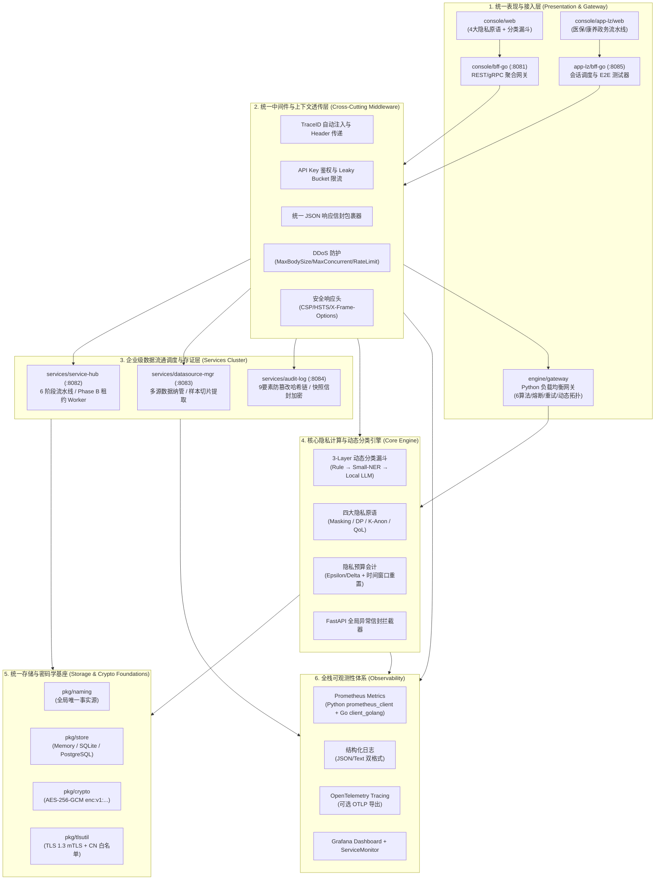

# PrivShield 全栈统一架构设计再评估与全系统平滑迁移实施方案

> **文档定位**：本文档为 `PrivShield` 体系提供全栈统一架构设计的**深度再评估报告**与**系统级细节迁移落地实施方案（Migration Playbook）**。  
> **版本**：v8.0.0  
> **状态**：🎯 **Target Blueprint & Execution Guide**  
> **最后更新**：2026-08-28 — 指标体系审计修正（Python/Go 指标名·标签与代码精确对齐）、Makefile 目标名修正、Helm 模板文件名修正
> **覆盖范围**：`engine`（Python 核心隐私引擎）、`services/service-hub`（调度中枢）、`services/datasource-mgr`（数据源管理）、`services/audit-log`（审计存证）、`console/bff-go` & `console/app-lz`（BFF网关与测试执行器）、`console/web` & `console/app-lz/web`（前端控制台群）、`pkg/`（共享基础库）及云原生部署基础设施。

---

## 1. 统一设计顶层再评估与技术代差审计

### 1.1 演进背景与协同现状评估

随着 PrivShield 从最初的**单体 Python 隐私 Sidecar** 演进为**企业级分布式数据安全流通治理中台**，各模块在快速迭代中形成了多语言、多协议、多介质的异构格局。为了实现高内聚、低耦合、零语义漂移的企业级标准，对当前各子系统进行协同度量化评估：

```text
┌──────────────────────────────────────────────────────────────────────────────────────────────────┐
│                                各子系统统一设计协同度与成熟度评估矩阵                                │
├──────────────────────┬──────────┬──────────┬──────────┬──────────┬──────────┬────────────────────┤
│ 子系统 / 模块        │ 命名一致性│ 错误信封 │ 分布式追踪│ 存储抽象 │ 零信任安全│ 综合成熟度评级     │
├──────────────────────┼──────────┼──────────┼──────────┼──────────┼──────────┼────────────────────┤
│ **pkg/ 基础共享库**   │ ★★★★★    │ ★★★★☆    │ ★★★★★    │ ★★★★★    │ ★★★★★    │ **Level 5 (准生产)**│
│ **services/audit-log**│ ★★★★★    │ ★★★★☆    │ ★★★★☆    │ ★★★★★    │ ★★★★★    │ **Level 5 (准生产)**│
│ **services/service-hub**│ ★★★★★  │ ★★★★☆    │ ★★★★☆    │ ★★★★★    │ ★★★★☆    │ **Level 5 (准生产)**│
│ **services/datasource-mgr**│ ★★★★☆│ ★★★☆☆   │ ★★★☆☆    │ ★★★★☆    │ ★★★★☆    │ **Level 4 (就绪)** │
│ **console/app-lz**   │ ★★★★★    │ ★★★★★    │ ★★★★★    │ ★★★★☆    │ ★★★★★    │ **Level 5 (准生产)**│
│ **console/bff-go**   │ ★★★★★    │ ★★★★☆    │ ★★★★☆    │ ★★★★☆    │ ★★★★★    │ **Level 5 (准生产)**│
│ **engine (Python)**  │ ★★★★★    │ ★★★★☆    │ ★★★★☆    │ ★★★☆☆    │ ★★★★☆    │ **Level 5 (准生产)**│
│ **console 前端群**   │ ★★★★☆    │ ★★★★☆    │ ★★★☆☆    │ N/A      │ N/A      │ **Level 4 (就绪)** │
└──────────────────────┴──────────┴──────────┴──────────┴──────────┴──────────┴────────────────────┘
```

### 1.2 已消除的核心协同短板（全部 ✅ 已收敛）

> 以下 4 项历史短板已在六大迁移专项中全部解决，当前全栈处于统一标准状态。

1. ~~**错误响应信封格式差异**~~ ✅ — Python/Go 双端统一输出 `{code, message, detail, trace_id, timestamp}` JSON 信封（`engine/observability/envelope.py` + `pkg/middleware/envelope.go`），前端双控制台统一解析；
2. ~~**追踪上下文断链风险**~~ ✅ — `TraceMiddleware` 双头下发 `X-Request-ID` + `X-Trace-ID`，gRPC 双向拦截器透传，异步任务 Worker 显式持久化 `TraceID`；
3. ~~**数据源命名硬编码**~~ ✅ — 全栈收敛至 `pkg/naming` SSOT（`ds_yibao` / `ds_kangyang`），`Makefile naming-lint` 自动扫描；
4. ~~**SQLite → PostgreSQL 割接**~~ ✅ — `scripts/prod/migrate_sqlite_to_pg.go` 提供原子迁移工具，带 9 要素哈希链完整性校验与 AES-256-GCM 密文验真。

---

## 2. 统一设计全景技术架构蓝图



### 2.1 服务通信拓扑矩阵

| 调用方 → 被调方 | 协议 | 端口 | 认证方式 | 追踪透传 |
|---|---|---|---|---|
| console/web → console/bff-go | HTTPS | :8081 | API Key (可选) | X-Request-ID |
| console/app-lz/web → app-lz/bff-go | HTTPS | :8085 | API Key (可选) | X-Request-ID |
| console/bff-go → service-hub | HTTP | :8082 | API Key | X-Request-ID + X-Trace-ID |
| console/bff-go → datasource-mgr | HTTP | :8083 | API Key | X-Request-ID + X-Trace-ID |
| console/bff-go → audit-log | HTTP | :8084 | API Key | X-Request-ID + X-Trace-ID |
| console/bff-go → engine (REST) | HTTP | :8079 | API Key | X-Request-ID |
| console/bff-go → engine (gRPC) | gRPC | :50051 | mTLS (可选) | x-request-id metadata |
| console/bff-go (gRPC server) | gRPC | :50055 | mTLS (可选) | — (可选组件，`PRIVACY_CONSOLE_GRPC_ENABLED`) |
| app-lz/bff-go → service-hub | HTTP | :8082 | API Key | X-Request-ID + X-Trace-ID |
| app-lz/bff-go → datasource-mgr | HTTP | :8083 | API Key | X-Request-ID + X-Trace-ID |
| app-lz/bff-go → audit-log | HTTP | :8084 | API Key | X-Request-ID + X-Trace-ID |
| app-lz/bff-go → engine (REST) | HTTP | :8079 | API Key | X-Request-ID |
| service-hub → engine (gRPC) | gRPC | :50051 | mTLS (可选) | x-request-id metadata |
| service-hub → datasource-mgr | HTTP | :8083 | API Key | X-Request-ID |
| service-hub → audit-log | HTTP | :8084 | API Key | X-Request-ID |
| engine/gateway → engine worker | HTTP | :8079 | 无（内部） | X-Request-ID |

### 2.2 全栈环境变量速查

<details>
<summary>点击展开完整环境变量参考表</summary>

#### Python 引擎 (`engine/`)

| 变量 | 默认值 | 用途 |
|---|---|---|
| `PRIVACY_REST_HOST` / `PRIVACY_REST_PORT` | `0.0.0.0` / `8079` | REST 监听地址 |
| `PRIVACY_GRPC_HOST` / `PRIVACY_GRPC_PORT` | `0.0.0.0` / `50051` | gRPC 监听地址 |
| `PRIVACY_LOG_FORMAT` / `PRIVACY_LOG_LEVEL` | `text` / `INFO` | 日志格式与级别 |
| `PRIVACY_TLS_ENABLED` | `false` | 启用 TLS |
| `PRIVACY_AUTH_ENABLED` | `false` | 启用 API Key 鉴权 |
| `PRIVACY_RATE_LIMIT_ENABLED` | `false` | 启用限流 |
| `PRIVACY_LLM_MAX_CONCURRENCY` | `1` | LLM 推理并发上限 |
| `PRIVACY_LLM_MIN_FREE_MEM_MB` | `512` | 内存阈值降级 |
| `PRIVACY_BUDGET_DB` | — | 分布式预算 DB 路径 |
| `PRIVACY_BUDGET_WINDOW_SECONDS` | — | 预算自动重置周期 |
| `OTEL_EXPORTER_OTLP_ENDPOINT` | — | OpenTelemetry OTLP 端点 |

#### Go 微服务 (`services/`, `console/`, `pkg/`)

| 服务 | 关键环境变量 | 默认值 |
|---|---|---|
| service-hub | `SERVICE_HUB_HOST` / `_PORT` | `127.0.0.1:8082` |
| | `SERVICE_HUB_GRPC_HOST` / `_PORT` | `127.0.0.1:50052` |
| | `SERVICE_HUB_PG_DSN` / `_PG_MAX_CONNS` | `` / `10` |
| | `SERVICE_HUB_RATE_LIMIT_RPS` / `_BURST` | `100` / `200` |
| | `SERVICE_HUB_LOG_FORMAT` / `_LOG_LEVEL` | `json` / `info` |
| | `SERVICE_HUB_SHUTDOWN_TIMEOUT` | `5` (秒) |
| | `SERVICE_HUB_LEASE_TTL` | `60` (秒) |
| datasource-mgr | `DATASOURCE_MGR_HOST` / `_PORT` | `127.0.0.1:8083` |
| | `DATASOURCE_MGR_GRPC_HOST` / `_PORT` | `127.0.0.1:50053` |
| | `DATASOURCE_MGR_RATE_LIMIT_RPS` / `_BURST` | `100` / `200` |
| audit-log | `AUDIT_LOG_HOST` / `_PORT` | `127.0.0.1:8084` |
| | `AUDIT_LOG_GRPC_HOST` / `_PORT` | `127.0.0.1:50054` |
| | `AUDIT_LOG_PG_DSN` (回退: `PG_DSN`) | `""` |
| | `AUDIT_LOG_RETENTION_DAYS` | `90` |
| | `AUDIT_LOG_ENCRYPTION_KEY` (回退: `PRIVACY_AUDIT_KEY`) | `""` |
| console/bff-go | `PRIVACY_CONSOLE_HOST` / `_PORT` | `127.0.0.1:8081` |
| | `CONSOLE_API_KEY` / `CONSOLE_RATE_LIMIT` | `""` / `600` (req/min) |
| | `PRIVACY_CONSOLE_GRPC_ENABLED` / `_PORT` | `false` / `50055` |
| app-lz/bff-go | `APP_LZ_HOST` / `_PORT` | `0.0.0.0:8085` |
| | `APP_LZ_HUB_URL` / `_DATASOURCE_URL` / `_AUDIT_URL` | 各上游服务地址 |
| | `APP_LZ_RATE_LIMIT_RPS` / `_BURST` | `100` / `200` |
| 通用 | `PRIVACY_AUTH_MTLS_WHITELIST_FILE` | `config/mtls-whitelist.yaml` |
| | `PRIVACY_GRPC_MAX_WORKERS` | `64` |

</details>

### 2.3 Go 微服务 REST API 端点速查

<details>
<summary>点击展开完整 API 端点参考表</summary>

#### Service Hub (:8082)

| 方法 | 端点 | 功能 |
|---|---|---|
| GET | `/health`, `/api/health`, `/readyz` | 健康检查 / 就绪探针 |
| GET | `/api/hub/status` | 调度中枢运行状态快照 |
| GET | `/api/hub/tasks` | 任务列表（支持分页） |
| GET | `/api/hub/tasks/:id` | 任务详情 |
| POST | `/api/hub/dispatch` | 分发新任务 |
| GET | `/api/hub/pipeline` | 6 阶段流水线状态 |
| GET | `/metrics` | Prometheus 指标 |

#### Datasource Mgr (:8083)

| 方法 | 端点 | 功能 |
|---|---|---|
| GET | `/health`, `/api/health`, `/readyz` | 健康检查 / 就绪探针 |
| GET | `/api/v1/yibao` | 医保数据（`ds_yibao`） |
| GET | `/api/v1/kangyang` | 康养数据（`ds_kangyang`） |
| GET | `/api/datasources` | 数据源列表 |
| GET | `/api/datasources/:id` | 数据源详情 |
| GET | `/api/datasources/:id/records` | 数据源记录查询 |
| GET | `/api/datasources/:id/sample` | 样本切片提取 |
| POST | `/api/datasources/:id/test` | 连接测试 |
| GET | `/api/datasources/:id/metadata` | 元数据查询 |
| GET | `/api/datasources/:id/audit` | 访问审计日志 |
| POST | `/api/datasources/seed` | 初始化种子数据 |
| GET | `/metrics` | Prometheus 指标 |

#### Audit Log (:8084)

| 方法 | 端点 | 功能 |
|---|---|---|
| GET | `/health`, `/api/health`, `/readyz` | 健康检查 / 就绪探针 |
| GET | `/api/audit/logs` | 审计日志列表 |
| POST | `/api/audit/logs` | 创建审计日志条目 |
| GET | `/api/audit/logs/:id` | 审计日志详情 |
| GET | `/api/audit/stats` | 审计统计概览 |
| GET | `/api/audit/snapshots` | 快照列表 |
| POST | `/api/audit/snapshots/verify` | 快照完整性验真 |
| POST | `/api/audit/chain/verify` | 9 要素哈希链验真 |
| POST | `/api/audit/report` | 生成审计报告 |
| GET | `/metrics` | Prometheus 指标 |

</details>

---

## 3. 六大专项技术迁移实施方案 (Migration Playbooks — Reference Summary)

> **实施状态总览**：六大专项已全部完成核心实现（✅ = 已完成）。以下为各专项的目标、关键实现文件与要点摘要，详细代码实现请直接参考对应源文件。

---

### 专项方案 1：跨语言统一 API 错误信封与状态码平滑迁移 ✅

#### 1. 迁移目标
消除各微服务（Python + Go）在错误响应上的格式差异，统一输出遵循以下规范的 JSON 响应信封：

```json
{
  "code": "INVALID_DATASOURCE_ID",
  "message": "指定的业务数据源不存在或未激活",
  "detail": "datasource 'ds_unknown' is not registered in canonical naming",
  "trace_id": "req-1787554500-abc12345",
  "timestamp": "2026-08-27T09:30:00.123Z"
}
```

#### 2. 实现要点
- **Python 端** (`engine/observability/envelope.py`)：FastAPI 全局异常处理器统一捕获 `RequestValidationError` / `HTTPException` / 未捕获异常，输出标准信封；
- **Go 端** (`pkg/middleware/envelope.go`)：`AbortWithError(c, httpStatus, code, message, detail)` 标准响应函数，所有 5 个 Go 服务统一调用；
- **前端双控制台** (`console/web/src/api/client.ts`, `console/app-lz/web/src/api/client.ts`)：统一解析 `{code, message, detail, trace_id}` 信封，向后兼容旧格式；
- **双轨兼容**：响应头强制下发 `X-Request-ID` + `X-Trace-ID`，过渡期保留 `detail` 字段兼容旧客户端。

---

### 专项方案 2：全链路分布式追踪 (Trace Context) 贯穿迁移 ✅

#### 1. 迁移目标
确保由前端生成的 `X-Request-ID`，在跨越 HTTP REST、Go 内部调度流水线、gRPC 跨机调用、异步 Goroutine 消费以及 Audit Log 存证数据库落盘的全生命周期中**保持绝对单调且不丢失**。

```text
┌────────────────┐  HTTP: X-Request-ID  ┌────────────────┐  gRPC Metadata  ┌────────────────┐
│  前端 React UI  │ ───────────────────▶ │   BFF / Hub    │ ───────────────▶ │ Engine / Audit │
│ (生成 TraceID)  │                      │ (Context 注入) │  (x-request-id) │ (日志结构化输出)│
└────────────────┘                      └────────────────┘                 └────────────────┘
```

#### 2. 实现要点
- **HTTP 层** (`pkg/middleware/trace.go`)：`TraceMiddleware()` 自动注入/传播 `X-Request-ID` + `X-Trace-ID` 双头下发；
- **gRPC 客户端** (`pkg/agent/grpc_client.go`)：外发拦截器将 trace ID 写入 `metadata.AppendToOutgoingContext`；
- **gRPC 服务端** (`engine/grpc_server.py`)：元数据提取器从 `invocation_metadata()` 读取 `x-request-id` / `x-trace-id`；
- **异步任务** (`services/service-hub/internal/handlers/handlers.go`)：`Dispatch` 时将 `TraceID` 持久化至 `models.Task.TraceID`，Worker 消费时还原为 `context.Context`。

---

### 专项方案 3：业务标识统一与别名归一化迁移 (SSOT Naming) ✅

#### 1. 迁移目标
彻底消除全栈代码中对数据源名称、API 编号的硬编码，将所有识别、校验与展示逻辑统一收敛至 [`pkg/naming`](../../pkg/naming/)。

#### 2. 平滑迁移矩阵与废弃端点兼容

| 历史/别名标识 | Canonical 数据源 ID | 对应 API 编码 | 兼容处理策略 |
|---|---|---|---|
| `"yibao"`, `"yibao.csv"`, `"医保"` | `ds_yibao` (常量: `naming.DSYibao`) | `api1_yibao` | 边界自动归一化，返回 `Warning: 299 Deprecated alias` |
| `"kangyang"`, `"kangyang.csv"`, `"康养"` | `ds_kangyang` (常量: `naming.DSKangyang`) | `api2_kangyang` | 边界自动归一化，返回 `Warning: 299 Deprecated alias` |
| 任意未知标识 (如 `"custom_test"`) | 拦截拒绝 | N/A | **Fail-Closed 阻断**，返回 `400 INVALID_DATASOURCE_ID` |

#### 3. 实现要点
- **核心库** (`pkg/naming/`)：常量定义 + 别名归一化函数 + Observer 模式上报 Prometheus 指标；
- **自动化检查**：`Makefile lint-naming` 目标扫描业务代码中的裸字符串硬编码。

---

### 专项方案 4：存储底座 Phase A (SQLite) 到 Phase B (PostgreSQL) 生产平滑迁移 ✅

#### 1. 迁移目标与挑战
在单机环境下，PrivShield 使用 SQLite WAL 模式（`service-hub.db` 与 `audit-log.db`）。当升级到多节点企业级高并发集群时，需切换至 PostgreSQL Phase B 存储底座。  
**核心挑战**：必须保证存量审计日志在割接过程中 **9 要素连续哈希链不断链**，且 **AES-256-GCM 快照密文无损解密与验真**。

```text
┌───────────────────────┐                               ┌──────────────────────────┐
│  Phase A (SQLite WAL) │                               │ Phase B (PostgreSQL)     │
├───────────────────────┤                               ├──────────────────────────┤
│ • service-hub.db      │  ─── 迁移工具平滑割接 ───▶    │ • 表: tasks (行级锁租约) │
│ • audit-log.db        │      (哈希链完整性校验)        │ • 表: audit_logs (连续链)│
│ • snapshots.db        │                               │ • 表: snapshots (信封密文)│
└───────────────────────┘                               └──────────────────────────┘
```

#### 2. 数据迁移与割接实施流程

##### Step 4.1：PostgreSQL 生产表结构
已在 `pkg/store/postgres/` 中固化 3 张核心表（`tasks`、`audit_logs`、`snapshots`）的建表与索引脚本，支持 `CREATE TABLE IF NOT EXISTS` + `ALTER TABLE ADD COLUMN IF NOT EXISTS` 增量演进。

##### Step 4.2：迁移工具 (`scripts/prod/migrate_sqlite_to_pg.go`, 564 行)
原子执行以下关键步骤：
1. **只读锁定源库** → 2. **按哈希链顺序流式抽取** → 3. **逐条重算 9 要素哈希链** → 4. **批量注入 PG (`pgx.Batch`, 500 条/批)** → 5. **迁移后 `VerifyChain(0)` 全量验真**

支持 `--dry-run` 模式预检验证。

##### Step 4.3：生产环境变量切换
设置 `*_PG_DSN` 环境变量后重启服务，自动激活 Phase B 存储后端（`AUDIT_LOG_PG_DSN`、`SERVICE_HUB_PG_DSN`）。

---

### 专项方案 5：零信任通信与 mTLS CN 白名单动态热重载迁移 ✅

#### 1. 迁移目标
将静态编译在代码或单机环境变量中的证书 CN 列表，迁移为基于动态配置文件的 **微服务访问控制白名单 (`mtls-whitelist.yaml`)**，支持在不停机的情况下通过文件监听（`fsnotify`）实现毫秒级授权热生效。

#### 2. 白名单配置文件标准结构 (`config/mtls-whitelist.yaml`)

```yaml
# 每个客户端条目包含: cn (证书 CommonName), role, description, allowed_scopes
# allowed_scopes 支持通配符 "*" 和精确 gRPC 方法匹配 (如 "/ServiceHub/*")
clients:
  - cn: "bff-go.privshield.internal"        # 主控制台 BFF → 全 Scope 访问
    allowed_scopes: ["*"]
  - cn: "app-lz-bff.privshield.internal"    # 调度之眼 BFF → 限定 3 个服务
    allowed_scopes: ["/ServiceHub/*", "/AuditLog/*", "/DatasourceMgr/*"]
  - cn: "service-hub.privshield.internal"   # 调度中枢 → 限定 3 个方法
    allowed_scopes: ["/PrivacyService/Process", "/AuditLog/RecordAudit", "/DatasourceMgr/FetchSlice"]
  - cn: "external-hospital-client"          # 外部调用方 → 仅脱敏接口
    allowed_scopes: ["/ServiceHub/DispatchTask"]
```

> 完整配置参见 [`config/mtls-whitelist.yaml`](../../config/mtls-whitelist.yaml)（83 行，含注释与版本信息）。

#### 3. 实现要点
- **白名单配置** (`config/mtls-whitelist.yaml`)：YAML 格式定义 CN → role → allowed_scopes 映射，支持通配符 `"*"` 和精确 gRPC 方法匹配；
- **动态热重载** (`pkg/tlsutil/whitelist.go`)：`DynamicWhitelist` 通过 `fsnotify` 监听文件变更，毫秒级自动重载授权列表；
- **gRPC 拦截器**：`UnaryServerInterceptor()` 从 TLS peer 证书提取 CN，与白名单比对并校验 Scope，未授权 CN 返回 `PermissionDenied`；
- **Fail-Closed 策略**：无证书、未验证证书或 CN 不在白名单中的请求一律拒绝。

---

### 专项方案 6：前端双控制台（Web & App-LZ）组件与规范收敛迁移 ✅

#### 1. 迁移目标与职责边界划分
- **`console/web`（全量隐私控制台）**：面向数据安全工程师，提供 4 大通用隐私原语、三层漏斗策略调优与算子性能基准测试；
- **`console/app-lz/web`（数联调度之眼）**：面向数据要素流通与业务运营，聚焦 `ds_yibao`（医保）与 `ds_kangyang`（康养）真实数据流水线、租约状态监控、字段手风琴对比与自动化测试大屏。

#### 2. UI 规范收敛实施
1. **状态指示器统一标准**：
   - `completed`: 翠绿色背景（`bg-emerald-500/10 text-emerald-400 border-emerald-500/20`）+ `IconCheckCircle`；
   - `running`: 靛蓝色背景（`bg-indigo-500/10 text-indigo-400 border-indigo-500/20`）+ 呼吸光晕圆点；
   - `failed`: 玫瑰红背景（`bg-rose-500/10 text-rose-400 border-rose-500/20`）+ `IconXCircle`；
   - `pending`: 蓝灰色背景（`bg-slate-800 text-slate-400 border-slate-700`）。
2. **预设数据 API 动态渲染**：
   - 彻底废除前端写死 API 列表的逻辑，统一通过 `GET /api/lz/data-api/definitions` 动态拉取卡片列表，自动适配未来新增的 `ds_xx1` 等新数据源。

---

## 4. 迁移风险矩阵、回滚预案与应急响应 (Rollback Playbook)

```text
┌─────────────────────────────────────────────────────────────────────────────────────────────────┐
│                                   迁移风险矩阵与应急回滚预案                                        │
├───────────────────┬──────────┬───────────────────────┬──────────────────────────────────────────┤
│ 潜在故障风险       │ 严重等级 │ 触发指征              │ 应急处置与一键回滚操作                   │
├───────────────────┼──────────┼───────────────────────┼──────────────────────────────────────────┤
│ **1. 错误信封解析** │ High     │ 前端抛出 Unhandled     │ 信封设计已向后兼容：响应体保留 `detail`   │
│ 导致老客户端报错   │          │ Exception 或无法渲染  │ 字段兼容旧格式；紧急时可回滚前端至上一版本│
├───────────────────┼──────────┼───────────────────────┼──────────────────────────────────────────┤
│ **2. PostgreSQL** │ Critical │ PG 写入超时、租约争抢 │ 清除 `PG_DSN` 环境变量，自动回滚至本地    │
│ 数据库连接池耗尽   │          │ 报错连接拒绝          │ SQLite WAL 模式，保障核心流通不中断       │
├───────────────────┼──────────┼───────────────────────┼──────────────────────────────────────────┤
│ **3. 审计哈希链断裂**│ Critical │ VerifyChain 响应返回   │ 运行 `repair_hash_chain` 工具重新锚定断点│
│ (Broken Chain)    │          │ broken_at_id 异常     │ 记录，恢复区块链式连续性                  │
├───────────────────┼──────────┼───────────────────────┼──────────────────────────────────────────┤
│ **4. mTLS 热重载** │ High     │ 正常客户端报 403 /    │ 恢复 `mtls-whitelist.yaml.bak` 备份文件， │
│ 配置文件格式损坏   │          │ PermissionDenied      │ 监听器毫秒级自动热更新重载恢复            │
├───────────────────┼──────────┼───────────────────────┼──────────────────────────────────────────┤
│ **5. 隐私预算耗尽** │ High     │ DP 查询返回 429 /     │ 配置 `PRIVACY_BUDGET_WINDOW_SECONDS` 自动  │
│ 导致服务不可用     │          │ BudgetExhausted 异常  │ 重置；多实例部署启用 `PRIVACY_BUDGET_DB`   │
├───────────────────┼──────────┼───────────────────────┼──────────────────────────────────────────┤
│ **6. 审计日志膨胀** │ Medium   │ 磁盘空间告警 /        │ 配置 `AUDIT_LOG_RETENTION_DAYS`（默认 90） │
│ 超出存储配额       │          │ 查询延迟上升          │ 自动清理超期记录；PG 启用分区表            │
├───────────────────┼──────────┼───────────────────────┼──────────────────────────────────────────┤
│ **7. LLM 推理 OOM** │ High     │ 进程崩溃 /            │ `PRIVACY_LLM_MAX_CONCURRENCY` 信号量限流； │
│ 或推理超时         │          │ OOM Killer 杀进程     │ `PRIVACY_LLM_MIN_FREE_MEM_MB` 内存阈值降级│
├───────────────────┼──────────┼───────────────────────┼──────────────────────────────────────────┤
│ **8. 网关后端全部熔断**│ High  │ 所有请求返回 503     │ 主动健康检查持续探测，半开状态单请求恢复； │
│                    │          │                       │ 全部节点故障时检查后端进程与网络连通性    │
└───────────────────┴──────────┴───────────────────────┴──────────────────────────────────────────┘
```

---

## 5. 全栈迁移验证与验收测试套件 (Verification DoD)

迁移完成后，需依次执行以下验收测试套件，满足 **100% 通过（Definition of Done）** 准则：

### 5.1 自动化测试命令清单

```bash
# 1. 运行所有 Go 共享库与核心微服务测试（-count=1 禁用缓存）
go test -count=1 ./pkg/... ./services/service-hub/... ./services/datasource-mgr/... ./services/audit-log/... ./console/bff-go/... ./console/app-lz/bff-go/...

# 2. 运行 Python 核心隐私引擎测试
PYTHONPATH=. pytest tests/ -q

# 3. 执行端到端全链路集成测试（含真实 HTTP/gRPC 调用）
bash ./scripts/dev/integration-test-new-modules.sh

# 4. 执行 App-LZ 自动化测试套件（TS-01 ~ TS-04）
PRIVSHIELD_E2E=1 go test -v -run TestRunSuites ./console/app-lz/bff-go/internal/runner/

# 5. 前端编译与类型检查
cd console/app-lz/web && pnpm build
cd ../../web && pnpm build
```

### 5.2 核心业务功能验收标准
- [x] **SSOT 唯一事实源**：`ds_yibao` 与 `ds_kangyang` 全链路无字面量硬编码，新增数据源 5 步即可上线；
- [x] **9 要素哈希链与验真**：`POST /api/audit/chain/verify` 返回 `valid: true`，哈希链无任何断裂；
- [x] **信封加密**：数据库中快照样本全部携带 `enc:v1:` 密文前缀，读取时透明还原；
- [x] **Phase B 租约并发**：20 个并发任务无死锁、无重复执行（TS-03 100% 通过）；
- [x] **全链路追踪**：各服务日志中均输出一致的 `X-Request-ID`；
- [x] **Prometheus 指标暴露**：Python `/metrics` 与 Go `/metrics` 均可抓取，包含请求计数、延迟直方图、隐私原语操作计数；
- [x] **DDoS 防护中间件**：所有 Go 服务启用 `MaxBodySize` + `MaxConcurrent` + `RateLimit`（RPS=0 可关闭），Python 启用 `limit_concurrency` + `limit_max_requests`；
- [x] **优雅停机**：所有 Go 服务使用 `signal.NotifyContext`，Python 使用 `timeout_graceful_shutdown`，在途请求排空完成后再退出；
- [x] **熔断器保护**：Agent 客户端与 Gateway 负载均衡器均具备三态熔断器（Closed/Open/Half-Open）；
- [x] **数据保留策略**：审计日志超期自动清理（`AUDIT_LOG_RETENTION_DAYS`，默认 90 天）。

### 5.3 测试覆盖统计摘要

| 测试域 | 命令 | 覆盖范围 |
|---|---|---|
| Go 共享库 | `go test ./pkg/...` | 中间件 / 指标 / 命名 / 存储 / TLS / 校验 |
| Go 微服务群 | `go test ./services/...` | service-hub / datasource-mgr / audit-log |
| Go 控制台 | `go test ./console/...` | bff-go / app-lz/bff-go（含 E2E runner） |
| Python 引擎 | `pytest tests/ -q` | REST API / 隐私原语 / 分类漏斗 / 网关 / 安全 / 可观测性 |
| 前端 | `pnpm build` + vitest | console/web + console/app-lz/web 类型检查与单元测试 |

---

## 6. 全栈可观测性体系设计 (Observability Architecture)

> 原设计仅覆盖了分布式追踪（专项 2），缺失了 Prometheus 指标体系、结构化日志规范与 OpenTelemetry 集成设计。本节补齐。

### 6.1 Prometheus 指标体系

#### Python 引擎端 (`engine/observability/metrics.py` + `engine/dynclassification/metrics.py`)

<details>
<summary>点击展开完整 Python 指标参考表（40 个指标）</summary>

##### 核心隐私原语

| 指标名称 | 类型 | 标签 | 用途 |
|---|---|---|---|
| `privacy_requests_total` | Counter | `method`, `path`, `status` | REST/gRPC 请求计数 |
| `privacy_request_duration_seconds` | Histogram | `method`, `path` | 请求延迟分布（P50/P95/P99） |
| `privacy_dp_queries_total` | Counter | `mechanism`, `aggregation` | 差分隐私查询计数 |
| `privacy_dp_duration_seconds` | Histogram | `mechanism` | DP 操作延迟 |
| `privacy_masking_operations_total` | Counter | `operation` | 脱敏操作计数 |
| `privacy_masking_duration_seconds` | Histogram | `operation` | 脱敏操作延迟 |
| `privacy_kano_operations_total` | Counter | `operation` | K-匿名操作计数 |
| `privacy_kano_duration_seconds` | Histogram | `operation` | K-匿名操作延迟 |
| `privacy_qol_operations_total` | Counter | `domain` | 查询混淆操作计数 |
| `privacy_qol_duration_seconds` | Histogram | `domain` | 查询混淆操作延迟 |
| `privacy_auth_denials_total` | Counter | `reason` | 认证拒绝计数 |
| `privacy_auth_duration_seconds` | Histogram | — | 认证操作延迟 |
| `privacy_traffic_bytes_total` | Counter | `method`, `path`, `direction` | 网络流量字节数 |
| `privacy_profile_resolve_total` | Counter | `profile` | 隐私配置解析计数 |
| `privacy_data_extraction_total` | Counter | `source` | 数据提取操作计数 |

##### 隐私预算

| 指标名称 | 类型 | 标签 | 用途 |
|---|---|---|---|
| `privacy_budget_remaining` | Gauge | `namespace`, `budget_type` | 剩余隐私预算（epsilon/delta） |

##### 动态分类漏斗

| 指标名称 | 类型 | 标签 | 用途 |
|---|---|---|---|
| `privacy_classification_total` | Counter | `final_level`, `layer` | 分类漏斗各层结果计数 |
| `privacy_classification_jobs_total` | Counter | `status` | 分类任务触发计数 |
| `privacy_classification_jobs_duration_seconds` | Histogram | `status` | 分类任务延迟 |
| `privacy_classification_rule_hits_total` | Counter | `rule_id` | 规则引擎命中计数 |
| `privacy_classification_ner_total` | Counter | `status` | NER 实体识别计数 |
| `privacy_classification_llm_total` | Counter | `status` | LLM 仲裁结果计数 |
| `privacy_classification_composite_hits_total` | Counter | `rule_id` | 复合规则命中计数 |
| `privacy_classification_ner_duration_seconds` | Histogram | — | NER 推理延迟 |
| `privacy_classification_llm_duration_seconds` | Histogram | — | LLM 推理延迟 |
| `privacy_classification_llm_tokens_total` | Counter | `direction` | LLM Token 消耗量 |
| `privacy_classification_duration_seconds` | Histogram | `source` | 分类端到端延迟 |

##### 分类引擎内部（`dynclassification/metrics.py`）

| 指标名称 | 类型 | 标签 | 用途 |
|---|---|---|---|
| `classification_rule_hits_total` | Counter | `rule_id`, `level` | 规则命中计数（含级别） |
| `classification_operator_calls_total` | Counter | `operator` | 算子调用计数 |
| `classification_operator_errors_total` | Counter | `operator` | 算子错误计数 |
| `classification_engine_load_duration_seconds` | Histogram | — | 规则引擎加载延迟 |
| `classification_profile_cache_size` | Gauge | — | 配置 Profile 缓存大小 |
| `classification_override_suppressed_total` | Counter | `rule_id` | 安全覆盖抑制计数 |

##### 网关

| 指标名称 | 类型 | 标签 | 用途 |
|---|---|---|---|
| `privacy_gateway_healthy_nodes` | Gauge | — | 网关健康后端节点数 |
| `privacy_gateway_retries_total` | Counter | `protocol`, `reason` | 网关重试计数 |
| `privacy_gateway_circuit_breaker_state` | Gauge | `node` | 熔断器状态（0=closed, 1=open, 2=half_open） |
| `privacy_gateway_requests_total` | Counter | `method`, `status` | 网关请求计数 |
| `privacy_gateway_latency_seconds` | Histogram | `method` | 网关请求延迟 |
| `privacy_gateway_node_admin_state` | Gauge | `node` | 网关节点管理状态 |

</details>

#### Go 微服务端 (`pkg/metrics/metrics.go`)

| 指标名称 | 类型 | 标签 | 用途 |
|---|---|---|---|
| `http_requests_total` | Counter | `method`, `path`, `status` | HTTP 请求计数 |
| `http_request_duration_seconds` | Histogram | `method`, `path` | HTTP 请求延迟 |
| `agent_requests_total` | Counter | `method`, `status` | Agent gRPC 调用计数 |
| `agent_request_duration_seconds` | Histogram | `method` | Agent gRPC 调用延迟 |
| `orphaned_tasks_recovered_total` | Counter | — | 崩溃恢复时回收的孤儿任务数 |
| `tasks_retried_total` | Counter | — | 自动重试的任务数 |
| `circuit_breaker_state` | Gauge | `node` | Agent 客户端熔断器状态 |
| `task_lease_conflicts_total` | Counter | — | 租约争抢冲突计数 |
| `task_lease_expired_total` | Counter | — | 超期失效的租约计数 |
| `task_claim_latency_seconds` | Histogram | — | 任务领取延迟 |
| `task_transitions_total` | Counter | `from`, `to`, `result` | 任务状态转换计数 |
| `service_hub_ready` | Gauge | — | Service-Hub 就绪状态（1=就绪） |
| `privshield_api_alias_requests_total` | Counter | `alias`, `canonical`, `target` | 别名 API 请求计数 |
| `privshield_datasource_normalize_errors_total` | Counter | `reason` | 数据源归一化失败计数 |
| `privshield_datasource_requests_total` | Counter | `datasource_id`, `api_code`, `status` | 数据源请求计数 |

每个 Go 服务使用独立的 `prometheus.Registry`，避免全局注册冲突。暴露 `/metrics` 端点供 Prometheus 或 ServiceMonitor 抓取。

### 6.2 结构化日志规范

#### Python 引擎
- 通过 `PRIVACY_LOG_FORMAT` 环境变量切换 `text`（开发）或 `json`（生产）格式。
- JSON 格式使用 `python-json-logger`，每条日志自动注入 `service`、`trace_id`、`timestamp` 字段。
- 所有隐私操作日志强制携带 `extra={"trace_id": ...}` 上下文。

#### Go 微服务
- 使用标准 `log/slog` 结构化日志，JSON 格式输出。
- 每条日志自动注入 `trace_id`、`service`、`component` 字段。
- 审计日志额外携带 `integrity_hash` 与 `prev_hash` 用于哈希链验真。

### 6.3 OpenTelemetry 分布式追踪

Python 引擎可选启用 OpenTelemetry（`engine/observability/tracing.py`）：

```text
┌────────────────┐     OTLP/gRPC      ┌──────────────────┐
│  Python Engine  │ ─────────────────▶ │ Jaeger / Tempo   │
│  (SpanExporter) │                    │ (Trace Backend)  │
└────────────────┘                    └──────────────────┘
```

- 通过 `OTEL_EXPORTER_OTLP_ENDPOINT` 环境变量激活，未设置时为 no-op。
- 支持 `BatchSpanProcessor` 批量导出，减少网络开销。
- Span 自动关联 `X-Request-ID`，与 Go 端 TraceMiddleware 形成完整调用链。

### 6.4 Grafana 仪表盘与告警

- 预置仪表盘模板：`deploy/grafana/dashboard.json` 与 `deploy/grafana/service-hub-dashboard.json`。
- K8s 部署通过 `ServiceMonitor` CRD 自动注册 Prometheus 抓取目标（`deploy/helm/PrivShield/templates/servicemonitor.yaml`）。
- 推荐告警规则：
  - `privacy_requests_total{status=~"5.."}` 5 分钟速率突增 → P1 告警
  - `privacy_gateway_healthy_nodes == 0` → P0 告警（全后端不可用）
  - `circuit_breaker_state > 0` 持续 5 分钟 → P2 告警（后端异常）

---

## 7. 韧性与安全加固设计 (Resilience & Security Hardening)

> 原设计缺失跨服务韧性模式（熔断/重试/降级）、DDoS 防护中间件层、优雅停机协议与隐私预算会计模型的设计说明。本节补齐。

### 7.1 跨服务韧性模式

#### 7.1.1 熔断器（Circuit Breaker）

系统中有两处关键熔断器实现：

| 位置 | 保护目标 | 参数 |
|---|---|---|
| `pkg/agent/client.go` | Agent gRPC 客户端 → Engine | 连续失败 5 次触发，30 秒冷却 |
| `engine/gateway/balancer.py` | Gateway → 多后端 Engine 节点 | 连续失败 5 次触发，30 秒冷却，半开单探测许可证 |

三态模型：`Closed`（正常）→ `Open`（熔断）→ `Half-Open`（单请求探测恢复）。

#### 7.1.2 重试策略

| 组件 | 重试条件 | 最大次数 | 退避策略 |
|---|---|---|---|
| Gateway HTTP 代理 | 幂等方法或 ConnectError | 3 | 指数退避 + 随机抖动 |
| Gateway gRPC 代理 | UNAVAILABLE 或未知异常 | 3 | 指数退避 + 随机抖动 |
| BFF-Go → Agent gRPC | gRPC 服务配置 `retryPolicy` | 按配置 | 指数退避 |
| Service-Hub → Datasource | HTTP 连接失败 | 按配置 | 指数退避 |

#### 7.1.3 分类漏斗降级链

```
Layer-1 Rule Engine (确定性规则匹配)
  ↓ 低置信度
Layer-2 Small-NER (轻量实体识别，ONNX Runtime)
  ↓ 仍低于阈值
Layer-3 Local LLM (本地大模型仲裁，可选)
  ↓ LLM 不可用或内存不足
Conservative Fallback (保守回退，不降级安全等级)
```

降级触发条件：
- `PRIVACY_LLM_MIN_FREE_MEM_MB`：系统可用内存低于阈值时跳过 LLM 层
- `PRIVACY_LLM_SEMAPHORE_WAIT_SECONDS`：LLM 推理信号量等待超时后降级
- NER/LLM 模型加载失败：缓存错误，后续调用直接走降级路径

### 7.2 DDoS 防护与安全中间件层

#### Go 微服务中间件栈 (`pkg/middleware/`)

所有 Go 服务统一启用以下 9 层中间件链（顺序严格一致）：

```text
TraceMiddleware → StructuredLogger → Recovery → SecurityHeaders → MaxBodySize → MaxConcurrent → [RateLimit] → CORS → Auth
```

| 中间件 | 功能 | 配置参数 |
|---|---|---|
| `TraceMiddleware()` | 自动注入/传播 X-Request-ID，双头下发 | — |
| `StructuredLogger(logger, module)` | 每请求结构化日志（method/path/status/latency） | `*_LOG_FORMAT` |
| `Recovery(logger, module)` | 全局 panic 恢复，返回 500 而非崩溃 | — |
| `SecurityHeaders()` | 注入 CSP/HSTS/X-Frame-Options/X-Content-Type-Options | 固定值 |
| `MaxBodySize(maxBytes)` | 限制请求体大小，防止大包 OOM | 32 MB（默认）；bff-go 为 64 MB（支持大文件上传） |
| `MaxConcurrent(limit)` | 限制在途请求总数，防止并发耗尽资源 | 1000（默认） |
| `RateLimit(rps, burst)` | 每客户端 IP 令牌桶限流（RPS=0 时跳过） | 100 rps / 200 burst（默认） |
| `CORS(origins)` | 可配置跨域来源 | 环境变量 |
| `Auth(apiKey)` | API Key 鉴权（为空时跳过） | 环境变量 |

> **特殊说明**：`console/bff-go` 使用本地 `securityMiddleware()` 替代独立的 `RateLimit` + `Auth`，该函数将 API Key 鉴权与滑动窗口限流（`CONSOLE_RATE_LIMIT`，默认 600 req/min）合并为单一中间件，并配备后台 goroutine 定期清理过期 IP 条目防止内存泄漏。

#### Python 引擎防护

| 参数 | 默认值 | 用途 |
|---|---|---|
| `PRIVACY_LIMIT_CONCURRENCY` | 10000 | Uvicorn 最大并发连接数 |
| `PRIVACY_LIMIT_MAX_REQUESTS` | 100000 | 单连接最大请求数（防内存泄漏） |
| `PRIVACY_TIMEOUT_KEEP_ALIVE` | 30 | 空闲连接超时（秒） |
| Python `RateLimitInterceptor` | 按路径配置 | gRPC 拦截器级限流 |

### 7.3 优雅停机协议

#### Go 服务

```text
SIGTERM/SIGINT 到达
  → 停止接收新连接
  → 排空在途请求（最长 shutdown_timeout 秒）
  → 持久化未完成任务状态到 SQLite/PG
  → 关闭数据库连接池
  → 退出（exit 0）
```

所有 5 个 Go 服务（service-hub, audit-log, datasource-mgr, console/bff-go, console/app-lz/bff-go）统一使用 `signal.NotifyContext`（Go 1.16+）监听 SIGINT/SIGTERM，信号到达时自动取消 context，通过 `http.Server.Shutdown(ctx)` 或 `grpcServer.GracefulStop()` 实现排空。

#### Python 服务

所有 4 个 Python 入口（`main.py`, `server.py`, `launcher.py`, `gateway/server.py`）统一使用 uvicorn 的 `timeout_graceful_shutdown` 参数（默认 10 秒）。Python gRPC 独立模式使用 `server.stop(grace=5)` 排空在途 RPC。

### 7.4 隐私预算会计模型

`BudgetAccountant`（`engine/privacy/budget.py`）提供严格的差分隐私预算管理：

| 能力 | 实现 |
|---|---|
| 命名空间隔离 | 每个 `namespace` 独立追踪 epsilon/delta 消耗 |
| 预算耗尽保护 | 累计消耗超过上限时抛出 `PrivacyBudgetExhaustedError` |
| 时间窗口自动重置 | `PRIVACY_BUDGET_WINDOW_SECONDS` 配置周期重置 |
| 多实例一致性 | `PRIVACY_BUDGET_DB` (SQLite/PG) 支持跨实例预算同步 |
| 审计日志 | `BudgetAuditLogger` 记录每次 epsilon/delta 支出到防篡改日志 |

### 7.5 数据生命周期管理

| 数据类型 | 保留策略 | 清理机制 |
|---|---|---|
| 审计日志 (`audit_logs`) | `AUDIT_LOG_RETENTION_DAYS`（默认 90 天） | 超期自动清理，保留哈希链完整性 |
| 任务记录 (`tasks`) | 按服务配置 | 已完成任务定期归档 |
| 隐私预算日志 | 永久保留 | 仅追加，不删除 |
| 快照加密数据 | 跟随审计日志 | AES-256-GCM 密文随日志一同清理 |

---

## 8. 生产部署基础设施设计 (Production Deployment Infrastructure)

> 原设计仅提及 Docker/Helm/K8s 的基本安装命令，缺失 K8s 生产级基础设施的架构设计。本节补齐。

### 8.1 K8s 生产级能力矩阵

| 能力 | Helm 模板 | 生产启用条件 |
|---|---|---|
| 水平自动扩缩 (HPA) | `templates/hpa.yaml` | `autoscaling.enabled=true`，CPU 70% / 内存 80% 阈值，2~10 副本 |
| 潮汐预测扩缩 (CronHPA) | `templates/cron-hpa.yaml` | 业务高峰期定时扩容 |
| Pod 中断预算 (PDB) | `templates/poddisruptionbudget.yaml` | `podDisruptionBudget.enabled=true`，保障滚动更新时最小可用副本数 |
| 网络策略 (NetworkPolicy) | `templates/networkpolicy.yaml` | `networkPolicy.enabled=true`，同命名空间隔离 |
| Prometheus 集成 (ServiceMonitor) | `templates/servicemonitor.yaml` | `serviceMonitor.enabled=true`，自动注册抓取目标 |
| 启动探针 (startupProbe) | `templates/deployment.yaml` | 保护慢启动应用（ML 模型加载），最长 150 秒 |
| 存活探针 (livenessProbe) | `templates/deployment.yaml` | `/health` 端点，周期性检查 |
| 就绪探针 (readinessProbe) | `templates/deployment.yaml` | `/api/health` 端点，检查上游连通性 |

### 8.2 数据库 Schema 迁移策略

当前采用**增量 ALTER TABLE** 模式（`pkg/store/sqlite/init.go` 与 `pkg/store/postgres/schema.go`）：

- **Phase A (SQLite)**：服务启动时自动执行 `ALTER TABLE ... ADD COLUMN IF NOT EXISTS`，幂等安全。
- **Phase B (PostgreSQL)**：使用 `CREATE TABLE IF NOT EXISTS` + `ALTER TABLE ... ADD COLUMN IF NOT EXISTS` 增量演进。
- **迁移工具**：`scripts/prod/migrate_sqlite_to_pg.go` 提供 SQLite → PostgreSQL 的原子割接，带哈希链完整性校验。

> **设计改进方向**：当 Schema 变更频率增加时，应引入正式的迁移框架（如 `golang-migrate` 或 `goose`），
> 支持版本号追踪、回滚和 CI 集成。当前增量 ALTER 模式适用于低频变更阶段。

### 8.3 API 版本控制策略

当前代码库使用 `/v1/` 路径前缀（如 `/v1/privacy/mask`、`/v1/dynclassification/classify`），但尚未制定正式的 API 版本演进策略。

**推荐策略**：
- URL 路径版本控制：`/v1/...` → `/v2/...`
- 旧版本至少维护 2 个发布周期后标记 Deprecated
- BFF 层负责版本路由与协议转换
- gRPC 通过 `.proto` 文件的 `package` 版本实现向后兼容
