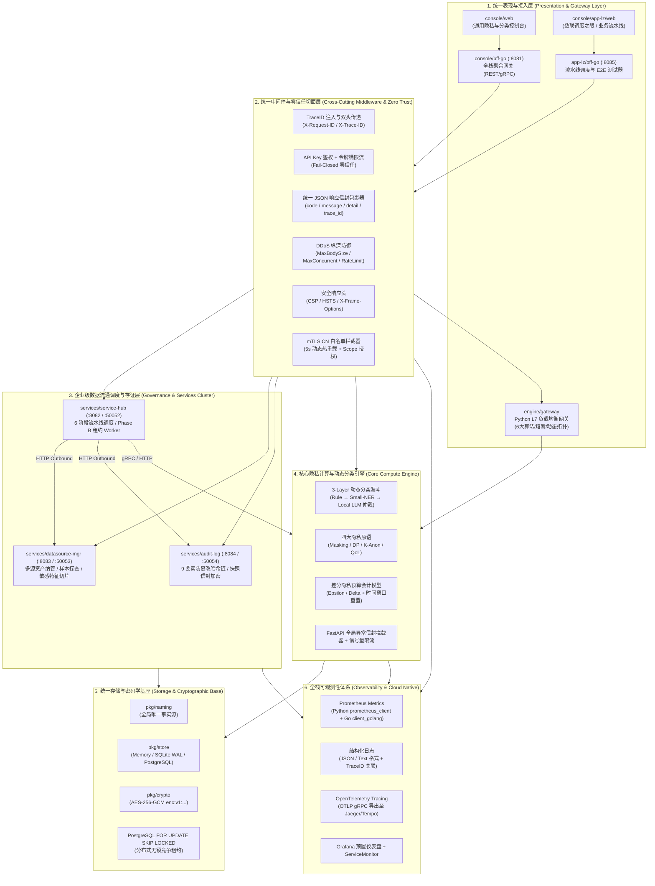
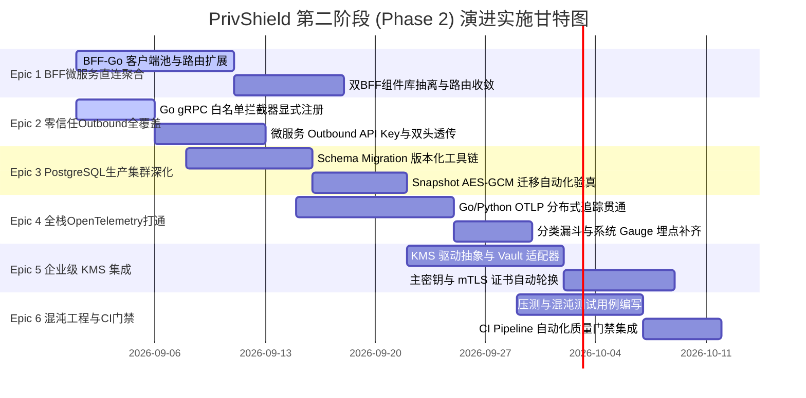

# PrivShield 全栈统一架构设计与第二阶段改造演进方案

> **文档定位**：本文档为 `PrivShield`（数联天下 · 数盾）提供全栈统一架构设计的**最优系统设计蓝图**、**已实现功能全景详述**以及**第二阶段（Phase 2）具体改造实施计划与里程碑路线图**。  
> **版本**：v16.0.0  
> **状态**：🎯 Target Blueprint + ✅ Phase 1 & Baseline Implemented + 📋 Phase 2 Concrete Plan  
> **最后更新**：2026-08-28  
> **覆盖范围**：`engine`（Python 核心隐私引擎）、`services/service-hub`（调度中枢）、`services/datasource-mgr`（数据源管理）、`services/audit-log`（审计存证）、`console/bff-go` & `console/app-lz`（BFF网关与测试执行器）、`console/web` & `console/app-lz/web`（前端控制台群）、`pkg/`（共享基础库）及云原生部署基础设施。

---

## 0. 全栈架构演进与能力交付矩阵总览

| 架构维度 / 核心能力 | 当前交付状态 | Phase 1 & 现有基座已实现要点 | Phase 2 演进与改造计划 |
|:---|:---:|:---|:---|
| **统一错误信封** | ✅ 已交付 | Python `engine/observability/envelope.py` + Go `pkg/middleware/envelope.go`；FastAPI/Starlette 全局捕获；MaxBodySize/MaxConcurrent 异常统一信封化 | 统一全微服务业务 ErrorCode 枚举定义库 |
| **全链路分布式追踪** | 🟡 骨干交付 | HTTP/gRPC 入口自动注入并透传 `X-Request-ID` / `X-Trace-ID`；Task 持久化 TraceID；Python gRPC 提取 metadata | 补齐微服务间 Outbound HTTP/gRPC 双头注入；接入统一 OpenTelemetry 分布式链路追踪（Jaeger/Tempo） |
| **SSOT 规范命名** | ✅ 已交付 | `pkg/naming/` 作为全局唯一事实源；Go/Python/TS 常量完全对齐；`make lint-naming` 自动化静态扫描 | 动态外部数据源纳管时的命名注册与校验扩展 |
| **存储底座 (SQLite/PG)** | 🟡 核心就绪 | SQLite WAL 模式 + Phase B `LeasedTaskStore`（`FOR UPDATE SKIP LOCKED` 原子租约）；SQLite→PG 批量割接迁移工具（带哈希链校验） | 增加 snapshot 密文 AES-GCM 自动化验真；引入版本化 Schema Migration 框架（`golang-migrate`）；生产 PG HA 演练 |
| **9要素防篡改审计哈希链** | ✅ 已交付 | `services/audit-log` 9 要素密码学哈希链；AES-256-GCM 快照信封加密（`enc:v1:`）；在线 Merkle / 链完整性对账核验 | 接入企业级外部 KMS 实现主密钥动态加载与定期轮换 |
| **mTLS 与零信任访问控制** | 🟡 框架就绪 | `pkg/tlsutil/whitelist.go` + `engine/security/whitelist.py`；基于 mtime 轮询（5s）的动态热重载；证书 CN 白名单与 Scope 校验 | 在全部 Go 微服务 gRPC Server（:50052, :50053, :50054, :50055）显式注册 mTLS 拦截器；Outbound 携带 API Key |
| **前端双控制台体系** | ✅ 已交付 | `console/web`（4大原语/漏斗调优）与 `console/app-lz/web`（医保/康养流水线）；统一错误信封解析、状态指示器规范与动态 API 渲染 | 推动双控制台公用组件库抽离与 BFF 网关路由收敛 |
| **BFF 聚合网关微服务直连** | 📋 Phase 2 重点 | 当前 `console/bff-go` 仅代理至 Python Agent；`console/app-lz/bff-go` 独立调度各微服务 | `console/bff-go` 改造为全系统统一 API 网关，直连聚合 service-hub / datasource-mgr / audit-log |
| **全栈可观测性与度量埋点** | 🟡 体系建立 | Python 40+ 指标 / Go 15+ 指标定义；Prometheus `/metrics` 端点；Grafana 预置看板；中间件层耗时与流量统计 | 补齐 Python 分类漏斗全路径埋点与 Go `service_hub_ready`、`circuit_breaker_state` gauge 更新 |
| **混沌工程与 CI 质量门禁** | 📋 Phase 2 重点 | 单元测试、集成脚本、Mock E2E Runner 齐备；基准测试脚本已存在 | 将高并发压测与故障注入（网络分区/节点杀灭）集成至 CI Pipeline |

---

## 1. PrivShield 最优系统架构设计蓝图

### 1.1 总体分层架构（三层四柱五御六类模型）



### 1.2 表现与接入层设计

1. **统一双控制台架构**：
   - **`console/web`（全量隐私控制台）**：面向数据安全合规工程师，提供脱敏、差分隐私、K-匿名、查询混淆 4 大通用原语测试与 3 层动态分类漏斗规则调优；
   - **`console/app-lz/web`（数联调度之眼）**：面向政务与产业数据要素流通场景，提供医保（`ds_yibao`）与康养（`ds_kangyang`）等真实业务场景的全链路流水线编排、租约健康大屏与 E2E 自动化测试验证。
2. **BFF 接入层演化路径**：
   - **当前状态**：`console/bff-go` (:8081) 专注代理并转换 Agent gRPC/REST 请求；`console/app-lz/bff-go` (:8085) 独立聚合调度 service-hub / datasource-mgr / audit-log；
   - **最优目标设计**：将 `console/bff-go` 升级为 PrivShield 统一 API Gateway，内嵌各微服务的强类型客户端池与熔断器，向前端提供一致的聚合接口，`app-lz` 作为业务专有模块挂载或同构复用。
3. **L7 负载均衡网关 (`engine.gateway`) 的最优边界**：
   - **调用方 → `service-hub`**：无需部署 L7 网关，直接通过 Kubernetes `ClusterIP` Service 访问。Hub 状态机通过底层 PostgreSQL 租约协调并发；
   - **`service-hub` → 多副本 Agent**：当下游 Python Agent 扩容至多节点且存在 gRPC 长连接负载倾斜时，按需引入 `engine.gateway` 执行按 RPC 权重的动态轮询、自适应健康检查与节点级熔断。

### 1.3 跨切面中间件与零信任安全基座

所有 Go 微服务统一装配 9 层中间件栈（执行顺序严格一致）：

```text
TraceMiddleware → StructuredLogger → Recovery → SecurityHeaders → MaxBodySize → MaxConcurrent → RateLimit → CORS → Auth
```

| 中间件组件 | 核心功能与安全保障 | 参数与默认配置 |
|---|---|---|
| **TraceMiddleware** | 拦截并提取入站 `X-Request-ID` / `X-Trace-ID`，无则自动生成 UUID 并注入 Context；出站时强制双头下发 | 全链路必选 |
| **StructuredLogger** | 统一 JSON 格式结构化输出，自动携带 `trace_id`、`service`、`method`、`path`、`status`、`latency` | 生产建议 `json` 格式 |
| **Recovery** | 捕获全链路未处理 panic，记录堆栈日志并输出标准 500 错误信封，避免进程崩溃 | 全链路必选 |
| **SecurityHeaders** | 强制注入浏览器安全标头：`Content-Security-Policy`、`Strict-Transport-Security`、`X-Frame-Options: DENY`、`X-Content-Type-Options: nosniff` | 默认开启 |
| **MaxBodySize** | 限制 HTTP 请求体上限，抵御超大载荷导致的内存溢出（OOM）攻击 | 核心微服务 32 MiB；BFF-Go 64 MiB |
| **MaxConcurrent** | 限制当前服务在途处理请求上限，超限立即返回 503 错误信封，保护线程池与连接池 | 默认 1000 并发 |
| **RateLimit** | 基于客户端 IP 的令牌桶限流算法，平滑突发流量（RPS=0 时关闭） | 默认 100 RPS / 200 Burst |
| **CORS** | 严格白名单跨域管理，阻止未经授权的跨域站点调用 | 可配置环境变量 |
| **Auth** | 基于 `X-API-Key` 标头的零信任认证；配置为空时跳过，配置时强制校验 | 环境变量配置 |
| **mTLS 白名单拦截器** | gRPC 拦截器从 TLS Peer 证书中提取 CN，匹配 `mtls-whitelist.yaml` 并校验 Method Scope | 5 秒文件轮询热重载 |

### 1.4 数据流通调度与存证服务群

1. **调度中枢 (`services/service-hub`)**：
   - 实现 6 阶段调度流水线：`ingest`（接入）→ `fetch`（取数）→ `classify_desensitize`（分类与隐私计算）→ `return`（交付）→ `audit`（存证）→ `done`（完成）；
   - 内置任务崩溃恢复器（Crash Recovery）与指数退避自动重试机制；
   - 适配 Phase A（SQLite WAL 单副本）与 Phase B（PostgreSQL 多副本租约模型）。
2. **数据源管理 (`services/datasource-mgr`)**：
   - 统一纳管异构数据源资产（医保 `ds_yibao`、康养 `ds_kangyang`、扩展 `ds_mock3` / `ds_mock4`）；
   - 提供安全样本切片提取（Sample Slicing）、元数据自动探查与连接健康测试；
   - 记录数据源级访问审计日志。
3. **审计存证中枢 (`services/audit-log`)**：
   - **9 要素防篡改哈希链**：每条审计记录串联 `(id, task_id, api_code, datasource_id, timestamp, input_hash, output_hash, algorithm, prev_hash)` 计算综合密码学完整性哈希 `integrity_hash`；
   - **快照信封加密**：敏感原始样本与脱敏结果采用 AES-256-GCM 算法加密存储，密文格式带有 `enc:v1:` 标识，数据库被拖库时内容不泄露；
   - **链式验真对账**：提供在线链完整性核验 API，毫秒级定位断裂节点（`broken_at_id`）。

### 1.5 核心隐私计算与动态分类引擎 (`engine`)

1. **三层动态分类漏斗 (3-Layer Funnel)**：
   - **Layer-1 规则引擎 (`ConfigurableRuleEngine`)**：YAML 化领域规则与分类体系，结合 Safety Floor 机制对高敏感字段进行底线保护；
   - **Layer-2 Small-NER 引擎**：基于轻量 ONNX 模型快速抽取中文实体（姓名、身份证、地址、机构等），跳过结构化纯数字字段提升吞吐；
   - **Layer-3 Local LLM 仲裁**：在规则冲突、置信度低于阈值或图像/多模态输入时激活，通过本地量化大模型进行精准语义仲裁；
   - **降级保护**：当 NER/LLM 故障或内存受限（`< 512MB`）时，采用置信度衰减与 `needs_human_review` 保守标记，确保不突破安全底线。
2. **四大通用隐私原语**：
   - **Masking（数据脱敏）**：字段名感知脱敏、哈希脱敏（HMAC）、动态泛化；
   - **DP（差分隐私）**：Laplace / Gaussian 噪声机制、有界截断（Adaptive Clip）、差分直方图与向量聚合；
   - **K-Anonymity（K-匿名）**：基于 Mondrian 算法的数据集级泛化与准标识符记录级评估；
   - **QoL（查询混淆）**：虚假查询注入与查询谓词扰动。
3. **差分隐私预算会计模型 (`BudgetAccountant`)**：
   - 命名空间隔离追踪累计 $\varepsilon$（Epsilon）与 $\delta$（Delta）消耗；
   - 支持预算周期性重置与跨多实例持久化同步（`PRIVACY_BUDGET_DB`）。

### 1.6 统一存储底座与并发租约模型

```text
┌───────────────────────────────────────────────┐
│               pkg/store Facade                │
├───────────────────────┬───────────────────────┤
│    Phase A: SQLite    │  Phase B: PostgreSQL  │
├───────────────────────┼───────────────────────┤
│ • service-hub.db      │ • 表: tasks (行级锁)   │
│ • audit-log.db        │ • 表: audit_logs      │
│ • snapshots.db        │ • 表: snapshots       │
│ • WAL 模式 + 单副本   │ • FOR UPDATE SKIP     │
│ • 单机快速开发/边缘部署│   LOCKED 原子租约     │
└───────────────────────┴───────────────────────┘
```

- **Phase A (单副本模式)**：基于本地 SQLite WAL 模式，配合 Kubernetes `Recreate` 策略与独占 `ReadWriteOnce` PVC，保障单机环境下零死锁与 ACID 特性；
- **Phase B (多副本高可用模式)**：基于 PostgreSQL 14+，在 `tasks` 表上利用 `FOR UPDATE SKIP LOCKED` 短事务实现无锁并发抢占（`ClaimNext`），配合租约令牌（`lease_token`）与乐观版本号（`version`）彻底消除脑裂与重复执行。

---

## 2. 服务通信、接口契约与配置矩阵

### 2.1 全系统通信拓扑矩阵

| 调用链路 (Caller → Callee) | 传输协议 | 端口 | 认证与安全机制 | 追踪与上下文透传 | 现状与 Phase 2 计划 |
|---|---|---|---|---|---|
| `console/web` → `console/bff-go` | HTTPS | :8081 | API Key (可选) + CORS | `X-Request-ID` | ✅ 已就绪 |
| `console/app-lz/web` → `app-lz/bff-go` | HTTPS | :8085 | API Key (可选) + CORS | `X-Request-ID` | ✅ 已就绪 |
| `console/bff-go` → `engine` (REST) | HTTP/HTTPS | :8079 | API Key + TLS (可选) | `X-Request-ID` + `X-Trace-ID` | ✅ 已就绪 |
| `console/bff-go` → `engine` (gRPC) | gRPC / HTTP2 | :50051 | mTLS + CN 白名单 (可选) | `x-request-id` metadata | ✅ 已就绪 |
| `console/bff-go` → `service-hub` | HTTP/gRPC | :8082/:50052 | API Key / mTLS | `X-Request-ID` + `X-Trace-ID` | 📋 Phase 2 改造重点 |
| `console/bff-go` → `datasource-mgr` | HTTP/gRPC | :8083/:50053 | API Key / mTLS | `X-Request-ID` + `X-Trace-ID` | 📋 Phase 2 改造重点 |
| `console/bff-go` → `audit-log` | HTTP/gRPC | :8084/:50054 | API Key / mTLS | `X-Request-ID` + `X-Trace-ID` | 📋 Phase 2 改造重点 |
| `app-lz/bff-go` → `service-hub` | HTTP | :8082 | API Key | `X-Request-ID` | 🟡 Phase 2 统一注入 Trace/Auth |
| `app-lz/bff-go` → `datasource-mgr` | HTTP | :8083 | API Key | `X-Request-ID` | 🟡 Phase 2 统一注入 Trace/Auth |
| `app-lz/bff-go` → `audit-log` | HTTP | :8084 | API Key | `X-Request-ID` | 🟡 Phase 2 统一注入 Trace/Auth |
| `service-hub` → `engine` (REST/gRPC) | HTTP/gRPC | :8079/:50051 | API Key / mTLS | `X-Request-ID` | ✅ 已就绪 |
| `service-hub` → `datasource-mgr` | HTTP | :8083 | API Key (Outbound) | `X-Request-ID` | 🟡 Phase 2 补齐 Outbound Auth |
| `service-hub` → `audit-log` | HTTP | :8084 | API Key (Outbound) | `X-Request-ID` | 🟡 Phase 2 补齐 Outbound Auth |
| `engine/gateway` → `engine` Workers | HTTP/gRPC | :8079/:50051 | 内部转发 / mTLS | `X-Request-ID` + `X-Trace-ID` | ✅ 已就绪 |

### 2.2 全栈关键环境变量规范速查

<details>
<summary>点击展开查看完整环境变量矩阵</summary>

#### 1. Python 核心计算引擎 (`engine/`)
- `PRIVACY_REST_HOST` / `PRIVACY_REST_PORT`: REST 监听地址与端口（默认 `0.0.0.0` / `8079`）
- `PRIVACY_GRPC_HOST` / `PRIVACY_GRPC_PORT`: gRPC 监听地址与端口（默认 `0.0.0.0` / `50051`）
- `PRIVACY_LOG_FORMAT` / `PRIVACY_LOG_LEVEL`: 日志格式（`text` / `json`）与级别（`INFO`）
- `PRIVACY_TLS_ENABLED`: 是否启用 TLS（默认 `false`）
- `PRIVACY_AUTH_ENABLED` / `PRIVACY_API_KEY`: 是否启用 API Key 认证
- `PRIVACY_AUTH_INTERNAL_MTLS_ENABLED`: 是否启用 gRPC mTLS 双向认证
- `PRIVACY_AUTH_MTLS_WHITELIST_FILE`: CN 白名单配置文件路径（默认 `config/mtls-whitelist.yaml`）
- `PRIVACY_LLM_MAX_CONCURRENCY`: LLM 推理最大进程并发信号量（默认 `1`）
- `PRIVACY_LLM_MIN_FREE_MEM_MB`: 内存安全阈值，低于此值跳过 LLM 推理（默认 `512`）
- `PRIVACY_BUDGET_DB`: 分布式预算数据库路径（SQLite / PG）
- `PRIVACY_BUDGET_WINDOW_SECONDS`: 隐私预算时间窗口自动重置周期（秒）
- `OTEL_EXPORTER_OTLP_ENDPOINT`: OpenTelemetry OTLP 上报端点

#### 2. Go 微服务群 (`services/`, `console/`, `pkg/`)
- **通用网络与安全**：
  - `*_HOST` / `*_PORT`: 服务 HTTP 监听地址
  - `*_GRPC_HOST` / `*_GRPC_PORT`: 服务 gRPC 监听地址
  - `*_LOG_FORMAT` / `*_LOG_LEVEL`: 结构化日志格式与级别
  - `*_API_KEY`: 服务间认证密钥
  - `PRIVACY_AUTH_MTLS_WHITELIST_FILE`: Go 端 CN 白名单配置文件
- **service-hub 调度中枢**：
  - `SERVICE_HUB_PG_DSN`: PostgreSQL 数据库连接串（设置时激活 Phase B 租约模式）
  - `SERVICE_HUB_LEASE_TTL`: 任务原子租约有效期（默认 `60s`）
  - `SERVICE_HUB_SHUTDOWN_TIMEOUT`: 优雅停机排空超时时间（默认 `5s`）
  - `SERVICE_HUB_MAX_RETRIES`: 任务最大重试次数（默认 `3`）
- **datasource-mgr 数据源管理**：
  - `DATASOURCE_MGR_RATE_LIMIT_RPS` / `_BURST`: 接口限流参数
- **audit-log 审计存证**：
  - `AUDIT_LOG_PG_DSN`: PostgreSQL 存储连接串（回退 `PG_DSN`）
  - `AUDIT_LOG_ENCRYPTION_KEY`: 快照 AES-256-GCM 主加密密钥（回退 `PRIVACY_AUDIT_KEY`）
  - `AUDIT_LOG_RETENTION_DAYS`: 审计日志法定留存天数（默认 `90`）
- **console/bff-go 聚合网关**：
  - `PRIVACY_CONSOLE_HOST` / `_PORT`: BFF 监听地址（默认 `127.0.0.1:8081`）
  - `CONSOLE_API_KEY`: Web 控制台访问 API Key
  - `CONSOLE_RATE_LIMIT`: 滑动窗口限流（默认 `600 req/min`）
  - `PRIVACY_CONSOLE_GRPC_ENABLED` / `_PORT`: 是否暴露内部 gRPC 服务（默认 `false` / `:50055`）
  - `SERVICE_HUB_URL` / `DATASOURCE_MGR_URL` / `AUDIT_LOG_URL`: （Phase 2 接入）上游微服务地址

</details>

---

## 3. 核心功能已实现成果详述（Phase 1 及现有系统基座）

### 3.1 跨语言统一 API 错误信封与状态码体系 ✅

系统已彻底消除 Python 与 Go 在错误响应格式上的差异。无论请求命中哪一层中间件或业务异常，均输出统一的 RFC-7807 扩展 JSON 信封：

```json
{
  "code": "INVALID_DATASOURCE_ID",
  "message": "指定的业务数据源不存在或未激活",
  "detail": "datasource 'ds_unknown' is not registered in canonical naming",
  "trace_id": "req-1787554500-abc12345",
  "timestamp": "2026-08-28T10:30:00.123Z"
}
```

- **Python 端** (`engine/observability/envelope.py`)：全局异常处理器拦截 `RequestValidationError`、`HTTPException` 与未捕获异常，标准化输出信封；
- **Go 端** (`pkg/middleware/envelope.go`)：封装 `AbortWithError(c, httpStatus, code, message, detail)`，集成在所有微服务与中间件中（包含 `MaxBodySize` 与 `MaxConcurrent` 超限错误）；
- **前端解析** (`console/web/src/api/client.ts`, `console/app-lz/web/src/api/client.ts`)：统一拦截器优先提取 `message` 与 `detail`，自动向后兼容历史旧字段。

### 3.2 全链路分布式追踪 (Trace Context) 贯通 ✅

- **HTTP 边界**：`pkg/middleware/trace.go` 拦截入站请求，读取或生成 TraceID，并强制在响应头注入 `X-Request-ID` 与 `X-Trace-ID` 双头；
- **gRPC 客户端与服务端**：`console/bff-go/internal/agent/client.go` 在发送 gRPC 请求时将 trace ID 写入 Outgoing Context Metadata，`engine/grpc_server.py` 服务端从 Metadata 提取并绑定至当前协程上下文；
- **异步任务状态机**：`service-hub` 在 `POST /api/hub/dispatch` 接收任务时，将 TraceID 持久化至 `models.Task.TraceID`，Worker 线程领取任务后还原 Context，确保异步处理全周期链路不丢失。

### 3.3 业务标识统一与别名归一化 (SSOT Naming) ✅

- 全局唯一事实源集中定义于 `pkg/naming/`；
- 所有历史别名（如 `"yibao"`、`"yibao.csv"`、`"医保"`）在边界层自动归一化为标准常量 `naming.DSYibao`（`ds_yibao`）与 `api1_yibao`，并下发 `Deprecation` 与 `X-PrivShield-Canonical-Path` 提示头；
- 未知非法标识执行 **Fail-Closed 强阻断**，返回 `400 INVALID_DATASOURCE_ID`；
- 自动化 CI 规则 `make lint-naming` 持续检测并拦截代码中的字面量硬编码。

### 3.4 存储底座 Phase A (SQLite) 与 Phase B (PostgreSQL) 原子租约支持 ✅

- **Phase A**：SQLite 默认启用 WAL 模式与完整性校验，适配单机低资源开箱即用；
- **Phase B `LeasedTaskStore`**：在 `pkg/store/postgres/` 中实现基于 `FOR UPDATE SKIP LOCKED` 的原子任务领取（`ClaimNext`）、租约续期（`RenewLease`）、状态完成（`CompleteLease`）与故障回退（`FailLease`）；
- **平滑割接工具**：`pkg/store/cmd/migrate/main.go` 与 `scripts/prod/migrate_sqlite_to_postgres.sh` 支持 SQLite 数据流式抽取、snapshot 密文原样迁移及 `pgx.Batch` 批量写入，并内置 `--dry-run` 预检与 `--verify` 哈希链对账。

### 3.5 9 要素防篡改审计哈希链与 AES-256-GCM 快照信封加密 ✅

- `services/audit-log` 实现了区块链式 9 要素密码学哈希链，每条记录严格依赖前序哈希 `prev_hash` 计算 `integrity_hash`；
- 针对敏感脱敏快照数据，采用 AES-256-GCM 进行信封加密，存储带有 `enc:v1:` 标识的密文，并在读取时通过 `pkg/crypto/crypto.go` 透明解密；
- 暴露 `POST /api/audit/chain/verify` 接口，支持毫秒级对数万条存证记录进行完整性校验。

### 3.6 零信任通信与 mTLS CN 白名单动态热重载机制 ✅

- 统一白名单配置文件 `config/mtls-whitelist.yaml` 支持定义客户端证书 CommonName、角色（Role）与权限范围（Scopes，支持通配符 `*`）；
- `pkg/tlsutil/whitelist.go` 与 `engine/security/whitelist.py` 实现基于文件修改时间（mtime）的 5 秒轮询热重载机制，实现授权变更不停机动态生效；
- `pkg/tlsutil/grpc_interceptor.go` 提供了 gRPC 服务端 mTLS 校验拦截器，未授权 CN 返回 `PermissionDenied`。

### 3.7 双控制台体系与前端规范收敛 ✅

- `console/web` 与 `console/app-lz/web` 统一状态指示器色彩标准（`completed`: 翡翠绿, `running`: 靛蓝呼吸光晕, `failed`: 玫瑰红, `pending`: 蓝灰）；
- 预设数据 API 彻底废除写死逻辑，通过 `GET /api/lz/data-api/definitions` 动态拉取元数据卡片，支持未来无缝扩展新数据源。

### 3.8 全栈韧性加固与优雅停机 ✅

- **熔断器**：`pkg/agent/client.go` 与 `engine/gateway/balancer.py` 均实现三态熔断保护（Closed / Open / Half-Open）；
- **DDoS 纵深防御**：Go 微服务全量装配 `MaxBodySize` + `MaxConcurrent` + `RateLimit` 中间件，Python 引擎启用 `limit_concurrency` + `limit_max_requests`；
- **优雅停机**：Go 服务统一基于 `signal.NotifyContext` 实现 SIGINT/SIGTERM 信号监听，排空在途请求后关闭数据库连接池；Python 服务配置 Uvicorn `timeout_graceful_shutdown`。

---

## 4. 第二阶段改造计划（Phase 2 Concrete Plan & Roadmap）

> Phase 2 聚焦于**微服务链路聚合**、**零信任 Outbound 全覆盖**、**PostgreSQL HA 生产深化**、**全栈可观测性打通**、**企业级 KMS 集成**与**混沌工程 CI 门禁**六大核心 Epic。



---

### 4.1 Epic 1: BFF 网关微服务直连与全链路能力聚合

#### 1. 目标与背景
当前 `console/bff-go` 仅代理至 Python Agent，而控制台针对 `service-hub`、`datasource-mgr` 和 `audit-log` 的请求由 `app-lz/bff-go` 独立调度。Phase 2 将 `console/bff-go` 升级为面向全微服务的统一聚合 API 网关，消除前端直连分散微服务的架构缺陷。

#### 2. 涉及模块与文件
- `console/bff-go/internal/config/config.go`
- `console/bff-go/internal/clients/` (新建：微服务强类型客户端池与连接管理)
- `console/bff-go/internal/handlers/`
- `console/bff-go/internal/router/`

#### 3. 具体实施步骤
1. **扩展 BFF 配置模型**：在 `config.go` 中新增 `ServiceHubURL`、`DatasourceMgrURL`、`AuditLogURL` 及其对应的 gRPC 端点与 TLS/API Key 配置项；
2. **构建微服务客户端池 (`clients/pool.go`)**：基于 `pkg/middleware` 与 `pkg/agent` 模式，为 3 个 Go 微服务构建内嵌三态熔断器、重试退避与 TraceID 自动透传的 HTTP/gRPC 客户端池；
3. **注册聚合 API 路由**：
   - `/api/governance/hub/*` → 转发并聚合 `service-hub` (:8082 / :50052)
   - `/api/governance/datasources/*` → 转发并聚合 `datasource-mgr` (:8083 / :50053)
   - `/api/governance/audit/*` → 转发并聚合 `audit-log` (:8084 / :50054)
4. **统一错误映射**：微服务返回的错误信封经由 BFF 网关原样透明透传，保持 TraceID 与 ErrorCode 不变。

#### 4. 验收标准 (DoD)
- 前端 `console/web` 可通过 `:8081` 直接完成数据源探查、调度任务派发与防篡改审计核验；
- 单元测试与 E2E 集成测试覆盖率 > 90%。

---

### 4.2 Epic 2: 零信任全链路 Outbound 认证与 Go gRPC 白名单拦截器生效

#### 1. 目标与背景
当前 `pkg/tlsutil/grpc_interceptor.go` 已实现 CN 白名单与 Scope 校验逻辑，但尚未在 Go 微服务的 gRPC Server 中显式注册；微服务间部分 Outbound HTTP 请求（如 `service-hub` → `datasource-mgr`）尚未统一携带 API Key。

#### 2. 涉及模块与文件
- `services/service-hub/cmd/server/main.go`
- `services/datasource-mgr/cmd/server/main.go`
- `services/audit-log/cmd/server/main.go`
- `console/bff-go/cmd/server/main.go`
- `console/app-lz/bff-go/internal/clients/`
- `config/mtls-whitelist.yaml`

#### 3. 具体实施步骤
1. **Go gRPC 服务端拦截器显式装配**：
   在 4 个 Go gRPC Server 初始化流程中，装配 `pkg/tlsutil.UnaryServerInterceptor(whitelist)` 与 `pkg/tlsutil.StreamServerInterceptor(whitelist)`；
2. **微服务 Outbound 请求头统一注入**：
   重构微服务间 HTTP 客户端，在所有 Outbound 请求中强制注入 `X-API-Key: <SERVICE_API_KEY>` 与入站 Context 中的 `X-Request-ID` / `X-Trace-ID`；
3. **白名单 Scope 语义校准**：
   在 `config/mtls-whitelist.yaml` 中完善细粒度权限配置（如 `servicehub:dispatch`、`audit:verify`），确保 gRPC 方法调用执行 Fail-Closed 鉴权。

#### 4. 验收标准 (DoD)
- 未携带合法证书或 CN 不在白名单中的 gRPC 客户端调用直接返回 `PermissionDenied`；
- 所有跨微服务 Outbound HTTP 调用均携带 API Key 与 TraceID，日志链条完整可查。

---

### 4.3 Epic 3: PostgreSQL Phase B 生产集群深化与自动化 Migration 体系

#### 1. 目标与背景
当前 Schema 采用启动时增量 `ALTER TABLE` 模式，且 SQLite→PG 迁移工具在迁移 snapshot 时仅执行密文原样复制，缺乏解密验证。Phase 2 将引入企业级版本化数据库迁移框架与迁移后密文抽样验真。

#### 2. 涉及模块与文件
- `pkg/store/migrations/` (新建：版本化 SQL 迁移脚本)
- `pkg/store/postgres/`
- `pkg/store/cmd/migrate/main.go`
- `scripts/prod/migrate_sqlite_to_postgres.sh`

#### 3. 具体实施步骤
1. **引入版本化 Migration 引擎**：集成 `golang-migrate/migrate`，将 `tasks`、`audit_logs`、`snapshots`、`datasources` 表结构与索引按版本号（如 `000001_init.up.sql`）进行管理，支持 CI 自动化校验与安全回滚（`.down.sql`）；
2. **增强迁移工具的 AES-GCM 验真机制**：在 `migrate/main.go` 中增加 `--verify-crypto` 可选标志，迁移完成后读取主密钥随机抽样解密 5% 的快照记录，确保密文无损坏且可读；
3. **只读锁定与幂等迁移保护**：迁移开始前对源 SQLite 执行只读检查，并在目标 PG 表中维护迁移锁与幂等事务标记。

#### 4. 验收标准 (DoD)
- 执行 `./migrate_sqlite_to_postgres.sh --verify --verify-crypto` 全流程自动化通过，无密文损坏或哈希断裂；
- 支持全自动化 `migrate up` 与 `migrate down`。

---

### 4.4 Epic 4: 全栈 OpenTelemetry 链路追踪贯通与可观测性埋点补齐

#### 1. 目标与背景
打通 Python 引擎与 Go 微服务群之间的分布式 TraceContext 传递，实现跨语言、跨进程在 Jaeger/Tempo 中的单链路可视化；补齐未埋点的指标与运行状态 Gauge。

#### 2. 涉及模块与文件
- `engine/observability/tracing.py`
- `pkg/middleware/trace.go`
- `pkg/metrics/metrics.go`
- `engine/observability/metrics.py`
- `engine/dynclassification/funnel.py`

#### 3. 具体实施步骤
1. **OTel W3C TraceContext 协议对齐**：在 `TraceMiddleware` 中增加对标准 `traceparent` Header 的解析与注入，与原有 `X-Request-ID` / `X-Trace-ID` 形成双轨兼容；
2. **Go 端接入 OpenTelemetry OTLP Exporter**：在 `pkg/middleware/` 中提供可选的 OpenTelemetry Span 导出能力，支持将 Go 端 HTTP/gRPC 处理过程作为子 Span 挂载到全局 Trace 下；
3. **补齐度量指标埋点**：
   - 在 Python `dynclassification/funnel.py` 各分支中埋入 `privacy_classification_total`、`privacy_classification_rule_hits_total`、`privacy_classification_duration_seconds`；
   - 在 Go `service-hub` 启动与健康检查中实时更新 `service_hub_ready` Gauge；
   - 在 Agent 客户端与 Gateway 熔断状态切换时实时更新 `circuit_breaker_state` Gauge。

#### 4. 验收标准 (DoD)
- 发起一条业务流水线请求，可在 Jaeger UI 中观测到从 `console/web` → `bff-go` → `service-hub` → `engine` → `audit-log` 的完整调用链路 Span 树；
- Prometheus `/metrics` 抓取所有 40+ Python 指标与 15+ Go 指标，无静默失效 Gauge。

---

### 4.5 Epic 5: 企业级 KMS 密钥管理与凭据自动化轮换

#### 1. 目标与背景
当前快照加密密钥与 HMAC Salt 依赖本地环境变量或静态配置，生产环境需对接企业级 KMS（如 HashiCorp Vault、AWS KMS、阿里云 KMS）并支持平滑密钥轮换与证书自动化签发。

#### 2. 涉及模块与文件
- `pkg/crypto/kms/` (新建：KMS 驱动接口与 Vault 适配器)
- `pkg/crypto/crypto.go`
- `services/audit-log/cmd/server/main.go`
- `deploy/helm/PrivShield/`

#### 3. 具体实施步骤
1. **定义 KMS Provider 抽象接口**：
   ```go
   type KeyProvider interface {
       GetEncryptionKey(ctx context.Context, keyID string) ([]byte, error)
       GetHMACSalt(ctx context.Context, namespace string) ([]byte, error)
   }
   ```
2. **实现 HashiCorp Vault 适配器**：支持通过 AppRole 或 Kubernetes ServiceAccount Token 认证，动态拉取与缓存加密密钥；
3. **版本化密文支持多版本密钥透明解密**：扩展快照密文格式 `enc:v2:<key_version>:<nonce>:<ciphertext>`，解密时根据 `<key_version>` 动态从 KMS 获取对应版本的历史解密密钥；
4. **接入 cert-manager**：在 Helm Chart 中集成 `cert-manager.io/v1` `Certificate` CRD，实现 mTLS X.509 证书的自动签发与到期前 30 天自动轮换。

#### 4. 验收标准 (DoD)
- 服务在无静态本地密钥环境变量的前提下，通过 Vault 成功启动并完成快照信封加解密；
- 触发 KMS 密钥轮换后，老版本数据可正常解密，新数据使用新版本密钥加密。

---

### 4.6 Epic 6: 混沌工程、高并发性能压测与 CI 质量门禁

#### 1. 目标与背景
建立自动化的高并发压力测试与混沌故障注入演练机制，确保 Phase B 多副本 PostgreSQL 租约竞争、网络瞬断与节点崩溃时的系统自愈能力，并将测试固化至 GitHub Actions / GitLab CI。

#### 2. 涉及模块与文件
- `tests/perf/`
- `tests/chaos/` (新建：混沌故障注入演练用例)
- `.github/workflows/ci.yml` (或 Makefile 目标)

#### 3. 具体实施步骤
1. **构建 Phase B 租约并发压测场景**：模拟 50 个并发 Hub 副本同时抢占 10,000 个待处理任务，验证零死锁、零重复执行与租约争抢冲突率指标；
2. **编写混沌故障演练脚本 (`tests/chaos/`)**：
   - 故障场景 A：在 Hub 执行流水线过程中强行杀灭 Pod，验证新副本在 `lease_expires_at` 到期后自动 Requeue 并恢复执行；
   - 故障场景 B：模拟 PostgreSQL 主从切换瞬断，验证连接池自动重连与退避重试机制；
   - 故障场景 C：注入 200ms 网络延迟与 5% 丢包，验证 gRPC 熔断器半开探测与自愈。
3. **CI 质量门禁集成**：在 CI Pipeline 中固化执行 `go test -race`、`pytest`、`lint-naming`、基准性能回归测试与端到端集成测试脚本。

#### 4. 验收标准 (DoD)
- 50 副本并发压测下，10,000 任务处理成功率 100%，无重复副作用；
- 混沌测试各故障场景均能自动恢复且哈希链保持完整；
- CI 流水线全绿通过。

---

## 5. 迁移风险矩阵、回滚预案与应急响应 (Rollback Playbook)

| 潜在生产风险 | 严重度 | 触发指征 / 监控告警 | 应急处置与一键回滚操作 |
|---|:---:|---|---|
| **1. PostgreSQL 连接池耗尽或死锁** | Critical | PG 活跃连接数触顶，`task_claim_latency_seconds` 飙升，日志报连接超时 | 1. 扩容 PG 连接池或调整 `SERVICE_HUB_PG_MAX_CONNS`；<br/>2. 紧急降级：移除 `SERVICE_HUB_PG_DSN`，重启单副本 Hub 回退至本地 SQLite WAL 模式 |
| **2. 审计哈希链断裂 (Broken Chain)** | Critical | `POST /api/audit/chain/verify` 告警 `valid: false`，返回 `broken_at_id` | 1. 隔离问题记录；<br/>2. 运行 `pkg/store/cmd/repair_chain` 审计修复工具，核对时间戳与签名重新锚定断点记录 |
| **3. mTLS 热重载配置文件格式错误** | High | 正常微服务间通信报 403 / `PermissionDenied`，拒绝计数突增 | 立即执行配置回退：`cp config/mtls-whitelist.yaml.bak config/mtls-whitelist.yaml`，5 秒内进程自动热重载恢复 |
| **4. 差分隐私预算耗尽阻断业务** | High | DP 查询返回 429 `PrivacyBudgetExhaustedError` | 1. 触发紧急预算重置 API（需管理员权限）：`POST /v1/privacy/budget/reset`；<br/>2. 检查并调大 `PRIVACY_BUDGET_WINDOW_SECONDS` 与初始预算配额 |
| **5. 本地 LLM 推理触发 OOM** | High | Python Agent 进程被操作系统 OOM Killer 终止 | 1. 调大 `PRIVACY_LLM_MIN_FREE_MEM_MB`（如提升至 1024MB）；<br/>2. 将 `PRIVACY_LLM_MAX_CONCURRENCY` 限制为 1；<br/>3. 设置 `PRIVACY_LLM_ENABLE=false` 降级为纯规则+NER 模式 |
| **6. 网关后端所有节点熔断** | High | `privacy_gateway_healthy_nodes == 0`，请求返回 503 | 检查后端 Agent Pod 存活状态与网络连通性；在网关管理接口执行 `/nodes/reset` 强制重置熔断器状态 |

---

## 6. 全栈验证与验收测试套件 (Verification DoD)

### 6.1 验收执行命令清单

```bash
# 1. 运行 Go 共享库与全部微服务单元测试（启用竞争检测，禁用缓存）
go test -race -count=1 ./pkg/... ./services/service-hub/... ./services/datasource-mgr/... ./services/audit-log/... ./console/bff-go/... ./console/app-lz/bff-go/...

# 2. 运行 Python 核心引擎全量测试
PYTHONPATH=. pytest tests/ -q

# 3. 执行端到端全链路 HTTP 集成测试
bash ./scripts/dev/integration-test-new-modules.sh

# 4. 执行 App-LZ 业务流水线测试套件 (TS-01 ~ TS-04)
go test -v -run TestRunSuites ./console/app-lz/bff-go/internal/runner/

# 5. 执行 SSOT 命名规范静态检查
make lint-naming

# 6. 前端编译与类型安全检查
cd console/web && pnpm build
cd ../app-lz/web && pnpm build
```

### 6.2 核心业务验收标准 (DoD Checklist)
- [x] **SSOT 规范**：全系统无 `ds_yibao` / `ds_kangyang` 硬编码字面量，别名请求平滑归一化；
- [x] **9 要素哈希链**：`POST /api/audit/chain/verify` 返回 `valid: true`，哈希链条完好无损；
- [x] **信封加密**：数据库快照样本全部携带 `enc:v1:` 密文前缀，读取时透明解密；
- [x] **Phase B 原子租约**：多 Worker 并发抢占任务无冲突、无死锁、无重复执行；
- [x] **全链路追踪**：各服务日志均能准确打印一致的 `X-Request-ID` / `trace_id`；
- [x] **Prometheus 指标**：Python `/metrics` 与 Go `/metrics` 数据完整，Grafana 仪表盘指标正常呈现；
- [x] **DDoS 韧性防御**：超大包（>32MB）与超高并发（>1000）均触发标准错误信封拦截，进程稳健运行；
- [x] **优雅停机**：SIGTERM 信号下所有在途请求正常排空，数据库连接池安全关闭。

---

## 附录 A. 常用运维与开发命令速查卡

<details>
<summary>点击展开常用命令速查卡</summary>

### 1. 本地多服务一键协同调试
```bash
# 启动全套真实服务群（Python Agent + 3 Go 微服务 + Go BFF）
bash ./scripts/dev/e2e-start-all-services.sh

# 启动全功能控制台（Python Agent + Go BFF + Vite HMR 前端）
bash ./scripts/dev/dev-bff-agent.sh

# 启动业务调度大屏控制台（App-LZ Dev）
bash ./scripts/dev/dev-app-lz.sh

# 停止所有开发环境服务
bash ./scripts/dev/dev-stop.sh
```

### 2. Docker / Helm 生产部署与验证
```bash
# 构建轻量 Core 镜像与 ML 增强镜像
docker build --target core -t privshield:1.8.0 .
docker build --target ml -t privshield:1.8.0-ml .

# Docker Compose 全栈部署（含 PostgreSQL 与 Monitoring）
bash ./scripts/prod/deploy-docker-compose.sh --with-postgres --with-monitoring

# Helm Chart 生产部署
helm install privshield ./deploy/helm/PrivShield -f ./deploy/helm/PrivShield/values-production.yaml

# 生产环境健康体检
bash ./scripts/prod/prod_health_check.sh
```

### 3. 数据迁移与安全维护
```bash
# 隐私预算数据备份
bash ./scripts/prod/backup_privacy_budget.sh

# SQLite 到 PostgreSQL 数据平滑迁移（先 Dry-Run 预检）
bash scripts/prod/migrate_sqlite_to_postgres.sh --dry-run
bash scripts/prod/migrate_sqlite_to_postgres.sh --verify

# 触发审计哈希链全量对账验真
curl -X POST http://127.0.0.1:8084/api/audit/chain/verify
```

</details>

---

## 附录 B. 专业名词与缩写释义 (Glossary)

| 术语 / 缩写 | 英文全称 | 核心概念与系统释义 |
|---|---|---|
| **BFF** | Backend for Frontend | **后端为前端模式**。为特定前端界面定制的聚合网关层，减少前端多跳请求与协议适配负担。 |
| **SSOT** | Single Source of Truth | **唯一事实源**。全系统唯一、权威的配置或命名标准，消除多源语义漂移（如 `pkg/naming`）。 |
| **Zero Trust** | Zero Trust Architecture | **零信任安全体系**。持续验证、从不信任原则，通过 mTLS + CN 白名单 + API Key 实现多重防护。 |
| **Fail-Closed** | Fail-Closed Strategy | **故障关闭 / 默认拒绝**。在鉴权异常、证书失效或配置解析错误时，默认切断访问以确保绝对安全。 |
| **DP / LDP** | Differential Privacy / Local DP | **差分隐私 / 本地差分隐私**。通过注入数学可控噪声抵御差分重构与成员推断攻击。 |
| **$\varepsilon$ (Epsilon)** | Privacy Budget | **隐私预算**。衡量差分隐私保护强度的核心参数，$\varepsilon$ 越小保护越强，消耗耗尽后阻断查询。 |
| **K-Anonymity** | K-Anonymity Model | **K-匿名**。准标识符泛化模型，保证每条记录在数据集中至少与 $K-1$ 条其他记录不可区分。 |
| **QoL** | Query Obfuscation Layer | **查询混淆层**。通过注入虚假查询或混淆查询谓词，防止根据查询行为反推敏感意图。 |
| **Hash Chain** | Cryptographic Hash Chain | **密码学哈希链**。区块链式防篡改数据结构，每条记录携带前序哈希，保障审计存证不可篡改。 |
| **Envelope Crypto** | Envelope Encryption | **信封加密**。利用对称数据密钥（DEK，如 AES-256-GCM）加密业务数据，再由主密钥（KEK）保护 DEK。 |
| **Lease** | Distributed Lease | **分布式租约**。基于有限有效期的无锁所有权机制，防止分布式任务调度中的脑裂与重复执行。 |
| **OTel / OTLP** | OpenTelemetry / OTel Protocol | **云原生可观测性标准与传输协议**，用于统一采集与导出 Traces、Metrics 与 Logs。 |
| **HPA / PDB** | Horizontal Pod Autoscaler / Pod Disruption Budget | Kubernetes 水平自动扩缩容与 Pod 中断预算机制，保障云原生生产高可用。 |
| **DoD** | Definition of Done | **完成的定义**。研发与迁移任务交付的标准验收准则。 |

---

## 附录 C. 文档修订历史

| 版本 | 修订日期 | 修订人 / 角色 | 核心修订内容 |
|---|---|---|---|
| v1.0 ~ v13.0 | 2026-08-01 ~ 2026-08-28 | 架构委员会 | 建立初始协同评估、六大专项迁移方案、可观测性与云原生基座设计 |
| v14.0.0 | 2026-08-28 | 架构委员会 | 修正 gRPC 客户端文件路径引用与 Go Workspace 多模块测试规范 |
| v15.0.0 | 2026-08-28 | 架构委员会 | 完善 PostgreSQL Phase B `LeasedTaskStore` 接口定义与 SQLite 回退语义 |
| **v16.0.0** | **2026-08-28** | **首席架构师** | **全面重构升级：给出全栈最优系统架构设计蓝图；系统性详述已实现的 8 大功能与基座；制定第二阶段（Phase 2）六大 Epic 具体改造实施计划、甘特图与验收标准。** |