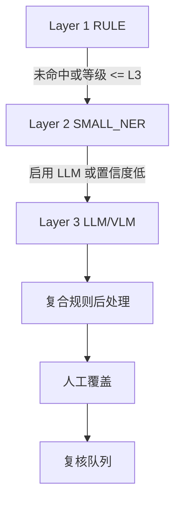
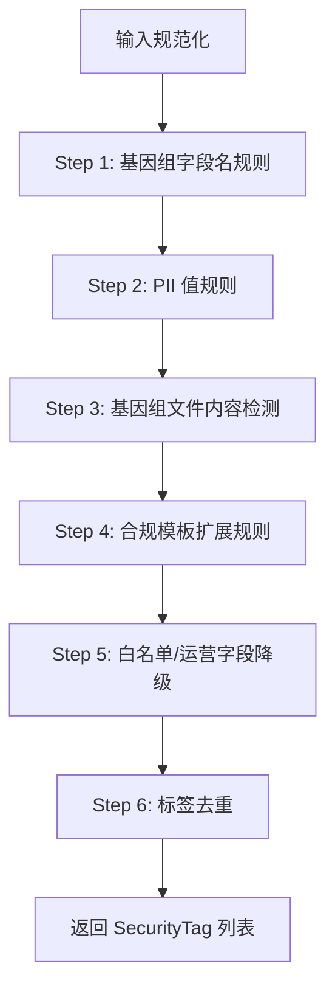
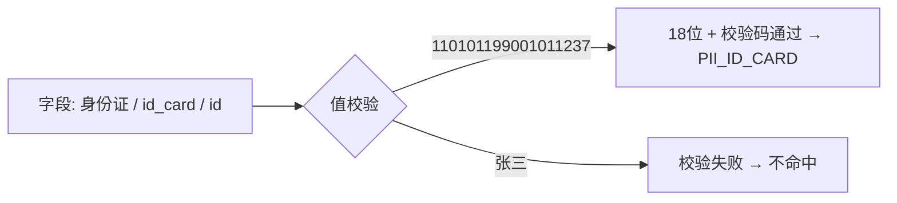
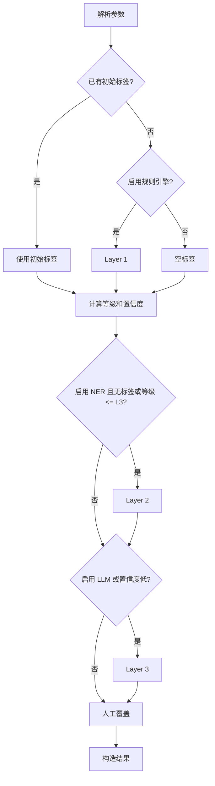
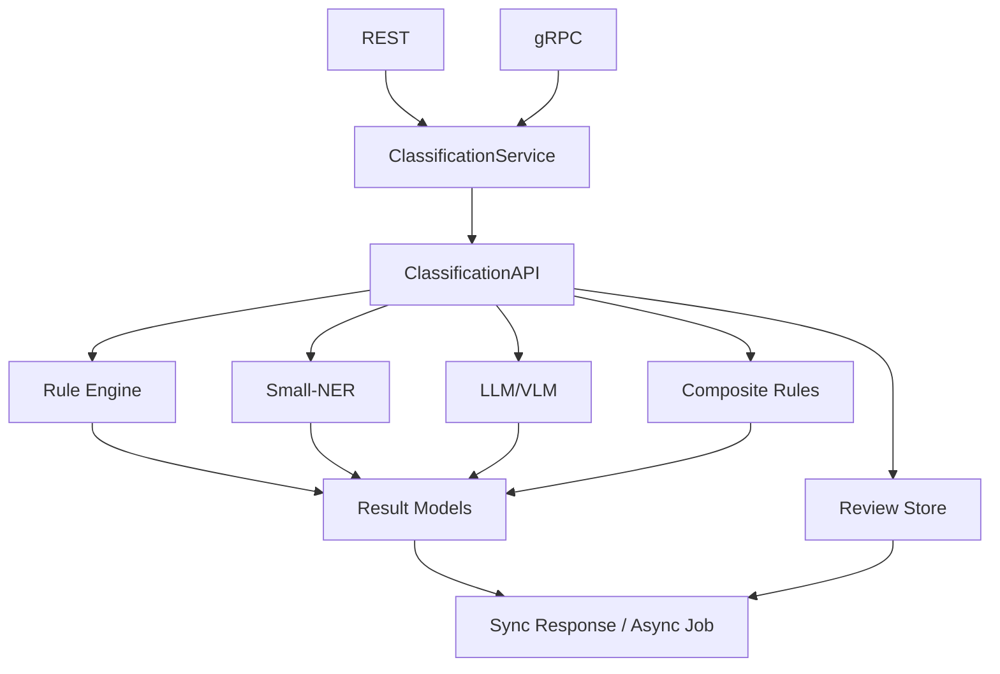
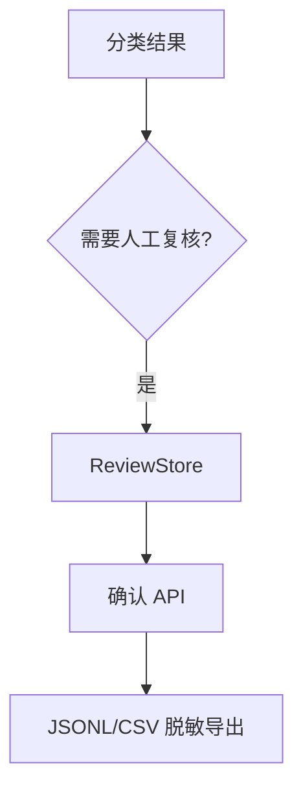

# 数据分类分级设计文档

本文档描述 `privacy-local-agent` 数据分类分级模块的目标、分类算法、系统架构、数据模型、接口适配和运维设计。工业化评分、发布门禁和评审模板统一维护在 [industrialization_review.md](industrialization_review.md) 中，避免设计文档与评审文档重复。

## 目录

1. [概述与设计目标](#1-概述与设计目标)
2. [分类算法](#2-分类算法)
3. [执行流程](#3-执行流程)
4. [架构设计](#4-架构设计)
5. [数据模型](#5-数据模型)
6. [输入适配与合规模板](#6-输入适配与合规模板)
7. [版本化、参数与影子模式](#7-版本化参数与影子模式)
8. [降级与资源管理](#8-降级与资源管理)
9. [可观测性](#9-可观测性)
10. [扩展点](#10-扩展点)
11. [测试策略](#11-测试策略)
12. [相关文档](#12-相关文档)
13. [术语表](#13-术语表)

## 1. 概述与设计目标

模块通过“规则引擎 → Small-NER → 本地 LLM/VLM”的三层漏斗识别敏感数据，输出统一的 L1~L5 敏感度等级、分类标签、置信度、来源引擎和审计信息。

设计目标：

- 建立稳定的 L1~L5 敏感度等级和标签体系。
- 支持字段级、记录级和表级分类。
- 支持 JSON、DataFrame、Arrow、SQL 结果和 SecretFlow 数据结构。
- 支持字段组合、上下文敏感和合规模板规则。
- 支持同步与异步分类，避免 LLM 推理阻塞主链路。
- 支持人工复核、确认和脱敏导出。
- 保证日志、指标、复核存储和导出制品不泄露原始数据。
- 支持规则集版本化、影子模式和可回滚配置。
- 通过 REST/gRPC 提供一致的服务契约，并暴露 Prometheus 指标。

## 2. 分类算法

### 2.1 三层漏斗



| 层级 | 引擎 | 主要职责 | 依赖 |
|---|---|---|---|
| L1 | `DefaultRuleEngine` / `VectorizedRuleEngine` | 字段名、值格式、校验和和文件特征匹配 | 核心依赖；向量化需要 pandas |
| L2 | `ONNXSmallNerEngine` / `ModelScopeSmallNerEngine` | 识别疾病、药物、手术、解剖部位和基因实体 | 可选 ONNX / ModelScope |
| L3 | `Qwen2VLClassifier` | 处理图片、手写病历和非结构化文本 | 可选 PyTorch / Transformers |

### 2.2 Layer 1 规则引擎

规则引擎按以下顺序收集标签：

1. **字段名规则**：字段名转小写并移除下划线、空格后匹配基因组和模板关键词。
2. **PII 值规则**：识别身份证、手机号、医保卡和 ICD-10 编码。
3. **基因组内容规则**：识别 BAM、VCF、FASTQ 文件头及连续碱基序列。
4. **公开和运营字段规则**：将白名单字段标记为 L1，将运营统计字段标记为 L2。

典型规则：

| 类别 | 示例匹配 | 等级 |
|---|---|---|
| 基因组字段 | `brca1`、`tp53`、`snp`、`genome`、`mutation` | L5 |
| 基因组文件 | `BAM\x01`、`##fileformat=VCF`、FASTQ 四行结构 | L5 |
| 基因序列 | `[ATCGNatcgn]{50,}` | L5 |
| 身份证 | 18 位格式 + 加权模 11 校验 | L3 |
| 手机号 | `^1[3-9]\d{9}$` | L3 |
| 医保卡 | 9 位数字 + 校验和 | L3 |
| ICD-10 | 格式解析 + 敏感区间映射 | L3/L4 |
| 公开字段 | `public_report`、`annual_summary`、`科普` | L1 |
| 运营统计 | `turnover_rate`、`device_usage`、`inventory` | L2 |

所有规则命中标签默认 `confidence=1.0`、`source_engine=RULE`、`engine_layer=L1_RULE`。标签按 `(level, category)` 去重并保留首次出现顺序。`VectorizedRuleEngine` 使用 pandas Series 批量匹配，语义必须与标量引擎一致；缺少 pandas 时回退到 `DefaultRuleEngine`。

#### 2.2.1 evaluate 详细算法

`DefaultRuleEngine.evaluate(field_name, value, params)` 是 Layer-1 的核心入口，算法流程如下：



**输入规范化**

| 操作 | 算法 | 示例 |
|---|---|---|
| 字段名归一化 | `lower()` + 移除 `_` 和空格 | `"Phone_Number"` → `"phonenumber"` |
| 字段值字符串化 | `str(value)`，None → `""` | `None` → `""` |
| 字段值归一化 | 同字段名归一化（用于值内关键词检测） | `"RS12345"` → `"rs12345"` |

**字段名规范化策略**

规则引擎采用「格式归一化 + 双轨识别」策略处理不同命名风格的字段：

*归一化算法：*

```python
def _normalize_field_name(name: str) -> str:
    return str(name).lower().replace("_", "").replace(" ", "")
```

归一化消除的是**格式差异**（大小写、分隔符），而非**语义差异**：

| 原始字段名 | 归一化结果 | 说明 |
|---|---|---|
| `id_card` | `idcard` | 下划线移除 |
| `ID_Card` | `idcard` | 大小写折叠 |
| `idCard` | `idcard` | camelCase 折叠 |
| `ID Card` | `idcard` | 空格移除 |
| `phone_number` | `phonenumber` | 同上 |
| `Phone Number` | `phonenumber` | 同上 |
| `身份证` | `身份证` | 中文保持不变 |
| `id` | `id` | 缩写保持不变 |

*双轨识别机制：*

对于 PII 类数据（身份证、手机号、医保卡），规则引擎**不依赖字段名**，而是通过**字段值的格式校验**识别：



| 数据类型 | 识别方式 | 字段名是否影响 | 示例 |
|---|---|---|---|
| 身份证号 | 值校验（18位格式 + GB 11643 校验码） | 否 | 无论字段名为 `id`、`身份证`、`id_card`，只要值合法即命中 |
| 手机号 | 值正则（`^1[3-9]\d{9}$`） | 否 | 无论字段名为 `tel`、`电话`、`mobile`，只要值合法即命中 |
| 医保卡号 | 值校验（9位 + 校验和） | 否 | 同上 |
| ICD-10 | 值格式解析 | 否 | 同上 |
| 基因组字段 | 字段名关键词子串匹配 | **是** | `brca1_status`、`gene_marker` 通过字段名命中 |
| 金融/模板字段 | 字段名关键词子串匹配 | **是** | `bank_card`、`email` 通过字段名命中 |
| 白名单/运营字段 | 字段名关键词子串匹配 | **是** | 可配置 |

设计理由：PII 数据具有强格式特征（固定长度、校验码），值校验的精确度远高于字段名猜测；而基因组、金融等领域字段无统一值格式，需依赖字段名语义。

*复合规则中的同义词处理：*

复合规则引擎（`CompositeRuleEngine`）使用**正则表达式**匹配归一化后的字段名，可在模式内枚举同义词：

```python
# COMP_001 的 field_patterns 示例
field_patterns=[
    r"^name$",                      # 精确匹配 name
    r"id_card|idcard|identity",     # 枚举身份证的同义表达
    r"mobile|phone|cell",           # 枚举手机号的同义表达
]
```

匹配流程：先将字段名归一化（`id_card` → `idcard`），再用正则 `search` 匹配。因此 `id_card`、`idcard`、`identity_number` 均可被 `r"id_card|idcard|identity"` 命中。

*当前限制与扩展方式：*

| 限制 | 说明 | 应对方式 |
|---|---|---|
| 中文别名 | `身份证` 不会自动映射到 `idcard` | PII 通过值校验兜底；字段名规则需显式添加中文关键词 |
| 缩写 | `id` 不会扩展为 `idcard` | 值校验兜底；或在 `public_field_whitelist`/`operational_field_patterns` 中配置 |
| 新同义词 | 新业务字段名不在内置关键词中 | 通过 YAML profile 或请求参数动态配置白名单/模式列表 |

**Step 1：基因组字段名规则**

按优先级顺序匹配归一化字段名 `norm_name`：

| 规则 ID | 匹配条件 | 类别 | 等级 |
|---|---|---|---|
| `RULE_ID_G_001` | `norm_name` 包含 `brca1`/`brca2`/`tp53` | `GENOMIC_BRCA_TP53` | L5 |
| `RULE_ID_G_002` | `norm_name` 或 `norm_value` 匹配 `rs\d+`，或 `norm_name` 包含 `snp`/`cnv`/`genome`/`genomic` | `GENOMIC_VARIANT` | L5 |
| `RULE_ID_G_003` | `norm_name` 包含 `gene`/`mutation`/`variant` | `GENOMIC_HINT` | L5 |
| `RULE_ID_G_004` | `norm_name` 包含 `bam`/`vcf`/`fastq` | `GENOMIC_FILE` | L5 |

**Step 2：PII 值规则**

对字段值字符串 `str_value` 执行格式校验：

| 规则 ID | 算法 | 类别 | 等级 |
|---|---|---|---|
| `RULE_ID_001` | 身份证号校验（见下文） | `PII_ID_CARD` | L3 |
| `RULE_ID_002` | 正则 `^1[3-9]\d{9}$` | `PII_MOBILE` | L3 |
| `RULE_ID_003` | 上海医保卡校验（见下文） | `PII_MEDICAL_CARD` | L3 |
| `RULE_ID_004` | ICD-10 解析 + 区间判定（见下文） | `MEDICAL_ICD10_*` | L3/L4 |

*身份证号校验算法（GB 11643-1999）：*

1. 长度必须为 18 字符。
2. 正则验证格式：`^[1-9]\d{5}(18|19|20)\d{2}(0[1-9]|1[0-2])(0[1-9]|[12]\d|3[01])\d{3}[\dXx]$`。
3. 计算加权和：`sum = Σ digit[i] × weight[i]`，权重因子为 `[7,9,10,5,8,4,2,1,6,3,7,9,10,5,8,4,2]`。
4. 校验码 = `"10X98765432"[sum % 11]`。
5. 比较第 18 位与校验码（大小写不敏感）。

*上海医保卡校验算法：*

1. 必须为 9 位纯数字。
2. 计算前 8 位加权和：`sum = Σ digit[i] × weight[i]`，权重因子为 `[7,9,10,5,8,4,2,1]`。
3. 校验码 = `(10 - sum % 10) % 10`。
4. 比较第 9 位与校验码。

*ICD-10 编码解析与区间判定：*

1. 正则解析：`^([A-Z])(\d{2})(?:\.\d{0,2})?$`，提取 `(letter, number)` 元组。
2. 默认等级 L3，类别 `MEDICAL_ICD10_GENERAL`。
3. 遍历 `params.icd10_l4_intervals`（默认含 B20-B24、F20-F29、C00-C97），使用元组字典序比较 `start <= code <= end`。
4. 命中敏感区间时升级为 L4，类别按首字母映射：`B` → `MEDICAL_ICD10_HIV`，`F` → `MEDICAL_ICD10_PSYCHIATRIC`，`C` → `MEDICAL_ICD10_CANCER`。

**Step 3：基因组文件内容检测**

对 `str_value` 执行文件头特征匹配：

| 规则 ID | 匹配条件 | 类别 | 等级 |
|---|---|---|---|
| `RULE_ID_G_010` | 以 `BAM\x01` 或 `@SQ` 开头 | `GENOMIC_BAM` | L5 |
| `RULE_ID_G_011` | 以 `##fileformat=VCF` 开头 | `GENOMIC_VCF` | L5 |
| `RULE_ID_G_012` | 以 `@` 开头且含 SRA 编号（SRR/ERR/DRR），或第 3 行为 `+` | `GENOMIC_FASTQ` | L5 |
| `RULE_ID_G_013` | 正则 `[ATCGNatcgn]{50,}` 命中（连续 ≥50 碱基字符） | `GENOMIC_SEQUENCE` | L5 |

**Step 4：合规模板扩展规则**

当 `params.template` 非空时，根据模板名追加字段名匹配：

| 模板 | 匹配关键词 | 类别 | 等级 | 规则 ID |
|---|---|---|---|---|
| `jrt0197` | `bankcard`/`cardno`/`credit`/`transaction`/`asset`/`balance`/`account` | `FINANCE_ACCOUNT` | L4 | `RULE_ID_JRT_001` |
| `gbt35273`/`gdpr` | `email`/`address`/`location`/`轨迹` | `PII_CONTACT_LOCATION` | L3 | `RULE_ID_GBT_001` |
| `gdpr` | `biometric`/`fingerprint`/`face`/`health`/`genetic`/`race`/`ethnicity`/`political`/`religion`/`sexual` | `GDPR_SPECIAL_CATEGORY` | L4 | `RULE_ID_GDPR_001` |

**Step 5：白名单与运营字段降级**

| 规则 ID | 匹配条件 | 类别 | 等级 |
|---|---|---|---|
| `RULE_ID_L1_001` | `norm_name` 包含 `params.public_field_whitelist` 中任一项（归一化后） | `PUBLIC_REPORT` | L1 |
| `RULE_ID_L2_001` | `norm_name` 包含 `params.operational_field_patterns` 中任一项（归一化后） | `OPERATIONAL_STAT` | L2 |

**Step 6：标签去重**

以 `(level.value, category)` 为去重键，保留首次出现的标签，维持原始顺序。确保同一字段不被同一规则重复标记。

**可观测性**

每条规则命中时递增 Prometheus Counter `privacy_classification_rule_hits_total{rule_id=<ID>}`，用于监控规则有效性和命中率分析。

### 2.3 Layer 2 Small-NER

Small-NER 用于识别医疗领域实体：

- 触发条件：`enable_small_ner=True` 且 Layer 1 未命中或最终等级不高于 L3。
- 引擎优先级：本地 ONNX 模型 → ModelScope → `NoOpSmallNerEngine`。
- 使用纯 Python 字符级 tokenizer，默认 `max_len=128`。
- 模型输出通过 BIO 标签解析为实体边界和类型。

| 实体 | 等级 | 类别 |
|---|---|---|
| 基因实体 | L5 | `GENOMIC_HINT` |
| 敏感疾病 | L4 | `MEDICAL_SENSITIVE_DISEASE` |
| 普通疾病、药物、手术、解剖部位 | L3 | 对应医疗类别 |

Small-NER 标签的 `source_engine=SMALL_NER`，置信度取模型 softmax 概率，命中后层级为 `L2_SMALL_NER`。

### 2.4 Layer 3 LLM/VLM

LLM/VLM 基于本地 Qwen2-VL-2B-Instruct，处理图片、手写病历和复杂非结构化文本。

- 触发条件：`enable_llm=True`，或上游置信度低于 `llm_confidence_threshold`。
- 模型目录不存在或依赖缺失时使用 `NoOpLlmClassifier`。
- 图片输入支持本地路径、Data URI 和合法 Base64；其他输入按纯文本处理。
- 设备选择顺序为 CUDA → MPS → CPU。
- 模型延迟初始化，使用锁和单线程线程池保护推理。
- 默认超时 180 秒，可通过 `PRIVACY_VLM_TIMEOUT` 配置。
- 超时或异常返回 `None`，由上层执行保守降级。

模型输出使用结构化 JSON：

```json
{
  "final_level": "L1/L2/L3/L4/L5",
  "sub_category": "分类标签简称",
  "confidence": 0.0,
  "reasoning": "定级判别说明",
  "needs_human_review": false
}
```

### 2.5 复合规则

单字段分类不足以表达组合风险。例如姓名、身份证和手机号分别为 L3，但同时出现时应升级为 L5。

复合规则字段：

| 字段 | 含义 |
|---|---|
| `name` | 规则名称 |
| `field_patterns` | 归一化字段名正则列表 |
| `min_matches` | 最少命中字段数 |
| `target_level` | 升级后的等级 |
| `category` | 分类标签 |
| `rule_id` | 规则 ID |

默认规则包括：

| 规则 ID | 场景 | 最少命中 | 目标等级 |
|---|---|---:|---|
| `COMP_001` | 姓名 + 身份证 + 手机号 | 3 | L5 |
| `COMP_002` | 医疗 + 基因组字段 | 2 | L5 |
| `COMP_003` | 金融账户字段 | 1 | L4 |

复合规则在记录级字段分类完成后执行，命中标签的 `source_engine=COMPOSITE`、`confidence=1.0`。目标等级达到 L5 时自动标记人工复核。请求参数 `compositeRules` 可替代默认规则集。

## 3. 执行流程

### 3.1 字段级分类



关键聚合规则：

- `final_level` 取所有标签的最高等级，无标签时使用 `default_level`。
- `confidence` 取最终决策路径的置信度。
- `engine_layer` 记录最终决策层级。
- `needs_human_review` 只要任一标签要求复核，整体即要求复核。
- `field_value` 受 `return_field_values` 控制；图片和二进制只返回尺寸摘要。

### 3.2 记录级和表级分类

记录级流程：

1. 对每个字段执行字段级分类。
2. 聚合标签，等级取最高值，置信度取最高值。
3. 执行 `CompositeRuleEngine.evaluate(record, field_results)`。

表级流程：

1. 检查是否提供 `evaluate_series`。
2. 有向量化能力时先按列批量计算 Layer 1 标签。
3. 逐行复用预计算标签执行 NER、LLM 和复合规则。
4. 无向量化能力时逐行调用记录级流程。
5. 收集复核条目并按需计算影子差异。
6. 表级等级取所有记录的最高等级。

## 4. 架构设计

### 4.1 整体架构



### 4.2 异步推理

异步接口使用线程池提交任务，内存 `job_store` 保存 `ClassificationJob`，客户端通过 job ID 查询结果。任务状态为：

```text
PENDING -> RUNNING -> DONE
                  \-> FAILED
```

异步任务不阻塞 REST/gRPC 主线程；已完成任务按 TTL 清理，任务数超过上限时拒绝新任务，避免 OOM。

| 环境变量 | 默认值 | 说明 |
|---|---:|---|
| `PRIVACY_ASYNC_MAX_WORKERS` | `4` | 线程池最大线程数 |
| `PRIVACY_ASYNC_JOB_TTL_SECONDS` | `3600` | 已完成任务保留时间 |
| `PRIVACY_ASYNC_MAX_JOBS` | `1000` | 最大任务数 |

### 4.3 人工复核闭环



复核存储支持内存和 SQLite 两种模式。复核条目包含 `review_id`、记录索引、字段名、字段值摘要、预测等级、预测标签和状态。确认操作记录修正等级、复核人和说明。导出时 `mask_input=True` 对字段值执行 `redact`，JSONL 额外生成 `fine_tuning_text`。

## 5. 数据模型

模型定义位于 `privacy_local_agent/privacy/classification_models.py`：

- `SensitivityLevel`：L1~L5。
- `EngineLayer`：L1_RULE / L2_SMALL_NER / L3_LLM。
- `SecurityTag`：单个分类标签。
- `FieldClassificationResult`：字段级结果。
- `RecordClassificationResult`：记录级聚合结果。
- `TableClassificationResult`：表级结果、复核条目和影子差异。
- `ClassificationParams`：参数治理模型。
- `CompositeRule`、`ShadowDiff`：复合规则和影子模式模型。
- `ClassificationJob` / `ClassificationJobResult`：异步任务模型。
- `ReviewEntry`：人工复核条目。

### 5.1 结果字段

| 字段 | 说明 |
|---|---|
| `field_name` | 字段名 |
| `field_value` | 受配置控制的值摘要 |
| `tags` | 所有命中标签 |
| `final_level` | 最高等级或人工覆盖等级 |
| `confidence` | 综合置信度 |
| `engine_layer` | 最终决策层级 |
| `needs_human_review` | 是否需要复核 |
| `reasoning` | 规则命中或模型推理说明 |

### 5.2 审计信息

`AuditInfo` 至少包含：

| 字段 | 说明 |
|---|---|
| `version` | 分类原语版本 |
| `profile_version` | 参数配置版本 |
| `timestamp` | UTC 时间戳 |
| `rule_engine_version` | 规则引擎版本 |
| `rule_set_version` | 规则集版本 |
| `parameter_source` | `default` / `profile` / `request` / `manual` |

## 6. 输入适配与合规模板

### 6.1 输入适配

| 输入 | 方法 | 说明 |
|---|---|---|
| `dict` | `classify_record` | 单条记录 |
| `list[dict]` | `classify_table` | 表数据 |
| JSON 字符串 / 对象 | `classify_json` | 自动识别记录或表 |
| `pandas.DataFrame` | `classify_dataframe` | 可选依赖 |
| `pyarrow.Table` | `classify_arrow` | 可选依赖 |
| SQL 结果 | `classify_sql_result` | 记录列表 |
| SecretFlow 数据结构 | `classify_secretflow` | HDataFrame、VDataFrame、FedNdarray |

SecretFlow 适配器通过 `privacy/data_adapters.py` 的 `to_records` / `from_records` 转换为内部 records 表示；缺少 SecretFlow 依赖时抛出明确的 `ImportError`。

### 6.2 合规模板

模板定义于 `classification_utils.py` 的 `TEMPLATES`：

| 模板 | 场景 | 主要扩展 |
|---|---|---|
| `jrt0197` | 金融数据 | 银行卡、交易账号、资产、征信 |
| `gbt35273` | 通用个人信息 | 姓名、身份证、手机号、住址、轨迹 |
| `gdpr` | 欧盟个人数据 | 生物识别、健康、基因、种族、政治观点 |

模板默认值只填充未设置的参数，不覆盖请求级参数。

## 7. 版本化、参数与影子模式

### 7.1 参数优先级

```text
manual_override > request params > YAML profile > template defaults > default
```

`ParameterResolver` 加载 YAML profile，`ClassificationAPI` 合并各层参数并通过 Pydantic `model_validate` 校验。关键参数包括：

| 参数 | 默认值 | 作用 |
|---|---|---|
| `default_level` | `L3` | 未命中时的等级 |
| `enable_rule_engine` | `True` | 启用 Layer 1 |
| `enable_small_ner` | `False` | 启用 Layer 2 |
| `enable_llm` | `False` | 启用 Layer 3 |
| `llm_confidence_threshold` | `0.6` | LLM 触发阈值 |
| `template` | `None` | 合规模板 |
| `rule_set_version` | `"1.0.0"` | 规则集版本 |
| `manual_override` | `{}` | 字段级人工覆盖 |
| `composite_rules` | `[]` | 自定义复合规则 |
| `enable_review` | `True` | 是否收集复核条目 |
| `review_export_mask` | `False` | 导出时是否脱敏 |

### 7.2 影子模式

启用 `shadow_mode=True` 时，系统使用 `shadow_version` 重新分类并比较主结果与影子结果，生成 `ShadowDiff`。影子结果只用于评估，不改变实际分级。

## 8. 降级与资源管理

- Small-NER：ONNX → ModelScope → `NoOpSmallNerEngine`。
- LLM/VLM：模型加载失败 → `NoOpLlmClassifier`，必要时保留上游等级并标记人工复核。
- 向量化：pandas 缺失 → `DefaultRuleEngine` 标量路径。
- SecretFlow：依赖缺失时抛出明确异常，不静默伪造成功结果。
- LLM：模型延迟加载，锁保护初始化，单线程线程池隔离推理，超时后执行降级。
- 异步任务：线程池大小可配置，任务超限确定性拒绝，完成任务按 TTL 回收。

## 9. 可观测性

所有指标通过 `/metrics` 导出，标签不得包含原始敏感数据。

### 9.1 Counter

| 指标 | 说明 |
|---|---|
| `privacy_classification_total` | 按等级和层级统计分类结果 |
| `privacy_classification_rule_hits_total` | 按规则 ID 统计命中 |
| `privacy_classification_ner_total` | NER 命中 / 未命中 |
| `privacy_classification_llm_total` | LLM 成功、超时、错误和降级 |
| `privacy_classification_composite_hits_total` | 复合规则命中 |
| `privacy_classification_jobs_total` | 异步任务状态 |
| `privacy_classification_shadow_diff_total` | 影子差异 |
| `privacy_classification_templates_total` | 模板使用 |

### 9.2 Histogram 与 Gauge

| 指标 | 说明 |
|---|---|
| `privacy_classification_duration_seconds` | field / record / table 延迟 |
| `privacy_classification_ner_duration_seconds` | NER 推理延迟 |
| `privacy_classification_llm_duration_seconds` | LLM 推理延迟 |
| `privacy_classification_jobs_duration_seconds` | 异步任务执行延迟 |
| `privacy_classification_vectorized_batch_size` | 向量化批次大小 |
| `privacy_classification_review_queue_size` | 待复核队列大小 |

### 9.3 结构化日志与零知识保护

分类模块使用 `get_logger(__name__)` 和 `extra={}` 记录结构化上下文，例如 job ID、规则 ID、耗时和状态。访问日志不记录请求/响应体；错误日志对输入执行 `redact`；指标只使用等级、规则 ID 和状态等匿名标签。

## 10. 扩展点

- 继承 `RuleEngine` 扩展规则匹配。
- 继承 `SmallNerEngine` 接入其他 NER 框架。
- 继承 `LlmClassifier` 接入其他私有模型。
- 继承 `CompositeRuleEngine` 扩展上下文推理。
- 通过 `ClassificationParams.template` 增加合规模板。
- 通过 `data_adapters.py` 增加新的数据结构适配器。

## 11. 测试策略

测试应覆盖：

- 规则命中、校验和、边界值和无命中场景。
- 三层引擎协同、触发条件和所有降级路径。
- 字段、记录、表三级聚合，以及向量化与标量一致性。
- 参数治理优先级、模板切换和规则版本追溯。
- SecretFlow 适配器、复合规则和影子模式。
- 异步任务状态流转、TTL 清理、超限拒绝和持久化。
- 复核确认、导出脱敏和 Zero-Knowledge 日志。
- REST/gRPC/Pydantic 字段契约。
- LLM/NER 超时、线程安全和可选依赖缺失。

工业化发布门禁、证据时效、性能测量合同和评分卡见 [industrialization_review.md](industrialization_review.md)。

## 12. 相关文档

| 文档 | 内容 |
|---|---|
| [classification_ner/design.md](classification_ner/design.md) | Small-NER 详细设计 |
| [classification_llm/design.md](classification_llm/design.md) | LLM/VLM 详细设计 |
| [industrialization_review.md](industrialization_review.md) | 工业化评审、发布门禁和评分卡 |
| [ops.md](ops.md) | 分类模块运行与配置 |
| [prd.md](prd.md) | 分类模块需求 |

## 13. 术语表

### 隐私与数据安全

| 术语 | 全称 | 说明 |
|---|---|---|
| PII | Personally Identifiable Information | 个人可识别信息。指能够单独或与其他信息组合后直接识别特定自然人的数据，如身份证号、手机号、姓名+地址组合等。本系统中 PII 类数据默认定级为 L3。 |
| 敏感度等级 | Sensitivity Level | 本系统定义的 L1~L5 五级数据敏感度体系：L1（公开）→ L2（内部）→ L3（敏感）→ L4（高敏感）→ L5（极敏感）。等级越高，数据泄露风险越大，所需保护措施越严格。 |
| 脱敏 | Data Masking | 对敏感数据进行变形处理（如部分遮盖、替换、加密），使其在保留业务可用性的同时降低隐私泄露风险。 |
| 差分隐私 | Differential Privacy (DP) | 一种数学化的隐私保护框架，通过在查询结果中注入可控噪声（如 Laplace/Gaussian 噪声），确保单条记录的加入或移除不会显著改变输出分布。核心参数为隐私预算 ε（epsilon）。 |
| K-匿名 | K-Anonymity | 一种数据发布隐私模型，要求发布数据中每条记录在准标识符（如年龄、邮编）维度上至少与 K-1 条其他记录不可区分，从而防止重标识攻击。 |
| 隐私预算 | Privacy Budget (ε/δ) | 差分隐私中量化隐私损耗的参数。ε 越小隐私保护越强但数据效用越低；δ 为松弛参数，允许极小概率的隐私泄露。预算随查询消耗，耗尽后拒绝新查询。 |
| 零知识保护 | Zero-Knowledge Protection | 本系统的日志/指标设计原则：访问日志不记录请求/响应体，错误日志对输入执行脱敏（redact），Prometheus 指标只使用等级、规则 ID 等匿名标签，确保可观测性基础设施不泄露原始数据。 |

### 分类引擎与模型

| 术语 | 全称 | 说明 |
|---|---|---|
| NER | Named Entity Recognition | 命名实体识别。从非结构化文本中定位并分类预定义类别的实体（如疾病名、药物名、基因名）。本系统 Layer-2 使用小型 NER 模型识别医疗领域实体。 |
| LLM | Large Language Model | 大语言模型。基于 Transformer 架构的大规模预训练语言模型，具备通用文本理解和生成能力。本系统 Layer-3 使用本地部署的 LLM 处理复杂分类任务。 |
| VLM | Vision Language Model | 视觉语言模型。能同时理解图像和文本的多模态模型。本系统使用 Qwen2-VL 处理医疗图片、手写病历等视觉输入。 |
| BIO 标签 | Begin-Inside-Outside Tagging | 序列标注中的一种编码方案。B-（Begin）标记实体起始 token，I-（Inside）标记实体内部 token，O（Outside）标记非实体 token。用于将 NER 模型的逐 token 输出解析为完整实体边界。 |
| ONNX | Open Neural Network Exchange | 开放神经网络交换格式。一种跨框架的模型序列化标准，本系统 Layer-2 优先使用 ONNX Runtime 推理以获得最佳 CPU 性能。 |
| 三层漏斗 | Three-Layer Funnel | 本系统的核心分类架构：Layer-1 规则引擎（快速、确定性）→ Layer-2 Small-NER（中等复杂度）→ Layer-3 LLM/VLM（最高精度），逐层递进、按需触发，兼顾性能与准确率。 |
| 复合规则 | Composite Rule | 上下文感知的组合敏感规则。单字段可能仅为 L3，但当同一记录中多个字段组合出现时（如姓名+身份证+手机号），整体升级为更高敏感等级（如 L5）。 |
| 影子模式 | Shadow Mode | 一种无风险的规则验证机制。新规则集与生产规则集并行执行，新规则的结果仅记录不生效，用于对比验证新规则的准确性和稳定性后再正式切换。 |

### 医疗与基因组

| 术语 | 全称 | 说明 |
|---|---|---|
| ICD-10 | International Classification of Diseases, 10th Revision | 国际疾病分类第十版。WHO 制定的标准化疾病编码系统，格式为字母+两位数字+可选亚目（如 `B20`=HIV、`C78`=肺恶性肿瘤）。本系统对敏感区间（HIV/精神疾病/恶性肿瘤）的 ICD-10 编码升级为 L4。 |
| BAM | Binary Alignment Map | 二进制比对映射文件。存储基因组测序 reads 与参考基因组比对结果的标准格式，包含个体基因信息，本系统定级为 L5。 |
| VCF | Variant Call Format | 变异检测格式文件。存储基因组变异位点（SNP、Indel 等）的标准文本格式，以 `##fileformat=VCF` 头部标识。 |
| FASTQ | — | 基因组测序原始数据格式。每条 read 占四行（@标识符、碱基序列、+分隔符、质量值），是测序仪输出的最原始数据格式。 |
| SNP | Single Nucleotide Polymorphism | 单核苷酸多态性。基因组中单个碱基位置的变异，是最常见的遗传变异类型。通常以 `rs` + 数字编号（如 `rs12345`）。 |
| CNV | Copy Number Variation | 拷贝数变异。基因组中较大片段（通常 >1kb）的重复或缺失，与多种疾病相关。 |
| BRCA1/BRCA2 | Breast Cancer gene 1/2 | 乳腺癌易感基因。其突变显著增加乳腺癌和卵巢癌风险，属于高敏感基因信息，本系统定级为 L5。 |
| TP53 | Tumor Protein P53 | 肿瘤蛋白 P53 基因。最重要的抑癌基因之一，突变与多种恶性肿瘤相关，本系统定级为 L5。 |
| SRA | Sequence Read Archive | 序列读取档案。NCBI 维护的公共基因组测序数据库，登录号前缀为 SRR/ERR/DRR，本系统用其识别 FASTQ 文件来源。 |

### 合规标准

| 术语 | 全称 | 说明 |
|---|---|---|
| GB 11643-1999 | 公民身份号码 | 中国国家标准，规定 18 位公民身份号码的编码规则，包括 6 位地区码 + 8 位出生日期 + 3 位顺序码 + 1 位加权模 11 校验码。本系统据此实现身份证号值校验。 |
| GB/T 35273 | 信息安全技术 个人信息安全规范 | 中国推荐性国家标准，定义个人信息的分类、安全要求和处理规范。本系统作为合规模板之一，激活后扩展邮箱、地址、轨迹等字段的识别规则。 |
| JR/T 0197 | 金融数据安全 数据安全分级指南 | 中国金融行业行业标准，定义金融数据的分级分类要求。本系统作为合规模板之一，激活后扩展银行卡、交易、资产等金融字段的识别规则。 |
| GDPR | General Data Protection Regulation | 欧盟通用数据保护条例。全球最严格的个人数据保护法规之一，定义了「特殊类别数据」（生物特征、健康、种族、政治观点等）需加强保护。本系统作为合规模板之一。 |

### 系统与工程

| 术语 | 全称 | 说明 |
|---|---|---|
| gRPC | Google Remote Procedure Call | Google 开源的高性能 RPC 框架，基于 HTTP/2 和 Protocol Buffers 序列化。本系统同时提供 REST 和 gRPC 两种服务接口。 |
| REST | Representational State Transfer | 表述性状态转移。一种基于 HTTP 的 API 设计风格，本系统使用 FastAPI 框架实现 REST 接口。 |
| Pydantic | — | Python 数据验证库。本系统使用 Pydantic v2 定义所有请求/响应模型，作为输入校验的第一道防线。 |
| Prometheus | — | 开源监控和告警系统。本系统通过 `/metrics` 端点暴露分类规则命中率、延迟等指标，供 Prometheus 采集。 |
| 置信度 | Confidence | 分类结果的可信程度，取值范围 [0, 1]。规则引擎命中为 1.0（确定性），NER 取模型 softmax 概率，LLM 取模型输出的自评分数。置信度低于阈值时触发更高层引擎复核。 |
| SecurityTag | 安全标签 | 本系统的分类输出原子单元，包含敏感等级（level）、类别（category）、来源引擎（source_engine）、规则 ID（rule_id）、置信度（confidence）和是否需人工复核（needs_human_review）等字段。 |
