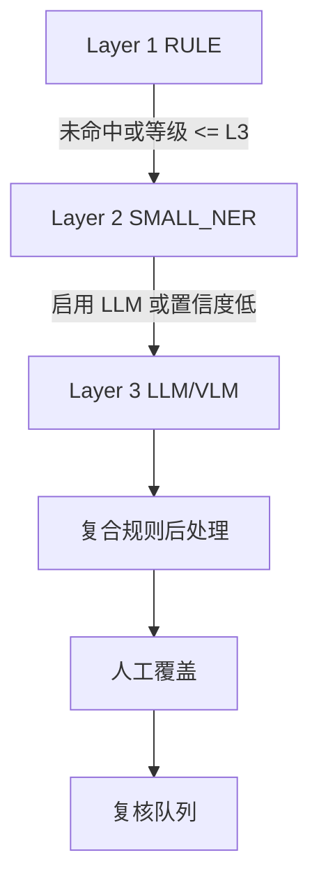
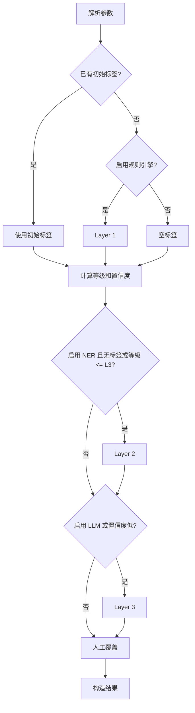
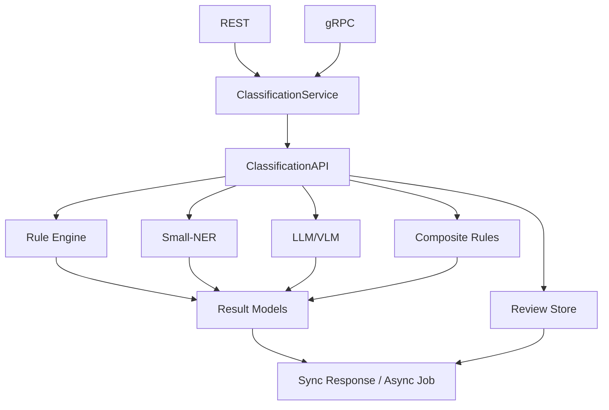
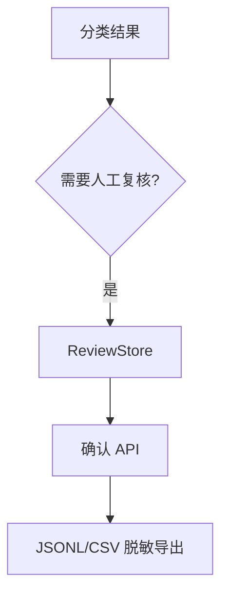

# 数据分类分级设计文档

本文档描述 `privacy-local-agent` 数据分类分级模块的目标、分类算法、系统架构、数据模型、接口适配和运维设计。工业化评分、发布门禁和评审模板统一维护在 [industrialization_review.md](industrialization_review.md) 中，避免设计文档与评审文档重复。

## 目录

1. [概述与设计目标](#1-概述与设计目标)
2. [分类算法](#2-分类算法)
3. [执行流程](#3-执行流程)
4. [架构设计](#4-架构设计)
5. [数据模型](#5-数据模型)
6. [输入适配与合规模板](#6-输入适配与合规模板)
7. [版本化、参数与影子模式](#7-版本化参数与影子模式)
8. [降级与资源管理](#8-降级与资源管理)
9. [可观测性](#9-可观测性)
10. [扩展点](#10-扩展点)
11. [测试策略](#11-测试策略)
12. [相关文档](#12-相关文档)

## 1. 概述与设计目标

模块通过“规则引擎 → Small-NER → 本地 LLM/VLM”的三层漏斗识别敏感数据，输出统一的 L1~L5 敏感度等级、分类标签、置信度、来源引擎和审计信息。

设计目标：

- 建立稳定的 L1~L5 敏感度等级和标签体系。
- 支持字段级、记录级和表级分类。
- 支持 JSON、DataFrame、Arrow、SQL 结果和 SecretFlow 数据结构。
- 支持字段组合、上下文敏感和合规模板规则。
- 支持同步与异步分类，避免 LLM 推理阻塞主链路。
- 支持人工复核、确认和脱敏导出。
- 保证日志、指标、复核存储和导出制品不泄露原始数据。
- 支持规则集版本化、影子模式和可回滚配置。
- 通过 REST/gRPC 提供一致的服务契约，并暴露 Prometheus 指标。

## 2. 分类算法

### 2.1 三层漏斗



| 层级 | 引擎 | 主要职责 | 依赖 |
|---|---|---|---|
| L1 | `DefaultRuleEngine` / `VectorizedRuleEngine` | 字段名、值格式、校验和和文件特征匹配 | 核心依赖；向量化需要 pandas |
| L2 | `ONNXSmallNerEngine` / `ModelScopeSmallNerEngine` | 识别疾病、药物、手术、解剖部位和基因实体 | 可选 ONNX / ModelScope |
| L3 | `Qwen2VLClassifier` | 处理图片、手写病历和非结构化文本 | 可选 PyTorch / Transformers |

### 2.2 Layer 1 规则引擎

规则引擎按以下顺序收集标签：

1. **字段名规则**：字段名转小写并移除下划线、空格后匹配基因组和模板关键词。
2. **PII 值规则**：识别身份证、手机号、医保卡和 ICD-10 编码。
3. **基因组内容规则**：识别 BAM、VCF、FASTQ 文件头及连续碱基序列。
4. **公开和运营字段规则**：将白名单字段标记为 L1，将运营统计字段标记为 L2。

典型规则：

| 类别 | 示例匹配 | 等级 |
|---|---|---|
| 基因组字段 | `brca1`、`tp53`、`snp`、`genome`、`mutation` | L5 |
| 基因组文件 | `BAM\x01`、`##fileformat=VCF`、FASTQ 四行结构 | L5 |
| 基因序列 | `[ATCGNatcgn]{50,}` | L5 |
| 身份证 | 18 位格式 + 加权模 11 校验 | L3 |
| 手机号 | `^1[3-9]\d{9}$` | L3 |
| 医保卡 | 9 位数字 + 校验和 | L3 |
| ICD-10 | 格式解析 + 敏感区间映射 | L3/L4 |
| 公开字段 | `public_report`、`annual_summary`、`科普` | L1 |
| 运营统计 | `turnover_rate`、`device_usage`、`inventory` | L2 |

所有规则命中标签默认 `confidence=1.0`、`source_engine=RULE`、`engine_layer=L1_RULE`。标签按 `(level, category)` 去重并保留首次出现顺序。`VectorizedRuleEngine` 使用 pandas Series 批量匹配，语义必须与标量引擎一致；缺少 pandas 时回退到 `DefaultRuleEngine`。

### 2.3 Layer 2 Small-NER

Small-NER 用于识别医疗领域实体：

- 触发条件：`enable_small_ner=True` 且 Layer 1 未命中或最终等级不高于 L3。
- 引擎优先级：本地 ONNX 模型 → ModelScope → `NoOpSmallNerEngine`。
- 使用纯 Python 字符级 tokenizer，默认 `max_len=128`。
- 模型输出通过 BIO 标签解析为实体边界和类型。

| 实体 | 等级 | 类别 |
|---|---|---|
| 基因实体 | L5 | `GENOMIC_HINT` |
| 敏感疾病 | L4 | `MEDICAL_SENSITIVE_DISEASE` |
| 普通疾病、药物、手术、解剖部位 | L3 | 对应医疗类别 |

Small-NER 标签的 `source_engine=SMALL_NER`，置信度取模型 softmax 概率，命中后层级为 `L2_SMALL_NER`。

### 2.4 Layer 3 LLM/VLM

LLM/VLM 基于本地 Qwen2-VL-2B-Instruct，处理图片、手写病历和复杂非结构化文本。

- 触发条件：`enable_llm=True`，或上游置信度低于 `llm_confidence_threshold`。
- 模型目录不存在或依赖缺失时使用 `NoOpLlmClassifier`。
- 图片输入支持本地路径、Data URI 和合法 Base64；其他输入按纯文本处理。
- 设备选择顺序为 CUDA → MPS → CPU。
- 模型延迟初始化，使用锁和单线程线程池保护推理。
- 默认超时 180 秒，可通过 `PRIVACY_VLM_TIMEOUT` 配置。
- 超时或异常返回 `None`，由上层执行保守降级。

模型输出使用结构化 JSON：

```json
{
  "final_level": "L1/L2/L3/L4/L5",
  "sub_category": "分类标签简称",
  "confidence": 0.0,
  "reasoning": "定级判别说明",
  "needs_human_review": false
}
```

### 2.5 复合规则

单字段分类不足以表达组合风险。例如姓名、身份证和手机号分别为 L3，但同时出现时应升级为 L5。

复合规则字段：

| 字段 | 含义 |
|---|---|
| `name` | 规则名称 |
| `field_patterns` | 归一化字段名正则列表 |
| `min_matches` | 最少命中字段数 |
| `target_level` | 升级后的等级 |
| `category` | 分类标签 |
| `rule_id` | 规则 ID |

默认规则包括：

| 规则 ID | 场景 | 最少命中 | 目标等级 |
|---|---|---:|---|
| `COMP_001` | 姓名 + 身份证 + 手机号 | 3 | L5 |
| `COMP_002` | 医疗 + 基因组字段 | 2 | L5 |
| `COMP_003` | 金融账户字段 | 1 | L4 |

复合规则在记录级字段分类完成后执行，命中标签的 `source_engine=COMPOSITE`、`confidence=1.0`。目标等级达到 L5 时自动标记人工复核。请求参数 `compositeRules` 可替代默认规则集。

## 3. 执行流程

### 3.1 字段级分类



关键聚合规则：

- `final_level` 取所有标签的最高等级，无标签时使用 `default_level`。
- `confidence` 取最终决策路径的置信度。
- `engine_layer` 记录最终决策层级。
- `needs_human_review` 只要任一标签要求复核，整体即要求复核。
- `field_value` 受 `return_field_values` 控制；图片和二进制只返回尺寸摘要。

### 3.2 记录级和表级分类

记录级流程：

1. 对每个字段执行字段级分类。
2. 聚合标签，等级取最高值，置信度取最高值。
3. 执行 `CompositeRuleEngine.evaluate(record, field_results)`。

表级流程：

1. 检查是否提供 `evaluate_series`。
2. 有向量化能力时先按列批量计算 Layer 1 标签。
3. 逐行复用预计算标签执行 NER、LLM 和复合规则。
4. 无向量化能力时逐行调用记录级流程。
5. 收集复核条目并按需计算影子差异。
6. 表级等级取所有记录的最高等级。

## 4. 架构设计

### 4.1 整体架构



### 4.2 异步推理

异步接口使用线程池提交任务，内存 `job_store` 保存 `ClassificationJob`，客户端通过 job ID 查询结果。任务状态为：

```text
PENDING -> RUNNING -> DONE
                  \-> FAILED
```

异步任务不阻塞 REST/gRPC 主线程；已完成任务按 TTL 清理，任务数超过上限时拒绝新任务，避免 OOM。

| 环境变量 | 默认值 | 说明 |
|---|---:|---|
| `PRIVACY_ASYNC_MAX_WORKERS` | `4` | 线程池最大线程数 |
| `PRIVACY_ASYNC_JOB_TTL_SECONDS` | `3600` | 已完成任务保留时间 |
| `PRIVACY_ASYNC_MAX_JOBS` | `1000` | 最大任务数 |

### 4.3 人工复核闭环



复核存储支持内存和 SQLite 两种模式。复核条目包含 `review_id`、记录索引、字段名、字段值摘要、预测等级、预测标签和状态。确认操作记录修正等级、复核人和说明。导出时 `mask_input=True` 对字段值执行 `redact`，JSONL 额外生成 `fine_tuning_text`。

## 5. 数据模型

模型定义位于 `privacy_local_agent/privacy/classification_models.py`：

- `SensitivityLevel`：L1~L5。
- `EngineLayer`：L1_RULE / L2_SMALL_NER / L3_LLM。
- `SecurityTag`：单个分类标签。
- `FieldClassificationResult`：字段级结果。
- `RecordClassificationResult`：记录级聚合结果。
- `TableClassificationResult`：表级结果、复核条目和影子差异。
- `ClassificationParams`：参数治理模型。
- `CompositeRule`、`ShadowDiff`：复合规则和影子模式模型。
- `ClassificationJob` / `ClassificationJobResult`：异步任务模型。
- `ReviewEntry`：人工复核条目。

### 5.1 结果字段

| 字段 | 说明 |
|---|---|
| `field_name` | 字段名 |
| `field_value` | 受配置控制的值摘要 |
| `tags` | 所有命中标签 |
| `final_level` | 最高等级或人工覆盖等级 |
| `confidence` | 综合置信度 |
| `engine_layer` | 最终决策层级 |
| `needs_human_review` | 是否需要复核 |
| `reasoning` | 规则命中或模型推理说明 |

### 5.2 审计信息

`AuditInfo` 至少包含：

| 字段 | 说明 |
|---|---|
| `version` | 分类原语版本 |
| `profile_version` | 参数配置版本 |
| `timestamp` | UTC 时间戳 |
| `rule_engine_version` | 规则引擎版本 |
| `rule_set_version` | 规则集版本 |
| `parameter_source` | `default` / `profile` / `request` / `manual` |

## 6. 输入适配与合规模板

### 6.1 输入适配

| 输入 | 方法 | 说明 |
|---|---|---|
| `dict` | `classify_record` | 单条记录 |
| `list[dict]` | `classify_table` | 表数据 |
| JSON 字符串 / 对象 | `classify_json` | 自动识别记录或表 |
| `pandas.DataFrame` | `classify_dataframe` | 可选依赖 |
| `pyarrow.Table` | `classify_arrow` | 可选依赖 |
| SQL 结果 | `classify_sql_result` | 记录列表 |
| SecretFlow 数据结构 | `classify_secretflow` | HDataFrame、VDataFrame、FedNdarray |

SecretFlow 适配器通过 `privacy/data_adapters.py` 的 `to_records` / `from_records` 转换为内部 records 表示；缺少 SecretFlow 依赖时抛出明确的 `ImportError`。

### 6.2 合规模板

模板定义于 `classification_utils.py` 的 `TEMPLATES`：

| 模板 | 场景 | 主要扩展 |
|---|---|---|
| `jrt0197` | 金融数据 | 银行卡、交易账号、资产、征信 |
| `gbt35273` | 通用个人信息 | 姓名、身份证、手机号、住址、轨迹 |
| `gdpr` | 欧盟个人数据 | 生物识别、健康、基因、种族、政治观点 |

模板默认值只填充未设置的参数，不覆盖请求级参数。

## 7. 版本化、参数与影子模式

### 7.1 参数优先级

```text
manual_override > request params > YAML profile > template defaults > default
```

`ParameterResolver` 加载 YAML profile，`ClassificationAPI` 合并各层参数并通过 Pydantic `model_validate` 校验。关键参数包括：

| 参数 | 默认值 | 作用 |
|---|---|---|
| `default_level` | `L3` | 未命中时的等级 |
| `enable_rule_engine` | `True` | 启用 Layer 1 |
| `enable_small_ner` | `False` | 启用 Layer 2 |
| `enable_llm` | `False` | 启用 Layer 3 |
| `llm_confidence_threshold` | `0.6` | LLM 触发阈值 |
| `template` | `None` | 合规模板 |
| `rule_set_version` | `"1.0.0"` | 规则集版本 |
| `manual_override` | `{}` | 字段级人工覆盖 |
| `composite_rules` | `[]` | 自定义复合规则 |
| `enable_review` | `True` | 是否收集复核条目 |
| `review_export_mask` | `False` | 导出时是否脱敏 |

### 7.2 影子模式

启用 `shadow_mode=True` 时，系统使用 `shadow_version` 重新分类并比较主结果与影子结果，生成 `ShadowDiff`。影子结果只用于评估，不改变实际分级。

## 8. 降级与资源管理

- Small-NER：ONNX → ModelScope → `NoOpSmallNerEngine`。
- LLM/VLM：模型加载失败 → `NoOpLlmClassifier`，必要时保留上游等级并标记人工复核。
- 向量化：pandas 缺失 → `DefaultRuleEngine` 标量路径。
- SecretFlow：依赖缺失时抛出明确异常，不静默伪造成功结果。
- LLM：模型延迟加载，锁保护初始化，单线程线程池隔离推理，超时后执行降级。
- 异步任务：线程池大小可配置，任务超限确定性拒绝，完成任务按 TTL 回收。

## 9. 可观测性

所有指标通过 `/metrics` 导出，标签不得包含原始敏感数据。

### 9.1 Counter

| 指标 | 说明 |
|---|---|
| `privacy_classification_total` | 按等级和层级统计分类结果 |
| `privacy_classification_rule_hits_total` | 按规则 ID 统计命中 |
| `privacy_classification_ner_total` | NER 命中 / 未命中 |
| `privacy_classification_llm_total` | LLM 成功、超时、错误和降级 |
| `privacy_classification_composite_hits_total` | 复合规则命中 |
| `privacy_classification_jobs_total` | 异步任务状态 |
| `privacy_classification_shadow_diff_total` | 影子差异 |
| `privacy_classification_templates_total` | 模板使用 |

### 9.2 Histogram 与 Gauge

| 指标 | 说明 |
|---|---|
| `privacy_classification_duration_seconds` | field / record / table 延迟 |
| `privacy_classification_ner_duration_seconds` | NER 推理延迟 |
| `privacy_classification_llm_duration_seconds` | LLM 推理延迟 |
| `privacy_classification_jobs_duration_seconds` | 异步任务执行延迟 |
| `privacy_classification_vectorized_batch_size` | 向量化批次大小 |
| `privacy_classification_review_queue_size` | 待复核队列大小 |

### 9.3 结构化日志与零知识保护

分类模块使用 `get_logger(__name__)` 和 `extra={}` 记录结构化上下文，例如 job ID、规则 ID、耗时和状态。访问日志不记录请求/响应体；错误日志对输入执行 `redact`；指标只使用等级、规则 ID 和状态等匿名标签。

## 10. 扩展点

- 继承 `RuleEngine` 扩展规则匹配。
- 继承 `SmallNerEngine` 接入其他 NER 框架。
- 继承 `LlmClassifier` 接入其他私有模型。
- 继承 `CompositeRuleEngine` 扩展上下文推理。
- 通过 `ClassificationParams.template` 增加合规模板。
- 通过 `data_adapters.py` 增加新的数据结构适配器。

## 11. 测试策略

测试应覆盖：

- 规则命中、校验和、边界值和无命中场景。
- 三层引擎协同、触发条件和所有降级路径。
- 字段、记录、表三级聚合，以及向量化与标量一致性。
- 参数治理优先级、模板切换和规则版本追溯。
- SecretFlow 适配器、复合规则和影子模式。
- 异步任务状态流转、TTL 清理、超限拒绝和持久化。
- 复核确认、导出脱敏和 Zero-Knowledge 日志。
- REST/gRPC/Pydantic 字段契约。
- LLM/NER 超时、线程安全和可选依赖缺失。

工业化发布门禁、证据时效、性能测量合同和评分卡见 [industrialization_review.md](industrialization_review.md)。

## 12. 相关文档

| 文档 | 内容 |
|---|---|
| [classification_ner/design.md](classification_ner/design.md) | Small-NER 详细设计 |
| [classification_llm/design.md](classification_llm/design.md) | LLM/VLM 详细设计 |
| [industrialization_review.md](industrialization_review.md) | 工业化评审、发布门禁和评分卡 |
| [ops.md](ops.md) | 分类模块运行与配置 |
| [prd.md](prd.md) | 分类模块需求 |
