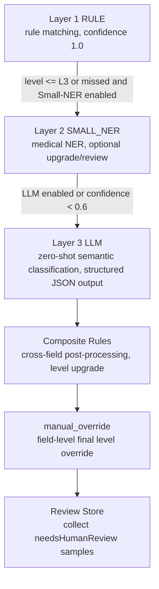
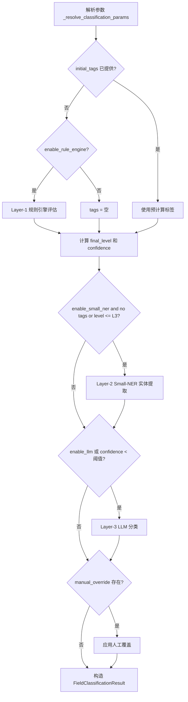
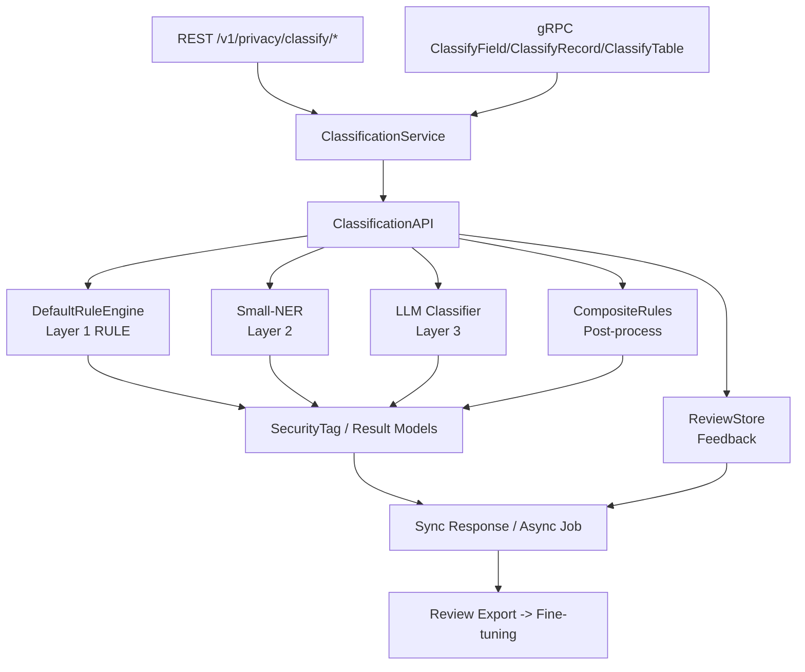
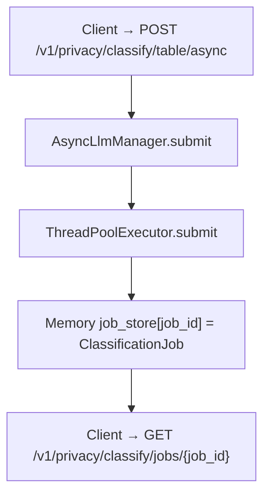
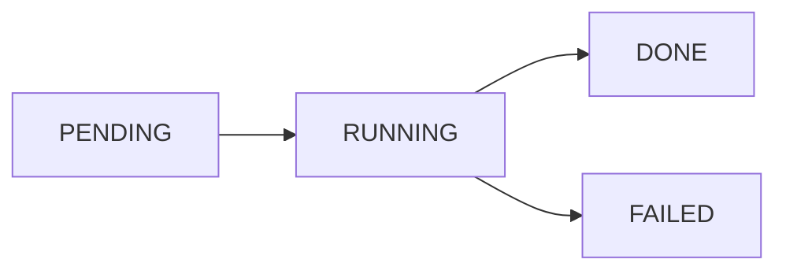
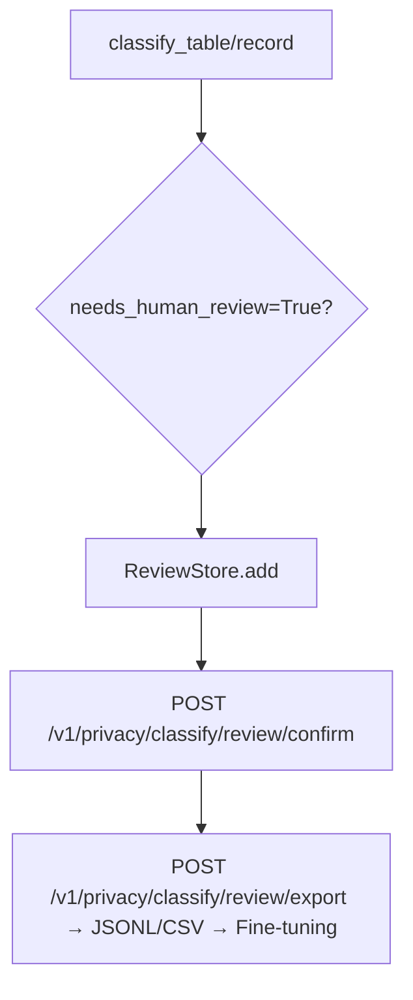

# 数据分类分级设计文档

## 1. 概述

本文档定义 `privacy-local-agent` 数据分类分级模块的算法原理、技术架构与实现细节。该模块通过三层漏斗式分类引擎，自动识别敏感数据并输出统一的敏感度等级与标签。

本版本在原有架构基础上新增：

- SecretFlow 联邦数据结构输入适配。
- 复合/上下文敏感规则识别。
- Layer 3 LLM 同步与异步两套推理接口。
- 基于 `needsHumanReview` 的轻量复核闭环。
- Zero-Knowledge 扫描原则落地。
- 内置 JR/T 0197、GB/T 35273、GDPR 合规规则模板。
- 规则集版本化与影子模式。

## 2. 设计目标

- 建立 L1~L5 敏感度等级体系与统一标签体系。
- 实现规则引擎 → 轻量级 NER → 多模态大模型的三层递进分类架构。
- 支持字段级、记录级、表级分类。
- 支持多种输入格式与参数治理模型。
- 支持跨字段组合规则识别，解决上下文敏感场景。
- 提供同步与异步两套 Layer 3 推理接口，异步接口避免阻塞主链路。
- 提供轻量人工复核 API 与样本导出能力。
- 保障扫描过程不泄露原始数据。
- 支持规则模板切换、版本化与影子模式灰度评估。
- 暴露一致的 REST/gRPC 接口与 Prometheus 指标。

## 3. 算法原理

### 3.1 三层漏斗分类架构



#### 3.1.1 规则引擎（Layer 1）

`DefaultRuleEngine.evaluate(field_name, value, params)` 按以下顺序收集标签：

1. **字段名规则**：对字段名执行归一化（转小写、移除下划线与空格）后，按子串包含或正则方式匹配基因组相关关键词。所有字段名规则命中后均标记为 **L5（极高风险）**，`source_engine = RULE`。具体规则组如下：

   | 规则 ID | 类别（category） | 匹配模式 | 说明 |
   |---|---|---|---|
   | `RULE_ID_G_001` | `GENOMIC_BRCA_TP53` | 字段名包含 `brca1`、`brca2`、`tp53` | 高外显率遗传性癌症基因（乳腺癌/卵巢癌/ Li-Fraumeni 综合征），属于最高敏感级别基因标记 |
   | `RULE_ID_G_002` | `GENOMIC_VARIANT` | 字段名或字段值匹配正则 `rs\d+`（dbSNP 编号），或字段名包含 `snp`、`cnv`、`genome`、`genomic` | 基因组变异位点标识，涵盖 SNP 单核苷酸多态性、CNV 拷贝数变异及全基因组数据 |
   | `RULE_ID_G_003` | `GENOMIC_HINT` | 字段名包含 `gene`、`mutation`、`variant` | 基因/突变/变异通用提示词，覆盖未明确指定具体基因名但语义涉及基因组学的字段 |
   | `RULE_ID_G_004` | `GENOMIC_FILE` | 字段名包含 `bam`、`vcf`、`fastq` | 基因组测序文件格式标识（BAM 比对文件、VCF 变异文件、FASTQ 原始读段文件） |

   **归一化规则**：`_normalize_field_name(name)` 将字段名转为小写并移除 `_` 和空格。例如 `BRCA1_Status` → `brca1status`，`SNP_ID` → `snpid`，确保大小写与命名风格不影响匹配。

   **可配置性**：基因组关键词列表通过 `ClassificationParams.genomic_keywords` 参数暴露，默认值为 `["brca1", "brca2", "tp53", "rs", "snp", "cnv", "genome", "genomic", "gene", "mutation", "variant"]`，可通过 YAML profile 或请求级参数扩展。

   **合规模板扩展字段名规则**（由 `_apply_template_field_rules` 实现，仅在激活对应模板时生效）：

   | 模板 | 规则 ID | 类别 | 匹配模式 | 等级 |
   |---|---|---|---|---|
   | `jrt0197` | `RULE_ID_JRT_001` | `FINANCE_ACCOUNT` | `bankcard`、`cardno`、`credit`、`transaction`、`asset`、`balance`、`account` | L4 |
   | `gbt35273` / `gdpr` | `RULE_ID_GBT_001` | `PII_CONTACT_LOCATION` | `email`、`address`、`location`、`轨迹` | L3 |
   | `gdpr` | `RULE_ID_GDPR_001` | `GDPR_SPECIAL_CATEGORY` | `biometric`、`fingerprint`、`face`、`health`、`genetic`、`race`、`ethnicity`、`political`、`religion`、`sexual` | L4 |
2. **值规则（PII 标识符）**：对字段值进行格式校验与校验和验证，识别个人身份信息。具体规则如下：

   | 规则 ID | 类别（category） | 匹配逻辑 | 等级 | 说明 |
   |---|---|---|---|---|
   | `RULE_ID_001` | `PII_ID_CARD` | 18 位身份证号正则 + 加权校验和（权重 `[7,9,10,5,8,4,2,1,6,3,7,9,10,5,8,4,2]`，模 11 查表 `['1','0','X','9','8','7','6','5','4','3','2']`） | L3 | 中国大陆 18 位身份证号，包含格式校验（地区码+出生日期+顺序码）和第 18 位校验码验证 |
   | `RULE_ID_002` | `PII_MOBILE` | 正则 `^1[3-9]\d{9}$` | L3 | 中国大陆 11 位手机号，第二位为 3-9 |
   | `RULE_ID_003` | `PII_MEDICAL_CARD` | 9 位数字 + 加权校验和（权重 `[7,9,10,5,8,4,2,1]`，第 9 位 = `(10 - sum%10) % 10`） | L3 | 上海医保卡号 9 位数字校验 |
   | `RULE_ID_004` | `MEDICAL_ICD10_*` | ICD-10 编码格式解析（`^[A-Z]\d{2}(\.\d{0,2})?$`）+ 区间映射 | L3/L4 | 国际疾病分类编码，默认 L3；落入敏感区间时升级为 L4 |

   **ICD-10 敏感区间映射**（通过 `ClassificationParams.icd10_l4_intervals` 配置）：

   | 区间 | 升级类别 | 含义 |
   |---|---|---|
   | B20–B24 | `MEDICAL_ICD10_HIV` | HIV/AIDS 相关疾病 |
   | F20–F29 | `MEDICAL_ICD10_PSYCHIATRIC` | 精神分裂症等精神疾病 |
   | C00–C97 | `MEDICAL_ICD10_CANCER` | 恶性肿瘤 |

3. **值规则（基因组文件内容检测）**：对字段值进行前缀/模式匹配，识别基因组测序文件内容与序列片段：

   | 规则 ID | 类别（category） | 匹配逻辑 | 等级 | 说明 |
   |---|---|---|---|---|
   | `RULE_ID_G_010` | `GENOMIC_BAM` | 值以 `BAM\x01` 或 `@SQ` 开头 | L5 | BAM 二进制比对文件魔数或 SAM 头序列 |
   | `RULE_ID_G_011` | `GENOMIC_VCF` | 值以 `##fileformat=VCF` 开头 | L5 | VCF 变异调用文件标准头 |
   | `RULE_ID_G_012` | `GENOMIC_FASTQ` | 值以 `@` 开头且包含 SRR/ERR/DRR 访问号，或第 3 行为 `+` 分隔符 | L5 | FASTQ 原始测序读段文件（SRA 访问号前缀或四行格式特征） |
   | `RULE_ID_G_013` | `GENOMIC_SEQUENCE` | 值中匹配正则 `[ATCGNatcgn]{50,}`（连续 50+ 碱基字符） | L5 | 基因序列片段（DNA/RNA 碱基序列） |

4. **白名单/运营统计字段**：对字段名归一化后进行子串匹配，将公开/运营类字段标记为低敏感度：

   | 规则 ID | 类别（category） | 匹配模式（默认值） | 等级 | 说明 |
   |---|---|---|---|---|
   | `RULE_ID_L1_001` | `PUBLIC_REPORT` | `public_field_whitelist`：`public_report`、`annual_summary`、`科普` | L1 | 公开报表/科普类字段，可自由使用 |
   | `RULE_ID_L2_001` | `OPERATIONAL_STAT` | `operational_field_patterns`：`turnover_rate`、`device_usage`、`inventory` | L2 | 运营统计字段（周转率、设备使用率、库存），仅限内部使用 |

   白名单与运营统计模式均通过 `ClassificationParams` 参数暴露，可通过 YAML profile 或请求级参数自定义扩展。

所有命中标签的 `confidence = 1.0`，`source_engine = RULE`，`engine_layer = L1_RULE`。标签去重以 `(level, category)` 为键，保留首次出现顺序。

合规模板（JR/T 0197、GB/T 35273、GDPR）通过扩展默认规则集合实现。

为提升大数据集表分类吞吐量，系统还提供可选的 `VectorizedRuleEngine`（`privacy_local_agent/privacy/classification_vectorized.py`）。该引擎基于 pandas Series 对 Layer-1 规则做列式向量化匹配，语义与 `DefaultRuleEngine` 保持一致，可通过 `ClassificationAPI(use_vectorized=True)` 启用；未安装 pandas 时自动回退到 `DefaultRuleEngine`。

#### 3.1.2 Small-NER（Layer 2）

基于 ONNX Runtime 或 ModelScope 的医疗领域 NER 模型，识别疾病、症状、药物、手术、解剖部位等实体。详细设计参见 `docs/classification_ner/design.md`。

**触发条件**：当 `enable_small_ner=True` 且 Layer-1 未命中标签或最终等级 ≤ L3 时触发。

**引擎选择优先级**：

1. 检测本地 ONNX 模型文件（`.models/raner_cmeee.onnx`），存在则加载 `ONNXSmallNerEngine`。
2. 否则尝试加载 `ModelScopeSmallNerEngine`（需安装 modelscope 依赖）。
3. 缺失依赖时降级为 `NoOpSmallNerEngine`（不返回任何实体）。

**分词器**：内置纯 Python 实现的 `SimpleChineseBertTokenizer`，无第三方分词库依赖：

- 字符级切分，英文大小写折叠（提升医学缩写如 HIV、AIDS 的识别稳定性）。
- 编码输出 `(input_ids, attention_mask, token_type_ids)`，默认 `max_len=128`，padding 对齐。

**BIO 标记解析**：模型输出经 softmax 后取 argmax 得到每个 token 的标签索引，通过 BIO 序列标注解析（B-xxx / I-xxx / O）还原实体边界与类型。

**实体类型与敏感度映射**：

| 实体标签（label） | 敏感度等级 | 类别（category） | 规则 ID | 说明 |
|---|---|---|---|---|
| `GENOMIC_HINT` | L5 | `GENOMIC_HINT` | `NER_GENE_001` | 基因相关实体，标记 `needs_human_review=True` |
| `MEDICAL_DISEASE`（敏感关键词） | L4 | `MEDICAL_SENSITIVE_DISEASE` | `NER_DIS_SENSITIVE` | 命中敏感疾病关键词时升级 |
| `MEDICAL_DISEASE`（普通） | L3 | `MEDICAL_DISEASE` | `NER_DIS_NORMAL` | 普通疾病实体 |
| `MEDICATION` | L3 | `MEDICATION` | `NER_DRU_001` | 药物实体 |
| `SURGERY` | L3 | `SURGERY` | `NER_PRO_001` | 手术/操作实体 |
| `BODY_PART` | L3 | `BODY_PART` | `NER_BOD_001` | 解剖部位实体 |

**敏感疾病关键词列表**（触发 L4 升级）：`hiv`、`精神分裂`、`艾滋`、`梅毒`、`肿瘤`、`癌症`、`白血病`、`抑郁症`。

Small-NER 输出的标签 `source_engine = SMALL_NER`，置信度取模型 softmax 概率值。命中后 `engine_layer` 升级为 `L2_SMALL_NER`。

#### 3.1.3 LLM/VLM（Layer 3）

基于本地 Qwen2-VL-2B-Instruct，处理图片、手写病历与非结构化文本。详细设计参见 `docs/classification_llm/design.md`。

**触发条件**：当 `enable_llm=True`，或上游置信度 < `llm_confidence_threshold`（默认 0.6）时触发。

**引擎选择与降级**：

1. 尝试加载 `Qwen2VLClassifier`，检测本地模型目录（`.models/Qwen2-VL-2B-Instruct`）是否存在。
2. 模型目录不存在或依赖缺失时降级为 `NoOpLlmClassifier`。
3. `NoOpLlmClassifier` 行为：当上游置信度 < 0.6 时返回保守回退结果（保持上游等级 + 标记 `needs_human_review=True`），否则返回 None。

**多模态输入检测**（`_detect_image` 方法）：

| 输入类型 | 检测逻辑 | 处理方式 |
|---|---|---|
| 本地图片路径 | 后缀为 `.jpg/.jpeg/.png/.bmp/.webp` 且文件存在 | `PIL.Image.open` 加载 |
| Data URI | 匹配 `data:image/xxx;base64,...` 前缀 | Base64 解码后加载 |
| 纯 Base64 | 长度 > 100 且非 URL，尝试 `base64.b64decode(validate=True)` | 解码成功则作为图片处理 |
| 纯文本 | 以上均不匹配 | 直接作为文本输入 |

**推理流程**：

1. 延迟初始化模型（双重检查锁定确保线程安全）。
2. 检测设备：CUDA > MPS > CPU，自动选择硬件加速。
3. 构建 system/user prompt，要求模型输出结构化 JSON：
   ```json
   {
     "final_level": "L1/L2/L3/L4/L5",
     "sub_category": "分类标签简称",
     "confidence": 0.0,
     "reasoning": "定级判别的推理过程说明",
     "needs_human_review": false
   }
   ```
4. 将推理提交到专用线程池（单线程），设置超时保护（默认 180s，通过 `PRIVACY_VLM_TIMEOUT` 配置）。
5. 超时或异常时返回 None 触发降级，不阻塞主链路。

**线程安全设计**：

- `threading.Lock` 保护模型初始化与推理过程，避免多线程并发推理导致显存/内存争用 OOM。
- 专用单线程 `ThreadPoolExecutor`（`vlm-infer`）隔离推理，配合 `future.result(timeout=...)` 超时机制。

**预热机制**：

- `warmup()` 同步加载模型权重，建议在后台线程/协程中调用。
- `warmup_async()` 通过 `loop.run_in_executor` 异步预热，避免阻塞事件循环。
- 环境变量 `PRIVACY_WARMUP_LLM=true` 可在 REST 启动时自动触发异步预热。

LLM 输出的标签 `source_engine = LLM`，命中后 `engine_layer` 升级为 `L3_LLM`。

#### 3.1.4 字段分类执行流程

`_classify_field_internal(field_name, value, params, initial_tags)` 的完整执行流程：



**关键决策逻辑**：

- `final_level`：取所有标签中的最高等级；无标签时使用 `default_level`（默认 L3）。
- `confidence`：规则引擎命中为 1.0；未命中为 0.0；NER/LLM 取模型输出置信度。
- `engine_layer`：记录最终决策来源（L1_RULE → L2_SMALL_NER → L3_LLM）。
- `field_value`：当 `return_field_values=True` 时返回字段值摘要；图片/二进制数据仅返回 `[image data, ~123 KB]` 形式的尺寸摘要。
- `needs_human_review`：任一标签标记 `needs_human_review=True` 则整体标记为需要复核。

#### 3.1.5 记录级与表级聚合

**记录级分类**（`classify_record`）：

1. 对记录中每个字段执行 `classify_field`，得到 `field_results`。
2. 聚合所有字段标签（去重），`final_level` 取所有字段的最高等级，`confidence` 取最高置信度。
3. 应用复合规则后处理：`CompositeRuleEngine.evaluate(record, field_results)` 检查字段名组合，命中则升级 `final_level`。

**表级分类**（`classify_table`）：

1. 判断是否使用向量化引擎（`rule_engine` 是否提供 `evaluate_series` 方法）。
2. **向量化路径**：对每列批量计算 Layer-1 标签，然后每行复用预计算标签执行 NER/LLM/复合规则。
3. **标量路径**：每行执行 `classify_record`，聚合结果。
4. 收集复核条目（当 `enable_review=True`）。
5. 影子模式对比（当 `shadow_mode=True`）：用 `shadow_version` 重新分类并计算 `ShadowDiff`。
6. 表级 `final_level` 取所有记录的最高等级。

### 3.2 复合/上下文敏感规则

#### 3.2.1 问题定义

单字段敏感度不足以描述真实风险。例如：

- `name=L3`、`id_card=L3`、`mobile=L3` 单独出现均为 L3。
- 三者同时出现在同一条记录中时，应升级为 L5 `COMPOSITE_PII_COMBO`。

#### 3.2.2 复合规则 DSL

每条复合规则包含：

- `name`：规则名称。
- `field_patterns`：字段名正则列表（对归一化后的字段名执行 `re.search`，忽略大小写）。
- `min_matches`：最少命中字段数（每个 pattern 最多匹配一个字段）。
- `target_level`：升级后的敏感度等级。
- `category`：升级后的类别标签。
- `rule_id`：规则 ID。

示例：

```json
{
  "name": "高敏感个人信息组合",
  "field_patterns": ["name", "id_card", "mobile", "phone"],
  "min_matches": 3,
  "target_level": "L5",
  "category": "COMPOSITE_PII_COMBO",
  "rule_id": "COMP_001"
}
```

**内置默认复合规则**（`CompositeRuleEngine.DEFAULT_RULES`）：

| 规则 ID | 名称 | 字段模式（正则） | 最少命中 | 目标等级 | 类别 |
|---|---|---|---|---|---|
| `COMP_001` | 高敏感个人信息组合 | `^name$`、`id_card\|idcard\|identity`、`mobile\|phone\|cell` | 3 | L5 | `COMPOSITE_PII_COMBO` |
| `COMP_002` | 医疗基因组合 | `diagnosis\|disease\|illness`、`gene\|genomic\|mutation\|brca\|tp53\|rs\d+` | 2 | L5 | `COMPOSITE_MEDICAL_GENOMIC` |
| `COMP_003` | 金融账户组合 | `bank_card\|bankcard\|card_no\|account\|credit\|transaction` | 1 | L4 | `COMPOSITE_FINANCE_COMBO` |

复合规则标签的 `source_engine = COMPOSITE`，`confidence = 1.0`。当 `target_level ≥ L5` 时自动标记 `needs_human_review = True`。

自定义规则可通过请求参数 `compositeRules` 传入，将替代默认规则集。

#### 3.2.3 执行时机

复合规则作为 `classify_record` 的后处理步骤执行：

1. 先对记录内每个字段执行三层漏斗分类，得到 `field_results`。
2. `CompositeRuleEngine.evaluate(record, field_results)` 检查字段名组合。
3. 若命中，则向记录添加 `SecurityTag`，并重新计算 `final_level`。
4. 复合规则标签的 `source_engine = COMPOSITE`。

### 3.3 参数治理模型

参数优先级（高到低）：

```
manual_override > request params > YAML profile > template defaults > default
```

`ParameterResolver` 负责加载 profile；`ClassificationAPI` 通过 `_resolve_classification_params` 合并多层参数。

**参数合并流程**：

1. 从 YAML profile 解析器获取基础参数（`source = "profile"`）。
2. 根据 `template` 名称激活合规模板默认值（仅填充未设置的 key）。
3. 应用请求级参数覆盖（最高优先级，`source = "request"`）。
4. 通过 Pydantic `model_validate` 校验并构造 `ClassificationParams`。
5. 若存在 `manual_override` 则 `source = "manual"`。

**完整参数列表**（`ClassificationParams` 模型）：

| 参数名 | 别名（alias） | 类型 | 默认值 | 说明 |
|---|---|---|---|---|
| `version` | — | `str` | `"1.0.0"` | 参数配置版本号 |
| `default_level` | `defaultLevel` | `SensitivityLevel` | `L3` | 未命中任何规则时的默认敏感度 |
| `enable_rule_engine` | `enableRuleEngine` | `bool` | `True` | 是否启用 Layer-1 规则引擎 |
| `enable_small_ner` | `enableSmallNer` | `bool` | `False` | 是否启用 Layer-2 Small-NER |
| `enable_llm` | `enableLlm` | `bool` | `False` | 是否启用 Layer-3 LLM |
| `llm_confidence_threshold` | `llmConfidenceThreshold` | `float` | `0.6` | LLM 触发置信度阈值 |
| `icd10_l4_intervals` | `icd10L4Intervals` | `list[dict]` | B20-B24, F20-F29, C00-C97 | ICD-10 敏感区间配置 |
| `genomic_keywords` | `genomicKeywords` | `list[str]` | 11 个基因组关键词 | 基因组字段名匹配关键词 |
| `public_field_whitelist` | `publicFieldWhitelist` | `list[str]` | `public_report`、`annual_summary`、`科普` | L1 公开字段白名单 |
| `operational_field_patterns` | `operationalFieldPatterns` | `list[str]` | `turnover_rate`、`device_usage`、`inventory` | L2 运营统计字段模式 |
| `manual_override` | `manualOverride` | `dict[str, SensitivityLevel]` | `{}` | 字段级人工覆盖映射 |
| `template` | — | `str \| None` | `None` | 合规模板名称（`jrt0197`/`gbt35273`/`gdpr`） |
| `rule_set_version` | `ruleSetVersion` | `str` | `"1.0.0"` | 规则集版本，写入 AuditInfo |
| `shadow_mode` | `shadowMode` | `bool` | `False` | 是否启用影子模式 |
| `shadow_version` | `shadowVersion` | `str \| None` | `None` | 影子模式对比的规则集版本 |
| `return_field_values` | `returnFieldValues` | `bool` | `True` | 是否在结果中返回字段值 |
| `composite_rules` | `compositeRules` | `list[Any]` | `[]` | 自定义复合规则（替代默认） |
| `enable_review` | `enableReview` | `bool` | `True` | 是否启用复核队列收集 |
| `review_export_mask` | `reviewExportMask` | `bool` | `False` | 复核导出时是否对 input 脱敏 |

### 3.4 敏感度等级定义

| 等级 | 含义 | 典型示例 |
|---|---|---|
| L1 | 公开/可自由使用 | 运营统计字段、公开报表字段 |
| L2 | 内部使用 | 一般业务字段 |
| L3 | 受限使用 | 普通个人信息 |
| L4 | 高风险 | 身份证号、病史、敏感疾病 |
| L5 | 极高风险 | 基因数据、生物特征、多字段组合 |

### 3.5 Zero-Knowledge 扫描

> **Zero-Knowledge Scan 的核心原则：sidecar 不将原始数据持久化到日志、指标、复核存储或任何外部系统。**

具体措施：

- 访问日志仅记录 method/path/status/duration/byte size，不记录请求/响应体。
- 错误日志中对用户输入进行 `redact` 处理，最多保留前 8 字符。
- `ClassificationParams.return_field_values` 控制是否在结果中返回 `field_value`。
- 复核导出时支持对 `input` 字段哈希或掩码。

## 4. 架构设计

### 4.1 整体架构



### 4.2 异步推理架构



- 异步任务不阻塞 REST/gRPC 主线程。
- 使用内存 `dict` 存储 job，带 TTL 清理。
- 任务失败时记录错误信息，不泄露原始数据。

**任务生命周期状态机**：



| 状态 | 含义 |
|---|---|
| `PENDING` | 已提交，等待线程池调度 |
| `RUNNING` | 正在执行分类任务 |
| `DONE` | 执行成功，结果存储在 `job.result` |
| `FAILED` | 执行异常，错误信息存储在 `job.error` |

**配置参数**：

| 环境变量 | 默认值 | 说明 |
|---|---|---|
| `PRIVACY_ASYNC_MAX_WORKERS` | `4` | 线程池最大工作线程数 |
| `PRIVACY_ASYNC_JOB_TTL_SECONDS` | `3600` | 已完成任务保留时间（秒），超过后自动清理 |
| `PRIVACY_ASYNC_MAX_JOBS` | `1000` | 最大并发任务数，超过时拒绝新任务并抛出 `RuntimeError` |

**TTL 清理机制**：每 60 秒检查一次，删除已完成且超过 TTL 的任务。任务 ID 格式为 `cls-{uuid_hex[:12]}`。

### 4.3 复核闭环架构



**存储模式**：

| 模式 | 触发条件 | 说明 |
|---|---|---|
| 内存模式 | 未配置 `PRIVACY_REVIEW_DB` | 进程重启后数据丢失，适合开发/测试 |
| SQLite 持久化 | 配置 `PRIVACY_REVIEW_DB` 环境变量 | 启动时自动加载历史记录，进程重启不丢失 |

**复核条目收集逻辑**：

1. 遍历记录中每个字段的分类结果，收集 `needs_human_review=True` 的字段。
2. 若记录整体需要复核但无具体字段，创建记录级复核条目（`field_name = "__record__"`）。
3. 每个复核条目包含：`review_id`、`record_index`、`field_name`、`field_value`、`predicted_level`、`predicted_tags`、`status`。

**复核确认 API**：`confirm(review_id, corrected_level, reviewer, comment)` 将条目状态从 `PENDING` 更新为 `CONFIRMED`，记录修正等级与复核人。

**导出格式**：

| 格式 | 说明 |
|---|---|
| JSONL | 每行一个 JSON 对象，含 `fine_tuning_text` 字段用于 LLM 微调 |
| CSV | 标准 CSV 格式，含表头 |

**微调文本格式**（`fine_tuning_text` 字段）：

```
### Input
字段名: xxx
字段值: xxx
### Predicted
L3
### Corrected
L4
### Comment
复核说明
```

**Zero-Knowledge 保护**：导出时 `mask_input=True` 将对 `field_value` 执行 `redact`（保留前 8 字符 + `***`）。

## 5. 数据模型

参见 `privacy_local_agent/privacy/classification_models.py`：

- `SensitivityLevel`: L1~L5 枚举。
- `EngineLayer`: L1_RULE / L2_SMALL_NER / L3_LLM。
- `SecurityTag`: 单个分类标签。
- `FieldClassificationResult`: 字段级结果。
- `RecordClassificationResult`: 记录级结果，聚合字段结果，可含复合规则标签。
- `TableClassificationResult`: 表级结果，聚合记录结果，可含 `review_entries` 与 `shadow_diff`。
- `ClassificationResult`: 包装器，可含 record/table + audit。
- `ClassificationParams`: 参数治理模型，新增 `template`、`rule_set_version`、`shadow_mode`、`shadow_version`、`return_field_values`、`async_llm`。
- `CompositeRule`: 复合规则定义。
- `ShadowDiff`: 影子模式差异。
- `ClassificationJob` / `ClassificationJobResult`: 异步任务模型。
- `ReviewEntry`: 复核条目模型。

**SecurityTag 字段说明**：

| 字段 | 类型 | 说明 |
|---|---|---|
| `level` | `SensitivityLevel` | 敏感度等级（L1–L5） |
| `category` | `str` | 分类类别标签（如 `PII_ID_CARD`、`GENOMIC_BRCA_TP53`） |
| `confidence` | `float` | 置信度 [0.0, 1.0]，规则引擎始终为 1.0，NER/LLM 取模型输出 |
| `source_engine` | `str` | 来源引擎：`RULE` / `SMALL_NER` / `LLM` / `COMPOSITE` / `MANUAL` |
| `rule_id` | `str` | 规则 ID，用于指标埋点与结果追溯 |
| `version` | `str` | 规则版本（默认 `"1.0.0"`） |
| `needs_human_review` | `bool` | 是否需要人工复核 |

**FieldClassificationResult 字段说明**：

| 字段 | 类型 | 说明 |
|---|---|---|
| `field_name` | `str` | 字段名 |
| `field_value` | `str \| None` | 字段值摘要（受 `return_field_values` 控制，图片/二进制数据仅返回尺寸摘要） |
| `tags` | `list[SecurityTag]` | 所有命中的安全标签 |
| `final_level` | `SensitivityLevel` | 最终敏感度（取所有标签最高级或人工覆盖） |
| `confidence` | `float` | 综合置信度 |
| `engine_layer` | `EngineLayer` | 最终决策引擎层级 |
| `needs_human_review` | `bool` | 是否需要人工复核 |
| `reasoning` | `str` | 分类推理说明（规则命中列表或 LLM 推理过程） |

**AuditInfo 字段说明**：

| 字段 | 说明 |
|---|---|
| `version` | 分类原语版本 |
| `profile_version` | 参数配置版本 |
| `timestamp` | UTC 时间戳 |
| `rule_engine_version` | 规则引擎版本 |
| `rule_set_version` | 规则集版本 |
| `parameter_source` | 参数来源（`default`/`profile`/`request`/`manual`） |

## 6. 多格式适配

| 输入 | 方法 | 说明 |
|---|---|---|
| dict | `classify_record` | 单条记录 |
| list[dict] | `classify_table` | 表 |
| JSON str/dict | `classify_json` | 自动识别 record/table |
| pandas.DataFrame | `classify_dataframe` | 可选依赖 |
| pyarrow.Table | `classify_arrow` | 可选依赖 |
| list[dict] | `classify_sql_result` | SQL 结果集 |
| sf.data.DataFrame | `classify_secretflow` | SecretFlow 联邦 DataFrame |
| HDataFrame | `classify_secretflow` | 水平联邦 DataFrame |
| VDataFrame | `classify_secretflow` | 垂直联邦 DataFrame |
| FedNdarray | `classify_secretflow` | 联邦 Ndarray |

SecretFlow 适配器通过 `privacy/data_adapters.py` 的 `to_records/from_records` 转换为内部 records 表示。

## 7. 合规模板设计

内置模板定义于 `privacy_local_agent/privacy/classification_utils.py`（`TEMPLATES` 常量）：

| 模板 | 适用场景 | 主要扩展 |
|---|---|---|
| `jrt0197` | 金融数据分类分级 | 银行卡号、交易账号、客户资产、征信信息 |
| `gbt35273` | 通用个人信息 | 姓名、身份证、手机号、住址、行踪轨迹 |
| `gdpr` | 欧盟个人数据 | 生物识别、健康、基因、种族、政治观点 |

模板通过 `ClassificationParams.template` 激活，仅在默认参数之上叠加模板默认值，不影响请求级覆盖。

## 8. 规则版本化与影子模式

### 8.1 版本化

- `rule_set_version` 写入 `AuditInfo`，便于结果追溯。
- 模板与规则引擎版本独立管理。

### 8.2 影子模式

当 `shadow_mode=True` 时：

1. 使用当前参数运行分类，得到主结果。
2. 使用 `shadow_version` 替换 `rule_set_version`，重新运行分类，得到影子结果。
3. 对比每条记录的 `final_level` 与 `tags`，生成 `ShadowDiff`。
4. 主结果保持不变，影子差异作为 `shadow_diff` 字段返回。

影子模式仅用于评估，不影响实际分级决策。

## 9. 延迟加载与降级

- **Small-NER**：检测本地 ONNX 模型，存在则加载 `ONNXSmallNerEngine`；否则尝试 `ModelScopeSmallNerEngine`；缺失依赖则降级为 `NoOpSmallNerEngine`。
- **LLM Classifier**：加载 `Qwen2VLClassifier`，根据 CUDA/MPS 自动启用硬件加速；加载失败降级为 `NoOpLlmClassifier`。
- **SecretFlow**：可选依赖，缺失时 `classify_secretflow` 抛出明确 `ImportError`。
- **Async Manager**：线程池大小可配置，默认 4；超限时拒绝新任务。
- **VectorizedRuleEngine**：需要 pandas，未安装时自动回退到 `DefaultRuleEngine`。

## 10. 可观测性指标

分类模块通过 Prometheus 指标暴露全链路可观测数据，所有指标通过 `/metrics` 端点导出。

### 10.1 Counter 指标

| 指标名 | 标签 | 说明 |
|---|---|---|
| `privacy_classification_total` | `final_level`, `layer` | 分类结果计数（按最终等级和引擎层级） |
| `privacy_classification_rule_hits_total` | `rule_id` | Layer-1 规则引擎命中计数（按规则 ID） |
| `privacy_classification_ner_total` | `status` | Layer-2 NER 调用计数（`hit`/`miss`） |
| `privacy_classification_llm_total` | `status` | Layer-3 LLM 调用计数（`success`/`hit`/`miss`/`timeout`/`error`/`init_failed`） |
| `privacy_classification_composite_hits_total` | `rule_id` | 复合规则命中计数（按规则 ID） |
| `privacy_classification_jobs_total` | `status` | 异步任务计数（`PENDING`/`DONE`/`FAILED`） |
| `privacy_classification_shadow_diff_total` | — | 影子模式差异计数 |
| `privacy_classification_templates_total` | `template` | 合规模板使用计数 |
| `privacy_classification_vectorized_batch_total` | `field_name` | 向量化批量评估计数 |

### 10.2 Histogram 指标

| 指标名 | 标签 | Bucket 范围 | 说明 |
|---|---|---|---|
| `privacy_classification_duration_seconds` | `operation` | 1ms–10s | 分类操作延迟（`field`/`record`/`table`） |
| `privacy_classification_ner_duration_seconds` | `engine` | 1ms–5s | NER 推理延迟 |
| `privacy_classification_llm_duration_seconds` | `engine` | 0.1s–120s | LLM 推理延迟 |
| `privacy_classification_jobs_duration_seconds` | `status` | 0.1s–300s | 异步任务执行延迟 |
| `privacy_classification_vectorized_batch_size` | — | 1–50000 | 向量化批次大小分布 |

### 10.3 Gauge 指标

| 指标名 | 说明 |
|---|---|
| `privacy_classification_review_queue_size` | 当前待复核队列大小（`PENDING` 状态条目数） |

### 10.4 结构化日志

所有分类模块使用 `get_logger(__name__)` 获取结构化日志器，关键事件通过 `extra={}` 携带上下文：

| 事件名 | 触发时机 | 关键 extra 字段 |
|---|---|---|
| `classification_api_initialized` | API 初始化完成 | `rule_engine`, `small_ner`, `llm`, `use_vectorized` |
| `classification_table_completed` | 表分类完成 | `num_records`, `final_level`, `duration_seconds`, `shadow_diffs` |
| `classification_manual_override_applied` | 人工覆盖生效 | `field_name`, `overridden_level` |
| `async_job_submitted` | 异步任务提交 | `job_id` |
| `composite_rule_hit` | 复合规则命中 | `rule_id`, `category`, `matched_fields` |
| `llm_classify_timeout` | LLM 推理超时 | `timeout_s`, `duration_s` |
| `review_store_initialized` | 复核存储初始化 | `mode`（`memory`/`sqlite`） |

## 11. 扩展点

- 继承 `RuleEngine` 接口扩展规则匹配逻辑。
- 继承 `SmallNerEngine` 接口对接其他微型 NER 框架。
- 继承 `LlmClassifier` 接口接入其他私有部署大模型服务。
- 继承 `CompositeRuleEngine` 接口实现更复杂的上下文推理。
- 通过 `ClassificationParams.template` 切换或新增合规模板。

## 12. 测试策略

- 20 个通用分类测试用例。
- 三层引擎协同与降级路径测试。
- 参数治理优先级测试。
- SecretFlow 适配器测试（mock）。
- 复合规则命中/未命中测试。
- 异步任务状态流转与结果获取测试。
- 复核队列确认与导出测试。
- Zero-Knowledge 日志测试。
- 合规模板切换测试。
- 影子模式差异检测测试。
- REST/gRPC 接口字段一致性测试。

## 13. 工业化评分 / Industrialization Scorecard

> **工业化软件 = 功能正确 + 性能稳定 + 安全可靠 + 可维护 + 可观测 + 可快速迭代**

本章将 `privacy_local_agent/privacy/classification*` 相关实现统一纳入工业化审核标准。评估框架参考 ISO/IEC 25010 软件产品质量模型与 Google SRE 实践，从功能质量、非功能质量、工程化标准三大层面，对分类模块进行系统化评分。

### 13.1 评估维度总览

| 维度 | 权重 | 说明 |
|------|------|------|
| 功能完整性 | 20% | 三层漏斗覆盖度、规则准确性、多格式适配、降级路径 |
| 性能 | 15% | 分类延迟、向量化吞吐、LLM 超时控制、资源利用率 |
| 可靠性 | 20% | 降级容错、异步任务状态机、TTL 清理、并发安全 |
| 安全性 | 15% | Zero-Knowledge 扫描、输入校验、脱敏策略、合规模板 |
| 可维护性 | 15% | 代码规范、双语文档、模块化、可测试性 |
| 工程化 | 15% | 可观测性（Metrics/Logs/Traces）、版本管理、CI/CD、配置管理 |
| **总分** | **100%** | |

### 13.2 评分口径

每个维度按 1~10 分评分，采用以下口径：

| 分值区间 | 判定标准 |
|---|---|
| 1~2 | 缺失或存在明显反向实现（如泄露原始数据、无校验、无类型约束）。 |
| 3~4 | 具备基础实现，但关键路径有缺口，缺乏一致性。 |
| 5~6 | 达到可用水平，主流程具备该能力，但边界场景或证据不足。 |
| 7~8 | 实现完整，覆盖主要路径，具备较好的可维护性与可追溯性。 |
| 9~10 | 实现完整且标准化，关键路径、边界场景、文档证据均齐备，可作为项目标杆。 |

### 13.3 功能质量（Functional Quality）

#### 13.3.1 正确性

| 检查项 | 满分标准 | 本模块对应实现 |
|---|---|---|
| 规则命中准确 | 所有规则经校验和/正则验证，无误报 | 身份证加权模 11 校验、医保卡校验和、ICD-10 区间映射 |
| 等级判定一致 | 相同输入始终产生相同等级 | `final_level` 取标签最高级，确定性逻辑 |
| 复合规则正确 | 字段组合匹配精确，`min_matches` 阈值生效 | `CompositeRuleEngine` 正则 + 计数 |
| 多引擎协同 | 三层漏斗递进，不遗漏不冲突 | Layer-1 → Layer-2 → Layer-3 条件触发 |

#### 13.3.2 完整性

| 检查项 | 满分标准 | 本模块对应实现 |
|---|---|---|
| 业务场景覆盖 | 字段/记录/表级分类均支持 | `classify_field`/`classify_record`/`classify_table` |
| 输入格式覆盖 | JSON/DataFrame/Arrow/SecretFlow 等 | 多格式适配器（见第 6 章） |
| 边缘情况 | 空值、空记录、超长文本、二进制数据 | 空值返回默认等级，图片仅返回尺寸摘要 |
| 合规模板 | 金融/个人信息/GDPR 模板可切换 | `jrt0197`/`gbt35273`/`gdpr` 模板 |

#### 13.3.3 兼容性与降级

| 检查项 | 满分标准 | 本模块对应实现 |
|---|---|---|
| 依赖可选 | 重依赖缺失时优雅降级，不崩溃 | ONNX/ModelScope/PyTorch 缺失 → NoOp 引擎 |
| 向量化回退 | pandas 缺失自动回退标量路径 | `VectorizedRuleEngine` → `DefaultRuleEngine` |
| 跨平台 | CPU/CUDA/MPS 自动选择 | LLM 设备检测 `cuda > mps > cpu` |

### 13.4 非功能质量（Non-Functional Quality）

#### 13.4.1 性能（Performance）

| 指标 | 目标 | 本模块实现 |
|---|---|---|
| 字段分类 RT | < 5ms（纯规则） | Layer-1 纯正则/校验和，无 I/O |
| 表分类吞吐 | > 10000 行/s（向量化） | `VectorizedRuleEngine` 基于 pandas 列式匹配 |
| LLM 推理 RT | < 180s 超时保护 | 专用线程池 + `future.result(timeout)` |
| NER 推理 RT | < 5s | ONNX Runtime 本地推理 |
| 资源利用率 | 延迟加载，空闲不占显存 | 模型仅在首次调用时初始化 |
| 可扩展性 | 线程池大小可配置 | `PRIVACY_ASYNC_MAX_WORKERS` 环境变量 |

**性能埋点**：

- `privacy_classification_duration_seconds`（Histogram，按 `operation` 标签区分 field/record/table）
- `privacy_classification_ner_duration_seconds`（Histogram）
- `privacy_classification_llm_duration_seconds`（Histogram）
- `privacy_classification_vectorized_batch_size`（Histogram，批次大小分布）

#### 13.4.2 可靠性（Reliability）

| 指标 | 目标 | 本模块实现 |
|---|---|---|
| 容错性 | 单引擎故障不影响整体 | 三层漏斗逐层降级，NoOp 兜底 |
| 并发安全 | 多线程推理不争用 | `threading.Lock` + 双重检查锁定 |
| 异步任务 | 状态机完整，不丢失 | PENDING → RUNNING → DONE/FAILED |
| 资源回收 | 已完成任务自动清理 | TTL 60s 周期清理，`PRIVACY_ASYNC_JOB_TTL_SECONDS` |
| 超限保护 | 任务数超限拒绝而非 OOM | `PRIVACY_ASYNC_MAX_JOBS` 上限，超出抛 `RuntimeError` |
| 恢复性 | 复核数据持久化可恢复 | SQLite 模式启动时自动加载历史记录 |

#### 13.4.3 安全性（Security）

| 检查项 | 满分标准 | 本模块实现 |
|---|---|---|
| Zero-Knowledge 扫描 | 不持久化原始数据到日志/指标/外部系统 | `redact` 保留前 8 字符 + `***` |
| 输入校验 | Pydantic 模型校验 + 快速失败 | 所有公共入口经 `ClassificationParams.model_validate` |
| 传输安全 | TLS 1.2+ | `PRIVACY_TLS_ENABLED` 启用 TLS |
| 认证授权 | API Key / mTLS | `PRIVACY_AUTH_ENABLED` + 网关 mTLS |
| 审计追溯 | 每次分类可追溯规则版本与参数来源 | `AuditInfo`（rule_set_version, parameter_source, timestamp） |
| 合规性 | 内置合规模板 | JR/T 0197、GB/T 35273、GDPR |
| 导出脱敏 | 复核导出不泄露原文 | `review_export_mask=True` 对 field_value 执行 redact |
| 指标安全 | 指标标签不含敏感信息 | 仅记录 rule_id/level/status 等匿名标签 |

#### 13.4.4 可维护性（Maintainability）

| 检查项 | 满分标准 | 本模块实现 |
|---|---|---|
| 代码规范 | type hints + `from __future__ import annotations` | 所有模块统一使用 |
| 圈复杂度 | 单函数 < 10 | 规则引擎按规则 ID 拆分独立函数 |
| 模块化 | 低耦合、高内聚 | 10 个独立模块，职责单一 |
| 双语文档 | 中英文 docstring + Execution Steps | 核心类/函数均具备 |
| 可测试性 | 单元测试覆盖率 > 80% | 16 个测试文件，mock 重依赖 |
| 接口契约 | Pydantic schema 即文档 | `classification_models.py` 统一定义 |
| 枚举/常量 | 避免魔法字符串 | `SensitivityLevel`/`EngineLayer` 枚举 + 规则 ID 常量 |

### 13.5 工程化标准（Engineering Standards）

#### 13.5.1 可观测性（Observability）

可观测性三大支柱在本模块的落地：

| 支柱 | 实现 | 说明 |
|---|---|---|
| **Metrics** | Prometheus Counter/Histogram/Gauge（见第 10 章） | 15 个分类指标，覆盖全链路 |
| **Logs** | `get_logger(__name__)` + `extra={}` 结构化字段 | 关键事件携带 job_id/rule_id/duration 上下文 |
| **Traces** | OpenTelemetry OTLP 可选导出 | `OTEL_EXPORTER_OTLP_ENDPOINT` 配置 |

**指标埋点要求**：

- 指标值不携带敏感原文，仅记录统计量和匿名化标签。
- Counter 覆盖所有关键路径（规则命中、NER/LLM 调用、复合规则、异步任务）。
- Histogram 覆盖所有延迟敏感操作，Bucket 范围匹配实际分布。
- Gauge 反映实时状态（复核队列大小）。

**扣分建议**：

- 只有单一 Counter：通常不高于 5 分。
- 只有局部埋点、无法覆盖主路径：3~4 分。
- 指标标签维度过多或含敏感信息：1~2 分。

#### 13.5.2 版本管理与发布

| 检查项 | 满分标准 | 本模块实现 |
|---|---|---|
| 语义化版本 | SemVer 规范 | `rule_set_version` 写入 AuditInfo |
| 影子模式 | 新版本灰度评估不影响生产 | `shadow_mode=True` + `shadow_version` 对比 |
| 回滚能力 | 规则集可回退 | 版本化参数 + 模板独立管理 |
| 配置管理 | 环境分离，不硬编码 | YAML profile + 环境变量 + 请求级参数 |

#### 13.5.3 CI/CD 与代码审查

| 检查项 | 满分标准 | 本模块实现 |
|---|---|---|
| 自动化测试 | PR 触发全量测试 | `.github/workflows/ci.yml` |
| 代码审查 | 强制 Review | 分支保护 + Approve |
| 质量门禁 | Lint/Type Check 通过 | ruff + mypy + pytest |
| 构建可复现 | 依赖锁定 | `pyproject.toml` + `requirements*.txt` |

### 13.6 审核证据要求

审核某个文件时，应同时检查以下证据：

| 证据类型 | 检查内容 |
|---|---|
| **代码证据** | 关键函数、类、装饰器、异常处理、参数校验逻辑 |
| **日志证据** | 是否使用 `get_logger(__name__)`，是否通过 `extra={}` 传递上下文，是否避免泄露原始数据 |
| **指标证据** | 是否有 Counter/Histogram/Gauge，指标名、标签和埋点位置是否稳定 |
| **文档证据** | 是否具备中英文 docstring，是否包含 Execution Steps 或等价流程说明 |
| **测试证据** | 是否存在覆盖正向、异常、边界、降级路径的测试 |
| **接口证据** | REST/gRPC/Pydantic schema 是否与文档描述一致 |

### 13.7 审核判定规则

#### 13.7.1 加权评分表

| 维度 | 权重 | 得分（1-10） | 加权得分 |
|------|------|------------|----------|
| 功能完整性 | 20% | | |
| 性能 | 15% | | |
| 可靠性 | 20% | | |
| 安全性 | 15% | | |
| 可维护性 | 15% | | |
| 工程化 | 15% | | |
| **总分** | **100%** | | |

#### 13.7.2 结论分级

| 加权总分 | 结论 | 含义 |
|---|---|---|
| 9.0~10.0 | 标杆（Benchmark） | 可直接复用为团队最佳实践，作为审核样板。 |
| 7.0~8.9 | 通过（Pass） | 满足工业化要求，可进入主线。 |
| 5.0~6.9 | 有条件通过（Conditional） | 需补齐部分证据或修复缺口后复审。 |
| 1.0~4.9 | 不通过（Fail） | 存在明显工程化短板，不建议进入主线。 |

#### 13.7.3 一票否决项

无论总分多高，触发以下任一项即判定为**不通过**：

- 日志或指标泄露原始敏感数据。
- 公共入口缺少最基本的输入校验。
- 核心路径无法追踪结果来源或版本信息。
- 代码风格严重破坏可维护性，导致无法稳定回归。
- 无降级路径，重依赖缺失时进程崩溃。

### 13.8 文件级审核清单

| 文件 | 审核重点 | 重点证据 |
|------|------|------|
| `classification.py` | 主编排链路、参数解析、日志与指标完整性 | 入口函数、异常分支、审计信息 |
| `classification_models.py` | 数据模型表达、字段约束、可序列化性 | Enum/dataclass/Pydantic、默认值、别名 |
| `classification_rule_engine.py` | 规则准确性、命中去重、规则追溯 | 规则 ID、分类标签、命中顺序 |
| `classification_vectorized.py` | 向量化一致性与回退路径 | pandas 依赖检测、批量一致性 |
| `classification_composite.py` | 复合规则推理、上下文敏感升级 | 匹配字段、规则 DSL、升级逻辑 |
| `classification_async.py` | 异步任务状态机、TTL 清理、并发控制 | job_store、状态流转、超限拒绝 |
| `classification_review.py` | 复核闭环、确认/导出、脱敏策略 | review entry、导出格式、mask 逻辑 |
| `classification_utils.py` | 模板/参数治理、可扩展默认值 | templates、parameter merge、校验 |
| `classification_ner.py` | NER 降级、实体映射、模型初始化 | engine 选择、BIO 解析、超时控制 |
| `classification_llm.py` | 多模态推理、超时、线程安全、回退 | prompt、timeout、warmup、fallback |

### 13.9 审核输出模板

可在评审记录中按以下格式输出结论：

```text
文件：classification_llm.py

加权评分：
  功能完整性（20%）：9/10 — 多模态输入检测完整，降级路径清晰
  性能（15%）：8/10 — 超时保护完备，专用线程池隔离
  可靠性（20%）：9/10 — 双重检查锁定，NoOp 兜底
  安全性（15%）：9/10 — 不记录原始数据，redact 脱敏
  可维护性（15%）：8/10 — 双语文档完整，type hints 齐全
  工程化（15%）：8/10 — 指标覆盖主路径，结构化日志完整
  加权总分：8.7/10

结论：通过
亮点：结构化日志完整、LLM 超时与回退路径清晰、输入校验充分
问题：复核导出示例缺少一条端到端样例
建议：补充一个失败超时的回归测试和一条导出样例
```

### 13.10 参考标准

| 标准/模型 | 适用场景 | 本模块映射 |
|---|---|---|
| ISO/IEC 25010 | 软件产品质量模型（8 大特性） | 功能/性能/可靠性/安全性/可维护性维度 |
| Google SRE | SLI/SLO/SLA、错误预算 | 延迟 Histogram + 可用性降级 |
| SonarQube 质量门禁 | 代码质量量化（A~E 等级） | 圈复杂度、重复率、覆盖率 |
| CMMI | 软件过程成熟度（1-5 级） | 审核流程标准化、证据驱动 |
| 等保/GDPR/SOC2 | 合规性要求 | 内置合规模板 + Zero-Knowledge 扫描 |

## 14. 工业化评分卡改进版：证据驱动准入模型

本章是第 13 章的对照学习版，不替代其架构覆盖清单。第 13 章适合说明“模块计划具备哪些能力”；本章用于回答“在指定版本、指定环境和指定时间内，是否有可复现证据证明这些能力满足上线要求”。

### 14.1 第 13 章与第 14 章的对照

| 对比项 | 第 13 章：能力导向评分 | 第 14 章：证据驱动准入 | 学习重点 |
|---|---|---|---|
| 评分对象 | 代码模块及其设计能力 | 一个可定位的发布候选版本 | 评分必须绑定 commit、镜像或制品版本 |
| 评分依据 | 实现描述与审核人员判断 | 自动化测试、压测、扫描、运行记录和人工复核证据 | 区分“已实现”“已验证”“可运营” |
| 指标目标 | 例如 RT、吞吐量的期望值 | 明确数据集、样本量、分位数、运行环境和阈值 | 没有测量方法的目标不能作为得分依据 |
| 安全判断 | 功能与设计检查项 | 机密数据泄露门禁优先于加权得分 | 安全底线不能被平均分抵消 |
| 发布结论 | 分数区间结论 | 门禁结论 + 分数 + 风险接受记录 | 先判断能否发布，再评价成熟度 |
| 改进闭环 | 给出建议 | 缺口有责任人、完成日期、复验命令和证据链接 | 建议必须可追踪、可关闭 |

### 14.2 评分前提与证据包

一次评审只针对一个不可变的发布候选版本。评审记录至少应包含以下元数据：

| 字段 | 要求 | 示例 |
|---|---|---|
| `release_id` | Git commit SHA 或不可变镜像摘要 | `git:abc1234` |
| `rule_set_version` | 本次启用的规则集版本 | `1.2.0` |
| `profile_digest` | 生效 YAML profile 的 SHA-256 摘要 | `sha256:...` |
| `environment` | CPU/GPU、内存、Python 与依赖版本 | `CPU 8C/16G, Python 3.11` |
| `dataset_id` | 脱敏或合成评测集标识及版本 | `classification-golden-v3` |
| `executed_at` | 带时区的执行时间 | `2026-07-25T10:00:00+08:00` |

证据包必须可由评审者重新执行，且不得包含原始敏感字段值。建议采用如下目录结构：

```text
artifacts/classification/<release_id>/
  manifest.json
  unit-test.xml
  coverage.xml
  benchmark.json
  security-scan.json
  observability-check.json
  review-sample.jsonl
```

`manifest.json` 记录命令、退出码、工具版本、输入摘要与产物摘要。测试与基准数据使用合成数据、已获授权的脱敏数据，或仅保存不可逆摘要；不得将生产样本复制进制品。

### 14.3 先决门禁：任一失败即不可发布

下列项目是发布门禁，不参与加权平均。这样可避免“其他项目高分”掩盖安全或正确性缺陷。

| 门禁 | 通过条件 | 最低证据 | 失败处置 |
|---|---|---|---|
| 敏感数据泄露 | 日志、指标、trace、异常和导出制品均未包含原始测试敏感值 | 注入 canary PII 的端到端扫描报告 | 阻断发布，修复后重新全量扫描 |
| 规则集可追溯 | 每个结果可关联 `rule_set_version`、参数来源和时间戳 | API/REST/gRPC 契约测试及审计样本 | 阻断发布 |
| 核心正确性 | Golden set 不得出现 L5 漏报；其他标签满足约定阈值 | 版本化 golden test 报告 | 阻断发布或经风险负责人书面接受 |
| 依赖与代码安全 | 不存在未豁免的高危或严重漏洞；密钥扫描通过 | SCA、SAST、secret scan 报告 | 阻断发布 |
| 可恢复运行 | 可选 ML 依赖、模型或模型推理失败时，服务仍可启动并按文档降级 | 启动/降级集成测试 | 阻断发布 |
| 接口兼容 | REST、gRPC、Pydantic 契约与发布说明一致 | 契约测试、proto 兼容性检查 | 阻断发布 |

对于“经风险接受”的例外，必须记录风险说明、影响范围、补偿控制、审批人和失效日期。例外到期后自动恢复为阻断项。

### 14.4 可执行加权评分

通过全部门禁后，再计算成熟度分数。每项得分范围为 0~10，权重总和为 100%。

$$
S = 0.20F + 0.15P + 0.20R + 0.15Sec + 0.15M + 0.15E
$$

其中 $F$ 为功能质量、$P$ 为性能、$R$ 为可靠性、$Sec$ 为安全运营质量、$M$ 为可维护性、$E$ 为工程化质量。每个维度的评分取其子项加权平均；缺少证据的子项记为 0 分，不允许按“未评估”排除。

| 维度 | 权重 | 10 分证据 | 7 分证据 | 0 分情形 |
|---|---:|---|---|---|
| 功能质量 $F$ | 20% | 版本化 golden set 覆盖字段/记录/表、模板、复合规则、人工覆盖；核心标签 precision/recall 均达到发布阈值 | 主路径及主要负例已验证，但少数模板或边界用例未覆盖 | 无 golden set、结果不可重复，或核心分类错误 |
| 性能 $P$ | 15% | 固定环境下分别报告规则、NER、LLM 路径的 p50/p95/p99、吞吐和资源峰值，连续 3 次均达标 | 有 p95 与吞吐报告，样本或资源指标不完整 | 只有设计目标，没有压测结果，或超时/资源失控 |
| 可靠性 $R$ | 20% | 故障注入覆盖模型不可用、超时、SQLite 锁、任务满载；恢复和数据一致性均验证 | 降级与并发主路径验证，故障注入覆盖不足 | 单点失败导致进程退出、任务丢失或错误结果 |
| 安全运营质量 $Sec$ | 15% | 通过泄露 canary、输入边界、导出掩码、鉴权/TLS 与漏洞扫描；高风险发现闭环 | 已覆盖主要安全控制，仍有已登记的中风险缺口 | 敏感数据进入日志/指标，或存在未处理严重漏洞 |
| 可维护性 $M$ | 15% | 类型、lint、覆盖率、复杂度和重复率均有自动门禁；变更说明和测试映射完整 | 静态检查和主要测试通过，量化门槛不完整 | 无自动检查或关键逻辑无法安全修改 |
| 工程化质量 $E$ | 15% | CI 可从干净环境生成相同制品；SLO 仪表盘、告警和 runbook 均经演练验证 | CI 与指标存在，告警或运行手册未演练 | 手工发布、无制品追踪或生产故障不可诊断 |

### 14.5 指标的测量合同

第 13 章中的“< 5ms”“> 10000 行/s”等目标，只有满足下列测量合同才可用于评分：

| 指标 | 测量合同 | 建议发布阈值 |
|---|---|---|
| 规则字段分类延迟 | 预热后，固定字段分布，至少 10,000 次；报告 p50/p95/p99 与 CPU 峰值 | p95 <= 5ms，p99 <= 10ms |
| 向量化表分类吞吐 | 固定列数、行数、空值比例，排除数据加载时间；至少运行 3 次取最差值 | >= 10,000 行/s，且与标量结果一致 |
| NER 延迟 | 固定模型、输入长度分桶、冷热启动分开报告 | 业务设定 p95；超过阈值必须降级或排队 |
| LLM 超时率 | 统计成功、超时、降级和错误，按输入类型分组 | 超时率低于约定 SLO；任何超时不得阻塞请求线程 |
| 异步任务可靠性 | 满载、重启、TTL 清理后核对任务终态与结果可读性 | 不丢失已受理任务；超限返回确定性错误 |
| 分类准确性 | 仅使用有标注的版本化 golden set；分别统计 L5 漏报和总体 precision/recall | L5 漏报为 0；其他阈值由业务风险负责人签署 |

所有延迟数据均应说明是否包含序列化、网络、模型加载与 I/O。不能把不同路径的结果合并为单一平均值，因为平均值会掩盖长尾和模型冷启动问题。

### 14.6 SLO、告警与运行处置

指标存在不等于可运营。每项关键指标应定义 SLI、SLO、告警阈值和明确的处理动作。

| SLI | SLO 示例 | 告警条件 | 首要处置 |
|---|---|---|---|
| 规则分类可用率 | 30 天内 >= 99.9% | 5 分钟错误率 > 1% | 检查 profile/规则集加载，回滚最近规则版本 |
| LLM 降级率 | 24 小时内 < 5% | 15 分钟内 > 10% | 检查模型服务与资源，必要时关闭 LLM 并转人工复核 |
| LLM p95 延迟 | 1 小时内 <= 业务阈值 | 连续 3 个窗口超阈值 | 限流、排队或扩大超时外的计算资源；禁止无边界重试 |
| 复核队列积压 | 95% 条目在约定时限内处理 | 队列大小或条目年龄超阈值 | 扩充复核容量、收紧触发条件、升级风险负责人 |
| 影子差异率 | 新旧规则差异在批准范围内 | 差异率超过基线或出现 L5 差异 | 禁止切换规则集，抽样分析并补充 golden set |

错误预算耗尽时，应暂停扩大流量或切换新的规则集，优先修复稳定性问题；该行为比继续累积功能变更更符合生产风险控制。

### 14.7 发布评审输出模板

```text
发布候选：<release_id>
规则集：<rule_set_version>
评测集：<dataset_id>（仅合成/脱敏数据）
环境：<environment>

门禁：
  [PASS/FAIL] 敏感数据泄露 canary
  [PASS/FAIL] 审计可追溯性
  [PASS/FAIL] Golden set 核心正确性
  [PASS/FAIL] 安全扫描
  [PASS/FAIL] 降级与恢复
  [PASS/FAIL] 接口契约

成熟度评分：
  功能质量 F：__/10，证据：<artifact>
  性能 P：__/10，证据：<artifact>
  可靠性 R：__/10，证据：<artifact>
  安全运营 Sec：__/10，证据：<artifact>
  可维护性 M：__/10，证据：<artifact>
  工程化 E：__/10，证据：<artifact>
  加权总分 S：__/10

结论：可发布 / 不可发布 / 限制发布
限制与风险接受：<issue 或 无>
复验负责人及日期：<owner, due date>
```

### 14.8 从第 13 章迁移到第 14 章的最小行动清单

1. 为当前规则、模板和复合规则建立版本化 golden set，并在 CI 中执行。
2. 将性能“目标”改为可重复的 benchmark 命令和 JSON 结果，记录 p95/p99、吞吐和资源使用。
3. 使用 canary PII 编写日志、指标、trace 和导出制品的泄露回归测试。
4. 为 ML 不可用、推理超时、任务池满载和持久化异常增加故障注入测试。
5. 为每个 Prometheus 指标补齐 SLI/SLO、告警阈值、负责人和 runbook，并至少演练一次。
6. 在发布记录中保存制品摘要、评分、门禁结果和任何带失效日期的风险接受。

完成上述清单后，第 13 章提供的能力视图仍可用于架构评审，而第 14 章可以作为持续交付、发布准入和生产复盘的统一判定标准。

## 15. 工业化评分卡落地版：风险加权、证据时效与可执行示例

第 13 章回答“模块应具备什么能力”，第 14 章回答“如何用证据证明能力达标”。本章解决三者仍未覆盖的问题：**不同数据敏感度的模块是否应该用同一把尺子评分**、**证据会不会过期**、**评分卡如何直接落到本仓库现有的命令和测试文件上而不是抽象描述**。本章给出可以直接对照第 13、14 章阅读的第三个版本。

### 15.1 三章对照表

| 对比项 | 第 13 章 | 第 14 章 | 第 15 章 |
|---|---|---|---|
| 核心问题 | 能力是否设计到位 | 能力是否有证据、能否发布 | 评分是否随风险和时间正确调整，能否自动生成 |
| 权重分配 | 固定权重，不区分模块风险 | 固定权重 + 发布门禁 | 按模块处理的最高敏感度等级动态调整权重 |
| 证据有效期 | 未定义 | 定义了证据包，但未定义过期规则 | 明确证据新鲜度窗口与过期降级规则 |
| 责任归属 | 未定义 | 隐含在“风险负责人签署” | 显式 RACI 矩阵，逐维度指定 Owner/Approver |
| 可执行性 | 需要人工从文档理解并评分 | 提供人工评审输出模板 | 提供机器可读 schema，直接绑定 `make test-cov` 等现有命令 |
| 示例 | 单文件定性示例（`classification_llm.py`） | 空白模板 | 使用本仓库真实测试文件路径填充的完整可执行示例 |

### 15.2 风险加权：按数据敏感度调整评分权重

第 13、14 章对所有文件使用同一套权重（功能 20%、性能 15%、可靠性 20%、安全 15%、可维护性 15%、工程化 15%）。但 `classification_llm.py` 处理基因组/生物特征等 L5 数据，`classification_utils.py` 主要处理模板配置，二者风险量级不同，用同一权重会低估高风险模块的安全短板。

**风险等级判定**：取该文件/模块在正常路径中可能接触到的 `SensitivityLevel` 上界。

| 模块风险等级 | 判定依据 | 示例模块 |
|---|---|---|
| 高（涉及 L5） | 直接处理基因组、生物特征或多字段组合升级结果 | `classification_llm.py`、`classification_composite.py`、`classification_rule_engine.py` |
| 中（涉及 L4） | 处理身份证、病史等高风险字段但不直接处理基因组 | `classification_ner.py`、`classification_async.py` |
| 低（≤ L3） | 仅处理配置、模板、聚合结果，不直接接触原始敏感字段 | `classification_utils.py`（模板定义部分）、`classification_models.py` |

**权重调整规则**：高风险模块的安全运营（$Sec$）与可靠性（$R$）权重上浮，功能与工程化权重相应下调，权重总和仍为 100%。

| 维度 | 低风险权重 | 中风险权重 | 高风险权重 |
|---|---:|---:|---:|
| 功能质量 $F$ | 25% | 20% | 15% |
| 性能 $P$ | 15% | 15% | 10% |
| 可靠性 $R$ | 15% | 20% | 25% |
| 安全运营 $Sec$ | 10% | 15% | 25% |
| 可维护性 $M$ | 20% | 15% | 12.5% |
| 工程化 $E$ | 15% | 15% | 12.5% |

高风险模块额外要求：第 14.3 节的"敏感数据泄露"门禁必须由安全负责人复核证据原文（而非仅看报告结论），且 golden set 中 L5 用例占比不得低于 15%。

### 15.3 证据时效：评分会过期

第 14 章要求证据可复现，但未规定证据的有效期。规则集、模型权重、依赖版本、攻击面都会随时间变化，陈旧证据会产生虚假的信心。

| 证据类型 | 建议新鲜度窗口 | 过期后处理 |
|---|---|---|
| Golden set 正确性报告 | 90 天，或 `rule_set_version` 变更后立即失效 | 重新运行，评分暂降为该维度 5 折直至复验 |
| 性能基准（p95/p99/吞吐） | 90 天，或依赖库/模型/硬件规格变更后立即失效 | 同上 |
| 安全扫描（SCA/SAST/secret scan） | 30 天，或 CVE 库更新后建议重新扫描 | 超期视为门禁未通过 |
| 泄露 canary 回归 | 每次涉及日志、指标、导出逻辑的改动都需重新运行 | 未重新运行则该 PR 不得合并 |
| SLO 演练/告警演练 | 180 天 | 到期前重新演练一次，否则运营维度 $E$ 降级 |

评分记录必须包含 `evidence_generated_at` 与 `expires_at` 字段。展示评分时应同时展示证据年龄，避免"评分很高但证据是一年前的"这种误导。

### 15.4 机器可读评分卡与本仓库工具链的映射

第 14 章的评审输出是人工填写的文本模板。为便于持续集成中自动生成，评分卡应有机器可读结构，并直接对应本仓库现有命令产出的制品。

```yaml
# scorecard.schema.yaml（示意结构，非仓库中已存在的文件）
release_id: git:<commit_sha>
module: privacy_local_agent/privacy/classification_llm.py
risk_tier: high        # low | medium | high，参见 15.2
rule_set_version: "1.2.0"
evidence:
  functional:
    source: pytest tests/classification/test_classification_llm.py
    artifact: artifacts/classification/<release_id>/unit-test.xml
    generated_at: 2026-07-25T02:00:00Z
  performance:
    source: python tests/benchmark_classification.py
    artifact: artifacts/classification/<release_id>/benchmark.json
    generated_at: 2026-07-25T02:10:00Z
  reliability:
    source: pytest tests/classification/test_classification_async.py -m slow
    artifact: artifacts/classification/<release_id>/reliability.xml
    generated_at: 2026-07-25T02:20:00Z
  security:
    source: pytest tests/classification/test_classification_zk.py
    artifact: artifacts/classification/<release_id>/security-scan.json
    generated_at: 2026-07-25T02:30:00Z
  maintainability:
    source: make lint typecheck test-cov
    artifact: artifacts/classification/<release_id>/coverage.xml
    generated_at: 2026-07-25T02:40:00Z
  engineering:
    source: CI pipeline run + Grafana 告警演练记录
    artifact: artifacts/classification/<release_id>/observability-check.json
    generated_at: 2026-07-25T02:50:00Z
scores: { functional: null, performance: null, reliability: null, security: null, maintainability: null, engineering: null }
```

**与现有命令的映射关系**：

| 评分子项 | 对应仓库命令 | 产出制品 |
|---|---|---|
| 可维护性：Lint | `make lint` | ruff 报告（退出码 + 违规列表） |
| 可维护性：类型检查 | `make typecheck` | mypy 报告 |
| 功能质量：单元测试 | `make test` 或 `make test-unit` | pytest 结果（JUnit XML，需加 `--junitxml`） |
| 可维护性：覆盖率 | `make test-cov` / `make cover-html` | `coverage.xml` / HTML 报告 |
| 性能 | `python tests/benchmark_classification.py` | 基准耗时/吞吐 JSON |

评分脚本应读取上述制品自动计算子项得分并写入 `scores` 字段；人工只需要复核而不是从零打分，减少主观偏差。

### 15.5 角色签署矩阵（RACI）

| 维度 | Responsible（执行） | Accountable（签署） | Consulted（咨询） | Informed（知会） |
|---|---|---|---|---|
| 功能质量 $F$ | 模块开发者 | 分类模块 Tech Lead | 测试负责人 | 产品/合规 |
| 性能 $P$ | 模块开发者 | SRE Owner | 容量规划负责人 | Tech Lead |
| 可靠性 $R$ | 模块开发者 | SRE Owner | Tech Lead | 值班团队 |
| 安全运营 $Sec$ | 安全测试执行人 | 安全负责人（Security Owner） | 隐私合规负责人 | Tech Lead、产品 |
| 可维护性 $M$ | 模块开发者 | Tech Lead | Reviewer | 团队全员 |
| 工程化 $E$ | 平台/DevOps 负责人 | SRE Owner | Tech Lead | 值班团队 |
| 一票否决门禁（14.3） | 安全测试执行人 | 安全负责人 | 法务/合规（如涉及 GDPR 等） | 全体干系人 |

未指定 Accountable 角色签字的评分不得作为发布依据；Accountable 角色对该维度评分的准确性负责，而非仅“盖章通过”。

### 15.6 可执行示例：填充真实文件路径的评审记录

以下示例使用本仓库真实存在的测试文件与命令，用于演示如何填写第 14.7 节模板；示例中的分数为**演示用途**，不代表当前代码的真实评审结论，实际评分必须由 15.4/15.5 中规定的角色基于真实执行结果签署。

```text
发布候选：git:<待填写 commit sha>
模块：privacy_local_agent/privacy/classification_llm.py
风险等级：高（涉及 L5 基因组/生物特征相关分类结果）
规则集：<从 ClassificationParams.rule_set_version 读取>
评测集：<待建立的版本化 golden set，尚不存在，需按 14.8/15.7 清单创建>

门禁：
  [ ] 敏感数据泄露 canary            证据来源：tests/classification/test_classification_zk.py（需扩展 canary 用例）
  [ ] 审计可追溯性                   证据来源：tests/classification/test_classification_rest.py + AuditInfo 字段校验
  [ ] Golden set 核心正确性          证据来源：待建立（当前 tests/classification/test_classification_llm.py 覆盖行为但非版本化 golden set）
  [ ] 安全扫描                       证据来源：待接入 SCA/SAST（当前仓库未见对应 CI 步骤）
  [ ] 降级与恢复                     证据来源：tests/classification/test_classification_llm.py 中 NoOp 回退用例
  [ ] 接口契约                       证据来源：tests/classification/test_classification_grpc.py + test_classification_rest.py

成熟度评分（风险等级=高，权重见 15.2）：
  功能质量 F（15%）：__/10，证据：tests/classification/test_classification_llm.py
  性能 P（10%）：__/10，证据：tests/benchmark_classification.py 输出
  可靠性 R（25%）：__/10，证据：test_classification_async.py + LLM 超时/降级用例
  安全运营 Sec（25%）：__/10，证据：test_classification_zk.py + review 导出脱敏用例
  可维护性 M（12.5%）：__/10，证据：make lint / make typecheck / make test-cov
  工程化 E（12.5%）：__/10，证据：Prometheus 指标定义 + Grafana 告警（若已配置）
  加权总分 S：__/10

结论：暂不可评级（缺少版本化 golden set 与安全扫描证据，需先完成 15.7 清单第 1、3 项）
限制与风险接受：无（尚未进入发布评审阶段）
复验负责人及日期：<按 15.5 RACI 指定 Accountable 角色，并填写日期>
```

该示例刻意保留未完成项，用于说明"评分卡应先暴露证据缺口，而不是被空白格默认为满分或默认为通过"。

### 15.7 从第 14 章到第 15 章的最小行动清单

1. 按 15.2 为 `privacy_local_agent/privacy/` 下每个分类相关模块标注风险等级，并采用对应权重表。
2. 在评分记录中加入 `evidence_generated_at`/`expires_at`，对超期证据自动降级而非沿用旧分数。
3. 定义 15.4 中的 `scorecard.schema.yaml`（或等价 JSON Schema），并编写脚本从 `make test-cov`、`make lint`、`make typecheck`、`tests/benchmark_classification.py` 的输出中自动抽取子项得分。
4. 落实 15.5 RACI 矩阵，确保每个维度都有明确的 Accountable 角色，并将其记录在评审模板中。
5. 建立版本化 golden set（当前仓库尚未提供，是 15.6 示例中标记为"待建立"的最大缺口），并接入 CI。
6. 补齐 SCA/SAST/secret scan 等安全扫描到 CI 流程中（当前仓库测试聚焦功能行为，未见专门的依赖漏洞扫描步骤）。

完成以上清单后，三章可以按顺序对照使用：第 13 章看能力设计，第 14 章看证据与门禁流程，第 15 章看风险加权、证据时效和可落地的自动化实现。

