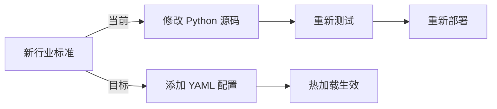
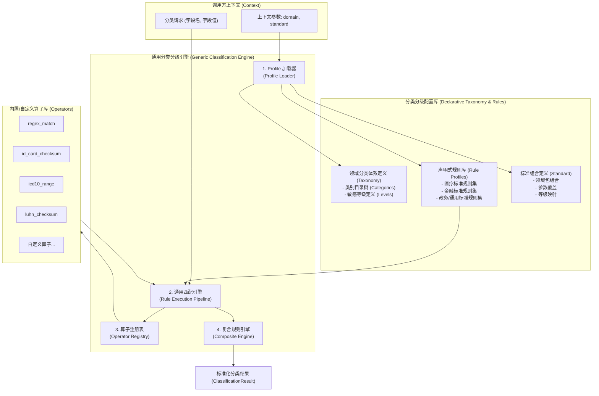
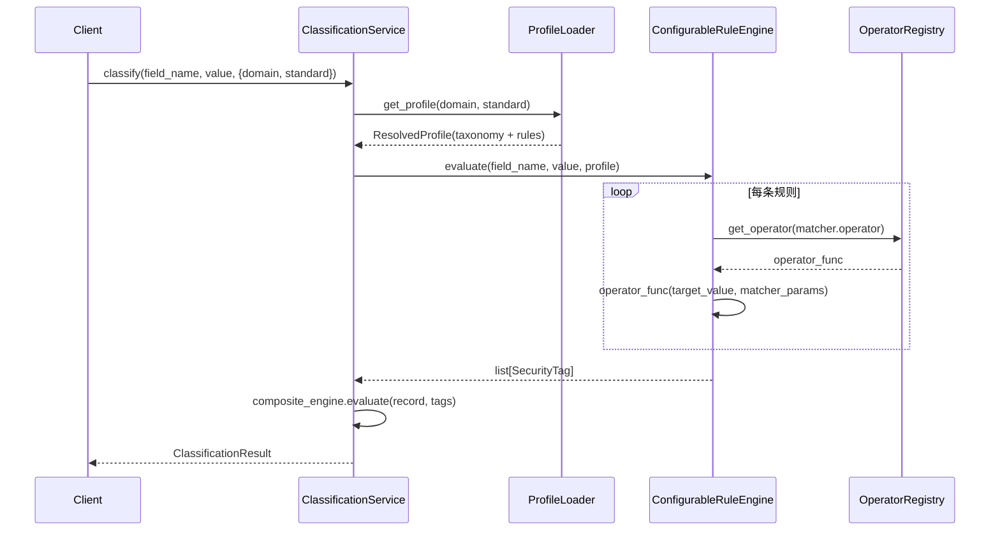
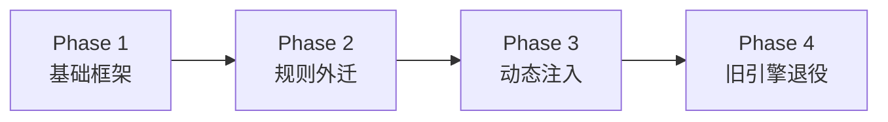
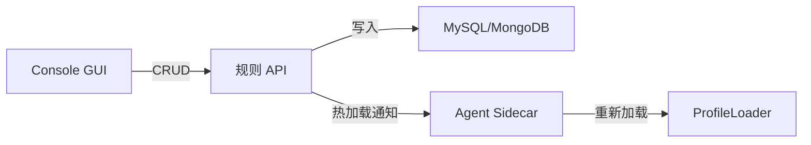

# 动态分类分级标准适配架构设计

本文档描述将 `privacy-local-agent` 中硬编码的数据分类分级逻辑改造为支持多领域、多行业标准通用适配的架构设计。核心设计思想为 **"标准配置化、规则声明化、算子插件化、执行上下文动态化"**，实现代码（引擎逻辑）与数据（行业分类标准、分级矩阵、匹配规则）的完全解耦。

## 目录

1. [概述与设计目标](#1-概述与设计目标)
2. [现状问题分析](#2-现状问题分析)
3. [设计原则](#3-设计原则)
4. [总体架构](#4-总体架构)
5. [数据模型设计：分类体系配置化](#5-数据模型设计分类体系配置化)
6. [声明式规则 Profile](#6-声明式规则-profile)
7. [算子插件化与注册表](#7-算子插件化与注册表)
8. [通用规则执行引擎](#8-通用规则执行引擎)
9. [Profile 管理与上下文调度](#9-profile-管理与上下文调度)
10. [向后兼容与迁移策略](#10-向后兼容与迁移策略)
11. [配置库目录结构](#11-配置库目录结构)
12. [API 接口变更](#12-api-接口变更)
13. [可观测性](#13-可观测性)
14. [测试策略](#14-测试策略)
15. [部署与运维](#15-部署与运维)
16. [扩展场景示例](#16-扩展场景示例)
17. [术语表](#17-术语表)

## 1. 概述与设计目标

### 1.1 背景

当前 `privacy-local-agent` 的数据分类分级模块已实现三层漏斗架构（规则引擎 → Small-NER → LLM），但规则定义、分类体系、合规模板均以 Python 代码硬编码方式实现。当需要接入新行业（如车联网、政务、教育）或新标准（如 GB/T 43697-2024）时，必须修改引擎源码并重新部署，无法满足"一套引擎适配多领域多标准"的产品化需求。

### 1.2 设计目标

| 目标 | 描述 |
|---|---|
| 零代码接入新标准 | 新增行业/标准仅需添加 YAML 配置文件，无需修改 Python 引擎代码 |
| 算子高度复用 | 通用算子（regex、身份证校验、Luhn 等）注册一次，跨领域复用 |
| 分类体系可配置 | 等级定义（L1~L5 / C1~C4 / 1~4级）和分类目录树均从配置加载 |
| 运行时动态切换 | 请求级参数指定 domain/standard，引擎按需加载对应规则集 |
| 热加载更新 | 规则配置支持运行时重载，无需重启服务 |
| 向后兼容 | 现有 REST/gRPC 接口契约不变，旧参数（template）自动映射 |
| 多租户支持 | 不同命名空间可绑定不同的领域/标准组合 |

## 2. 现状问题分析

### 2.1 硬编码清单

| 硬编码位置 | 文件 | 问题描述 |
|---|---|---|
| 规则引擎 evaluate() | `classification_rule_engine.py` L328-599 | 基因组/PII/ICD-10/文件格式规则以 if-else 硬编码 |
| 模板字段规则 | `classification_rule_engine.py` L601-757 | JR/T 0197、GB/T 35273、GDPR、DB51 模板规则硬编码 |
| 模板参数字典 | `classification_utils.py` L286-366 | TEMPLATES 字典写死在代码中 |
| 复合规则默认值 | `classification_composite.py` L83-120 | DEFAULT_RULES 硬编码 |
| 参数默认值 | `classification_models.py` L577-621 | ICD-10 区间、基因组关键词等写死为 Field default |
| 等级枚举 | `classification_models.py` L33-47 | SensitivityLevel 固定为 L1~L5 |
| 业务分类枚举 | `classification_models.py` L63-77 | BusinessCategory 固定为 DB51 五大类 |

### 2.2 核心矛盾



## 3. 设计原则

| 原则 | 说明 |
|---|---|
| 引擎与规则分离 | 引擎只做"解释执行"，不包含任何领域知识 |
| 领域包可组合 | 一个标准 = N 个领域包 + 参数覆盖 |
| 算子无状态 | 每个算子是纯函数 `(value, params) → bool`，无副作用 |
| 配置即代码 | YAML 规则文件可纳入版本控制、Code Review、CI 校验 |
| 渐进式迁移 | 旧 DefaultRuleEngine 保留为 fallback，新旧引擎可并行运行 |
| 约定优于配置 | 未指定 domain/standard 时使用默认领域包，行为与当前一致 |

## 4. 总体架构

### 4.1 架构总览



### 4.2 核心组件职责

| 组件 | 职责 | 对应新模块 |
|---|---|---|
| Profile Loader | 根据 domain/standard 加载并缓存规则配置 | `dynclassification/profile_loader.py` |
| Rule Execution Pipeline | 遍历声明式规则列表，调度算子执行匹配 | `dynclassification/engine.py` |
| Operator Registry | 管理所有已注册的匹配算子 | `dynclassification/operator_registry.py` |
| Composite Engine | 记录级字段组合规则后处理 | `dynclassification/composite.py` |
| Taxonomy Registry | 管理动态分类体系（等级 + 类别树） | `dynclassification/models.py` |

### 4.3 数据流



## 5. 数据模型设计：分类体系配置化

### 5.1 设计动机

原有 `SensitivityLevel` 和 `BusinessCategory` 为 Python Enum 硬编码，无法适配不同行业的分级体系：

| 行业 | 分级体系 | 示例 |
|---|---|---|
| 医疗（DB51/T 2989） | L1~L5（5 级） | L4=敏感病种 |
| 金融（JR/T 0197） | C1~C4（4 级） | C4=第四级敏感 |
| 国标（GB/T 43697-2024） | 1~4 级 | 3级=敏感数据 |
| GDPR | Personal / Special Category | 二分法 |

### 5.2 动态分类体系模型

```python
# privacy_local_agent/dynclassification/models.py

from pydantic import BaseModel, Field
from typing import Optional


class SensitivityLevelDef(BaseModel):
    """动态敏感度等级定义。

    替代硬编码的 SensitivityLevel 枚举，支持任意等级体系。
    """
    id: str                    # 级别唯一标识，如 "L1", "C4", "LEVEL_3"
    name: str                  # 显示名称，如 "高敏感数据"
    rank: int                  # 排序权重（用于 max_level 比较逻辑）
    description: Optional[str] = None  # 等级说明


class CategoryDef(BaseModel):
    """动态分类类别定义。

    替代硬编码的 BusinessCategory 枚举，支持多级分类树。
    """
    id: str                    # 分类 ID，如 "PERSONAL_BASIC", "FINANCIAL_ACCOUNT"
    name: str                  # 分类名称，如 "个人基本信息"
    parent_id: Optional[str] = None  # 父分类 ID，支持多级树结构
    description: Optional[str] = None


class DomainTaxonomy(BaseModel):
    """领域分类体系完整定义。

    一个 Taxonomy 对应一个行业标准的分类分级元数据。
    """
    domain: str                # 领域标识，如 "healthcare", "finance", "gov"
    standard_id: str           # 标准编号，如 "DB51_T_2989", "JR_T_0197"
    version: str = "1.0.0"    # 体系版本号
    description: Optional[str] = None
    levels: dict[str, SensitivityLevelDef] = Field(default_factory=dict)
    categories: dict[str, CategoryDef] = Field(default_factory=dict)
    default_level: str = "L3"  # 无规则命中时的默认等级 ID

    def max_level(self, *level_ids: str) -> str:
        """返回等级集合中 rank 最高的等级 ID。"""
        if not level_ids:
            return self.default_level
        return max(level_ids, key=lambda lid: self.levels[lid].rank)

    def get_category_path(self, category_id: str) -> list[str]:
        """获取分类的完整路径（从根到叶）。"""
        path = []
        current = category_id
        while current and current in self.categories:
            path.append(current)
            current = self.categories[current].parent_id
        return list(reversed(path))
```

### 5.3 内置默认 Taxonomy（向后兼容）

```yaml
# rules/taxonomies/default.yaml
domain: "default"
standard_id: "INTERNAL"
version: "1.0.0"
description: "内置默认分类体系（兼容现有 L1~L5 + DB51 业务分类）"

levels:
  L1: {name: "公开数据", rank: 1, description: "无隐私风险"}
  L2: {name: "内部数据", rank: 2, description: "低敏感度"}
  L3: {name: "敏感数据", rank: 3, description: "中敏感度"}
  L4: {name: "高敏感数据", rank: 4, description: "需重点保护"}
  L5: {name: "极敏感数据", rank: 5, description: "最高级别保护"}

categories:
  PERSONAL_BASIC: {name: "个人基本信息"}
  MEDICAL_TREATMENT: {name: "诊疗信息"}
  FEE_BILLING: {name: "费用信息"}
  PUBLIC_HEALTH: {name: "公共卫生信息"}
  MANAGEMENT: {name: "管理信息"}
  GENOMIC: {name: "基因组信息", parent_id: "MEDICAL_TREATMENT"}
  FINANCIAL: {name: "金融信息"}

default_level: "L3"
```

```yaml
# rules/taxonomies/finance_jrt0197.yaml
domain: "finance"
standard_id: "JR_T_0197"
version: "1.0.0"
description: "JR/T 0197-2020 金融数据安全分级指南"

levels:
  C1: {name: "第一级（不敏感）", rank: 1, description: "公开可获取的金融数据"}
  C2: {name: "第二级（低敏感）", rank: 2, description: "内部使用的金融数据"}
  C3: {name: "第三级（敏感）", rank: 3, description: "涉及个人金融信息"}
  C4: {name: "第四级（高敏感）", rank: 4, description: "涉及核心金融账户"}

categories:
  FINANCIAL_ACCOUNT: {name: "金融账户信息"}
  FINANCIAL_TRANSACTION: {name: "金融交易信息"}
  PERSONAL_FINANCIAL: {name: "个人金融信息"}
  INSTITUTION_INTERNAL: {name: "机构内部信息"}

default_level: "C3"
```

## 6. 声明式规则 Profile

### 6.1 规则模型定义

```python
# privacy_local_agent/dynclassification/rule_schema.py

from pydantic import BaseModel, Field
from typing import Any, Optional


class MatcherDef(BaseModel):
    """单个匹配器定义。

    描述对字段名或字段值执行何种算子匹配。
    """
    target: str                # 匹配目标: "field_name" | "field_value"
    operator: str              # 算子名称: "regex" | "id_card_checksum" | "icd10_range" 等
    params: dict[str, Any] = Field(default_factory=dict)  # 算子参数（如 pattern、intervals）


class RuleDef(BaseModel):
    """单条声明式规则定义。"""
    id: str                    # 规则唯一标识
    name: str = ""             # 规则名称（人类可读）
    category: str              # 命中后的分类类别 ID
    level: str                 # 命中后的敏感度等级 ID
    matchers: list[MatcherDef] = Field(default_factory=list)
    match_logic: str = "AND"   # 多匹配器逻辑: "AND"(全部命中) | "OR"(任一命中)
    priority: int = 0          # 优先级（数值越大越先执行）
    enabled: bool = True       # 是否启用
    tags: dict[str, str] = Field(default_factory=dict)  # 扩展标签


class DowngradeRuleDef(BaseModel):
    """降级规则定义。"""
    id: str
    keywords: list[str]
    level: str                 # 降级目标等级
    category: str
    match_target: str = "field_name"  # 匹配目标


class CompositeRuleDef(BaseModel):
    """复合规则定义（记录级）。"""
    id: str
    name: str = ""
    field_patterns: list[str]  # 字段名正则列表
    min_matches: int = 1       # 最低匹配数
    target_level: str          # 升级目标等级
    category: str


class RuleProfile(BaseModel):
    """规则 Profile 完整定义（一个领域包）。"""
    domain: str                # 所属领域
    version: str = "1.0.0"
    description: str = ""
    rules: list[RuleDef] = Field(default_factory=list)
    downgrade_rules: list[DowngradeRuleDef] = Field(default_factory=list)
    composite_rules: list[CompositeRuleDef] = Field(default_factory=list)


class StandardDef(BaseModel):
    """标准组合定义。

    一个标准 = 多个领域包组合 + 参数覆盖 + 等级映射。
    """
    standard_id: str           # 标准标识
    description: str = ""
    taxonomy: str              # 引用的 taxonomy 文件名
    domains: list[str] = Field(default_factory=list)  # 组合的领域包列表
    overrides: dict[str, Any] = Field(default_factory=dict)  # 参数覆盖
    rule_overrides: dict[str, dict[str, Any]] = Field(default_factory=dict)  # 规则级覆盖
    extra_rules: list[RuleDef] = Field(default_factory=list)  # 追加规则
```

### 6.2 医疗领域规则 Profile 示例

```yaml
# rules/domains/medical.yaml
domain: "medical"
version: "1.0.0"
description: "医疗健康领域分类规则（含基因组、ICD-10、敏感病种）"

rules:
  # --- 基因组字段名规则 ---
  - id: "RULE_MED_G_001"
    name: "BRCA/TP53 基因指标"
    category: "GENOMIC"
    level: "L5"
    matchers:
      - target: "field_name"
        operator: "keyword_contains"
        params:
          keywords: ["brca1", "brca2", "tp53"]

  - id: "RULE_MED_G_002"
    name: "基因组变异指标"
    category: "GENOMIC"
    level: "L5"
    matchers:
      - target: "field_name"
        operator: "keyword_contains"
        params:
          keywords: ["snp", "cnv", "genome", "genomic"]
      - target: "field_value"
        operator: "regex"
        params:
          pattern: "rs\\d+"
    match_logic: "OR"

  - id: "RULE_MED_G_003"
    name: "基因组文件格式"
    category: "GENOMIC"
    level: "L5"
    matchers:
      - target: "field_name"
        operator: "keyword_contains"
        params:
          keywords: ["bam", "vcf", "fastq"]

  # --- 敏感病种字段名规则 ---
  - id: "RULE_MED_DISEASE_001"
    name: "敏感病种字段"
    category: "MEDICAL_TREATMENT"
    level: "L4"
    matchers:
      - target: "field_name"
        operator: "keyword_contains"
        params:
          keywords: ["hiv", "aids", "std", "syphilis", "gonorrhea",
                     "psychiatric", "schizophrenia"]

  # --- ICD-10 值规则 ---
  - id: "RULE_MED_ICD10"
    name: "ICD-10 医疗编码"
    category: "MEDICAL_TREATMENT"
    level: "L3"
    matchers:
      - target: "field_value"
        operator: "icd10_range"
        params:
          default_level: "L3"
          upgrade_level: "L4"
          intervals:
            - {start: "B20", end: "B24", category: "MEDICAL_ICD10_HIV"}
            - {start: "A50", end: "A53", category: "MEDICAL_ICD10_STD"}
            - {start: "A54", end: "A64", category: "MEDICAL_ICD10_STD"}
            - {start: "F20", end: "F29", category: "MEDICAL_ICD10_PSYCHIATRIC"}
            - {start: "C00", end: "C97", category: "MEDICAL_ICD10_CANCER"}

  # --- 基因组文件内容检测 ---
  - id: "RULE_MED_FILE_BAM"
    name: "BAM 文件头检测"
    category: "GENOMIC"
    level: "L5"
    matchers:
      - target: "field_value"
        operator: "prefix_match"
        params:
          prefixes: ["BAM\u0001", "@SQ"]

  - id: "RULE_MED_FILE_VCF"
    name: "VCF 文件头检测"
    category: "GENOMIC"
    level: "L5"
    matchers:
      - target: "field_value"
        operator: "prefix_match"
        params:
          prefixes: ["##fileformat=VCF"]

  - id: "RULE_MED_SEQ"
    name: "碱基序列检测"
    category: "GENOMIC"
    level: "L5"
    matchers:
      - target: "field_value"
        operator: "regex"
        params:
          pattern: "[ATCGNatcgn]{50,}"

downgrade_rules:
  - id: "RULE_DOWN_PUBLIC"
    keywords: ["public_report", "annual_summary", "科普"]
    level: "L1"
    category: "PUBLIC_REPORT"
  - id: "RULE_DOWN_OPS"
    keywords: ["turnover_rate", "device_usage", "inventory"]
    level: "L2"
    category: "OPERATIONAL_STAT"

composite_rules:
  - id: "COMP_MED_001"
    name: "医疗基因组合"
    field_patterns: ["diagnosis|disease|illness", "gene|genomic|mutation|brca|tp53"]
    min_matches: 2
    target_level: "L5"
    category: "COMPOSITE_MEDICAL_GENOMIC"
```

### 6.3 金融领域规则 Profile 示例

```yaml
# rules/domains/finance.yaml
domain: "finance"
version: "1.0.0"
description: "金融行业分类规则 (JR/T 0197-2020)"

rules:
  - id: "RULE_FIN_ACCOUNT"
    name: "金融账户字段"
    category: "FINANCIAL_ACCOUNT"
    level: "C4"
    matchers:
      - target: "field_name"
        operator: "keyword_contains"
        params:
          keywords: ["bankcard", "cardno", "credit", "transaction",
                     "asset", "balance", "account", "bank_card"]

  - id: "RULE_FIN_CARD_VALUE"
    name: "银行卡号值校验"
    category: "FINANCIAL_ACCOUNT"
    level: "C4"
    matchers:
      - target: "field_value"
        operator: "luhn_checksum"
        params:
          min_length: 16
          max_length: 19

composite_rules:
  - id: "COMP_FIN_001"
    name: "金融账户组合"
    field_patterns: ["bank_card|bankcard|card_no|account|credit|transaction"]
    min_matches: 1
    target_level: "C4"
    category: "COMPOSITE_FINANCE_COMBO"
```

### 6.4 通用 PII 领域规则 Profile 示例

```yaml
# rules/domains/general-pii.yaml
domain: "general-pii"
version: "1.0.0"
description: "通用个人信息规则 (GB/T 35273)"

rules:
  - id: "RULE_PII_IDCARD"
    name: "中国大陆身份证"
    category: "PERSONAL_BASIC"
    level: "L3"
    matchers:
      - target: "field_value"
        operator: "id_card_checksum"
        params: {}

  - id: "RULE_PII_PHONE"
    name: "中国大陆手机号"
    category: "PERSONAL_BASIC"
    level: "L3"
    matchers:
      - target: "field_value"
        operator: "regex"
        params:
          pattern: "^1[3-9]\\d{9}$"

  - id: "RULE_PII_MEDICAL_CARD"
    name: "医保卡号"
    category: "PERSONAL_BASIC"
    level: "L3"
    matchers:
      - target: "field_value"
        operator: "medical_card_checksum"
        params: {}

  - id: "RULE_PII_CONTACT"
    name: "联系方式/位置字段"
    category: "PERSONAL_BASIC"
    level: "L3"
    matchers:
      - target: "field_name"
        operator: "keyword_contains"
        params:
          keywords: ["email", "address", "location", "轨迹"]

  - id: "RULE_PII_BIOMETRIC"
    name: "生物识别信息"
    category: "PERSONAL_BASIC"
    level: "L3"
    matchers:
      - target: "field_name"
        operator: "keyword_contains"
        params:
          keywords: ["fingerprint", "voiceprint", "palmprint",
                     "iris", "face", "biometric"]

composite_rules:
  - id: "COMP_PII_001"
    name: "高敏感个人信息组合"
    field_patterns: ["^name$", "id_card|idcard|identity", "mobile|phone|cell"]
    min_matches: 3
    target_level: "L5"
    category: "COMPOSITE_PII_COMBO"
```

### 6.5 标准组合定义示例

```yaml
# rules/standards/sc_health_db51.yaml
standard_id: "sc_health_db51"
description: "DB51/T 2989—2023 四川省健康医疗大数据应用指南"
taxonomy: "default"  # 使用 L1~L5 体系
domains:
  - "general-pii"
  - "medical"
overrides:
  default_level: "L3"
rule_overrides:
  # 四川省指南将金融账户定为 L3（而非通用金融标准的 L4/C4）
  RULE_FIN_ACCOUNT:
    level: "L3"
extra_rules:
  - id: "RULE_DB51_MINOR"
    name: "未成年人信息"
    category: "PERSONAL_BASIC"
    level: "L3"
    matchers:
      - target: "field_name"
        operator: "keyword_contains"
        params:
          keywords: ["minor", "child", "未成年", "儿童"]
  - id: "RULE_DB51_GENETIC_EXT"
    name: "四川指南遗传信息扩展"
    category: "GENOMIC"
    level: "L5"
    matchers:
      - target: "field_name"
        operator: "keyword_contains"
        params:
          keywords: ["genetic", "chromosome", "embryo", "thalassemia",
                     "proteomics", "metabolomics", "omics"]
```

```yaml
# rules/standards/jrt0197.yaml
standard_id: "jrt0197"
description: "JR/T 0197-2020 金融数据安全分级指南"
taxonomy: "finance_jrt0197"  # 使用 C1~C4 体系
domains:
  - "general-pii"
  - "finance"
overrides:
  default_level: "C3"
```

## 7. 算子插件化与注册表

### 7.1 算子签名与注册表

```python
# privacy_local_agent/dynclassification/operator_registry.py

from typing import Any, Callable, Protocol


class MatcherOperator(Protocol):
    """匹配算子协议。

    所有算子必须实现此签名：接收待匹配值和参数字典，返回是否命中。
    算子必须是无状态纯函数，不持有实例变量。
    """
    def __call__(self, value: Any, params: dict[str, Any]) -> bool: ...


class OperatorRegistry:
    """算子注册表（单例）。

    管理所有已注册的匹配算子，支持装饰器注册和运行时动态注册。
    """

    _operators: dict[str, MatcherOperator] = {}

    @classmethod
    def register(cls, name: str):
        """算子注册装饰器。"""
        def decorator(func: MatcherOperator) -> MatcherOperator:
            cls._operators[name] = func
            return func
        return decorator

    @classmethod
    def register_func(cls, name: str, func: MatcherOperator) -> None:
        """运行时动态注册算子（支持插件热加载）。"""
        cls._operators[name] = func

    @classmethod
    def get(cls, name: str) -> MatcherOperator:
        """获取已注册算子。"""
        if name not in cls._operators:
            raise KeyError(f"未找到名为 '{name}' 的匹配算子，"
                          f"可用算子: {list(cls._operators.keys())}")
        return cls._operators[name]

    @classmethod
    def list_operators(cls) -> list[str]:
        """列出所有已注册算子名称。"""
        return list(cls._operators.keys())
```

### 7.2 内置算子实现

```python
# privacy_local_agent/dynclassification/operators.py

import re
from typing import Any
from .operator_registry import OperatorRegistry


@OperatorRegistry.register("regex")
def regex_matcher(value: Any, params: dict[str, Any]) -> bool:
    """正则表达式匹配算子。"""
    if not isinstance(value, str) or not value:
        return False
    pattern = params.get("pattern", "")
    return bool(re.search(pattern, value))


@OperatorRegistry.register("keyword_contains")
def keyword_contains_matcher(value: Any, params: dict[str, Any]) -> bool:
    """关键词子串包含匹配算子。

    将输入值归一化（小写 + 去下划线/空格）后，
    检查是否包含 keywords 列表中的任一关键词。
    """
    norm = str(value).lower().replace("_", "").replace(" ", "")
    keywords = params.get("keywords", [])
    return any(kw in norm for kw in keywords)


@OperatorRegistry.register("prefix_match")
def prefix_matcher(value: Any, params: dict[str, Any]) -> bool:
    """前缀匹配算子。"""
    if not isinstance(value, str):
        return False
    prefixes = params.get("prefixes", [])
    return any(value.startswith(p) for p in prefixes)


@OperatorRegistry.register("id_card_checksum")
def id_card_checksum_matcher(value: Any, params: dict[str, Any]) -> bool:
    """中国大陆 18 位身份证校验算子（GB 11643-1999）。"""
    # 复用现有 classification_rule_engine.py 中的校验逻辑
    from .classification_rule_engine import _id_card_checksum
    return _id_card_checksum(str(value) if value else "")


@OperatorRegistry.register("medical_card_checksum")
def medical_card_checksum_matcher(value: Any, params: dict[str, Any]) -> bool:
    """上海医保卡号校验算子。"""
    from .classification_rule_engine import _shanghai_medical_card_checksum
    return _shanghai_medical_card_checksum(str(value) if value else "")


@OperatorRegistry.register("icd10_range")
def icd10_range_matcher(value: Any, params: dict[str, Any]) -> bool:
    """ICD-10 编码格式校验算子（仅判断是否为合法 ICD-10 编码）。"""
    from .classification_rule_engine import _normalize_icd10
    return _normalize_icd10(str(value) if value else "") is not None


@OperatorRegistry.register("luhn_checksum")
def luhn_checksum_matcher(value: Any, params: dict[str, Any]) -> bool:
    """Luhn 算法校验算子（银行卡号通用校验）。"""
    s = str(value).strip() if value else ""
    min_len = params.get("min_length", 13)
    max_len = params.get("max_length", 19)
    if not s.isdigit() or not (min_len <= len(s) <= max_len):
        return False
    digits = [int(d) for d in s]
    odd_sum = sum(digits[-1::-2])
    even_sum = sum(sum(divmod(2 * d, 10)) for d in digits[-2::-2])
    return (odd_sum + even_sum) % 10 == 0
```

### 7.3 算子扩展机制

新增算子只需两步：

1. 实现符合 `MatcherOperator` 签名的函数
2. 使用 `@OperatorRegistry.register("算子名")` 注册

```python
# 示例：自定义车牌号算子
@OperatorRegistry.register("plate_number")
def plate_number_matcher(value: Any, params: dict[str, Any]) -> bool:
    """中国车牌号匹配算子。"""
    import re
    pattern = r"^[京津沪渝冀豫云辽黑湘皖鲁新苏浙赣鄂桂甘晋蒙陕吉闽贵粤川青藏琼宁][A-Z][A-Z0-9]{5,6}$"
    return bool(re.match(pattern, str(value))) if value else False
```

## 8. 通用规则执行引擎

### 8.1 ConfigurableRuleEngine

```python
# privacy_local_agent/dynclassification/engine.py

from typing import Any, Optional
from .models import DomainTaxonomy, SecurityTag
from .rule_schema import RuleProfile, RuleDef, MatcherDef
from .operator_registry import OperatorRegistry


class ConfigurableRuleEngine:
    """通用可配置规则引擎。

    替代 DefaultRuleEngine 的硬编码逻辑，根据声明式 RuleProfile
    动态执行规则匹配。引擎本身不包含任何领域知识。
    """

    def __init__(self, taxonomy: DomainTaxonomy, profiles: list[RuleProfile]):
        self.taxonomy = taxonomy
        # 合并所有领域包的规则，按 priority 降序排列
        self.rules = self._merge_rules(profiles)
        self.downgrade_rules = self._merge_downgrade_rules(profiles)

    def _merge_rules(self, profiles: list[RuleProfile]) -> list[RuleDef]:
        """合并多个领域包的规则列表。"""
        all_rules = []
        for profile in profiles:
            all_rules.extend(r for r in profile.rules if r.enabled)
        return sorted(all_rules, key=lambda r: r.priority, reverse=True)

    def evaluate(
        self, field_name: str, value: Any, context: dict[str, Any] | None = None
    ) -> list[SecurityTag]:
        """评估单个字段，返回命中的安全标签列表。

        执行流程：
        1. 遍历所有规则
        2. 对每条规则的 matchers 列表执行算子匹配
        3. 根据 match_logic (AND/OR) 判断是否命中
        4. 命中则生成 SecurityTag
        5. 执行降级规则
        6. 去重返回
        """
        tags: list[SecurityTag] = []
        str_value = str(value) if value is not None else ""

        for rule in self.rules:
            if self._evaluate_rule(rule, field_name, str_value):
                tags.append(SecurityTag(
                    level=self._resolve_level(rule.level),
                    category=rule.category,
                    source_engine="RULE",
                    rule_id=rule.id,
                ))

        # 执行降级规则
        tags.extend(self._evaluate_downgrade(field_name))

        return self._unique_tags(tags)

    def _evaluate_rule(self, rule: RuleDef, field_name: str, str_value: str) -> bool:
        """评估单条规则的所有匹配器。"""
        if not rule.matchers:
            return False

        results = []
        for matcher in rule.matchers:
            hit = self._execute_matcher(matcher, field_name, str_value)
            results.append(hit)

        if rule.match_logic == "OR":
            return any(results)
        return all(results)  # 默认 AND

    def _execute_matcher(self, matcher: MatcherDef, field_name: str, str_value: str) -> bool:
        """执行单个匹配器。"""
        op_func = OperatorRegistry.get(matcher.operator)
        target_value = field_name if matcher.target == "field_name" else str_value
        if target_value is None or target_value == "":
            return False
        return op_func(target_value, matcher.params)

    def _resolve_level(self, level_id: str):
        """将等级 ID 解析为 SensitivityLevel（兼容现有枚举）。"""
        from .classification_models import SensitivityLevel
        try:
            return SensitivityLevel(level_id)
        except ValueError:
            # 对于非标准等级（如 C4），返回字符串包装
            return level_id

    def _evaluate_downgrade(self, field_name: str) -> list[SecurityTag]:
        """执行降级规则。"""
        tags = []
        norm_name = field_name.lower().replace("_", "").replace(" ", "")
        for rule in self.downgrade_rules:
            if any(kw in norm_name for kw in rule.keywords):
                tags.append(SecurityTag(
                    level=self._resolve_level(rule.level),
                    category=rule.category,
                    source_engine="RULE",
                    rule_id=rule.id,
                ))
        return tags

    def _unique_tags(self, tags: list[SecurityTag]) -> list[SecurityTag]:
        """按 (level, category) 去重。"""
        seen = set()
        result = []
        for tag in tags:
            key = (str(tag.level), tag.category)
            if key not in seen:
                seen.add(key)
                result.append(tag)
        return result
```

### 8.2 ICD-10 特殊处理

ICD-10 规则需要动态返回等级（一般编码 L3，敏感区间 L4），通过 `icd10_range` 算子的扩展实现：

```python
@OperatorRegistry.register("icd10_range")
def icd10_range_matcher(value: Any, params: dict[str, Any]) -> bool:
    """ICD-10 编码区间判定算子。

    返回值仅为 bool（是否命中），但通过 params["_result"] 回写详细结果，
    供引擎读取动态等级和类别。
    """
    from .classification_rule_engine import _normalize_icd10, _in_icd10_interval
    icd = _normalize_icd10(str(value) if value else "")
    if not icd:
        return False

    intervals = params.get("intervals", [])
    for interval in intervals:
        if _in_icd10_interval(icd, interval["start"], interval["end"]):
            # 命中敏感区间：回写升级信息
            params["_hit_level"] = params.get("upgrade_level", "L4")
            params["_hit_category"] = interval.get("category", "")
            return True

    # 未命中敏感区间：使用默认等级
    params["_hit_level"] = params.get("default_level", "L3")
    params["_hit_category"] = "MEDICAL_ICD10_GENERAL"
    return True
```

## 9. Profile 管理与上下文调度

### 9.1 ProfileLoader

```python
# privacy_local_agent/dynclassification/profile_loader.py

from pathlib import Path
from typing import Optional
import yaml

from .models import DomainTaxonomy
from .rule_schema import RuleProfile, StandardDef
from .engine import ConfigurableRuleEngine


class ProfileLoader:
    """Profile 加载器与缓存管理器。

    负责从 YAML 文件加载 Taxonomy、RuleProfile、StandardDef，
    并根据 domain/standard 组合构建 ConfigurableRuleEngine 实例。
    支持热加载（文件变更检测）和 LRU 缓存。
    """

    def __init__(self, rules_dir: str | Path = "rules"):
        self.rules_dir = Path(rules_dir)
        self._taxonomy_cache: dict[str, DomainTaxonomy] = {}
        self._profile_cache: dict[str, RuleProfile] = {}
        self._standard_cache: dict[str, StandardDef] = {}
        self._engine_cache: dict[str, ConfigurableRuleEngine] = {}

    def load_taxonomy(self, name: str) -> DomainTaxonomy:
        """加载分类体系定义。"""
        if name not in self._taxonomy_cache:
            path = self.rules_dir / "taxonomies" / f"{name}.yaml"
            data = yaml.safe_load(path.read_text(encoding="utf-8"))
            self._taxonomy_cache[name] = DomainTaxonomy.model_validate(data)
        return self._taxonomy_cache[name]

    def load_profile(self, domain: str) -> RuleProfile:
        """加载领域规则 Profile。"""
        if domain not in self._profile_cache:
            path = self.rules_dir / "domains" / f"{domain}.yaml"
            data = yaml.safe_load(path.read_text(encoding="utf-8"))
            self._profile_cache[domain] = RuleProfile.model_validate(data)
        return self._profile_cache[domain]

    def load_standard(self, standard_id: str) -> StandardDef:
        """加载标准组合定义。"""
        if standard_id not in self._standard_cache:
            path = self.rules_dir / "standards" / f"{standard_id}.yaml"
            data = yaml.safe_load(path.read_text(encoding="utf-8"))
            self._standard_cache[standard_id] = StandardDef.model_validate(data)
        return self._standard_cache[standard_id]

    def get_engine(
        self,
        domain: Optional[str] = None,
        standard: Optional[str] = None,
    ) -> ConfigurableRuleEngine:
        """获取或构建规则引擎实例。"""
        cache_key = f"{domain or 'default'}:{standard or 'default'}"
        if cache_key not in self._engine_cache:
            engine = self._build_engine(domain, standard)
            self._engine_cache[cache_key] = engine
        return self._engine_cache[cache_key]

    def _build_engine(self, domain: Optional[str], standard: Optional[str]) -> ConfigurableRuleEngine:
        """根据 domain/standard 构建引擎。"""
        if standard:
            std_def = self.load_standard(standard)
            taxonomy = self.load_taxonomy(std_def.taxonomy)
            profiles = [self.load_profile(d) for d in std_def.domains]
            # 应用 extra_rules
            if std_def.extra_rules:
                extra_profile = RuleProfile(
                    domain=f"{standard}_extra",
                    rules=std_def.extra_rules,
                )
                profiles.append(extra_profile)
        elif domain:
            taxonomy = self.load_taxonomy("default")
            profiles = [self.load_profile(domain)]
        else:
            # 默认：加载所有通用领域包
            taxonomy = self.load_taxonomy("default")
            profiles = [
                self.load_profile("general-pii"),
                self.load_profile("medical"),
            ]
        return ConfigurableRuleEngine(taxonomy, profiles)

    def invalidate_cache(self) -> None:
        """清除所有缓存（热加载时调用）。"""
        self._taxonomy_cache.clear()
        self._profile_cache.clear()
        self._standard_cache.clear()
        self._engine_cache.clear()
```

### 9.2 上下文调度集成

```python
# ClassificationService 改造（向后兼容）

class ClassificationService:
    """数据分类统一服务类（增强版）。"""

    def __init__(self, profile_path=None, rules_dir="rules"):
        self.profile_loader = ProfileLoader(rules_dir=rules_dir)
        # 保留旧 ClassificationAPI 作为 fallback
        self._legacy_api = ClassificationAPI(profile_path=profile_path)

    def classify_field(self, field_name, value, params=None):
        params = params or {}
        domain = params.pop("domain", None)
        standard = params.pop("standard", None)

        # 新路径：使用声明式引擎
        if domain or standard:
            engine = self.profile_loader.get_engine(domain, standard)
            tags = engine.evaluate(field_name, value)
            return self._build_result(tags)

        # 旧路径：兼容现有 template 参数
        template = params.get("template")
        if template:
            # 将旧 template 名映射到新 standard
            standard_mapping = {
                "gbt35273": "gbt35273",
                "gdpr": "gdpr",
                "jrt0197": "jrt0197",
                "sc_health_db51": "sc_health_db51",
            }
            mapped = standard_mapping.get(template)
            if mapped:
                engine = self.profile_loader.get_engine(standard=mapped)
                tags = engine.evaluate(field_name, value)
                return self._build_result(tags)

        # Fallback：使用旧引擎
        return self._legacy_api.classify_field(field_name, value, params)
```

## 10. 向后兼容与迁移策略

### 10.1 兼容映射表

| 旧参数 | 新参数 | 映射方式 |
|---|---|---|
| `params.template = "sc_health_db51"` | `params.standard = "sc_health_db51"` | 自动映射 |
| `params.template = "jrt0197"` | `params.standard = "jrt0197"` | 自动映射 |
| `params.icd10_l4_intervals` | 规则 YAML 中 `icd10_range.params.intervals` | 配置迁移 |
| `params.genomic_keywords` | 规则 YAML 中 `keyword_contains.params.keywords` | 配置迁移 |
| `params.composite_rules` | 规则 YAML 中 `composite_rules` 或请求级传入 | 双通道 |
| `SensitivityLevel.L3` | `taxonomy.levels["L3"]` | 枚举保留 + 动态扩展 |

### 10.2 渐进式迁移阶段



| 阶段 | 内容 | 兼容性保证 |
|---|---|---|
| Phase 1 | 实现 `OperatorRegistry`、`ProfileLoader`、`ConfigurableRuleEngine`、`taxonomy.py`、`rule_schema.py` | 新模块独立，不影响现有代码 |
| Phase 2 | 将现有硬编码规则导出为 YAML 文件（medical/general-pii/finance），旧 template 映射到 standard | `DefaultRuleEngine` 保留为 fallback |
| Phase 3 | 支持请求级 `domain`/`standard`/`extra_rules` 动态注入；支持热加载 | 旧接口行为不变 |
| Phase 4 | 删除 `DefaultRuleEngine` 中的硬编码分支，全面切换到声明式引擎 | 大版本升级（v2.0） |

### 10.3 并行运行与影子对比

迁移期间支持新旧引擎并行，通过影子模式对比结果：

```python
# 影子模式：新旧引擎结果对比
if params.get("shadow_mode"):
    new_result = configurable_engine.evaluate(field_name, value)
    old_result = legacy_engine.evaluate(field_name, value, params)
    diff = compare_results(new_result, old_result)
    if diff:
        logger.warning("engine_shadow_diff", extra={"diff": diff})
```

## 11. 配置库目录结构

```text
rules/                              # 规则配置根目录
├── taxonomies/                     # 分类体系定义
│   ├── default.yaml                # 内置 L1~L5 + DB51 业务分类
│   ├── finance_jrt0197.yaml        # 金融 C1~C4 体系
│   └── gov_gb43697.yaml            # 国标 1~4 级体系
├── domains/                        # 领域规则包
│   ├── general-pii.yaml            # 通用 PII（身份证/手机号/地址）
│   ├── medical.yaml                # 医疗健康（基因组/ICD-10/敏感病种）
│   ├── finance.yaml                # 金融（银行卡/交易/资产）
│   ├── gov.yaml                    # 政务（公文/编制/统计）
│   └── iot-vehicle.yaml            # 车联网（轨迹/驾驶行为）
├── standards/                      # 标准组合定义
│   ├── sc_health_db51.yaml         # DB51/T 2989 四川健康医疗
│   ├── gbt35273.yaml               # GB/T 35273 个人信息安全
│   ├── gdpr.yaml                   # EU GDPR
│   ├── jrt0197.yaml                # JR/T 0197 金融数据
│   └── gb43697.yaml                # GB/T 43697-2024 数据安全技术
└── README.md                       # 配置编写指南
```

## 12. API 接口变更

### 12.1 请求参数扩展

现有接口契约不变，`params` 字典新增可选字段：

```json
{
  "field_name": "patient_brca1_status",
  "value": "阳性",
  "params": {
    "domain": "medical",
    "standard": "sc_health_db51",
    "extra_rules": [
      {
        "id": "CUSTOM_001",
        "name": "自定义规则",
        "category": "CUSTOM",
        "level": "L5",
        "matchers": [
          {
            "target": "field_name",
            "operator": "keyword_contains",
            "params": {"keywords": ["custom_marker"]}
          }
        ]
      }
    ]
  }
}
```

### 12.2 新增管理接口

| 接口 | 方法 | 说明 |
|---|---|---|
| `/v1/dynclassification/standards` | GET | 列出所有可用标准 |
| `/v1/dynclassification/domains` | GET | 列出所有可用领域包 |
| `/v1/dynclassification/operators` | GET | 列出所有已注册算子 |
| `/v1/dynclassification/profiles/reload` | POST | 热加载规则配置 |
| `/v1/dynclassification/validate` | POST | 校验规则 YAML 合法性 |

### 12.3 响应格式扩展

`SecurityTag` 新增可选字段：

```json
{
  "level": "L5",
  "category": "GENOMIC",
  "domain": "medical",
  "standard_id": "sc_health_db51",
  "rule_id": "RULE_MED_G_001",
  "source_engine": "RULE",
  "confidence": 1.0
}
```

## 13. 可观测性

### 13.1 Prometheus 指标

| 指标名 | 类型 | 标签 | 说明 |
|---|---|---|---|
| `classification_rule_hits_total` | Counter | `rule_id`, `domain`, `standard` | 规则命中计数 |
| `classification_operator_calls_total` | Counter | `operator`, `result` | 算子调用计数 |
| `classification_engine_load_duration_seconds` | Histogram | `domain`, `standard` | 引擎加载耗时 |
| `classification_profile_cache_size` | Gauge | — | 缓存的引擎实例数 |
| `classification_operator_errors_total` | Counter | `operator`, `rule_id` | 算子执行错误 |

### 13.2 结构化日志

```json
{
  "event": "rule_evaluation",
  "field_name": "brca1_status",
  "domain": "medical",
  "standard": "sc_health_db51",
  "rules_evaluated": 12,
  "rules_hit": 1,
  "hit_rule_ids": ["RULE_MED_G_001"],
  "duration_ms": 0.3
}
```

## 14. 测试策略

### 14.1 单元测试

| 测试对象 | 测试内容 |
|---|---|
| `OperatorRegistry` | 注册/获取/未注册异常/动态注册 |
| 各内置算子 | 正例/反例/边界值/None 输入 |
| `ConfigurableRuleEngine` | AND/OR 逻辑/空规则/降级规则/去重 |
| `ProfileLoader` | YAML 加载/缓存命中/文件不存在/热加载 |
| `DomainTaxonomy` | max_level/category_path/空输入 |

### 14.2 集成测试

| 场景 | 验证点 |
|---|---|
| 旧接口兼容 | `template="sc_health_db51"` 结果与新引擎一致 |
| 新标准接入 | 仅添加 YAML 后 `standard="jrt0197"` 正常工作 |
| 请求级规则注入 | `extra_rules` 生效且不影响缓存 |
| 影子模式 | 新旧引擎差异正确记录 |
| 热加载 | 修改 YAML 后 reload 接口生效 |

### 14.3 规则 YAML Schema 校验

CI 中使用 `pydantic` 模型校验所有 YAML 文件：

```bash
PYTHONPATH=. python -m privacy_local_agent.privacy.classification.validate_rules rules/
```

## 15. 部署与运维

### 15.1 配置挂载

```yaml
# Helm values 新增
classification:
  rulesDir: "/etc/privacy-agent/rules"
  hotReload: true
  reloadIntervalSeconds: 60

# ConfigMap 或 PVC 挂载规则目录
volumes:
  - name: classification-rules
    configMap:
      name: pla-classification-rules
```

### 15.2 热加载机制

| 方式 | 触发条件 | 说明 |
|---|---|---|
| 定时轮询 | `reloadIntervalSeconds` | 检测文件 mtime 变化 |
| API 触发 | `POST /v1/dynclassification/profiles/reload` | 管理员手动触发 |
| 文件监听 | inotify / watchdog | 生产环境推荐 |

### 15.3 规则版本管理

- 规则 YAML 文件纳入 Git 版本控制
- 每次变更通过 CI 校验（Schema + 单元测试）
- 支持 Git tag 标记规则集版本
- `AuditInfo.rule_set_version` 记录当前使用的规则版本

## 16. 扩展场景示例

### 16.1 接入车联网数据标准

无需修改任何 Python 代码，仅新增两个文件：

```yaml
# rules/domains/iot-vehicle.yaml
domain: "iot-vehicle"
version: "1.0.0"
description: "车联网数据分类规则"

rules:
  - id: "RULE_VIN"
    name: "车辆识别码 (VIN)"
    category: "VEHICLE_IDENTITY"
    level: "L3"
    matchers:
      - target: "field_value"
        operator: "regex"
        params:
          pattern: "^[A-HJ-NPR-Z0-9]{17}$"

  - id: "RULE_DRIVING_BEHAVIOR"
    name: "驾驶行为数据"
    category: "VEHICLE_BEHAVIOR"
    level: "L4"
    matchers:
      - target: "field_name"
        operator: "keyword_contains"
        params:
          keywords: ["speed", "acceleration", "brake", "steering", "trajectory"]

  - id: "RULE_PLATE"
    name: "车牌号"
    category: "VEHICLE_IDENTITY"
    level: "L3"
    matchers:
      - target: "field_value"
        operator: "plate_number"
        params: {}
```

```yaml
# rules/standards/iot_vehicle.yaml
standard_id: "iot_vehicle"
description: "车联网数据安全标准"
taxonomy: "default"
domains:
  - "general-pii"
  - "iot-vehicle"
overrides:
  default_level: "L3"
```

调用方式：

```json
{
  "field_name": "vehicle_trajectory",
  "value": "...",
  "params": {"standard": "iot_vehicle"}
}
```

### 16.2 多租户场景

不同命名空间绑定不同标准：

```yaml
# privacy-profile.yaml
namespaces:
  hospital-a:
    classification:
      standard: "sc_health_db51"
  bank-b:
    classification:
      standard: "jrt0197"
  default:
    classification:
      domains: ["general-pii", "medical"]
```

### 16.3 规则 GUI 管理（远期）

规则配置可持久化到数据库，通过 Console 管理界面供安全管理员配置：



## 17. 术语表

| 术语 | 说明 |
|---|---|
| Taxonomy | 分类体系，定义等级和类别的元数据结构 |
| Rule Profile | 规则配置文件，声明式描述一组匹配规则 |
| Domain Pack | 领域规则包，一个行业领域的规则集合 |
| Standard | 标准组合，由多个 Domain Pack + 参数覆盖构成 |
| Operator | 匹配算子，执行具体匹配算法的无状态纯函数 |
| Operator Registry | 算子注册表，管理所有可用算子的单例 |
| Profile Loader | 配置加载器，负责 YAML 解析、缓存和热加载 |
| ConfigurableRuleEngine | 通用规则引擎，解释执行声明式规则 |
| Hot Reload | 热加载，运行时重新加载配置无需重启 |
| Shadow Mode | 影子模式，新旧引擎并行对比结果 |

## 相关文档

| 文档 | 路径 | 说明 |
|---|---|---|
| 现有分类设计 | [三层漏斗架构](../classification/design.md) | 三层漏斗架构详细设计 |
| 分类 PRD | [分类 PRD](../classification/prd.md) | 产品需求 |
| 分类运维 | [分类运维](../classification/ops.md) | 部署与配置 |
| 合规模板说明 | [合规模板说明](../classification/design.md) | 现有模板机制 |

