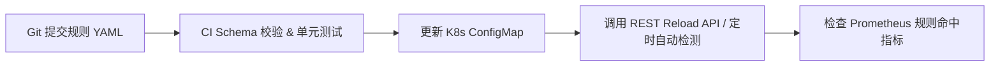

# 动态分类分级运维与部署指南

本文档介绍 `privacy-local-agent` 动态分类分级模块的规则配置挂载、热重载运维、Prometheus 可观测性监控与故障排查处理流程。

---

## 1. 规则配置文件挂载

### 1.1 环境变量配置

在 Sidecar 容器或节点环境变量中，配置规则库目录路径与热重载参数：

| 环境变量 | 默认值 | 说明 |
|---|---|---|
| `PRIVACY_DYNCLASSIFICATION_RULES_DIR` | `rules` | 动态规则配置根目录 |
| `PRIVACY_DYNCLASSIFICATION_HOT_RELOAD` | `true` | 是否开启配置热重载功能 |
| `PRIVACY_DYNCLASSIFICATION_RELOAD_INTERVAL` | `0` | 配置文件 mtime 变更自动检测最小间隔（秒，0=无节流） |

---

### 1.2 Kubernetes ConfigMap 与 Helm 部署挂载

在 Helm `values.yaml` 中增加规则挂载配置：

```yaml
# deploy/helm/privacy-local-agent/values.yaml
classification:
  dynamic:
    enabled: true
    rulesDir: "/etc/privacy-agent/rules"
    hotReload: true
    reloadIntervalSeconds: 60

# Deployment YAML 挂载示例
volumes:
  - name: classification-rules
    configMap:
      name: pla-classification-rules-config
volumeMounts:
  - name: classification-rules
    mountPath: /etc/privacy-agent/rules
```

---

## 2. 规则更新与热重载流程

生产环境下添加或修剪规则包时，推荐的流水线发布流程如下：



### 手动触发热重载命令
在使用 kubectl 更新 ConfigMap 或修改本地配置文件后，可通过 HTTP API 即时生效：

```bash
curl -X POST http://<POD_IP>:8079/v1/dynclassification/profiles/reload
```

---

## 3. 监控与可观测性

### 3.1 Prometheus 指标参考

| 指标名称 | 类型 | 标签 (Labels) | 业务含义 |
|---|---|---|---|
| `classification_rule_hits_total` | Counter | `rule_id`, `domain`, `standard` | 某条规则被命中的累计总次数 |
| `classification_operator_calls_total` | Counter | `operator`, `result` | 匹配算子调用的累计总次数（`result=hit/miss`） |
| `classification_engine_load_duration_seconds` | Histogram | `domain`, `standard` | 加载并构建规则引擎的耗时分布 |
| `classification_profile_cache_size` | Gauge | — | 当前在内存中缓存的引擎实例总数 |
| `classification_operator_errors_total` | Counter | `operator`, `rule_id` | 算子计算发生未捕获异常的错误次数 |

---

### 3.2 Grafana 告警规则建议

```yaml
groups:
  - name: classification_alerts
    rules:
      - alert: ClassificationOperatorErrorRateHigh
        expr: rate(classification_operator_errors_total[5m]) > 0.05
        for: 2m
        labels:
          severity: warning
        annotations:
          summary: "分类匹配算子异常率偏高"
          description: "算子 {{ $labels.operator }} 在规则 {{ $labels.rule_id }} 执行中发生异常。"
```

---

## 4. 常见故障排查手册

### 故障 1: YAML 解析校验失败，引擎拒绝载入
- **现象**：调用 `profiles/reload` 返回 500 错误，日志输出 `ValidationError`。
- **原因**：规则 YAML 文件格式错误，如缺少必填字段（如 `target` 或 `operator`）或配置了不存在的算子名称。
- **排查步骤**：
  1. 使用内置校验脚本检查 YAML：
     ```bash
     PYTHONPATH=. python -m privacy_local_agent.dynclassification validate /etc/privacy-agent/rules
     ```
  2. 修复配置文件语法与语义错误后重新 reload。

### 故障 2: 算子未找到异常 (`KeyError: 未找到名为 'xxx' 的匹配算子`)
- **现象**：日志提示某个算子无法实例化。
- **原因**：YAML 配置文件中写错了 `operator` 名称，或自定义算子尚未被 `@OperatorRegistry.register` 注册。
- **排查步骤**：
  1. 调用 `GET /v1/dynclassification/operators` 接口确认当前已注册的所有算子列表。
  2. 修正规则 YAML 文件中的算子名称或补全 Python 算子注册逻辑。

---

## 5. 降级规则 `force_suppress` 与 `exempt_rules` 最佳实践指南

当在规则 YAML 中使用敏感度降级规则 (`downgrade_rules`) 时：

1. **启用强制覆盖**：设置 `force_suppress: true`。
2. **显式配置覆盖上限 `max_force_suppress_level`**：
   - 默认为空时仅擦除 $\le \text{level}$ 的标签。
   - 若要将更高误报等级（如 L3/L4）强行降级为目标等级（如 L2），**必须显式指定** `max_force_suppress_level: "L3"` 或 `"L4"`。若未显式指定，`validate` 校验时将输出 `[配置提示]` 告警信息。
3. **使用 `exempt_rules` 设置豁免例外名单**：
   - `exempt_rules: []`（默认为空）：**没有例外！** 所有 $\le \text{max\_force\_suppress\_level}$ 的普通字段名匹配标签全额强制压制擦除（配置最简）。
   - `exempt_rules: ["RULE_IDCARD_EXACT", "*_EXACT"]`：指定例外规则（支持 `fnmatch` 通配符），列表中的规则**豁免保护、绝对不被压制**。

---

### 5.1 强制压制 4 重判定条件与综合实战案例

在 `ConfigurableRuleEngine` 评估时，一个普通规则标签要被降级规则强行压制（抹掉），必须**同时满足以下 4 个条件**：

1. **非降级标签**：必须是普通规则产出的标签（`is_override=False`，降级标签自身不会互相压制）。
2. **等级未超限**：普通标签的等级 $\le \text{max\_force\_suppress\_level}$。
3. **字段名匹配豁免**：默认仅压制字段名（`field_name`）匹配的标签；值级模式（`field_value`）匹配默认豁免保护。
4. **非豁免例外规则 (`exempt_rules`)**：
   - 若 `exempt_rules` 为空 ➔ **没有例外，通过压制判定**。
   - 若 `exempt_rules` 非空 ➔ 普通标签的 `rule_id` 不在 `exempt_rules` 例外列表（或通配符）中；若命中例外列表，则豁免保留、不被压制。

#### 💡 综合实战案例演示

假设对字段 `stat_user_mobile`（设备运行统计中的手机号相关标识）进行分类评估：

**降级规则配置**：
```yaml
downgrade_rules:
  - id: "RULE_DOWN_STAT_MOBILE"
    name: "统计字段强制降级"
    keywords: ["stat_user_mobile"]
    level: "L2"
    category: "OPERATIONAL_STAT"
    force_suppress: true
    max_force_suppress_level: "L4"
    exempt_rules: ["RULE_IDCARD_EXACT", "RULE_PHONE_REGEX"] # 仅身份证和精准手机号为例外保护
```

**评估时共命中以下 4 个普通规则标签，判定过程如下**：

| 命中标签 ID | 触发条件 / 匹配目标 | 标签等级 | 4 重条件校验判定 | 最终结果 |
|---|---|---|---|---|
| **`RULE_PII_FUZZY_KEYWORD`** | 字段名匹配 `mobile` (`match_target=field_name`) | `L3` | ①非降级标签 ②L3 $\le$ L4 ③字段名匹配 ④不在豁免名单中 ➔ **满足全部 4 条件** | ❌ **被强行压制擦除** |
| **`RULE_IDCARD_EXACT`** | 字段名匹配 `identity` (`match_target=field_name`) | `L3` | ①非降级标签 ②L3 $\le$ L4 ③字段名匹配 ④**在豁免名单中** ➔ **不满足条件 4** | ✅ **豁免保留** |
| **`RULE_TOP_SECRET_HASH`** | 字段名匹配 `top_secret` (`match_target=field_name`) | `L5` | ①非降级标签 ②L5 $>$ L4 (超出上限) ➔ **不满足条件 2** | ✅ **豁免保留** |
| **`RULE_PHONE_REGEX`** | 采样数据扫描出真实手机号 (`match_target=field_value`) | `L3` | ①非降级标签 ②L3 $\le$ L4 ③是**值级匹配** ➔ **不满足条件 3** | ✅ **豁免保留** |

**最终裁定结果**：
宽泛误报规则 `RULE_PII_FUZZY_KEYWORD` 被成功压制擦除；而属于豁免例外的精确规则 `RULE_IDCARD_EXACT`、绝密规则 `RULE_TOP_SECRET_HASH` 以及实际扫出手机号数据的 `RULE_PHONE_REGEX` 均被安全保留。


