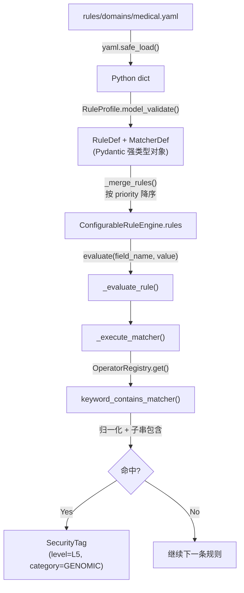

# 规则解析与执行机制详解

本文档以 `rules/domains/medical.yaml` 中的 `RULE_MED_G_001` 规则为例，详细说明声明式规则从 YAML 配置文件到运行时匹配执行的完整生命周期，以及在不同部署环境下的规则目录配置方法。

---

## 1. 规则定义示例

以医疗领域基因组规则为例：

```yaml
# rules/domains/medical.yaml
- id: "RULE_MED_G_001"
  name: "BRCA/TP53 基因指标"
  category: "GENOMIC"
  level: "L5"
  priority: 200
  matchers:
    - target: "field_name"
      operator: "keyword_contains"
      params:
        keywords: ["brca1", "brca2", "tp53"]
```

各字段含义：

| 字段 | 值 | 说明 |
|---|---|---|
| `id` | `RULE_MED_G_001` | 规则唯一标识，用于日志追踪和 Prometheus 指标 |
| `name` | `BRCA/TP53 基因指标` | 人类可读名称 |
| `category` | `GENOMIC` | 命中后输出的分类类别 ID |
| `level` | `L5` | 命中后输出的敏感度等级 ID |
| `priority` | `200` | 执行优先级（数值越大越先执行） |
| `matchers` | 匹配器列表 | 定义匹配目标、算子和参数 |
| `matchers[].target` | `field_name` | 匹配目标为字段名（另一选项为 `field_value`） |
| `matchers[].operator` | `keyword_contains` | 使用的匹配算子名称 |
| `matchers[].params` | `{keywords: [...]}` | 传递给算子的参数字典 |

---

## 2. 解析流程（加载阶段）

### 2.1 文件读取与 YAML 反序列化

入口方法：`ProfileLoader.load_profile("medical")`

```python
# privacy_local_agent/dynclassification/profile_loader.py
path = self.rules_dir / "domains" / "medical.yaml"
data = yaml.safe_load(path.read_text(encoding="utf-8"))
```

`yaml.safe_load()` 将 YAML 文本解析为 Python 嵌套字典（dict），此时尚无任何类型约束。

### 2.2 Pydantic 模型校验与结构化

```python
self._profile_cache[domain] = RuleProfile.model_validate(data)
```

Pydantic v2 递归校验整个数据结构，将其转换为强类型对象树：

```text
RuleProfile
├── domain = "medical"
├── version = "1.0.0"
├── rules: list[RuleDef]
│   └── [0] RuleDef(
│           id = "RULE_MED_G_001",
│           name = "BRCA/TP53 基因指标",
│           category = "GENOMIC",
│           level = "L5",
│           priority = 200,
│           match_logic = "AND",       ← 默认值（YAML 未显式指定）
│           enabled = True,            ← 默认值
│           matchers = [
│               MatcherDef(
│                   target = "field_name",
│                   operator = "keyword_contains",
│                   params = {"keywords": ["brca1", "brca2", "tp53"]}
│               )
│           ]
│       )
├── downgrade_rules: list[DowngradeRuleDef]
└── composite_rules: list[CompositeRuleDef]
```

涉及的模型定义位于 `privacy_local_agent/dynclassification/rule_schema.py`：

| 模型类 | 职责 |
|---|---|
| `MatcherDef` | 描述单个匹配器（target + operator + params） |
| `RuleDef` | 单条规则（含匹配器列表、命中后标签、优先级） |
| `DowngradeRuleDef` | 降级规则（字段名关键词匹配后降低等级） |
| `CompositeRuleDef` | 复合规则（记录级多字段组合判定） |
| `RuleProfile` | 一个领域包的完整定义 |

### 2.3 引擎构建与规则排序

`ConfigurableRuleEngine` 构造时合并所有 Profile 的规则：

```python
# privacy_local_agent/dynclassification/engine.py
def _merge_rules(self, profiles: list[RuleProfile]) -> list[RuleDef]:
    all_rules = []
    for profile in profiles:
        all_rules.extend(r for r in profile.rules if r.enabled)
    return sorted(all_rules, key=lambda r: r.priority, reverse=True)
```

`RULE_MED_G_001` 的 `priority=200` 为最高优先级，在规则列表中排在最前面被优先执行。

---

## 3. 执行流程（运行时阶段）

### 3.1 总体调用链

```text
engine.evaluate("brca1_mutation", "阳性")
│
├── 遍历 self.rules（按 priority 降序）
│   └── _evaluate_rule(RULE_MED_G_001, "brca1_mutation", "阳性")
│       │
│       ├── 遍历 rule.matchers（本规则仅 1 个 matcher）
│       │   └── _execute_matcher(matcher, "brca1_mutation", "阳性")
│       │       ├── target == "field_name" → target_value = "brca1_mutation"
│       │       ├── OperatorRegistry.get("keyword_contains") → 算子函数
│       │       └── keyword_contains_matcher("brca1_mutation", params) → True
│       │
│       ├── match_logic = "AND" → all([True]) = True → 命中
│       │
│       └── 生成 SecurityTag(level="L5", category="GENOMIC", rule_id="RULE_MED_G_001")
│
├── 执行降级规则（_evaluate_downgrade）
│
└── 去重返回 _unique_tags(tags)
```

### 3.2 匹配器执行细节

`_execute_matcher()` 方法的核心逻辑：

```python
def _execute_matcher(self, matcher: MatcherDef, field_name: str, str_value: str) -> bool:
    # 1. 从注册表获取算子函数
    op_func = OperatorRegistry.get(matcher.operator)

    # 2. 根据 target 决定输入值
    target_value = field_name if matcher.target == "field_name" else str_value

    # 3. 空值短路
    if target_value is None or target_value == "":
        return False

    # 4. 执行算子
    return bool(op_func(target_value, matcher.params))
```

### 3.3 `keyword_contains` 算子实现

```python
# privacy_local_agent/dynclassification/operators.py
@OperatorRegistry.register("keyword_contains")
def keyword_contains_matcher(value: Any, params: dict[str, Any]) -> bool:
    norm = str(value).lower().replace("_", "").replace(" ", "")
    keywords = params.get("keywords", [])
    return any(kw.lower().replace("_", "").replace(" ", "") in norm for kw in keywords if kw)
```

**归一化规则**：输入值和关键词均执行 `小写 + 去下划线 + 去空格`，然后做子串包含判断。

匹配示例：

| 输入字段名 | 归一化后 | 命中关键词 | 结果 |
|---|---|---|---|
| `brca1_mutation` | `brca1mutation` | `brca1` | 命中 |
| `BRCA2_Status` | `brca2status` | `brca2` | 命中 |
| `TP53` | `tp53` | `tp53` | 命中 |
| `serum_tp53_level` | `serumtp53level` | `tp53` | 命中 |
| `hemoglobin` | `hemoglobin` | — | 未命中 |

### 3.4 多匹配器逻辑（match_logic）

当一条规则包含多个 matcher 时，通过 `match_logic` 字段控制组合逻辑：

| match_logic | 语义 | 判定方式 |
|---|---|---|
| `AND`（默认） | 所有匹配器均命中 | `all(results)` |
| `OR` | 任一匹配器命中即可 | `any(results)` |

示例（`RULE_MED_G_002` 使用 OR 逻辑）：

```yaml
- id: "RULE_MED_G_002"
  matchers:
    - target: "field_name"
      operator: "keyword_contains"
      params:
        keywords: ["snp", "cnv", "genome", "genomic"]
    - target: "field_value"
      operator: "regex"
      params:
        pattern: "rs\\d+"
  match_logic: "OR"    # 字段名含关键词 或 字段值匹配 rs编号 → 均命中
```

### 3.5 输出结果

命中后生成 `SecurityTag` 对象：

```python
SecurityTag(
    level="L5",                    # 敏感度等级
    category="GENOMIC",            # 分类类别
    source_engine="RULE",          # 来源引擎标识
    rule_id="RULE_MED_G_001",     # 命中的规则 ID
    domain="medical",              # 所属领域
    standard_id="sc_health_db51",  # 所属标准（若有）
)
```

---

## 4. 算子注册机制

### 4.1 注册表架构

所有算子通过 `OperatorRegistry` 类进行统一管理：

```python
# privacy_local_agent/dynclassification/operator_registry.py
class OperatorRegistry:
    _operators: dict[str, MatcherOperator] = {}

    @classmethod
    def register(cls, name: str):       # 装饰器注册
    @classmethod
    def register_func(cls, name, func): # 运行时动态注册
    @classmethod
    def get(cls, name: str):            # 获取算子（热路径无锁读）
    @classmethod
    def list_operators(cls):            # 列出所有已注册算子
```

### 4.2 内置算子清单

| 算子名称 | 功能 | 典型 params |
|---|---|---|
| `regex` | 正则表达式匹配 | `{pattern: "..."}` |
| `keyword_contains` | 关键词子串包含（归一化后） | `{keywords: [...]}` |
| `prefix_match` | 前缀匹配 | `{prefixes: [...]}` |
| `suffix_match` | 后缀匹配 | `{suffixes: [...]}` |
| `id_card_checksum` | 中国大陆 18 位身份证校验 | 无 |
| `medical_card_checksum` | 上海医保卡号校验 | 无 |
| `icd10_range` | ICD-10 编码区间判定 | `{default_level, upgrade_level, intervals}` |
| `luhn_checksum` | Luhn 算法（银行卡号） | `{min_length, max_length}` |
| `length_range` | 字符串长度范围 | `{min_length, max_length}` |
| `exact_match` | 精确取值匹配 | `{values: [...]}` |
| `ip_address` | IPv4/IPv6 地址判定 | 无 |
| `mac_address` | MAC 地址匹配 | 无 |
| `chinese_name` | 中文姓名模式（2~4 字） | 无 |

### 4.3 ICD-10 算子特殊机制

`icd10_range` 算子通过 params 回写实现动态等级：

```python
# 命中敏感区间 → 回写升级等级
params["_hit_level"] = params.get("upgrade_level", "L4")
params["_hit_category"] = interval.get("category", "")

# 未命中敏感区间但为合法 ICD-10 → 使用默认等级
params["_hit_level"] = params.get("default_level", "L3")
params["_hit_category"] = "MEDICAL_ICD10_GENERAL"
```

引擎在 `_evaluate_rule()` 中读取回写值覆盖规则默认等级：

```python
if "_hit_level" in hit_params:
    level = hit_params["_hit_level"]
if "_hit_category" in hit_params and hit_params["_hit_category"]:
    category = hit_params["_hit_category"]
```

---

## 5. 规则目录路径配置

### 5.1 路径解析逻辑

```python
# privacy_local_agent/dynclassification/profile_loader.py
env_rules_dir = os.environ.get("PRIVACY_DYNCLASSIFICATION_RULES_DIR", "rules")
target_dir = rules_dir if rules_dir is not None else env_rules_dir
self.rules_dir = Path(target_dir)
```

优先级：`构造参数 rules_dir` > `环境变量 PRIVACY_DYNCLASSIFICATION_RULES_DIR` > `默认值 "rules"`

### 5.2 目录结构约定

```text
rules/                              # 规则配置根目录
├── taxonomies/                     # 分类体系 YAML
│   ├── default.yaml                # 内置 L1~L5 体系
│   ├── sc_health_db51.yaml         # 四川健康医疗
│   └── finance_jrt0197.yaml        # 金融 C1~C4 体系
├── domains/                        # 领域规则包 YAML
│   ├── general-pii.yaml            # 通用 PII
│   ├── medical.yaml                # 医疗健康
│   ├── finance.yaml                # 金融
│   └── sc_health_db51.yaml         # 四川指南专用
└── standards/                      # 标准组合 YAML
    ├── sc_health_db51.yaml         # DB51/T 2989
    └── jrt0197.yaml                # JR/T 0197
```

### 5.3 Docker 环境配置

#### 场景一：标准 Dockerfile 构建（无需额外配置）

当前 Dockerfile 中 `WORKDIR /app` + `COPY . .`，`rules/` 目录被复制到 `/app/rules/`，
进程工作目录为 `/app`，默认相对路径 `"rules"` 可正确解析。

```dockerfile
WORKDIR /app
COPY . .
CMD ["python", "-m", "privacy_local_agent.server"]
```

#### 场景二：打包为可执行文件（PyInstaller 等）

打包后 CWD 不确定，必须使用绝对路径：

```dockerfile
ENV PRIVACY_DYNCLASSIFICATION_RULES_DIR=/app/rules
```

#### 场景三：生产环境外挂规则目录（支持热更新）

```yaml
# docker-compose.yml
services:
  privacy-local-agent:
    environment:
      PRIVACY_DYNCLASSIFICATION_RULES_DIR: "/etc/privacy-local-agent/rules"
    volumes:
      - ./rules:/etc/privacy-local-agent/rules:ro
```

#### 场景四：Kubernetes / Helm 部署

```yaml
# values.yaml
extraEnv:
  - name: PRIVACY_DYNCLASSIFICATION_RULES_DIR
    value: /etc/privacy-local-agent/rules

extraVolumes:
  - name: dynclassification-rules
    configMap:
      name: privacy-rules-config

extraVolumeMounts:
  - name: dynclassification-rules
    mountPath: /etc/privacy-local-agent/rules
    readOnly: true
```

### 5.4 配置建议总结

| 部署场景 | 配置方式 | 说明 |
|---|---|---|
| 开发环境 / 标准 Dockerfile | 无需配置 | 默认相对路径 `rules` 可用 |
| PyInstaller 打包 + Docker | `PRIVACY_DYNCLASSIFICATION_RULES_DIR=/app/rules` | 必须使用绝对路径 |
| 生产环境需热更新 | Volume 挂载 + 环境变量指向挂载点 | 支持运行时更新规则 |
| K8s ConfigMap | Helm extraEnv + extraVolumes | 配合 reload API 使用 |

---

## 6. 完整数据流总结



核心设计思想：**引擎不包含任何领域知识，仅做声明式规则的解释执行。** 新增行业或标准只需添加 YAML 配置文件，无需修改 Python 引擎代码。
