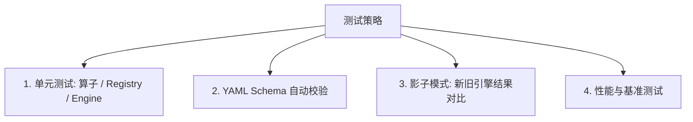

# 动态分类分级测试指南

本文档描述 `privacy-local-agent` 动态分类分级模块的测试策略、单元测试方法、影子模式（Shadow Mode）对比测试与规则 Schema 自动化校验。

---

## 1. 测试策略概述

动态分类分级模块采用分层测试策略，确保配置解析准确、匹配算子无状态且可靠，以及新旧引擎输出完全一致：



---

## 2. 单元测试代码示例

在 `tests/test_dynclassification.py` 中增加以下单元测试用例：

### 2.1 `OperatorRegistry` 算子注册与调用测试

```python
import pytest
from privacy_local_agent.privacy.classification.operator_registry import OperatorRegistry

def test_operator_registry_register_and_get():
    @OperatorRegistry.register("test_dummy_op")
    def dummy_op(val, params):
        return str(val) == params.get("target_val")

    assert "test_dummy_op" in OperatorRegistry.list_operators()

    op = OperatorRegistry.get("test_dummy_op")
    assert op("hello", {"target_val": "hello"}) is True
    assert op("world", {"target_val": "hello"}) is False

def test_operator_not_found():
    with pytest.raises(KeyError):
        OperatorRegistry.get("non_existent_operator_xyz")
```

---

### 2.2 `ConfigurableRuleEngine` 评估引擎测试

```python
from privacy_local_agent.privacy.classification.taxonomy import DomainTaxonomy, SensitivityLevelDef, CategoryDef
from privacy_local_agent.privacy.classification.rule_schema import RuleProfile, RuleDef, MatcherDef
from privacy_local_agent.privacy.classification.configurable_engine import ConfigurableRuleEngine

def test_configurable_engine_evaluation():
    taxonomy = DomainTaxonomy(
        domain="test",
        standard_id="test_std",
        levels={"L1": SensitivityLevelDef(id="L1", name="Low", rank=1),
                "L3": SensitivityLevelDef(id="L3", name="High", rank=3)},
        categories={"PII": CategoryDef(id="PII", name="PII Data")},
        default_level="L1"
    )

    profile = RuleProfile(
        domain="test",
        rules=[
            RuleDef(
                id="RULE_PHONE",
                category="PII",
                level="L3",
                matchers=[
                    MatcherDef(target="field_value", operator="regex", params={"pattern": "^1[3-9]\\d{9}$"})
                ]
            )
        ]
    )

    engine = ConfigurableRuleEngine(taxonomy, [profile])

    # 测试手机号匹配
    tags = engine.evaluate("mobile_number", "13800138000")
    assert len(tags) == 1
    assert tags[0].level == "L3"
    assert tags[0].category == "PII"
    assert tags[0].rule_id == "RULE_PHONE"

    # 测试未命中
    no_tags = engine.evaluate("mobile_number", "not_a_phone")
    assert len(no_tags) == 0
```

---

## 3. CI 中 YAML 规则 Schema 自动校验

为防止不合法的 YAML 配置被提交合并，在 CI 流水线中增加静态校验步骤：

### 校验命令

```bash
cd /home/charles/code/sfwork/privacy-local-agent
PYTHONPATH=. python -m pytest tests/test_dynclassification_schema.py -v
```

### `test_dynclassification_schema.py` 实现示例

```python
from pathlib import Path
import yaml
import pytest
from privacy_local_agent.privacy.classification.taxonomy import DomainTaxonomy
from privacy_local_agent.privacy.classification.rule_schema import RuleProfile, StandardDef

RULES_DIR = Path("rules")

@pytest.mark.parametrize("yaml_file", list((RULES_DIR / "taxonomies").glob("*.yaml")))
def test_validate_taxonomies(yaml_file):
    data = yaml.safe_load(yaml_file.read_text(encoding="utf-8"))
    tax = DomainTaxonomy.model_validate(data)
    assert tax.domain is not None

@pytest.mark.parametrize("yaml_file", list((RULES_DIR / "domains").glob("*.yaml")))
def test_validate_domain_profiles(yaml_file):
    data = yaml.safe_load(yaml_file.read_text(encoding="utf-8"))
    prof = RuleProfile.model_validate(data)
    assert prof.domain is not None

@pytest.mark.parametrize("yaml_file", list((RULES_DIR / "standards").glob("*.yaml")))
def test_validate_standards(yaml_file):
    data = yaml.safe_load(yaml_file.read_text(encoding="utf-8"))
    std = StandardDef.model_validate(data)
    assert std.standard_id is not None
```

---

## 4. 运行全套单元测试

```bash
cd /home/charles/code/sfwork/privacy-local-agent
PYTHONPATH=. pytest tests/test_classification*.py -v
```
