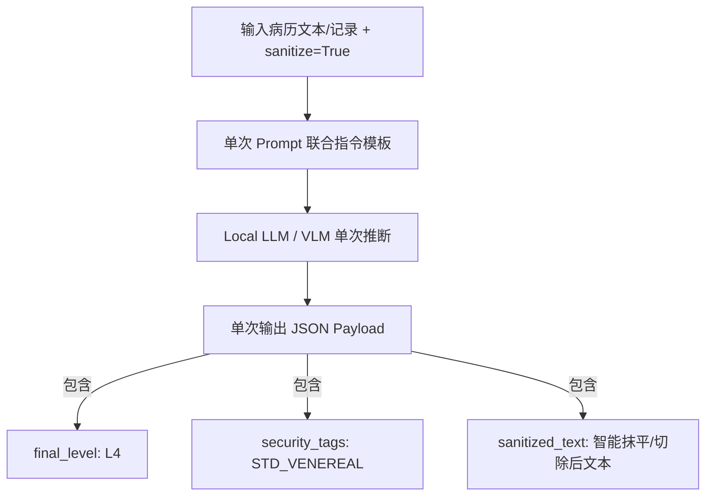

# 医疗敏感数据分类分级与脱敏 Pipeline 设计方案 (Medical Privacy Pipeline Design)

> **文档路径**: `docs/medical_pipeline/design.md`  
> **面向对象**: 架构师、后端/Agent 开发者、算法工程师、前端开发者  
> **功能目标**: 提供真实医疗场景数据生成、3-Layer 分类分级 (L1-L5)、L4/L5 高敏感数据脱敏剥离与双输出保障，并实现 Agent、Python/Go 控制台后端以及 Web 前端的全链路接入。

---

## 1. 概述与需求背景 (Overview & Requirements)

在医疗健康数据开放与合规共享场景中，电子病历 (EMR)、残疾人评估记录及医保结算数据包含高度敏感的个人身份标识信息 (PII，如身份证号、医保证号) 以及极高风险的医疗病史信息（如 L4 级的恶性肿瘤/传染病病史、L5 级的重度精神障碍/遗传缺陷/HIV 感染等）。

本设计方案旨在构建一个完整的**医疗数据合规治理 Pipeline**：
1. **数据模拟生成 (`scripts/data/generate_medical_data.py`)**：自动生成 100 条包含真实身份证校验码 (GB 11643-1999)、真实文本病历、图片病例引用（包含血常规、梅毒病例、HIV 报告、胸片等真实图片文件路径）以及 L4/L5 级敏感病史的高仿真 `data1.csv`。
2. **算法处理核心 (`privacy_local_agent/medical_pipeline/`)**：
   - 彻底与 `dynclassification` 统一合并：直接调用 `DynClassificationService.classify_field(..., sanitize=True)` 3 层漏斗 (Rule -> Small-NER -> Qwen2-VL) 完成 27 个字段及文本/图片病例的 L1~L5 风险分级标注。
   - **智能抹平与格式对称**：对 PII 及 L4/L5 级高敏感诊断执行自动抹平，对文本输出抹平文本，对图片输出遮罩打码后的新图片路径，强制保障输出数据中**绝对不包含任何 L4/L5 级原始敏感内容**。
   - **多线程安全与缓存复用**：`MedicalPrivacyPipeline` 内部挂载 `self._lock = threading.Lock()` 保护 `_sanitized_cache` 读写，避免并发数据竞态。
   - **双重结果输出**：输出 (1) 分级报告数据 (`classification_report`) 和 (2) 脱敏后符合安全合规要求的清洗数据 (`sanitized_data`)。
3. **代理后端与前端全链路集成**：
   - 将 100 条 `data1.csv` 放置于 Go/Python 控制台后端及 `medical_pipeline/samples/` 样例目录。
   - 在 Python 后端与 Go 后端实现对应的测试代理与 gRPC/REST 通信。
   - 在 Web 前端控制台增加“医疗数据治理 (Medical Pipeline)”与预置图片病例测试面板，实现 Front-to-End 跑通。

---

## 2. 整体架构设计 (System Architecture)

```mermaid
flowchart TD
    subgraph DataGen [数据生成脚本]
        SG[scripts/data/generate_medical_data.py] -->|生成合规高仿真数据| D1[data1.csv]
    end

    subgraph AgentPipeline [privacy_local_agent/medical_pipeline]
        D1 --> MP[MedicalPrivacyPipeline]
        MP -->|调用 dynclassification| DC[3-Layer 分类分级引擎]
        DC -->|标注 L1~L5 等级与 Tag| CR[1. 分级结果数据 (Classification Report)]
        MP -->|调用 privacy/masking| MS[脱敏与 L4/L5 抹平引擎]
        MS -->|PII 掩码 + L4/L5 泛化/抹平| SD[2. 脱敏清洗数据 (Sanitized Data)]
    end

    subgraph Endpoints [通信层与后端通道]
        MP --> Service[PrivacyService / MedicalRoute]
        Service --> PyBackend[Python Console Backend /api/medical_pipeline]
        Service --> GoBackend[Go Console Backend /api/medical_pipeline]
    end

    subgraph Frontend [Web 前端控制台]
        PyBackend --> WebUI[MedicalPipelinePanel.tsx]
        GoBackend --> WebUI
    end
```

---

## 3. 详细模块设计 (Detailed Component Design)

### 3.1 字段规范与 L1~L5 敏感分级定义

数据包含 27 个标准医疗与身份字段，其敏感分级定义遵循中国《数据安全法》、《医疗健康数据安全指南》与相关标准：

| 序号 | 中文字段 | 英文 Key (`data1.csv`) | 敏感等级 | 治理策略 |
|---|---|---|---|---|
| 1 | 姓名 | `name` | **L3 (高)** | 姓名掩码（如 `张*`） |
| 2 | 身份证号 | `id_card_no` | **L4 (极高)** | 身份证号保频掩码（如 `110101********1237`） |
| 3 | 户口地址 | `registered_address` | **L3 (高)** | 地址泛化到地级市 |
| 4 | 残疾证号 | `disability_cert_no` | **L3 (高)** | 证号遮蔽掩码 |
| 5 | 医保证号 | `medical_insurance_no` | **L3 (高)** | 证号遮蔽掩码 |
| 6 | 性别 | `gender` | **L1 (低)** | 保持原样 |
| 7 | 年龄 | `age` | **L1 (低)** | 保持原样 / 范围泛化 |
| 8 | 诊断名称 | `diagnosis_name` | **L4~L5 (特高)** | **L4/L5 剥离**（替换为合规范畴词，如 `[L4-普通慢性病]`） |
| 9 | 主诉 | `chief_complaint` | **L3 (高)** | 敏感文本 NER 抽取与遮蔽 |
| 10 | 现病史 | `present_illness` | **L4~L5 (特高)** | **L4/L5 剥离与 NER 掩码** |
| 11 | 既往史 | `past_history` | **L4~L5 (特高)** | **L4/L5 剥离与 NER 掩码** |
| 12 | 个人史 | `personal_history` | **L2 (中)** | 脱敏处理 |
| 13 | 是否吸烟 | `is_smoking` | **L1 (低)** | 保持原样 |
| 14 | 吸烟时长 | `smoking_duration` | **L1 (低)** | 保持原样 |
| 15 | 家族史 | `family_history` | **L3 (高)** | 遗传病敏感文本替换 |
| 16 | 过敏史 | `allergic_history` | **L2 (中)** | 保持原样/掩码 |
| 17 | 科室 | `department` | **L1 (低)** | 保持原样 |
| 18 | 身高 | `height` | **L1 (低)** | 保持原样 |
| 19 | 体重 | `weight` | **L1 (低)** | 保持原样 |
| 20 | 残疾类别 | `disability_category` | **L2 (中)** | 保持原样 |
| 21 | 残疾等级 | `disability_level` | **L2 (中)** | 保持原样 |
| 22 | 评估类型 | `assess_type_name` | **L1 (低)** | 保持原样 |
| 23 | 评估结果 | `assess_result_name` | **L2 (中)** | 保持原样 |
| 24 | 评估分数 | `assess_score` | **L1 (低)** | 保持原样 |
| 25 | 评估时间 | `assess_time` | **L1 (低)** | 格式归一化 |
| 26 | 病程记录 | `progress_note` | **L4~L5 (特高)** | **含图片病例引用，抹平 L4/L5 描述，保护图片 Hash/路径** |
| 27 | 病程记录时间 | `progress_note_time` | **L1 (低)** | 格式归一化 |

---

### 3.2 仿真数据生成器 (`scripts/data/generate_medical_data.py`)

1. **GB 11643-1999 校验码算法**：计算 ISO 7064:1983.MOD 11-2 前 17 位加权余数，生成符合校验规则的真实格式身份证号。
2. **L4/L5 级病史数据嵌入**：
   - **L4 级场景**：恶性肿瘤（肺腺癌、胃癌）、乙型肝炎、严重冠心病。
   - **L5 级场景**：HIV/艾滋病病毒感染、重度精神分裂症、遗传性亨廷顿舞蹈病。
3. **图文混合病程记录**：病程记录中嵌入类似 `[病理切片图: /medical_images/pathology_01.png]` 或 `[DICOM-CT: /radiology/ct_scan_05.dcm]` 的真实图文混合引用。

---

### 3.3 核心算法 Pipeline (`privacy_local_agent/medical_pipeline/`)

包结构定义：
```text
privacy_local_agent/medical_pipeline/
├── __init__.py
├── pipeline.py          # 医疗数据治理 Pipeline 主逻辑 (MedicalPrivacyPipeline)
├── rules.py             # 医疗专属分级规则与 L4/L5 关键词字典
├── samples/
│   └── data1.csv        # 自动生成的仿真医疗数据集
```

#### Pipeline 处理逻辑流程：
```python
class MedicalPrivacyPipeline:
    def process_record(self, record: dict) -> Tuple[dict, dict]:
        """
        处理单条医疗记录，返回 (classification_report, sanitized_record)
        """
        # Step 1: 分类分级 (DynClassificationService)
        classification = self.classify_record(record)
        
        # Step 2: L4/L5 级别扫描与全量掩码/剥离
        sanitized = self.sanitize_record(record, classification)
        
        return classification, sanitized
```

---

### 3.4 代理后端与 Frontend 跑通路线

1. **Agent 接口层**：
   - REST 路由: `POST /v1/medical/process`
   - gRPC 接口: 在 `proto/privacy.proto` 补充 `MedicalProcessRequest` 与 `MedicalProcessResponse`，更新存根。
2. **Go & Python 控制台后端**：
   - Python: 在 `console/backend/app/main.py` 增加 `POST /api/medical_pipeline`。
   - Go: 在 `console/backend-go/internal/handlers/handlers.go` 增加 `POST /api/medical_pipeline`。
   - 将 `data1.csv` 部署到 `console/backend/samples/data1.csv` 及 `console/backend-go/internal/samples/data1.csv`。
3. **Web 控制台 (`console/web`)**：
   - 新增 `MedicalPipelinePanel.tsx` 视图组件。
   - 在左侧侧边栏增加“医疗数据治理 (Medical Pipeline)”入口。
   - 支持一键载入 `data1.csv` 20 条数据、一键运行 Pipeline、联动分栏展示“1. 字段与记录级分级报告”和“2. 脱敏清洗数据（已彻底消除 L4/L5 高危病史与 PII）”。

---

## 4. 单元测试设计 (Testing Plan)

在 `tests/test_medical_pipeline.py` 中编写自动化测试，验证：
1. `data1.csv` 的字段完整性 (27 列) 与身份证号算法有效性。
2. 包含 L4/L5 级诊断与病史的数据记录经 Pipeline 处理后，`sanitized_data` 中绝对不包含原始 L4/L5 敏感字符串。
3. PII 字段（姓名、身份证、医保证、残疾证）脱敏后符合掩码规范。
4. 双重输出（分级报告与脱敏数据）格式与结构完全符合 JSON 契约。
5. 替换标签中不包含原始敏感词汇（如 HIV、乙肝等）。
6. 批量身份证校验码 (GB 11643-1999) 100% 通过率。
7. 混合 L4+L5 文本的完整剥离验证。
8. `pipeline/masker.py` 与 `medical_pipeline/rules.py` 词库一致性验证。

---

## 5. 代码质量改进记录 (Code Quality Improvements)

### 5.1 已修复的漏洞与缺陷

| 编号 | 问题 | 修复内容 | 影响文件 |
|---|---|---|---|
| Q-1 | `rules.py` 中 `_compile_term_patterns` 是死代码，且用 `"L5" in str(terms_dict)` 判断级别不可靠 | 删除死代码 | `medical_pipeline/rules.py` |
| Q-2 | `sanitize_field` 传入 `"chinese_name"` 但 `guess_field_type` 不识别 | 改用实际字段名 `"name"` | `medical_pipeline/pipeline.py` |
| Q-3 | `_classify_field` 只返回首个匹配等级，可能遗漏混合风险 | 重写扫描逻辑，确保 L5 优先于 L4 | `medical_pipeline/pipeline.py` |
| Q-4 | `pipeline/masker.py` 维护独立的 L4/L5 词库，与 `medical_pipeline/rules.py` 不同步 | 统一从 `medical_pipeline.rules` 导入 | `pipeline/masker.py` |
| Q-5 | CSV 生成用 `utf-8-sig`（含 BOM），读取用 `utf-8`，首列名可能带 `\ufeff` | 统一默认 `utf-8-sig` 编码 | `pipeline/service.py` |
| Q-6 | L5 替换标签 `[L5-HIV_AIDS-...]` 中包含原始敏感词 "HIV" | 引入抽象类别映射，替换为 `[L5-IMMUNODEFICIENCY-...]` | `medical_pipeline/rules.py` |
| Q-7 | `masker.py` 中 L4/L5 剥离条件硬编码字段名，与分级结果脱钩 | 提取 `CLINICAL_TEXT_FIELDS` 常量，逻辑更清晰 | `pipeline/masker.py` |

---

## 6. 性病及 L4 级疾病脱敏方案与 3-Layer 智能切除演进

### 6.1 现有脱敏机制 (规则与词表抽取)

当前在 `medical_pipeline/rules.py` 与 `pipeline/masker.py` 中，对性病（梅毒、淋病、尖锐湿疣、生殖器疱疹、软下疳等）、恶性肿瘤及乙肝等 L4 级疾病采用以下治理路径：

1. **特定词表与正则精准匹配 (Layer 1 Rule)**：在 `L4_TERMS_MAP` 中建立 `STD_VENEREAL` 专项高敏感字典（涵盖疾病全称、俗称、缩写及实验室检查指标如 `TPPA`、`RPR`、`苍白密螺旋体`）。
2. **范畴化标签替换与强剥离**：将文本中匹配到的性病描述替换为抽象安全标签（如 `[L4-STD_VENEREAL-SENSITIVE-MASKED]`），或直接删除该字段/整段文本，确保输出数据不含任何原始高危词汇。

### 6.2 引入 Small-NER 与 Local LLM 智能切除的优势分析

传统基于 Layer 1 静态正则/词表的脱敏方式在复杂非结构化临床病历（如主诉、现病史、病程记录）中存在局限。**调用 Small-NER (Layer 2) 与 Local LLM (Layer 3) 直接智能切除/抹平关于性病及 L4 疾病的描述，效果显著更好**：

```mermaid
flowchart LR
    Text[原始非结构化病历文本] --> L1[Layer 1: Rule Engine\n快速匹配已知硬编码病名]
    Text --> L2[Layer 2: Small-NER Engine\n精准识别 DISEASE/STD 实体起止 Span]
    Text --> L3[Layer 3: Local LLM / VLM\n理解上下文，智能抹平/重构病历]
    L1 & L2 & L3 --> Redact[1. 范畴化标签遮蔽\n2. 无缝文本智能切除 (零痕迹)]
```

#### 1. 突破静态词表的局限性 (Beyond Static Dictionaries)
医生在书写非结构化病历时，性病或高敏疾病往往采用隐晦描述、口语化表达或化验指标组合（如：“*患者自述外阴溃疡伴硬下疳，梅毒螺旋体特异抗体试验阳性*” 或 “*曾有不洁接触史，RPR 1:8 (+)*”）。静态词表难以穷举所有组合，而 **Small-NER (Layer 2)** 与 **Local LLM (Layer 3)** 拥有强大的上下文泛化与泛实体抽取能力，可精准抓取隐藏的性病相关实体。

#### 2. Small-NER (Layer 2) 精准 Span 实体切除
通过训练/微调针对医疗 ENTITY 的 Small-NER 引擎，能够准确识别性病及 L4 疾病实体的字符起始索引 `[start_idx, end_idx]`，直接在字符级别精准切除该实体，而无需将整段文字粗暴替换为 `[MASKED]`，最大程度保留了非敏感临床记录的可用性。

#### 3. Local LLM / VLM (Layer 3) 上下文理解与流畅重构
Local LLM (如 Qwen2-VL) 具备深层文本生成与指令遵循能力。通过 Prompt 指令：“*请重构以下病历，完全抹平/剔除其中涉及性病 (如梅毒/淋病)、传染病及高敏感病史的诊断与症状描写，保持其余非敏感临床诊断的自然通顺*”。LLM 能够智能切除性病段落并平滑连接上下文，实现高保真度与高合规性的完美平衡。

### 6.3 3-Layer (Rule → NER → LLM) 协同治理最佳实践

1. **Layer 1 (Rule)**：极低延迟与极低开销，兜底已知明确性病关键词及身份证/姓名等 PII 脱敏。
2. **Layer 2 (Small-NER)**：毫秒级推断，识别非结构化临床病历中的病名/症状 Span 进行定点切除。
3. **Layer 3 (Local LLM)**：在复合病历或复杂语义场景下触发，执行上下文重构与完全无缝切除。

---

### 6.4 单次 Prompt 联合推断与接口重定义优化 (Single-Pass Joint Classification & Sanitization)

#### 1. 传统两次调用的性能瓶颈
若将“分类分级”与“文本脱敏”拆分为两个独立阶段分别调用 LLM/VLM：
- **阶段 1**：LLM 评估文本敏感等级（如判断是否为 L4/L5）。
- **阶段 2**：若等级 > L3，再次调用 LLM 执行文本抹平/切除重构。

单次大模型推理通常耗时 1.5~3.0 秒。两次串行调用将使接口延迟翻倍达 3~6 秒，显存与计算资源开销增加 100%，极易造成高并发下的 OOM 或超时。

#### 2. 接口重定义与单次 Prompt 融合架构
重新定义 API 接口与Prompt 模板，支持传入控制参数 `sanitize: bool = True`：



**融合 Prompt 指令范例**：
> *"请评估以下临床病历文本的敏感等级 (L1~L5) 与安全标签。**若评定级别 > L3 (如 L4 或 L5) 且 sanitize=true**，请在同一响应中同时给出抹平切除性病/重症描述后的 sanitized_text；若级别 <= L3，则 sanitized_text 保持原文。请统一以 JSON 格式输出：`{"final_level": "...", "reasoning": "...", "sanitized_text": "..."}`。"*

#### 3. 性能收益
- **响应延迟降低 50%**：单次推断完成判定与重构脱敏。
- **显存与计算开销降低 50%**：仅需一次 Context 加载与 KV Cache 计算。
- **接口扩展性**：设置 `sanitize=False` 时，只进行分类分级计算，彻底切断不必要的脱敏开销。

---

## 7. 规则脱敏 (Rule) 与 Small-NER 脱敏详细处理流程与算法 (Detailed Redaction Algorithms)

### 7.1 规则脱敏算法 (`redact_medical_text`) 详细链路

```mermaid
flowchart TD
    In[输入文本 text] --> CheckEmpty{是否为空?}
    CheckEmpty -->|是| RetEmpty[返回原文]
    CheckEmpty -->|否| CheckLen{长度 > 50,000?}
    CheckLen -->|是| Fallback[_redact_terms_only 词库级单次替换]
    CheckLen -->|否| FastPath{含有 L4/L5 敏感词或脱敏标签?}
    FastPath -->|否 (Fast-Path)| RetClean[原样返回原文 (零篡改, <1ms)]
    FastPath -->|是| Step1[1. 死因句法重构: 因'HIV'去世 -> 因病去世]
    Step1 --> Step2[2. 服药句法擦除: 服用'奥氮平片'20mg qd -> 抹平]
    Step2 --> Step3[3. 就诊机构句法擦除: 曾就诊于精神卫生中心 -> 抹平]
    Step3 --> Step4[4. 独立诊断句法擦除: 诊断为重度精神分裂症 -> 抹平]
    Step4 --> Step5[5. 特征倾向句法擦除: 及保护性约束倾向 -> 抹平]
    Step5 --> Step6[6. 复合列表顿号擦除: 患'精神分裂'、'2型糖尿病' -> 患'2型糖尿病']
    Step6 --> Step7[7. 亲属单疾病重构: 一弟患'精神分裂症' -> 一弟患病]
    Step7 --> Step8[8. 既往史/病史擦除: 消除'慢性'前缀残渣]
    Step8 --> Heal[_clean_orphan_syntax 语法自愈与无语义碎片整句抹平]
    Heal --> Out[输出脱敏文本]
```

#### 1. Fast-Path 前置无篡改检测
- **算法原委**：为解决干净文本（无敏感词文本）在经过后续句法自愈正则时产生误篡改（例如误将 `母亲“高血压”控制良好` 改为 `母亲患'高血压”控制良好` 或消除段落空行）的问题，引入 Fast-Path 前置校验。
- **匹配逻辑**：使用 `_TERMS_ONLY_PATTERN.search(text)` 匹配词库与 `_MASKED_LABEL_RE.search(text)` 匹配脱敏标签。
- **效果**：无敏感词文本直接原样返回，开销由 ~50ms 降至 `<1ms`，零误伤干净文本。

#### 2. ReDoS 灾难性回溯防护
- 当输入文本长度 `len(text) > 50,000` 字符时，自动降级为 `_redact_terms_only` 单次扫描替换，切断复杂句法正则的回溯计算。

#### 3. 八步句法重构与定点擦除
1. **死因短语重构**：将 `因'恶性肿瘤'去世`、`因'HIV'导致的并发症去世` 自然重构为 `因病去世`。
2. **完整服药句法擦除**：要求前缀 (服用/口服/给予...)、剂量用法 (`20mg qd`) 或后缀 (控制症状/方案) 至少存在其一，避免无修饰裸词抢先匹配；整句抹去服药短语及剂量。
3. **就诊机构句法擦除**：擦除 `曾就诊于...` 短语。
4. **独立诊断句法擦除**：擦除 `诊断为...` 短语。
5. **特征倾向擦除**：擦除 `及保护性约束倾向` 等短语（要求必须有前缀或后缀）。
6. **复合列表擦除**：在 `患'A'、'B'` 顿号列表中仅擦除敏感项并擦除多余顿号 `、`，保留非敏感项。
7. **单疾病场景重构**：将 `一弟患'重度精神分裂症'` 自然重构泛化为 `一弟患病`。
8. **既往史/病史擦除**：清理 `慢性乙型肝炎病史` 残留的 `慢性` 前缀。

---

### 7.2 Small-NER 脱敏算法 (`redact_medical_text_with_ner`) 详细链路

```mermaid
flowchart TD
    TextIn[输入非结构化病历文本] --> NERExtract[1. Small-NER 实体抽取\ner_adapter.extract]
    NERExtract -->|输出实体列表| Filter[2. L4/L5 重大高敏实体筛选\n_is_major_sensitive_entity]
    Filter -->|遵照 L4_L5_MAJOR_SENSITIVE_PROMPT_GUIDELINE| SensitiveEntities{是否存在 L4/L5 高敏实体?}
    SensitiveEntities -->|否 (全是高血压/高脂血症等常规慢病)| FallbackRule[保留原文本 / 降级至规则引擎]
    SensitiveEntities -->|是| Sort[3. 按实体字符长度倒序排列\nreverse=True]
    Sort --> RedactLoop[4. 类型绑定上下文擦除\nDRUG / HOSPITAL / DISEASE]
    RedactLoop --> SelfHeal[5. 语法自愈与无语义碎片整句抹平\n_clean_orphan_syntax]
    SelfHeal --> OutputText[输出高合规脱敏文本]
```

#### 1. 神经网络实体抽取 (Entity Extraction)
- 通过 `ner_adapter.extract(text)` 延迟加载底层 Small-NER 模型（ONNX / ModelScope / TensorRT），提取出 `DISEASE`（疾病）、`DRUG`（药物）、`SYMPTOM`（症状）、`HOSPITAL`（机构）等实体。

#### 2. L4/L5 重大高敏实体筛选 (`_is_major_sensitive_entity`)
- **提示词指南**：遵照 `L4_L5_MAJOR_SENSITIVE_PROMPT_GUIDELINE` 规范。
- **筛选逻辑**：
  - 仅保留属于 **L4/L5 重大高敏级别** 的实体（HIV/艾滋病、重度精神分裂症、幻听、被害妄想、恶性肿瘤、梅毒、乙肝/丙肝、急性心肌梗死等）及其关联高敏药物（奥氮平、四苯嗪、替诺福韦、恩替卡韦等）。
  - **常规慢性病（高血压、高脂血症、糖尿病等）及常规用药（阿托伐他汀、降压药等）判定为 False，100% 跳过不擦除，原样保留。**

#### 3. 实体按长度倒序排列 (Length-first Sorting)
- 待擦除实体按字符长度从长到短排序（`reverse=True`），优先匹配长词，防止短词切割长词导致字词残渣。

#### 4. 类型绑定的上下文擦除 (Type-bound Contextual Redaction)
- **DRUG (药物)**：擦除 `修饰前缀 + 药名 + 剂量用法(\d+mg qd...) + 控制症状短语`；
- **HOSPITAL (机构)**：擦除 `就诊动作 + 医院名`；
- **DISEASE/SYMPTOM (疾病/症状)**：做实体级精准剥离，并擦除紧随的顿号。

#### 5. 语法自愈与无语义碎片整句抹平 (`_clean_orphan_syntax`)
- **孤立连词剥离**：清理句首/句尾孤立连词（如 `与`、`和`、`及`）；
- **标点合并**：合并连续重复标点（如 `，。` $\rightarrow$ `。`）；
- **无语义孤立状语整句抹平**：若整句文本擦除后仅剩下形如 `反复发作3年`、`3年`、`反复发作` 等**既无主语也无病因实体的时间/频次状语**，自愈逻辑判定其为无语义碎片，**直接整句抹平清空为 `""`**。

---

### 7.3 两种脱敏引擎实测行为对比表

| 输入文本范例 | 规则引擎 (Rule) 脱敏输出 | Small-NER 引擎脱敏输出 | 说明与合规理由 |
|---|---|---|---|
| `高脂血症病史5年，口服阿托伐他汀20mg qn。` | `高脂血症病史5年...` | `高脂血症病史5年...` | 高脂血症与阿托伐他汀为常规 L1/L2 慢病/常用药，两个引擎均 **100% 原样保留** |
| `因'HIV'导致的并发症去世。` | `因病去世。` | `因病去世。` | 包含 L5 级 HIV 极高敏词，自然重构为泛化 `因病去世` |
| `一弟患'重度精神分裂症'、'2型糖尿病'。` | `一弟患'2型糖尿病'。` | `一弟患'2型糖尿病'。` | 精准擦除 L5 级精神分裂症与顿号 `、`，保留非敏感的 2型糖尿病 |
| `幻听与被害妄想反复发作3年` | `""` (抹平为空) | `""` (抹平为空) | 全句均为 L5 极高敏症状，抹平后仅剩无主语状语，自愈逻辑判定为无语义碎片，**直接整句清空** |
| `高脂血症病史5年，长期服用奥氮平片20mg qd控制重度精神分裂症。` | `高脂血症病史5年。` | `高脂血症病史5年。` | 准确保留常规慢病，抹平 L5 级精神分裂症与关联用药奥氮平片 |

