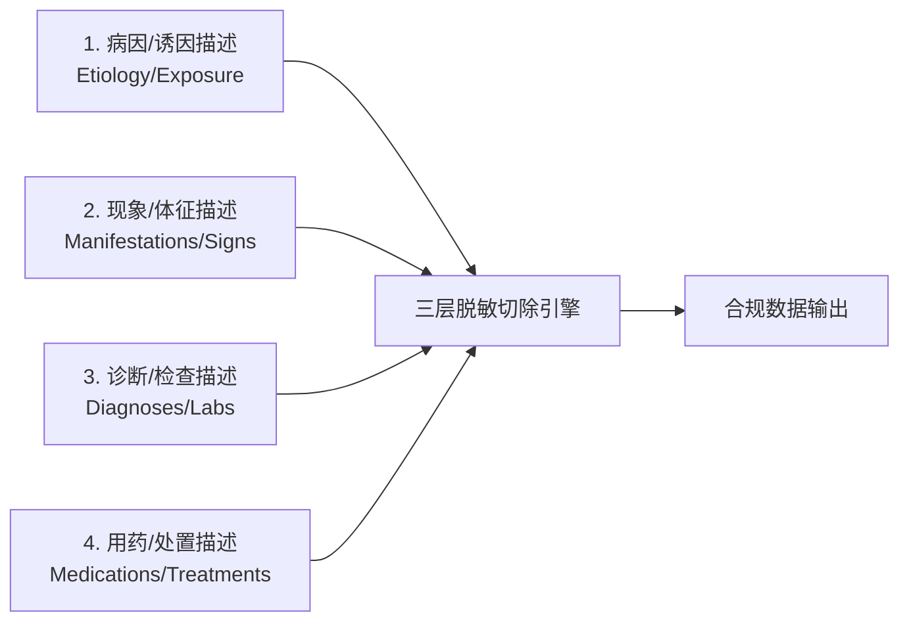
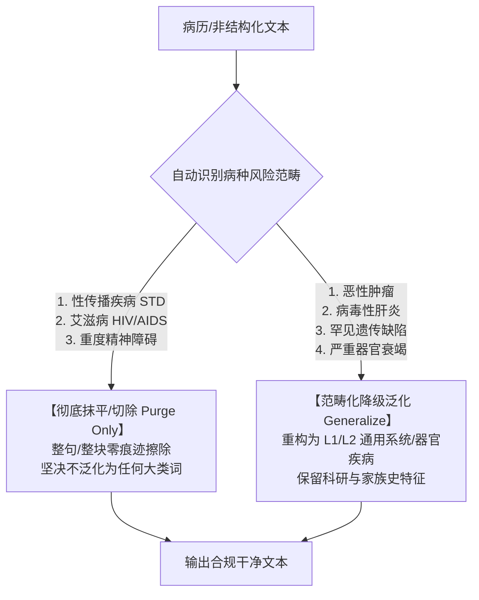
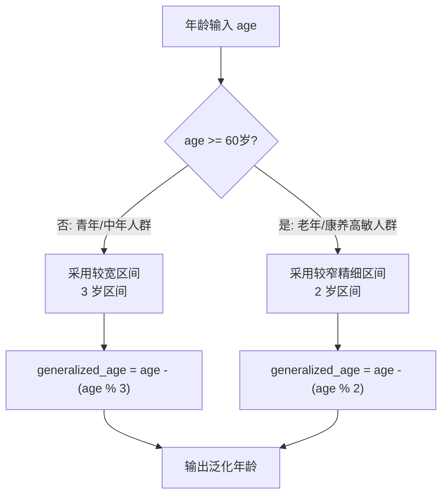

# 医疗数据隐私脱敏抹平与范畴化降级泛化算法标准规范
*(Medical Data Privacy Redaction & Categorical Generalization Algorithm Standard Specification)*

> **版本**：v1.3.0  
> **状态**：正式发布 / 工业级标准规范  
> **适用模块**：`privacy_local_agent.medical_pipeline`  
> **更新时间**：2026-08-07  
> **变更摘要**：新增抗变体绕过（全角归一化 + 分隔符容忍匹配 + 门禁三级检测）、连续空白折叠 ReDoS 防护、四柱词库扩充（单药/体征群/检查指标）、泛化规则顺序修正、Case 2/3 实测输出对账（见 §4.1、§6、§7、§8）。

---

## 1. 标准概述与适用范围

### 1.1 规范背景与设计目标
在医疗数据治理、临床科研二次利用、跨机构数据共享及大模型（LLM）微调场景中，非结构化病历文本（如主诉、现病史、家族史、诊断记录、医嘱等）蕴含极高价值，但也存在泄露患者重大隐私的风险。

本规范旨在建立一套**零隐私泄漏、语义自然流畅、兼顾临床科研效用**的自动化文本脱敏抹平（Redaction/Purge）与范畴化降级泛化（Categorical Generalization）标准算法。算法在代码层完全由 `privacy_local_agent.medical_pipeline` 驱动，并与通用动态分类内核 `dynclassification` 解耦。

### 1.2 合规基线与适用标准
本算法遵循以下国内外数据安全与医疗隐私标准：
- **GB/T 35273-2020** 《信息安全技术 个人信息安全规范》
- **GB/T 43697-2024** 《信息安全技术 数据安全技术 数据分类分级规则》
- **DB51/T 2989-2023** 《四川省健康医疗大数据应用指南》
- **HIPAA Safe Harbor & Expert Determination Method** (美国医疗电子交换法案脱敏标准)

---

## 2. 核心治理原则 (Core Governance Principles)

算法建立在两大核心治理原则之上：

### 2.1 【四柱强剥离原则 (Four-Pillar Erasure Principle)】
对于 L4/L5 级重大高敏疾病（性病、恶性肿瘤、HIV/AIDS、重度精神障碍、重大遗传缺陷、病毒性肝炎等），脱敏不能仅依赖显式疾病名称（如“梅毒”、“胃癌”），必须全链条擦除四类强相关特征，严防通过上下文反推高敏病史：



1. **病因/诱因描述 (Etiology/Exposure)**：不洁性接触史、高危接触史、输血史、针刺伤、特定基因突变（如 HTT 基因 CAG 重复扩增）等；
2. **现象/体征描述 (Manifestations/Signs/Symptoms)**：外阴/会阴/肛周多发赘生物伴瘙痒（菜花状/鸡冠状/乳头状）、无痛性溃疡(硬下疳)、生殖器水疱、命令性幻听、被害妄想、四肢舞蹈样动作、慢性腹泻伴消瘦等；
3. **诊断/检查描述 (Diagnoses/Examinations/Labs)**：醋酸白试验阳性、TPPA/RPR滴度阳性、HPV 6/11或16/18阳性、CD4+ T淋巴细胞计数、HBV-DNA载量、病理活检提示等；
4. **用药/处置描述 (Medications/Treatments/Procedures)**：CO2激光灼除术、咪喹莫特乳膏外用、ART抗逆转录治疗(替诺福韦+拉米夫定+多替拉韦)、奥氮平片、四苯嗪、恩替卡韦等。

---

### 2.2 【差异化自动化治理矩阵 (Automated Differential Governance Matrix)】
数据流过脱敏引擎时，系统根据病种的**社会污名化风险与临床科研价值**，自动路由执行差异化策略：



| 治理策略分类 | 涵盖疾病范畴 | 自动化处理行为 | 合规与临床理由 |
|---|---|---|---|
| **禁止泛化/彻底抹平<br>(Purge Only)** | **性传播疾病 (STD)**<br>**艾滋病 (HIV/AIDS)**<br>**重度精神障碍** | **100% 自动直接整句/整块擦除**，绝不泛化为任何大类词。 | 这类疾病存在极高的**社会污名化风险**。即使泛化为“皮肤粘膜疾病”或“免疫系统疾病”，结合患者患病部位（外阴/肛周）或用药上下文，依然极易被推断。**零痕迹擦除是唯一安全解**。 |
| **范畴化降级泛化<br>(Generalization Allowed)** | **恶性肿瘤 (Cancers)**<br>**病毒性肝炎 (Hepatitis)**<br>**罕见遗传缺陷**<br>**严重器官衰竭** | **自动重构降级**为 L1/L2 通用器官与系统大类疾病。 | 这类疾病在临床科研与流行病学统计中具有极高的家族史价值。重构为“消化道疾病”、“肝脏疾病”，**既 100% 屏蔽了恶性肿瘤/高敏病种风险，又保留了临床科研价值**。 |

---

## 3. 算法架构设计与三层漏斗编排

脱敏引擎采用 **Layer-1 规则引擎 (Rule)** 与 **Layer-2/3 智能引擎 (Small-NER / Local LLM)** 混合编排架构：

```mermaid
flowchart TD
    TextIn[输入临床文本] --> FastPath{Fast-Path 检查:\n包含 L4/L5 敏感词?}
    FastPath -->|否| ReturnRaw[原样返回\n耗时 < 1ms]
    FastPath -->|是| ReDoSCheck{文本长度 > 50,000 字?}
    ReDoSCheck -->|是| TermPurge[词库级单次匹配降级擦除]
    ReDoSCheck -->|否| Layer1Rule[Layer-1 规则引擎脱敏\nredact_medical_text]
    
    Layer1Rule --> EngineMode{脱敏引擎模式选择}
    EngineMode -->|rule| SelfHeal[语法自愈与孤立残渣清理\n_clean_orphan_syntax]
    EngineMode -->|ner| Layer2NER[Layer-2 Small-NER 脱敏\nredact_medical_text_with_ner]
    
    Layer2NER --> SelfHeal
    TermPurge --> SelfHeal
    SelfHeal --> SafetyGate{门禁校验:\n仍含原始高敏词?}
    SafetyGate -->|是| FailSafe[强挂载 [L4-L5-DATA-REMOVED] 标签]
    SafetyGate -->|否| FinalOut[输出合规脱敏文本]
```

### 3.1 领域策略注册机制 (`DomainStrategyRegistry`)
通用分类内核 (`dynclassification`) 保持纯净、领域无关。医疗流水线 (`MedicalPrivacyPipeline`) 在初始化时向全局单例注册表注册策略：
```python
from privacy_local_agent.dynclassification import default_domain_registry

default_domain_registry.register_sanitizer("medical", self._medical_text_sanitizer)
```

---

## 4. 规则引擎脱敏算法 (Layer-1 Rule) 详细规范

### 4.1 前置防护与 ReDoS 灾难性回溯切断
1. **Fast-Path 检测**：使用 `_TERMS_ONLY_PATTERN` 与 `_MASKED_LABEL_RE` 匹配。若不含任何高敏词，算法直接原样返回，耗时 `<1ms`，零误伤干净文本。
2. **ReDoS 防护**：
   - 当文本长度 `len(text) > 50,000` 字符时，自动降级为单次扫描替换 `_redact_terms_only`，切断回溯；
   - **连续水平空白折叠**：进入敏感路径后先将 `[ \t]{2,}` 折叠为单空格。句法正则的可选修饰组之间以 `\s*` 连接，恶意构造的长空白串（如 `"梅毒，患者"+2000空格`）会在多个 `\s*` 槽位间引发组合级回溯分配（实测挂死 >10s）；折叠后每个槽位至多消费 1 个字符，回溯空间降为常数，一次性切断全模式攻击面。
3. **抗变体绕过（归一化 + 分隔符容忍）**：
   - **全角归一化** `normalize_fullwidth_alphanumeric`：全角字母/数字（`ＨＩＶ`、`１２３`）折叠为半角，保留中文标点；
   - **分隔符容忍匹配** `_flex_escape`：词项按字符编译为 `字符 + [\s.\-_·•\u200b-\u200d\ufeff]{0,1}` 形式，`H I V`、`H.I.V`、`艾-滋-病`、零宽字符插入等变体直接命中词库；`{0,1}` 有界量词保证线性匹配；
   - **门禁三级检测**：Pipeline 最终门禁对脱敏输出执行 原文 / 归一化 / 剔除字符间噪声 三级回扫，词库外变体触发 `[L4-L5-DATA-REMOVED]` 整值删除（fail-closed）。

### 4.2 八步句法重构与定点擦除规则

#### 4.2 八步句法重构与定点擦除规则 (8-Step Order-Enforced Pipeline)

为防止范畴擦除提前切除敏感病名导致“死因动词悬空”（如 `外婆殁于` 残渣），脱敏算法严格执行**句法优先**的 8 步编排顺序：

1. **死因短语整体自然重构**：优先整句匹配死因短语（`殁于/死于/身亡于/病逝于/离世于/由...破裂出血导致去世/因...并发症去世`），如 `外婆殁于'亨廷顿舞蹈病'(50岁)` $\rightarrow$ **`外婆殁于48岁`**，`伯父由'食管静脉曲张'破裂出血导致去世` $\rightarrow$ **`伯父因病去世`**。
2. **死因/患病年龄 K-匿名泛化**：如 `父亲死于'恶性肿瘤'(65岁)` $\rightarrow$ **`父亲死于64岁`**。
3. **特异性用药与处置完整句法擦除**：如 `建议尽早启动恩替卡韦抗病毒治疗，注意休息` $\rightarrow$ **`注意休息`**。
4. **就诊机构与独立诊断擦除**：如 `曾就诊于精神卫生中心，诊断为重度精神分裂症。` $\rightarrow$ **`""`**（整句消除）。
5. **特征体征与现象倾向擦除**：如擦除 `外阴/会阴/肛周多发赘生物伴瘙痒`、`醋酸白试验阳性`、`咪喹莫特乳膏外用`、`及保护性约束倾向` 等句法块。
6. **CD4 计数/遗传缺陷/性病/肝炎综合句法擦除与范畴化降级泛化**：如 `家族中有明显消化道肿瘤聚集倾向` $\rightarrow$ **`家族中有明显消化道疾病聚集倾向`**。
7. **裸词与既往史擦除**：如擦除残留裸词病名与 `病史4年` 等。
8. **语法自愈与孤立残渣清理 (`_clean_orphan_syntax`)**：
   - **空括号与死标点清理**：消除擦除产生的 `()`、`“”` 及重复标点 `，，`。
   - **括号年龄自愈**：`死于(62岁)` $\rightarrow$ `死于62岁`。
   - **孤立动词/介词自愈**：`外婆殁于` $\rightarrow$ `外婆因病去世`；`母亲患(55岁确诊)` $\rightarrow$ `母亲患病(55岁确诊)`。
   - **单字边界保护**：严禁无边界匹配单字 `现`、`示`，严防将 `发现` 删成 `发`。
   - **无主语/无主病因时间从句绝杀**：若整句擦除后仅剩下 `患者1年前`、`患者3年前无明显诱因` 等无意义时间状语，直接清空为 **`""`**。

### 4.3 单条记录准标识符 (QI) 自适应年龄 K-匿名泛化算法

传统的 Mondrian 等 K-匿名算法依赖整批数据集划分子集，在 Sidecar/单条 API 流式处理场景无法直接应用。本系统设计了**单条记录自适应分段年龄 K-匿名泛化算法 (`adaptive_age_hierarchy`)**：



#### 1. 分段泛化准则与合规/临床理由
- **< 60 岁人群（青年/中年阶段）**：年龄精细度对基础健康建议影响较小，采用 **3 岁区间**（或 5 岁区间），公式为 `age - (age % 3)`。
  - *例*：30岁、31岁、32岁均对 3 取余后减去余数，统一泛化对齐为 **`30岁`**（或区间 `[30-32]`）。
- **$\ge$ 60 岁人群（老年/康养高敏人群）**：在老年康养、慢性病用药预防及生活照护中，年龄是关键核心因子。因此采用更精确的 **2 岁区间**，公式为 `age - (age % 2)`。
  - *例*：60岁、61岁统一泛化为 **`60岁`**；62岁、63岁统一泛化为 **`62岁`**。

#### 2. 代码实现接口 (`kano.py`)
```python
def adaptive_age_hierarchy(
    value: str | int | float,
    under_60_interval: int = 3,
    senior_interval: int = 2,
    output_format: str = "floor",  # "floor" 输出 "30" | "range" 输出 "[30-32]"
) -> str:
    ...
```

---

## 5. Small-NER 智能切除算法 (Layer-2 NER) 详细规范

### 5.1 神经网络实体抽取范畴
Layer-2 适配器识别 5 类临床实体：`DISEASE`（疾病）、`DRUG`（药物）、`SYMPTOM`（现象/体征）、`TEST`（检查/结论）、`HOSPITAL`（机构）。

### 5.2 实体筛选指南 (`L4_L5_MAJOR_SENSITIVE_PROMPT_GUIDELINE`)
通过 `_is_major_sensitive_entity` 过滤实体：
- **重大高敏实体 (True)**：属于 L4/L5 级（性病、恶性肿瘤、乙肝、HIV、精神障碍、亨廷顿病）的“病因、现象、诊断、用药”实体，**纳入擦除范围**。
- **常规慢病实体 (False)**：高血压、高脂血症、糖尿病、高尿酸血症及常规用药（阿托伐他汀、硝苯地平），**100% 跳过不擦除，原样保留**。

### 5.3 倒序擦除与上下文类型绑定
1. 将筛选出的高敏实体按字符长度**倒序排列** (`reverse=True`)，优先匹配长词，防止短词抢占。
2. **先执行规则全量句法擦除**（复用 `redact_medical_text` 主路径：已知词库 + 全部句法步骤 + 语法自愈），确保 CD4 计数、用药句法、诊断句法等已知特征零残渣——实体锚定擦除单独工作时只擦实体本身，曾泄露 `180/μL。行+。`、`确诊` 类句法残渣。
3. 再以 NER 实体为锚点，结合实体类型擦除关联的修饰前缀与后缀（**词库外高敏实体的增量擦除**，NER 的核心价值）。
4. 擦除后统一经过 `_clean_orphan_syntax` 语法自愈。

---

## 6. 范畴化降级泛化字典规范 (Category Generalization Rules)

针对允许泛化的 4 大病种范畴，在 `_CATEGORY_GENERALIZATION_RULES` 中定义的规范映射表如下：

```python
_CATEGORY_GENERALIZATION_RULES = [
    # 1. 恶性肿瘤范畴 -> 通用系统/器官疾病
    # 注意：器官/系统前缀为必选匹配，且各系统专属规则先于裸"肿瘤"兜底规则，
    # 否则 "呼吸系统肿瘤" 会被误泛化为 "呼吸系统消化道疾病"（张冠李戴）。
    (re.compile(r"消化道(?:恶性)?肿瘤(?=聚集倾向|家族史|史|风险)", re.I), "消化道疾病"),
    (re.compile(r"(?:呼吸道|呼吸系统)(?:恶性)?肿瘤(?=聚集倾向|家族史|史|风险)", re.I), "呼吸系统疾病"),
    (re.compile(r"生殖系统(?:恶性)?肿瘤(?=聚集倾向|家族史|史|风险)", re.IGNORECASE), "生殖系统疾病"),
    (re.compile(r"神经系统(?:恶性)?肿瘤(?=聚集倾向|家族史|史|风险)", re.IGNORECASE), "神经系统疾病"),
    (re.compile(r"(?:恶性)?肿瘤(?=聚集倾向|家族史|史|风险)", re.IGNORECASE), "相关系统疾病"),

    # 2. 病毒性肝炎范畴 -> 通用肝脏疾病
    (re.compile(r"(?:慢性乙型病毒性肝炎|乙型肝炎|乙肝|丙型肝炎|丙肝|肝硬化代偿期|早期肝硬化|肝硬化)(?=家族史|史|聚集倾向)", re.IGNORECASE), "肝脏疾病"),

    # 3. 重大遗传缺陷范畴 -> 遗传性神经系统疾病
    (re.compile(r"(?:遗传性亨廷顿舞蹈病|亨廷顿病|舞蹈病|罕见遗传病)(?=家族史|史|聚集倾向)", re.IGNORECASE), "遗传性神经系统疾病"),

    # 4. 严重器官衰竭范畴 -> 系统重大疾病
    (re.compile(r"(?:急性心肌梗死|冠状动脉重度狭窄)(?=家族史|史|聚集倾向)", re.IGNORECASE), "心血管系统疾病"),
    (re.compile(r"(?:慢性阻塞性肺疾病|COPD)(?=家族史|史|聚集倾向)", re.IGNORECASE), "慢性呼吸系统疾病"),
    (re.compile(r"(?:尿毒症|肾功能衰竭)(?=家族史|史|聚集倾向)", re.IGNORECASE), "肾脏系统疾病"),
]
```

---

## 7. 综合临床脱敏案例库与实测对账表

本规范提供 8 个代表性临床脱敏案例，展示算法在 Rule 与 Small-NER 引擎下的实测对账结果：

| 案例编号 | 临床病历场景分类 | 原始病历文本范例 | 规则引擎 (Rule) 脱敏结果 | Small-NER 引擎脱敏结果 | 规范评价与合规分析 |
|---|---|---|---|---|---|
| **Case 1** | **隐式性病主诉与处置** | `患者1月前发现外阴及会阴部多发菜花状赘生物，醋酸白试验阳性。行CO2激光灼除术及咪喹莫特乳膏外用。胸片详见 xray.png。` | `胸片详见 xray.png。` | `胸片详见 xray.png。` | **禁止泛化/彻底抹平 (Purge Only)**。<br>四柱特征（赘生物、醋酸白、激光、咪喹莫特）全擦除，孤立前缀全自愈，仅保留非敏感胸片引用。 |
| **Case 2** | **乙肝化验与医嘱处置** | `患者2周前体检发现ALT 120U/L，AST 95U/L，HBsAg阳性。进一步检查发现'慢性乙型病毒性肝炎'，HBV-DNA 2.3×10^5 IU/mL。建议尽早启动恩替卡韦抗病毒治疗。` | `患者2周前体检发现ALT 120U/L，AST 95U/L。` | `患者2周前体检发现ALT 120U/L，AST 95U/L。` | 彻底擦除 `HBsAg阳性`、`慢性乙型病毒性肝炎`、`HBV-DNA` 及 `恩替卡韦` 用药医嘱，完整保留常规肝功能化验值。**完整保留“发现”与“表现”，严防“前发”与“水表”残渣**。 |
| **Case 3** | **家族肿瘤史与降级泛化** | `父亲死于'胃癌'(62岁)，母亲患'乳腺癌'(55岁确诊)。家族中有明显消化道肿瘤聚集倾向。` | `父亲死于62岁，母亲患病(54岁确诊)。家族中有明显消化道疾病聚集倾向。` | `父亲死于62岁，母亲患病(54岁确诊)。家族中有明显消化道疾病聚集倾向。` | **范畴化降级泛化 (Generalization)**。<br>1. 括号年龄去括号自愈 (`死于62岁`)；<br>2. 动词自愈 (`母亲患病`)；<br>3. 肿瘤泛化 (`消化道肿瘤` $\rightarrow$ `消化道疾病`)；<br>4. 年龄准标识符 K-匿名 (`55岁` $\rightarrow$ `54岁`，<60 岁按 3 岁区间向下对齐，见 §4.3)。 |
| **Case 4** | **HIV 极高敏与同住史** | `患者查出'HIV抗体阳性'，CD4+ T细胞180/μL。行'替诺福韦+拉米夫定'抗逆转录治疗。同住者无感染。` | `同住者无感染。` | `同住者无感染。` | **L5 极高敏抹平 (Purge Only)**。<br>全链条剥离 HIV 检查、细胞计数及 ART 药物，仅保留非敏感同住记录。 |
| **Case 5** | **重度精神障碍与约束** | `曾就诊于精神卫生中心，诊断为'重度精神分裂症'。存在命令性幻听及保护性约束倾向。` | `""` (完全抹平为空) | `""` (完全抹平为空) | **L5 极高敏整句消除**。<br>擦除就诊机构、诊断名、体征幻听及约束倾向，全句自动抹平清空为 `""`。 |
| **Case 6** | **罕见遗传病与基因检测** | `基因检测提示'遗传性亨廷顿舞蹈病'(HTT基因CAG重复46次)。四肢舞蹈样动作明显。` | `""` (完全抹平为空) | `""` (完全抹平为空) | **L5 遗传缺陷全剥离**。<br>擦除基因名、重复序列及特征体征舞蹈样动作。 |
| **Case 7** | **常规慢性病（对照组）** | `原发性高血压病史10年，口服硝苯地平控释片30mg qd，血压控制良好。` | `原发性高血压病史10年，口服硝苯地平控释片30mg qd，血压控制良好。` | `原发性高血压病史10年，口服硝苯地平控释片30mg qd，血压控制良好。` | **L1/L2 常规慢病 100% 保留**。<br>高血压及降压药判定为非高敏，**零篡改原样保留**，保障通用病历效用。 |
| **Case 8** | **死因重构场景** | `一弟因'恶性肿瘤'去世，一妹患'重度精神分裂症'、'2型糖尿病'。` | `一弟因病去世，一妹患'2型糖尿病'。` | `一弟因病去世，一妹患'2型糖尿病'。` | **句法重构与复合列表擦除**。<br>1. `因恶性肿瘤去世` 重构为 `因病去世`；<br>2. 复合列表中擦除精神分裂症及顿号，保留非敏感项 `2型糖尿病`。 |

---

## 8. 附录：核心敏感词字典定义 (L4 / L5 Taxonomy Appendix)

> 词库经 `_flex_escape` 编译为分隔符容忍正则，全角/插字符/零宽字符变体均可命中；以下为词项范畴的语义定义。

### L5 级极高敏感字典范畴 (`L5_TERMS_MAP`)
- **HIV_AIDS**: 获得性免疫缺陷综合征、获得性免疫缺陷、人免疫缺陷病毒、艾滋病、HIV感染、HIV抗体（阳性）、HIV、AIDS、血清HIV-1/2、ＨＩＶ、ＡＩＤＳ、CD4+ T淋巴细胞、CD4+ T细胞、CD4细胞、CD4计数、CD4/CD8、CD4、替诺福韦、拉米夫定、多替拉韦、依非韦伦、阿巴卡韦、恩曲他滨、齐多夫定（含常见联用组合）、ART抗逆转录、抗逆转录（治疗）、HIV病毒载量、病毒载量
- **PSYCHIATRIC_DISORDER**: 重度精神分裂症、精神分裂症、精神分裂、双相情感障碍、被害妄想、命令性幻听、幻听、自伤倾向、冲动砸物、保护性约束（倾向）、言语关联妄想、奥氮平（片）、富马酸喹硫平、喹硫平、奎硫平、阿立哌唑、利培酮、氯氮平、氨磺必利、舒必利、奋乃静、氟哌啶醇、哈泊度醇、丙戊酸钠、碳酸锂、精神卫生中心、schizophrenia
- **GENETIC_DEFECT**: 遗传性亨廷顿舞蹈病、亨廷顿（舞蹈）病、Huntington (Disease)、舞蹈病、HTT基因、CAG重复序列、CAG重复/扩增、四肢舞蹈样动作、舞蹈样动作/症状、四苯嗪

### L4 级重大高敏感字典范畴 (`L4_TERMS_MAP`)
- **STD_VENEREAL**: 梅毒（含早期/晚期/隐性/神经/心血管/先天/胎传分型）、苍白密螺旋体、TPPA（阳性）、RPR（阳性/滴度）、syphilis、gonorrhea、herpes、chancroid、淋病、淋球菌、尖锐湿疣、生殖器疱疹、软下疳、性病、性传播疾病、不洁（性）接触史、无痛性溃疡、硬下疳、人乳头瘤病毒高危型、菜花状/鸡冠状/乳头状赘生物（含部位组合与"赘生物"）、醋酸白试验（阳性）、HPV（6/11、16/18、高低危型）、CO2激光灼除术、二氧化碳激光、咪喹莫特（乳膏）、苄星青霉素
- **MALIGNANT_NEOPLASM**: 恶性肿瘤、浸润性腺癌、肺腺癌、胃癌、肝癌、乳腺癌、宫颈癌、癌症、消化道（恶性）肿瘤、转移性肿瘤、奥希替尼、EGFR（基因）突变/检测、cancer、tumor、化疗、放疗、靶向治疗、PD-1（抑制剂）
- **HEPATITIS_VIRUS**: 慢性乙型病毒性肝炎、乙型肝炎、乙肝、丙型肝炎、丙肝、肝硬化（代偿期/失代偿期/早期）、小肝癌、蜘蛛痣、肝掌、肝硬化腹水、门静脉高压、门脉高压、食管（胃底）静脉曲张（破裂出血）、脾大/脾肿大/脾功能亢进、HBV-DNA（定量/阳性/阴性/载量）、HBV、HCV-RNA、HCV、恩替卡韦、干扰素、肝穿刺（活检）、G3S4、HBsAg/HBeAg/HBcAb/HBsAb/HBeAb（阳性/阴性）、乙肝表面抗原、乙肝两对半、hepatitis、cirrhosis、ＨＢＶ、ＨＣＶ
- **SEVERE_ORGAN_DAMAGE**: 慢性阻塞性肺疾病、COPD、急性心肌梗死、冠状动脉重度狭窄、尿毒症、肾功能衰竭

### 已知残留限制（Known Limitations）
- **拼音/同音/形近变体**：已系统性覆盖常见形态（`aizibing`、`meidu`、`jingshenfenlie`、中英混合 `精神分lie`、`乙gan/丙gan`、`xingbing`、器官+`ai` 系列如 `乳腺ai`、`H1V`/`HlV` 字符替换等）；极零散的拼音碎片（如 `bing` 单音节，与英文单词 Bing 冲突）不做词库匹配，依赖 Layer-3 本地 LLM 语义识别兜底。
- **英文常见词过度擦除取舍**：`aids` 等小写形态必须命中（防绕过），因此良性英文文本中的独立词 `aids`（如 "hearing aids"）会被擦除——这是 fail-safe 方向的有意取舍；ASCII 词项已加词边界，`archive`/`http`/`ABCD4` 类子串不会误命中。
- 词库外的新型/罕见表述依赖 NER/LLM 层识别；`fail_safe_triggered_fields` 指标持续偏高时应补充词库。
- 多分隔符插入变体（如 `H  I  V` 双空格）由最终门禁三级检测兜底（整值 `[L4-L5-DATA-REMOVED]`）。
- ONNX/TensorRT NER 引擎输入序列上限 128（超出尾部的实体不可达）；ModelScope 引擎按模型配置（512）处理。长病历建议按句切分后分别处理。

---
*标准规范结束。*
