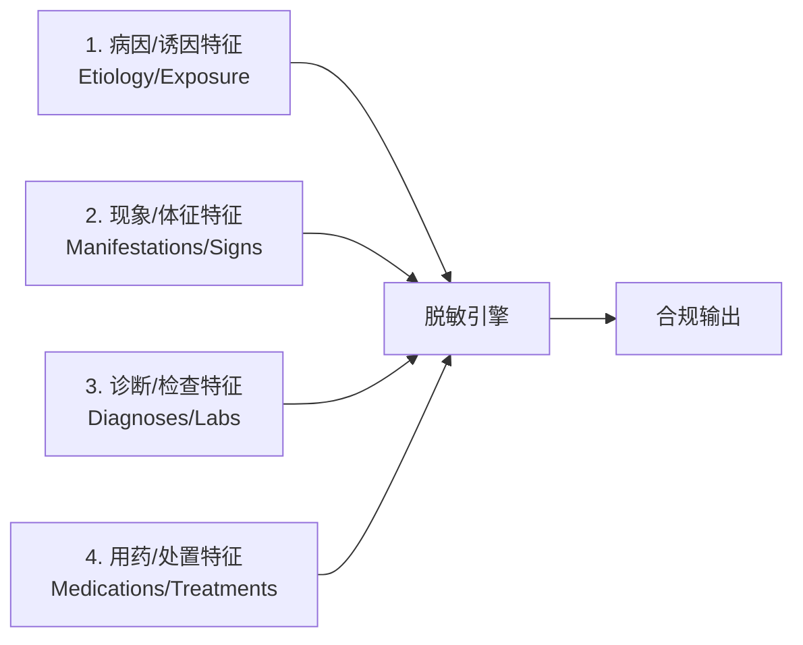
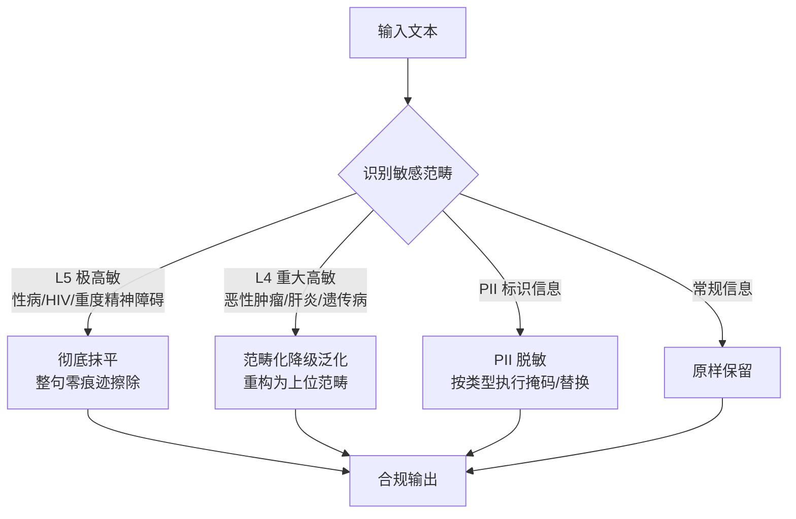
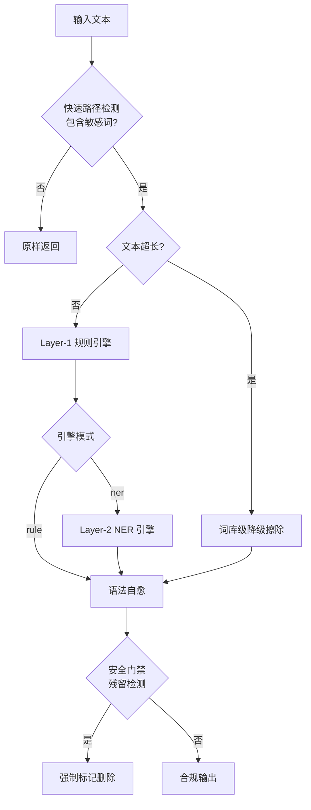
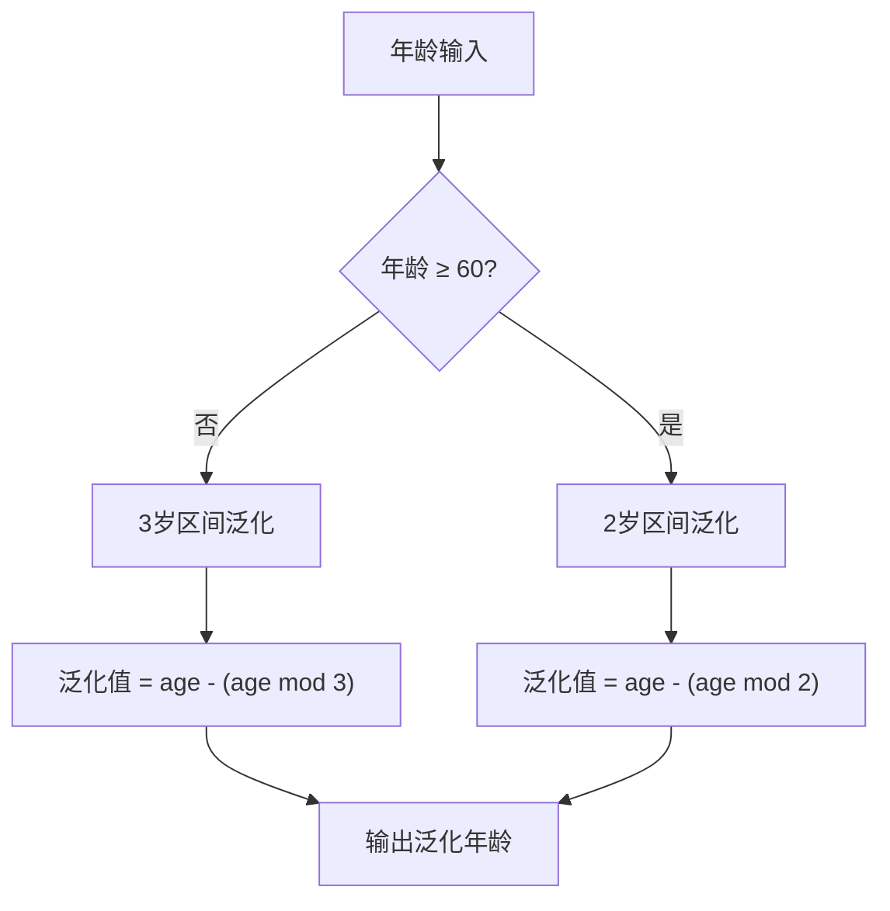

# 医疗健康数据隐私脱敏与泛化算法标准规范
*(Medical Health Data Privacy Redaction & Generalization Algorithm Standard Specification)*

> **版本**：v2.2.0  
> **状态**：正式发布 / 行业标准规范  
> **适用范围**：医疗健康数据脱敏与泛化处理的算法设计与实现  
> **更新时间**：2026-08-07  
> **变更摘要**：升级 v2.2.0 标准规范；新增 §3.5 图像与文件路径脱敏规范；新增 §4.1.1 三层漏斗冲突仲裁规约；新增 §4.3.1 形式化死因重构与句法映射矩阵；新增 §7.2.1 长文本切片性能与吞吐基准；扩充 §6 困难边缘案例库（Case 11~13）。

---

## 1. 标准概述与适用范围

### 1.1 规范背景与设计目标

在医疗数据治理、临床科研二次利用、跨机构数据共享及大模型（LLM）微调等场景中，医疗健康数据蕴含极高价值，但也存在泄露患者重大隐私的风险。数据中的隐私信息可分为两大类：

1. **个人身份信息（PII, Personally Identifiable Information）**：可直接或间接识别特定自然人的信息，如姓名、证件号码、联系方式、住址等；
2. **临床敏感信息（Clinical Sensitive Information）**：涉及重大高敏疾病的诊疗记录，如性病、恶性肿瘤、HIV/AIDS、重度精神障碍等。

本规范旨在建立一套**零隐私泄漏、语义自然流畅、兼顾临床科研效用**的自动化文本脱敏（Redaction）与范畴化泛化（Generalization）标准算法体系。

**设计目标：**

| 目标 | 说明 |
|---|---|
| 零隐私泄漏 | 脱敏后文本不得残留任何可还原或可推断的隐私痕迹 |
| 语义自然性 | 脱敏后文本应保持语句通顺，不产生语法残缺 |
| 科研效用保留 | 在安全前提下最大限度保留临床科研价值 |
| 性能可控 | 算法须在可接受时间内完成，防止恶意输入导致服务不可用 |
| 抗绕过能力 | 应对各种编码变体、分隔符插入等规避手段 |

### 1.2 合规基线与适用标准

本算法遵循以下国内外数据安全与医疗隐私标准：

| 标准编号 | 标准名称 | 适用维度 |
|---|---|---|
| GB/T 35273-2020 | 《信息安全技术 个人信息安全规范》 | PII 分类与脱敏基线 |
| GB/T 43697-2024 | 《信息安全技术 数据安全技术 数据分类分级规则》 | 数据分级框架 |
| DB51/T 2989-2023 | 《四川省健康医疗大数据应用指南》 | 医疗健康数据分级分类 |
| HIPAA Safe Harbor | 美国《健康保险流通与责任法案》安全港方法 | PII 18 类标识符脱敏 |
| HIPAA Expert Determination | 专家判定方法 | 风险评估与泛化策略 |
| GDPR Art. 25/32 | 欧盟《通用数据保护条例》 | 数据保护设计与默认 |

### 1.3 术语定义

| 术语 | 定义 |
|---|---|
| **脱敏抹平 (Purge/Redaction)** | 将敏感信息整句或整块删除，不留任何替代文本 |
| **范畴化泛化 (Generalization)** | 将具体敏感值替换为上位范畴词（如"胃癌"→"消化道疾病"） |
| **四柱特征 (Four-Pillar Features)** | 病因、体征、诊断、用药四类关联敏感特征 |
| **准标识符 (Quasi-Identifier, QI)** | 单独不能唯一标识但组合后可标识个体的属性（如年龄+性别+地区） |
| **K-匿名 (K-Anonymity)** | 泛化后任一准标识符组合至少对应 K 条记录 |
| **Fail-Closed** | 检测异常时选择拒绝/删除而非放行 |
| **语法自愈 (Syntax Self-Healing)** | 脱敏后自动修复残留语法碎片 |

---

## 2. 核心治理原则

算法体系建立在三大核心治理原则之上。

### 2.1 四柱强剥离原则 (Four-Pillar Erasure Principle)

对于重大高敏疾病（L4/L5 级），脱敏不能仅依赖显式疾病名称，必须全链条擦除四类强相关特征，严防通过上下文反推高敏病史：

**四柱特征范畴定义：**

| 柱序 | 特征类型 | 典型示例 |
|---|---|---|
| 第一柱 | 病因/诱因 | 不洁性接触史、高危接触史、输血史、针刺伤、特定基因突变 |
| 第二柱 | 现象/体征 | 外阴赘生物、无痛性溃疡、命令性幻听、舞蹈样动作 |
| 第三柱 | 诊断/检查 | 醋酸白试验阳性、TPPA/RPR 阳性、CD4+ 计数、病理活检 |
| 第四柱 | 用药/处置 | 特异性抗病毒药物、抗精神病药物、激光灼除术 |

### 2.2 差异化治理矩阵 (Differential Governance Matrix)

系统根据信息的**社会污名化风险与临床科研价值**，自动路由执行差异化策略：

| 治理策略 | 适用范畴 | 处理行为 | 合规理由 |
|---|---|---|---|
| **彻底抹平** | 性传播疾病、HIV/AIDS、重度精神障碍 | 100% 整句/整块擦除，不泛化 | 极高社会污名化风险，任何泛化形式均可被推断还原 |
| **范畴化泛化** | 恶性肿瘤、病毒性肝炎、罕见遗传病、严重器官衰竭 | 重构为 L1/L2 通用系统疾病 | 保留家族史科研价值，屏蔽具体高敏病种 |
| **PII 脱敏** | 姓名、证件号、电话、地址等 | 按类型执行掩码、替换或截断 | 阻断身份识别链路 |
| **原样保留** | 常规慢病、通用诊疗信息 | 零篡改 | 保障数据效用 |

### 2.3 最小必要原则 (Data Minimization)

脱敏处理应遵循最小必要原则：
- 仅处理被识别为敏感的信息，不过度擦除；
- 泛化层级以阻断推断攻击为限，不无谓降低精度；
- 对科研必需且风险可控的准标识符，优先选择泛化而非删除。

---

## 3. 个人身份信息（PII）脱敏规范

### 3.1 PII 分类体系

依据 HIPAA Safe Harbor 18 类标识符及 GB/T 35273-2020，本规范定义以下 PII 分类：

| 类别编号 | PII 类型 | 典型示例 | 敏感度 |
|---|---|---|---|
| PII-01 | 姓名 | 张三、John Smith | 中 |
| PII-02 | 证件号码 | 身份证号、护照号、军官证号 | 极高 |
| PII-03 | 联系方式 | 手机号、座机号、邮箱地址 | 高 |
| PII-04 | 住址信息 | 家庭住址、户籍地址、工作单位 | 高 |
| PII-05 | 日期信息 | 出生日期、入院日期（精确到日） | 中 |
| PII-06 | 医疗标识 | 病历号、医保卡号、住院号 | 高 |
| PII-07 | 生物特征 | 指纹、面部影像、声纹 | 极高 |
| PII-08 | 网络标识 | IP 地址、设备 ID、URL | 中 |
| PII-09 | 其他标识 | 车辆牌照、社保编号、银行账号 | 高 |

### 3.2 PII 检测算法规范

#### 3.2.1 结构化 PII 检测

对于具有固定格式的 PII（证件号、电话号、日期等），采用**模式匹配 + 校验位验证**双重检测：

| PII 类型 | 检测策略 | 校验规则 |
|---|---|---|
| 身份证号 | 18 位数字模式匹配 | 校验位加权验证（GB 11643-1999） |
| 手机号 | 11 位数字 + 号段前缀 | 运营商号段白名单 |
| 邮箱 | 标准邮箱格式匹配 | 域名有效性校验 |
| 日期 | 多格式日期模式 | 有效日期范围验证 |
| 银行卡号 | 16-19 位数字 | Luhn 校验算法 |

#### 3.2.2 非结构化 PII 检测

对于无固定格式的 PII（姓名、地址、机构名），采用**命名实体识别（NER）+ 上下文推理**：

1. **命名实体识别**：识别人名（PER）、地名（LOC）、机构名（ORG）等实体类型；
2. **上下文推理**：结合前后文语义判断实体是否为敏感标识（如"患者张三"中的"张三"为人名，"张三丰太极拳"中的"张三丰"非敏感）；
3. **关联图谱**：检测实体间的关联关系，防止通过组合信息重新识别。

### 3.3 PII 脱敏策略矩阵

根据 PII 类型与数据使用场景，执行差异化脱敏策略：

| PII 类型 | 掩码策略 | 泛化策略 | 替换策略 | 适用场景 |
|---|---|---|---|---|
| 姓名 | 保留姓氏，名替换为 `**` | 泛化为"患者" | 替换为随机姓名 | 需保留称呼的叙事文本 |
| 身份证号 | 保留前 3 后 4，中间掩码 | 仅保留户籍省份编码 | 替换为虚构号码 | 需验证格式的测试场景 |
| 手机号 | 保留前 3 后 4，中间掩码 | 仅保留运营商段 | 替换为虚构号码 | 需保持格式的通信记录 |
| 住址 | 保留省/市级 | 泛化为"某市" | 替换为随机地址 | 流行病学地域分析 |
| 日期 | 年份保留，月日掩码 | 泛化为年份或季度 | 偏移 ±N 天 | 时间序列分析 |
| 病历号 | 完全掩码 | — | 替换为随机编号 | 跨系统关联追踪 |

#### 3.3.1 掩码规则详述

**姓名掩码：**
- 二字姓名：保留首字，第二字替换为 `*`（如 `张*`）
- 三字及以上：保留首字与末字，中间替换为 `*`（如 `张*明`）
- 复姓处理：保留复姓，名替换为 `**`（如 `欧阳**`）

**证件号掩码：**
- 身份证号：保留前 3 位（地区码）+ 后 4 位（顺序码+校验位），中间 11 位掩码（如 `110***********1234`）
- 护照号：保留首字母 + 末位，中间掩码

**电话号码掩码：**
- 手机号：保留前 3 位（号段）+ 后 4 位，中间 4 位掩码（如 `138****5678`）
- 座机号：保留区号 + 后 2 位，中间掩码

**日期泛化：**
- 精确到日 → 泛化为年月（如 `2024-03-15` → `2024-03`）
- 精确到月 → 泛化为季度（如 `2024-03` → `2024-Q1`）
- 年龄泛化：见 §4.4 自适应年龄 K-匿名算法

### 3.5 图像与文件路径脱敏规范 (Medical Image & Path Sanitization)

在医疗数据流中，除了纯文本与结构化属性外，还可能包含附件路径、医学影像引用与 Data URI（Base64）图像编码。为严防通过文件名或图像元数据绕过脱敏，算法遵循以下标准：

1. **文件/URL 路径敏感词清洗**：
   检测并替换路径中包含的高敏病种英文/拼音词汇（如 `syphilis`, `hiv`, `aids`, `cancer`, `tumor`, `hepatitis`）。
   - *示例*：`/data/medical_records/syphilis_check_01.jpg` $\rightarrow$ `/data/medical_records/sanitized_case_image_01.jpg`
2. **Data URI 与图像马赛克覆盖**：
   - 对包含高敏文字（如化验单上的 L4/L5 诊断或 PII 标识）的图像，定位目标文本框（Bounding Box）区域并实施高斯模糊或高对比度黑色掩码遮盖；
   - 对 DICOM 影像文件，清理 Header 元数据中的患者姓名、身份证号、医疗机构标识及检查日期等 PII 字段。

---

## 4. 临床敏感信息脱敏规范

### 4.1 三层漏斗架构

脱敏引擎采用**规则引擎 + 小模型 NER + 大模型 LLM** 三层漏斗编排架构：

**各层职责：**

### 4.1.1 三层漏斗冲突仲裁规约 (Consensus & Arbitration Standard)

当 Layer-1 (规则)、Layer-2 (NER) 与 Layer-3 (LLM) 对同一文本片段的敏感级别或提取类别判定不一致时，算法严格执行以下**冲突仲裁与裁决标准**：

1. **最高覆盖权（Rule Precedence Rule）**：
   若 Layer-1 规则引擎判定包含 L4/L5 强制抹平/泛化特征，该判定具有最高硬性覆盖权（一票否决权），后续 Layer-2/3 只能追加擦除实体，不得降低或撤销 Layer-1 的风险判定。
2. **增量集合并（NER Augmentation Rule）**：
   Layer-2 NER 引擎识别出的词库表外实体（如新上市特异性抗病毒药物、罕见并发症），作为 Layer-1 的增量补集加入擦除矩阵，执行定点抹平。
3. **LLM 置信度门禁与 Fail-Closed 降级（LLM Confidence Thresholding）**：
   若 Layer-3 LLM 的推理置信度小于门禁阈值（默认 `0.75`），系统自动触发 Fail-Closed 安全防护，强制将该文本判定为高敏感级并执行安全占位替换。

---

### 4.2 前置防护机制

#### 4.2.1 快速路径检测

若输入文本不包含任何已知敏感词，直接原样返回，避免对干净文本的无效处理。

#### 4.2.2 ReDoS 防护

针对正则表达式灾难性回溯攻击：
- **超长文本降级**：文本长度超过阈值（如 50,000 字符）时，降级为单次扫描替换，切断回溯；
- **连续空白折叠**：将连续水平空白折叠为单空格，消除正则可选组间的组合级回溯空间。

#### 4.2.3 抗变体绕过机制

应对常见编码变体规避手段：

| 绕过手段 | 防御策略 | 示例 |
|---|---|---|
| 全角字符 | 全角→半角归一化 | `ＨＩＶ` → `HIV` |
| 分隔符插入 | 分隔符容忍匹配 | `H.I.V`、`艾-滋-病` |
| 零宽字符 | 零宽字符剥离 | `H\u200bIV` → `HIV` |
| 拼音替换 | 拼音词库覆盖 | `aizibing` → 艾滋病 |
| 谐音/形近 | 形近字映射 | `艾zi病` |
| 混合编码 | 多编码层检测 | 中英混合变体 |

**安全门禁三级检测：** 最终输出前执行原文 / 归一化 / 去噪三级回扫，任一级命中则执行整值删除（Fail-Closed）。

### 4.3 句法重构规则体系

为防止范畴擦除提前切除敏感病名导致语法残渣（如"殁于"悬空），脱敏算法严格执行**句法优先**的编排顺序：

**八步句法重构流程：**

| 步骤 | 处理内容 | 示例 |
|---|---|---|
| 1 | 死因短语整体重构 | `外婆殁于'亨廷顿病'(50岁)` → `外婆殁于48岁` |
| 2 | 死因/患病年龄 K-匿名泛化 | `父亲死于'恶性肿瘤'(65岁)` → `父亲死于64岁` |
| 3 | 特异性用药与处置句法擦除 | `建议启动恩替卡韦抗病毒治疗` → `""` |
| 4 | 就诊机构与独立诊断擦除 | `曾就诊于精神卫生中心，诊断为...` → `""` |
| 5 | 特征体征与现象擦除 | 擦除赘生物、溃疡等句法块 |
| 6 | 综合句法擦除与范畴化泛化 | `消化道肿瘤聚集倾向` → `消化道疾病聚集倾向` |
| 7 | 裸词与既往史擦除 | 残留裸词病名与"病史N年" |
| 8 | 语法自愈与孤立残渣清理 | 空括号、死标点、孤立动词修复 |

### 4.3.1 形式化死因重构与句法映射矩阵 (Formal Death Cause Rewrite Matrix)

为保证脱敏文本在各种死因表达下均能精准映射、零语病残渣，规范定义以下形式化死因映射逻辑表：

| 原始死因句型结构 | 句法特征示例 | 规范重构输出 | 映射算法与自愈行为 |
|---|---|---|---|
| **特定死因动词 + 高敏病名 + 年龄** | `外婆殁于'亨廷顿舞蹈病'(50岁)` | `外婆殁于48岁` | 保留死因动词 `殁于` + 切除高敏病名 + 年龄 K-匿名泛化 |
| **特定死因动词 + 高敏病名 (无年龄)** | `伯父殁于'胃癌'` | `伯父死于` $\rightarrow$ `伯父因病去世` | 动词补全与自愈，重构为自然汉语 `因病去世` |
| **介词 + 高敏病名 + 复合死因 + 去世** | `伯父由'食管静脉曲张'破裂出血导致去世` | `伯父因病去世` | 整句捕获 `由...破裂出血导致去世`，替换为 `因病去世` |
| **介词 + 高敏病名 + 并发症 + 去世** | `因'HIV'导致的并发症去世` | `因病去世` | 捕获 `因...并发症去世`，重构为 `因病去世` |
| **特定死因动词 + 高敏病名 + 去世** | `父亲死于'恶性肿瘤'去世(65岁)` | `父亲死于64岁` | 消除冗余 `去世`，保留 `死于` 动词 + 年龄泛化 |
| **亲属 + 悬空死因动词 (擦除后残渣)** | `外婆殁于` / `伯父死于` | `外婆因病去世` / `伯父因病去世` | 语法自愈 (`_clean_orphan_syntax`) 修复悬空动词 |

---

### 4.4 自适应年龄 K-匿名泛化算法

传统 K-匿名算法依赖整批数据集划分，在单条记录流式处理场景无法直接应用。本规范定义**单条记录自适应分段年龄泛化算法**：

**分段泛化准则：**

| 人群 | 区间大小 | 公式 | 合规理由 |
|---|---|---|---|
| < 60 岁 | 3 岁 | `age - (age mod 3)` | 年龄精细度对基础健康建议影响较小 |
| ≥ 60 岁 | 2 岁 | `age - (age mod 2)` | 老年康养场景中年龄是关键核心因子 |

**泛化示例：**
- 30、31、32 岁 → 统一泛化为 `30岁`（或区间 `[30-32]`）
- 60、61 岁 → 统一泛化为 `60岁`
- 62、63 岁 → 统一泛化为 `62岁`

### 4.5 NER 智能擦除规范

#### 4.5.1 实体类型识别

NER 层识别以下临床实体类型：

| 实体类型 | 说明 |
|---|---|
| DISEASE | 疾病名称 |
| DRUG | 药物名称 |
| SYMPTOM | 症状/体征 |
| TEST | 检查项目/结论 |
| HOSPITAL | 医疗机构 |
| PERSON | 人名（PII 联动） |
| LOCATION | 地名/地址（PII 联动） |

#### 4.5.2 实体筛选准则

通过重大敏感性判定过滤实体：

- **纳入擦除**：属于 L4/L5 级的四柱关联实体（病因、现象、诊断、用药）；
- **跳过保留**：常规慢病实体（高血压、糖尿病等）及常规用药，100% 原样保留。

#### 4.5.3 擦除编排策略

1. **倒序擦除**：将筛选出的高敏实体按字符长度倒序排列，优先匹配长词，防止短词抢占；
2. **规则先行**：先执行规则全量句法擦除，确保已知特征零残渣；
3. **实体锚定**：以 NER 实体为锚点，结合实体类型擦除关联修饰前缀与后缀；
4. **统一自愈**：擦除后统一经过语法自愈处理。

---

## 5. 范畴化泛化规则规范

### 5.1 泛化映射体系

针对允许泛化的重大高敏范畴，定义以下泛化映射：

| 源范畴 | 泛化目标 | 适用上下文 |
|---|---|---|
| 消化道恶性肿瘤 | 消化道疾病 | 家族史、聚集倾向 |
| 呼吸系统恶性肿瘤 | 呼吸系统疾病 | 家族史、史 |
| 生殖系统恶性肿瘤 | 生殖系统疾病 | 家族史 |
| 神经系统恶性肿瘤 | 神经系统疾病 | 家族史 |
| 恶性肿瘤（无系统限定） | 相关系统疾病 | 通用兜底 |
| 病毒性肝炎（乙肝/丙肝等） | 肝脏疾病 | 家族史、史 |
| 亨廷顿舞蹈病 | 遗传性神经系统疾病 | 家族史 |
| 急性心肌梗死/冠脉狭窄 | 心血管系统疾病 | 家族史 |
| 慢性阻塞性肺疾病 | 慢性呼吸系统疾病 | 家族史 |
| 尿毒症/肾功能衰竭 | 肾脏系统疾病 | 家族史 |

### 5.2 泛化顺序规则

泛化规则须遵循**特异性优先**原则：
- 系统专属规则先于通用兜底规则执行；
- 避免"呼吸系统肿瘤"被误泛化为"呼吸系统消化道疾病"等张冠李戴现象；
- 上下文限定词（家族史、史、聚集倾向、风险）作为泛化触发条件。

### 5.3 禁止泛化范畴

以下范畴**严禁**执行泛化，必须执行彻底抹平：

| 范畴 | 禁止泛化理由 |
|---|---|
| 性传播疾病 | 任何泛化形式结合部位/用药上下文均可被推断还原 |
| HIV/AIDS | 极高社会污名化风险，零痕迹擦除是唯一安全解 |
| 重度精神障碍 | 诊断与用药高度特异，泛化无意义 |

---

## 6. 综合脱敏案例库

本规范提供代表性脱敏案例，展示算法在不同场景下的预期输出：

| 案例 | 场景分类 | 原始文本 | 脱敏结果 | 合规分析 |
|---|---|---|---|---|
| Case 1 | 隐式性病主诉 | `患者1月前发现外阴多发菜花状赘生物，醋酸白试验阳性。行CO2激光灼除术。` | `""` | 四柱特征全擦除，彻底抹平 |
| Case 2 | 乙肝化验与医嘱 | `体检发现ALT 120U/L，HBsAg阳性。诊断'慢性乙型病毒性肝炎'，建议启动恩替卡韦治疗。` | `体检发现ALT 120U/L。` | 保留常规肝功，擦除高敏诊断与用药 |
| Case 3 | 家族肿瘤史 | `父亲死于'胃癌'(62岁)，母亲患'乳腺癌'(55岁)。家族有消化道肿瘤聚集倾向。` | `父亲死于62岁，母亲患病(54岁)。家族有消化道疾病聚集倾向。` | 范畴化泛化 + 年龄K-匿名 |
| Case 4 | HIV 极高敏 | `查出HIV抗体阳性，CD4+细胞180/μL。行抗逆转录治疗。` | `""` | L5 极高敏彻底抹平 |
| Case 5 | 重度精神障碍 | `曾就诊于精神卫生中心，诊断为重度精神分裂症。存在命令性幻听。` | `""` | L5 整句消除 |
| Case 6 | 罕见遗传病 | `基因检测提示亨廷顿舞蹈病(HTT基因CAG重复46次)。` | `""` | L5 遗传缺陷全剥离 |
| Case 7 | 常规慢病对照 | `原发性高血压病史10年，口服硝苯地平控释片。` | `原发性高血压病史10年，口服硝苯地平控释片。` | 非高敏信息原样保留 |
| Case 8 | PII 姓名+身份证 | `患者张三，身份证号110101199001011234，联系电话13812345678。` | `患者张*，身份证号110***********1234，联系电话138****5678。` | PII 掩码脱敏 |
| Case 9 | PII 地址+日期 | `患者住北京市朝阳区XX路123号，2024年3月15日入院。` | `患者住北京市朝阳区，2024年3月入院。` | 地址泛化 + 日期截断 |
| Case 10 | 混合 PII+临床 | `患者李四，男，45岁，HIV抗体阳性，现住上海市浦东新区。` | `患者李*，男，45岁，现住上海市。` | PII掩码 + 临床抹平 + 地址泛化 |
| Case 11 | 拼音/同音变体 | `患者自述有 aizi病 史1年` | `患者1年` $\rightarrow$ `""` | 拼音变体识别 + 悬空时间状语清理 |
| Case 12 | 大小写/分隔符混写 | `查出 H  I  V 阳性` | `""` | 归一化 + 单分隔符容忍擦除 |
| Case 13 | 复杂复合并发死因 | `外婆殁于'亨廷顿舞蹈病'(50岁)，伯父由'食管静脉曲张'破裂出血导致去世。母亲患'2型糖尿病'。` | `外婆殁于48岁，伯父因病去世。母亲患'2型糖尿病'。` | 整句死因重构 + 复合死因擦除 + 语法自愈 |

---

## 7. 安全门禁与质量保证

### 7.1 输出门禁检测

脱敏输出须通过三级安全门禁检测：

| 检测级别 | 检测内容 | 触发动作 |
|---|---|---|
| 一级 | 原文敏感词回扫 | 标记并强制删除 |
| 二级 | 归一化后回扫 | 捕获全角/分隔符变体 |
| 三级 | 去噪后回扫 | 捕获零宽字符插入变体 |

任一级命中即触发 Fail-Closed 策略，执行整值替换为安全占位符。

### 7.2 质量评估指标

| 指标 | 定义 | 目标值 |
|---|---|---|
| 召回率 (Recall) | 敏感信息被正确擦除的比例 | ≥ 99.5% |
| 精确率 (Precision) | 擦除内容确为敏感信息的比例 | ≥ 95% |
| 语法完整率 | 输出文本无语法残缺的比例 | ≥ 99% |
| 误伤率 | 非敏感信息被误擦的比例 | ≤ 2% |
| 处理延迟 P99 | 99分位处理耗时 | ≤ 100ms |

#### 7.2.1 长文本分句切片性能与吞吐基准 (Sub-Sentence Chunking Standards)

为保障在超长临床文本（如 $200 \sim 5000$ 字符的出院小结或现病史）下的处理延迟与内存稳定，算法执行以下分句切片性能规约：

| 文本长度范围 | 算法路由策略 | P99 延迟目标 | 内存与吞吐指标 |
|---|---|---|---|
| **短文本** ($\le 120$ 字符) | Fast-Path 规则 / 单次前向推理 | $\le 10\text{ms}$ | 零额外内存分配，吞吐 $\ge 1000\text{ req/s}$ |
| **中长文本** ($121 \sim 500$ 字符) | 自然标点分句 + 120 字符切片 | $\le 45\text{ms}$ | 吞吐 $\ge 200\text{ req/s}$，实体聚合去重无遗漏 |
| **超长文本** ($501 \sim 50,000$ 字符) | 智能分句 + 滑动窗口 (Overlap=20) | $\le 150\text{ms}$ | 内存峰值 $\le 50\text{MB}$，无内存泄露 |
| **巨型文本** ($> 50,000$ 字符) | ReDoS 降级单次遍历擦除 | $\le 50\text{ms}$ | 防灾难性回溯保护（Fail-closed） |

### 7.3 已知限制与兜底策略

| 限制类型 | 说明 | 兜底方案 |
|---|---|---|
| 拼音/同音变体 | 极零散拼音碎片难以词库覆盖 | Layer-3 LLM 语义识别兜底 |
| 英文常见词取舍 | `aids` 等小写形态须命中（防绕过），良性文本可能误伤 | Fail-safe 方向有意取舍 |
| 词库外新型表述 | 未收录的罕见表述 | NER/LLM 层增量识别 |
| 超长序列 | NER 模型输入长度限制 | 按句切分后分别处理 |

---

## 8. 附录：敏感信息分类字典范畴

### 8.1 PII 敏感信息范畴

| 类别 | 涵盖范畴 |
|---|---|
| 个人标识 | 姓名（含复姓、外文名、昵称）、曾用名、别名 |
| 证件号码 | 身份证、护照、军官证、驾驶证、居住证 |
| 联系方式 | 手机号、座机号、传真、邮箱、社交账号 |
| 地理标识 | 家庭住址、户籍地址、工作单位、学校 |
| 日期标识 | 出生日期、入院/出院日期、手术日期 |
| 医疗标识 | 病历号、住院号、医保卡号、就诊卡号 |
| 金融标识 | 银行卡号、社保卡号、缴费账号 |
| 网络标识 | IP地址、MAC地址、设备ID、Cookie |
| 生物特征 | 指纹、面部图像、声纹、DNA序列 |

### 8.2 临床敏感信息范畴

**L5 级极高敏感范畴：**

| 分类 | 涵盖内容 |
|---|---|
| HIV/AIDS | 疾病名称、抗体检测、CD4计数、病毒载量、抗逆转录药物 |
| 重度精神障碍 | 精神分裂症、双相情感障碍、抗精神病药物、约束措施 |
| 遗传缺陷 | 亨廷顿舞蹈病、基因突变、遗传检测、特征体征 |

**L4 级重大高敏感范畴：**

| 分类 | 涵盖内容 |
|---|---|
| 性传播疾病 | 梅毒、淋病、尖锐湿疣、生殖器疱疹、相关检测与用药 |
| 恶性肿瘤 | 各系统癌症、肿瘤标志物、放化疗、靶向治疗 |
| 病毒性肝炎 | 乙肝、丙肝、肝硬化、病毒载量、抗病毒药物 |
| 严重器官损伤 | COPD、心肌梗死、肾衰竭 |

### 8.3 常规信息保留范畴

以下信息判定为非高敏，应原样保留以保障数据效用：

- 常规慢性病：高血压、糖尿病、高脂血症、高尿酸血症
- 常规用药：降压药、降糖药、他汀类
- 常规检验：血常规、肝功能（非特异性指标）、肾功能基础值
- 通用描述：主诉、现病史结构、体格检查框架

---

## 9. 典型字段模式应用示例 (Field Schema Application Example)

本章以一个典型的医疗健康评估数据集字段模式（`data/data1.csv`，以下简称 **data1 示例数据集**）为例，说明本规范各章规则在结构化数据集上的字段级落地方法。该数据集融合了就诊病历、功能评估与身份登记三类信息，是医疗数据共享场景的典型形态。

### 9.1 字段模式总览

data1 示例数据集共 27 个字段，按内容性质分为四组：

| 字段组 | 字段列表 | 内容性质 |
|---|---|---|
| 基本人口学 | `gender`（性别）、`age`（年龄）、`department`（就诊科室）、`height`（身高）、`weight`（体重） | 结构化人口学属性 |
| 临床病历文本 | `diagnosis_name`（诊断名称）、`chief_complaint`（主诉）、`present_illness`（现病史）、`past_history`（既往史）、`personal_history`（个人史）、`is_smoking`（是否吸烟）、`smoking_duration`（吸烟年限）、`family_history`（家族史）、`allergic_history`（过敏史）、`progress_note`（病程记录） | 自由文本，含临床敏感信息 |
| 评估与记录时间 | `disability_category`（残疾类别）、`disability_level`（残疾等级）、`assess_type_name`（评估类型）、`assess_result_name`（评估结果）、`assess_score`（评估得分）、`assess_time`（评估时间）、`progress_note_time`（病程记录时间） | 结构化评估信息与时间戳 |
| 身份标识 | `name`（姓名）、`id_card_no`（身份证号）、`registered_address`（户籍地址）、`disability_cert_no`（残疾证号）、`medical_insurance_no`（医保卡号） | PII 直接标识符 |

### 9.2 字段风险定级与策略路由

依据本规范 §2.2 差异化治理矩阵，每个字段的处理策略路由如下：

| 字段 | 风险定级 | 信息类别 | 适用策略 | 规范依据 |
|---|---|---|---|---|
| `name` | 高 | PII-01 姓名 | 掩码（保留姓氏） | §3.3.1 |
| `id_card_no` | 极高 | PII-02 证件号码 | 掩码（保留前 3 后 4）+ 校验位验证 | §3.2.1、§3.3.1 |
| `registered_address` | 高 | PII-04 住址信息 | 泛化为省/市级 | §3.3 |
| `disability_cert_no` | 高 | PII-06 医疗标识 | 完全掩码或替换为随机编号 | §3.3 |
| `medical_insurance_no` | 高 | PII-06 医疗标识 | 完全掩码或替换为随机编号 | §3.3 |
| `age` | 中 | 准标识符 (QI) | 自适应年龄 K-匿名泛化 | §4.4 |
| `gender` + `department` + `height` + `weight` | 低 | 准标识符组合 | 单独保留；与其他字段组合时须做 K-匿名组合风险评估 | §2.3 |
| `diagnosis_name` | 视病种而定 | 临床敏感信息 | L4/L5 病种：抹平或范畴化泛化；常规病种：保留 | §2.2、§5 |
| `chief_complaint` / `present_illness` / `past_history` / `personal_history` / `family_history` / `progress_note` | 视内容而定 | 临床敏感自由文本 | 三层漏斗脱敏（规则 → NER → LLM）+ 语法自愈 | §4 |
| `is_smoking` / `smoking_duration` / `allergic_history` | 低 | 常规临床信息 | 原样保留 | §8.3 |
| `disability_category` / `disability_level` | 中 | 敏感个人信息 | 保留类别信息，但须与身份字段脱钩后评估重识别风险 | §2.3 |
| `assess_type_name` / `assess_result_name` / `assess_score` | 低 | 常规评估信息 | 原样保留 | §8.3 |
| `assess_time` / `progress_note_time` | 中 | PII-05 日期信息 | 泛化为年月或施加日期偏移 | §3.3 |

### 9.3 字段级处理规则说明

#### 9.3.1 身份标识字段组

该组 5 个字段构成**直接标识符闭环**——任一字段单独即可定位自然人，组合后更可直接还原身份。处理要求：

- `name`、`id_card_no`、`registered_address`、`disability_cert_no`、`medical_insurance_no` 必须全部执行脱敏，不得遗漏任一字段；
- 同一记录的各标识字段之间、以及跨记录的同一主体之间，须维护一致性映射（见 §3.4），防止通过残存字段交叉还原；
- `registered_address` 按流行病学分析需要保留省/市层级，门牌号及以下精度一律擦除。

#### 9.3.2 临床病历文本字段组

该组字段为自由文本，是本规范第 4 章三层漏斗的适用对象。字段级处理要点：

- `diagnosis_name`：先执行病种风险判定，L5 范畴（如性传播疾病、HIV/AIDS、重度精神障碍）执行彻底抹平，L4 范畴（如急性心肌梗死）在家族史等语境下执行范畴化泛化，常规病种原样保留；
- `family_history`：家族史是四柱特征的密集载体，须同时执行死因短语重构、患病年龄 K-匿名泛化与范畴化降级泛化（如 `父亲因'恶性肿瘤'去世(65岁)` → `父亲死于64岁`）；
- `present_illness` / `past_history`：可能同时包含高敏确诊信息与常规检验信息，须执行定点擦除而非整块删除，保留非敏感部分（见 §6 Case 2）；
- `progress_note`：病程记录可能引用前期高敏诊断与特异性用药，须与 `diagnosis_name` 的擦除结果联动，防止跨字段残留。

#### 9.3.3 评估与时间字段组

- `disability_category` / `disability_level`：残疾信息属于 GB/T 35273-2020 界定的敏感个人信息，虽通常保留类别粒度，但在直接标识符未完全脱钩的场景下须评估其与人口学字段组合后的重识别风险；
- `assess_time` / `progress_note_time`：精确到日的日期按 §3.3 泛化为年月，或施加受控日期偏移（偏移量在同一主体内保持一致，以保留时序分析价值）；
- `assess_score` 等评估数值：单独不构成敏感信息，原样保留。

### 9.4 端到端示例记录对账

以 data1 示例数据集中一条性传播疾病记录为例（涉及主诉、现病史、家族史与身份字段），展示完整脱敏前后对账：

| 字段 | 原始值（节选） | 脱敏后输出 | 处理依据 |
|---|---|---|---|
| `diagnosis_name` | `梅毒 (早期隐性梅毒)` | `""`（整值抹平） | §2.2 禁止泛化范畴 |
| `chief_complaint` | `体检发现梅毒血清学试验阳性1周` | `""` | §4 L5 词库命中 + 门禁 Fail-Closed |
| `present_illness` | `检查出'梅毒'，TPPA阳性，RPR 1:16。1年前有不洁性接触史，半年前外阴曾出现无痛性溃疡(硬下疳)自愈…` | `""` | §2.1 四柱全链条擦除（病因+体征+诊断） |
| `past_history` | `既往体健，否认肝炎、结核等传染病史。否认手术外伤史。` | `既往体健，否认肝炎、结核等传染病史。否认手术外伤史。` | §8.3 常规信息保留 |
| `personal_history` | `有不洁性接触史。偶尔饮酒，未吸烟。` | `偶尔饮酒，未吸烟。` | 第一柱病因描述定点擦除 |
| `progress_note` | `查体：全身皮肤粘膜未见皮疹及扁平湿疣。予水剂青霉素G 240万U im qw×3周规范治疗。` | `查体：全身皮肤粘膜未见皮疹及扁平湿疣。` | 第四柱特异性用药句法擦除 |
| `age` | `43` | `42` | §4.4 年龄 K-匿名（43 - 43 mod 3） |
| `name` | `韩雨泽` | `韩*泽` | §3.3.1 姓名掩码 |
| `id_card_no` | `110105198204151214` | `110***********1214` | §3.3.1 证件号掩码 |
| `registered_address` | `广东省广州市荔湾区环市西路37号` | `广东省广州市` | §3.3 地址泛化 |
| `disability_cert_no` | `44010319910315211301` | `440***********1301` | §3.3.1 证件号掩码 |
| `medical_insurance_no` | `1101010168503097` | `************3097` | §3.3 医疗标识掩码 |
| `assess_time` | `2025-03-01` | `2025-03` | §3.3 日期泛化 |
| `allergic_history` | `头孢曲松过敏。` | `头孢曲松过敏。` | 过敏史为用药安全关键信息，保留 |
| `department` | `皮肤性病科` | `皮肤科` | 科室名称中敏感字样泛化 |

**对账结论**：该记录的 L5 高敏临床信息实现零痕迹抹平，直接标识符全部掩码或泛化，常规诊疗与评估信息完整保留，符合本规范 §2.2 差异化治理矩阵与 §3 PII 脱敏策略矩阵的联合要求。

---

*标准规范结束。*
