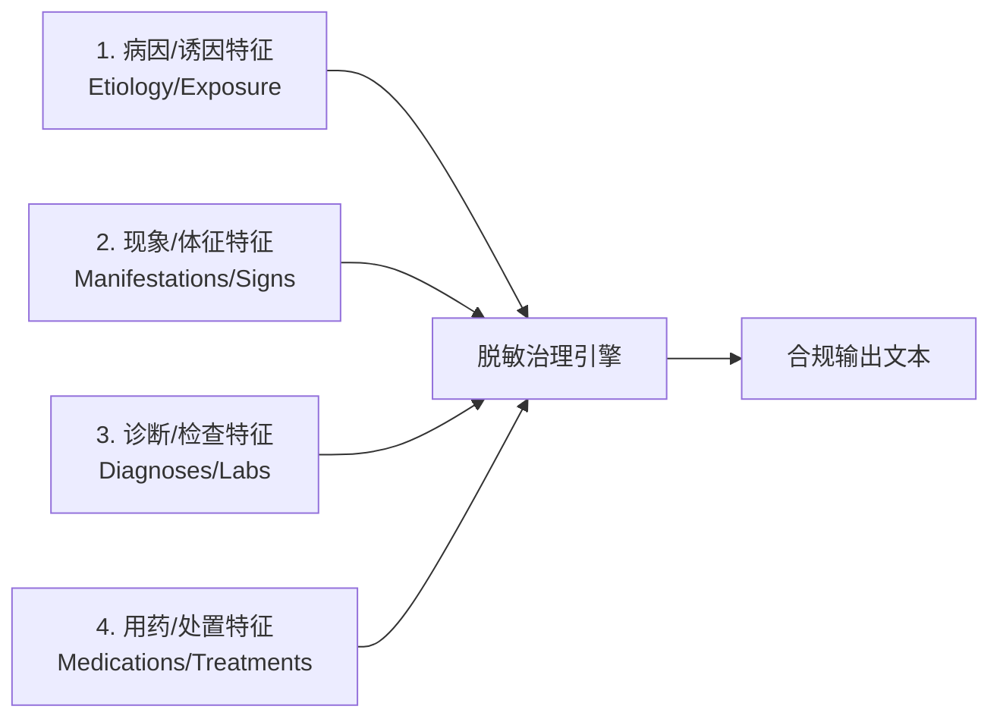

# 医疗健康数据隐私脱敏与泛化算法标准规范 (v2.0)
*(Medical Health Data Privacy Redaction & Generalization Algorithm Standard Specification v2.0)*

> **文档版本**：v2.0.0  
> **文档状态**：正式发布 / 行业标准规范  
> **适用范围**：医疗健康数据脱敏与泛化处理的算法设计、业务规则与合规审计  
> **更新时间**：2026-08-07  
> **设计方案引用**：技术实现与代码架构详见架构设计文档 [`docs/medical_pipeline/design.md`](file:///home/charles/code/sfwork/privacy-local-agent/docs/medical_pipeline/design.md)  
> **更高阶规范版本**：双模式（数据库批量 vs 单条流式）治理规范见 [`redaction_algorithm_specification_v3.md`](file:///home/charles/code/sfwork/privacy-local-agent/docs/medical_pipeline/redaction_algorithm_specification_v3.md)  
> **变更说明**：引入数据库批量处理与单条流式处理双模式差异比对；定义数据库 Batch K-匿名 (Mondrian) 与流式 K-匿名 (自适应层次树) 的不同适用场景；去技术细节化重构。

---

## 1. 标准概述与适用范围

### 1.1 规范背景与设计目标

在医疗数据治理、临床科研二次利用、跨机构数据共享及大模型（LLM）微调等场景中，医疗健康数据蕴含极高价值，但也存在泄露患者重大隐私的风险。数据中的隐私信息可分为两大类：

1. **个人身份信息（PII, Personally Identifiable Information）**：可直接或间接识别特定自然人的信息，如姓名、证件号码、联系方式、住址等；
2. **临床敏感信息（Clinical Sensitive Information）**：涉及重大高敏疾病的诊疗记录，如性病、恶性肿瘤、HIV/AIDS、重度精神障碍等。

### 1.2 双模式治理对比规范 (Database Batch vs Single-Record Streaming)

当脱敏算法运行于**数据库批量处理模式**与**单条流式处理模式**时，由于数据上下文差异，执行以下分工规范：

| 算法维度 | 数据库批量处理模式 (Database Batch Mode) | 单条数据流式处理模式 (Single-Record Streaming Mode) |
|---|---|---|
| **应用场景** | 数据库静态脱敏、数据仓库离线治理、批量 ETL 导出 | Sidecar 代理、API 网关拦截、大模型 Prompt 实时过滤 |
| **K-匿名 (K-Anonymity)** | **全局多维 Mondrian 分割算法**：基于整表中位数切分等价类，数学求解全局最优匿名块（$K \ge 5$），信息损失极小 | **自适应分段树泛化 (`adaptive_age_hierarchy`)**：无需全局上下文，基于静态分段映射（如 $<60$ 岁 3 岁区间），零延迟即时响应 |
| **差分隐私 (DP)** | **中心化差分隐私 (Central DP)**：数据库全局聚合直方图加噪，全局预算 $(\epsilon, \delta)$ 记账 | **局部差分隐私 (Local DP / LDP)**：客户端/代理端流出前随机化微扰 |
| **脱敏一致性** | **数据库级加盐全局哈希 (HMAC-Salt)**：静态库全域构建一致性映射表 | **分布式缓存 / Session 映射 (Redis)**：会话内一致性映射 |

---

## 2. 核心治理原则

本规范建立在三大核心治理原则之上。

### 2.1 四柱强剥离原则 (Four-Pillar Erasure Principle)

对于重大高敏疾病（L4/L5 级），脱敏不能仅依赖显式疾病名称，必须全链条擦除四类强相关特征，严防通过上下文反推高敏病史：

**四柱特征范畴定义：**

| 柱序 | 特征类型 | 典型包含内容 |
|---|---|---|
| **第一柱** | **病因/诱因特征** | 不洁性接触史、高危接触史、输血史、针刺伤、特定基因突变（如 HTT 基因 CAG 重复扩增）等 |
| **第二柱** | **现象/体征特征** | 外阴/会阴/肛周多发赘生物伴瘙痒（菜花状/鸡冠状/乳头状）、无痛性溃疡(硬下疳)、命令性幻听、舞蹈样动作等 |
| **第三柱** | **诊断/检查特征** | 醋酸白试验阳性、TPPA/RPR 滴度阳性、HPV 高危型阳性、CD4+ 计数、HBV-DNA 载量、病理活检提示等 |
| **第四柱** | **用药/处置特征** | CO2 激光灼除术、咪喹莫特乳膏外用、ART 抗逆转录治疗(替诺福韦+拉米夫定)、奥氮平片、四苯嗪、恩替卡韦等 |

### 2.2 差异化治理矩阵 (Differential Governance Matrix)

系统根据信息的**社会污名化风险与临床科研价值**，自动路由执行差异化治理策略：

| 治理策略 | 适用范畴 | 自动化处理行为 | 合规与临床理由 |
|---|---|---|---|
| **彻底抹平 (Purge Only)** | 性传播疾病 (STD)、HIV/AIDS、重度精神障碍 | 100% 自动整句/整块擦除，绝不泛化为任何大类词 | 极高社会污名化风险。即使泛化为"免疫系统疾病"，结合部位与用药依然极易被推断，**零痕迹擦除是唯一安全解**。 |
| **范畴化泛化 (Generalization Allowed)** | 恶性肿瘤、病毒性肝炎、罕见遗传缺陷、严重器官衰竭 | 自动重构降级为 L1/L2 通用器官/系统大类疾病 | 在临床科研与流行病学统计中具有极高的家族史价值。重构为"消化道疾病"、"肝脏疾病"，既屏蔽了高敏风险，又保留了科研价值。 |
| **PII 脱敏 (PII Protection)** | 姓名、身份证、电话、住址、医疗标识等 | 按类型执行掩码、替换、泛化或截断 | 阻断身份识别链路，防止直接定位自然人。 |
| **原样保留 (Keep As-Is)** | 常规慢性病（高血压、糖尿病）、通用诊疗描述 | 零篡改原样保留 | 保障基础临床诊疗与通用科研效用。 |

---

## 3. 个人身份信息（PII）与媒体路径脱敏规范

### 3.1 PII 分类体系与脱敏策略

| 类别编号 | PII 类型 | 典型示例 | 掩码/泛化处理规则 |
|---|---|---|---|
| **PII-01** | 姓名 | 张三、欧阳六六 | 二字：`张*`；三字及以上：`张*明`；复姓：`欧阳**` |
| **PII-02** | 证件号码 | 身份证号、护照号 | 身份证号：保留前 3 位（地区）+ 后 4 位，中间 11 位掩码为 `*`（如 `110***********1234`） |
| **PII-03** | 联系方式 | 手机号、座机号 | 手机号：保留前 3 后 4，中间 4 位掩码（如 `138****5678`） |
| **PII-04** | 住址信息 | 户籍地址、详细住址 | 泛化保留至省/市级（如`广东省广州市`），擦除门牌号及以下精度 |
| **PII-05** | 日期信息 | 出生日期、入院日期 | 精确到日 $\rightarrow$ 泛化为年月；年龄执行 K-匿名 |
| **PII-06** | 医疗标识 | 病历号、医保卡号、残疾证号 | 长度 $>6$ 时保留前 4 后 2、中间掩码；短串全掩码 |

### 3.2 图像与文件路径脱敏规范 (Medical Image & Path Sanitization)

1. **文件/URL 路径敏感词清洗**：检测并替换路径中包含的高敏病种英文与拼音词汇（如 `syphilis`, `hiv`, `aids`, `cancer`, `tumor`, `hepatitis` 等）。
2. **Data URI 与图像马赛克覆盖**：定位目标文本框（Bounding Box）区域实施马赛克遮盖；DICOM 文件清理 Header 中的 PII 字段。

---

## 4. 临床敏感信息脱敏与句法重构规范

### 4.1 三层冲突仲裁规约 (Consensus & Arbitration Standard)

1. **最高覆盖权原则 (Rule Precedence Rule)**：规则引擎识别出的 L4/L5 级判定具有最高硬性覆盖权（一票否决权），后续模型不得降低判定。
2. **增量集合并原则 (NER Augmentation Rule)**：实体识别引擎识别出的词库表外实体，作为增量补集加入擦除矩阵。
3. **Fail-Closed 降级原则 (Fail-Closed Thresholding)**：模型置信度 $<0.75$ 时自动触发 Fail-Closed 降级整值替换。

### 4.2 形式化死因重构与句法映射矩阵

| 原始死因句型结构 | 句法特征示例 | 规范重构输出 | 映射算法与自愈行为 |
|---|---|---|---|
| **特定死因动词 + 高敏病名 + 年龄** | `外婆殁于'亨廷顿舞蹈病'(50岁)` | `外婆殁于48岁` | 保留死因动词 `殁于` + 切除高敏病名 + 年龄 K-匿名泛化 |
| **特定死因动词 + 高敏病名 (无年龄)** | `伯父殁于'胃癌'` | `伯父因病去世` | 动词补全与自愈，重构为自然汉语 `因病去世` |
| **介词 + 高敏病名 + 复合死因 + 去世** | `伯父由'食管静脉曲张'破裂出血导致去世` | `伯父因病去世` | 整句捕获 `由...破裂出血导致去世`，替换为 `因病去世` |
| **介词 + 高敏病名 + 并发症 + 去世** | `因'HIV'导致的并发症去世` | `因病去世` | 捕获 `因...并发症去世`，重构为 `因病去世` |
| **亲属 + 悬空死因动词 (擦除后残渣)** | `外婆殁于` / `伯父死于` | `外婆因病去世` / `伯父因病去世` | 语法自愈修复悬空动词 |

---

## 5. 综合脱敏案例库

| 案例 | 场景分类 | 原始文本输入 | 规范脱敏结果输出 |
|---|---|---|---|
| **Case 1** | 隐式性病主诉 | `患者1月前发现外阴多发菜花状赘生物，醋酸白试验阳性。行CO2激光灼除术。` | `""` |
| **Case 2** | 乙肝化验与医嘱 | `体检发现ALT 120U/L，HBsAg阳性。诊断'慢性乙型病毒性肝炎'，建议启动恩替卡韦治疗。` | `体检发现ALT 120U/L。` |
| **Case 3** | 家族肿瘤史 | `父亲死于'胃癌'(62岁)，母亲患'乳腺癌'(55岁)。家族有消化道肿瘤聚集倾向。` | `父亲死于62岁，母亲患病(54岁)。家族有消化道疾病聚集倾向。` |
| **Case 4** | HIV 极高敏 | `查出HIV抗体阳性，CD4+细胞180/μL。行抗逆转录治疗。` | `""` |
| **Case 5** | 复杂复合并发死因 | `外婆殁于'亨廷顿舞蹈病'(50岁)，伯父由'食管静脉曲张'破裂出血导致去世。母亲患'2型糖尿病'。` | `外婆殁于48岁，伯父因病去世。母亲患'2型糖尿病'。` |

---

*标准规范 v2.0 结束。*
