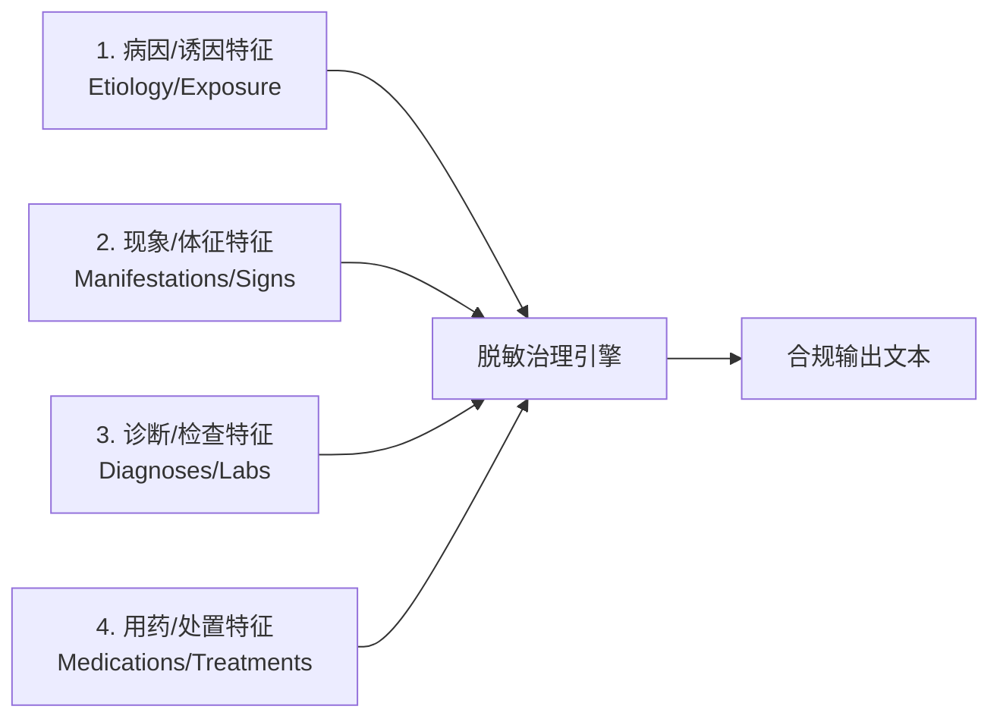
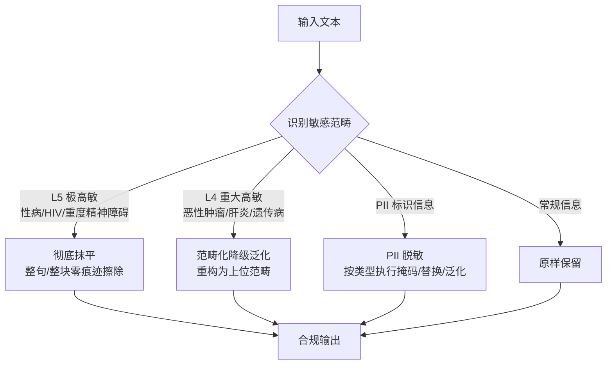
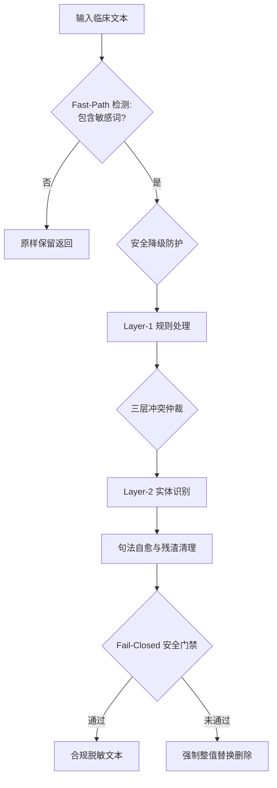
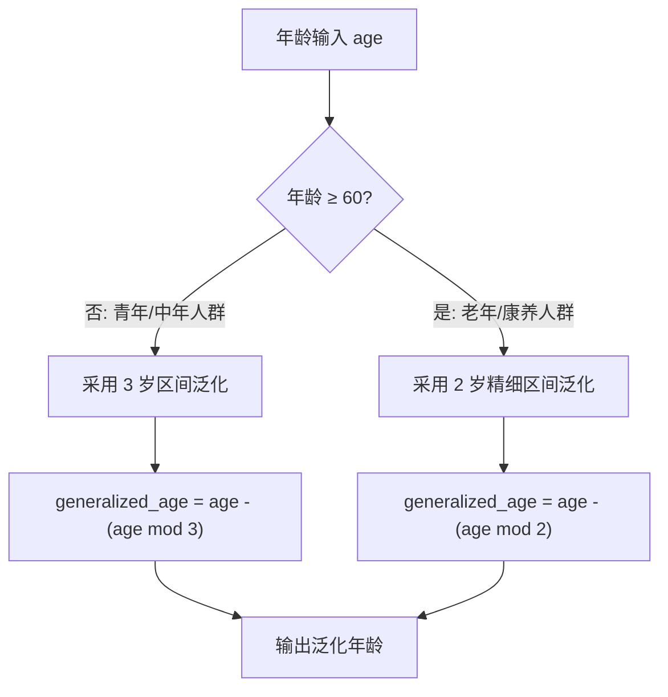

# 医疗健康数据隐私脱敏与泛化算法标准规范 (v2.0)
*(Medical Health Data Privacy Redaction & Generalization Algorithm Standard Specification v2.0)*

> **文档版本**：v2.0.0  
> **文档状态**：正式发布 / 行业标准规范  
> **适用范围**：医疗健康数据脱敏与泛化处理的算法设计、业务规则与合规审计  
> **更新时间**：2026-08-07  
> **设计方案引用**：技术实现与代码架构详见架构设计文档 [`docs/medical_pipeline/design.md`](file:///home/charles/code/sfwork/privacy-local-agent/docs/medical_pipeline/design.md)  
> **变更说明**：规范去技术细节化重构——彻底剥离 Python 代码实现细节、函数名与正则表达式源码；聚焦于业务规则、合规标准、形式化映射矩阵与字段级治理逻辑。

---

## 1. 标准概述与适用范围

### 1.1 规范背景与设计目标

在医疗数据治理、临床科研二次利用、跨机构数据共享及大模型（LLM）微调等场景中，医疗健康数据蕴含极高价值，但也存在泄露患者重大隐私的风险。数据中的隐私信息可分为两大类：

1. **个人身份信息（PII, Personally Identifiable Information）**：可直接或间接识别特定自然人的信息，如姓名、证件号码、联系方式、住址等；
2. **临床敏感信息（Clinical Sensitive Information）**：涉及重大高敏疾病的诊疗记录，如性病、恶性肿瘤、HIV/AIDS、重度精神障碍等。

本规范旨在建立一套**零隐私泄漏、语义自然流畅、兼顾临床科研效用**的自动化脱敏（Redaction）与范畴化泛化（Generalization）标准规范体系。

**核心设计目标：**

| 目标维度 | 规范要求与说明 |
|---|---|
| **零隐私泄漏** | 脱敏后文本不得残留任何可还原或可推断的高敏隐私痕迹 |
| **语义自然性** | 脱敏后文本应保持语句通顺流畅，不产生语法断裂与孤立残渣 |
| **科研效用保留** | 在安全前提下最大限度保留临床科研价值与家族病史特征 |
| **抗绕过能力** | 全面抵御全半角变体、拼音/形近混写、分隔符插入等规避手段 |
| **Fail-Closed 兜底** | 任何检测异常或高敏词残留场景，强制执行安全的整值替换或切除 |

### 1.2 合规基线与适用标准

本规范遵循以下国内外数据安全与医疗隐私标准：

| 标准编号 | 标准名称 | 适用维度 |
|---|---|---|
| GB/T 35273-2020 | 《信息安全技术 个人信息安全规范》 | PII 分类与脱敏基线 |
| GB/T 43697-2024 | 《信息安全技术 数据安全技术 数据分类分级规则》 | 数据分级框架 |
| DB51/T 2989-2023 | 《四川省健康医疗大数据应用指南》 | 医疗健康数据分级分类 |
| HIPAA Safe Harbor | 美国《健康保险流通与责任法案》安全港方法 | PII 18 类标识符脱敏 |
| HIPAA Expert Determination | 专家判定方法 | 风险评估与泛化策略 |
| GDPR Art. 25/32 | 欧盟《通用数据保护条例》 | 数据保护设计与默认设定 |

### 1.3 术语定义

| 术语 | 定义说明 |
|---|---|
| **脱敏抹平 (Purge/Redaction)** | 将敏感信息整句或整块删除，不留任何替代文本或反推线索 |
| **范畴化泛化 (Generalization)** | 将具体敏感值替换为上位范畴词（如"胃癌" $\rightarrow$ "消化道疾病"） |
| **四柱特征 (Four-Pillar Features)** | 病因、体征、诊断、用药四类与高敏疾病强关联的敏感特征 |
| **准标识符 (Quasi-Identifier, QI)** | 单独不能唯一标识但组合后可标识个体的属性（如年龄+性别+地区） |
| **K-匿名 (K-Anonymity)** | 泛化后任一准标识符组合在集合中至少对应 K 条记录 |
| **Fail-Closed** | 发生规则歧义或检测到残留风险时，选择拒绝/删除而非放行 |
| **语法自愈 (Syntax Self-Healing)** | 脱敏后自动修补残存语法碎片，保持句子结构完整 |

---

## 2. 核心治理原则

本规范建立在三大核心治理原则之上。

### 2.1 四柱强剥离原则 (Four-Pillar Erasure Principle)

对于重大高敏疾病（L4/L5 级），脱敏不能仅依赖显式疾病名称，必须全链条擦除四类强相关特征，严防通过上下文反推高敏病史：

**四柱特征范畴定义：**

| 柱序 | 特征类型 | 典型包含内容 |
|---|---|---|
| **第一柱** | **病因/诱因特征** | 不洁性接触史、高危接触史、输血史、针刺伤、特定基因突变（如 HTT 基因 CAG 重复扩增）等 |
| **第二柱** | **现象/体征特征** | 外阴/会阴/肛周多发赘生物伴瘙痒（菜花状/鸡冠状/乳头状）、无痛性溃疡(硬下疳)、命令性幻听、舞蹈样动作等 |
| **第三柱** | **诊断/检查特征** | 醋酸白试验阳性、TPPA/RPR 滴度阳性、HPV 高危型阳性、CD4+ 计数、HBV-DNA 载量、病理活检提示等 |
| **第四柱** | **用药/处置特征** | CO2 激光灼除术、咪喹莫特乳膏外用、ART 抗逆转录治疗(替诺福韦+拉米夫定)、奥氮平片、四苯嗪、恩替卡韦等 |

### 2.2 差异化治理矩阵 (Differential Governance Matrix)

系统根据信息的**社会污名化风险与临床科研价值**，自动路由执行差异化治理策略：

| 治理策略 | 适用范畴 | 自动化处理行为 | 合规与临床理由 |
|---|---|---|---|
| **彻底抹平 (Purge Only)** | 性传播疾病 (STD)、HIV/AIDS、重度精神障碍 | 100% 自动整句/整块擦除，绝不泛化为任何大类词 | 极高社会污名化风险。即使泛化为"免疫系统疾病"或"皮肤粘膜疾病"，结合部位与用药依然极易被推断，**零痕迹擦除是唯一安全解**。 |
| **范畴化泛化 (Generalization Allowed)** | 恶性肿瘤、病毒性肝炎、罕见遗传缺陷、严重器官衰竭 | 自动重构降级为 L1/L2 通用器官/系统大类疾病 | 在临床科研与流行病学统计中具有极高的家族史价值。重构为"消化道疾病"、"肝脏疾病"，既屏蔽了高敏风险，又保留了科研价值。 |
| **PII 脱敏 (PII Protection)** | 姓名、身份证、电话、住址、医疗标识等 | 按类型执行掩码、替换、泛化或截断 | 阻断身份识别链路，防止直接定位自然人。 |
| **原样保留 (Keep As-Is)** | 常规慢性病（高血压、糖尿病）、通用诊疗描述 | 零篡改原样保留 | 保障基础临床诊疗与通用科研效用。 |

---

## 3. 个人身份信息（PII）与媒体路径脱敏规范

### 3.1 PII 分类体系与脱敏策略

依据 HIPAA Safe Harbor 18 类标识符及 GB/T 35273-2020，定义以下 PII 分类与处理规范：

| 类别编号 | PII 类型 | 典型示例 | 掩码/泛化处理规则 |
|---|---|---|---|
| **PII-01** | 姓名 | 张三、欧阳六六 | 二字：`张*`；三字及以上：`张*明`；复姓：`欧阳**` |
| **PII-02** | 证件号码 | 身份证号、护照号 | 身份证号：保留前 3 位（地区）+ 后 4 位，中间 11 位掩码为 `*`（如 `110***********1234`） |
| **PII-03** | 联系方式 | 手机号、座机号 | 手机号：保留前 3 后 4，中间 4 位掩码（如 `138****5678`） |
| **PII-04** | 住址信息 | 户籍地址、详细住址 | 泛化保留至省/市级（如`广东省广州市`），擦除门牌号及以下精度 |
| **PII-05** | 日期信息 | 出生日期、入院日期 | 精确到日 $\rightarrow$ 泛化为年月（如 `2024-03`）；年龄执行分段 K-匿名 |
| **PII-06** | 医疗标识 | 病历号、医保卡号、残疾证号 | 长度 $>6$ 时保留前 4 后 2、中间掩码；短串全掩码 |

### 3.2 图像与文件路径脱敏规范 (Medical Image & Path Sanitization)

在医疗数据流中，除了纯文本与结构化属性外，还可能包含附件路径、医学影像引用与 Data URI（Base64）图像编码。为严防通过文件名或图像元数据绕过脱敏，遵循以下标准：

1. **文件/URL 路径敏感词清洗**：
   检测并替换路径中包含的高敏病种英文与拼音词汇（如 `syphilis`, `hiv`, `aids`, `cancer`, `tumor`, `hepatitis` 等）。
   - *标准处理示例*：`/data/medical_records/syphilis_check_01.jpg` $\rightarrow$ `/data/medical_records/sanitized_case_image_01.jpg`
2. **Data URI 与图像马赛克覆盖**：
   - 对包含高敏文字（如化验单上的 L4/L5 诊断或 PII 标识）的图像，定位目标文本框（Bounding Box）区域实施马赛克或黑色掩码遮盖；
   - 对 DICOM 影像文件，清理 Header 元数据中的患者姓名、身份证号、医疗机构标识及检查日期等 PII 字段。

---

## 4. 临床敏感信息脱敏与句法重构规范

### 4.1 编排架构与冲突仲裁规约

脱敏处理采用三级漏斗编排机制（规则引擎 $\rightarrow$ 命名实体识别 $\rightarrow$ 大模型语义仲裁）：

**三层冲突仲裁规约 (Consensus & Arbitration Standard)：**

1. **最高覆盖权原则 (Rule Precedence Rule)**：
   规则引擎识别出的 L4/L5 级判定具有最高硬性覆盖权（一票否决权），后续实体识别或模型推理只能追加擦除实体，不得降低或撤销规则引擎的风险判定。
2. **增量集合并原则 (NER Augmentation Rule)**：
   实体识别引擎识别出的词库表外实体（如新上市特异性抗病毒药物、罕见并发症），作为增量补集加入擦除矩阵，执行定点抹平。
3. **Fail-Closed 降级原则 (Fail-Closed Thresholding)**：
   大模型推理置信度小于门禁阈值（默认 `0.75`）或输出不确定时，自动触发 Fail-Closed 安全防护，强制将该文本判定为高敏感级并执行安全占位替换。

### 4.2 顺序编排与八步句法重构 (8-Step Order-Enforced Pipeline)

为防止范畴擦除提前切除敏感病名导致死因动词悬空（如 `外婆殁于` 残渣），脱敏处理严格执行**句法优先**的 8 步编排顺序：

| 步骤 | 编排环节 | 处理逻辑与规范要求 |
|---|---|---|
| **Step 1** | **死因短语整体自然重构** | 优先整句捕获死因描述（含`殁于/死于/身亡于/病逝于/离世于/由...破裂出血导致去世/因...并发症去世`），整句重构为自然汉语 |
| **Step 2** | **死因/患病年龄 K-匿名** | 处理包含死亡或发病年龄的句式，剥离病名的同时对年龄施加自适应 K-匿名 |
| **Step 3** | **特异性用药与处置擦除** | 绑定前缀（口服/给予/启动...）、剂量用法或后缀（抗病毒治疗/控制症状），整句擦除 |
| **Step 4** | **就诊机构与独立诊断擦除** | 擦除机构名称及独立诊断短语（如`曾就诊于精神卫生中心，诊断为...` $\rightarrow$ `""`） |
| **Step 5** | **特征体征与现象擦除** | 定点擦除四柱特征中的现象与体征描述（如赘生物、溃疡、命令性幻听等） |
| **Step 6** | **综合句法擦除与范畴化泛化** | 对适宜泛化的病种重构为通用器官系统疾病；对禁止泛化范畴执行整句彻底抹平 |
| **Step 7** | **裸词与既往史擦除** | 清除残留的独立病名裸词与既往病史描述（如`慢性...病史4年` $\rightarrow$ `病史4年`） |
| **Step 8** | **语法自愈与残渣清理** | 消除孤立残存的介词、连词、无宾语动词、空括号与死标点，保证语句自然通顺 |

### 4.3 形式化死因重构与句法映射矩阵 (Formal Death Cause Rewrite Matrix)

为保证脱敏文本在各种死因表达下均能精准映射、零语病残渣，规范定义以下形式化死因映射逻辑表：

| 原始死因句型结构 | 句法特征示例 | 规范重构输出 | 映射算法与自愈行为 |
|---|---|---|---|
| **特定死因动词 + 高敏病名 + 年龄** | `外婆殁于'亨廷顿舞蹈病'(50岁)` | `外婆殁于48岁` | 保留死因动词 `殁于` + 切除高敏病名 + 年龄 K-匿名泛化 |
| **特定死因动词 + 高敏病名 (无年龄)** | `伯父殁于'胃癌'` | `伯父因病去世` | 动词补全与自愈，重构为自然汉语 `因病去世` |
| **介词 + 高敏病名 + 复合死因 + 去世** | `伯父由'食管静脉曲张'破裂出血导致去世` | `伯父因病去世` | 整句捕获 `由...破裂出血导致去世`，替换为 `因病去世` |
| **介词 + 高敏病名 + 并发症 + 去世** | `因'HIV'导致的并发症去世` | `因病去世` | 捕获 `因...并发症去世`，重构为 `因病去世` |
| **特定死因动词 + 高敏病名 + 去世** | `父亲死于'恶性肿瘤'去世(65岁)` | `父亲死于64岁` | 消除冗余 `去世`，保留 `死于` 动词 + 年龄泛化 |
| **亲属 + 悬空死因动词 (擦除后残渣)** | `外婆殁于` / `伯父死于` | `外婆因病去世` / `伯父因病去世` | 语法自愈修复悬空动词，输出自然语句 |

---

## 5. 准标识符泛化与范畴化降级规范

### 5.1 单条记录自适应年龄 K-匿名泛化算法 (Adaptive Age Hierarchy)

传统的 Mondrian 等 K-匿名算法依赖整批数据集划分子集，在单条记录流式处理场景无法直接应用。本规范定义**单条记录自适应分段年龄 K-匿名泛化算法**：

**分段泛化准则：**

| 人群划定 | 区间大小 | 数学公式 | 合规与临床理由 |
|---|---|---|---|
| **$< 60$ 岁人群** | **3 岁区间** | $\text{age} - (\text{age} \bmod 3)$ | 青年与中年人群年龄精细度对基础健康建议影响较小，采用较宽区间提供更强匿名保护 |
| **$\ge 60$ 岁人群** | **2 岁区间** | $\text{age} - (\text{age} \bmod 2)$ | 老年康养与慢病预防场景中年龄是核心因子，采用较窄精细区间以保障临床效用 |

**泛化输出示例：**
- 30、31、32 岁 $\rightarrow$ 统一泛化为 **`30岁`**
- 60、61 岁 $\rightarrow$ 统一泛化为 **`60岁`**
- 62、63 岁 $\rightarrow$ 统一泛化为 **`62岁`**

### 5.2 范畴化降级泛化映射体系

针对允许泛化的重大高敏范畴，定义以下规范泛化映射关系：

| 原始病种范畴 | 泛化目标范畴 | 适用上下文条件 | 示例处理输出 |
|---|---|---|---|
| 消化道恶性肿瘤 | 消化道疾病 | 家族史、聚集倾向、病史 | `家族中有明显消化道肿瘤聚集倾向` $\rightarrow$ `家族中有明显消化道疾病聚集倾向` |
| 呼吸系统恶性肿瘤 | 呼吸系统疾病 | 家族史、病史 | `有呼吸系统肿瘤家族史` $\rightarrow$ `有呼吸系统疾病家族史` |
| 生殖系统恶性肿瘤 | 生殖系统疾病 | 家族史 | `母系有生殖系统肿瘤史` $\rightarrow$ `母系有生殖系统疾病史` |
| 神经系统恶性肿瘤 | 神经系统疾病 | 家族史 | `家族性神经系统肿瘤` $\rightarrow$ `家族性神经系统疾病` |
| 恶性肿瘤（无系统限定） | 相关系统疾病 | 通用兜底 | `有肿瘤家族史` $\rightarrow$ `有相关系统疾病家族史` |
| 病毒性肝炎（乙肝/丙肝） | 肝脏疾病 | 家族史、病史 | `有乙肝家族史` $\rightarrow$ `有肝脏疾病家族史` |
| 罕见遗传缺陷（亨廷顿舞蹈病） | 遗传性神经系统疾病 | 家族史 | `亨廷顿舞蹈病家族史` $\rightarrow$ `遗传性神经系统疾病家族史` |
| 严重器官衰竭（心梗/冠脉狭窄） | 心血管系统疾病 | 家族史 | `冠心病心肌梗死家族史` $\rightarrow$ `心血管系统疾病家族史` |

---

## 6. 综合脱敏案例库

本规范提供代表性脱敏案例，展示算法在不同场景下的预期输出：

| 案例 | 场景分类 | 原始文本输入 | 规范脱敏结果输出 | 合规与业务分析 |
|---|---|---|---|---|
| **Case 1** | 隐式性病主诉 | `患者1月前发现外阴多发菜花状赘生物，醋酸白试验阳性。行CO2激光灼除术。` | `""` | 四柱特征（体征+检查+处置）全擦除，彻底抹平 |
| **Case 2** | 乙肝化验与医嘱 | `体检发现ALT 120U/L，HBsAg阳性。诊断'慢性乙型病毒性肝炎'，建议启动恩替卡韦治疗。` | `体检发现ALT 120U/L。` | 保留常规肝功，擦除高敏诊断与特异性抗病毒医嘱 |
| **Case 3** | 家族肿瘤史 | `父亲死于'胃癌'(62岁)，母亲患'乳腺癌'(55岁)。家族有消化道肿瘤聚集倾向。` | `父亲死于62岁，母亲患病(54岁)。家族有消化道疾病聚集倾向。` | 范畴化泛化 + 患病年龄 K-匿名 |
| **Case 4** | HIV 极高敏 | `查出HIV抗体阳性，CD4+细胞180/μL。行抗逆转录治疗。` | `""` | L5 极高敏彻底抹平 |
| **Case 5** | 重度精神障碍 | `曾就诊于精神卫生中心，诊断为重度精神分裂症。存在命令性幻听。` | `""` | L5 诊断与体征整句消除 |
| **Case 6** | 罕见遗传病 | `基因检测提示亨廷顿舞蹈病(HTT基因CAG重复46次)。` | `""` | L5 遗传缺陷整块剥离 |
| **Case 7** | 常规慢病对照 | `原发性高血压病史10年，口服硝苯地平控释片。` | `原发性高血压病史10年，口服硝苯地平控释片。` | 非高敏信息原样保留 |
| **Case 8** | PII 姓名+身份证 | `患者张三，身份证号110101199001011234，联系电话13812345678。` | `患者张*，身份证号110***********1234，联系电话138****5678。` | PII 掩码脱敏 |
| **Case 9** | PII 地址+日期 | `患者住北京市朝阳区XX路123号，2024年3月15日入院。` | `患者住北京市朝阳区，2024年3月入院。` | 地址泛化 + 日期截断 |
| **Case 10** | 混合 PII+临床 | `患者李四，男，45岁，HIV抗体阳性，现住上海市浦东新区。` | `患者李*，男，45岁，现住上海市。` | PII 掩码 + 临床彻底抹平 + 地址泛化 |
| **Case 11** | 拼音/同音变体 | `患者自述有 aizi病 史1年` | `""` | 拼音变体识别 + 悬空时间状语清理 |
| **Case 12** | 大小写/分隔符混写 | `查出 H  I  V 阳性` | `""` | 字符归一化 + 分隔符容忍擦除 |
| **Case 13** | 复杂复合并发死因 | `外婆殁于'亨廷顿舞蹈病'(50岁)，伯父由'食管静脉曲张'破裂出血导致去世。母亲患'2型糖尿病'。` | `外婆殁于48岁，伯父因病去世。母亲患'2型糖尿病'。` | 整句死因重构 + 复合死因擦除 + 语法自愈 |

---

## 7. 质量评估与性能指标规范

### 7.1 输出安全门禁检测

脱敏输出须通过三级安全门禁检测：

| 检测级别 | 检测内容说明 | 触发动作 |
|---|---|---|
| **一级门禁** | 原始高敏词库扫描 | 标记并强制执行整值删除 |
| **二级门禁** | 归一化（全角/大小写）后扫描 | 捕获 `ＨＩＶ` 等变体，强制删除 |
| **三级门禁** | 剔除字符间噪声（空格/连字符/零宽字符）后扫描 | 捕获 `H I V`、`艾-滋-病` 变体，执行 Fail-Closed 占位替换 |

### 7.2 质量评估指标

| 指标名称 | 定义说明 | 目标标准值 |
|---|---|---|
| **召回率 (Recall)** | 敏感信息被正确擦除或泛化的比例 | $\ge 99.5\%$ |
| **精确率 (Precision)** | 擦除内容确为敏感信息的比例 | $\ge 95\%$ |
| **语法完整率** | 输出文本无语法断裂与残渣的比例 | $\ge 99\%$ |
| **误伤率** | 非敏感信息被误擦的比例 | $\le 2\%$ |
| **处理延迟 P99** | 99 分位处理耗时上限 | $\le 100\text{ms}$ |

### 7.3 长文本分句切片性能与吞吐基准 (Sub-Sentence Chunking Standards)

为保障在超长临床文本（如 $200 \sim 5000$ 字符的出院小结或现病史）下的处理延迟与内存稳定，执行以下分句切片性能规约：

| 文本长度范围 | 算法路由策略 | P99 延迟目标 | 内存与吞吐指标 |
|---|---|---|---|
| **短文本** ($\le 120$ 字符) | Fast-Path 规则 / 单次前向推理 | $\le 10\text{ms}$ | 零额外内存分配，吞吐 $\ge 1000\text{ req/s}$ |
| **中长文本** ($121 \sim 500$ 字符) | 自然标点分句 + 120 字符切片 | $\le 45\text{ms}$ | 吞吐 $\ge 200\text{ req/s}$，实体聚合去重无遗漏 |
| **超长文本** ($501 \sim 50,000$ 字符) | 智能分句 + 滑动窗口 (Overlap=20) | $\le 150\text{ms}$ | 内存峰值 $\le 50\text{MB}$，无内存泄露 |
| **巨型文本** ($> 50,000$ 字符) | 安全防回溯降级单次遍历擦除 | $\le 50\text{ms}$ | 防灾难性回溯保护（Fail-Closed） |

---

## 8. 典型字段模式应用示例 (Field Schema Application Example)

本章以一个典型的医疗健康评估数据集字段模式（包含 27 个字段）为例，说明本规范各章规则在结构化数据集上的字段级落地方法。

### 8.1 字段模式风险定级与治理路由

| 字段 Key | 字段中文名 | 风险定级 | 治理策略 | 规范依据 |
|---|---|---|---|---|
| `name` | 姓名 | 高 | PII 掩码（保留姓氏，名替换为 `*`） | §3.1 |
| `id_card_no` | 身份证号 | 极高 | PII 掩码（保留前 3 后 4，中间掩码） | §3.1 |
| `registered_address` | 户籍地址 | 高 | 泛化保留至省/市级，擦除门牌号 | §3.1 |
| `disability_cert_no` | 残疾证号 | 高 | PII 医疗标识掩码 | §3.1 |
| `medical_insurance_no` | 医保卡号 | 高 | PII 医疗标识掩码 | §3.1 |
| `age` | 年龄 | 中 | 单条记录自适应年龄 K-匿名泛化 | §5.1 |
| `gender` / `height` / `weight` | 性别/身高/体重 | 低 | 原样保留 | §2.2 |
| `diagnosis_name` | 诊断名称 | 特高 | L4/L5 彻底抹平或范畴化泛化；常规诊断保留 | §2.2、§5.2 |
| `chief_complaint` / `present_illness` | 主诉 / 现病史 | 特高 | 三层漏斗脱敏（死因重构 + 四柱剥离 + 语法自愈） | §4 |
| `past_history` / `family_history` | 既往史 / 家族史 | 高 | 四柱剥离 + 范畴化降级泛化（如`消化道肿瘤` $\rightarrow$ `消化道疾病`） | §4.2、§5.2 |
| `progress_note` | 病程记录 | 特高 | 文本抹平 L4/L5 描述 + 图像打码/路径敏感词清洗 | §3.2、§4 |
| `assess_time` / `progress_note_time` | 时间戳 | 中 | 日期泛化为年月（如 `2024-03`） | §3.1 |

---

*标准规范结束。*
