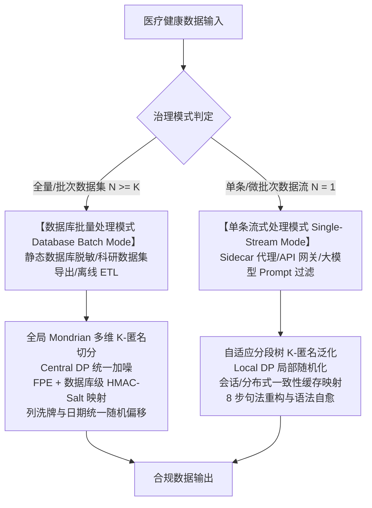
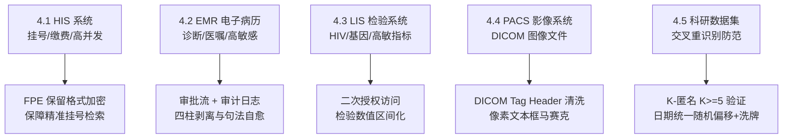
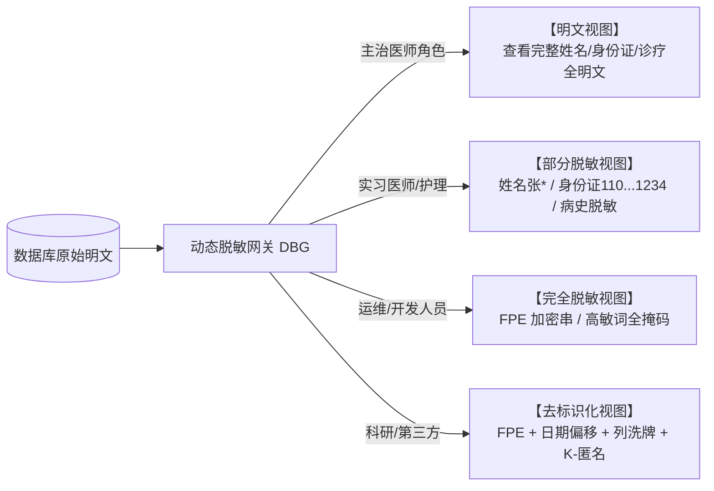

# 医疗健康数据隐私脱敏与泛化算法标准规范 (v3.0)
*(Medical Health Data Privacy Redaction & Generalization Algorithm Standard Specification v3.0)*

> **文档版本**：v3.0.0  
> **文档状态**：正式发布 / 行业标准规范  
> **适用范围**：医疗健康数据脱敏与泛化处理的算法设计、业务规则、数据库离线治理与单条流式代理合规审计  
> **更新时间**：2026-08-07  
> **法规基线**：国家卫健委、公安部、网信办等五部门《医疗卫生机构数据安全和个人信息保护管理办法（试行）》（国卫规划发〔2026〕6号）  
> **设计方案引用**：技术实现与代码架构详见架构设计文档 [`docs/medical_pipeline/design.md`](file:///home/charles/code/sfwork/privacy-local-agent/docs/medical_pipeline/design.md)  
> **变更说明**：引入五部门 2026 最新新规；建立 **6 类敏感字段×脱敏算法矩阵**；扩充 FPE (保留格式加密)、列洗牌 (Column Shuffle)、日期统一随机偏移 (Random Date Offset)、DICOM Tag 元数据清洗规范；建立 HIS / EMR / LIS / PACS / 科研数据集分系统脱敏实施方案与角色三视图访问控制标准；补全核心算法规则章（四柱剥离、PII 掩码一致性、八步句法重构、年龄 K-匿名、泛化映射、门禁与质量指标）；第 2 章重构为以 DB51/T 2989—2023 五级分级为基准，6 类高敏字段补充并入形成增强 L4/L5 标准。

---

## 1. 标准概述与适用法规基线

### 1.1 规范背景与法规要求

在医疗数据治理、数据仓库建设、临床科研二次利用、跨机构数据共享及大模型（LLM）微调等场景中，医疗健康数据包含高度敏感的个人信息与临床诊疗记录。

根据 2026 年 2 月国家卫健委、公安部、网信办等五部门联合发布的《医疗卫生机构数据安全和个人信息保护管理办法（试行）》（国卫规划发〔2026〕6号），以及《个人信息保护法》第28/51/53条、GB/T 22239-2019（等保2.0）：

**核心要求三原则：**
1. **存储加密（TDE）**：数据落在磁盘上时实施透明加密；
2. **访问脱敏（DBG / 动态脱敏）**：运维/开发人人员查库时动态脱敏，支持**角色三视图权限管控**；
3. **外发去标识（KTM / 静态脱敏）**：科研、教学、统计导出时执行静态不可逆去标识化，防交叉比对重识别。

---

## 2. 四川省五级分级基准与 6 类敏感字段映射 (DB51 Baseline & 6-Category Field Matrix)

本规范以 DB51/T 2989—2023《四川省健康医疗大数据应用指南》的五级分级体系为**唯一分级基准**，将本规范定义的 6 类敏感字段映射至该基准；其中高敏字段补充并入 L4/L5，形成 §2.3 的增强 L4/L5 标准。

### 2.1 DB51/T 2989—2023 五级分级基准

| 级别 | 级别名称 | 基准定义 |
|---|---|---|
| L1 | 公开数据 | 低敏感度或经脱敏的数据 |
| L2 | 内部数据 | 机构运营生产相关数据 |
| L3 | 敏感数据 | 个人标识与身份信息 |
| L4 | 高敏感数据 | 敏感病种与诊疗数据 |
| L5 | 极敏感数据 | 基因与遗传数据 |

### 2.2 6 类敏感字段的 DB51 基准映射与脱敏算法矩阵

下表以 DB51 级别归属为准，6 类敏感字段作为补充分类维度，并定义其脱敏推荐算法：

| 字段类别 | 典型字段示例 | DB51 级别归属 | 主要泄露风险 | 静态脱敏算法 (外发) | 动态脱敏算法 (访问) | 禁用算法 |
|---|---|---|---|---|---|---|
| **1. 身份标识** | 姓名、身份证号、医保卡号、病历号 | **L3**（与 L4/L5 诊疗信息构成组合集时就高） | 直接定位自然人 | **FPE (保留格式加密)** + HMAC 哈希 | 掩码（留首尾/后 4 位） | 直接删除 (破坏关联与索引) |
| **2. 联系方式** | 手机号、详细住址、紧急联系人 | **L3** | 骚扰、电信诈骗 | 文本截断（保留省市）+ 假值替换 | 掩码（中间 4 位掩码） | FPE (格式无检索意义) |
| **3. 诊疗信息** | 诊断名称、手术记录、用药方案 | **L4**（高敏病种）；常规诊疗 L2 | 社会歧视、敲诈 | **四柱强剥离 + 句法重构 + 列洗牌** | 角色分级三视图显示 | 全量掩码 (医生无法看病) |
| **4. 检验检查** | 基因数据、HIV、精神类指标 | **L4**；基因检测/HIV 确诊检测为 **L5** | 保险拒保、污名化 | **区间化 + 彻底抹平** | 二次授权 + 按权限显示 | 裸哈希 (无法做统计) |
| **5. 财务信息** | 医保账户、缴费记录、自费金额 | **L3**（金融账户） | 经济诈骗 | 假值替换 + 数值截断/泛化 | 金额掩码/范围显示 | 列洗牌 (导致金额对应错乱) |
| **6. 生物特征** | 指纹、人脸、虹膜、全基因组 | **L5**（比照基因数据管理） | 终身不可逆风险 | **严禁外发导出** | **禁止未经二次授权访问** | 任何可逆解密算法 |

### 2.3 增强 L4/L5 标准（6 类高敏字段补充并入）

在 DB51 基准之上，将 6 类敏感字段中的高敏项补充并入 L4/L5，形成本规范脱敏治理采用的增强标准：

**L4 高敏感数据（增强定义）：**

| 来源 | 纳入范畴 |
|---|---|
| DB51 基准 | 敏感病种与诊疗数据 |
| 类别 3 诊疗信息补充 | 社会污名化疾病（性病、HIV/AIDS、重度精神障碍）的诊断/手术/用药记录；恶性肿瘤、病毒性肝炎、罕见遗传病、严重器官衰竭诊疗记录 |
| 类别 4 检验检查补充 | CD4 计数、HBV-DNA 载量、精神类特异性指标、TPPA/RPR 血清学检测等高敏检验指标 |
| 类别 1 身份标识补充 | 身份标识与敏感病种的**组合集**（“谁+患何病”关联字段；单一标识仍为 L3） |

**L5 极敏感数据（增强定义）：**

| 来源 | 纳入范畴 |
|---|---|
| DB51 基准 | 基因与遗传数据 |
| 类别 4 检验检查补充 | 基因检测原始数据、检测结论与家族系谱遗传信息 |
| 类别 6 生物特征补充 | 指纹、人脸、虹膜等生物特征模板（终身不可逆，风险与基因数据等同） |
| 类别 3 诊疗信息补充 | 罕见遗传缺陷（如亨廷顿舞蹈病）诊疗记录及其基因检测关联信息 |

**并级规则：**

1. 字段同时涉及多类别时就高定级：DB51 基准优先，增强补充项从属；
2. L4/L5 判定直接驱动 §6.1 脱敏策略路由：L5 彻底抹平/严禁外发，L4 范畴化泛化或抹平；
3. 不满 14 周岁未成年人信息依法升级保护，涉及敏感病种时按不低于 L4 处理。

---

## 3. 双模式治理架构与技术拆分比对 (Dual-Mode Governance)

根据数据处理场景的部署形态与计算引擎差异，规范定义两大治理模式：

### 3.1 核心算法技术拆分比对

| 脱敏与隐私技术 | 数据库批量处理模式 (Database Batch Mode) | 单条数据流式处理模式 (Single-Record Streaming Mode) | 业务价值与算法说明 |
|---|---|---|---|
| **保留格式加密 (FPE)** | **数据库级 FPE (Format-Preserving Encryption)**：保持身份证/医保号完全一致的长度与数字形态。 | **动态 FPE 映射**：根据字段类型生成假值数字串。 | **支持精准相等匹配查询 (Exact Match Query)**，且密文不可逆推。 |
| **K-匿名 (K-Anonymity)** | **全局多维 Mondrian 分割算法**：按中位数递归切分 QI 维度，保证各等价类 $K \ge 5$，并校验 $l$-Diversity。 | **自适应分段层次树**：依据领域分段树（如 $<60$ 岁 3 岁区间）即时泛化。 | 数据库模式求解全局最优，信息损失极小；流式模式保障零延迟。 |
| **日期偏移 (Date Offset)** | **患者级日期统一随机偏移 (Random Date Offset)**：整表中同一患者的所有日期统一随机偏移 $N$ 天。 | **流式日期截断 (Date Truncation)**：精准日期转换为年月（如 `2024-03`）。 | 抹去绝对时间防时间交叉比对重识别，同时 100% 保留事件时间间隔。 |
| **列洗牌 (Column Shuffle)** | **科研列洗牌算子 (Column Shuffle)**：打乱诊断码、科室列对应关系。 | **句法范畴化泛化 (Categorical Generalization)**：重构为通用大类病种。 | 保持列级统计分布（均值、标准差）不变。 |

---

## 4. 医疗分系统（HIS / EMR / LIS / PACS / 科研）实施规范

医院内不同业务系统的访问模式与数据特征不同，须执行针对性实施方案：

### 4.1 HIS 系统 (医院信息系统)
* **数据特征**：高并发（门诊高峰 800~1500 并发），包含姓名、身份证号、挂号记录。
* **脱敏规范**：挂号查询依赖身份证精准匹配。禁止直接使用掩码覆盖导致查不到患者；必须使用 **FPE 保留格式加密** —— 加密后格式与长度不变，支持 SQL 精准匹配，但密文不可逆推。

### 4.2 EMR 系统 (电子病历)
* **数据特征**：诊断文本、手术记录、用药方案，敏感度极高。
* **脱敏规范**：
  1. 医生工作站采用**角色三视图**（主治医生看明文，实习医生看部分脱敏，行政人员看全脱敏）；
  2. 病历导出必须绑定**审批流 + SQL 级全量审计日志**，防止无审批越权导出。

### 4.3 LIS 系统 (检验信息系统)
* **数据特征**：包含 HIV、基因突变、精神类特异性指标。
* **脱敏规范**：HIV 及基因指标执行**二次授权访问控制**；科研导出时对 CD4 计数、HBV-DNA 载量执行数值区间化。

### 4.4 PACS 系统 (医学影像系统)
* **数据特征**：单文件 MB 至 GB 级 DICOM 影像文件。
* **脱敏规范**：
  * 脱敏重点在于 **DICOM Tag Header 元数据**。很多患者姓名、身份证号嵌入在 DICOM Header 中；导出影像前必须批量清理/修改 Tag Header 元数据；
  * 对影像像素中嵌有的文字化验单，定位文本框（Bounding Box）区域执行高斯模糊/马赛克覆盖。

### 4.5 科研数据集 (Research Datasets)
* **数据特征**：从多系统抽取的结构化/半结构化数据集。
* **防组合重识别规范**：
  1. 执行 **$K$-匿名验证 ($K \ge 5$)**，确保数据集中任意 QI 组合（如“特定科室+年龄段+罕见症状”）至少包含 5 条不可区分记录；
  2. 所有日期执行**同一患者统一随机天数偏移 (Random Date Offset)**；
  3. 诊断码与科室列执行**列洗牌 (Column Shuffle)**。

---

## 5. 角色三视图动态访问控制规范 (Role-Based Three-View Dynamic Masking)

在动态脱敏（DBG / 实时网关）场景中，数据库原始数据保持不变，系统根据访问者的角色权限动态呈现不同的数据视图：

**角色—视图映射要求：**

| 角色 | 授权视图 | 视图内容 | 适用场景 |
|---|---|---|---|
| 主治医师 | 明文视图 | 完整姓名/证件号/诊疗全文 | 临床诊疗必需，须留访问审计 |
| 实习医师/护理 | 部分脱敏视图 | 姓名掩码（如 `张*`）、证件号保留前 3 后 4、高敏病史脱敏 | 教学与辅助诊疗 |
| 运维/开发人员 | 完全脱敏视图 | 标识符呈 FPE 加密串、高敏词全掩码 | 查库排障，严禁见明文 |
| 科研/第三方 | 去标识化视图 | FPE + 日期偏移 + 列洗牌 + K-匿名 | 科研统计与对外共享 |

> **三视图口径说明**：动态脱敏域内标准视图为**明文 / 部分脱敏 / 完全脱敏**三档；“去标识化视图”属静态外发治理产物（见 §2 静态脱敏算法），由网关在科研/第三方通道上叠加呈现，不计入动态三视图序列。

---

## 6. 核心算法规则与文本脱敏规范

本章定义双模式共用的核心治理规则。本章为规范性规则定义，工程实现细节见架构设计文档。

### 6.1 四柱强剥离与差异化治理矩阵

对 L4/L5 重大高敏疾病，须全链条擦除四类强关联特征（四柱），严防通过上下文反推高敏病史：

| 柱序 | 特征类型 | 典型内容 |
|---|---|---|
| 第一柱 | 病因/诱因 | 不洁性接触史、高危接触史、输血史、特定基因突变 |
| 第二柱 | 现象/体征 | 外阴赘生物、无痛性溃疡（硬下疳）、命令性幻听、舞蹈样动作 |
| 第三柱 | 诊断/检查 | 醋酸白试验阳性、TPPA/RPR 阳性、CD4+ 计数、病毒载量 |
| 第四柱 | 用药/处置 | 特异性抗病毒/抗精神病药物、激光灼除术、抗逆转录治疗方案 |

基于四柱识别结果，按差异化治理矩阵路由：

| 治理策略 | 适用范畴 | 处理行为 | 合规理由 |
|---|---|---|---|
| 彻底抹平 (Purge Only) | 性传播疾病、HIV/AIDS、重度精神障碍 | 整句/整块零痕迹擦除，禁止泛化 | 极高社会污名化风险，任何泛化形式均可被推断还原 |
| 范畴化泛化 (Generalization) | 恶性肿瘤、病毒性肝炎、罕见遗传缺陷、严重器官衰竭 | 重构为 L1/L2 通用器官/系统大类疾病 | 保留家族史科研价值，屏蔽具体高敏病种 |
| PII 脱敏 | 姓名、证件号、联系方式、住址、医疗标识 | 按 §6.2 规则掩码/替换/泛化 | 阻断身份识别链路 |
| 原样保留 | 常规慢病（高血压、糖尿病）、通用诊疗描述 | 零篡改 | 保障临床与科研效用 |

### 6.2 PII 掩码与一致性规范

| 类别 | 默认规则 | 示例 |
|---|---|---|
| 姓名 | 二字保留首字；三字及以上保留首末字；复姓保留复姓 | `张*`、`张*明`、`欧阳**` |
| 证件号码 | 保留前 3 后 4，中间掩码 | `110***********1234` |
| 联系方式 | 手机号保留前 3 后 4；座机保留区号与后 2 位 | `138****5678` |
| 住址 | 泛化保留至省/市级，擦除门牌号及以下精度 | `广东省广州市` |
| 日期 | 批量场景按患者级统一随机偏移（§3.1）；流式场景泛化为年月；年龄按分段 K-匿名（§6.4） | `2024-03` |
| 医疗标识 | 长度 > 6 保留前 4 后 2、中间掩码；短串全掩码 | `3301********97` |

**一致性要求**：同一主体的姓名替换值、证件号掩码、日期偏移量在跨记录、跨文档间必须一致；映射表仅管控环境内留存，支持授权还原。

### 6.3 临床文本八步句法重构规范

为防止范畴擦除提前切除敏感病名导致死因动词悬空，文本脱敏严格执行**句法优先**的八步编排顺序：

1. **死因短语整体重构**：优先整句捕获死因表达，重构为自然汉语；
2. **死因/患病年龄 K-匿名**：剥离病名同时对年龄施加 §6.4 分段泛化；
3. **特异性用药与处置擦除**：绑定前缀（口服/给予/启动…）与后缀（抗病毒治疗/控制症状）整句擦除；
4. **就诊机构与独立诊断擦除**：专科机构与独立诊断短语整句消除；
5. **特征体征与现象擦除**：定点擦除四柱第二柱描述；
6. **综合句法擦除与范畴化泛化**：可泛化病种按 §6.5 映射重构；禁止泛化范畴整句抹平；
7. **裸词与既往史擦除**：清除残留独立病名裸词与既往病史片段；
8. **语法自愈与残渣清理**：消除空括号、死标点、孤立动词/介词；单字边界保护；无意义时间从句清空。

### 6.4 年龄分段 K-匿名泛化规则

| 人群 | 区间 | 泛化规则 | 理由 |
|---|---|---|---|
| < 60 岁 | 3 岁区间 | 泛化值 = age − (age mod 3) | 年龄精细度影响小，宽区间提供更强匿名保护 |
| ≥ 60 岁 | 2 岁区间 | 泛化值 = age − (age mod 2) | 老年康养场景年龄为核心因子，保留精细度 |

*示例*：30/31/32 岁 → `30岁`；60/61 岁 → `60岁`；62/63 岁 → `62岁`。

### 6.5 范畴化降级泛化映射与禁止泛化范畴

| 源范畴 | 泛化目标 | 触发上下文 |
|---|---|---|
| 消化道恶性肿瘤 | 消化道疾病 | 家族史、聚集倾向 |
| 呼吸系统恶性肿瘤 | 呼吸系统疾病 | 家族史、史 |
| 恶性肿瘤（无系统限定） | 相关系统疾病 | 通用兜底 |
| 病毒性肝炎 | 肝脏疾病 | 家族史、史 |
| 亨廷顿舞蹈病等遗传缺陷 | 遗传性神经系统疾病 | 家族史 |
| 急性心肌梗死/冠脉重度狭窄 | 心血管系统疾病 | 家族史 |
| 慢性阻塞性肺疾病 | 慢性呼吸系统疾病 | 家族史 |
| 尿毒症/肾功能衰竭 | 肾脏系统疾病 | 家族史 |

**泛化顺序**：系统专属规则先于通用兜底规则执行，防止张冠李戴。**禁止泛化范畴**：性传播疾病、HIV/AIDS、重度精神障碍——必须彻底抹平，严禁任何形式泛化。

### 6.6 输出安全门禁与质量指标

**三级输出门禁**：

| 级别 | 检测内容 | 触发动作 |
|---|---|---|
| 一级 | 原文高敏词回扫 | 强制整值删除 |
| 二级 | 归一化（全角/大小写）后回扫 | 捕获 `ＨＩＶ` 等变体，强制删除 |
| 三级 | 剔除字符间噪声后回扫 | 捕获 `H I V`、零宽字符插入变体，Fail-Closed 占位替换 |

**质量指标**：召回率 ≥ 99.5%；精确率 ≥ 95%；语法完整率 ≥ 99%；误伤率 ≤ 2%；处理延迟 P99 ≤ 100ms。

---

## 7. 综合脱敏案例库 (代表性案例)

| 案例 | 场景分类 | 原始文本输入 | 规范脱敏结果输出 | 治理算法与分系统规范 |
|---|---|---|---|---|
| **Case 1** | 身份标识 FPE | `身份证号: 110101199001011234` | `身份证号: 928374199001015678` | FPE 保留格式加密，支持精确检索，密文不可逆推 (HIS/等保) |
| **Case 2** | 科研日期偏移 | `2025-03-15 入院，2025-03-20 手术` | `2025-03-30 入院，2025-04-04 手术` | 日期统一随机偏移 15 天，保留 5 天时间间隔 (科研数据集) |
| **Case 3** | PACS 影像导出 | `DICOM Tag Header: PatientName='张三'` | `DICOM Tag Header: PatientName='ANON_001'` | DICOM Tag 元数据批量清洗 (PACS 影像) |
| **Case 4** | 隐式性病主诉 | `患者1月前发现外阴多发菜花状赘生物，醋酸白试验阳性。行CO2激光灼除术。` | `""` | 四柱特征（体征+检查+处置）全擦除，彻底抹平 |
| **Case 5** | 复杂复合并发死因 | `外婆殁于'亨廷顿舞蹈病'(50岁)，伯父由'食管静脉曲张'破裂出血导致去世。` | `外婆殁于48岁，伯父因病去世。` | 整句死因重构 + 语法自愈 (EMR 电子病历) |
| **Case 6** | PII 姓名+证件掩码 | `患者张三，身份证号110101199001011234，联系电话13812345678。` | `患者张*，身份证号110***********1234，联系电话138****5678。` | §6.2 PII 掩码规范（动态三视图部分脱敏档） |
| **Case 7** | 混合 PII+临床 | `患者李四，男，45岁，HIV抗体阳性，现住上海市浦东新区。` | `患者李*，男，45岁，现住上海市。` | PII 掩码 + L5 临床抹平 + 地址泛化 |
| **Case 8** | 常规慢病对照 | `原发性高血压病史10年，口服硝苯地平控释片。` | `原发性高血压病史10年，口服硝苯地平控释片。` | 非高敏信息零篡改原样保留（效用最大化） |

---

## 9. 医保结算数据模式 (`yibao.csv` 18 字段) 治理规约

本规范定义专门针对医保结算数据模式（`yibao.csv` 18 个标准字段）的字段分类分级与脱敏抹平治理映射表：

| 序号 | 字段中文名 | 英文 Key (`yibao.csv`) | 敏感等级 | 治理策略与算法说明 | 规范依据 |
|---|---|---|---|---|---|
| 1 | 医保结算流水号 | `insurance_settlement_id` | **L3 (高)** | PII 医疗标识掩码 / FPE 保留格式加密（如 `YB2025****5678`） | §4.1 |
| 2 | 人员唯一标识 | `person_id` | **L3 (高)** | 人员标识符 FPE 加密或确定性 HMAC-Salt 掩码（如 `PID****1234`） | §4.1 |
| 3 | 性别 | `gender` | **L1 (低)** | 原样保留 | §3.2 |
| 4 | 出生日期 | `birth_date` | **L2 (中)** | 日期截断为年月（如 `1990-01`）/ 自适应年龄 K-匿名 | §4.1, §6.2 |
| 5 | 入院日期 | `admission_date` | **L2 (中)** | 日期截断为年月 / 同一患者随机天数统一偏移 (Random Date Offset) | §4.1, §3.1 |
| 6 | 出院日期 | `discharge_date` | **L2 (中)** | 日期截断为年月 / 同一患者随机天数统一偏移 (保留住院天数差) | §4.1, §3.1 |
| 7 | 住院天数 | `length_of_stay` | **L1 (低)** | 原样保留 (数值型衍生属性) | §3.2 |
| 8 | 入院科室 | `admission_dept` | **L1 (低)** | 原样保留 / 离线科研模式下执行列洗牌 (Column Shuffle) | §3.2, §3.1 |
| 9 | 出院科室 | `discharge_dept` | **L1 (低)** | 原样保留 / 离线科研模式下执行列洗牌 (Column Shuffle) | §3.2, §3.1 |
| 10 | 定点医疗机构编码 | `hospital_code` | **L2 (中)** | 机构编码前缀保留+末尾掩码 (如 `H1101****`) | §4.1 |
| 11 | 医疗类别 | `medical_category` | **L1 (低)** | 原样保留 (如`住院`/`门特`) | §3.2 |
| 12 | 离院方式 | `discharge_mode` | **L1 (低)** | 原样保留 (如`医嘱离院`/`转院`) | §3.2 |
| 13 | 明细结算流水号 | `settlement_seq_no` | **L2 (中)** | 次级流水号遮蔽掩码 | §4.1 |
| 14 | 诊断序号 | `diagnosis_seq` | **L1 (低)** | 原样保留 (如 `1`, `2`, `3`) | §3.2 |
| 15 | 诊断类别 | `diagnosis_type` | **L1 (低)** | 原样保留 (如`主要诊断`/`次要诊断`) | §3.2 |
| 16 | 诊断编码 (ICD-10) | `icd10_code` | **L4~L5 (特高)** | **L4/L5 诊断编码映射剥离**（替换为范畴码如 `[L4-ICD-CHRONIC]`，L5 强抹平） | §3.2, §5.1 |
| 17 | 诊断名称 | `diagnosis_name` | **L4~L5 (特高)** | **L4/L5 彻底抹平 / 范畴化降级泛化**（按 3-Layer 漏斗处理文本） | §3.2, §5.1 |
| 18 | 入院病情 | `admission_condition` | **L2 (中)** | 敏感词扫描与部分掩码（如`危`/`重`/`一般`原样保留） | §3.2 |

---

*标准规范 v3.0 结束。*
