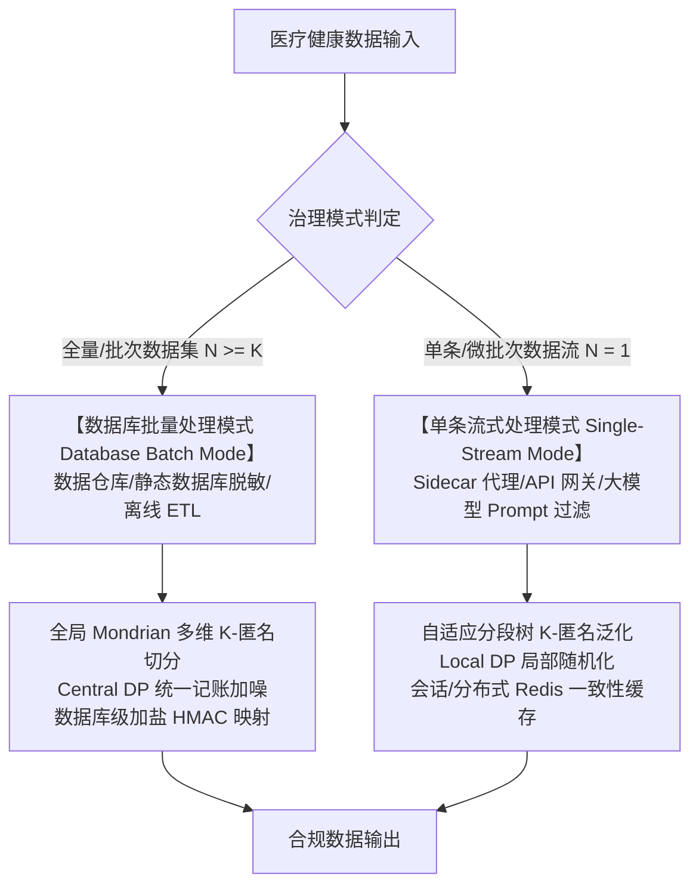
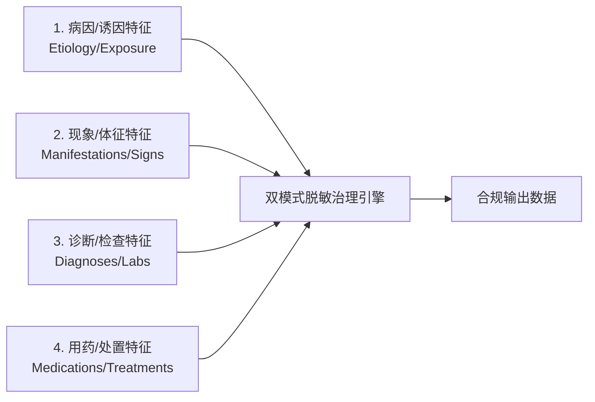

# 医疗健康数据隐私脱敏与泛化算法标准规范 (v3.0)
*(Medical Health Data Privacy Redaction & Generalization Algorithm Standard Specification v3.0)*

> **文档版本**：v3.0.0  
> **文档状态**：正式发布 / 行业标准规范  
> **适用范围**：医疗健康数据脱敏与泛化处理的算法设计、业务规则、数据库离线治理与单条流式代理合规审计  
> **更新时间**：2026-08-07  
> **设计方案引用**：技术实现与代码架构详见架构设计文档 [`docs/medical_pipeline/design.md`](file:///home/charles/code/sfwork/privacy-local-agent/docs/medical_pipeline/design.md)  
> **变更说明**：正式升级 v3.0 标准规范；重磅引入**双模式治理体系**——针对“数据库批量数据集处理 (Database Batch Mode)”与“单条数据流式处理 (Single-Record Streaming Mode / Sidecar)”分别定义治理算法、K-匿名划分、差分隐私与一致性哈希的拆分规约。

---

## 1. 标准概述与适用范围

### 1.1 规范背景与设计目标

在医疗数据治理、数据仓库建设、临床科研二次利用、跨机构数据共享及大模型（LLM）微调等场景中，医疗健康数据蕴含极高价值，但也存在泄露患者重大隐私的风险。数据中的隐私信息可分为两大类：

1. **个人身份信息（PII, Personally Identifiable Information）**：可直接或间接识别特定自然人的信息，如姓名、证件号码、联系方式、住址等；
2. **临床敏感信息（Clinical Sensitive Information）**：涉及重大高敏疾病的诊疗记录，如性病、恶性肿瘤、HIV/AIDS、重度精神障碍等。

本规范旨在建立一套**零隐私泄漏、语义自然流畅、兼顾临床科研效用、双模式全覆盖**的自动化脱敏（Redaction）与范畴化泛化（Generalization）标准规范体系。

### 1.2 双模式治理架构概述 (Dual-Mode Governance Architecture)

根据数据处理场景的部署形态与计算引擎差异，本规范将脱敏治理明确划分为两大模式：

| 处理模式 | 典型应用场景 | 数据规模与上下文 | 算法治理重心 |
|---|---|---|---|
| **数据库批量处理模式 (Database Batch Mode)** | 数据库静态脱敏、数据仓库离线治理、批量科研数据集导出 (ETL) | 全量数据集 ($N \ge K$)，具备完整的数据库整表上下文 | 基于整表全局分布求解**全局最优 Mondrian K-匿名切分**，降低信息损失；使用中心化差分隐私 (Central DP)；执行数据库级全局 HMAC-Salt 一致性脱敏。 |
| **单条数据流式处理模式 (Single-Record Streaming Mode)** | 侧边栏代理 (Sidecar Agent)、API 网关拦截、实时数据流过滤、大模型 Prompt 实时防护 | 单条或微批次数据 ($N = 1$)，无全局数据分布上下文 | 采用**自适应分段层次树泛化 (`adaptive_age_hierarchy`)**；采用局部差分隐私 (LDP)；基于分布式缓存维护短会话映射；保证微秒级响应与语法自愈。 |

---

## 2. 双模式脱敏与隐私保护技术拆分对比

当同一脱敏或隐私保护技术分别应用于**数据库批量处理**与**单条流式处理**时，其算法实现与适用规范存在显着差异：

| 隐私与脱敏技术 | 数据库批量处理模式 (Database Batch Mode) | 单条数据流式处理模式 (Single-Record Streaming Mode) | 算法差异与合规依据 |
|---|---|---|---|
| **K-匿名 (K-Anonymity)** | **全局多维 Mondrian 分割算法**：跨整表扫描所有准标识符 (QI)，基于中位数递归切分构建全局等价类，保证每块至少包含 $K$ 条记录 ($K \ge 5$)，并支持 $l$-Diversity 与 $t$-Closeness 校验。 | **自适应分段层次树泛化算法 (`adaptive_age_hierarchy`)**：无需全局上下文，依据领域安全分段树（如 $<60$ 岁 3 岁区间，$\ge 60$ 岁 2 岁区间）执行确定性区间映射。 | 数据库模式可求解全局最优解，信息损失极小；流式模式依赖静态分段树保证零延迟与确定性。 |
| **差分隐私 (Differential Privacy)** | **中心化差分隐私 (Central DP)**：利用全局聚合直方图统一注入 Laplace / Gaussian 噪声，并由全局隐私预算记账器 ($\epsilon, \delta$) 追踪累积消耗。 | **局部差分隐私 (Local DP / LDP)**：在数据流出客户端/代理前，对数值属性执行随机化响应 (Randomized Response) 或 RAPPOR 加噪。 | 中心化 DP 噪声小且精度高；LDP 不依赖信任中心但噪声稍大。 |
| **四柱与句法脱敏 (Four-Pillar & Syntax)** | **向量化正则与批量 SQL 清洗**：基于 SQL / Pandas / Spark 批量列运算执行高效正则表达式替换，吞吐量极大。 | **8 步顺序编排 + 分句切片 + 语法自愈**：引入滑动窗口切片（Sliding Window）与 `_clean_orphan_syntax` 悬空动词修补，确保单句通顺自然。 | 流式模式需要额外的语法自愈层，防止切除后出现孤立动词残渣。 |
| **脱敏一致性 (Consistency Mapping)** | **数据库级加盐全局哈希 (Global Salted HMAC)**：基于数据库统一 Salt 构建哈希字典，保证跨表、跨外键列 PII 脱敏 100% 全局可关联。 | **分布式缓存 / Session 映射 (Redis Cache)**：基于 Redis 或本地 FIFO 缓存共享短会话内一致性映射。 | 数据库模式保证静态库全域一致；流式模式保障动态会话内一致。 |

---

## 3. 核心治理原则

本规范建立在三大核心治理原则之上。

### 3.1 四柱强剥离原则 (Four-Pillar Erasure Principle)

对于重大高敏疾病（L4/L5 级），脱敏不能仅依赖显式疾病名称，必须全链条擦除四类强相关特征，严防通过上下文反推高敏病史：

**四柱特征范畴定义：**

| 柱序 | 特征类型 | 典型包含内容 |
|---|---|---|
| **第一柱** | **病因/诱因特征** | 不洁性接触史、高危接触史、输血史、针刺伤、特定基因突变（如 HTT 基因 CAG 重复扩增）等 |
| **第二柱** | **现象/体征特征** | 外阴/会阴/肛周多发赘生物伴瘙痒（菜花状/鸡冠状/乳头状）、无痛性溃疡(硬下疳)、命令性幻听、舞蹈样动作等 |
| **第三柱** | **诊断/检查特征** | 醋酸白试验阳性、TPPA/RPR 滴度阳性、HPV 高危型阳性、CD4+ 计数、HBV-DNA 载量、病理活检提示等 |
| **第四柱** | **用药/处置特征** | CO2 激光灼除术、咪喹莫特乳膏外用、ART 抗逆转录治疗(替诺福韦+拉米夫定)、奥氮平片、四苯嗪、恩替卡韦等 |

### 3.2 差异化治理矩阵 (Differential Governance Matrix)

系统根据信息的**社会污名化风险与临床科研价值**，自动路由执行差异化治理策略：

| 治理策略 | 适用范畴 | 自动化处理行为 | 合规与临床理由 |
|---|---|---|---|
| **彻底抹平 (Purge Only)** | 性传播疾病 (STD)、HIV/AIDS、重度精神障碍 | 100% 自动整句/整块擦除，绝不泛化为任何大类词 | 极高社会污名化风险。即使泛化为"免疫系统疾病"，结合部位与用药依然极易被推断，**零痕迹擦除是唯一安全解**。 |
| **范畴化泛化 (Generalization Allowed)** | 恶性肿瘤、病毒性肝炎、罕见遗传缺陷、严重器官衰竭 | 自动重构降级为 L1/L2 通用器官/系统大类疾病 | 在临床科研与流行病学统计中具有极高的家族史价值。重构为"消化道疾病"、"肝脏疾病"，既屏蔽了高敏风险，又保留了科研价值。 |
| **PII 脱敏 (PII Protection)** | 姓名、身份证、电话、住址、医疗标识等 | 按类型执行掩码、替换、泛化或截断 | 阻断身份识别链路，防止直接定位自然人。 |
| **原样保留 (Keep As-Is)** | 常规慢性病（高血压、糖尿病）、通用诊疗描述 | 零篡改原样保留 | 保障基础临床诊疗与通用科研效用。 |

---

## 4. 个人身份信息（PII）与媒体路径脱敏规范

### 4.1 PII 分类体系与脱敏策略

依据 HIPAA Safe Harbor 18 类标识符及 GB/T 35273-2020，定义以下 PII 分类与处理规范：

| 类别编号 | PII 类型 | 典型示例 | 掩码/泛化处理规则 |
|---|---|---|---|
| **PII-01** | 姓名 | 张三、欧阳六六 | 二字：`张*`；三字及以上：`张*明`；复姓：`欧阳**` |
| **PII-02** | 证件号码 | 身份证号、护照号 | 身份证号：保留前 3 位（地区）+ 后 4 位，中间 11 位掩码为 `*`（如 `110***********1234`） |
| **PII-03** | 联系方式 | 手机号、座机号 | 手机号：保留前 3 后 4，中间 4 位掩码（如 `138****5678`） |
| **PII-04** | 住址信息 | 户籍地址、详细住址 | 泛化保留至省/市级（如`广东省广州市`），擦除门牌号及以下精度 |
| **PII-05** | 日期信息 | 出生日期、入院日期 | 精确到日 $\rightarrow$ 泛化为年月（如 `2024-03`）；年龄执行双模式 K-匿名 |
| **PII-06** | 医疗标识 | 病历号、医保卡号、残疾证号 | 长度 $>6$ 时保留前 4 后 2、中间掩码；短串全掩码 |

### 4.2 图像与文件路径脱敏规范 (Medical Image & Path Sanitization)

在医疗数据流与数据库中，除文本与结构化属性外，还可能包含附件路径、医学影像引用与 Data URI（Base64）图像编码。遵循以下标准：

1. **文件/URL 路径敏感词清洗**：
   检测并替换路径中包含的高敏病种英文与拼音词汇（如 `syphilis`, `hiv`, `aids`, `cancer`, `tumor`, `hepatitis` 等）。
   - *标准处理示例*：`/data/medical_records/syphilis_check_01.jpg` $\rightarrow$ `/data/medical_records/sanitized_case_image_01.jpg`
2. **Data URI 与图像马赛克覆盖**：
   - 对包含高敏文字（如化验单上的 L4/L5 诊断或 PII 标识）的图像，定位目标文本框（Bounding Box）区域实施马赛克或黑色掩码遮盖；
   - 对 DICOM 影像文件，清理 Header 元数据中的患者姓名、身份证号、医疗机构标识及检查日期等 PII 字段。

---

## 5. 临床敏感信息脱敏与句法重构规范

### 5.1 三层漏斗编排与冲突仲裁规约

脱敏处理采用三级漏斗编排机制（规则引擎 $\rightarrow$ 命名实体识别 $\rightarrow$ 大模型语义仲裁）：

**三层冲突仲裁规约 (Consensus & Arbitration Standard)：**

1. **最高覆盖权原则 (Rule Precedence Rule)**：
   规则引擎识别出的 L4/L5 级判定具有最高硬性覆盖权（一票否决权），后续实体识别或模型推理只能追加擦除实体，不得降低或撤销规则引擎的风险判定。
2. **增量集合并原则 (NER Augmentation Rule)**：
   实体识别引擎识别出的词库表外实体（如新上市特异性抗病毒药物、罕见并发症），作为增量补集加入擦除矩阵，执行定点抹平。
3. **Fail-Closed 降级原则 (Fail-Closed Thresholding)**：
   大模型推理置信度小于门禁阈值（默认 `0.75`）或输出不确定时，自动触发 Fail-Closed 安全防护，强制将该文本判定为高敏感级并执行安全占位替换。

### 5.2 顺序编排与八步句法重构 (8-Step Order-Enforced Pipeline)

为防止范畴擦除提前切除敏感病名导致死因动词悬空（如 `外婆殁于` 残渣），单条流式与批量脱敏处理严格执行**句法优先**的 8 步编排顺序：

| 步骤 | 编排环节 | 处理逻辑与规范要求 |
|---|---|---|
| **Step 1** | **死因短语整体自然重构** | 优先整句捕获死因描述（含`殁于/死于/身亡于/病逝于/离世于/由...破裂出血导致去世/因...并发症去世`），整句重构为自然汉语 |
| **Step 2** | **死因/患病年龄 K-匿名** | 处理包含死亡或发病年龄的句式，剥离病名的同时对年龄施加 K-匿名 |
| **Step 3** | **特异性用药与处置擦除** | 绑定前缀（口服/给予/启动...）、剂量用法或后缀（抗病毒治疗/控制症状），整句擦除 |
| **Step 4** | **就诊机构与独立诊断擦除** | 擦除机构名称及独立诊断短语（如`曾就诊于精神卫生中心，诊断为...` $\rightarrow$ `""`） |
| **Step 5** | **特征体征与现象擦除** | 定点擦除四柱特征中的现象与体征描述（如赘生物、溃疡、命令性幻听等） |
| **Step 6** | **综合句法擦除与范畴化泛化** | 对适宜泛化的病种重构为通用器官系统疾病；对禁止泛化范畴执行整句彻底抹平 |
| **Step 7** | **裸词与既往史擦除** | 清除残留的独立病名裸词与既往病史描述（如`慢性...病史4年` $\rightarrow$ `病史4年`） |
| **Step 8** | **语法自愈与残渣清理** | 消除孤立残存的介词、连词、无宾语动词、空括号与死标点，保证语句自然通顺 |

### 5.3 形式化死因重构与句法映射矩阵 (Formal Death Cause Rewrite Matrix)

| 原始死因句型结构 | 句法特征示例 | 规范重构输出 | 映射算法与自愈行为 |
|---|---|---|---|
| **特定死因动词 + 高敏病名 + 年龄** | `外婆殁于'亨廷顿舞蹈病'(50岁)` | `外婆殁于48岁` | 保留死因动词 `殁于` + 切除高敏病名 + 年龄 K-匿名泛化 |
| **特定死因动词 + 高敏病名 (无年龄)** | `伯父殁于'胃癌'` | `伯父因病去世` | 动词补全与自愈，重构为自然汉语 `因病去世` |
| **介词 + 高敏病名 + 复合死因 + 去世** | `伯父由'食管静脉曲张'破裂出血导致去世` | `伯父因病去世` | 整句捕获 `由...破裂出血导致去世`，替换为 `因病去世` |
| **介词 + 高敏病名 + 并发症 + 去世** | `因'HIV'导致的并发症去世` | `因病去世` | 捕获 `因...并发症去世`，重构为 `因病去世` |
| **特定死因动词 + 高敏病名 + 去世** | `父亲死于'恶性肿瘤'去世(65岁)` | `父亲死于64岁` | 消除冗余 `去世`，保留 `死于` 动词 + 年龄泛化 |
| **亲属 + 悬空死因动词 (擦除后残渣)** | `外婆殁于` / `伯父死于` | `外婆因病去世` / `伯父因病去世` | 语法自愈修复悬空动词，输出自然语句 |

---

## 6. 双模式 K-匿名与范畴化降级规范

### 6.1 模式 A：数据库批量处理 —— 全局多维 Mondrian K-匿名算法

在数据库静态脱敏与数据仓库 ETL 场景下，由于具备完整的整表数据集 ($N \ge K$)，必须采用 **Mondrian 多维 K-匿名切分算法**：

1. **准标识符 (QI) 构建**：选择 `(age, gender, registered_address, department)` 等联合维度；
2. **多维中位数递归切分**：沿散度最大的维度按中位数切分切块，直到切块内记录数触及 $K$ ($K \ge 5$) 临界上限；
3. **等价类 (Equivalence Class) 泛化**：每个切块内的 QI 属性统一泛化为该块的覆盖区间（如年龄区间 `[45-48]`）；
4. **$l$-Diversity 校验**：要求各等价类内敏感诊断属性包含至少 $l$ 个不同的敏感值，防止同质化攻击。

### 6.2 模式 B：单条流式处理 —— 自适应年龄层次树算法 (`adaptive_age_hierarchy`)

在 Sidecar 代理或网关单条流式处理场景（无全局上下文），采用静态分段层次树：

$$
\text{generalized\_age} = 
\begin{cases} 
\text{age} - (\text{age} \bmod 3), & \text{if } \text{age} < 60 \\
\text{age} - (\text{age} \bmod 2), & \text{if } \text{age} \ge 60 
\end{cases}
$$

* **$<60$ 岁人群**：3 岁区间泛化（如 31 岁 $\rightarrow$ `30岁`）；
* **$\ge 60$ 岁人群**：2 岁精细区间泛化（如 61 岁 $\rightarrow$ `60岁`，63 岁 $\rightarrow$ `62岁`）。

### 6.3 范畴化降级泛化映射体系

| 原始病种范畴 | 泛化目标范畴 | 适用上下文条件 | 示例处理输出 |
|---|---|---|---|
| 消化道恶性肿瘤 | 消化道疾病 | 家族史、聚集倾向、病史 | `家族中有明显消化道肿瘤聚集倾向` $\rightarrow$ `家族中有明显消化道疾病聚集倾向` |
| 呼吸系统恶性肿瘤 | 呼吸系统疾病 | 家族史、病史 | `有呼吸系统肿瘤家族史` $\rightarrow$ `有呼吸系统疾病家族史` |
| 病毒性肝炎（乙肝/丙肝） | 肝脏疾病 | 家族史、病史 | `有乙肝家族史` $\rightarrow$ `有肝脏疾病家族史` |
| 罕见遗传缺陷（亨廷顿舞蹈病） | 遗传性神经系统疾病 | 家族史 | `亨廷顿舞蹈病家族史` $\rightarrow$ `遗传性神经系统疾病家族史` |

---

## 7. 综合脱敏案例库

| 案例 | 场景分类 | 原始文本输入 | 规范脱敏结果输出 | 双模式处理说明 |
|---|---|---|---|---|
| **Case 1** | 隐式性病主诉 | `患者1月前发现外阴多发菜花状赘生物，醋酸白试验阳性。行CO2激光灼除术。` | `""` | 双模式一致：四柱特征全擦除，彻底抹平 |
| **Case 2** | 乙肝化验与医嘱 | `体检发现ALT 120U/L，HBsAg阳性。诊断'慢性乙型病毒性肝炎'，建议启动恩替卡韦治疗。` | `体检发现ALT 120U/L。` | 双模式一致：保留常规肝功，擦除高敏诊断与医嘱 |
| **Case 3** | 家族肿瘤史 | `父亲死于'胃癌'(62岁)，母亲患'乳腺癌'(55岁)。家族有消化道肿瘤聚集倾向。` | 数据库模式：`父亲死于[60-63], 母亲患病[54-56]` 流式模式：`父亲死于62岁，母亲患病(54岁)` | 数据库模式采用 Mondrian 区间；流式模式采用自适应年龄 K-匿名 |
| **Case 4** | HIV 极高敏 | `查出HIV抗体阳性，CD4+细胞180/μL。行抗逆转录治疗。` | `""` | 双模式一致：L5 极高敏彻底抹平 |
| **Case 5** | 复杂复合并发死因 | `外婆殁于'亨廷顿舞蹈病'(50岁)，伯父由'食管静脉曲张'破裂出血导致去世。母亲患'2型糖尿病'。` | `外婆殁于48岁，伯父因病去世。母亲患'2型糖尿病'。` | 双模式一致：死因自然重构 + 语法自愈 |

---

## 8. 质量评估与双模式性能指标规范

### 8.1 质量评估指标

| 指标名称 | 定义说明 | 目标标准值 |
|---|---|---|
| **召回率 (Recall)** | 敏感信息被正确擦除或泛化的比例 | $\ge 99.5\%$ |
| **精确率 (Precision)** | 擦除内容确为敏感信息的比例 | $\ge 95\%$ |
| **语法完整率** | 输出文本无语法断裂与残渣的比例 | $\ge 99\%$ |
| **误伤率** | 非敏感信息被误擦的比例 | $\le 2\%$ |

### 8.2 双模式处理延迟与吞吐基准

| 治理模式 | 文本/数据规模 | 算法路由策略 | P99 延迟目标 | 吞吐量与内存规约 |
|---|---|---|---|---|
| **数据库批量处理** | $100$ 万条记录整表 | Mondrian 分割 + 向量化正则 | $\le 30\text{s}$ (整表) | 内存峰值 $\le 2\text{GB}$，支持分布式并行 |
| **流式短文本** | $\le 120$ 字符/单条 | Fast-Path 规则 / 单次推理 | $\le 10\text{ms}$ | 零额外内存分配，吞吐 $\ge 1000\text{ req/s}$ |
| **流式中长文本** | $121 \sim 500$ 字符 | 自然分句 + 120 字符切片 | $\le 45\text{ms}$ | 吞吐 $\ge 200\text{ req/s}$，实体无遗漏 |
| **流式超长文本** | $501 \sim 50,000$ 字符 | 滑动窗口切片 (Overlap=20) | $\le 150\text{ms}$ | 内存峰值 $\le 50\text{MB}$，无内存泄露 |

---

*标准规范 v3.0 结束。*
