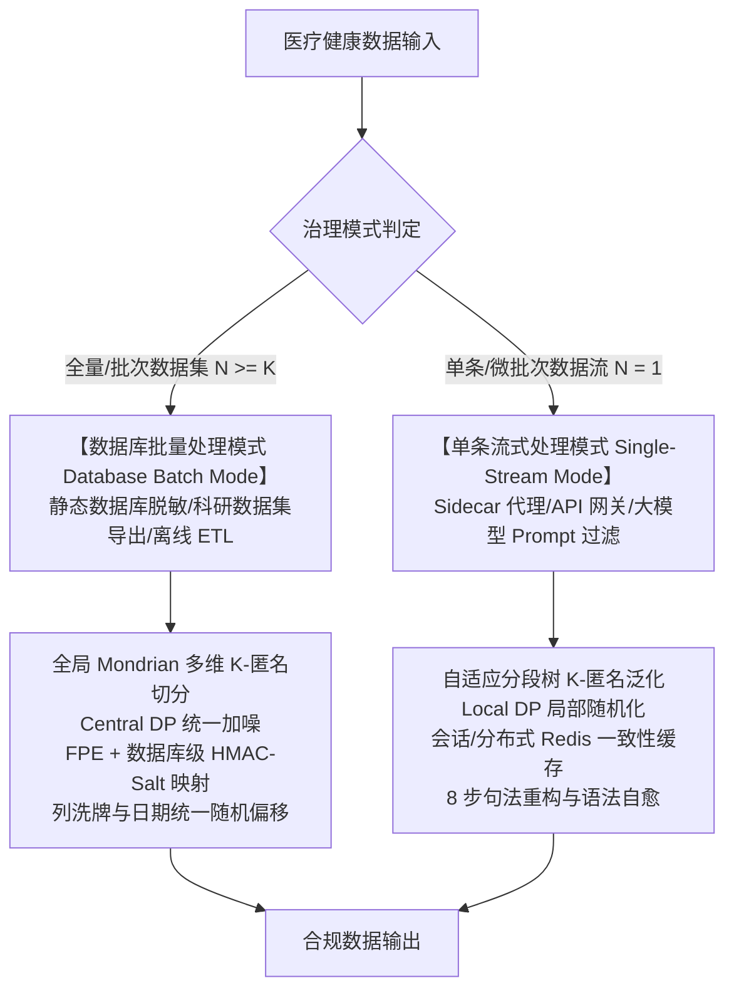
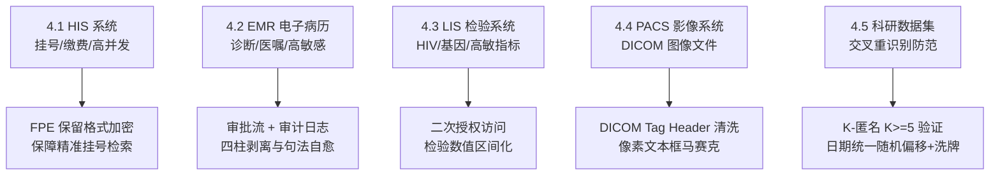
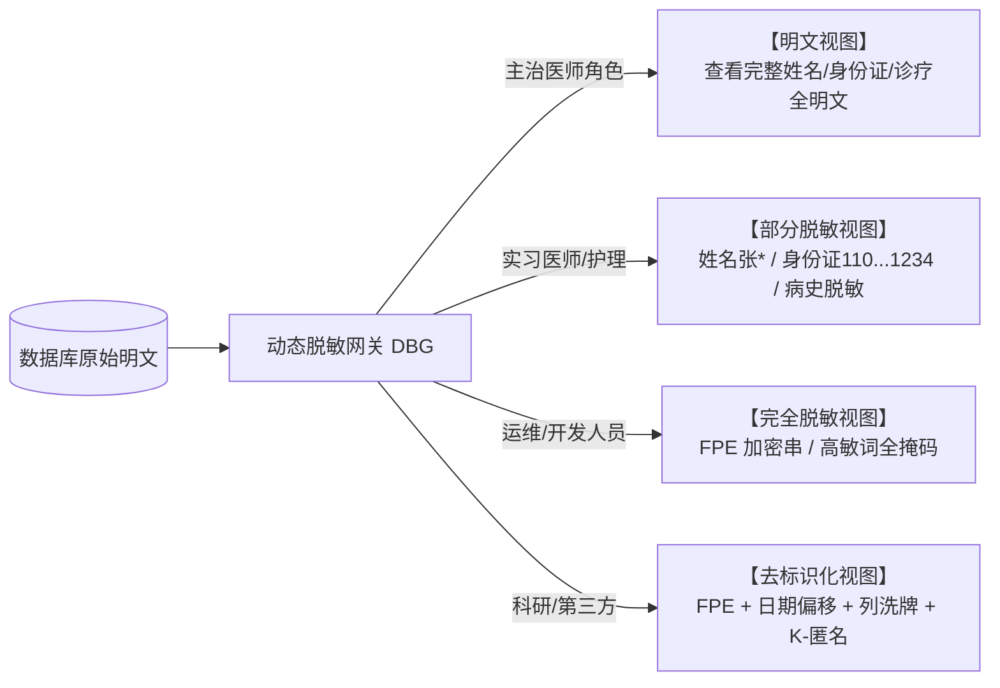

# 医疗健康数据隐私脱敏与泛化算法标准规范 (v3.0)
*(Medical Health Data Privacy Redaction & Generalization Algorithm Standard Specification v3.0)*

> **文档版本**：v3.0.0  
> **文档状态**：正式发布 / 行业标准规范  
> **适用范围**：医疗健康数据脱敏与泛化处理的算法设计、业务规则、数据库离线治理与单条流式代理合规审计  
> **更新时间**：2026-08-07  
> **法规基线**：国家卫健委、公安部、网信办等五部门《医疗卫生机构数据安全和个人信息保护管理办法（试行）》（国卫规划发〔2026〕6号）  
> **设计方案引用**：技术实现与代码架构详见架构设计文档 [`docs/medical_pipeline/design.md`](file:///home/charles/code/sfwork/privacy-local-agent/docs/medical_pipeline/design.md)  
> **变更说明**：引入五部门 2026 最新新规；建立 **6 类敏感字段×脱敏算法矩阵**；扩充 FPE (保留格式加密)、列洗牌 (Column Shuffle)、日期统一随机偏移 (Random Date Offset)、DICOM Tag 元数据清洗规范；建立 HIS / EMR / LIS / PACS / 科研数据集分系统脱敏实施方案与角色三视图访问控制标准。

---

## 1. 标准概述与适用法规基线

### 1.1 规范背景与法规要求

在医疗数据治理、数据仓库建设、临床科研二次利用、跨机构数据共享及大模型（LLM）微调等场景中，医疗健康数据包含高度敏感的个人个人信息与临床诊疗记录。

根据 2026 年 2 月国家卫健委、公安部、网信办等五部门联合发布的《医疗卫生机构数据安全和个人信息保护管理办法（试行）》（国卫规划发〔2026〕6号），以及《个人信息保护法》第28/51/53条、GB/T 22239-2019（等保2.0）：

**核心要求三原则：**
1. **存储加密（TDE）**：数据落在磁盘上时实施透明加密；
2. **访问脱敏（DBG / 动态脱敏）**：运维/开发人人员查库时动态脱敏，支持**角色三视图权限管控**；
3. **外发去标识（KTM / 静态脱敏）**：科研、教学、统计导出时执行静态不可逆去标识化，防交叉比对重识别。

---

## 2. 6 类敏感字段×脱敏算法矩阵 (6-Category Field Matrix)

本规范将医院与医疗健康数据库中的敏感字段划分为 **6 大类别**，并定义其脱敏推荐算法：

| 字段类别 | 典型字段示例 | 敏感等级 | 主要泄露风险 | 静态脱敏算法 (外发) | 动态脱敏算法 (访问) | 禁用算法 |
|---|---|---|---|---|---|---|
| **1. 身份标识** | 姓名、身份证号、医保卡号、病历号 | **极高** | 直接定位自然人 | **FPE (保留格式加密)** + HMAC 哈希 | 掩码（留首尾/后 4 位） | 直接删除 (破坏关联与索引) |
| **2. 联系方式** | 手机号、详细住址、紧急联系人 | **高** | 骚扰、电信诈骗 | 文本截断（保留省市）+ 假值替换 | 掩码（中间 4 位掩码） | FPE (格式无检索意义) |
| **3. 诊疗信息** | 诊断名称、手术记录、用药方案 | **极高** | 社会歧视、敲诈 | **四柱强剥离 + 句法重构 + 列洗牌** | 角色分级三视图显示 | 全量掩码 (医生无法看病) |
| **4. 检验检查** | 基因数据、HIV、精神类指标 | **极高** | 保险拒保、污名化 | **区间化 + 彻底抹平** | 二次授权 + 按权限显示 | 裸哈希 (无法做统计) |
| **5. 财务信息** | 医保账户、缴费记录、自费金额 | **中** | 经济诈骗 | 假值替换 + 数值截断/泛化 | 金额掩码/范围显示 | 列洗牌 (导致金额对应错乱) |
| **6. 生物特征** | 指纹、人脸、虹膜、全基因组 | **极高** | 终身不可逆风险 | **严禁外发导出** | **禁止未经二次授权访问** | 任何可逆解密算法 |

---

## 3. 双模式治理架构与技术拆分比对 (Dual-Mode Governance)

根据数据处理场景的部署形态与计算引擎差异，规范定义两大治理模式：

### 3.1 核心算法技术拆分比对

| 脱敏与隐私技术 | 数据库批量处理模式 (Database Batch Mode) | 单条数据流式处理模式 (Single-Record Streaming Mode) | 业务价值与算法说明 |
|---|---|---|---|
| **保留格式加密 (FPE)** | **数据库级 FPE (Format-Preserving Encryption)**：保持身份证/医保号完全一致的长度与数字形态。 | **动态 FPE 映射**：根据字段类型生成假值数字串。 | **支持精准相等匹配查询 (Exact Match Query)**，且密文不可逆推。 |
| **K-匿名 (K-Anonymity)** | **全局多维 Mondrian 分割算法**：按中位数递归切分 QI 维度，保证各等价类 $K \ge 5$，并校验 $l$-Diversity。 | **自适应分段层次树 (`adaptive_age_hierarchy`)**：依据领域分段树（如 $<60$ 岁 3 岁区间）即时泛化。 | 数据库模式求解全局最优，信息损失极小；流式模式保障零延迟。 |
| **日期偏移 (Date Offset)** | **患者级日期统一随机偏移 (Random Date Offset)**：整表中同一患者的所有日期统一随机偏移 $N$ 天。 | **流式日期截断 (Date Truncation)**：精准日期转换为年月（如 `2024-03`）。 | 抹去绝对时间防时间交叉比对重识别，同时 100% 保留事件时间间隔。 |
| **列洗牌 (Column Shuffle)** | **科研列洗牌算子 (Column Shuffle)**：打乱诊断码、科室列对应关系。 | **句法范畴化泛化 (Categorical Generalization)**：重构为通用大类病种。 | 保持列级统计分布（均值、标准差）不变。 |

---

## 4. 医疗分系统（HIS / EMR / LIS / PACS / 科研）实施规范

医院内不同业务系统的访问模式与数据特征不同，须执行针对性实施方案：

### 4.1 HIS 系统 (医院信息系统)
* **数据特征**：高并发（门诊高峰 800~1500 并发），包含姓名、身份证号、挂号记录。
* **脱敏规范**：挂号查询依赖身份证精准匹配。禁止直接使用掩码覆盖导致查不到患者；必须使用 **FPE 保留格式加密** —— 加密后格式与长度不变，支持 SQL 精准匹配，但密文不可逆推。

### 4.2 EMR 系统 (电子病历)
* **数据特征**：诊断文本、手术记录、用药方案，敏感度极高。
* **脱敏规范**：
  1. 医生工作站采用**角色三视图**（主治医生看明文，实习医生看部分脱敏，行政人员看全脱敏）；
  2. 病历导出必须绑定**审批流 + SQL 级全量审计日志**，防止无审批越权导出。

### 4.3 LIS 系统 (检验信息系统)
* **数据特征**：包含 HIV、基因突变、精神类特异性指标。
* **脱敏规范**：HIV 及基因指标执行**二次授权访问控制**；科研导出时对 CD4 计数、HBV-DNA 载量执行数值区间化。

### 4.4 PACS 系统 (医学影像系统)
* **数据特征**：单文件 MB 至 GB 级 DICOM 影像文件。
* **脱敏规范**：
  * 脱敏重点在于 **DICOM Tag Header 元数据**。很多患者姓名、身份证号嵌入在 DICOM Header 中；导出影像前必须批量清理/修改 Tag Header 元数据；
  * 对影像像素中嵌有的文字化验单，定位文本框（Bounding Box）区域执行高斯模糊/马赛克覆盖。

### 4.5 科研数据集 (Research Datasets)
* **数据特征**：从多系统抽取的结构化/半结构化数据集。
* **防组合重识别规范**：
  1. 执行 **$K$-匿名验证 ($K \ge 5$)**，确保数据集中任意 QI 组合（如“特定科室+年龄段+罕见症状”）至少包含 5 条不可区分记录；
  2. 所有日期执行**同一患者统一随机天数偏移 (Random Date Offset)**；
  3. 诊断码与科室列执行**列洗牌 (Column Shuffle)**。

---

## 5. 角色三视图动态访问控制规范 (Role-Based Three-View Dynamic Masking)

在动态脱敏（DBG / 实时网关）场景中，数据库原始数据保持不变，系统根据访问者的角色权限动态呈现不同的数据视图：

---

## 6. 综合脱敏案例库 (13 代表性案例)

| 案例 | 场景分类 | 原始文本输入 | 规范脱敏结果输出 | 治理算法与分系统规范 |
|---|---|---|---|---|
| **Case 1** | 身份标识 FPE | `身份证号: 110101199001011234` | `身份证号: 928374199001015678` | FPE 保留格式加密，支持精确检索，密文不可逆推 (HIS/等保) |
| **Case 2** | 科研日期偏移 | `2025-03-15 入院，2025-03-20 手术` | `2025-03-30 入院，2025-04-04 手术` | 日期统一随机偏移 15 天，保留 5 天时间间隔 (科研数据集) |
| **Case 3** | PACS 影像导出 | `DICOM Tag Header: PatientName='张三'` | `DICOM Tag Header: PatientName='ANON_001'` | DICOM Tag 元数据批量清洗 (PACS 影像) |
| **Case 4** | 隐式性病主诉 | `患者1月前发现外阴多发菜花状赘生物，醋酸白试验阳性。行CO2激光灼除术。` | `""` | 四柱特征（体征+检查+处置）全擦除，彻底抹平 |
| **Case 5** | 复杂复合并发死因 | `外婆殁于'亨廷顿舞蹈病'(50岁)，伯父由'食管静脉曲张'破裂出血导致去世。` | `外婆殁于48岁，伯父因病去世。` | 整句死因重构 + 语法自愈 (EMR 电子病历) |

---

*标准规范 v3.0 结束。*
