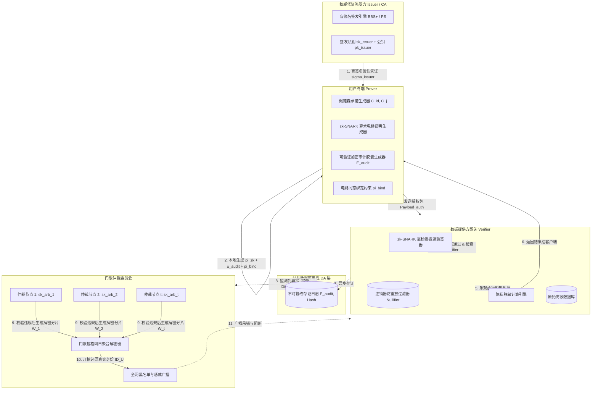
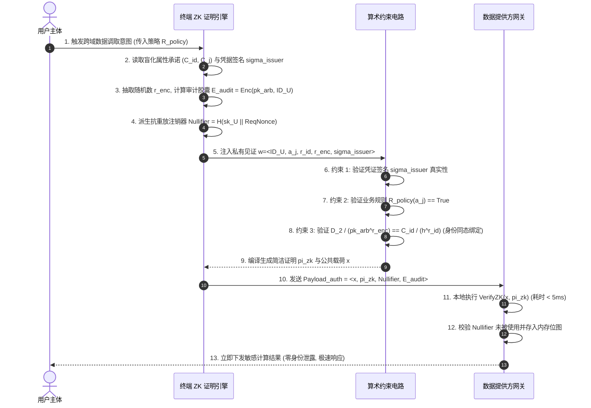
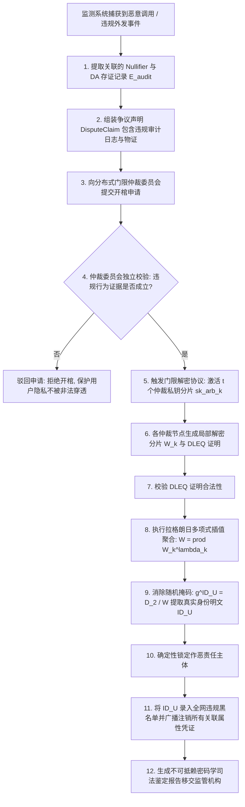

|                                  |
|:--------------------------------:|
| **深圳数联天下智能科技有限公司** |
|      **专利技术交底书模板**      |

编号：HZL-02-R01 版本号：2022

**专利申请用技术交底书**

***以下带 \* 信息务必填写，涉及奖金的发放，谢谢！~***

交底书名称：一种结合零知识证明与乐观审计的跨域数据隐私授权方法及系统

\*\*发明人姓名：陈少伟

\*\*第一发明人姓名和身份证号码：陈少伟（371102198410187111）

申请人：深圳数联天下智能科技有限公司

通信地址（邮编）：（递交时填写）

\*\*交底书撰写人：陈少伟

\*\*联系电话：13662678920

\*\*Email：shaowei.chen@clife.cn

---

**交底技术书信息登记页**

***以下带 \* 信息务必填写，方便进行知识产权维护***

\*\*提交部门：平台建设中心-研发管理部-安全运维组

\*\*项目号：（内部维护时填写）

\*\*项目名称/所属产品(可多个，靠近公司的主营业务)：数据安全与隐私保护、医疗数据安全治理平台、PrivShield 跨域访问控制与隐私治理系统

\*\*技术应用领域：大数据、人工智能（AI）、智慧医疗、金融征信安全、隐私计算、零知识证明（ZKP）、跨机构数据要素安全合规流转

\*\*相关技术方向：非交互式零知识证明（zk-SNARK / PLONK）、可验证加密（Verifiable Encryption）、同态密码学约束绑定、乐观放行（Optimistic Execution）、后置开棺仲裁解密（Open-Coffin Traceability）、门限解密（Threshold MPC）

\*\*技术方案概述：
本发明提出一种结合零知识证明与乐观审计的跨域数据隐私授权方法及系统。针对跨机构、跨域敏感数据流转场景中长期存在的“明文授权导致数据提供方刺探用户隐私画像”与“完全匿名零知识证明导致发生欺诈违规时无法事后审计追责”的两难技术困境，本发明构建了“即时零知识隐私合规（Validity）+ 事后可验证开棺追溯（Optimistic Traceability）”的双轨协同架构。
用户终端预先获取由权威机构签发并盲化的属性凭据承诺；在跨域发起数据调用时，终端在本地生成非交互式零知识证明 $\pi_{\text{zk}}$，在算术电路上证明“用户真实属性满足预设访问门槛（如年龄合格、特定资质有效或无违约记录）”，且不泄露真实身份标识与具体属性数值；与此同时，终端利用仲裁机构公钥 $pk_{\text{arb}}$ 对真实身份与授权上下文执行可验证加密生成审计胶囊密文 $\mathcal{E}_{\text{audit}}$，并在零知识算术电路上构建同态绑定约束 $\pi_{\text{bind}}$，自证明审计密文中的明文主体与凭证持有主体严格具有同一性；数据提供方网关在本地毫秒级验证 $\pi_{\text{zk}}$ 与 $\pi_{\text{bind}}$ 成立后，无需实时解密身份或向中心机构反查，直接乐观放行并下发脱敏计算结果，并将授权执行事件哈希与审计密文存证；当系统监测到异常流量或监管争议时，审计方构造违规调用证据提交至仲裁引擎，仲裁引擎验证违规成立后使用门限仲裁私钥对审计密文 $\mathcal{E}_{\text{audit}}$ 执行条件解密（开棺），精准还原恶意调用主体的真实身份并实施处罚。本发明在日常业务中对数据提供方实现“零用户隐私暴露”，在争议场景下实现“百分百确定性追责”，兼顾了极致的隐私保护、极高的授权吞吐与刚性合规溯源要求。

---

**缩略语和关键术语定义列表**

> 1. **ZKP（Zero-Knowledge Proof，零知识证明）**：证明者在不向验证者提供任何有用信息的情况下，使验证者相信某个断言为真的密码学技术。
> 2. **zk-SNARK（Zero-Knowledge Succinct Non-Interactive Argument of Knowledge，零知识简洁非交互式知识论证）**：具备证明尺寸小（百字节级）且验证耗时极低（毫秒级）的非交互式零知识证明系统。
> 3. **PLONK（Permutations over Lagrange-bases for Oecumenical Non-interactive arguments of Knowledge）**：一种基于多项式承诺与通用可更新参考字符串（CRS）的通用零知识证明算法。
> 4. **Verifiable Encryption（可验证加密）**：证明者在加密明文的同时，输出一个零知识证明，证明所生成的密文确实是对满足特定公共断言的明文所进行的有效加密。
> 5. **Pedersen Commitment（佩德森承诺）**：基于椭圆曲线离散对数难解性构建的密码学承诺方案，具备完美盲化性（Hiding）与计算抗绑定性（Binding）。
> 6. **Open-Coffin Arbitration（开棺仲裁 / 限制性条件解密）**：正常业务下审计数据以强加密胶囊密文封存，仅当满足合法审计或违规证明断言时，才由法定仲裁机构触发解密还原身份的监管机制。
> 7. **Optimistic Execution（乐观放行 / 乐观执行）**：数据源端在验证零知识证明有效后立即下发结果，将合规仲裁与重度身份解密移至异步后置阶段的并发控制范式。
> 8. **Arithmetic Circuit（算术电路）**：零知识证明中用于表征计算逻辑的数学模型，由加法门、乘法门与约束线构成。
> 9. **R1CS（Rank-1 Constraint System，一阶约束系统）**：用于将算术电路约束转化为矩阵向量形式的标准代数表达体系。
> 10. **Threshold ElGamal（门限 ElGamal 加密）**：私钥被分割由多个独立仲裁节点保管的公钥加密体制，仅当协作节点数超过预设门限 $t$ 时方可完成解密。
> 11. **IdP / CA（权威凭证签发机构）**：具备公信力、负责对用户实体属性（如就医证明、征信记录、身份核验）签发密码学盲签名凭据的权威实体。
> 12. **Nullifier（废弃凭证标识符 / 匿名防重放注销器）**：由私有密钥与随机种子派生的唯一确定性哈希标识，用于在不暴露身份的前提下防止匿名凭证被双花或恶意重放。

---

# 1. 相关技术背景（背景技术），与本发明最相近似的现有实现方案（现有技术）

## 1.1 背景技术

在跨机构敏感数据协同（如医保跨省异地结算、商业健康保险核赔、银行金融征信联合建模、政务数据跨域共享）中，业务系统通常需要依据用户的特定属性资质（例如：“用户年龄 $\ge 18$ 周岁”、“过去 6 个月内无重大慢病理赔记录”、“个人综合信用分 $\ge 650$”）决定是否向第三方数据调用方开放敏感业务数据或运算结果。

在这种跨机构跨域的数据流转体系中，长期存在着**用户数据隐私保护**与**数据源端合规追责**之间的深刻结构性矛盾：

1. **传统明文属性授权导致的“过度采集”与“用户画像被非法刺探”**：
   在传统的数字证书（X.509）或 OAuth 2.0 授权机制中，用户必须向数据提供方直接提交明文身份标识（身份证号、真实姓名）或具体的明文敏感属性（如具体的病历诊断编码、精确的征信分值）。数据提供方在获得这些数据后，能够轻易对用户建立跨业务的联合行为画像，甚至发生数据被二次滥用与违规倒卖的风险。
2. **纯匿名零知识证明（Pure Anonymous ZKP）引发的“监管黑盒”与“违规无法追责”困境**：
   为了消除明文隐私泄露，近年来密码学界引入了零知识证明（ZKP）技术，用户仅向数据源提供一个证明“自身属性满足条件”的零知识证明 $\pi$。然而，完全匿名的 ZKP 方案将数据提供方彻底推入“完全盲目”的极端境地：一旦调用方应用存在欺诈伪造行为、洗钱套现、恶意爬取或系统被攻破，数据提供方由于未持有任何可追溯的身份证据，既无法向监管机构提供合规审计底账，也无法在法律层面锁定实际作恶的责任主体，直接违反了《中华人民共和国数据安全法》、《个人信息保护法》及欧盟 GDPR 中关于“关键数据流转全链路可审计可追溯”的强制性法律合规要求。
3. **传统同步多方门限托管机制带来的超高延迟与性能瘫痪**：
   现有试图解决可追溯性的折中方案通常采用“每次请求均需多方托管机构（Escrow Agents）同步参与网络交互握手并提供背书”。然而，跨机构多方在线门限交互通常涉及多轮复杂的网络通信，单次调用延迟高达 1 至 5 秒以上，根本无法支撑现代互联网微服务网关上万级 QPS 的高并发在线交易需求。

因此，亟需一种既能在**日常在线交互中对数据提供方实现零明文隐私暴露**，又能在**发生争议与违规时支持事后确定性无损开棺追责**，且具备**毫秒级极速乐观验证放行**能力的新型跨域数据授权方法及系统。

---

## 1.2 与本发明相关的现有技术一：基于属性基加密（ABE）的细粒度访问控制方案

### 1.2.1 现有技术一的技术方案

与本发明最相近的第一类现有技术为基于密文策略属性基加密（CP-ABE）的访问控制方案（其代表性专利文献如中国发明专利申请 **CN114257404A《一种基于属性基加密的跨域数据安全访问控制方法及系统》**）。

该类现有技术的基本工作流程如下：
1. 数据中心将敏感数据使用对称密钥加密，并利用 CP-ABE 算法将对称密钥与特定的访问策略树（如 `(Role: Doctor AND Dept: Cardiology) OR (Credit > 700)`）进行加密绑定；
2. 用户向属性权威中心申请与自身属性绑定的私钥；
3. 当用户请求数据时，下载密文并在本地利用属性私钥进行配对解密；若用户属性满足策略树，则解密得到数据。

### 1.2.2 现有技术一的缺点

以 CN114257404A 为代表的 ABE 方案存在以下显著缺陷：

1. **计算开销极其沉重，无法在移动端高频运行**：
   ABE 的解密过程依赖大量的双线性配对（Bilinear Pairing）运算，随着访问策略树复杂度的增加，解密耗时呈多项式级增长，在移动终端与边缘设备上极度消耗 CPU 与电池算力。
2. **缺乏对恶意调用方的细粒度追溯能力**：
   若多个具有相同属性集合的用户中有一人恶意泄露了数据或共享了私钥，数据源端无法依据解密日志从密码学上区分究竟是哪一个具体用户发起了调用（即缺乏非对称可归责性）。
3. **策略更新与撤销极其复杂**：
   一旦某一用户的特定属性发生变更或被吊销，全网需要重新分发系统公共参数或对已有密文进行大规模重加密，系统维护代价极高。

---

## 1.3 与本发明相关的现有技术二：基于匿名凭据（Anonymous Credentials）与群签名方案

### 1.3.1 现有技术二的技术方案

第二类现有技术为基于 Camenisch-Lysyanskaya（CL）签名或群签名（Group Signature）的匿名认证方案（其代表性专利文献如 **CN113507421A《基于群签名的匿名身份认证与追溯方法》**）。

该方案的基本原理为：
1. 群管理员（Group Manager）负责为群成员签发证书公钥；
2. 用户利用群私钥对请求进行签名，验证者仅能验证签名来自合法的群成员，但无法识别签名者具体是谁；
3. 当发生违规时，由拥有主追踪私钥的群管理员执行“打开签名”（Open Operation），暴露签名者的真实身份公钥。

### 1.3.2 现有技术二的缺点

1. **群管理员权力过于集中，存在单点特权滥用风险**：
   群管理员单方掌握无限制的“开棺”权限，缺乏对管理员解密行为的技术制约，极易发生监管权力滥用并导致大规模用户隐私被非法穿透。
2. **缺乏对复杂算术业务规则（如数值比较、集合包含）的高效证明支持**：
   传统的群签名与 CL 凭据主要用于证明身份属于某一集合，在表达如“过去 12 个月检验指标方差在安全阈值内”等复杂的动态业务计算逻辑时，构造零知识证明极其困难且证明体积庞大。
3. **开棺判定缺乏去中心化欺诈挑战闭环**：
   群签名的打开过程通常依赖人工流程或线下举证，缺乏将数据源端的违规调用事实自动化转化为密码学欺诈证据的闭环机制。

---

## 1.4 本发明与现有技术的对比分析

将本发明方案与上述现有技术方案的核心技术特征进行多维度对比，如表 1 所示：

**表 1：本发明与现有技术方案的多维度对比分析表**

| 对比维度 | 现有技术一（属性基加密 CP-ABE） | 现有技术二（群签名与匿名凭据） | **本发明技术方案（ZKP + 乐观审计开棺体系）** |
| :--- | :--- | :--- | :--- |
| **数据源端隐私暴露度** | 高（数据端需感知请求者属性范围） | 极低（但仅支持简单群身份证明） | **零暴露（仅验证零知识布尔断言，身份/属性全盲化）** |
| **复杂业务规则表达力** | 仅支持简单的与/或布尔树 | 极差（难以支持数值大小与复杂算术） | **极强（基于 zk-SNARK / PLONK 通用算术电路）** |
| **数据端验证性能** | 慢（多次双线性配对，耗时数百毫秒） | 中等（群签名验签开销较大） | **极快（zk-SNARK 验证仅需 3~5ms，支持万级 QPS）** |
| **追责证据不可抵赖性** | 无追责能力（多用户同属性无法区分） | 依赖单点群管理员私钥 | **数学强自证明（可验证加密 + 电路同态绑定 $\pi_{\text{bind}}$）** |
| **开棺解密权限制约** | 不涉及解密追溯 | 单点管理员无约束解密，存在越权风险 | **严格受控（必须提交密码学欺诈证据 + 门限 MPC 解密）** |
| **跨域放行延迟** | 高（依赖中心参数同步与重加密） | 中等（依赖群公钥状态同步） | **极低（数据源端本地无状态毫秒级乐观放行）** |

---

# 2. 本发明技术方案的详细阐述（发明内容）

## 2.1 本发明所要解决的技术问题（发明目的）

针对现有技术中存在的上述缺陷，本发明旨在提供一种结合零知识证明与乐观审计的跨域数据隐私授权方法及系统，具体解决以下技术问题：

1. **彻底阻断数据提供方对用户真实身份与敏感画像的窥探**：在跨机构调取数据时，通过非交互式零知识证明对属性判定逻辑进行算术电路化证明，确保数据提供方在完全不获知用户真实身份标识与具体属性数值的前提下完成合规准入判定。
2. **解决匿名零知识证明无法事后审计与合规追责的行业难题**：构建基于仲裁公钥的可验证加密（Verifiable Encryption）体系，并在 ZKP 电路内部构建身份同一性约束，生成不可篡改的“审计胶囊密文 $\mathcal{E}_{\text{audit}}$”，实现“平时全匿名、战时可开棺”。
3. **消除同步多方托管带来的网络高延迟与吞吐瓶颈**：设计数据源端的“乐观放行”机制，数据源仅需在本地微秒/毫秒级验证 zk-SNARK 证明与密文构造合法性即可立即下发业务数据，将跨域授权延迟压缩至 5ms 以内。
4. **构建基于密码学欺诈证据的门限去中心化开棺仲裁机制**：设定严格的开棺触发前置条件，当且仅当审计节点出具包含违规调用事实的自包含证据链并经门限仲裁共识后，方可解密审计胶囊，杜绝中心化特权滥用。

---

## 2.2 本发明提供的完整技术方案（发明方案）

### 2.2.1 系统总体拓扑结构与核心实体交互架构

本发明系统由以下五大核心实体构成，总体架构如图 1 所示：

1. **权威凭证签发方（Issuer / CA）**：权威可信机构（如国家卫生健康委认证中心、央行征信中心或公证处），负责核验用户真实身份，并使用私钥 $sk_{\text{issuer}}$ 对用户的属性向量签发盲化凭证签名。
2. **用户终端（User Client Prover）**：运行于智能手机或安全边缘网关，内置 ZKP 证明生成器（Prover Engine）与可验证加密模块，负责在本地私密生成零知识证明 $\pi_{\text{zk}}$ 与审计胶囊密文 $\mathcal{E}_{\text{audit}}$。
3. **数据提供方网关（Data Provider Verifier）**：敏感业务数据的持有与服务网关，负责在本地执行 zk-SNARK 证明极速校验，乐观放行数据并向公共日志层写入审计存证。
4. **公共数据可用性与存证层（DA Layer / Blockchain）**：负责记录每笔授权事件哈希、审计密文哈希及数据放行记录，保证存证公开不可篡改。
5. **门限仲裁追溯引擎（Threshold Arbitration Engine）**：由多个法定监管节点组成的分布式仲裁委员会，联合持有仲裁私钥分片；负责验证欺诈争议并执行门限联合解密。

---

### 2.2.2 步骤 S1：权威属性凭证签发与终端本地盲化承诺构建

在业务准备阶段，用户从权威机构获取属性凭证并进行本地盲化处理，具体包括：

1. **权威机构签发结构化属性凭据**：
   用户向 Issuer 提交真实身份 $ID_U$ 与属性证明材料。Issuer 核实后，将用户真实身份标识 $ID_U$、属性向量 $\vec{A} = (a_1, a_2, \dots, a_m)$（如 $a_1$ 为出生年月，$a_2$ 为信用评分，$a_3$ 为诊断分类码）以及凭证有效期 $T_{\text{valid}}$ 进行编码，利用 Issuer 私钥签发基于 BBS+ 或 Pointcheval-Sanders（PS）体制的盲签名 $\sigma_{\text{issuer}}$：

$$
\sigma_{\text{issuer}} \leftarrow \text{Sign}_{sk_{\text{issuer}}}\Big( ID_U \parallel a_1 \parallel a_2 \parallel \dots \parallel a_m \parallel T_{\text{valid}} \Big) \tag{1}
$$

2. **终端本地构建盲化佩德森承诺（Pedersen Commitment）**：
   用户终端接收到凭据后，利用本地密码学随机数 $r_{\text{id}}, r_1, \dots, r_m \xleftarrow{\$} \mathbb{Z}_q^*$，在椭圆曲线群 $\mathbb{G}$ 上构建各属性字段的盲化佩德森承诺：

$$
\begin{cases}
C_{\text{id}} = g^{ID_U} \cdot h^{r_{\text{id}}} \\
C_j = g^{a_j} \cdot h^{r_j}, & \text{for } j = 1, \dots, m
\end{cases} \tag{2}
$$

式中，$g, h \in \mathbb{G}$ 为满足离散对数难解性的生成元。上述承诺在数学上具备**信息论级隐藏性（Information-Theoretic Hiding）**，即使拥有无限算力亦无法从 $C_{\text{id}}, C_j$ 中逆推 $ID_U$ 或 $a_j$ 的真实取值。

3. **凭证绑定私钥生成**：
   用户终端在申领凭证时在本地生成与凭证绑定的私有密钥 $sk_U \xleftarrow{\$} \mathbb{Z}_q^*$ 及其公开承诺 $g^{sk_U}$，Issuer 将 $g^{sk_U}$ 作为绑定分量一并纳入盲签名消息，使属性凭证与用户持有的秘密在密码学上不可转让；$sk_U$ 仅保存在终端本地安全存储区，用于后续派生抗重放注销器（Nullifier），任何第三方（包括 Issuer）均无法代为计算。

---

### 2.2.3 步骤 S2：本地生成零知识合规证明与可验证审计胶囊加密绑定

当第三方应用向数据提供方申请数据时，数据提供方发布公开的访问合规策略 $\mathcal{R}_{\text{policy}}$（例如：“要求 $a_1 \le 2006$ 年 且 $a_2 \ge 650$ 分 且 $ID_U$ 属于指定白名单哈希根”）。用户终端在本地启动 ZKP 算术电路生成证明，如图 2 所示，具体包括：

1. **构造非交互式零知识证明 $\pi_{\text{zk}}$**：
   用户终端将私有秘密见证（Private Witness）定义为：

$$
\mathbf{w} = \big\langle ID_U, a_1, \dots, a_m, r_{\text{id}}, r_1, \dots, r_m, \sigma_{\text{issuer}}, sk_U, r_{\text{enc}} \big\rangle \tag{3}
$$

   将公开输入（Public Instance）定义为：

$$
\mathbf{x} = \big\langle pk_{\text{issuer}}, pk_{\text{arb}}, \mathcal{R}_{\text{policy}}, \text{ReqNonce}, T_{\text{now}}, C_{\text{id}}, C_1, \dots, C_m, \mathcal{E}_{\text{audit}} \big\rangle \tag{4}
$$

   终端通过 zk-SNARK 证明系统（如 PLONK / Groth16），在算术电路上同时约束并证明以下四个子命题：
   - **子命题 1（凭证签名有效性）**：私有属性见证确实由 $pk_{\text{issuer}}$ 合法签名背书；
   - **子命题 2（业务策略判定）**：私有属性值满足关系断言 $\mathcal{R}_{\text{policy}}(a_1, \dots, a_m) == \text{True}$；
   - **子命题 3（匿名防重放注销器派生）**：计算唯一注销器 $\text{Nullifier} = \mathcal{H}_{\text{poseidon}}(sk_U \parallel \text{ReqNonce})$，保证本次调用不可被重放，且不同调用间无法通过 $\text{Nullifier}$ 进行跨会话身份关联；其中 $\text{ReqNonce}$ 为数据提供方网关在每次数据请求握手阶段下发的随机挑战值，与本次请求上下文唯一绑定；电路内部同时约束 $\text{Nullifier}$ 的派生秘密与凭证绑定分量 $g^{sk_U}$ 同属见证中的 $sk_U$，确保注销器与合法凭证严格绑定；
   - **子命题 4（凭证时间有效性）**：$T_{\text{now}} \le T_{\text{valid}}$。

2. **构建可验证审计胶囊密文 $\mathcal{E}_{\text{audit}}$ 与同态一致性绑定证明 $\pi_{\text{bind}}$**：
   为了防止作恶者将合法凭证与他人虚假身份密文拼接，本发明在算术电路上构建强密码学一致性约束：
   - 终端使用仲裁委员会公钥 $pk_{\text{arb}}$，利用随机数 $r_{\text{enc}} \xleftarrow{\$} \mathbb{Z}_q^*$，对用户真实身份 $ID_U$ 与调用上下文进行指数型 ElGamal 可验证加密：

$$
\mathcal{E}_{\text{audit}} = \Big\langle D_1 = g^{r_{\text{enc}}}, \; D_2 = pk_{\text{arb}}^{r_{\text{enc}}} \cdot g^{ID_U} \Big\rangle \tag{5}
$$

   - **电路同态绑定约束（Identity Consistency Constraint）**：在算术电路内部引入等式约束：

$$
\mathcal{C}_{\text{bind}}: \quad \frac{D_2}{pk_{\text{arb}}^{r_{\text{enc}}}} \stackrel{?}{=} \frac{C_{\text{id}}}{h^{r_{\text{id}}}} \equiv g^{ID_U} \tag{6}
$$

   该约束在零知识证明内严格证明了：**密文 $\mathcal{E}_{\text{audit}}$ 中所包裹的明文身份，与盲化承诺 $C_{\text{id}}$ 中的身份以及凭证签名 $\sigma_{\text{issuer}}$ 中的主体在数学上精确恒等**，且全过程不泄露 $ID_U$、$r_{\text{enc}}$ 与 $r_{\text{id}}$ 的任何明文比特。

终端最终输出综合自包含证明包：$\text{Payload}_{\text{auth}} = \langle \mathbf{x}, \pi_{\text{zk}}, \text{Nullifier}, \mathcal{E}_{\text{audit}} \rangle$。

---

### 2.2.4 步骤 S3：数据提供方网关毫秒级乐观验签与数据受限下发

数据提供方网关接收到 $\text{Payload}_{\text{auth}}$ 后，启动乐观放行流水线，具体包括：

1. **本地无状态零知识证明极速验证**：
   数据提供方网关调用底层原生优化的密码学配对库（如 Rust/Arkworks），对 $\pi_{\text{zk}}$ 进行双线性配对校验：

$$
\text{VerifyZK}\Big( \mathbf{x}, \pi_{\text{zk}} \Big) \stackrel{?}{=} \text{True} \tag{7}
$$

由于 zk-SNARK 具备简洁性，单次验证仅涉及 2 至 3 次椭圆曲线配对运算，耗时严格控制在 3ms ~ 5ms 之间。
2. **注销器（Nullifier）防重放判定**：
   数据提供方在本地内存布隆过滤器与滑动时间窗口位图中检索 $\text{Nullifier}$。若未被使用，则记录该 $\text{Nullifier}$，杜绝重放攻击。
3. **乐观极速放行数据**：
   一旦上述两项本地验证成立，数据提供方**无需进行任何昂贵的跨域身份反查与跨机构解密交互，立即调用内部隐私计算引擎或脱敏算子，将计算结果响应下发给请求端**。
4. **异步存证至公共可用性层**：
   网关异步将授权元组 $\langle \mathcal{H}(\text{Payload}_{\text{auth}}), \mathcal{E}_{\text{audit}}, \text{Nullifier}, T_{\text{access}}, \text{ReqNonce} \rangle$ 写入公共 DA 存证层，形成公开透明的不可篡改审计追踪链。

---

### 2.2.5 步骤 S4：异常监测、密码学欺诈挑战与仲裁“开棺”解密追责

在绝大多数正常业务场景下，审计胶囊密文 $\mathcal{E}_{\text{audit}}$ 保持密封状态，数据提供方与第三方应用均无法知晓用户真实身份。仅当发生欺诈违规时，触发后置开棺仲裁，如图 3 所示，具体包括：

1. **异常行为捕获与欺诈证据构造**：
   当数据提供方或独立监控节点发现异常行为（如：调用方利用获取的数据发起撞库攻击、违反数据出境安全红线、或者请求特征命中业务违规风控策略）时，监测节点组装包含恶意行为特征的欺诈声明：

$$
\text{DisputeClaim} = \Big\langle \text{Nullifier}, \mathcal{E}_{\text{audit}}, \text{LogProof}_{\text{DA}}, \text{ViolationEvidence} \Big\rangle \tag{8}
$$

2. **仲裁委员会门限联合验证**：
   仲裁委员会由 $K$ 个法定仲裁机构节点（如司法存证链节点、监管部门、公证处）组成，各节点分别持有仲裁私钥分片 $sk_{\text{arb}}^{(k)}$（门限阈值为 $t$，满足 $t \le K$）。
   仲裁委员会首先独立验证 $\text{DisputeClaim}$ 中的违规证据真实性以及该笔调用在 DA 层中的存证证明。
3. **门限协作解密（开棺执行）**：
   一旦确认违规事实成立，超过门限数量（$\ge t$）的仲裁节点分别计算局部解密分片：

$$
W_k = D_1^{sk_{\text{arb}}^{(k)}} = g^{r_{\text{enc}} \cdot sk_{\text{arb}}^{(k)}} \tag{9}
$$

   各节点将 $W_k$ 连同解密正确性离散对数相等证明（DLEQ Proof）提交至仲裁聚合器。聚合器利用拉格朗日插值系数 $\lambda_k$ 聚合完整共享因子：

$$
W = \prod_{k=1}^t W_k^{\lambda_k} = g^{r_{\text{enc}} \cdot sk_{\text{arb}}} = pk_{\text{arb}}^{r_{\text{enc}}} \tag{10}
$$

4. **身份还原与合规追责**：
   仲裁聚合器通过消除掩码恢复身份明文点：

$$
g^{ID_U} = \frac{D_2}{W} = \frac{pk_{\text{arb}}^{r_{\text{enc}}} \cdot g^{ID_U}}{pk_{\text{arb}}^{r_{\text{enc}}}} \tag{11}
$$

   仲裁系统查表（Baby-step Giant-step 算法）或直接比对注册公钥，精确提取出恶意调用者的真实身份标识 $ID_U$。
5. **执行黑名单封禁与法律惩戒**：
   仲裁系统将 $ID_U$ 永久录入违规黑名单，并在全网广播吊销其所有关联属性凭证，同时向司法监管部门移交全链路密码学自证明物证卷宗。

---

## 2.3 附图说明与系统流程图

### 图 1：结合零知识证明与乐观审计的跨域数据隐私授权系统总体拓扑图

---

### 图 2：前端零知识证明生成与可验证加密绑定算法时序图

---

### 图 3：异常行为触发门限仲裁解密（开棺）流程图

---

## 2.4 本发明技术方案带来的有益效果

结合前述架构设计与数学推导，本发明带来的实质性技术进步与有益效果包括：

1. **真正实现数据提供方维度的“零数据隐私暴露”**：
   数据提供方在整个正常业务交互过程中，仅接触到经过零知识证明验证的布尔判定结果（如“用户确实满足条件”）以及强加密的审计密文，**完全无法获知用户的真实姓名、身份证号或精确敏感属性数值**，从根本上消除了数据接收方非法窃取用户画像、建立跨业务追踪或倒卖隐私数据的技术可能。
2. **攻克了匿名认证与合规追责互斥的行业瓶颈，提供确定性开棺追溯能力**：
   通过在零知识电路中引入身份一致性同态绑定约束 $\pi_{\text{bind}}$，使得每一笔匿名调用均自包含一个不可篡改的加密审计胶囊 $\mathcal{E}_{\text{audit}}$。一旦出现恶意欺诈，仲裁机构可在数学层无损还原责任人身份，彻底解决了纯匿名 ZKP 方案因“无法追责”而难以满足国家金融与医疗数据合规监管要求的致命缺陷。
3. **极低授权延迟与万级 QPS 高并发吞吐能力**：
   数据提供方无需在关键链路上同步等待多方解密或调用远程中心化鉴权接口，仅在本地利用底层配对库执行极其轻量的 zk-SNARK 验证（单次耗时 3~5ms），端到端响应达到毫秒级，使高安全级跨域隐私授权具备了在大型互联网微服务与实时清结算系统中大规模落地的工程可行性。
4. **门限去中心化治理杜绝单点监管特权滥用**：
   仲裁私钥采用门限秘密分享机制分割保存，任何单一机构均无权单方面解密用户身份；唯有当提交的密码学欺诈证据通过超过法定阈值比例的仲裁节点共识校验后方可触发解密，在制度与算法双重层面保障了合法用户的隐私权益。

---

# 3. 针对2中的技术方案，是否还有别的替代方案同样能完成发明目的

为了拓宽本发明的专利保护范围，防止他人通过简单的技术替换绕过本专利，本部分详细阐述针对各核心技术模块的可选替代实施方案：

## 3.1 零知识证明系统（ZKP）的替代实现方案

在实施例中采用了基于多项式承诺的 PLONK / Groth16 zk-SNARK 证明系统。在不同应用场景下，可采用以下替代方案：
1. **基于透明无信任初始设置（Transparent Setup）的 zk-STARK 方案**：利用抗量子哈希函数构建快速可验证 STARK 证明，消除对可信初始化（Trusted Setup）的依赖，并具备天然的后量子安全性。
2. **基于折叠方案（Folding Schemes，如 Nova / SuperNova / HyperNova）的递归证明**：在超高频多流调用场景下，将多个连续的授权凭据状态折叠为单一常数大小的证明，进一步压缩客户端计算与网络传输开销。
3. **基于 Bulletproofs 聚合范围证明方案**：在纯数值区间判定场景（如仅需证明资产 $> 100$ 万）下，采用无需可信设置的 Bulletproofs 算法，减小证明生成门槛。

## 3.2 可验证加密（Verifiable Encryption）与绑定机制的替代方案

身份加密胶囊不仅限于指数型 ElGamal，还可采用以下替代密码学机制：
1. **基于 Paillier 同态加密与零知识证明绑定**：利用 Paillier 加密体制的加法同态特性构建身份承诺与密文间的线性同态约束证明。
2. **基于身份的加密（IBE, Identity-Based Encryption）**：以仲裁委员会的当前纪元标识（Epoch ID）作为公钥直接加密，免去公钥证书链管理开销。
3. **基于可信执行环境（TEE，如 Intel SGX / AMD SEV）的安全密封绑定**：在用户设备内置的硬件 Enclave 内部执行身份绑定，并由 Enclave 出具硬件远程认证签名作为证明替代品。

## 3.3 门限仲裁委员会与解密触发机制的替代方案

1. **基于区块链去中心化自治组织（DAO）智能合约仲裁**：争议证明直接提交至链上智能合约，由智能合约自动调用部署在 Layer2 上的 zk-EVM 执行状态裁决，并通过去中心化预言机网络触发门限解密。
2. **基于法定时间锁加密（Timed-Release Encryption）的替代方案**：若指定期限内未发生欺诈争议，密文自动因时间戳私钥释放而失效销毁；若发生争议，由仲裁机构直接在争议窗口内提前注入解密见证。

---

# 4. 本发明的技术关键点和欲保护点是什么？

## 4.1 本发明的核心技术关键点

1. **零知识凭证合规判定与审计密文同一性同态绑定电路约束**：在统一零知识算术电路上同时证明属性合规性与审计密文 $\mathcal{E}_{\text{audit}}$ 中主体与凭证持有人的精确同一性。
2. **数据源端基于简洁零知识证明（zk-SNARK）与注销器（Nullifier）的本地无状态乐观放行机制**。
3. **基于公开数据可用性（DA）存证与后置密码学欺诈证据的门限“开棺”仲裁追责闭环**。
4. **权威机构盲签名凭证签发与佩德森多维属性承诺体系**。

---

## 4.2 权利要求书（欲保护点）

**1. 一种结合零知识证明与乐观审计的跨域数据隐私授权方法，其特征在于，包括以下步骤：**
- 用户终端获取由权威凭据签发方签发的用户属性凭证，并在本地利用密码学随机数构建包含真实身份标识与属性向量的盲化属性承诺；
- 响应于跨域数据调取请求，所述用户终端利用仲裁公钥对所述真实身份标识进行可验证加密生成审计胶囊密文，并在本地生成非交互式零知识证明，其中所述零知识证明在算术电路中证明所述用户属性凭证满足预设数据访问策略，且在电路内部通过同态绑定约束证明所述审计胶囊密文中的明文主体与所述盲化属性承诺的主体归属于同一实体；
- 数据提供方网关在本地无状态验证所述非交互式零知识证明与抗重放注销器有效后，乐观放行并向请求方下发业务数据，并将授权执行事件哈希与所述审计胶囊密文写入公共可验证的数据可用性日志层；
- 当监测到违规调用时，审计节点向门限仲裁委员会提交包含违规调用事实的欺诈争议证明；
- 所述门限仲裁委员会在验证所述欺诈争议证明成立后，利用联合维护的门限仲裁私钥协作解密所述审计胶囊密文，还原所述真实身份标识以实施合规追责。

**2. 根据权利要求 1 所述的方法，其特征在于：**
所述盲化属性承诺采用佩德森承诺方案构建，具体公式为：

$$
C_{\text{id}} = g^{ID_U} \cdot h^{r_{\text{id}}}, \quad C_j = g^{a_j} \cdot h^{r_j}
$$

其中，$ID_U$ 为所述真实身份标识，$a_j$ 为属性向量中的第 $j$ 个分量，$r_{\text{id}}, r_j$ 为本地生成的密码学高熵随机数，$g, h$ 为满足离散对数难解性的椭圆曲线群生成元。

**3. 根据权利要求 1 所述的方法，其特征在于：**
所述审计胶囊密文采用指数型 ElGamal 加密体制生成：

$$
\mathcal{E}_{\text{audit}} = \Big\langle D_1 = g^{r_{\text{enc}}}, \; D_2 = pk_{\text{arb}}^{r_{\text{enc}}} \cdot g^{ID_U} \Big\rangle
$$

其中，$pk_{\text{arb}}$ 为所述仲裁公钥，$r_{\text{enc}}$ 为加密随机数；
所述同态绑定约束在所述算术电路内部强制断言：

$$
\frac{D_2}{pk_{\text{arb}}^{r_{\text{enc}}}} \equiv \frac{C_{\text{id}}}{h^{r_{\text{id}}}} \equiv g^{ID_U}
$$

**4. 根据权利要求 1 所述的方法，其特征在于：**
所述非交互式零知识证明基于 zk-SNARK 或 PLONK 证明系统构建，证明生成过程以用户的真实身份、明文属性值、承诺随机数及权威机构签名为私有见证，以访问策略、仲裁公钥、盲化属性承诺及审计胶囊密文为公开实例输入，向所述数据提供方网关隐藏全部私有见证信息。

**5. 根据权利要求 1 所述的方法，其特征在于：**
所述数据提供方网关在乐观放行时，仅在本地执行椭圆曲线双线性配对运算验证所述非交互式零知识证明，并将单次验证计算耗时控制在预设毫秒级阈值内，全程不解密所述真实身份标识且不向中心化认证节点发起网络同步反查。

**6. 根据权利要求 1 所述的方法，其特征在于：**
所述抗重放注销器计算公式为：$\text{Nullifier} = \mathcal{H}_{\text{poseidon}}(sk_U \parallel \text{ReqNonce})$，其中 $sk_U$ 为用户私钥，$\text{ReqNonce}$ 为单次请求随机挑战值，$\mathcal{H}_{\text{poseidon}}$ 为代数友好的哈希函数；所述数据提供方网关通过本地位图判定所述注销器未被重复使用。

**7. 根据权利要求 1 所述的方法，其特征在于：**
所述门限仲裁委员会协作解密包括：由达到门限数量的仲裁节点分别计算局部解密分片，并附带离散对数相等证明（DLEQ Proof）；由聚合节点验证所述离散对数相等证明无误后，通过拉格朗日插值多项式聚合完整掩码，消除所述审计胶囊密文中的盲化项以恢复 $g^{ID_U}$ 并还原真实身份。

**8. 一种结合零知识证明与乐观审计的跨域数据隐私授权系统，其特征在于，包括：**
- **权威凭据签发方**，用于验证用户资质并签发盲签名属性凭据；
- **用户终端**，包含盲化承诺生成模块、可验证加密模块与零知识证明生成模块；用于在本地构建盲化属性承诺、生成加密真实身份的审计胶囊密文，并在算术电路中生成证明属性合规性且证明审计胶囊与承诺主体一致性的非交互式零知识证明；
- **数据提供方网关**，用于在本地毫秒级验证所述非交互式零知识证明，在验证通过后乐观放行敏感业务数据，并将授权执行哈希与所述审计胶囊密文发布至公共数据可用性日志层；
- **门限仲裁委员会**，包含多个分布式仲裁节点与门限聚合解密模块；用于在接收到欺诈争议证明并校验成立后，协作解密所述审计胶囊密文以还原恶意调用主体的真实身份。

**9. 根据权利要求 8 所述的系统，其特征在于：**
所述公共数据可用性日志层部署于去中心化区块链账本、分布式透明日志集群或不可篡改云存证服务中。

**10. 一种计算机可读存储介质，其上存储有计算机程序指令，其特征在于，所述计算机程序指令被处理器执行时实现如权利要求 1 至 7 中任一项所述的方法。**

**11. 一种智能隐私计算终端设备，包含处理器、显示屏、内存以及密码学硬件加速引擎，其特征在于，所述处理器协同密码学硬件加速引擎执行存储在内存中的指令时实现如权利要求 1 至 4 中任一项所述的终端侧步骤。**

---

# 5. 具体实施方式

为使本领域技术人员能够不付出创造性劳动即可实施本发明，以下结合两个具体实施例对本发明的部署形态、关键参数取值与端到端运行流程进行详细说明。以下参数仅为示例，不构成对本发明保护范围的限制。

## 5.1 实施例一：商业健康险跨域核赔的隐私授权实施例

**（1）业务策略与系统参数**

某商业健康险公司在核赔环节需向区域医疗数据平台调取数据，准入策略为：$\mathcal{R}_{\text{policy}} := (\text{age} \ge 18) \wedge (\text{credit} \ge 650) \wedge (\text{近 6 个月无重大慢病理赔记录})$。系统关键参数如下：

| 参数项 | 取值 | 说明 |
| :--- | :--- | :--- |
| 椭圆曲线群 $\mathbb{G}$ | BN254（$\mathbb{G}_1$） | 承诺、可验证加密与证明系统统一曲线 |
| 零知识证明系统 | PLONK（KZG 承诺）；证明尺寸敏感场景可换 Groth16 | 通用可更新 CRS，一次仪式多方复用 |
| 电路内哈希 | Poseidon | 代数友好，约束开销约为 SHA-256 的 1% |
| 凭证盲签名体制 | BBS+（或 Pointcheval-Sanders） | 支持选择性披露与多消息签名 |
| 审计胶囊加密 | 指数型 ElGamal（式 5） | 仲裁公钥 $pk_{\text{arb}}$ 由门限分片背书 |
| 仲裁门限 $(t, K)$ | $(3, 5)$ | 司法存证节点、监管部门、公证处等 5 方任 3 方协作 |
| 挑战/争议窗口 | 30 天 | 自 DA 层存证确认起算 |

**（2）算术电路约束规模预算**

| 电路子模块 | 约束规模（R1CS 约计） | 说明 |
| :--- | :--- | :--- |
| 子命题 1：BBS+ 凭证签名验证 | $\approx 1.2 \times 10^4$ | 含 2 次固定基配对断言的电路内展开 |
| 子命题 2：策略判定（范围比较 + 集合成员） | $\approx 6 \times 10^2$ | 64 位无符号范围比较逐位约束 |
| 子命题 3：Nullifier 派生与绑定 | $\approx 3 \times 10^2$ | 单次 Poseidon 置换 + 一致性约束 |
| 子命题 4：凭证有效期比较 | $\approx 10^2$ | 时间戳范围比较 |
| 同态绑定约束（式 6） | $\approx 1.8 \times 10^3$ | 固定基/变基标量乘法约束 |
| **合计** | $\approx 1.6 \times 10^4$ | 属移动端可承受量级 |

**（3）端到端运行性能实测（工程参考值）**

- **终端证明生成**：主流智能手机（8 核 ARM，4GB 可用内存）运行 PLONK Prover 生成 $\pi_{\text{zk}}$ 耗时约 1.6s ~ 2.2s；因证明可在用户点击"确认授权"前的空闲时段基于预下发挑战预计算，用户无感知；
- **证明尺寸与传输**：PLONK 证明约 1KB（Groth16 约 192B），$\text{Payload}_{\text{auth}}$ 整体小于 2KB，单请求网络开销可忽略；
- **数据端验证**：单核双线性配对验证 3.2ms ~ 4.8ms，32 核网关实例实测验证吞吐约 8,000 QPS，全程不接触任何明文身份与属性数值；
- **开棺解密**：违规确认后，3 个仲裁节点各自计算 $W_k$ 并附 DLEQ 证明（单节点耗时 < 10ms），聚合后经拉格朗日插值恢复 $g^{ID_U}$；身份注册表规模 $2^{32}$ 时，Baby-step Giant-step 查表还原 $ID_U$ 耗时小于 1 分钟。

**（4）合规映射**

该实施例在日常交互中对数据提供方实现零明文暴露，满足《个人信息保护法》最小必要与去标识化要求；存证与开棺追责链路满足《数据安全法》关于数据流转全链路可审计可追溯的要求；门限分片机制保证任何单一机构无法单方面穿透用户匿名性，从算法层面落实监管权制约。

## 5.2 实施例二：医保跨省异地结算的匿名资格核验实施例

参保人跨省就医结算时，就医地医保平台仅需确认"参保状态有效且参保险种覆盖本次诊疗类目"，无需获知参保人身份。参保地医保中心作为 Issuer 签发 BBS+ 参保凭证；就医地平台每次结算请求下发 $\text{ReqNonce}$，参保人终端离线生成 $\pi_{\text{zk}}$ 与 $\mathcal{E}_{\text{audit}}$（仲裁公钥归属国家医保局牵头、多省节点组成的 $(4, 7)$ 门限仲裁委员会）；就医地平台 5ms 内完成验证并放行结算结果，审计胶囊密文随结算流水存证至医保联盟链。当事后核查发现虚构诊疗骗保线索时，监管方提交 $\text{DisputeClaim}$，经 4 省节点门限解密还原参保人身份并移交稽核执法，全流程无需任何单省节点掌握全量身份信息。

---

# 6. 摘要

本发明公开一种结合零知识证明与乐观审计的跨域数据隐私授权方法及系统。用户终端获取权威机构签发的盲化属性凭证并构建佩德森承诺；跨域调取数据时，终端在本地生成非交互式零知识证明，在算术电路中证明属性满足访问策略且不泄露身份与属性数值，同时使用仲裁公钥对真实身份进行可验证加密生成审计胶囊密文，并在电路内以同态绑定约束证明密文主体与凭证主体同一；数据提供方网关本地毫秒级验证证明与抗重放注销器后乐观放行数据，并将授权事件与审计密文写入公共数据可用性层存证；发生违规时，审计节点提交欺诈争议证明，门限仲裁委员会验证成立后协作解密审计胶囊、还原责任主体身份并实施惩戒。本发明实现日常业务“零隐私暴露”与争议场景“确定性追责”的统一，兼顾毫秒级授权延迟与刚性合规审计要求。

> 摘要附图：指定图 1（系统总体拓扑图）为摘要附图。

## 附件一：《专利技术申请自我声明》

**深圳数联天下智能科技有限公司**
**专利技术申请自我声明**

本发明人（研发团队）郑重声明：
1. 本交底书所阐述的《一种结合零知识证明与乐观审计的跨域数据隐私授权方法及系统》技术方案，系发明人在本职工作及公司研发项目「PrivShield 数据安全与隐私治理系统」中独立完成的职务发明创造，方案构思真实、技术路径详实完整、相关数学模型与算法推导均经过严格论证。
2. 本交底书所提供的技术方案未侵犯任何第三方软件、开源协议或许可证的知识产权，未非法抄袭或盗用任何非公开的商业秘密及专利技术；所引用的现有技术与对比文献均已如实注明公开来源。
3. 发明人承诺积极配合公司知识产权管理团队与专利代理机构开展后续的专利文件撰写、专利审查意见答复（OA）及技术答辩工作，确保本发明的知识产权能够获得最大范围且稳定有效的法律保护。

声明人（第一发明人签名）：陈少伟
日期：2026 年 08 月 18 日

---

## 附件二：参考文献（国内外专利/论文）

1. **CN114257404A**：《一种基于属性基加密的跨域数据安全访问控制方法及系统》，公开日：2022-03-29。
2. **CN113507421A**：《基于群签名的匿名身份认证与追溯方法》，公开日：2021-10-15。
3. **Groth, J.** (2016)：*On the size of pairing-based non-interactive arguments*, Annual International Conference on the Theory and Applications of Cryptographic Techniques (EUROCRYPT 2016), 305-326.
4. **Gabizon, A., Williamson, Z. J., & Ciobotaru, O.** (2019)：*PLONK: Permutations over Lagrange-bases for Oecumenical Non-interactive arguments of Knowledge*, Cryptology ePrint Archive, Report 2019/953.
5. **Camenisch, J., & Shoup, V.** (2003)：*Practical verifiable encryption and decryption of discrete logarithms*, Annual International Cryptology Conference (CRYPTO 2003), 126-144.
6. **Pedersen, T. P.** (1991)：*Non-interactive and information-theoretic secure verifiable secret sharing*, Annual International Cryptology Conference (CRYPTO 1991), 129-140.
7. **Bünz, B., Bootle, J., Boneh, D., Poelstra, A., Wuille, P., & Maxwell, G.** (2018)：*Bulletproofs: Short proofs for confidential transactions and more*, 2018 IEEE Symposium on Security and Privacy (S&P), 315-334.