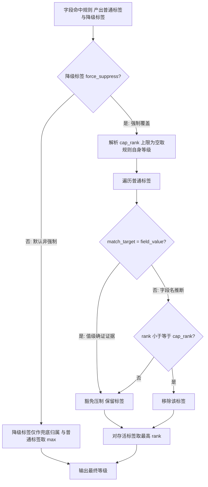
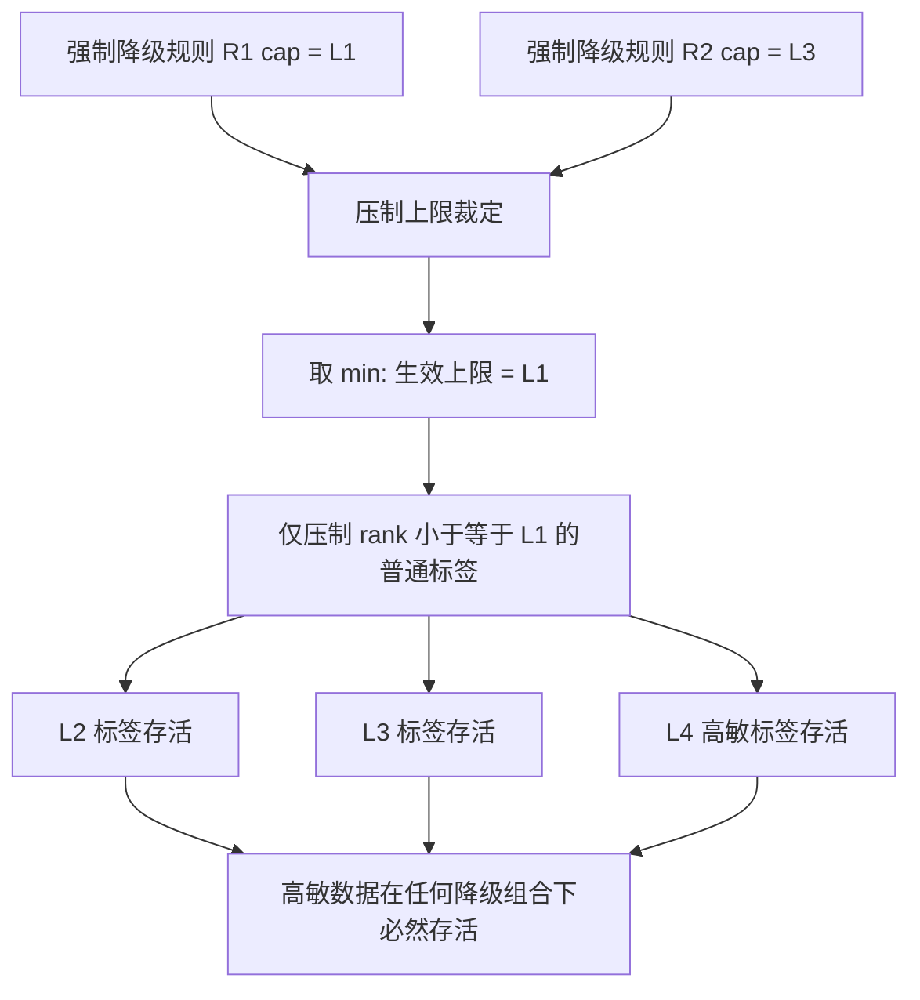
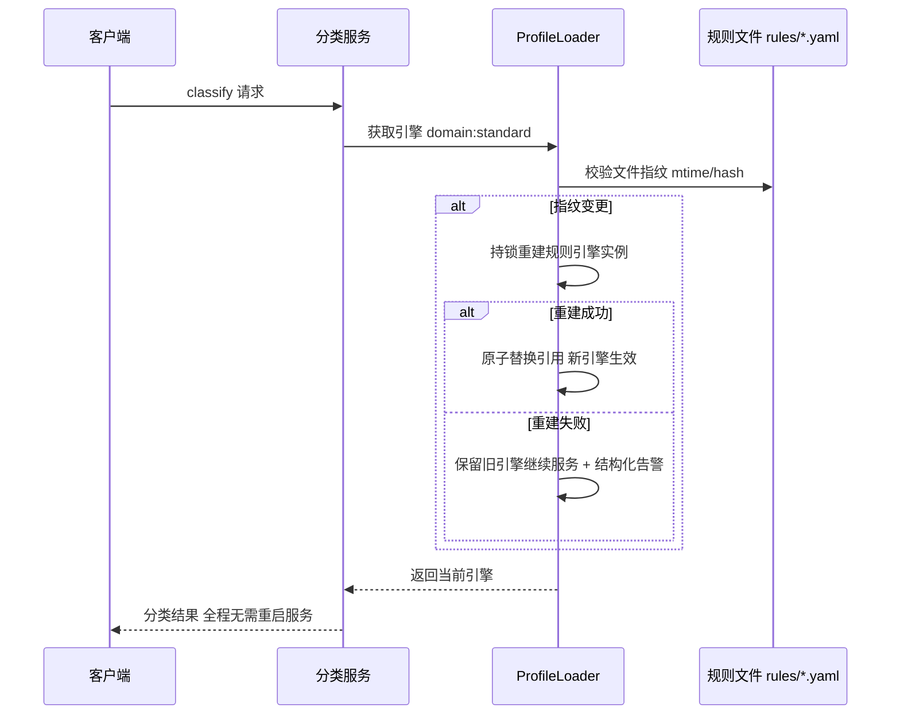
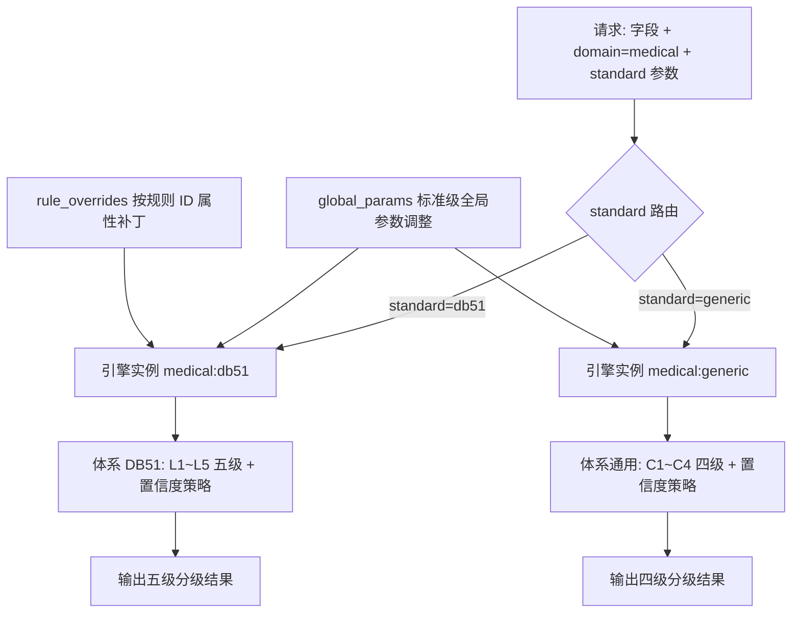
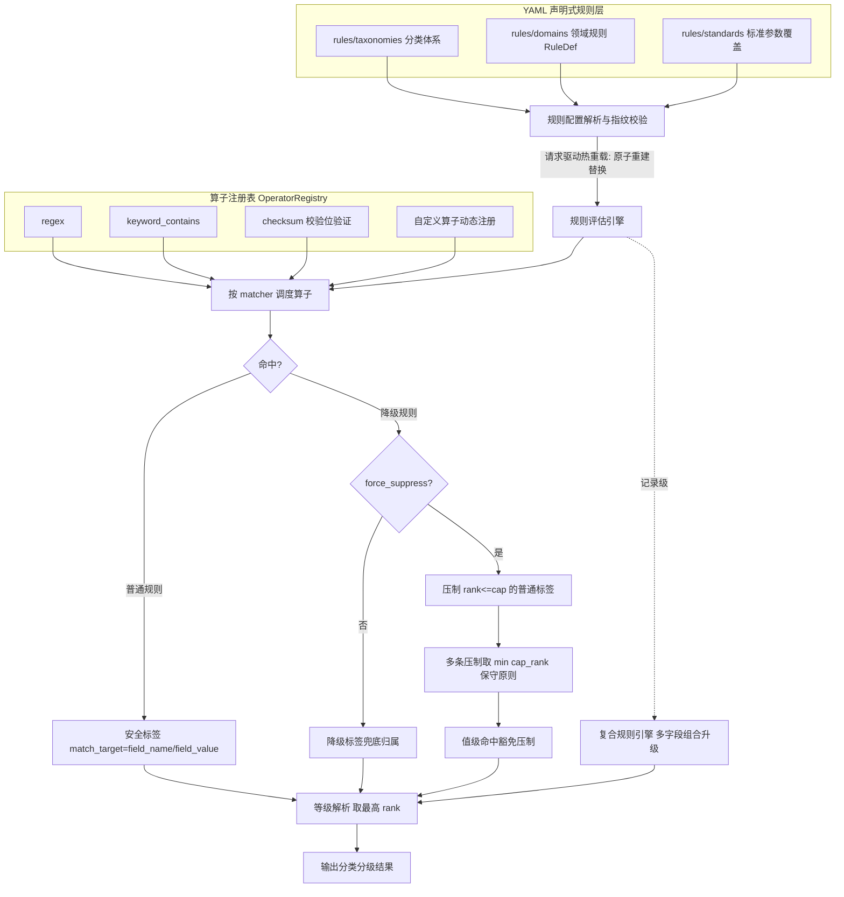

# 发明专利申请书

## 发明名称

**面向医疗数据分类分级的声明式规则引擎与敏感度降级压制方法、系统及存储介质**

## 申请信息（拟）

| 项目 | 内容                                                |
|---|-----------------------------------------------------|
| 技术领域分类号（建议） | G06F 21/62（数据访问保护）、G06F 16/242（查询处理） |
| 申请人 | 深圳数联天下智能科技有限公司                        |
| 发明人 | 陈少伟                                              |
| 申请号 / 申请日 | （递交时填写）                                      |
| 代理机构 / 代理人 | （递交时填写）                                      |

---

## 技术领域

本发明涉及数据治理与数据安全技术领域，具体涉及一种面向医疗数据分类分级的声明式规则引擎，以及基于降级规则的敏感度压制方法、系统及计算机可读存储介质。

## 背景技术

数据分类分级是数据安全治理的起点。医疗行业面临多套国家、地方与行业标准并行（如 DB51/T 2989—2023 四川省健康医疗大数据应用指南等）的现实，现有技术存在以下缺陷：

1. **规则硬编码**：分类规则以代码形式实现，新增或调整规则需修改代码、重新编译、重启服务，无法适配标准快速演进与多标准并行需求。
2. **过度分类（over-classification）**：字段名规则基于命名模式匹配，存在天然误报（如科研数据集的 `patient_id` 实为匿名编号、已公开统计报表中的敏感字段名）。缺乏对"已确认低敏场景"的显式表达手段，误报只能靠人工复核消化，成本高昂。
3. **压制机制的安全风险**：若简单允许降级规则覆盖高敏标签，一旦降级规则配置错误或恶意配置，将导致高敏感数据被整体放行，形成系统性安全漏洞。
4. **标准切换困难**：同一数据域在不同合规要求下需采用不同等级体系（如 L1~L5 五级与 C1~C4 四级），现有方案需重复开发多套引擎。

## 发明内容

### 一、要解决的技术问题

本发明旨在解决：（1）分类规则的声明式表达与零代码扩展问题；（2）多套分类分级标准并行生效与热切换问题；（3）过度分类的安全压制问题，同时保证压制机制本身不被滥用。

### 二、技术方案

本发明提供一种面向医疗数据分类分级的声明式规则引擎方法，包括：

**（一）声明式规则定义。**
分类规则以结构化配置文件（优选 YAML）声明，按「分类体系（taxonomy）—领域规则（domain rules）—标准（standard）」三级组织：

1. **分类体系定义**：声明等级集合（每个等级含唯一 ID 与排序权重 rank，按 rank 升序）、默认等级与置信度策略（含最小标签置信度、大模型触发阈值、各层开关）；
2. **规则定义（RuleDef）**：每条规则声明规则 ID `id`、敏感度等级 `level`、分类类别 `category` 与匹配器列表 `matchers`；匹配器指定匹配目标（字段名 field_name 或字段值 field_value）与匹配算子及参数；
3. **匹配算子注册机制**：内置正则匹配、关键字包含、校验位验证（如身份证校验位、银行卡 Luhn）、长度约束等算子，算子通过全局注册表（operator registry）动态注册；新增算子仅需实现统一接口并注册，规则层与引擎层零修改。

**（二）规则评估与标签产出。**
引擎对输入字段逐一评估匹配器：字段名匹配与字段值匹配分别产出安全标签，标签记录匹配目标（`match_target`），使下游可区分"命名推断"与"值级确证"（如通过校验位验证的身份证号为高置信确证证据）。字段级规则评估结果按容量可配的 LRU 缓存（`PRIVACY_ENGINE_CACHE_MAX_SIZE`）缓存，高频重复字段直接命中缓存。

**（三）敏感度降级压制机制。**
针对过度分类问题，引入降级规则（DowngradeRuleDef），其关键字段包括：
- `force_suppress`：是否启用强制覆盖模式；
- `max_force_suppress_level`：压制等级上限（含），空值时使用降级规则自身等级作为上限；
- `suppress_rules`：细粒度压制白名单（仅压制指定规则 ID 产出的标签），空值表示压制所有符合条件的标签。

执行流程为：
1. **非强制模式**（`force_suppress=false`，默认）：降级标签仅作兜底归属，与普通标签共同取最高等级，不压制任何标签；
2. **强制覆盖模式**（`force_suppress=true`）：先移除排序权重不超过上限 rank（cap_rank）的普通标签，再对存活标签取最高等级；
3. **值级命中豁免**：匹配目标为字段值（field_value）的高置信标签（如校验位验证命中）豁免压制——值级证据代表确定性事实，不应被场景性降级规则覆盖。

压制机制的形式化表述如下。设 \(T\) 为字段的安全标签集合，\(R_{force}\) 为同时命中的强制覆盖型降级规则集合，生效压制上限 \(cap_{eff}\) 按式 (1) 计算（未配置 `max_force_suppress_level` 时取该规则自身等级）：

\[
cap_{eff} = \min_{r \in R_{force}}\begin{cases}
rank(r.max\_force\_suppress\_level), & \text{字段配置了压制上限}\\
rank(r.level), & \text{未配置时取规则自身等级}
\end{cases} \tag{1}
\]

普通标签移除集与存活标签集按式 (2)、(3) 计算（值级命中豁免内置于式 (2) 的谓词中）：

\[
T_{removed} = \left\{ t \in T \;\middle|\; rank(t.level) \le cap_{eff} \wedge t.match\_target = field\_name \right\} \tag{2}
\]

\[
T_{survive} = T \setminus T_{removed} \tag{3}
\]

最终等级按式 (4) 对存活标签取最高排序权重：

\[
final\_level = \operatorname*{arg\,max}_{t \in T_{survive}} rank(t.level) \tag{4}
\]

**（四）安全保守原则。**
当多条强制覆盖型降级规则同时命中时，按式 (1) 取各规则压制上限排序权重的最小值（min(cap_rank)），即执行"最保守压制"：确保在任何降级规则组合下，高于所有压制上限的高敏感标签必然存活，防止降级规则配置错误或被恶意组合导致高敏数据整体放行。

**（五）记录级复合升级。**
在字段级规则之外，提供记录级复合规则引擎：当同一记录中多个字段命中指定类别组合（如"诊断 + 用药 + 病因"同时出现）时，将整条记录升级至更高敏感等级，捕捉单字段规则无法表达的组合敏感性。

**（六）多标准热切换与热重载。**
1. 按「领域:标准」维度并行加载多套体系与规则，请求携带 domain/standard 参数即可路由至对应引擎实例；
2. 规则配置文件变更由请求驱动检测与热重载：请求到达时校验规则文件指纹（如 mtime/hash），发现变更则原子性重建引擎实例并替换引用，无需重启服务；重建失败保留旧引擎继续服务（fail-safe）。

**（七）标准级参数覆盖。**
支持标准级全局参数调整（`global_params`）与按规则 ID 的属性补丁（`rule_overrides`），使同一领域规则在不同标准下可差异化生效而无需复制规则文件。设标准 \(s\) 下规则 \(r\) 的有效参数按式 (5) 依次应用规则默认参数、标准级全局参数与按规则 ID 的属性补丁（补丁优先级逐级升高）：

\[
params_{eff}(r, s) = patch_{override}(params_0(r),\, global\_params(s),\, rule\_overrides(s)[r.id]) \tag{5}
\]

本发明还提供实现上述方法的规则引擎系统与计算机可读存储介质。

### 三、有益效果

1. **零代码规则扩展**：新增规则/算子/标准仅需修改 YAML 配置并注册算子，无需改动引擎代码与重启服务。
2. **误报可治理**：降级压制机制为"已确认低敏场景"提供显式、可审计的表达手段，显著降低人工复核量。
3. **压制安全可控**：min(cap_rank) 保守原则与值级命中豁免双重防线，确保压制机制不会成为高敏数据放行通道。
4. **多标准并行**：同一引擎框架支撑多套等级体系并行与热切换，适配区域医疗数据跨标准流转场景。
5. **声明式可审计**：规则、压制白名单与参数覆盖全部以配置文件呈现，策略变更纳入版本控制与代码评审，安全策略"所见即所得"。

### 四、与现有技术的对比

| 对比维度 | 最接近现有技术 | 本发明区别特征 | 带来的技术效果 |
|---|---|---|---|
| 规则定义 | 规则硬编码于引擎代码 | YAML 声明式规则 + 算子注册表，配置即扩展 | 新增规则/算子/标准零代码、免重启 |
| 敏感度降级 | 无显式降级表达能力，误报只能人工复核 | force_suppress 强制压制 + 压制等级上限 + 压制白名单 | 已确认低敏场景可显式、可审计地压制，误报可治理 |
| 降级安全 | 降级逻辑可整体放行高敏数据 | min(cap_rank) 保守原则 + 值级命中豁免双防线 | 高敏标签在任何降级规则组合下必然存活 |
| 标准适配 | 单一固定分类标准 | domain:standard 多体系并行 + 请求驱动热重载 | 跨标准流转免重启切换，策略变更可版本审计 |

### 五、创新点强化与可验证实施

**（一）创新点强化**

1. 以 `match_target=field_name/value` 区分推断性证据和事实性证据，并规定事实性高敏证据对任何降级规则具有不可压制的优先权。
2. 以 `min(cap_rank)` 实现多条强制压制规则的保守合取，同时保留被压制标签和命中规则，避免“结果安全但原因不可追溯”。
3. 将声明式规则的签名校验、版本化发布、原子切换和失败回退纳入分类引擎，而不是把 YAML 当作可信本地文件。
4. 多标准结果按 `domain:standard` 隔离计算；跨标准只通过显式映射表转换，不直接比较不同标准的 rank。

**（二）确定性优先级与规则发布协议**

规则命中后按以下顺序处理：值级确证标签 > 已签名的强制安全标签 > 普通值级标签 > 字段名推断标签 > 默认标签。对每一条压制规则计算 `effective_cap=min(cap_rank)`，但仅对满足 `match_target=field_name` 且不含值级确证的标签生效。复合升级在压制前后各执行一次，结果取安全上界，并记录两次计算的版本和差异。

规则发布采用“生成候选版本—校验 schema、算子白名单、正则复杂度和等级闭包—验签—影子评估—原子切换”六步协议。候选版本校验失败、签名不匹配、版本回退或运行时异常时继续使用最后一个健康版本；切换以不可变 `policy_version` 为请求快照，避免热重载期间同一请求混用新旧规则。

**（三）边界情况与抗滥用设计**

- 自定义算子必须声明输入类型、超时、资源上限和确定性标识；未注册、非确定性或超时算子按未命中处理并触发复核。
- 正则表达式限制嵌套量词和执行时间，防止 ReDoS；YAML 禁止远程 include、对象反序列化和任意代码片段。
- 多字段复合规则采用稳定字段路径和缺失值三态逻辑（命中/未命中/未知），未知不得被当作安全否定。
- 配置变更、规则命中、压制和回退均写入带版本的审计记录；规则缓存按版本失效，旧版本仅允许处理已建立的请求快照。

**（四）验证指标与从属保护点**

建议增加规则闭包测试、压制不可绕过测试、热重载并发测试、恶意配置测试和跨标准隔离测试，测量高敏事实保留率、误压制率、版本一致性、P99评估延迟及回退成功率。可从属限定：规则包签名与密钥轮换、影子版本双执行比对、按租户的算子配额、规则命中证据哈希，以及复合升级与压制的固定执行顺序。

## 术语与符号说明

| 术语/符号 | 含义 |
|---|---|
| 分类体系 taxonomy | 等级集合（含 rank）、默认等级与置信度策略的声明 |
| 领域规则 RuleDef | 规则定义：规则标识、敏感度等级、分类类别与匹配器列表 |
| 降级规则 DowngradeRuleDef | 声明强制覆盖开关、压制等级上限与压制白名单的规则 |
| 匹配目标 match_target | 标签来源：字段名（field_name，命名推断）或字段值（field_value，值级确证） |
| 匹配算子 | 由算子注册表管理的匹配实现（正则/关键字包含/校验位验证/长度约束/自定义） |
| 强制覆盖 force_suppress | 降级规则的强制压制开关，开启后移除不超过压制上限的普通标签 |
| 压制等级上限 max_force_suppress_level | 可压制到的最高等级（含），空值取降级规则自身等级 |
| 压制白名单 suppress_rules | 仅压制指定规则 ID 产出的标签，空值表示压制所有符合条件的标签 |
| cap_eff | 生效压制上限，多条强制压制规则取各上限排序权重的最小值 |
| 值级命中豁免 | 匹配目标为字段值的标签不受场景性降级规则压制 |
| 兜底归属 | 非强制模式下降级标签与普通标签共同取最高等级 |
| domain:standard | 引擎实例缓存键：领域与标准的组合维度 |
| 全局参数 global_params | 标准级对全部规则生效的参数调整 |
| 规则补丁 rule_overrides | 标准级按规则 ID 的属性补丁，优先级高于全局参数 |
| 指纹校验 | 请求驱动热重载时对规则文件的修改时间/内容哈希校验 |

## 附图说明

- **图 1**：声明式规则引擎整体架构图（YAML 规则层 → 算子注册表 → 评估引擎 → 安全标签输出）。
- **图 2**：降级压制执行流程图（非强制模式与强制覆盖模式分支、值级豁免判断）。
- **图 3**：多条强制压制规则 min(cap_rank) 保守原则示意图。
- **图 4**：请求驱动的规则热重载时序图。
- **图 5**：多标准（domain:standard）并行路由示意图。

## 附图详览（图 2 ~ 图 5）

### 图 2：降级压制执行流程图



```
 字段命中标签 ──► 降级标签 force_suppress?
                     │否(默认)            │是
                     ▼                   ▼
       兜底归属: 与普通标签取 max   解析 cap_rank
                     │                   ▼
                     │        遍历普通标签:
                     │          match_target=field_value? ──是──► 豁免压制
                     │          rank <= cap_rank? ──是──► 移除
                     │                   │
                     └────────┬────────┘
                              ▼
              存活标签取最高 rank ──► 最终等级
```

### 图 3：多条强制压制规则 min(cap_rank) 保守原则示意图



```
 降级规则 R1: cap = L1 ─┐
                        ├─► min(cap_rank) ─► 生效上限 = L1
 降级规则 R2: cap = L3 ─┘

 标签 rank:   L1    L2    L3    L4
 压制结果:    移除  存活  存活  存活(高敏必然存活)

 效果: 即使降级规则被恶意配置为高等级上限,
       保守原则仍保证较高敏感标签不被抹除
```

### 图 4：请求驱动的规则热重载时序图



```
 客户端          分类服务          ProfileLoader        规则文件
   │ classify ────►│                     │                  │
   │               │ 获取引擎 ────────►│                  │
   │               │                     │ 校验文件指纹 ────►│
   │               │                     │◄── 指纹变更 ──────│
   │               │                     │ 持锁重建引擎实例    │
   │               │                     │ 成功→原子替换引用   │
   │               │                     │ 失败→保留旧引擎+告警 │
   │               │◄── 返回当前引擎 ────│                  │
   │◄── 分类结果 ──│  (全程无需重启)                      │
```

### 图 5：多标准（domain:standard）并行路由示意图



```
              请求 (domain=medical, standard=?)
                              │
              ┌────────────┴────────────┐
              ▼                          ▼
   ┌───────────────────┐   ┌───────────────────┐
   │ 引擎 medical:db51  │   │ 引擎 medical:generic │
   │ 体系: L1~L5 五级   │   │ 体系: C1~C4 四级     │
   │ + 置信度策略       │   │ + 置信度策略         │
   │ global_params 覆盖 │   │ rule_overrides 补丁 │
   └─────────┬─────────┘   └─────────┬─────────┘
             ▼                          ▼
      五级分级结果                四级分级结果
   (两套引擎按 domain:standard 键独立缓存并行生效)
```

## 具体实施方式

**实施例 1：声明式规则定义。**
在 `rules/domains/medical.yaml` 中声明身份证规则：

```yaml
rules:
  - id: PII_ID_CARD
    level: L4
    category: PII_ID_CARD
    matchers:
      - target: field_name
        operator: regex
        params: {pattern: "(?i)id_?card|身份证"}
      - target: field_value
        operator: id_card_checksum
        params: {}
downgrade_rules:
  - id: PUBLIC_STAT_REPORT
    level: L1
    category: PUBLIC_DATA
    force_suppress: true
    max_force_suppress_level: L2
    matchers:
      - target: field_name
        operator: keyword_contains
        params: {keywords: ["public_stat", "公开报表"]}
```

**实施例 2：强制压制流程。**
某字段同时命中普通规则（L4，field_name 匹配）与强制降级规则（cap=L2）。引擎先移除 rank ≤ rank(L2) 的普通标签，再取存活标签最高等级；若该普通标签为 field_value 校验位命中，则豁免压制，最终仍为 L4。

**实施例 3：min(cap_rank) 保守原则。**
字段同时命中两条强制降级规则，cap 分别为 L1 与 L3。压制上限取 min(rank(L1), rank(L3)) = rank(L1)，仅压制 rank ≤ L1 的标签，L2/L3/L4 标签全部存活——即便降级规则被恶意配置为高等级上限，保守原则仍保证较高敏感标签不被抹除。

**实施例 4：多标准热切换。**
同一医疗域同时加载 `db51`（L1~L5）与 `generic`（C1~C4）两套分类体系，请求参数 `standard=db51` 路由至 DB51 引擎并输出五级分级；`standard=generic` 输出四级分级。两套引擎实例按 `domain:standard` 键独立缓存。

**实施例 5：请求驱动热重载。**
运维更新 `rules/domains/medical.yaml` 后无需重启服务；下一次分类请求到达时，引擎检测到规则文件指纹变化，持锁重建规则引擎实例并原子替换，重建期间旧引擎继续服务，重建失败记录告警并保留旧引擎。

**实施例 6：自定义算子注册。**
业务方需要"行政区划代码前缀匹配"算子：实现统一算子接口 `match(field, params) -> bool`，经注册表 `register("admin_code_prefix", impl)` 完成注册；随后在 YAML 规则中以 `operator: admin_code_prefix` 引用，引擎层与规则层零修改，验证新算子无需改动既有规则。

**实施例 7：值级命中豁免完整场景。**
`id_card` 字段同时命中普通规则（field_name 正则 → L4）与强制降级规则（`PUBLIC_STAT_REPORT`，cap=L2）。若标签仅来自字段名匹配，则被压制移除、字段降至 L2；若同时存在字段值校验位验证命中（`operator: id_card_checksum`，field_value → L4），该标签豁免压制，最终等级仍为 L4——确定性事实不被场景性规则覆盖。

**实施例 8：记录级复合升级。**
某病历记录包含 `diagnosis`（诊断）、`medication`（用药）与 `etiology`（病因）三个字段，各字段单看均未达最高等级，但复合规则声明"三者同时命中 → 记录级 L4"。引擎对整条记录评估组合条件命中后，将记录级等级上调至 L4，供下游对整条记录执行更严格保护。

**实施例 9：标准级参数覆盖。**
同一医疗域在 `db51` 标准下设置 `global_params: {min_tag_confidence: 0.6}`，并对规则 `PII_ID_CARD` 追加 `rule_overrides: {PII_ID_CARD: {level: L4}}`；在 `generic` 标准下不设置任何覆盖。两套标准共享同一领域规则文件，按式 (5) 求值后差异化生效，无需复制规则。

**实施例 10：关键参数配置表。**

| 参数 | 默认值 | 说明 |
|---|---|---|
| `PRIVACY_ENGINE_CACHE_MAX_SIZE` | 4096 | 字段级规则评估 LRU 缓存容量 |
| `force_suppress` | false | 降级规则强制覆盖开关 |
| `max_force_suppress_level` | 规则自身等级 | 压制等级上限（含） |
| `suppress_rules` | 空 | 压制白名单，空值表示压制全部 |
| 置信度阈值族 | 随标准配置 | 随标准热切换的置信度策略参数 |
| 规则文件指纹 | mtime/hash | 请求驱动热重载的变更检测依据 |

## 权利要求书

1. 一种面向医疗数据分类分级的声明式规则引擎方法，其特征在于，包括：
   以结构化配置文件声明分类体系、领域规则与匹配器，所述领域规则至少包含规则标识、敏感度等级、分类类别与匹配器列表，所述匹配器指定匹配目标与匹配算子；
   通过算子注册表动态注册匹配算子，规则评估时按匹配器调度对应算子对字段的字段名或字段值执行匹配，命中产出记录匹配目标的安全标签；
   对同一字段的安全标签按排序权重解析最终敏感度等级。

2. 根据权利要求 1 所述的方法，其特征在于，还包括敏感度降级压制步骤：
   以降级规则声明强制覆盖开关、压制等级上限与压制白名单；
   当强制覆盖开关开启时，移除排序权重不超过压制上限且匹配目标为字段名的普通标签后解析最终等级；
   当匹配目标为字段值的标签命中时，该标签豁免压制。

3. 根据权利要求 2 所述的方法，其特征在于，所述豁免压制包括：由校验位验证算子等确定性算子对字段值命中产出的高置信标签不受降级规则压制。

4. 根据权利要求 2 所述的方法，其特征在于，当多条强制覆盖型降级规则同时命中时，压制上限取各规则压制等级上限排序权重的最小值。

5. 根据权利要求 2 所述的方法，其特征在于，当强制覆盖开关关闭时，降级标签仅作兜底归属与普通标签共同取最高等级。

6. 根据权利要求 2 所述的方法，其特征在于，当压制白名单非空时仅压制白名单中规则标识对应的标签，空值表示压制所有符合条件的标签。

7. 根据权利要求 1 所述的方法，其特征在于，还包括记录级复合升级步骤：当同一记录中多个字段命中预设类别组合时，将整条记录升级至更高敏感等级。

8. 根据权利要求 1 所述的方法，其特征在于，还包括多标准并行与热切换步骤：按领域与标准的组合维度并行加载多套分类体系与规则集，请求携带标准参数路由至对应引擎实例并独立缓存；以标准级全局参数调整与按规则标识的属性补丁差异化同一领域规则，补丁优先级高于全局参数。

9. 根据权利要求 1 所述的方法，其特征在于，还包括请求驱动热重载步骤：请求到达时校验规则配置文件指纹，发现变更时持锁重建规则引擎实例并原子替换引用，重建失败时保留旧引擎继续服务。

10. 根据权利要求 9 所述的方法，其特征在于，所述指纹校验采用配置文件修改时间或内容哈希；重建失败时输出结构化告警并保留旧引擎服务。

11. 根据权利要求 1 所述的方法，其特征在于，字段级规则评估结果按可配置容量的最近最少使用缓存进行缓存。

12. 根据权利要求 1 所述的方法，其特征在于，所述匹配算子包括正则匹配算子、关键字包含算子、校验位验证算子与长度约束算子，自定义算子经注册表注册后零修改接入引擎。

13. 根据权利要求 1 所述的方法，其特征在于，所述安全标签记录匹配目标，使下游能够区分基于字段名的命名推断与基于字段值的值级确证。

14. 一种面向医疗数据分类分级的声明式规则引擎系统，其特征在于，包括：规则配置解析模块、算子注册模块、规则评估模块、降级压制模块、复合升级模块与热重载模块，各模块协同执行权利要求 1 至 13 任一项所述的方法。

15. 一种计算机可读存储介质，其上存储有计算机程序，其特征在于，所述计算机程序被处理器执行时实现权利要求 1 至 13 任一项所述的方法。

16. 一种电子设备，其特征在于，包括处理器以及存储有计算机程序的存储器，所述计算机程序被所述处理器执行时实现权利要求 1 至 13 任一项所述的方法。

## 摘要

本发明公开了一种面向医疗数据分类分级的声明式规则引擎与敏感度降级压制方法、系统及存储介质。分类规则以 YAML 声明并按分类体系、领域规则、标准三级组织，匹配算子经注册表动态注册实现零代码扩展；针对规则引擎过度分类问题，提出降级压制机制：强制覆盖型降级规则按压制等级上限移除低敏普通标签，字段值级高置信命中豁免压制，多条压制规则命中时取压制上限的最小值执行最保守压制，确保高敏感标签在任何降级组合下必然存活；并支持多套分类标准按领域:标准维度并行热切换与请求驱动的规则热重载。本发明显著降低规则维护与误报复核成本，同时保证压制机制不被滥用为敏感数据放行通道。

## 摘要附图（图 1：声明式规则引擎整体架构图）

### Mermaid 版本



### ASCII 版本

```
┌────────────────────── YAML 声明式规则层 ─────────────────────┐
│ taxonomies/*.yaml   domains/*.yaml   standards/*.yaml     │
│ (等级rank/置信度策略)  (RuleDef/降级规则)  (参数覆盖/补丁)        │
└───────────────────────────────┬────────────────────────┘
                                │ 请求驱动热重载
                                │ (指纹变更→持锁原子重建替换)
                                ▼
┌───────────────────── 规则评估引擎 ──────────────────────────┐
│  按 matcher 调度算子  ◄──  算子注册表 OperatorRegistry        │
│                        (regex/keyword/checksum/自定义)     │
└───────┬───────────────────────────┬──────────────┘
        │ 普通规则命中                │ 降级规则命中
        ▼                           ▼
┌──────────────────┐    ┌──────────────────────────┐
│ 安全标签          │    │ force_suppress?            │
│ match_target=    │    │  否: 兜底归属取max          │
│ field_name/value │    │  是: 压制 rank<=cap 普通标签 │
└────────┬─────────┘    │      多条取 min(cap_rank)  │
         │              │      值级命中豁免压制        │
         │              └─────────────┬────────────┘
         └────────────┬─────────────┘
                       ▼
         ┌──────────────────────────┐
         │ 等级解析: 取最高 rank       │ ◄─ 复合规则引擎
         └────────────┬─────────────┘    (多字段组合升级)
                       ▼
         ┌──────────────────────────┐
         │ 分类分级结果 (多标准并行路由) │
         │ domain:standard 维度热切换 │
         └──────────────────────────┘
```
