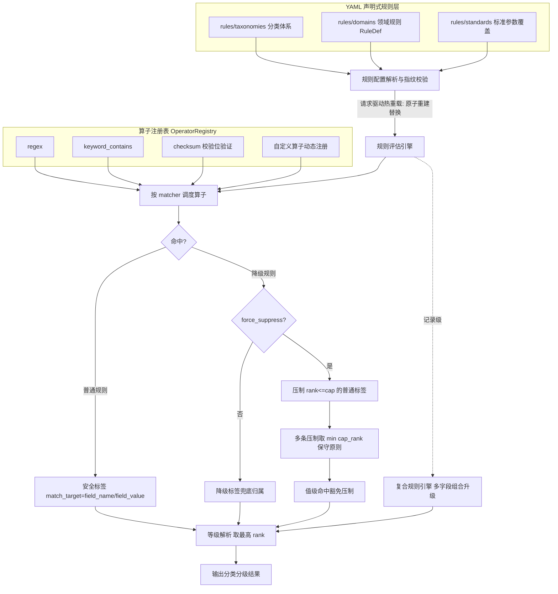
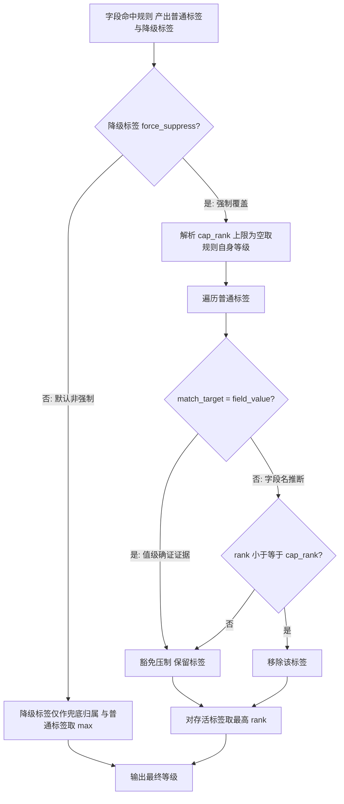
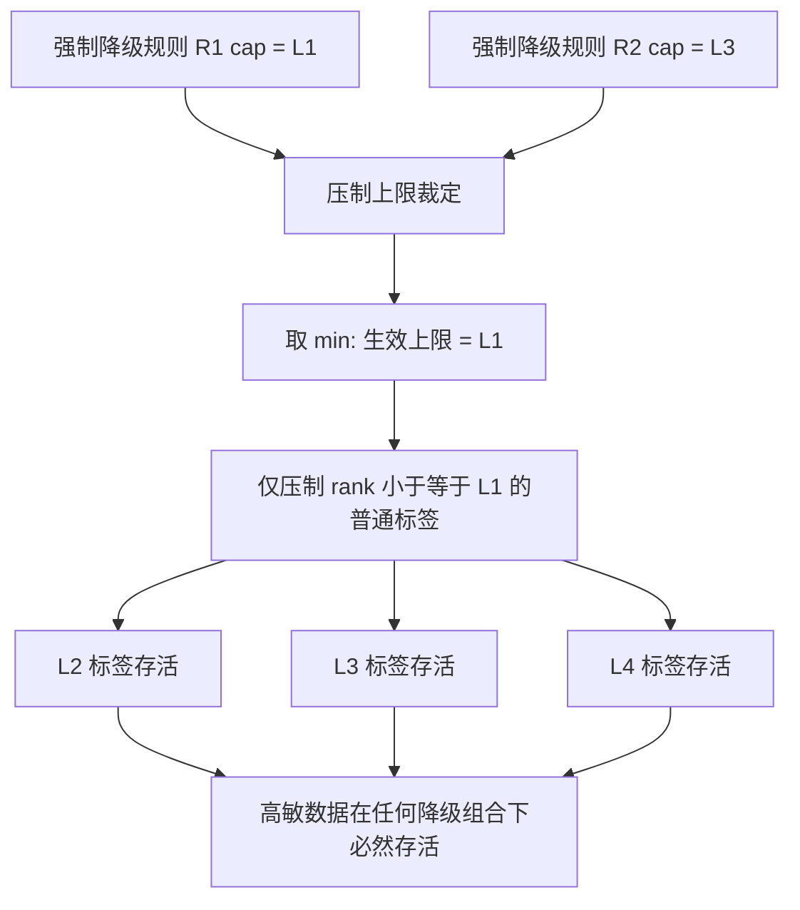
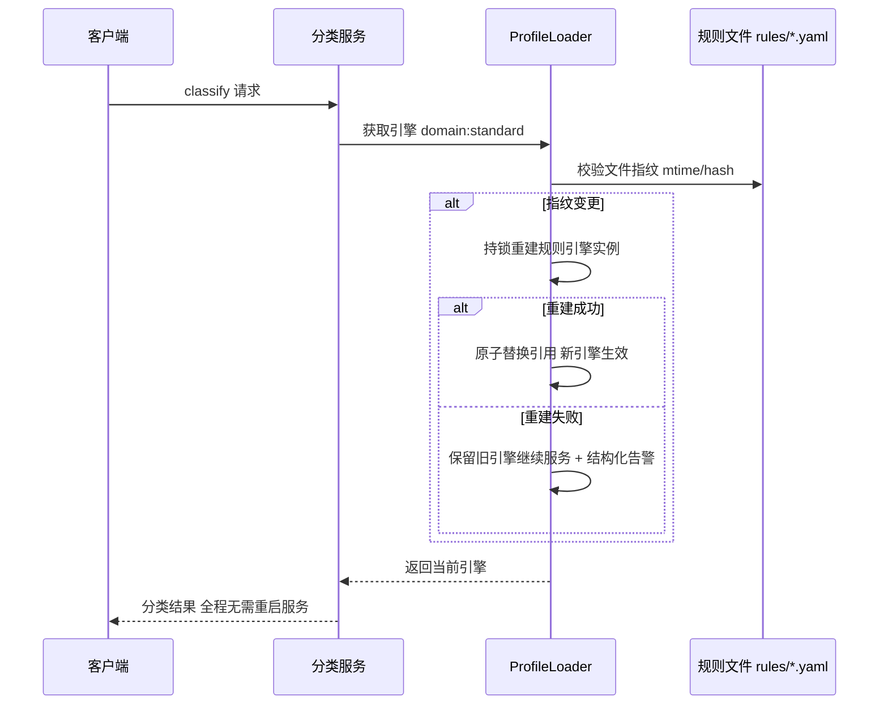
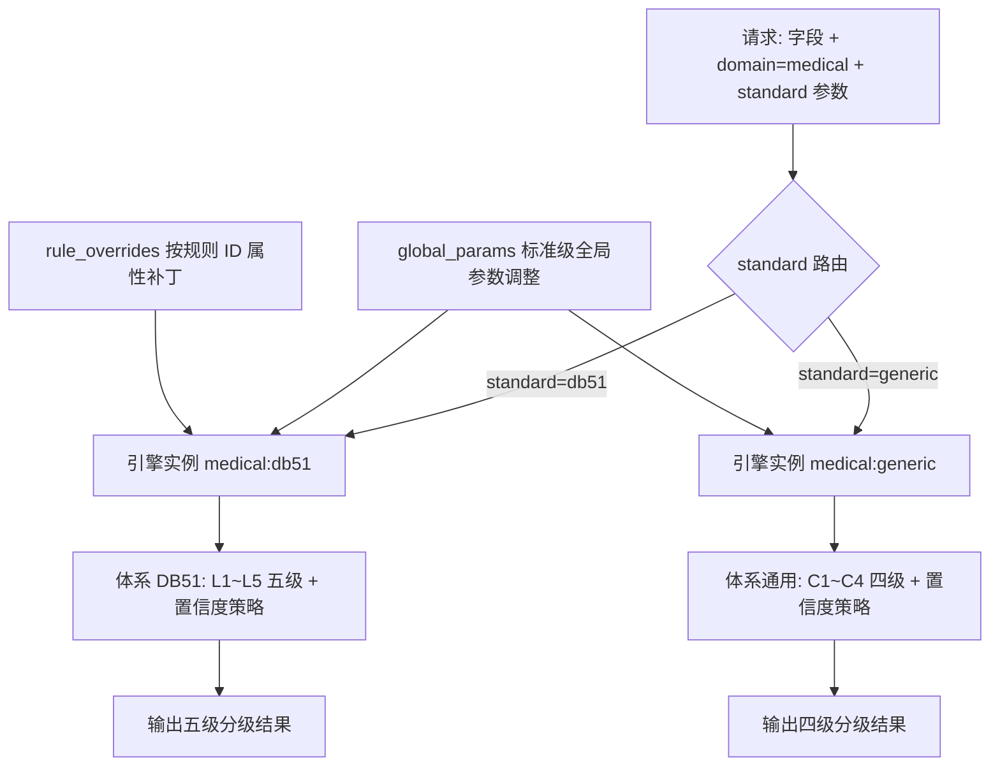

|                                  |
|:--------------------------------:|
| **深圳数联天下智能科技有限公司** |
|      **专利技术交底书模板**      |

编号：HZL-02-R01 版本号：2022

**专利申请用技术交底书模板**

交底书名称：面向医疗数据分类分级的声明式规则引擎与敏感度降级压制方法、系统及存储介质

\*\*发明人姓名：陈少伟

\*\*第一发明人姓名和身份证号码：陈少伟（身份证号码递交时补充）

申请人：深圳数联天下智能科技有限公司

通信地址（邮编）：（递交时填写）

\*\*交底书撰写人：技术团队

\*\*联系电话：（递交时填写）

\*\*Email：（递交时填写）

**交底技术书信息登记页**

\*\*提交部门：研究院

\*\*项目号：（内部维护时填写）

\*\*项目名称/所属产品(可多个，靠近公司的主营业务)：隐私本地代理（privacy-local-agent）、医疗数据安全治理平台

\*\*技术应用领域：数据安全、医疗数据治理、人工智能（Artificial Intelligence，AI）辅助分类

\*\*相关技术方向：自然语言处理（Natural Language Processing，NLP）、规则引擎、数据分类分级、差分隐私、数据脱敏

\*\*技术方案概述：

本发明提出一种面向医疗数据分类分级的声明式规则引擎与敏感度降级压制方法、系统及计算机可读存储介质。分类规则以 YAML（YAML Ain't Markup Language，一种可读的数据序列化语言）声明，并按“分类体系—领域规则—标准”三级组织；匹配算子通过算子注册表动态注册，实现规则与算子的零代码扩展。针对规则命中导致的过度分类问题，引入降级规则（DowngradeRuleDef），在强制覆盖模式下按压制等级上限移除低敏普通标签，但对匹配目标为字段值的高置信标签予以豁免，且在多条强制降级规则同时命中时取各压制上限排序权重的最小值，确保高敏感标签在任何降级组合下必然存活。系统支持多套分类标准按“领域:标准”维度并行加载、请求驱动热重载与标准级参数覆盖，可适配医疗行业多标准并行的合规需求。

**交底书注意事项：**

本交底书已按照通用填写要求提供完整技术内容，关键术语、背景技术、技术方案、有益效果、替代方案及保护点详见后续章节。

**缩略语和关键术语定义列表（交底书中如有的话，请说明）**

> 1、YAML（YAML Ain't Markup Language）：一种可读的数据序列化语言，本发明中以 YAML 作为声明式规则配置的优选格式。
>
> 2、LRU（Least Recently Used）：最近最少使用缓存置换策略，本发明用于字段级规则评估结果的缓存。
>
> 3、RuleDef（Rule Definition）：规则定义，描述领域规则的标识、敏感度等级、分类类别与匹配器列表。
>
> 4、DowngradeRuleDef（Downgrade Rule Definition）：降级规则定义，描述强制覆盖开关、压制等级上限与压制白名单。
>
> 5、match_target（匹配目标）：安全标签的来源类型，包括字段名（field_name）与字段值（field_value）。
>
> 6、PII（Personally Identifiable Information）：个人可识别信息。
>
> 7、ReDoS（Regular Expression Denial of Service）：正则表达式拒绝服务攻击。
>
> 8、taxonomy（分类体系）：等级集合、默认等级与置信度策略的声明。
>
> 9、domain:standard：领域与标准的组合维度，用于多标准引擎实例的路由与隔离。

1.  **相关技术背景（背景技术），与本发明最相近似的现有实现方案（现有技术）**

1.1 背景技术

本发明属于数据安全与数据治理技术领域，具体涉及医疗数据分类分级中的声明式规则引擎、敏感度降级压制、多标准热切换与请求驱动热重载技术。

数据分类分级是数据安全治理的起点，其目标是在数据流转前识别数据的敏感度，从而施加差异化的访问控制、脱敏、加密和审计策略。医疗行业因涉及大量个人可识别信息（Personally Identifiable Information，PII）、诊断信息、用药记录与基因数据，对分类分级的准确性、可解释性与可审计性要求极高。与此同时，医疗数据面临国家、地方与行业多套标准并行的现实，例如 DB51/T 2989—2023《四川省健康医疗大数据应用指南》（以下简称 DB51）对同一类数据可能采用 L1~L5 五级体系，而其他场景可能采用 C1~C4 四级体系。因此，分类分级引擎必须具备规则可扩展、标准可切换、结果可审计和误报可治理的能力。

现有技术通常将分类规则以硬编码方式写入引擎源码，或者将规则存储在数据库中但缺少结构化的降级压制语义。当新增一种敏感字段模式、调整等级体系或适配新的地方标准时，需要修改代码、重新编译并重启服务，维护成本高且周期长。此外，仅基于字段名模式匹配的规则容易产生过度分类（over-classification）：例如科研数据集中的 `patient_id` 可能为匿名编号，公开统计报表中的字段名虽与敏感字段相同但实际内容已经聚合脱敏。现有系统缺乏对“已确认低敏场景”的显式表达手段，过度分类的误报只能依赖人工复核，成本高昂且容易遗漏。

1.2 与本发明相关的现有技术一

1.2.1 现有技术一的技术方案

现有技术一为面向结构化数据的传统硬编码规则分类引擎。该引擎在初始化时将分类规则以代码形式编译进程序，典型实现包括：

1. 规则存储：分类规则以函数、正则表达式常量或配置文件形式分散在源码中，规则字段名模式、敏感等级和匹配逻辑通过代码条件分支表达。
2. 评估流程：引擎遍历待分类数据表的字段名和/或字段值，对每个字段顺序调用预设的匹配函数；命中后产出固定等级的安全标签。
3. 等级解析：对同一字段产出的多个标签，直接取预设等级中的最高值作为最终敏感度等级。
4. 标准适配：等级体系与规则逻辑耦合在源码中，切换标准通常需要新建分支或重新部署。

1.2.2 现有技术一的缺点

1. 规则硬编码导致扩展困难。新增、修改或停用规则需要改动源码并重新发布，无法适配医疗行业多标准快速演进的现实需求。
2. 缺乏显式的降级压制能力。对误报字段只能人工复核后手动放行，无法通过配置化的方式在引擎层面显式、可审计地压制低敏场景。
3. 压制机制存在安全风险。若简单允许某条规则覆盖高敏标签，一旦配置错误或遭受恶意配置，将导致高敏感数据被整体放行，形成系统性安全漏洞。
4. 单标准架构难以并行支持多套等级体系。不同地区、不同业务线需要重复建设多套引擎，造成代码冗余和维护碎片化。

1.3 与本发明相关的现有技术二

1.3.1 现有技术二的技术方案

现有技术二为基于机器学习模型的数据敏感度自动识别方法。该方法利用自然语言处理（Natural Language Processing，NLP）模型、命名实体识别（Named Entity Recognition，NER）模型或大语言模型（Large Language Model，LLM）对字段名、字段值乃至上下文进行语义理解，输出敏感概率或敏感等级。

典型实现包括：

1. 模型训练：使用已标注的医疗数据集训练分类模型，学习字段名、字段值与敏感度之间的映射关系。
2. 推理预测：将待分类字段输入模型，模型输出概率分布或等级分布。
3. 阈值判定：根据预设阈值将概率转换为最终敏感等级，并可能引入人工复核流程。

1.3.2 现有技术二的缺点

1. 模型推理结果缺乏可解释性，无法向监管方清晰说明某字段为何被判定为某一等级。
2. 难以表达确定性的领域规则。例如身份证号码校验位验证、银行卡 Luhn 校验等强事实证据无法通过模型训练获得零误报保障。
3. 模型无法提供结构化的降级压制语义。对“已确认低敏场景”的处理仍然依赖人工或外部脚本，无法在引擎内部形成安全闭环。
4. 大模型推理资源消耗高，且存在幻觉风险，不适合作为医疗数据分类分级的唯一依据。

2.  **本发明技术方案的详细阐述（发明内容）**

2.1 本发明所要解决的技术问题（发明目的）

针对现有技术的不足，本发明要解决以下技术问题：

1. 分类规则的声明式表达与零代码扩展问题：使规则、算子、分类体系和标准的增删改查均无需修改引擎源码，降低维护成本并支持快速适配新合规要求。
2. 过度分类的显式治理问题：为“已确认低敏场景”提供可配置、可审计的敏感度降级压制机制，减少人工复核量。
3. 压制机制自身的安全问题：在允许降级的同时，确保高敏感标签不会被错误配置或恶意配置整体放行。
4. 多套分类分级标准并行生效与热切换问题：在同一引擎框架内同时支持多套等级体系，并按请求参数动态路由与热重载。
5. 规则策略的可审计与版本管理问题：使分类规则、降级规则、参数覆盖等策略变更纳入版本控制与代码评审，实现策略“所见即所得”。

2.2 本发明提供的完整技术方案（发明方案）

本发明提供一种面向医疗数据分类分级的声明式规则引擎方法，相应系统与计算机可读存储介质。核心思想是：将分类规则、降级规则、分类体系和标准参数全部声明化为结构化配置文件，通过算子注册表实现算子的动态扩展，通过安全保守的降级压制机制治理过度分类，通过“领域:标准”维度实现多标准并行与热切换。

2.2.1 声明式规则定义

分类规则以结构化配置文件声明，优选 YAML 格式，按“分类体系（taxonomy）—领域规则（domain rules）—标准（standard）”三级组织。

（1）分类体系定义

分类体系声明等级集合、默认等级与置信度策略。每个等级包含唯一标识（ID）与排序权重（rank），等级按 rank 升序排列，rank 越大代表敏感度越高。默认等级用于没有任何规则命中的字段。置信度策略包含最小标签置信度、大模型触发阈值、各层开关等参数，使不同标准可以独立调整决策阈值。

（2）领域规则定义（RuleDef）

每条领域规则声明规则标识（id）、敏感度等级（level）、分类类别（category）与匹配器列表（matchers）。每个匹配器指定匹配目标（match_target）与匹配算子及参数：

- 匹配目标为字段名（field_name）时，表示基于命名模式进行推断；
- 匹配目标为字段值（field_value）时，表示基于字段内容执行确定性验证。

（3）降级规则定义（DowngradeRuleDef）

降级规则用于表达“已确认低敏场景”。其关键字段包括：

- `force_suppress`：是否启用强制覆盖模式；
- `max_force_suppress_level`：压制等级上限（含），未配置时使用降级规则自身等级作为上限；
- `suppress_rules`：细粒度压制白名单，仅压制指定规则标识产出的标签；空值表示压制所有符合条件的标签。

（4）匹配算子注册机制

引擎内置正则匹配算子、关键字包含算子、校验位验证算子（如身份证校验位、银行卡 Luhn 校验）与长度约束算子等基础算子。所有算子通过全局算子注册表（operator registry）动态注册。新增算子时，业务方只需实现统一接口并注册，规则层与引擎层无需修改。算子接口示例为 `match(field, params) -> bool`，引擎按匹配器中的算子名称从注册表调度对应实现。

2.2.2 规则评估与安全标签产出

引擎对输入字段逐一评估匹配器：

1. 字段名匹配与字段值匹配分别产出安全标签，每个标签记录匹配目标（match_target），使下游能够区分“命名推断”与“值级确证”。例如，通过身份证校验位验证的身份证号标签为高置信确证证据，其可信度高于仅由字段名正则推断出的标签。
2. 命中降级规则时，同样产出降级标签，但降级标签的后续处理取决于 `force_suppress` 字段。
3. 字段级规则评估结果按容量可配的最近最少使用（Least Recently Used，LRU）缓存进行缓存。缓存键通常由字段名、字段值特征与规则版本指纹构成，高频重复字段可直接命中缓存，降低重复计算开销。

2.2.3 敏感度降级压制机制

针对过度分类问题，本发明提出安全保守的降级压制流程。

（1）非强制模式（`force_suppress=false`，默认）

降级标签仅作兜底归属，与普通标签共同取最高等级，不压制任何标签。

（2）强制覆盖模式（`force_suppress=true`）

引擎先解析压制等级上限对应的排序权重 cap_rank。若 `max_force_suppress_level` 为空，则取降级规则自身等级对应的 rank 作为 cap_rank。随后遍历普通标签：

- 若普通标签的匹配目标为字段值（field_value），则该标签代表确定性事实证据，豁免压制；
- 若普通标签的匹配目标为字段名（field_name）且其等级 rank 不超过 cap_rank，则移除该标签；
- 若普通标签的等级 rank 高于 cap_rank，则保留。

最后，对存活标签取最高 rank 作为最终等级。

（3）多条强制降级规则的保守合取

当多条强制覆盖型降级规则同时命中时，按式（1）计算生效压制上限 cap_eff，取各规则压制上限排序权重的最小值：

\[
cap_{eff} = \min_{r \in R_{force}}\begin{cases}
rank(r.max\_force\_suppress\_level), & \text{字段配置了压制上限}\\
rank(r.level), & \text{未配置时取规则自身等级}
\end{cases} \tag{1}
\]

该设计称为“最保守压制”：即使某条降级规则被错误配置为较高的压制上限，只要存在另一条更严格的降级规则，最终生效上限仍取最严格者，确保高于所有压制上限的高敏感标签必然存活。

普通标签移除集与存活标签集按式（2）、式（3）计算，其中值级命中豁免内置于式（2）的谓词中：

\[
T_{removed} = \left\{ t \in T \;\middle|\; rank(t.level) \le cap_{eff} \wedge t.match\_target = field\_name \right\} \tag{2}
\]

\[
T_{survive} = T \setminus T_{removed} \tag{3}
\]

最终等级按式（4）对存活标签取最高排序权重：

\[
final\_level = \operatorname*{arg\,max}_{t \in T_{survive}} rank(t.level) \tag{4}
\]

（4）值级命中豁免

匹配目标为字段值的标签由校验位验证算子等确定性算子命中产出，代表对字段内容的事实性确认。该标签不受场景性降级规则压制，避免“字段名看起来敏感但实际为公开统计”的场景错误覆盖强事实证据。

2.2.4 记录级复合升级

在字段级规则之外，本发明提供记录级复合规则引擎。当同一记录中多个字段命中指定类别组合（例如“诊断 + 用药 + 病因”同时出现）时，引擎将整条记录升级至更高敏感等级，从而捕捉单字段规则无法表达的组合敏感性。复合规则在字段级压制前后各执行一次，结果取安全上界，并记录两次计算的版本和差异。

2.2.5 多标准热切换与热重载

（1）多标准并行加载

引擎按“领域:标准”维度并行加载多套分类体系与规则集。每个维度组合对应一个独立的规则引擎实例，实例缓存以 `domain:standard` 为键。请求携带 `domain` 与 `standard` 参数即可路由至对应引擎实例，输出该标准下的分级结果。

（2）标准级参数覆盖

同一领域规则在不同标准下可差异化生效，无需复制规则文件：

- `global_params`：标准级全局参数调整，对全部规则生效；
- `rule_overrides`：标准级按规则标识的属性补丁，优先级高于 `global_params`。

设标准 s 下规则 r 的有效参数按式（5）依次应用规则默认参数、标准级全局参数与按规则标识的属性补丁：

\[
params_{eff}(r, s) = patch_{override}(params_0(r),\, global\_params(s),\, rule\_overrides(s)[r.id]) \tag{5}
\]

（3）请求驱动热重载

规则配置文件变更由请求驱动检测与热重载。请求到达时，引擎校验规则文件指纹（如修改时间 mtime 或内容哈希）。发现变更后，持锁重建规则引擎实例；重建成功则原子性替换引用，新引擎生效；重建失败则保留旧引擎继续服务并输出结构化告警，实现 fail-safe。

2.2.6 安全与审计增强设计

1. 规则发布协议：候选规则版本需依次完成 schema 校验、算子白名单校验、正则复杂度校验、等级闭包校验、签名验证、影子评估与原子切换。任一环节失败均回退至最后一个健康版本。
2. 算子安全：自定义算子必须声明输入类型、超时、资源上限和确定性标识；未注册、非确定性或超时算子按未命中处理并触发复核。
3. 正则安全：正则表达式限制嵌套量词和执行时间，防止 ReDoS 攻击。
4. 配置安全：YAML 配置文件禁止远程 include、对象反序列化和任意代码片段，防止配置注入。
5. 审计记录：配置变更、规则命中、压制和回退均写入带版本的审计记录；规则缓存按版本失效，旧版本仅允许处理已建立的请求快照。
6. 请求快照：切换以不可变 `policy_version` 为请求快照，避免热重载期间同一请求混用新旧规则。

2.2.7 系统框图与流程图

**图 1：声明式规则引擎整体架构图**



**图 2：降级压制执行流程图**



**图 3：多条强制压制规则 min(cap_rank) 保守原则示意图**



**图 4：请求驱动的规则热重载时序图**



**图 5：多标准（domain:standard）并行路由示意图**



2.2.8 典型配置与参数示例

**实施例 1：声明式规则定义**

在 `rules/domains/medical.yaml` 中声明身份证规则与降级规则：

```yaml
rules:
  - id: PII_ID_CARD
    level: L4
    category: PII_ID_CARD
    matchers:
      - target: field_name
        operator: regex
        params: {pattern: "(?i)id_?card|身份证"}
      - target: field_value
        operator: id_card_checksum
        params: {}
downgrade_rules:
  - id: PUBLIC_STAT_REPORT
    level: L1
    category: PUBLIC_DATA
    force_suppress: true
    max_force_suppress_level: L2
    matchers:
      - target: field_name
        operator: keyword_contains
        params: {keywords: ["public_stat", "公开报表"]}
```

**实施例 2：强制压制流程**

某字段同时命中普通规则（L4，字段名匹配）与强制降级规则（cap=L2）。引擎先移除 rank 不超过 rank(L2) 的普通标签，再取存活标签最高等级；若该普通标签为字段值校验位命中，则豁免压制，最终仍为 L4。

**实施例 3：最保守压制原则**

字段同时命中两条强制降级规则，cap 分别为 L1 与 L3。压制上限取 min(rank(L1), rank(L3)) = rank(L1)，仅压制 rank ≤ L1 的标签，L2/L3/L4 标签全部存活。

**实施例 4：多标准热切换**

同一医疗域同时加载 `db51`（L1~L5）与 `generic`（C1~C4）两套分类体系，请求参数 `standard=db51` 路由至 DB51 引擎并输出五级分级；`standard=generic` 输出四级分级。

**实施例 5：值级命中豁免完整场景**

`id_card` 字段同时命中普通规则（字段名正则 → L4）与强制降级规则（`PUBLIC_STAT_REPORT`，cap=L2）。若标签仅来自字段名匹配，则被压制移除、字段降至 L2；若同时存在字段值校验位验证命中（`operator: id_card_checksum`，field_value → L4），该标签豁免压制，最终等级仍为 L4。

**关键参数配置表**

| 参数 | 默认值 | 说明 |
|---|---|---|
| `PRIVACY_ENGINE_CACHE_MAX_SIZE` | 4096 | 字段级规则评估 LRU 缓存容量 |
| `force_suppress` | false | 降级规则强制覆盖开关 |
| `max_force_suppress_level` | 规则自身等级 | 压制等级上限（含） |
| `suppress_rules` | 空 | 压制白名单，空值表示压制全部 |
| 置信度阈值族 | 随标准配置 | 随标准热切换的置信度策略参数 |
| 规则文件指纹 | mtime/hash | 请求驱动热重载的变更检测依据 |

2.3 本发明技术方案带来的有益效果

1. **零代码规则扩展**：新增规则、算子或标准仅需修改 YAML 配置并注册算子，无需改动引擎代码与重启服务，显著降低医疗数据合规适配成本。
2. **误报可治理**：降级压制机制为“已确认低敏场景”提供显式、可审计的表达手段，显著降低人工复核量。
3. **压制安全可控**：最保守压制原则与值级命中豁免构成双重防线，确保压制机制不会成为高敏数据放行通道。
4. **多标准并行适配**：同一引擎框架支撑多套等级体系并行与热切换，适配区域医疗数据跨标准流转场景。
5. **声明式可审计**：规则、压制白名单与参数覆盖全部以配置文件呈现，策略变更纳入版本控制与代码评审，安全策略“所见即所得”。
6. **高可用热重载**：请求驱动热重载在不影响在线服务的前提下完成规则更新，重建失败时自动回退至旧引擎，保障服务连续性。

3.  **针对2中的技术方案，是否还有别的替代方案同样能完成发明目的**

3.1 规则配置格式的替代方案

除 YAML 外，可采用 JSON（JavaScript Object Notation）、TOML 或 XML（Extensible Markup Language）等结构化格式描述分类规则、降级规则与标准参数，只要配置文件具备同等的层级结构与字段语义即可。

3.2 降级规则上限聚合方式的替代方案

在多条强制降级规则同时命中的场景下，除“取各上限排序权重的最小值”这一最保守压制外，也可采用“取交集”或“显式优先级排序”的方式确定生效上限。其中取交集方式同样能够保证高敏感标签的存活，优先级排序方式则需额外定义规则优先级字段。

3.3 值级命中豁免判定的替代方案

除依据匹配目标 `match_target=field_value` 进行豁免外，也可引入置信度阈值判定：当标签置信度高于预设阈值时，即视为确定性事实证据并豁免压制。该替代方案可与值级命中豁免结合使用。

3.4 热重载触发机制的替代方案

除请求驱动并校验文件指纹外，也可采用定时轮询文件系统、监听文件系统事件（如 inotify）或接收配置中心推送消息的方式触发规则重建。请求驱动方式实现简单且无额外后台任务，而事件驱动方式可降低变更延迟。

3.5 缓存替换策略的替代方案

字段级规则评估结果除使用最近最少使用（LRU）缓存外，也可采用固定时间窗口缓存（TTL，Time-To-Live）、分段式缓存或按租户隔离缓存，以适应不同访问模式与内存约束。

3.6 算子注册表的替代实现

算子注册表既可通过全局字典实现，也可通过基于入口点（entry points）的插件机制、依赖注入容器或模块动态加载机制实现，只要引擎能够在运行时发现并调用算子实现即可。

3.7 复合升级触发粒度的替代方案

记录级复合升级既可在单条记录上执行，也可在批量数据块或滑动时间窗口上执行。当数据以流式方式到达时，可引入窗口触发器，在满足组合条件的时间窗口内触发升级。

4.  **本发明的技术关键点和欲保护点是什么？**

1. **声明式规则三级组织结构**：分类体系（taxonomy）、领域规则（RuleDef）、标准（standard）三级组织，实现规则与引擎代码解耦。
2. **匹配算子注册表**：通过算子注册表动态注册匹配算子，新增算子无需修改规则层与引擎层。
3. **匹配目标区分机制**：安全标签记录匹配目标，区分字段名推断（field_name）与字段值确证（field_value），并赋予值级确证标签豁免压制的优先权。
4. **敏感度降级压制机制**：通过 `force_suppress`、`max_force_suppress_level`、`suppress_rules` 等字段实现可配置、可审计的过度分类治理。
5. **最保守压制原则**：多条强制降级规则同时命中时取压制上限排序权重的最小值，确保高敏感标签必然存活。
6. **值级命中豁免**：匹配目标为字段值的高置信标签不受场景性降级规则压制。
7. **多标准并行与热切换**：按 `domain:standard` 维度独立加载、缓存与路由多套分类体系与规则集。
8. **请求驱动热重载与 fail-safe**：请求到达时校验规则文件指纹，变更后持锁重建并原子替换引擎实例，重建失败保留旧引擎继续服务。
9. **标准级参数覆盖**：通过 `global_params` 与 `rule_overrides` 实现同一领域规则在不同标准下的差异化生效。
10. **记录级复合升级**：当同一记录中多个字段命中指定类别组合时，将整条记录升级至更高敏感等级。

附件：

1、《专利技术申请自我声明》

2、参考文献（如专利/论文）

---

## 权利要求书（供代理人撰写参考）

1. 一种面向医疗数据分类分级的声明式规则引擎方法，其特征在于，包括：
   以结构化配置文件声明分类体系、领域规则与匹配器，所述领域规则至少包含规则标识、敏感度等级、分类类别与匹配器列表，所述匹配器指定匹配目标与匹配算子；
   通过算子注册表动态注册匹配算子，规则评估时按匹配器调度对应算子对字段的字段名或字段值执行匹配，命中产出记录匹配目标的安全标签；
   对同一字段的安全标签按排序权重解析最终敏感度等级。

2. 根据权利要求 1 所述的方法，其特征在于，还包括敏感度降级压制步骤：
   以降级规则声明强制覆盖开关、压制等级上限与压制白名单；
   当强制覆盖开关开启时，移除排序权重不超过压制上限且匹配目标为字段名的普通标签后解析最终等级；
   当匹配目标为字段值的标签命中时，该标签豁免压制。

3. 根据权利要求 2 所述的方法，其特征在于，所述豁免压制包括：由校验位验证算子等确定性算子对字段值命中产出的高置信标签不受降级规则压制。

4. 根据权利要求 2 所述的方法，其特征在于，当多条强制覆盖型降级规则同时命中时，压制上限取各规则压制等级上限排序权重的最小值。

5. 根据权利要求 2 所述的方法，其特征在于，当强制覆盖开关关闭时，降级标签仅作兜底归属与普通标签共同取最高等级。

6. 根据权利要求 2 所述的方法，其特征在于，当压制白名单非空时仅压制白名单中规则标识对应的标签，空值表示压制所有符合条件的标签。

7. 根据权利要求 1 所述的方法，其特征在于，还包括记录级复合升级步骤：当同一记录中多个字段命中预设类别组合时，将整条记录升级至更高敏感等级。

8. 根据权利要求 1 所述的方法，其特征在于，还包括多标准并行与热切换步骤：按领域与标准的组合维度并行加载多套分类体系与规则集，请求携带标准参数路由至对应引擎实例并独立缓存；以标准级全局参数调整与按规则标识的属性补丁差异化同一领域规则，补丁优先级高于全局参数。

9. 根据权利要求 1 所述的方法，其特征在于，还包括请求驱动热重载步骤：请求到达时校验规则配置文件指纹，发现变更时持锁重建规则引擎实例并原子替换引用，重建失败时保留旧引擎继续服务。

10. 根据权利要求 9 所述的方法，其特征在于，所述指纹校验采用配置文件修改时间或内容哈希；重建失败时输出结构化告警并保留旧引擎服务。

11. 根据权利要求 1 所述的方法，其特征在于，字段级规则评估结果按可配置容量的最近最少使用缓存进行缓存。

12. 根据权利要求 1 所述的方法，其特征在于，所述匹配算子包括正则匹配算子、关键字包含算子、校验位验证算子与长度约束算子，自定义算子经注册表注册后零修改接入引擎。

13. 根据权利要求 1 所述的方法，其特征在于，所述安全标签记录匹配目标，使下游能够区分基于字段名的命名推断与基于字段值的值级确证。

14. 一种面向医疗数据分类分级的声明式规则引擎系统，其特征在于，包括：规则配置解析模块、算子注册模块、规则评估模块、降级压制模块、复合升级模块与热重载模块，各模块协同执行权利要求 1 至 13 任一项所述的方法。

15. 一种计算机可读存储介质，其上存储有计算机程序，其特征在于，所述计算机程序被处理器执行时实现权利要求 1 至 13 任一项所述的方法。

16. 一种电子设备，其特征在于，包括处理器以及存储有计算机程序的存储器，所述计算机程序被所述处理器执行时实现权利要求 1 至 13 任一项所述的方法。

## 摘要

本发明公开了一种面向医疗数据分类分级的声明式规则引擎与敏感度降级压制方法、系统及存储介质。分类规则以 YAML 声明并按分类体系、领域规则、标准三级组织，匹配算子经注册表动态注册实现零代码扩展；针对规则引擎过度分类问题，提出降级压制机制：强制覆盖型降级规则按压制等级上限移除低敏普通标签，字段值级高置信命中豁免压制，多条压制规则命中时取压制上限的最小值执行最保守压制，确保高敏感标签在任何降级组合下必然存活；并支持多套分类标准按领域:标准维度并行热切换与请求驱动的规则热重载。本发明显著降低规则维护与误报复核成本，同时保证压制机制不被滥用为敏感数据放行通道。

## 摘要附图（图 1：声明式规则引擎整体架构图）


