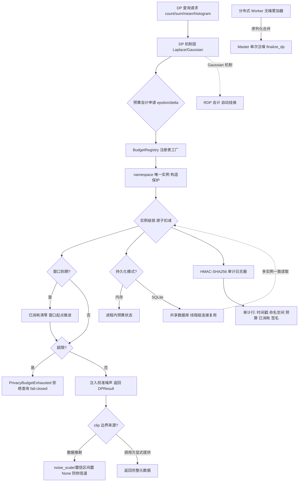
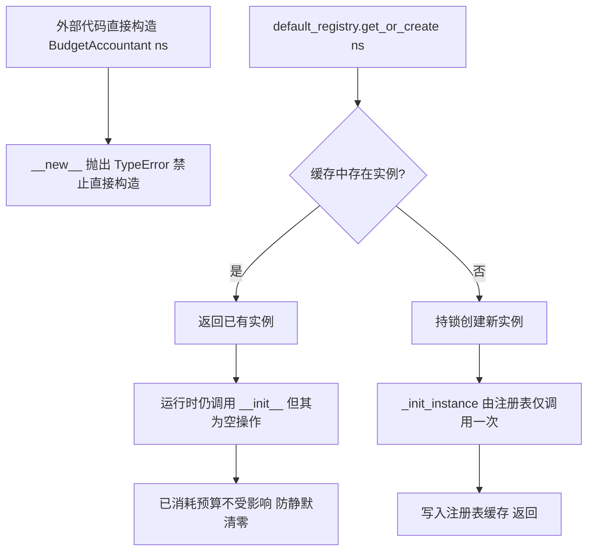
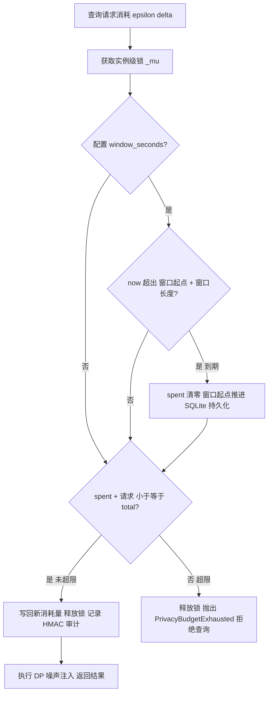
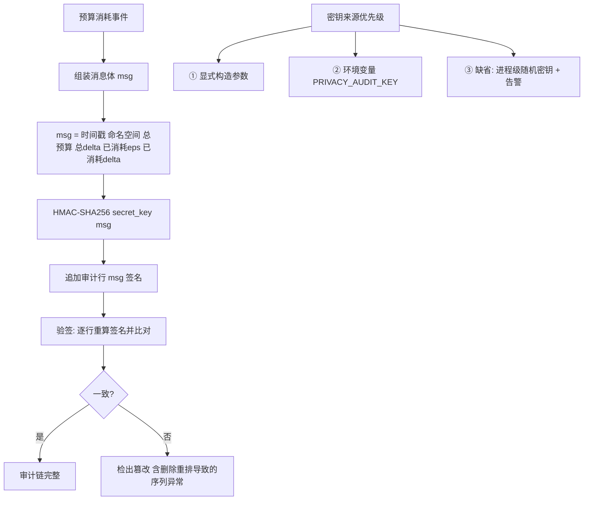
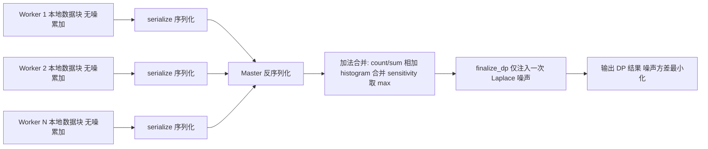

**深圳数联天下智能科技有限公司**

**专利技术交底书模板**

**交底书名称：** 面向差分隐私的分布式预算记账、时间窗口重置与防篡改审计方法、系统及存储介质

\*\*发明人姓名：陈少伟

\*\*第一发明人姓名和身份证号码：陈少伟（371102198410187111）

申请人：深圳数联天下智能科技有限公司

通信地址（邮编）：（递交时填写）

\*\*交底书撰写人：陈少伟

\*\*联系电话：13662678920

\*\*Email：shaowei.chen@clife.cn

**交底技术书信息登记页**

\*\*提交部门：平台建设中心-研发管理部-安全运维组

\*\*项目号：（内部维护时填写）

\*\*项目名称/所属产品(可多个，靠近公司的主营业务)：数据安全与隐私保护、医疗数据安全治理平台

**技术应用领域：** 大数据、人工智能（AI）、隐私计算、数据安全、智慧医疗

**相关技术方向：** 差分隐私（Differential Privacy, DP）、分布式系统、数据库事务、密码学消息认证码、Rényi 差分隐私（Rényi Differential Privacy, RDP）组合会计

**技术方案概述：** 本发明提出一种面向差分隐私查询的分布式隐私预算记账、基于时间窗口的预算重置、防篡改审计以及元数据侧信道防护方法。该方法通过全局注册表工厂保证每个命名空间（namespace）仅存在一个预算会计（BudgetAccountant）实例，并以重写构造语义阻止外部直接构造与重复初始化导致的预算静默清零；预算扣减在实例级锁内原子完成，并支持以 SQLite 共享数据库实现多实例一致记账；同时支持时间窗口自动重置、基于 HMAC-SHA256（Hash-based Message Authentication Code with Secure Hash Algorithm 256，基于安全散列算法的散列消息认证码）的审计链、RDP 组合会计挂接、数据推断噪声参数置空以及分布式无噪累加器单次注噪，从而在多副本部署场景下保障隐私预算的全局一致性、可持续性与审计可信性。

---

**交底书注意事项**

---

**缩略语和关键术语定义列表**

1. **DP（Differential Privacy，差分隐私）**：一种通过向查询结果注入校准噪声，使得对数据集的单条记录变更难以被察觉的隐私保护框架。
2. **隐私预算（privacy budget）**：差分隐私中用 $(\varepsilon, \delta)$ 度量的隐私消耗上限，同一数据集上的多次查询累计消耗不得超过该上限。
3. **namespace（命名空间）**：预算会计实例的隔离维度，不同命名空间拥有独立的预算状态。
4. **BudgetAccountant（预算会计）**：负责维护并扣减某一命名空间下隐私预算的核心对象。
5. **BudgetRegistry（注册表）**：以命名空间为键管理预算会计实例全局唯一性的工厂组件。
6. **get_or_create（获取或创建）**：注册表在持锁条件下“命中则返回、未命中则创建”的实例获取语义。
7. **fail-closed（故障安全拒绝）**：预算超限时拒绝查询而非放行，以保证隐私保证不失效。
8. **SQLite**：一种轻量级、支持事务与文件级共享的关系型数据库管理系统。
9. **HMAC-SHA256（Hash-based Message Authentication Code with Secure Hash Algorithm 256）**：基于安全散列算法 256 的散列消息认证码，用于验证消息完整性与真实性。
10. **RDP（Rényi Differential Privacy，Rényi 差分隐私）**：Rényi 散度意义下的差分隐私变体，通常可获得比基础组合定理更紧的隐私预算估计。
11. **clip（数值裁剪）**：对数值型属性按上/下界截断以限制敏感度的操作，边界可由数据推断或调用方显式提供。
12. **noise_scale（噪声尺度）**：差分隐私噪声分布的尺度参数，可反推数据分布范围。
13. **accumulator（累加器）**：在本地数据分片上累加无噪统计量的对象，支持序列化、合并与统一注噪。
14. **finalize_dp（终结方法）**：在合并后的累加器上统一注入一次差分隐私噪声的方法。
15. **sensitivity（敏感度）**：统计量对单条记录变更的最大变化幅度，合并时取各工作节点中的最大值。

---

# 1. 相关技术背景（背景技术），与本发明最相近似的现有实现方案（现有技术）

## 1.1 背景技术

差分隐私（Differential Privacy, DP）是目前隐私计算领域提供可量化隐私保证的主流框架。其核心思想是：对任意两个仅相差一条记录的数据集，同一随机化查询算法输出结果的概率分布差异被限定在 $(\varepsilon, \delta)$ 范围内，其中 $\varepsilon$ 为隐私损失上限，$\delta$ 为松弛项。为达到该保证，算法需向查询结果注入与敏感度（sensitivity）和预算成反比的校准噪声。

由于噪声的引入会随查询次数累积隐私损失，差分隐私要求对同一数据集或同一统计视图的多次查询累计消耗的隐私预算不得超过预先设定的总量。预算耗尽后，继续应答查询将使隐私保证失效。因此，隐私预算记账是任何生产级差分隐私系统必须解决的核心问题。

当前隐私计算系统多以 Sidecar 或微服务形态部署，存在多个进程或多个节点副本。若每个实例独立维护内存预算，则系统实际累计隐私消耗将随副本数线性放大；同时，长期运行的服务需要合理的预算生命周期管理，而简单定期清零又缺乏多实例一致的时间边界；此外，预算会计对象的意外重建会导致已消耗预算被静默清零；普通文本审计日志可被事后篡改，无法向监管方证明预算未被超限消耗；最后，差分隐私结果中的噪声尺度与置信区间若由数据本身推断，则存在向调用方泄露数据分布范围的元数据侧信道风险。上述问题共同构成了本发明的技术背景。

## 1.2 与本发明相关的现有技术一：单点独立式隐私预算记账

### 1.2.1 现有技术一的技术方案

与本发明最接近的第一类现有技术为在单一计算单元内独立完成的隐私预算记账方案，其代表性公开文献为中国发明专利申请 **CN115480917A《一种基于可编程交换机的差分隐私大数据处理方法》**（申请人：浙江大学；申请公布日：2022 年 12 月 16 日）。该专利公开的技术方案为：在可编程交换机的数据面上执行映射—规约原语完成差分隐私大数据处理，并内嵌隐私审计流程——执行 update_bf 原语将布隆过滤器划分为多个分区与各映射器对应，记录各映射器输出过的键（即键与映射器的依赖关系）；执行 get_priv_cost 原语查询布隆过滤器，统计各分区输出的键数量；执行 acct_bdg 原语，按 $P_B = \varepsilon \times N$（$\varepsilon$ 为平台设定的隐私预算参数，$N$ 为各分区输出键数量的最大值）计算需要扣除的隐私预算；最后执行 ded_bdg 原语完成预算扣除。

除该专利外，现有主流差分隐私库或隐私计算 Sidecar 也普遍采用同类单点记账模式：在每个进程（或单台设备）内维护一个本地的预算会计对象，以内存字典或设备本地状态的形式记录已消耗的 $(\varepsilon, \delta)$ 值；每次查询执行前在本地读取已消耗量、判断是否超限，若未超限则更新本地状态并放行查询，整个过程在单一进程地址空间或单台设备内完成，无需外部存储或网络通信。

该类方案的共同特征为：预算状态与审计记录均封闭于单一计算单元本地，通常不提供跨单元持久化与共享能力，也不处理多实例共享预算；预算总量与已消耗量随进程或设备重启而重置；审计记录（若有）多以普通文本或设备本地状态形式存在，未与预算状态绑定密码学校验；长期运行的服务在预算耗尽后仅能通过人工重启或修改配置恢复服务能力。

### 1.2.2 现有技术一的缺点

以 CN115480917A 为代表的单点独立式预算记账方案存在以下缺点：

1. **多实例预算不一致**：预算状态封闭于单台设备或单个进程内，每个服务副本独立记账，系统实际可消耗的隐私预算总量为单实例宣称预算的 N 倍（N 为副本数），差分隐私的理论保证在多副本场景下名存实亡。CN115480917A 的布隆过滤器记账结构即固化于单台可编程交换机的数据面，无法在多台交换机或多个服务副本间共享同一份预算状态。
2. **预算永久耗尽问题**：长期运行的隐私服务在预算耗尽后永久拒绝服务，缺乏可持续的预算生命周期管理机制；若强行重启进程或设备恢复预算，则等同于清零已消耗量，破坏隐私保证。
3. **意外重建导致预算清零**：预算会计对象若在程序缺陷或并发场景下被重复构造或初始化，已消耗预算会被静默重置，且此类缺陷难以通过常规功能测试发现。
4. **审计不可信**：预算扣除仅体现为设备本地状态变迁或普通文本日志，既无链式密码学校验，也无离线验签机制，运维人员或攻击者可在事后篡改、删除或重排记录，监管方无法离线验证“预算未被超限消耗”。
5. **结果元数据侧信道泄漏**：当数值裁剪边界由数据本身推断时，若将噪声尺度、置信区间等元数据随查询结果返回，调用方可反推数据分布范围，造成额外隐私泄漏。

## 1.3 与本发明相关的现有技术二：集中式预算服务

### 1.3.1 现有技术二的技术方案

为解决多实例一致性问题，部分方案引入集中式预算服务。各 Sidecar 或工作节点在每次查询前通过网络远程请求（Remote Procedure Call, RPC）向中央预算服务器申请预算扣减；中央服务器维护全局的预算状态并返回是否允许执行。部分实现还会在固定时间点（如每日零点）由中央服务器统一将已消耗预算清零，以支持长期服务运行。

### 1.3.2 现有技术二的缺点

1. **网络分区与单点故障**：中央预算服务成为系统可用性与隐私安全的关键路径，网络抖动或分区会导致查询延迟增加甚至服务中断；一旦中央服务异常重启且状态未正确持久化，预算状态可能回滚或丢失。
2. **时间边界难以一致**：固定时间点的批量清零依赖中央服务的调度时钟，各 Sidecar 对该时间点的感知可能存在偏差，导致窗口切换瞬间出现双花或漏扣。
3. **审计仍然不可信**：中央服务器的审计日志同样面临被内部人员篡改的风险，且缺乏密码学校验与离线验签机制。
4. **部署复杂度高**：需要单独维护高可用的中央服务、网络拓扑与访问控制，增加了生产环境的部署与运维负担。

---

# 2. 本发明技术方案的详细阐述（发明内容）

## 2.1 本发明所要解决的技术问题（发明目的）

针对上述现有技术的缺陷，本发明旨在解决以下技术问题：

1. **多实例部署下隐私预算的全局一致性记账问题**：确保多个服务副本或进程对同一命名空间的累计隐私消耗读取一致，避免预算被副本数稀释。
2. **长期运行服务的预算生命周期管理问题**：在不影响隐私保证的前提下，使隐私预算可按时间窗口自动续期，窗口边界对多实例保持一致。
3. **预算状态被意外清零的防护问题**：从语言运行时机制层面防止预算会计对象被重复构造或重复初始化导致的已消耗预算静默清零。
4. **预算消耗审计记录的防篡改问题**：为每次预算消耗生成可离线验证的密码学审计链，检测内容篡改、整行删除与重排。
5. **差分隐私结果元数据的侧信道泄漏问题**：防止由数据推断的噪声尺度、置信区间等元数据被返回给调用方，避免反推数据分布范围。

## 2.2 本发明提供的完整技术方案（发明方案）

本发明提供一种面向差分隐私的分布式预算记账方法、系统及计算机可读存储介质，其总体架构如图 1 所示。

### 图 1：预算记账系统总体架构图



```text
                ┌───────────────────────────────┐
                │  DP 查询 (count/sum/mean/...)   │
                └───────────────┬───────────────┘
                                ▼
                ┌───────────────────────────────┐
                │  预算申请 (epsilon, delta)       │
                └───────────────┬───────────────┘
                                ▼
   ┌────────────────────────────────────────────────────┐
   │  BudgetRegistry 注册表工厂                            │
   │  namespace → 唯一 BudgetAccountant                   │
   │  构造保护: __new__ 禁止直接构造 / __init__ 空操作        │
   └───────────────────────┬────────────────────────────┘
                           ▼
   ┌────────────────────────────────────────────────────┐
   │  实例级锁内原子扣减                                     │
   │  ① 检查时间窗口 → 到期则清零并推进窗口起点               │
   │  ② 校验累计消耗 → 超限抛 BudgetExhausted (fail-closed) │
   └─────┬─────────────────────┬────────────────┬───────┘
         ▼                     ▼                ▼
   ┌────────────┐     ┌────────────────┐  ┌─────────────────┐
   │ 内存模式     │     │ SQLite 共享模式  │  │ HMAC-SHA256 审计 │
   │ (单实例)    │     │ 事务扣减         │  │ 时间戳|ns|预算|   │
   └────────────┘     │ 线程级连接复用    │  │ 已消耗|签名      │
                      │ 多实例一致读取    │  │ 密钥缺省=进程随机 │
                      └────────────────┘  └─────────────────┘
                                │
                                ▼
                ┌───────────────────────────────┐
                │  注入校准噪声 → DPResult         │
                │  clip由数据推断 → 元数据置None   │
                │  Gaussian → RDP会计自动挂接      │
                └───────────────────────────────┘

   扩展: Worker 无噪累加器 --serialize--> Master '+'合并
         (sensitivity取max) --> finalize_dp 单次注噪
```

### 2.2.1 注册表工厂与构造保护

预算会计实例（BudgetAccountant）按命名空间（namespace）隔离，由全局注册表（BudgetRegistry）统一管理。注册表以命名空间为键缓存实例，确保同一命名空间全局唯一。实例获取采用“获取或创建”（get_or_create）语义并持锁创建，防止并发竞态产生双实例。

为防止外部直接构造或重复初始化导致已消耗预算被静默清零，本发明引入构造保护机制：

1. 预算会计类重写 `__new__` 方法，禁止外部直接构造；任何直接构造尝试均抛出类型错误异常（TypeError），实例只能经由注册表创建。
2. 真实初始化逻辑封装于内部方法 `_init_instance`，由注册表在创建新实例时仅调用一次。
3. `__init__` 方法实现为空操作：由于语言运行时在 `__new__` 返回已有实例后仍会调用 `__init__`，空实现确保已存在实例的已消耗预算不会被重复初始化清零。

### 图 2：构造保护机制示意图



```text
 路径①(禁止):  BudgetAccountant("ns") 直接构造
                  └─► __new__ 抛出 TypeError

 路径②(唯一合法): default_registry.get_or_create("ns")
                  │
                  ├─ 命中 ─► 返回已有实例
                  │          └─► 运行时仍调 __init__ (空操作)
                  │              已消耗预算不受影响
                  │
                  └─ 未命中 ─► 持锁创建
                              └─► _init_instance 仅初始化一次
                                  └─► 写入缓存返回
```

### 2.2.2 并发安全的原子扣减

每次差分隐私查询在执行前向预算会计申请消耗 $(\varepsilon_r, \delta_r)$。实例级锁保护“读取已消耗量—判断是否超限—写回新值”的原子性。若超限，则抛出预算耗尽异常（PrivacyBudgetExhaustedError），以 fail-closed 方式拒绝查询而非放行。记账操作支持内存模式与持久化模式的统一抽象。

设请求消耗为 $(\varepsilon_r, \delta_r)$，已消耗为 $(\varepsilon_s, \delta_s)$，预算总量为 $(\varepsilon_t, \delta_t)$，许可判定如式（1）所示：

\[
spend(\varepsilon_r, \delta_r) = \begin{cases}
\text{接受并扣减}, & \varepsilon_s + \varepsilon_r \le \varepsilon_t \wedge \delta_s + \delta_r \le \delta_t\\
\text{拒绝并抛异常}, & \text{否则（fail-closed）}
\end{cases} \tag{1}
\]

### 2.2.3 SQLite 分布式共享记账

当配置持久化路径后，预算状态存储于 SQLite 数据库。SQLite 以轻量级文件形式存在，支持事务与多进程共享读取，适合 Sidecar/微服务共享存储卷场景。

1. 预算扣减以数据库事务方式执行，多进程或多节点在共享存储场景下读取一致的已消耗量。
2. 数据库连接采用线程级复用：每工作线程持有独立连接并在线程生命周期内复用，避免高频记账下重复建连开销，同时规避跨线程共享连接的并发错误。
3. 时间窗口信息一并持久化，保证多实例共享一致的时间边界。

### 2.2.4 时间窗口预算重置

本发明支持以构造函数参数或环境变量 `PRIVACY_BUDGET_WINDOW_SECONDS` 配置预算重置窗口：

1. 每次记账操作先检查当前时间是否超出“窗口起点 + 窗口长度”；若超出，则将已消耗预算清零，并将窗口起点推进至当前时间。
2. 窗口判断在锁内与扣减操作原子完成，防止并发请求在窗口切换瞬间出现双重重置或漏重置。
3. SQLite 模式下窗口起点持久化，任一实例触发的窗口重置对全部共享同一预算状态的实例立即生效。

重置条件如式（2）所示：

\[
reset \iff now \ge start + window \tag{2}
\]

重置后 $\varepsilon_s \leftarrow 0$、$\delta_s \leftarrow 0$、$start \leftarrow now$。

### 图 3：带时间窗口重置的原子扣减流程图



```text
 spend(ε, δ)
    │
    ▼
 获取实例级锁 _mu
    │
    ▼
 配置窗口? ──否────────────────────┐
    │是                          │
    ▼                          │
 now >= start + window?         │
    │是 ──► spent 清零            │
    │       start = now          │
    │       (SQLite 持久化)       │
    ▼否                          ▼
 spent + 请求 <= total?
    │是                 │否
    ▼                  ▼
 写回扣减 + HMAC 审计   抛出 BudgetExhausted
    │                  (fail-closed 拒绝查询)
    ▼
 执行 DP 注噪
```

### 2.2.5 HMAC-SHA256 防篡改审计链

每次预算消耗追加一条审计记录，格式为“时间戳|命名空间|总预算|总δ|已消耗ε|已消耗δ|签名”，签名为以审计密钥对该记录消息体计算的 HMAC-SHA256 摘要。

1. 审计密钥优先取显式构造参数，其次取环境变量 `PRIVACY_AUDIT_KEY`；两者均缺省时生成进程级随机密钥并输出警告，杜绝源码硬编码密钥导致任何人可伪造签名。
2. 审计写入失败不阻塞记账主流程，但输出结构化告警，使预算服务可用性与审计可观测性解耦。

第 $i$ 条审计记录的消息体与签名按式（3）、式（4）构造：

\[
msg_i = ts_i \| ns \| \varepsilon_t \| \delta_t \| \varepsilon_s^{(i)} \| \delta_s^{(i)} \tag{3}
\]

\[
sig_i = HMAC\text{-}SHA256(K_{audit}, msg_i) \tag{4}
\]

审计行 $L_i = msg_i \| sig_i$ 追加写入。验签时对每行重算 HMAC 并与行内签名比对，同时校验时间戳单调不减与已消耗量单调不降的序列连续性，可检出内容篡改以及整行删除、重排。

### 图 4：HMAC-SHA256 审计记录结构与验签流程



```text
 写入: 消耗事件 ─► msg = ts|ns|ε|δ|eps_spent|del_spent
                   └─► sig = HMAC-SHA256(key, msg)
                       └─► 追加行: msg|sig

 密钥优先级: ① 构造参数 > ② PRIVACY_AUDIT_KEY 环境变量
            > ③ 进程级随机密钥(重启后旧记录不可校验) + 告警

 验签: 监管方持 key ─► 逐行重算 HMAC ─► 与行内签名比对
        不一致 ─► 检出篡改/删除/重排
```

### 2.2.6 Rényi DP 会计挂接

对高斯（Gaussian）机制查询，本发明自动挂接 Rényi 差分隐私会计（RDPAccountant）进行 $(\alpha, \varepsilon)$-RDP 预算的组合核算，以获得比基础组合定理更紧的预算消耗估计。

设敏感度为 $\Delta$、噪声标准差为 $\sigma$，单次高斯查询满足式（5）的 $(\alpha, \varepsilon_{RDP})$-RDP 界；多查询按式（6）组合：

\[
\varepsilon_{RDP}(\alpha) = \frac{\alpha \Delta^2}{2\sigma^2} \tag{5}
\]

\[
\varepsilon_{RDP}^{total}(\alpha) = \sum_{q=1}^{Q} \frac{\alpha \Delta_q^2}{2\sigma_q^2} \tag{6}
\]

其中 $\alpha \in \mathbb{N}_+$ 为 RDP 阶数；组合后的 $(\alpha, \varepsilon_{RDP})$-RDP 界经转换定理映射回 $(\varepsilon_{RDP} + \frac{\log(1/\delta)}{\alpha-1},\ \delta)$-差分隐私预算消耗。

### 2.2.7 元数据侧信道防护

当数值裁剪（clip）边界由数据本身推断时，差分隐私结果中的噪声尺度（noise_scale）与置信区间将被置为空值而不返回。原因在于：若噪声尺度由数据范围推导（如 $(max-min)/\varepsilon$），直接返回将向调用方泄露数据分布范围。仅当 clip 边界由调用方显式提供时，才返回完整元数据。

### 2.2.8 分布式无噪累加器

面向 MapReduce/联邦场景，本发明提供可序列化、可合并的无噪累加器。各 Worker 在本地数据块上累加无噪统计量（count/sum/histogram），导出序列化结果后由 Master 通过加法运算合并，敏感度取各 Worker 最大值，最终由 Master 统一调用终结方法（finalize_dp）只注入一次差分隐私噪声。

合并运算与单次注噪如式（7）、式（8）所示：

\[
Acc = \bigoplus_{i=1}^{N} Acc_i, \qquad sensitivity = \max_{i=1..N} s_i \tag{7}
\]

\[
\hat{f} = f_{noiseless}(Acc) + Lap\left(\frac{sensitivity}{\varepsilon}\right) \tag{8}
\]

与逐 Worker 注噪方案相比，单次注噪的拉普拉斯（Laplace）噪声方差由 $N \cdot 2s^2/\varepsilon^2$ 降至 $2s^2/\varepsilon^2$，为前者的 $1/N$。

### 图 5：分布式无噪累加器 MapReduce 合并与单次注噪流程图



```text
 Worker1 ─► 无噪累加 ─► serialize ─┐
 Worker2 ─► 无噪累加 ─► serialize ─┼─► Master 反序列化
 WorkerN ─► 无噪累加 ─► serialize ─┘        │
                                          ▼
                     '+' 合并: count/sum 相加, histogram 合并
                              sensitivity 取 max
                                          │
                                          ▼
                     finalize_dp: 仅注入一次 DP 噪声
                                          │
                                          ▼
                     DP 结果 (方差约为逐 Worker 注噪的 1/N)
```

## 2.3 本发明技术方案带来的有益效果

1. **全局一致的隐私预算保证**：通过 SQLite 共享记账，使多实例实际消耗与宣称预算严格一致，避免隐私保证被副本数稀释。
2. **可持续的预算生命周期**：时间窗口重置机制使长期运行服务具备可续期的预算生命周期，窗口边界在多实例间保持一致。
3. **状态防误清**：注册表工厂与 `__new__`/`__init__` 双重构造保护，从语言机制层面杜绝预算被静默清零。
4. **审计可信**：HMAC-SHA256 签名审计链使监管方可离线验证任意历史记录未被篡改；密钥不落源码，避免硬编码伪造风险。
5. **无侧信道泄漏**：数据推断的噪声参数不回传，封堵元数据反推数据分布范围的侧信道。
6. **分布式噪声最优**：无噪累加器合并后单次注噪，使总噪声方差最小化，相比逐 Worker 注噪降低为 $1/N$。
7. **可用性优先**：审计写入失败不阻塞记账主流程，预算服务可用性与审计可观测性解耦。

### 与现有技术的对比

| 对比维度 | 最接近现有技术 | 本发明区别特征 | 带来的技术效果 |
|---|---|---|---|
| 多实例记账 | 各实例独立内存记账，预算被副本数稀释 | 注册表工厂 + SQLite 共享记账 + 实例级锁 | 多实例消耗全局一致，隐私保证不被副本数稀释 |
| 预算生命周期 | 预算一次性耗尽，无续期机制 | 时间窗口自动重置，窗口边界多实例一致 | 长期运行服务具备可持续的预算生命周期 |
| 状态保护 | 实例可被重复构造致预算静默清零 | `__new__`/`__init__` 双重构造保护 | 从语言机制层面杜绝预算被静默清零 |
| 审计可信 | 无审计或明文日志可被篡改 | HMAC-SHA256 签名审计链 + 时间戳/消耗量序列连续性校验 | 监管方可离线验证任意历史记录未被篡改 |
| 元数据侧信道 | DP 噪声参数回传可反推数据范围 | 数据推断的噪声尺度与置信区间置空不回传 | 封堵元数据反推数据分布范围的侧信道 |

---

# 3. 针对2中的技术方案，是否还有别的替代方案同样能完成发明目的

除上述优选实施方式外，以下替代方案同样可完成发明目的，并可扩大保护范围：

1. **持久化存储替代**：共享预算状态可使用其他支持事务的关系型数据库（如 PostgreSQL、MySQL）或具备线性一致性的键值存储（如 etcd、ZooKeeper）替代 SQLite，以适应跨主机部署场景。
2. **审计签名算法替代**：HMAC-SHA256 可替换为基于非对称密码学的数字签名算法（如 ECDSA、Ed25519），由监管方持有公钥离线验签，实现多方不可抵赖。
3. **窗口重置触发方式替代**：时间窗口重置既可采用本发明中的懒检查（每次记账时检查），也可由外部定时任务（cron）触发；在共享数据库中通过事务与唯一约束仍可保证多实例一致性。
4. **审计日志存储替代**：审计日志可写入只追加文件系统、区块链存证服务或远程安全日志系统（如 syslog、SIEM），以增强抗篡改与长期留存能力。
5. **分布式累加器合并方式替代**：无噪累加器在联邦场景下可采用安全聚合协议（Secure Aggregation）合并，各参与方在加密状态下完成加法合并后再统一注噪，既保持单次注噪优势，又避免明文传输中间统计量。
6. **注册表实现替代**：注册表工厂可采用进程内单例、依赖注入容器或语言级别的元类机制实现，只要保证同一命名空间全局唯一且禁止外部直接构造即可。

---

# 4. 本发明的技术关键点和欲保护点是什么？

1. **全局唯一的注册表工厂与构造保护**：以命名空间为键的全局注册表管理预算会计实例，结合 `__new__` 禁止外部直接构造与 `__init__` 空操作，防止预算状态被重复初始化清零。
2. **锁内原子预算扣减与校验**：将“读取已消耗量—校验是否超限—写回新值”放入同一临界区，并以 fail-closed 方式拒绝超限查询。
3. **SQLite 共享记账与线程级连接复用**：通过事务化 SQLite 持久化实现多实例一致预算读取，并通过每线程独立连接复用兼顾高频记账性能与并发正确性。
4. **锁内时间窗口重置**：窗口到期判断、清零与推进在锁内原子完成，窗口起点随预算状态持久化，任一实例触发即对全部实例生效。
5. **HMAC-SHA256 审计链**：每次消耗生成带签名的审计记录，支持离线验签、时间戳单调性与消耗量连续性校验，审计写入失败不阻塞主流程。
6. **RDP 组合会计自动挂接**：对高斯机制查询自动采用 Rényi 差分隐私会计进行更紧的预算组合估计。
7. **元数据侧信道防护**：数据推断的 clip 边界所对应的噪声尺度与置信区间不回传，仅调用方显式提供边界时返回完整元数据。
8. **分布式无噪累加器与单次注噪**：本地无噪累加、可序列化合并、Master 端统一注噪，使分布式场景下噪声方差最小化。

---

# 5. 具体实施方式

**实施例 1：单实例内存记账。**
服务启动时经 `default_registry.get_or_create("medical-hospital-a", epsilon_total=10.0, delta_total=1e-4)` 创建预算会计。一次 DP count 查询申请 $\varepsilon=0.1$：持实例锁读取已消耗量、校验未超限、写回并记录审计行；若累计超限则抛出 `PrivacyBudgetExhaustedError`，查询被拒绝（fail-closed）。

**实施例 2：多实例 SQLite 共享。**
配置 `PRIVACY_BUDGET_DB=/data/budget.db`，三个 Sidecar 副本共享同一预算库。副本 A 扣减后，副本 B 的下一次扣减读取到最新已消耗量；每个工作线程持有独立的 SQLite 连接并在线程生命周期内复用，高频记账无建连抖动。

**实施例 3：窗口重置。**
配置 `PRIVACY_BUDGET_WINDOW_SECONDS=86400`（24 小时）。第 25 小时的首个请求在锁内检测到窗口过期：已消耗 $\varepsilon/\delta$ 清零、窗口起点推进，并持久化新窗口起点；其他副本读取同一窗口状态，无双重置。

**实施例 4：构造保护。**
业务代码误写 `BudgetAccountant("ns")` 直接构造，立即抛出类型错误并在代码评审或测试中暴露；`get_or_create` 返回已有实例时运行时仍会调用 `__init__`，但其为空实现，已消耗预算不受影响。

**实施例 5：审计验签。**
监管方持有 `PRIVACY_AUDIT_KEY`，对审计日志逐行重算 HMAC-SHA256 并与行内签名比对；任一行被篡改（含删除重排导致的时间戳/已消耗量不连续）即可被检出。未配置密钥时进程使用随机密钥并告警，重启前记录仍可在进程生命周期内校验。

**实施例 6：元数据防泄漏。**
调用方未提供 clip 边界、系统从数据推断 min/max 时，返回的 `DPResult.noise_scale` 与 `confidence_interval` 为 None，仅返回带噪结果值；调用方显式传入 clip 边界时返回完整元数据。

**实施例 7：分布式单次注噪。**
8 个 Worker 各自在本地数据块上调用 `create_accumulator` 累加无噪 sum/count，序列化后经网络发送至 Master；Master 反序列化并以 `+` 运算合并 8 个累加器（sensitivity 取最大），调用 `finalize_dp` 一次性注入 Laplace 噪声。相比每 Worker 各注一次噪声，结果方差降低为约 1/8。

**实施例 8：RDP 会计挂接。**
统计查询配置高斯机制（噪声标准差 $\sigma$），预算会计自动挂接 RDPAccountant：按式（5）计算各查询的 $(\alpha, \varepsilon_{RDP})$-RDP 界，按式（6）组合后经转换定理计入总预算消耗。相比基础组合定理逐次线性相加，RDP 组合获得更紧的预算估计，同等 $(\varepsilon, \delta)$ 预算下可支持更多查询。

**实施例 9：高并发扣减与异常上下文。**
100 个并发线程同时发起 DP count 查询，实例级锁保证“读取—校验—写回”原子：实际扣减总量严格等于各请求消耗量之和，无超扣、无丢失；预算耗尽瞬间并发的请求中，仅先获得锁者成功，其余抛出 `PrivacyBudgetExhaustedError`，异常携带当前已消耗量与请求消耗量，调用方可据此判断等待窗口重置或申请扩额。

**实施例 10：关键参数配置表。**

| 参数 | 默认值 | 说明 |
|---|---|---|
| `PRIVACY_NAMESPACE` | default | 预算记账命名空间 |
| `PRIVACY_BUDGET_DB` | 空 | SQLite 共享记账库路径，空则内存模式 |
| `PRIVACY_BUDGET_WINDOW_SECONDS` | 空 | 预算自动重置窗口，空则不重置 |
| `PRIVACY_AUDIT_KEY` | 空 | 审计密钥，缺省生成进程级随机密钥并告警 |
| $\varepsilon_{total}$ / $\delta_{total}$ | 调用方指定 | 命名空间预算总量 |

---

# 6. 权利要求书

1. 一种面向差分隐私的分布式预算记账方法，其特征在于，包括：
   以命名空间为键通过全局注册表获取或创建唯一的预算会计实例，同一命名空间的预算会计实例全局唯一；
   每次差分隐私查询执行前，在实例级锁保护下原子地执行读取已消耗预算、校验是否超限、写回新消耗量的记账操作，超限时拒绝查询；
   将预算状态持久化至共享数据库，使多个服务实例读取一致的累计消耗量。

2. 根据权利要求 1 所述的方法，其特征在于，还包括构造保护步骤：预算会计类禁止外部直接构造实例，实例仅由注册表创建并初始化一次；实例的重复初始化操作为空操作，防止已消耗预算被重复初始化清零。

3. 根据权利要求 1 所述的方法，其特征在于，还包括时间窗口重置步骤：配置预算重置时间窗口，记账操作在锁内检查当前时间是否超出窗口起点加窗口长度，超出则将已消耗预算清零并将窗口起点推进至当前时间；窗口起点随预算状态持久化，对多个服务实例一致生效。

4. 根据权利要求 1 所述的方法，其特征在于，所述共享数据库采用线程级连接复用：每个工作线程在自身生命周期内持有并复用独立的数据库连接。

5. 根据权利要求 1 所述的方法，其特征在于，还包括防篡改审计步骤：每次预算消耗追加包含时间戳、命名空间、预算总量与已消耗量的审计记录，并追加以审计密钥对记录消息体计算的 HMAC-SHA256 签名；审计密钥缺省时生成进程级随机密钥并输出告警。

6. 根据权利要求 1 所述的方法，其特征在于，对高斯机制查询自动挂接 Rényi 差分隐私会计执行隐私预算的组合核算。

7. 根据权利要求 1 所述的方法，其特征在于，还包括元数据侧信道防护步骤：当数值裁剪边界由数据本身推断时，差分隐私结果中的噪声尺度与置信区间置为空值不返回；仅当裁剪边界由调用方显式提供时返回完整元数据。

8. 根据权利要求 1 所述的方法，其特征在于，还包括分布式累加步骤：各工作节点在本地数据块上累加无噪统计量并序列化导出，主节点通过加法运算合并各累加器且敏感度取最大值，合并后统一注入一次差分隐私噪声。

9. 根据权利要求 5 所述的方法，其特征在于，审计记录写入失败时不阻塞记账主流程，输出结构化告警。

10. 根据权利要求 5 所述的方法，其特征在于，审计密钥的选取优先级为：显式构造参数优先于环境变量，两者均缺省时生成进程级随机密钥并输出告警。

11. 根据权利要求 3 所述的方法，其特征在于，所述时间窗口重置与预算扣减在同一锁内原子完成；任一实例触发的窗口重置对全部共享同一预算状态的实例立即生效，防止窗口切换瞬间出现双重重置或漏重置。

12. 根据权利要求 5 所述的方法，其特征在于，验签时对每条审计记录重新计算 HMAC 签名并与记录内签名比对，同时校验时间戳单调不减与已消耗量单调不降的序列连续性，以检出内容篡改以及整行删除、重排。

13. 根据权利要求 1 所述的方法，其特征在于，超限时抛出预算耗尽异常，所述异常携带当前已消耗量与请求消耗量上下文，供调用方据此执行窗口等待或扩额策略。

14. 一种面向差分隐私的分布式预算记账系统，其特征在于，包括：注册表工厂模块、原子记账模块、持久化共享模块、窗口重置模块、审计签名模块与元数据防护模块，各模块协同执行权利要求 1 至 13 任一项所述的方法。

15. 一种计算机可读存储介质，其上存储有计算机程序，其特征在于，所述计算机程序被处理器执行时实现权利要求 1 至 13 任一项所述的方法。

16. 一种电子设备，其特征在于，包括处理器以及存储有计算机程序的存储器，所述计算机程序被所述处理器执行时实现权利要求 1 至 13 任一项所述的方法。

---

# 7. 摘要

本发明公开了一种面向差分隐私的分布式预算记账、时间窗口重置与防篡改审计方法、系统及存储介质。该方法以命名空间为键经注册表工厂保证预算会计实例全局唯一，并通过禁止直接构造与空初始化双重保护防止已消耗预算被静默清零；预算扣减在实例级锁内原子完成，经 SQLite 共享存储实现多实例一致记账，数据库连接线程级复用；支持时间窗口自动重置并持久化窗口边界；每次消耗写入 HMAC-SHA256 签名审计链，密钥缺省使用进程级随机密钥杜绝硬编码伪造；并对数据推断的噪声参数置空以封堵元数据侧信道。本发明保证多副本部署下隐私预算的全局一致性、可持续性与审计可信性。

---

# 8. 摘要附图


```text
                ┌───────────────────────────────┐
                │  DP 查询 (count/sum/mean/...)   │
                └───────────────┬───────────────┘
                                ▼
                ┌───────────────────────────────┐
                │  预算申请 (epsilon, delta)       │
                └───────────────┬───────────────┘
                                ▼
   ┌────────────────────────────────────────────────────┐
   │  BudgetRegistry 注册表工厂                            │
   │  namespace → 唯一 BudgetAccountant                   │
   │  构造保护: __new__ 禁止直接构造 / __init__ 空操作        │
   └───────────────────────┬────────────────────────────┘
                           ▼
   ┌────────────────────────────────────────────────────┐
   │  实例级锁内原子扣减                                     │
   │  ① 检查时间窗口 → 到期则清零并推进窗口起点               │
   │  ② 校验累计消耗 → 超限抛 BudgetExhausted (fail-closed) │
   └─────┬─────────────────────┬────────────────┬───────┘
         ▼                     ▼                ▼
   ┌────────────┐     ┌────────────────┐  ┌─────────────────┐
   │ 内存模式     │     │ SQLite 共享模式  │  │ HMAC-SHA256 审计 │
   │ (单实例)    │     │ 事务扣减         │  │ 时间戳|ns|预算|   │
   └────────────┘     │ 线程级连接复用    │  │ 已消耗|签名      │
                      │ 多实例一致读取    │  │ 密钥缺省=进程随机 │
                      └────────────────┘  └─────────────────┘
                                │
                                ▼
                ┌───────────────────────────────┐
                │  注入校准噪声 → DPResult         │
                │  clip由数据推断 → 元数据置None   │
                │  Gaussian → RDP会计自动挂接      │
                └───────────────────────────────┘

   扩展: Worker 无噪累加器 --serialize--> Master '+'合并
         (sensitivity取max) --> finalize_dp 单次注噪
```

---

**附件：**

1. 《专利技术申请自我声明》
2. 参考文献（如专利/论文）


---

## 参考文献（对比文献）

[1] 浙江大学. 一种基于可编程交换机的差分隐私大数据处理方法: 中国发明专利申请 CN115480917A[P]. 2022-12-16.
[2] 一种基于差分隐私预算分配的数据查询方法及系统: 中国发明专利申请 CN108197492A[P]. 2018-06-22.
[3] 北京邮电大学. 一种满足本地差分隐私的真值发现方法和电子设备: 中国发明专利申请 CN115329368A[P]. 2022-11-11.
[4] 兰州理工大学. 基于非均匀四叉树的位置大数据差分隐私划分发布方法: 中国发明专利申请 CN111339091A[P]. 2020-06-26.
[5] 北京奥星贝斯科技有限公司. 基于混洗差分隐私的数据查询方法、系统、设备及介质: 中国发明专利申请 CN120011401A[P]. 2025.
[6] Dwork C. Differential privacy[C]//Proceedings of the 33rd International Colloquium on Automata, Languages and Programming (ICALP). Springer, 2006: 1-12.
[7] Mironov I. Rényi differential privacy[C]//Proceedings of the 30th IEEE Computer Security Foundations Symposium (CSF). IEEE, 2017: 263-275.
[8] Dwork C, Roth A. The algorithmic foundations of differential privacy[J]. Foundations and Trends in Theoretical Computer Science, 2014, 9(3-4): 211-407.
