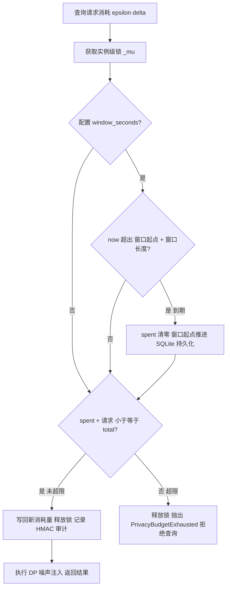
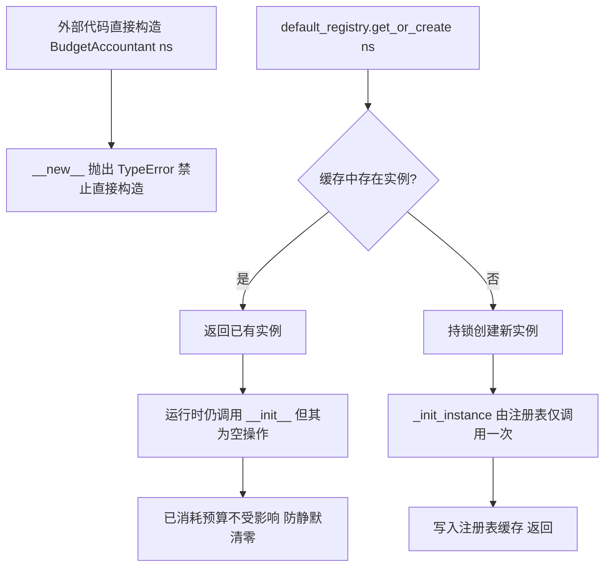
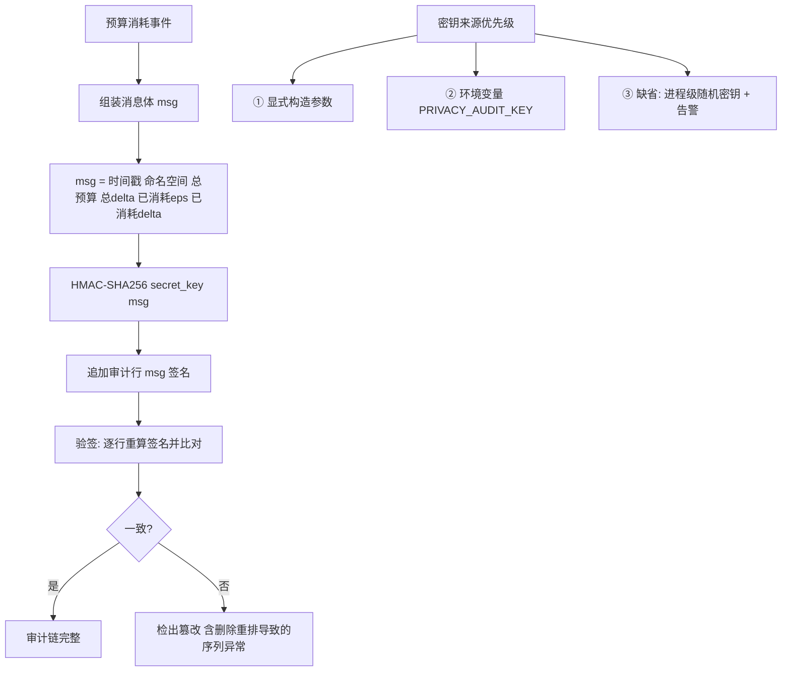
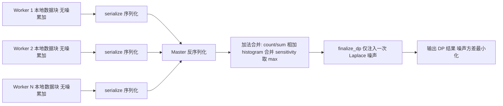
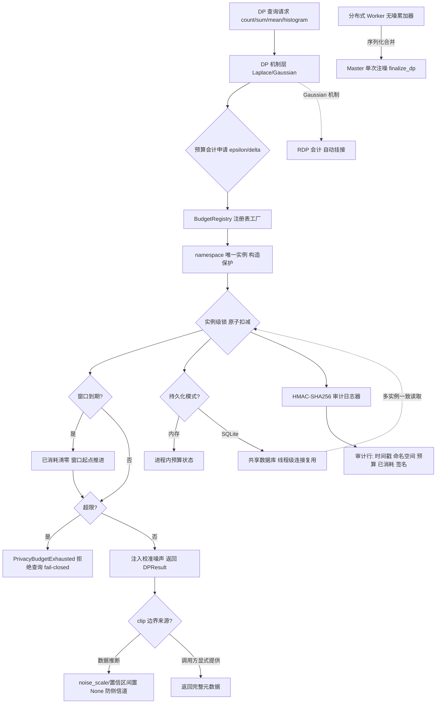

# 发明专利申请书

## 发明名称

**面向差分隐私的分布式预算记账、时间窗口重置与防篡改审计方法、系统及存储介质**

## 申请信息（拟）

| 项目 | 内容 |
|---|---|
| 技术领域分类号（建议） | G06F 21/62（数据访问保护）、H04L 9/32（数字认证） |
| 申请人 | 深圳数联天下智能科技有限公司、柳州市大数据发展局 |
| 发明人 | （待补充） |
| 申请号 / 申请日 | （递交时填写） |
| 代理机构 / 代理人 | （递交时填写） |

---

## 技术领域

本发明涉及隐私计算与数据安全技术领域，具体涉及一种面向差分隐私（Differential Privacy, DP）查询的分布式隐私预算记账方法、基于时间窗口的预算重置方法、防篡改审计方法，以及相应的系统与计算机可读存储介质。

## 背景技术

差分隐私通过向查询结果注入校准噪声提供可量化的隐私保证，其保证强度由隐私预算（ε, δ）约束：对同一数据集的重复查询会持续消耗预算，预算耗尽后必须停止应答，否则隐私保证失效。现有技术存在以下缺陷：

1. **内存记账在多实例下不一致**：Sidecar/微服务部署通常存在多个进程或多个节点副本，各自维护独立内存预算，导致系统实际累计隐私消耗为宣称预算的 N 倍，隐私保证名存实亡。
2. **预算永久耗尽问题**：长期运行的隐私服务在预算耗尽后永久拒绝服务，缺乏合理的预算生命周期管理；而简单定期清零又缺乏多实例间一致的时间边界。
3. **实例被意外重建导致预算清零**：预算会计对象若在程序缺陷或并发场景下被重复构造/初始化，已消耗预算被静默清零，同样破坏隐私保证，且此类缺陷难以通过常规测试发现。
4. **审计不可信**：预算消耗日志为普通文本文件，运维或攻击者可事后篡改，无法向监管方证明"预算未被超限消耗"。
5. **结果元数据侧信道**：DP 结果返回的噪声参数（如噪声尺度、置信区间）若由数据本身推断（如 clip 边界取自数据 min/max），直接返回会将数据范围泄露给调用方。

## 发明内容

### 一、要解决的技术问题

本发明旨在解决：（1）多实例部署下隐私预算的全局一致性记账问题；（2）长期运行服务的预算生命周期管理问题；（3）预算状态被意外清零的防护问题；（4）预算消耗审计记录的防篡改问题；（5）DP 结果元数据的侧信道泄漏问题。

### 二、技术方案

本发明提供一种面向差分隐私的分布式预算记账方法，包括：

**（一）注册表工厂与构造保护。**
1. 预算会计实例（BudgetAccountant）按命名空间（namespace）隔离，由全局注册表（BudgetRegistry）统一管理；注册表以命名空间为键缓存实例，同一命名空间全局唯一，实例获取采用"获取或创建"（get_or_create）语义并持锁创建，防止并发竞态产生双实例；
2. **构造保护机制**：预算会计类重写 `__new__` 禁止外部直接构造（直接构造抛出类型错误异常），实例只能经注册表创建；真实初始化逻辑封装于内部方法由注册表调用一次；`__init__` 实现为空操作——由于语言运行时在 `__new__` 返回已有实例后仍会调用 `__init__`，空实现防止已有实例的已消耗预算被重复初始化静默清零。

**（二）并发安全的原子扣减。**
每次 DP 查询在执行前向预算会计申请消耗 (ε, δ)：实例级锁保护"读取已消耗量—判断是否超限—写回新值"的原子性，超限抛出预算耗尽异常（fail-closed，拒绝查询而非放行）。记账支持内存模式与持久化模式统一抽象。设请求消耗 \((\varepsilon_r, \delta_r)\)、已消耗 \((\varepsilon_s, \delta_s)\)、预算总量 \((\varepsilon_t, \delta_t)\)，许可判定按式 (1)：

\[
spend(\varepsilon_r, \delta_r) = \begin{cases}
\text{接受并扣减}, & \varepsilon_s + \varepsilon_r \le \varepsilon_t \wedge \delta_s + \delta_r \le \delta_t\\
\text{拒绝并抛异常}, & \text{否则（fail-closed）}
\end{cases} \tag{1}
\]

**（三）SQLite 分布式共享记账。**
配置持久化路径后，预算状态存储于 SQLite：
1. 预算扣减以事务方式执行，多进程/多节点（共享存储场景）读取一致的已消耗量；
2. 数据库连接采用线程级复用（每线程持有独立连接并在线程生命周期内复用），避免高频记账下重复建连开销，同时规避跨线程共享连接的并发错误；
3. 时间窗口信息（见下）一并持久化，保证多实例共享一致的时间边界。

**（四）时间窗口预算重置。**
支持以构造函数参数或环境变量（`PRIVACY_BUDGET_WINDOW_SECONDS`）配置预算重置窗口：
1. 每次记账操作先检查当前时间是否超出「窗口起点 + 窗口长度」，超出则已消耗预算清零、窗口起点推进至当前时间；
2. 窗口判断在锁内与扣减操作原子完成，防止并发请求在窗口切换瞬间双重重置或漏重置；
3. SQLite 模式下窗口起点持久化，任一实例触发的窗口重置对全部实例立即生效。

重置条件按式 (2) 判定，重置动作在锁内与扣减操作原子完成：

\[
reset \iff now \ge start + window \tag{2}
\]

重置后 \(\varepsilon_s \leftarrow 0\)、\(\delta_s \leftarrow 0\)、\(start \leftarrow now\)；SQLite 模式下窗口起点随预算状态持久化，任一实例触发的窗口重置对全部实例立即生效。

**（五）HMAC-SHA256 防篡改审计链。**
每次预算消耗追加一条审计记录，格式为「时间戳|命名空间|总预算|总δ|已消耗ε|已消耗δ|签名」，签名为以审计密钥对该记录消息体的 HMAC-SHA256 摘要：
1. 审计密钥优先取显式参数，其次取环境变量（`PRIVACY_AUDIT_KEY`），两者均缺省时生成进程级随机密钥并输出警告——杜绝源码硬编码密钥导致任何人可伪造签名；
2. 审计写入失败不阻塞记账主流程，但输出结构化告警（可用性优先，审计失败可观测）。

第 \(i\) 条审计记录的消息体与签名按式 (3)、(4) 构造：

\[
msg_i = ts_i \| ns \| \varepsilon_t \| \delta_t \| \varepsilon_s^{(i)} \| \delta_s^{(i)} \tag{3}
\]

\[
sig_i = HMAC\text{-}SHA256(K_{audit}, msg_i) \tag{4}
\]

审计行 \(L_i = msg_i \| sig_i\) 追加写入。验签时对每行重算 HMAC 并与行内签名比对，同时校验时间戳单调不减与已消耗量单调不降的序列连续性，可检出内容篡改以及整行删除、重排。

**（六）Rényi DP 会计挂接。**
对高斯（Gaussian）机制查询，自动挂接 Rényi DP 会计（RDPAccountant）进行 (α, ε)-RDP 预算的组合核算，获得比基础组合定理更紧的预算消耗估计。设敏感度为 \(\Delta\)、噪声标准差为 \(\sigma\)，单次高斯查询满足式 (5) 的 \((\alpha, \varepsilon_{RDP})\)-RDP 界；多查询按式 (6) 组合：

\[
\varepsilon_{RDP}(\alpha) = \frac{\alpha \Delta^2}{2\sigma^2} \tag{5}
\]

\[
\varepsilon_{RDP}^{total}(\alpha) = \sum_{q=1}^{Q} \frac{\alpha \Delta_q^2}{2\sigma_q^2} \tag{6}
\]

其中 \(\alpha \in \mathbb{N}_+\) 为 RDP 阶数；组合后的 \((\alpha, \varepsilon_{RDP})\)-RDP 界经转换定理映射回 \((\varepsilon_{RDP} + \frac{\log(1/\delta)}{\alpha-1},\ \delta)\)-DP 预算消耗。

**（七）元数据侧信道防护。**
当数值裁剪（clip）边界由数据本身推断时，DP 结果中的噪声尺度（noise_scale）与置信区间置为空值不返回——因为该值由数据范围推导（如 (max−min)/ε），返回即向调用方泄露数据分布范围；仅当 clip 边界由调用方显式提供时才返回完整元数据。

**（八）分布式无噪累加器（扩展方案）。**
面向 MapReduce/联邦场景，提供可序列化、可合并的无噪累加器：各 Worker 在本地数据块上累加无噪统计量（count/sum/histogram），导出序列化后由 Master 通过加法运算合并（sensitivity 取最大值），最终由 Master 统一调用终结方法只注入一次 DP 噪声——避免逐 Worker 注入噪声导致总噪声方差随 Worker 数线性放大。合并运算与单次注噪按式 (7)、(8)：

\[
Acc = \bigoplus_{i=1}^{N} Acc_i, \qquad sensitivity = \max_{i=1..N} s_i \tag{7}
\]

\[
\hat{f} = f_{noiseless}(Acc) + Lap\left(\frac{sensitivity}{\varepsilon}\right) \tag{8}
\]

对比逐 Worker 注噪方案，单次注噪的 Laplace 噪声方差由 \(N \cdot 2s^2/\varepsilon^2\) 降至 \(2s^2/\varepsilon^2\)，为前者的 \(1/N\)。

本发明还提供实现上述方法的预算记账系统与计算机可读存储介质。

### 三、有益效果

1. **全局一致**：SQLite 共享记账使多实例实际消耗与宣称预算严格一致，隐私保证不被副本数稀释。
2. **预算可续期**：时间窗口重置使长期运行服务具备可持续的预算生命周期，且窗口边界多实例一致。
3. **状态防误清**：注册表工厂 + `__new__`/`__init__` 双重构造保护，从语言机制层面杜绝预算被静默清零。
4. **审计可信**：HMAC 签名审计链使监管方可离线验证任意历史记录未被篡改；密钥不落源码。
5. **无侧信道**：数据推断的噪声参数不回传，封堵元数据反推数据范围的侧信道。
6. **分布式噪声最优**：无噪累加器合并后单次注噪，总噪声方差最小化。
7. **可用性优先**：审计写入失败不阻塞记账主流程，预算服务可用性与审计可观测性解耦。

### 四、与现有技术的对比

| 对比维度 | 最接近现有技术 | 本发明区别特征 | 带来的技术效果 |
|---|---|---|---|
| 多实例记账 | 各实例独立内存记账，预算被副本数稀释 | 注册表工厂 + SQLite 共享记账 + 实例级锁 | 多实例消耗全局一致，隐私保证不被副本数稀释 |
| 预算生命周期 | 预算一次性耗尽，无续期机制 | 时间窗口自动重置，窗口边界多实例一致 | 长期运行服务具备可持续的预算生命周期 |
| 状态保护 | 实例可被重复构造致预算静默清零 | `__new__`/`__init__` 双重构造保护 | 从语言机制层面杜绝预算被静默清零 |
| 审计可信 | 无审计或明文日志可被篡改 | HMAC-SHA256 签名审计链 + 时间戳/消耗量序列连续性校验 | 监管方可离线验证任意历史记录未被篡改 |
| 元数据侧信道 | DP 噪声参数回传可反推数据范围 | 数据推断的噪声尺度与置信区间置空不回传 | 封堵元数据反推数据分布范围的侧信道 |

### 五、预算一致性、审计可信性与可实施边界

**（一）创新点强化**

1. 将预算对象的实例生命周期、namespace 注册和原子扣减统一为隐私安全状态机，防止重复初始化清零造成预算复用。
2. 将窗口推进、预算校验、扣减、持久化和审计事件放入同一临界区，避免窗口边界的并发双花。
3. 采用“链式 HMAC + 单调序列 + 持久化密钥标识”三重审计校验；明确 HMAC 只能提供持钥方完整性，不冒充多方不可抵赖。
4. 将 clip 上界、敏感度、RDP 阶数和噪声机制绑定到同一查询账本条目，阻断元数据侧信道和错误组合。

**（二）预算状态机**

每个 `namespace` 维护 `(window_id, window_start, epsilon_used, delta_used, seq, key_id, state)`。请求以幂等键 `request_id` 进入锁内：先校验窗口和状态，再检查 `used + cost <= limit`，成功后写入新状态并提交审计；任一步失败全部回滚。窗口重置只允许在服务端计算出的单调时间点执行，并把旧窗口最终状态作为新窗口的前置哈希。

SQLite 模式必须使用事务、唯一 namespace 约束和写超时；网络文件系统、跨主机共享文件和不支持可靠锁的卷不作为本方案的共享账本部署环境。跨主机部署改用具备线性一致性事务的数据库或专用记账服务，不能仅依赖 Python 进程锁。

**（三）隐私会计与审计补充**

高斯查询先按声明的阶数集合 `α` 计算 RDP 消耗，再依据固定的 `(ε,δ)` 目标选择最小转换结果；混合机制保存每次机制、阶数、敏感度上界和预算增量，禁止只记录最终 epsilon。clip 分位数估计必须单独扣预算；推断出的 clip、噪声尺度和置信区间不进入对外响应。

HMAC 密钥采用持久化密钥库、`key_id` 和轮换窗口管理；轮换时新记录引用新密钥，旧密钥保留至保留期结束。验签失败、序列跳变、时间回退、删除或重排均进入 fail-closed 审计异常状态，并暂停受影响 namespace 的查询，而非静默继续服务。

**（四）验证指标与从属保护点**

应测试重复构造、并发扣减、窗口临界点、进程崩溃恢复、数据库故障、密钥轮换和 MapReduce 重复提交，测量预算超扣次数、恢复后状态偏差、审计断链检出率及 P99 扣减延迟。可从属限定：请求幂等记录、数据库事务 fencing token、RDP 阶数选择规则、无噪累加器的参与方敏感度上界证明，以及链路异常后的人工解锁流程。

## 术语与符号说明

| 术语/符号 | 含义 |
|---|---|
| 命名空间 namespace | 预算会计实例的隔离维度，同一命名空间全局唯一 |
| 注册表 BudgetRegistry | 以命名空间为键管理预算会计实例的全局注册表 |
| 获取或创建 get_or_create | 持锁创建语义，防止并发竞态产生双实例 |
| fail-closed | 超限时拒绝查询而非放行，保证隐私保证不失效 |
| 时间窗口 window | 预算自动重置周期（`PRIVACY_BUDGET_WINDOW_SECONDS`） |
| 线程级连接复用 | 每工作线程持有独立 SQLite 连接并在生命周期内复用 |
| 消息体 msg | 审计记录的消息部分：时间戳、命名空间、总量与已消耗量 |
| 审计链 audit chain | 逐行追加签名记录的防篡改日志，可离线验签 |
| Rényi DP 会计 RDPAccountant | 高斯机制的 (α, ε)-RDP 组合核算器 |
| 裁剪边界 clip | 数值裁剪的上/下限，可来自数据推断或调用方显式提供 |
| 噪声尺度 noise_scale | DP 噪声分布尺度参数，数据推断时置空防侧信道 |
| 无噪累加器 | 可序列化、可合并的本地统计累加器，合并后单次注噪 |
| sensitivity | 统计量敏感度，合并时取各 Worker 最大值 |
| 终结方法 finalize_dp | 合并完成后统一注入一次 DP 噪声的操作 |

## 附图说明

- **图 1**：预算记账系统总体架构图（注册表工厂、内存/SQLite 双模式、审计日志器）。
- **图 2**：带时间窗口重置的原子扣减流程图。
- **图 3**：构造保护机制示意图（`__new__` 禁止直接构造、`__init__` 空操作防重复初始化）。
- **图 4**：HMAC-SHA256 审计记录结构与验签流程。
- **图 5**：分布式无噪累加器 MapReduce 合并与单次注噪流程图。

## 附图详览（图 2 ~ 图 5）

### 图 2：带时间窗口重置的原子扣减流程图



```
 spend(ε, δ)
    │
    ▼
 获取实例级锁 _mu
    │
    ▼
 配置窗口? ──否────────────────────┐
    │是                          │
    ▼                          │
 now >= start + window?         │
    │是 ──► spent 清零            │
    │       start = now          │
    │       (SQLite 持久化)       │
    ▼否                          ▼
 spent + 请求 <= total?
    │是                 │否
    ▼                  ▼
 写回扣减 + HMAC 审计   抛出 BudgetExhausted
    │                  (fail-closed 拒绝查询)
    ▼
 执行 DP 注噪
```

### 图 3：构造保护机制示意图



```
 路径①(禁止):  BudgetAccountant("ns") 直接构造
                  └─► __new__ 抛出 TypeError

 路径②(唯一合法): default_registry.get_or_create("ns")
                  │
                  ├─ 命中 ─► 返回已有实例
                  │          └─► 运行时仍调 __init__ (空操作)
                  │              已消耗预算不受影响
                  │
                  └─ 未命中 ─► 持锁创建
                              └─► _init_instance 仅初始化一次
                                  └─► 写入缓存返回
```

### 图 4：HMAC-SHA256 审计记录结构与验签流程



```
 写入: 消耗事件 ─► msg = ts|ns|ε|δ|eps_spent|del_spent
                   └─► sig = HMAC-SHA256(key, msg)
                       └─► 追加行: msg|sig

 密钥优先级: ① 构造参数 > ② PRIVACY_AUDIT_KEY 环境变量
            > ③ 进程级随机密钥(重启后旧记录不可校验) + 告警

 验签: 监管方持 key ─► 逐行重算 HMAC ─► 与行内签名比对
        不一致 ─► 检出篡改/删除/重排
```

### 图 5：分布式无噪累加器 MapReduce 合并与单次注噪流程图



```
 Worker1 ─► 无噪累加 ─► serialize ─┐
 Worker2 ─► 无噪累加 ─► serialize ─┼─► Master 反序列化
 WorkerN ─► 无噪累加 ─► serialize ─┘        │
                                          ▼
                     '+' 合并: count/sum 相加, histogram 合并
                              sensitivity 取 max
                                          │
                                          ▼
                     finalize_dp: 仅注入一次 DP 噪声
                                          │
                                          ▼
                     DP 结果 (方差约为逐 Worker 注噪的 1/N)
```

## 具体实施方式

**实施例 1：单实例内存记账。**
服务启动时经 `default_registry.get_or_create("medical-hospital-a", epsilon_total=10.0, delta_total=1e-4)` 创建预算会计。一次 DP count 查询申请 ε=0.1：持实例锁读取已消耗量、校验未超限、写回并记录审计行；若累计超限抛出 `PrivacyBudgetExhaustedError`，查询被拒绝（fail-closed）。

**实施例 2：多实例 SQLite 共享。**
配置 `PRIVACY_BUDGET_DB=/data/budget.db`，三个 Sidecar 副本共享同一预算库。副本 A 扣减后，副本 B 的下一次扣减读取到最新已消耗量；每个工作线程持有独立的 SQLite 连接（线程级复用），高频记账无建连抖动。

**实施例 3：窗口重置。**
配置 `PRIVACY_BUDGET_WINDOW_SECONDS=86400`（24 小时）。第 25 小时的首个请求在锁内检测到窗口过期：已消耗 ε/δ 清零、窗口起点推进，并持久化新窗口起点；其他副本读取同一窗口状态，无双重置。

**实施例 4：构造保护。**
业务代码误写 `BudgetAccountant("ns")` 直接构造，立即抛出类型错误并在代码评审/测试中暴露；`get_or_create` 返回已有实例时运行时仍会调用 `__init__`，但其为空实现，已消耗预算不受影响。

**实施例 5：审计验签。**
监管方持有 `PRIVACY_AUDIT_KEY`，对审计日志逐行重算 HMAC-SHA256 并与行内签名比对；任一行被篡改（含删除重排导致的时间戳/已消耗量不连续）即可被检出。未配置密钥时进程使用随机密钥并告警，重启前记录仍可在进程生命周期内校验。

**实施例 6：元数据防泄漏。**
调用方未提供 clip 边界、系统从数据推断 min/max 时，返回的 `DPResult.noise_scale` 与 `confidence_interval` 为 None，仅返回带噪结果值；调用方显式传入 clip 边界时返回完整元数据。

**实施例 7：分布式单次注噪。**
8 个 Worker 各自在本地数据块上调用 `create_accumulator` 累加无噪 sum/count，序列化后经网络发送至 Master；Master 反序列化并以 `+` 运算合并 8 个累加器（sensitivity 取最大），调用 `finalize_dp` 一次性注入 Laplace 噪声——相比每 Worker 各注一次噪声，结果方差降低为约 1/8。

**实施例 8：RDP 会计挂接。**
统计查询配置高斯机制（噪声标准差 σ），预算会计自动挂接 RDPAccountant：按式 (5) 计算各查询的 \((\alpha, \varepsilon_{RDP})\)-RDP 界，按式 (6) 组合后经转换定理计入总预算消耗。相比基础组合定理逐次线性相加，RDP 组合获得更紧的预算估计，同等 (ε, δ) 预算下可支持更多查询。

**实施例 9：高并发扣减与异常上下文。**
100 个并发线程同时发起 DP count 查询，实例级锁保证"读取—校验—写回"原子：实际扣减总量严格等于 Σ 各请求消耗量，无超扣、无丢失；预算耗尽瞬间并发的请求中，仅先获得锁者成功，其余抛出 `PrivacyBudgetExhaustedError`，异常携带当前已消耗量与请求消耗量，调用方可据此判断等待窗口重置或申请扩额。

**实施例 10：关键参数配置表。**

| 参数 | 默认值 | 说明 |
|---|---|---|
| `PRIVACY_NAMESPACE` | default | 预算记账命名空间 |
| `PRIVACY_BUDGET_DB` | 空 | SQLite 共享记账库路径，空则内存模式 |
| `PRIVACY_BUDGET_WINDOW_SECONDS` | 空 | 预算自动重置窗口，空则不重置 |
| `PRIVACY_AUDIT_KEY` | 空 | 审计密钥，缺省生成进程级随机密钥并告警 |
| ε_total / δ_total | 调用方指定 | 命名空间预算总量 |

## 权利要求书

1. 一种面向差分隐私的分布式预算记账方法，其特征在于，包括：
   以命名空间为键通过全局注册表获取或创建唯一的预算会计实例，同一命名空间的预算会计实例全局唯一；
   每次差分隐私查询执行前，在实例级锁保护下原子地执行读取已消耗预算、校验是否超限、写回新消耗量的记账操作，超限时拒绝查询；
   将预算状态持久化至共享数据库，使多个服务实例读取一致的累计消耗量。

2. 根据权利要求 1 所述的方法，其特征在于，还包括构造保护步骤：预算会计类禁止外部直接构造实例，实例仅由注册表创建并初始化一次；实例的重复初始化操作为空操作，防止已消耗预算被重复初始化清零。

3. 根据权利要求 1 所述的方法，其特征在于，还包括时间窗口重置步骤：配置预算重置时间窗口，记账操作在锁内检查当前时间是否超出窗口起点加窗口长度，超出则将已消耗预算清零并将窗口起点推进至当前时间；窗口起点随预算状态持久化，对多个服务实例一致生效。

4. 根据权利要求 1 所述的方法，其特征在于，所述共享数据库采用线程级连接复用：每个工作线程在自身生命周期内持有并复用独立的数据库连接。

5. 根据权利要求 1 所述的方法，其特征在于，还包括防篡改审计步骤：每次预算消耗追加包含时间戳、命名空间、预算总量与已消耗量的审计记录，并追加以审计密钥对记录消息体计算的 HMAC-SHA256 签名；审计密钥缺省时生成进程级随机密钥并输出告警。

6. 根据权利要求 1 所述的方法，其特征在于，对高斯机制查询自动挂接 Rényi 差分隐私会计执行隐私预算的组合核算。

7. 根据权利要求 1 所述的方法，其特征在于，还包括元数据侧信道防护步骤：当数值裁剪边界由数据本身推断时，差分隐私结果中的噪声尺度与置信区间置为空值不返回；仅当裁剪边界由调用方显式提供时返回完整元数据。

8. 根据权利要求 1 所述的方法，其特征在于，还包括分布式累加步骤：各工作节点在本地数据块上累加无噪统计量并序列化导出，主节点通过加法运算合并各累加器且敏感度取最大值，合并后统一注入一次差分隐私噪声。

9. 根据权利要求 5 所述的方法，其特征在于，审计记录写入失败时不阻塞记账主流程，输出结构化告警。

10. 根据权利要求 5 所述的方法，其特征在于，审计密钥的选取优先级为：显式构造参数优先于环境变量，两者均缺省时生成进程级随机密钥并输出告警。

11. 根据权利要求 3 所述的方法，其特征在于，所述时间窗口重置与预算扣减在同一锁内原子完成；任一实例触发的窗口重置对全部共享同一预算状态的实例立即生效，防止窗口切换瞬间出现双重重置或漏重置。

12. 根据权利要求 5 所述的方法，其特征在于，验签时对每条审计记录重新计算 HMAC 签名并与记录内签名比对，同时校验时间戳单调不减与已消耗量单调不降的序列连续性，以检出内容篡改以及整行删除、重排。

13. 根据权利要求 1 所述的方法，其特征在于，超限时抛出预算耗尽异常，所述异常携带当前已消耗量与请求消耗量上下文，供调用方据此执行窗口等待或扩额策略。

14. 一种面向差分隐私的分布式预算记账系统，其特征在于，包括：注册表工厂模块、原子记账模块、持久化共享模块、窗口重置模块、审计签名模块与元数据防护模块，各模块协同执行权利要求 1 至 13 任一项所述的方法。

15. 一种计算机可读存储介质，其上存储有计算机程序，其特征在于，所述计算机程序被处理器执行时实现权利要求 1 至 13 任一项所述的方法。

16. 一种电子设备，其特征在于，包括处理器以及存储有计算机程序的存储器，所述计算机程序被所述处理器执行时实现权利要求 1 至 13 任一项所述的方法。

## 摘要

本发明公开了一种面向差分隐私的分布式预算记账、时间窗口重置与防篡改审计方法、系统及存储介质。该方法以命名空间为键经注册表工厂保证预算会计实例全局唯一，并通过禁止直接构造与空初始化双重保护防止已消耗预算被静默清零；预算扣减在实例级锁内原子完成，经 SQLite 共享存储实现多实例一致记账，数据库连接线程级复用；支持时间窗口自动重置并持久化窗口边界；每次消耗写入 HMAC-SHA256 签名审计链，密钥缺省使用进程级随机密钥杜绝硬编码伪造；并对数据推断的噪声参数置空以封堵元数据侧信道。本发明保证多副本部署下隐私预算的全局一致性、可持续性与审计可信性。

## 摘要附图（图 1：预算记账系统总体架构图）

### Mermaid 版本



### ASCII 版本

```
                ┌───────────────────────────────┐
                │  DP 查询 (count/sum/mean/...)   │
                └───────────────┬───────────────┘
                                ▼
                ┌───────────────────────────────┐
                │  预算申请 (epsilon, delta)       │
                └───────────────┬───────────────┘
                                ▼
   ┌────────────────────────────────────────────────────┐
   │  BudgetRegistry 注册表工厂                            │
   │  namespace → 唯一 BudgetAccountant                   │
   │  构造保护: __new__ 禁止直接构造 / __init__ 空操作        │
   └───────────────────────┬────────────────────────────┘
                           ▼
   ┌────────────────────────────────────────────────────┐
   │  实例级锁内原子扣减                                     │
   │  ① 检查时间窗口 → 到期则清零并推进窗口起点               │
   │  ② 校验累计消耗 → 超限抛 BudgetExhausted (fail-closed) │
   └─────┬─────────────────────┬────────────────┬───────┘
         ▼                     ▼                ▼
   ┌────────────┐     ┌────────────────┐  ┌─────────────────┐
   │ 内存模式     │     │ SQLite 共享模式  │  │ HMAC-SHA256 审计 │
   │ (单实例)    │     │ 事务扣减         │  │ 时间戳|ns|预算|   │
   └────────────┘     │ 线程级连接复用    │  │ 已消耗|签名      │
                      │ 多实例一致读取    │  │ 密钥缺省=进程随机 │
                      └────────────────┘  └─────────────────┘
                                │
                                ▼
                ┌───────────────────────────────┐
                │  注入校准噪声 → DPResult         │
                │  clip由数据推断 → 元数据置None   │
                │  Gaussian → RDP会计自动挂接      │
                └───────────────────────────────┘

   扩展: Worker 无噪累加器 --serialize--> Master '+'合并
         (sensitivity取max) --> finalize_dp 单次注噪
```
