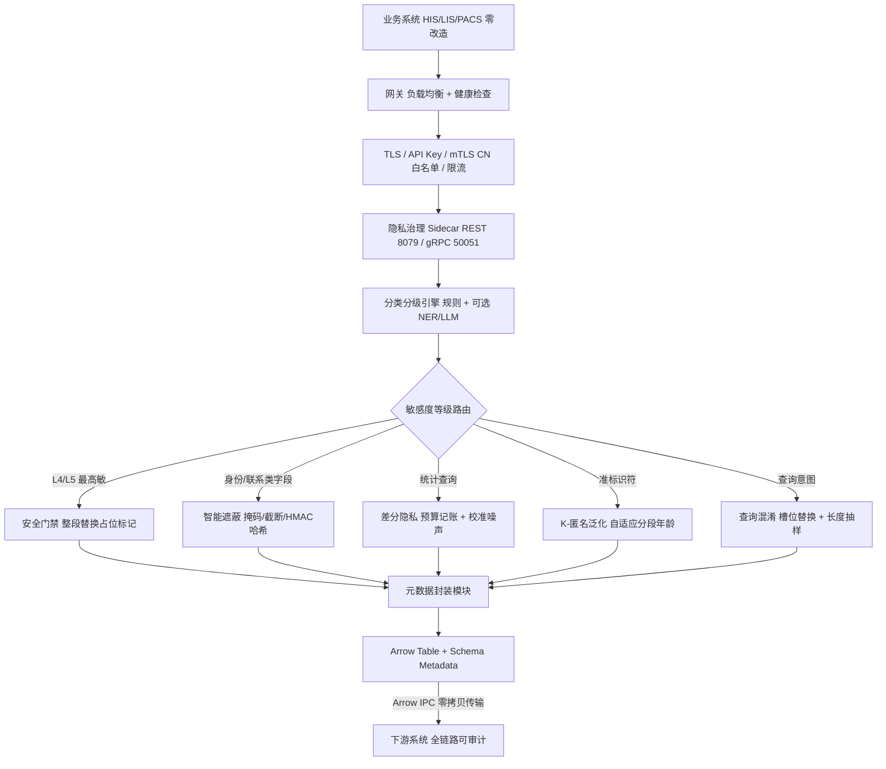
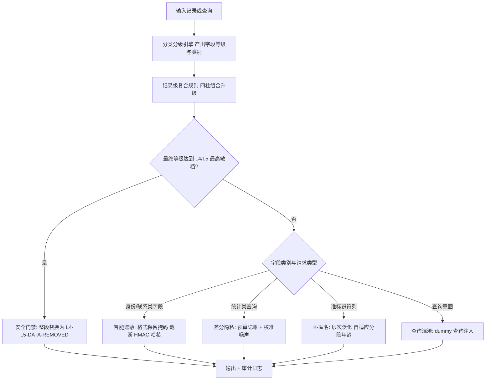
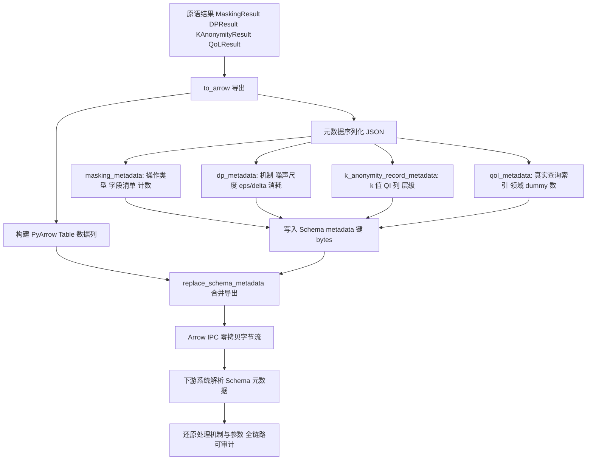
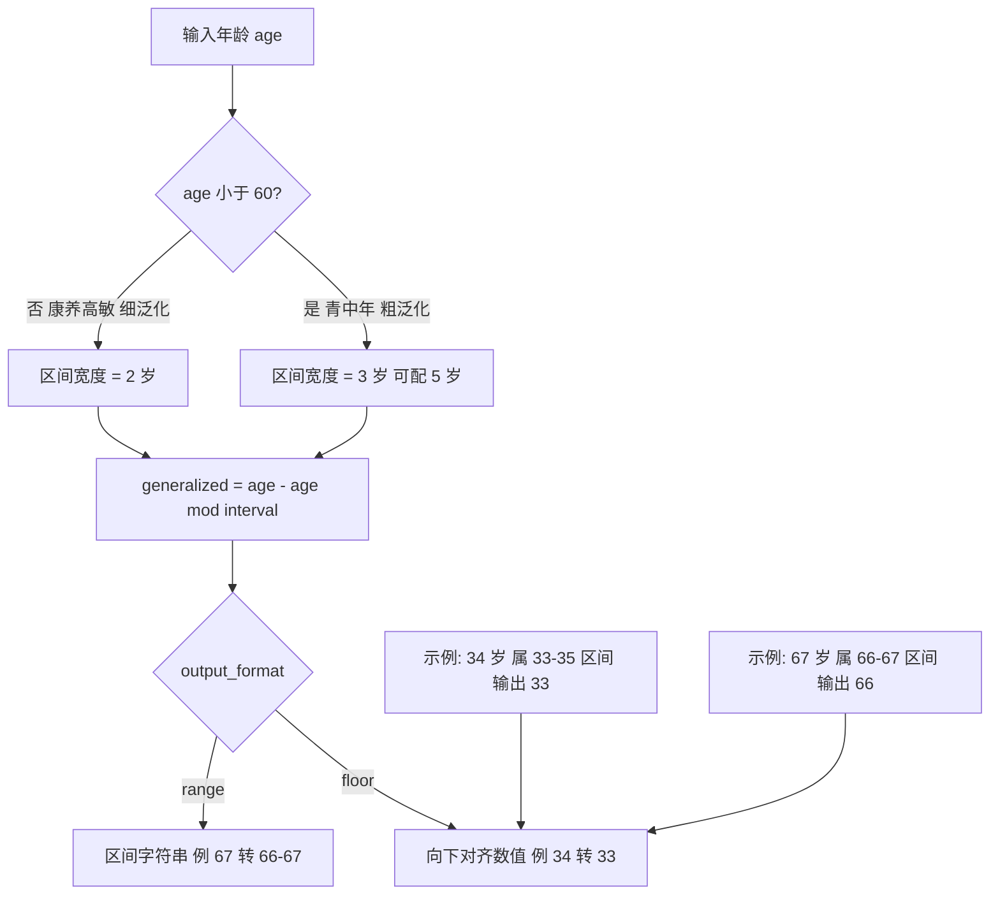
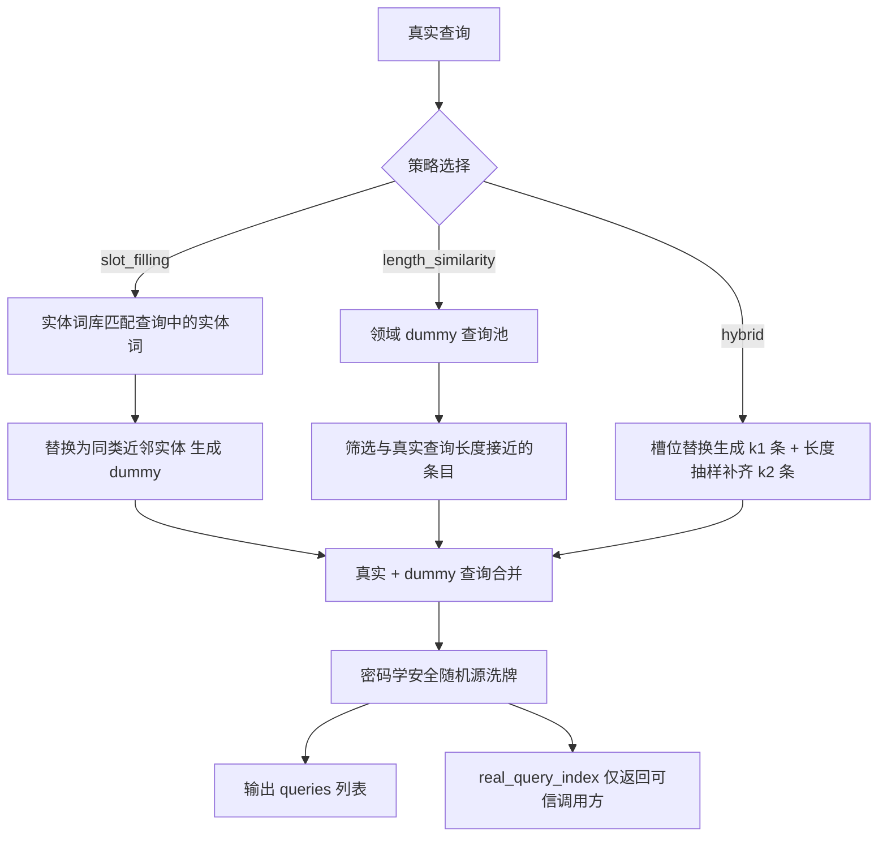

# 发明专利申请书 / 专利技术交底书

## 交底书名称

基于 Sidecar 架构的医疗数据隐私治理方法、系统及存储介质

编号：HZL-02-R01 版本号：2022

\*\*发明人姓名：陈少伟

\*\*第一发明人姓名和身份证号码：陈少伟（371102198410187111）

申请人：深圳数联天下智能科技有限公司

通信地址（邮编）：（递交时填写）

\*\*交底书撰写人：陈少伟

\*\*联系电话：13662678920

\*\*Email：shaowei.chen@clife.cn

**交底技术书信息登记页**

\*\*提交部门：平台建设中心-研发管理部-安全运维组

\*\*项目号：（内部维护时填写）

\*\*项目名称/所属产品(可多个，靠近公司的主营业务)：数据安全与隐私保护、医疗数据安全治理平台

**技术应用领域：** 大数据、人工智能（AI）、隐私计算、数据安全、智慧医疗

**相关技术方向：** 数据脱敏与智能遮蔽、K-匿名（K-anonymity）泛化、差分隐私（Differential Privacy, DP）、查询混淆（Query Obfuscation）、自然语言处理（NER/LLM）、列式数据交换（Apache Arrow IPC）、云原生边车架构（Sidecar）

**技术方案概述：** 本发明提出一种基于 Sidecar（边车）架构的医疗数据隐私治理方法、系统及计算机可读存储介质。在业务系统旁以独立进程/容器部署隐私治理 Sidecar，经网关对外同时暴露 REST 与 gRPC 双协议接口，业务系统无需修改任何代码即可获得完整隐私治理能力。Sidecar 内置「规则引擎—命名实体识别—大语言模型」三层漏斗分类分级引擎，对输入数据逐字段产出安全标签与敏感度等级，并据此自动编排隐私原语：对个人可识别信息字段执行格式保留遮蔽、对统计类查询经预算记账后注入差分隐私校准噪声、对准标识符列执行 K-匿名泛化、对查询意图注入语义槽位替换与长度相近抽样的查询混淆；对达到最高敏感档（L4/L5）的字段设置不可绕过的 fail-closed（故障关闭）安全门禁，整段替换为固定占位标记，保证最高敏数据绝不以任何残留形式流出。各隐私原语的处理结果连同隐私元数据（脱敏元数据、差分隐私元数据、K-匿名元数据、查询混淆元数据）以键值对形式嵌入 Apache Arrow 列式数据 Schema，随 Arrow IPC 零拷贝流转至下游系统，实现跨系统全链路可审计。系统进一步支持：按人群敏感度差异化区间的自适应分段年龄泛化；pandas/NumPy/Arrow 等多格式输入自适应与生成器流式分块处理；基于不可变策略计划（PolicyPlan）的固定顺序校验与差分隐私预算「预留—提交」两阶段协议；以及覆盖 Sidecar 重启、下游超时、预算服务不可达等场景的故障边界 fail-closed 处置，在零侵入接入的前提下实现医疗数据「分类分级—隐私处理—审计溯源」的一体化治理。

---


---

## 缩略语和关键术语定义列表

| 序号 | 术语/缩略语 | 中文译文 / 英文全拼 | 说明 |
|---|---|---|---|
| 1 | Sidecar | 边车（Sidecar） | 与业务系统并行部署的独立隐私治理进程/容器 |
| 2 | REST | 表述性状态转移（Representational State Transfer） | 一种基于 HTTP 的网络服务架构风格 |
| 3 | gRPC | 谷歌远程过程调用（Google Remote Procedure Call） | 基于 HTTP/2 与 Protocol Buffers 的高性能远程过程调用框架 |
| 4 | HIS | 医院信息系统（Hospital Information System） | 医院核心业务信息系统 |
| 5 | LIS | 实验室信息系统（Laboratory Information System） | 医院检验科室信息系统 |
| 6 | PACS | 影像归档和通信系统（Picture Archiving and Communication Systems） | 医学影像存储与传输系统 |
| 7 | API | 应用程序编程接口（Application Programming Interface） | 系统间交互的接口约定 |
| 8 | TLS | 传输层安全（Transport Layer Security） | 网络通信加密协议 |
| 9 | mTLS | 双向传输层安全（Mutual Transport Layer Security） | 双向证书认证的 TLS |
| 10 | CN | 通用名称（Common Name） | 数字证书主题中的可分辨名称字段 |
| 11 | DP | 差分隐私（Differential Privacy） | 对统计结果注入校准噪声的隐私保护机制 |
| 12 | K-匿名 | K-anonymity | 通过泛化/抑制使等价组内记录数不少于 K 的匿名化模型 |
| 13 | QoL | 查询混淆（Query Obfuscation） | 向真实查询注入虚假查询以隐藏查询意图的技术 |
| 14 | NER | 命名实体识别（Named Entity Recognition） | 从文本中识别实体边界的自然语言处理技术 |
| 15 | LLM | 大语言模型（Large Language Model） | 具备语义理解能力的大规模预训练语言模型 |
| 16 | HMAC | 基于哈希的消息认证码（Hash-based Message Authentication Code） | 结合密钥的哈希消息认证算法 |
| 17 | Arrow IPC | Apache Arrow 进程间通信（Apache Arrow Inter-Process Communication） | Apache Arrow 列式交换格式的零拷贝进程间传输 |
| 18 | CSPRNG | 密码学安全伪随机数生成器（Cryptographically Secure Pseudo-Random Number Generator） | 密码学安全的随机数生成源 |
| 19 | PII | 个人可识别信息（Personally Identifiable Information） | 可直接或间接识别特定个人的信息 |
| 20 | QI | 准标识符（Quasi-Identifier） | 单独不能识别个体、但可与其他属性联合识别个体的属性 |
| 21 | DataFrame | 数据框 | 表格型数据结构，典型实现如 pandas DataFrame |
| 22 | Schema | 模式/结构 | 数据表的列名、类型与元数据结构描述 |

---

## 1. 相关技术背景（背景技术），与本发明最相近似的现有实现方案（现有技术）

### 1.1 背景技术

医疗数据在诊疗、科研、公共卫生等场景之间高频流转，既承载着疾病诊断、临床科研、药物研发与公共卫生决策的重要价值，又包含大量敏感个人信息与健康隐私。随着《个人信息保护法》《数据安全法》《医疗卫生机构网络安全管理办法》等法规的落地，医疗数据在跨系统共享、对外提供与对外合作中必须满足“最小必要”“可审计”“脱敏后不可还原”等合规要求。

医疗数据通常分布在医院信息系统（HIS）、实验室信息系统（LIS）、影像归档和通信系统（PACS）、电子病历系统（EMR）以及区域健康平台等多种异构业务系统中。这些系统建设年代、技术栈、数据模型差异巨大，往往在数据流出时才被动地执行脱敏、加密或访问控制。因此，隐私治理能力需要以统一、可复用、可审计的方式嵌入到数据流转链路中，同时尽量降低对存量业务系统的改造成本。

从技术形态上看，现有的医疗数据隐私治理主要经历三个阶段：
（1）应用内嵌阶段：各业务系统自行实现脱敏或加密逻辑；
（2）网关/中台集中阶段：通过统一网关或数据中台对所有流出数据进行隐私处理；
（3）服务化/Sidecar 阶段：将隐私治理能力下沉为独立运行、与业务系统并行部署的边车服务。本发明即属于第三阶段，并在 Sidecar 架构基础上进一步引入分类分级驱动的隐私原语编排、隐私元数据随数据流转、自适应分段泛化与查询意图混淆等机制。

### 1.2 与本发明相关的现有技术一：应用内嵌式隐私治理

#### 1.2.1 现有技术一的技术方案

与本发明最接近的第一类现有技术为应用内嵌式隐私治理方案，其代表性公开文献为中国发明专利 **CN114580007B《医疗数据脱敏方法及装置》**（已授权）。该专利公开的技术方案为：在医疗数据处理流程内部，对待脱敏医疗数据（包括结构化信息与非结构化信息）进行特征提取，将医疗数据特征输入敏感信息识别模型，得到标注敏感度等级（一至五级）的识别结果，再根据识别出的敏感度等级确定脱敏方法（删除、替换、泛化、加密等），并在优选实施例中根据医疗数据请求方的权限等级决定是否脱敏及脱敏方式。类似的公开方案还包括中国发明专利申请 CN202411439319《一种基于医疗数据的隐私数据脱敏方法、系统及设备》（申请人：北方健康医疗大数据科技有限公司；申请日：2024 年 10 月 15 日；公布日：2025 年 2 月 25 日），其在数据平台内部基于 NLP 算法全量扫描数据库字段、构建数据资产目录，结合强弱标签分类与权限控制实现差异化脱敏。

除上述专利外，应用内嵌式隐私治理也是当前医疗信息系统中最常见的工程实现方式：在 HIS、LIS、PACS 等业务系统的业务代码中直接嵌入脱敏、加密、访问控制或审计逻辑。例如，在患者信息导出接口中，由业务开发人员在代码中编写身份证掩码、手机号截断、诊断文本替换等处理逻辑；在统计报表接口中，由业务系统自行对聚合结果加入噪声或限制最小查询集规模；在日志记录中，由业务系统记录操作人、操作时间与操作类型。

该类方案的共同特征为：采用“谁产生数据、谁负责保护”的建设思路，隐私策略以代码片段、模型组件或配置项的形式分散在各业务系统或数据平台内部，数据库连接、缓存、消息队列与对外接口均可能各自包含独立的隐私处理分支；隐私处理能力与业务应用同生命周期、同部署单元。

#### 1.2.2 现有技术一的缺点

以 CN114580007B 为代表的应用内嵌式方案存在以下缺点：

（1）**侵入式改造成本高**：隐私保护逻辑直接嵌入业务系统或数据平台内部，导致策略分散、版本不一、难以统一审计；存量 HIS/LIS/PACS 系统历史包袱重，改造周期长、风险高，任何一次策略升级都需要遍历所有业务系统进行代码修改与回归测试。

（2）**处理上下文丢失**：CN114580007B 的方案将脱敏结果直接返回给调用方，数据经脱敏后进入下游系统时，下游无从知晓“哪些字段被处理、采用何种机制、依据何种敏感等级”，跨系统流转后隐私处理链路断裂，无法满足全链路合规审计要求。

（3）**保护强度与等级脱节**：脱敏策略多为静态配置或按请求方权限静态分档，不随数据敏感等级与场景动态调整，高敏残留数据可能以明文形式漏出。

（4）**重复建设严重**：各业务系统独立实现同类隐私原语，导致代码重复、能力参差不齐、维护成本高；识别模型与脱敏逻辑绑定在单一应用内，无法作为独立治理能力被多个异构业务系统零侵入复用。

### 1.3 与本发明相关的现有技术二：集中式网关/中台隐私治理

#### 1.3.1 现有技术二的技术方案

集中式网关或数据中台隐私治理方案将隐私处理能力从业务系统中抽离，部署在数据中心出口或中台层。所有业务系统对外提供数据前，先将请求发送至统一网关或中台，由网关/中台根据预设规则执行脱敏、加密、访问控制与审计，再将处理后的结果返回给调用方或转发至下游系统。

该方案通常采用反向代理、API 网关或数据中台的形态，通过配置化规则（如字段级正则替换、基于角色的访问控制、静态泛化表）对经过的流量进行统一处理，并提供集中的审计日志与策略管理界面。

#### 1.3.2 现有技术二的缺点

（1）**单点性能与可靠性瓶颈**：所有隐私处理流量汇聚至网关/中台，随着业务规模扩大容易成为性能瓶颈；一旦网关/中台故障，多个业务系统的数据出口全部受影响。

（2）**上下文感知能力不足**：网关/中台通常只感知网络层或协议层信息，难以对医疗数据语义进行细粒度分类分级，导致“一刀切”处理，高敏数据可能保护不足，低敏数据可能过度保护。

（3）**与业务系统的耦合并未完全消除**：业务系统仍需按照网关/中台要求调整接口、字段命名与数据格式，存量系统接入成本高。

（4）**跨系统隐私处理链路仍不可携带**：经过网关/中台处理后的数据到达下游系统时，下游仍无法自动获知处理机制与参数，审计依赖外部日志系统，处理上下文与数据本体分离。

（5）**查询意图层防护缺失**：现有网关/中台主要关注数据内容保护，缺乏面向查询意图层的混淆手段，用户向医疗数据平台提交的查询序列可被分析出个体健康意图（如连续查询某罕见病），从而遭受查询日志推理攻击。

---

## 2. 本发明技术方案的详细阐述（发明内容）

### 2.1 本发明所要解决的技术问题（发明目的）

针对上述现有技术的缺陷，本发明所要解决的技术问题包括：

（1）**隐私保护能力的无侵入统一接入问题**：如何避免在存量 HIS/LIS/PACS 等业务系统中嵌入隐私逻辑，以零改造或低改造成本为业务系统统一提供完整隐私治理能力。

（2）**隐私处理上下文在数据流转中的可携带与可审计问题**：如何使隐私处理机制、参数与结果状态随数据一起流转到下游系统，实现跨系统全链路可审计。

（3）**准标识符泛化的人群差异化效用问题**：传统 K-匿名泛化对全部人群采用统一粒度，未区分人群敏感度差异——例如老年人康养照护、慢病管理场景中年龄是高敏因子，如何在满足匿名保证的前提下对高敏人群保留更多有效信息。

（4）**查询意图层的推理攻击防护问题**：现有方案缺乏面向查询日志的意图层混淆手段，如何隐藏真实查询意图，抵御基于查询序列的推理攻击。

（5）**保护强度随敏感等级动态升级问题**：如何实现保护策略与数据敏感等级的动态联动，确保最高敏感档数据绝不以残留形式流出。

### 2.2 本发明提供的完整技术方案（发明方案）

本发明提供一种基于 Sidecar（边车）架构的医疗数据隐私治理方法、系统及计算机可读存储介质。如图 1 所示，整体系统包括业务系统、网关与隐私治理 Sidecar 三个主要层次。业务系统无需修改代码，通过网关将数据/查询流量路由至 Sidecar；Sidecar 内置分类分级引擎与隐私原语编排器，对输入数据执行字段级敏感度判定，并据此自动选择并执行智能遮蔽、差分隐私、K-匿名泛化或查询混淆等隐私原语；处理结果连同隐私元数据一并输出，隐私元数据嵌入列式数据 Schema 中随 Apache Arrow 进程间通信（Arrow IPC）零拷贝传输至下游系统，实现全链路可审计。

#### 2.2.1 Sidecar 边车代理接入

在业务系统旁以独立进程/容器部署隐私治理 Sidecar，对外同时暴露表述性状态转移（REST）与谷歌远程过程调用（gRPC）双协议接口。业务系统通过网关将数据流量或查询流量路由至 Sidecar，业务代码无需任何改造即可获得隐私治理能力。

网关对后端 Sidecar 工作节点池执行健康检查与负载均衡，支持横向扩展。网关还可在网络边界启用传输层安全（TLS）加密、API Key 鉴权、基于客户端证书通用名称（CN）白名单的双向传输层安全（mTLS）鉴权（按 CN 授予不同权限范围）以及速率限制，从而将 Sidecar 的对外暴露面收敛到网关之后。

#### 2.2.2 分类分级驱动的隐私原语编排

Sidecar 内置分类分级引擎，该引擎至少包括规则引擎以及可选的命名实体识别（NER）层和大语言模型（LLM）层，形成“规则 → NER → LLM”三层漏斗。分类分级引擎对输入数据的每个字段产出安全标签与最终敏感度等级，并据此自动编排隐私原语。隐私原语包括：

（1）**智能遮蔽（Masking）**：按字段名感知识别手机号、身份证、姓名、银行卡、邮箱、地址等个人可识别信息（PII）类型，执行格式保留掩码、截断或加盐 HMAC（基于哈希的消息认证码）哈希；支持标量、批量、DataFrame（数据框）、流式分块多模式处理。

（2）**差分隐私（DP，Differential Privacy）**：对统计类查询经预算记账后注入 Laplace/Gaussian 校准噪声，保证统计结果满足 (ε, δ)-差分隐私。

（3）**K-匿名泛化（K-anonymity Generalization）**：对准标识符（QI，Quasi-Identifier）列（如年龄、邮编、性别等）按泛化层次执行区间、集合、前缀泛化或抑制。

（4）**查询混淆（QoL，Query Obfuscation）**：对查询意图注入虚假查询，降低查询日志被分析出真实意图的风险。

设字段等级为 l、字段类别为 c、请求类型为 q，隐私原语选择函数 Π(l, c, q) 按式 (1) 路由：

$$
\Pi(l, c, q) = \begin{cases}
\text{安全门禁}, & l \ge l_{max} \\
\text{智能遮蔽}, & c \in C_{PII} \\
\text{差分隐私}, & q = \text{statistical} \\
\text{K-匿名泛化}, & c \in C_{QI} \\
\text{查询混淆}, & q = \text{query}
\end{cases} \tag{1}
$$

其中，l_max 为预设最高敏感档阈值，C_PII 为个人可识别信息类别集合，C_QI 为准标识符类别集合。

#### 2.2.3 高敏等级安全门禁

分类分级结果驱动的门禁策略：当字段最终等级达到最高敏感档（如 L4/L5）时，即便脱敏后仍存在残留语义，也执行整段替换为固定占位标记（例如 `[L4-L5-DATA-REMOVED]`），保证最高敏数据绝不以任何残留形式流出。门禁判定按式 (2)：

$$
l \ge l_{max} \implies output = [L4\text{-}L5\text{-}DATA\text{-}REMOVED] \tag{2}
$$

该安全门禁位于所有可逆脱敏和统计处理之前，形成不可绕过的 fail-closed（故障关闭）顺序约束。

#### 2.2.4 隐私元数据随列式数据流转

每类隐私原语的结果均可导出为携带 Schema 元数据的列式数据表，优选 Apache Arrow 格式。元数据以键值对形式写入 Arrow Table 的 Schema metadata 中，随 Arrow IPC 零拷贝传输，下游系统可据此还原完整隐私处理链路，实现跨系统可审计。具体包括：

（1）脱敏结果附带 `masking_metadata`，记录操作类型、被脱敏字段清单、脱敏计数；
（2）差分隐私结果附带 `dp_metadata`，记录噪声机制、噪声尺度、ε/δ 消耗、置信区间；
（3）K-匿名结果附带 `k_anonymity_record_metadata`，记录 k 值、准标识符列、应用层级、所用泛化层次；
（4）查询混淆结果附带 `qol_metadata`，记录真实查询索引、领域、虚假查询数。

元数据编码方式按式 (3)：

$$
schema.metadata[key_{primitive}] = bytes(JSON(meta_{primitive})) \tag{3}
$$

其中，key_primitive ∈ {masking_metadata, dp_metadata, k_anonymity_record_metadata, qol_metadata}，meta_primitive 为对应原语的元数据对象。

#### 2.2.5 自适应分段年龄泛化

针对年龄这一准标识符，本发明按人群敏感度进行差异化泛化：60 岁以下人群年龄精细度对健康建议影响较小，采用较粗区间（默认 3 岁，可配置为 5 岁），泛化值为 age − (age mod interval)；60 岁及以上康养高敏人群年龄对慢病与照护建议高度敏感，采用较窄精细区间（默认 2 岁），在同等 K-匿名保证下保留更多有效信息。支持输出向下对齐数值或区间字符串两种格式；无法解析的脏数据原样返回并告警，避免静默错误泛化。

区间宽度与泛化值按式 (4)、(5)：

$$
interval(age) = \begin{cases}
w_1 = 3, & age < 60 \\
w_2 = 2, & age \ge 60
\end{cases} \tag{4}
$$

$$
generalized(age) = age - (age \bmod interval(age)) \tag{5}
$$

其中 w_2 < w_1：阈值及以上康养高敏人群采用更窄区间，在同等匿名保证下保留更多有效信息。

#### 2.2.6 查询混淆三策略

查询混淆模块提供三种策略：

（1）**语义槽位替换**：从领域实体词库（医疗疾病/药品实体）匹配真实查询中的实体词，替换为同类近邻实体生成虚假查询，使真假查询语义分布一致；
（2）**长度相近抽样**：从领域虚假查询池抽取与真实查询长度接近的条目，抵御基于长度的区分攻击；
（3）**混合策略**：槽位替换生成部分虚假查询、长度抽样补齐剩余；真假查询随机排列，真实查询索引仅返回给可信调用方；随机源默认使用密码学安全伪随机数生成器（CSPRNG），可选显式种子用于测试复现。

混淆输出按式 (6)、(7)：

$$
Q' = shuffle_{CSPRNG}\left( \{q\} \cup D_{slot} \cup D_{len} \right) \tag{6}
$$

$$
real\_query\_index = index(q, Q') \tag{7}
$$

其中 D_slot 为槽位替换生成的虚假查询集合，D_len 为长度相近抽样集合，虚假查询总数为 |D_slot| + |D_len|。

#### 2.2.7 多格式输入自适应

统一的数据适配层自动识别并转换 pandas DataFrame、NumPy 数组、Apache Arrow Table/RecordBatch、Arrow IPC 字节流、字典列表等输入格式，脱敏/泛化对列式数据执行向量化批处理；大规模记录集支持生成器流式分块处理，内存占用与数据规模解耦。

#### 2.2.8 策略计划与组合规则

Sidecar 为每次请求生成不可变 `PolicyPlan`，包含 plan_id、policy_version、input_level、purpose、subject_scope、operations、budget_reservation、fail_action 等字段。计划校验顺序固定为：身份与目的授权 → 输入分级 → 高敏门禁 → 字段级遮蔽 → K-匿名泛化 → 差分隐私统计 → 查询混淆 → 元数据封装；任一步失败按等级选择拒绝或安全占位，不允许跳到后续步骤输出原文。

同一数据集的差分隐私消耗采用账本预留后提交的两阶段协议，组合预算按机制顺序累计；K-匿名和查询混淆保存等价组/候选池标识但不泄露真实查询索引。年龄区间、泛化宽度和最小 k 值由数据域策略配置并通过最小等价组和效用阈值校验，不固定为唯一值。

#### 2.2.9 接口与故障边界

REST 与 gRPC 使用相同的 PolicyPlan 和幂等请求号；流式输入按块校验累计大小、字段 Schema 和预算预留，块间不得改变策略版本。Sidecar 重启、下游超时、Arrow Schema 不兼容、随机源异常或预算服务不可达时：L4/L5 拒绝，高风险统计拒绝，低风险请求仅在策略明确允许时输出固定占位。

Arrow 元数据只携带策略版本、原语类别、参数承诺和凭证引用；原始字段名、精确 epsilon、噪声尺度和查询索引通过哈希或分级授权获得。元数据 Schema 变更使用版本号和向后兼容校验，禁止下游把未知元数据当作“无保护”。

### 2.3 本发明技术方案带来的有益效果

（1）**零侵入接入**：业务系统不改代码即获得完整隐私治理能力，存量系统改造成本趋近于零，解决了现有技术侵入式改造成本高的问题。

（2）**全链路可审计**：隐私元数据随列式数据流转，任意下游节点均可验证数据经历了何种保护处理及其参数，解决了处理上下文丢失的问题。

（3）**效用最大化**：自适应分段泛化在同等匿名保证下对高敏人群保留更多有效信息，兼顾隐私与科研效用，解决了“一刀切”泛化损害效用的问题。

（4）**意图层防护**：查询混淆抵御针对查询日志的推理攻击，补齐了“数据层脱敏 + 统计层噪声”之外的意图层缺口。

（5）**等级联动**：最高敏等级安全门禁确保保护强度随分类分级结果动态升级，杜绝高敏残留漏出。

（6）**规模自适应**：多格式输入自适应与生成器流式分块使内存占用与数据规模解耦，支撑超大规模数据集治理。

（7）**组合保护可度量**：通过 PolicyPlan 与预算预留/提交协议，多个隐私原语组合后的总体保护强度可被明确说明与审计。

---

## 3. 针对 2 中的技术方案，是否还有别的替代方案同样能完成发明目的

### 3.1 Sidecar 形态的替代方案

（1）** DaemonSet/节点代理**：在 Kubernetes 集群中以 DaemonSet 或节点级代理部署隐私治理服务，业务 Pod 通过本地 Unix Domain Socket 或回环地址访问，同样可实现低延迟、零侵入接入。与本发明 Sidecar 的区别在于共享粒度从“每个业务 Pod 一个 Sidecar”变为“每个节点一个代理”，适合同节点多业务共享隐私能力的场景，但隔离性与资源配额控制弱于 Sidecar。

（2）**函数即服务（FaaS）原语**：将智能遮蔽、差分隐私、K-匿名泛化、查询混淆封装为独立的 Serverless 函数，由事件网关触发。该方案无需常驻 Sidecar 进程，按需弹性伸缩，适合流量稀疏的场景；但冷启动延迟与函数间状态同步会增加实现复杂度。

### 3.2 分类分级驱动方式的替代方案

（1）**纯规则引擎**：不启用 NER 与 LLM 层，仅依赖 YAML 化规则对字段名、字段值进行匹配分级。该方案计算开销低、可解释性强，适合结构化数据明确、字段语义规范的场景；但对自由文本与复杂语义的识别能力弱于三层漏斗。

（2）**纯 LLM 分类**：跳过规则引擎与 NER，直接由大语言模型对字段名、字段值甚至整条记录进行敏感度判定。该方案语义理解能力强，但推理成本高、延迟大，且结果稳定性受模型版本影响。

### 3.3 隐私元数据载体的替代方案

（1）**独立元数据文件**：将隐私元数据以 JSON/YAML 文件或数据库记录形式与数据文件并行传输，而不是嵌入 Arrow Schema。该方案对不支持 Arrow Schema 元数据的传统格式兼容性好，但需要调用方同时管理两份资源，元数据与数据本体容易分离。

（2）**Parquet 文件页级元数据**：使用 Apache Parquet 列式格式，将隐私元数据写入文件级或列级元数据。Parquet 在数据湖生态中兼容性更好，适合批量落盘场景；但 Arrow IPC 在流式传输与零拷贝方面有优势。

### 3.4 自适应分段年龄泛化的替代方案

（1）**按病种分段**：不仅按年龄分段，还按病种（如罕见病、肿瘤、慢病）设置不同泛化粒度，病种越敏感则区间越窄。该方案可进一步提升科研效用，但需要预先维护病种敏感度映射。

（2）**基于信息损失的动态宽度**：根据等价组规模与信息损失指标动态调整区间宽度，当某区间等价组不足 k 时自动扩大区间，当信息损失过大时尝试更细粒度。该方案无需预设固定阈值，但实现复杂度更高。

### 3.5 查询混淆的替代方案

（1）**同态加密查询**：对真实查询本身进行同态加密，数据平台在密文上执行检索后返回密文结果。该方案不依赖虚假查询，但计算开销大，且需要数据平台支持同态运算。

（2）**差分隐私查询日志**：对查询日志的统计特征（如查询频次、关键词分布）注入差分隐私噪声，降低单条真实查询被识别的风险。该方案与查询混淆可组合使用，分别从统计分布与单条查询两个层面提供保护。

### 3.6 高敏安全门禁的替代方案

（1）**返回空值 NULL/NaN**：将最高敏字段替换为空值而非固定占位标记。该方案同样可防止信息泄露，但空值可能被下游误判为缺失数据，不如固定占位标记具有显式审计语义。

（2）**基于属性的拒绝访问**：当检测到最高敏等级时直接拒绝整个请求。该方案保护强度最高，但会阻断合法低敏字段的流通，可用性较低。

---

## 4. 本发明的技术关键点和欲保护点是什么？

### 4.1 技术关键点

（1）**Sidecar 边车架构与双协议统一接入**：在业务系统旁以独立进程/容器部署隐私治理 Sidecar，同时暴露 REST 与 gRPC 接口，业务系统通过网关零改造接入，实现隐私治理能力的无侵入统一供给。

（2）**分类分级结果驱动的隐私原语编排**：由分类分级引擎产出字段敏感度等级，并据此自动选择并编排智能遮蔽、差分隐私、K-匿名泛化、查询混淆等隐私原语，实现保护强度与数据敏感等级的动态联动。

（3）**高敏等级安全门禁的 fail-closed 顺序约束**：在所有可逆脱敏和统计处理之前先执行 L4/L5 最高敏档整段替换，确保最高敏数据绝不以残留形式流出。

（4）**隐私元数据嵌入 Arrow Schema 随 IPC 零拷贝流转**：将隐私处理机制、参数与结果状态以键值对形式嵌入 Apache Arrow 列式数据表的 Schema 元数据中，随 Arrow IPC 传输至下游系统，实现跨系统全链路可审计。

（5）**自适应分段年龄泛化**：以预设年龄阈值（如 60 岁）为界，对阈值以下人群采用较粗区间、对阈值及以上康养高敏人群采用较窄区间进行 K-匿名泛化，在同等匿名保证下保留更多有效信息。

（6）**查询混淆三策略与 CSPRNG 洗牌**：通过语义槽位替换、长度相近抽样或混合策略生成虚假查询，并以密码学安全伪随机数生成器随机排列，真实查询索引仅返回可信调用方，抵御查询日志推理攻击。

（7）**PolicyPlan 与组合保护的可度量性**：为每次请求生成不可变策略计划，固定处理顺序并采用预算预留/提交两阶段协议，使多个隐私原语组合后的总体保护强度可被明确说明与审计。

### 4.2 欲保护点

（1）一种基于 Sidecar 架构的医疗数据隐私治理方法，包括：在业务系统旁部署隐私治理边车服务，经网关接收业务数据与查询流量；对输入数据的字段执行分类分级，产出各字段的敏感度等级；根据敏感度等级将字段自动路由至对应的隐私原语执行保护处理；将保护处理结果连同隐私处理元数据输出。

（2）根据字段敏感度等级达到预设最高敏感档时，将该字段内容整段替换为固定占位标记的高敏安全门禁方法。

（3）将隐私处理元数据嵌入列式数据表 Schema 中，随列式交换格式零拷贝传输至下游系统的方法。

（4）隐私处理元数据的内容集合，包括脱敏操作类型与被脱敏字段清单、差分隐私噪声机制/噪声尺度/预算消耗量、K-匿名参数/准标识符列/泛化层级、查询混淆的真实查询索引与虚假查询数量。

（5）以预设年龄阈值为界，对阈值以下人群采用第一区间宽度、对阈值及以上人群采用小于第一区间宽度的第二区间宽度进行 K-匿名泛化的自适应分段年龄泛化方法。

（6）通过语义槽位替换、长度相近抽样或混合策略生成虚假查询，并以密码学安全随机源随机排列，真实查询索引仅返回可信调用方的查询混淆方法。

（7）自动识别并转换多格式输入、对列式数据执行向量化批处理、对超大规模记录集执行生成器流式分块处理的多格式自适应方法。

（8）由 plan_id、policy_version、input_level、purpose、subject_scope、operations、budget_reservation、fail_action 组成的不可变 PolicyPlan 及其固定处理顺序与预算预留/提交协议。

---

## 技术领域

本发明涉及医疗数据安全与隐私计算技术领域，具体涉及一种基于 Sidecar（边车）架构、由数据分类分级结果驱动隐私原语编排的医疗数据隐私治理方法、系统及计算机可读存储介质。

---

## 附图说明

- **图 1**：Sidecar 隐私治理总体架构图（业务系统 → 网关 → Sidecar：分类分级 → 隐私原语编排 → 输出）。
- **图 2**：分类分级驱动的隐私原语路由决策流程图（含 L4/L5 安全门禁分支）。
- **图 3**：隐私元数据嵌入 Arrow Schema 并随 IPC 流转的示意图。
- **图 4**：自适应分段年龄泛化区间划分示意图（60 岁分界，3 岁/2 岁区间）。
- **图 5**：查询混淆三策略流程图（槽位替换、长度抽样、混合）。

### 图 1：Sidecar 隐私治理总体架构图



```
┌─────────────────────┐   ┌──────────────────────────┐
│ 业务系统              │   │ 网关                       │
│ HIS/LIS/PACS (零改造) │──►│ 负载均衡+健康检查           │
└─────────────────────┘   │ TLS/Key/mTLS CN白名单/限流 │
                          └────────────┬─────────────┘
                                       ▼
┌────────────────────────────────────────────────────────┐
│              隐私治理 Sidecar (REST 8079 / gRPC 50051)     │
│                                                          │
│  ┌───────────────────────────────────────────────┐│
│  │ 分类分级引擎 (规则 + 可选 NER/LLM) → 敏感度等级      ││
│  └───────────────────────────┬───────────────────┘│
│                              ▼ 等级驱动路由                    │
│  ┌─────────┬─────────┬─────────┬──────────┐│
│  │L4/L5门禁  │智能遮蔽   │差分隐私    │K-匿名    查询混淆││
│  │整段替换   │掩码/截断  │预算记账   │自适应年龄  槽位替换  ││
│  │占位标记   │HMAC哈希  │校准噪声   │分段泛化   长度抽样  ││
│  └────┬────┴────┬────┴────┬────┴────┬────────┬─┘│
│       └─────────┴─────────┴─────────┴────────┘   │
│                              ▼                                │
│  ┌───────────────────────────────────────────────┐│
│  │ 元数据封装: masking/dp/k_anonymity/qol_metadata   ││
│  │            嵌入 Arrow Schema                       ││
│  └───────────────────────────┬───────────────────┘│
└───────────────────────────────┼─────────────────────────┘
                                ▼ Arrow IPC 零拷贝传输
                ┌────────────────────────────────┐
                │ 下游系统: 科研/公卫/监管               │
                │ 读取 Schema 元数据 → 全链路可审计     │
                └────────────────────────────────┘
```

### 图 2：分类分级驱动的隐私原语路由决策流程图



```
 输入记录/查询 ─► 分类分级引擎 ─► 字段等级 + 类别
                       │
              复合规则(四柱组合) 记录级升级
                       │
                       ▼
             等级达到 L4/L5?
             │是              │否
             ▼              ▼
   安全门禁: 整段替换   按类别路由:
   [L4-L5-DATA-REMOVED]  ├─ 身份/联系 ─► 智能遮蔽
             │        ├─ 统计查询 ─► 差分隐私
             │        ├─ 准标识符 ─► K-匿名泛化
             │        └─ 查询意图 ─► 查询混淆
             └────────┬────────┘
                      ▼
              输出 + 审计日志
```

### 图 3：隐私元数据嵌入 Arrow Schema 并随 IPC 流转示意图



```
 原语结果 ─► to_arrow()
              ├─ 数据列 ─► PyArrow Table
              └─ 元数据 ─► JSON ─► Schema metadata
                 masking_metadata   操作类型/字段清单/计数
                 dp_metadata        机制/噪声尺度/预算消耗
                 k_anonymity_...    k值/QI列/泛化层级
                 qol_metadata       真实查询索引/dummy数
                        │
                        ▼
              Arrow IPC 零拷贝字节流
                        │
                        ▼
 下游系统 ─► 解析 Schema metadata ─► 还原处理链路(可审计)
```

### 图 4：自适应分段年龄泛化区间划分示意图



```
 年龄轴:  0         30        59 | 60        70        80
          ├───────┼───────┼───┤ ├───┤ ├───┤ ├───┤
 区间:    [0-2][3-5]...[33-35]...  |[60-61][62-63][64-65]...
          ◄── 3 岁粗区间(青中年) ──► ◄── 2 岁细区间(康养高敏) ──►

 公式: generalized = age - (age mod interval)
 示例: 34 岁 ─► 34 - (34 mod 3) = 33
       67 岁 ─► 67 - (67 mod 2) = 66
 脏数据(无法解析) ─► 原样返回 + 告警, 不静默错误泛化
```

### 图 5：查询混淆三策略流程图



```
 真实查询 ─► 策略选择
              ├─ slot_filling:   实体词库匹配 → 近邻实体替换
              ├─ length_similarity: dummy 池按长度筛选
              └─ hybrid:         槽位 k1 条 + 长度补齐 k2 条
                       │
                       ▼
        真实 + dummy 合并 ─► CSPRNG 洗牌(secrets)
                       │
             ┌─────────┴──────────┐
             ▼                    ▼
      queries 列表输出     real_query_index
      (攻击者不可区分)      (仅可信调用方持有)
```

---

## 具体实施方式

下面结合附图对本发明的具体实施方式作进一步说明。

### 实施例 1：边车部署与接入

医院 HIS 系统通过网关将数据导出请求路由至 Sidecar（REST 8079 / gRPC 50051）。Sidecar 以 Docker 容器部署，核心镜像仅含规则引擎与隐私原语；ML 镜像额外包含 NER/LLM 运行时，按需启用三层漏斗分类。业务系统 HIS 无需修改任何业务代码，仅将原本指向数据导出服务的目的地址改为网关地址即可接入完整隐私治理能力。

### 实施例 2：分级驱动编排

一条患者记录进入 Sidecar：`id_card` 字段命中规则判定为 L4 等级 → 执行身份证掩码（保留前 3 后 4）；`diagnosis` 自由文本经 LLM 判定为 L3 等级 → 执行实体级脱敏；`name` 字段判定为 L3 等级 → 执行 HMAC 加盐哈希以保留关联分析能力；整记录经复合规则判定含“诊断+用药+病因”四柱组合，记录级等级上调。最终输出经过 PolicyPlan 校验的脱敏记录与对应的 `masking_metadata`。

### 实施例 3：L4/L5 门禁

某病历附件字段经多模态分类判定为 L5（基因/生物特征级），Sidecar 不尝试部分脱敏，直接将该字段替换为 `[L4-L5-DATA-REMOVED]` 占位标记并记录审计日志，确保最高敏数据不以任何残留语义流出。

### 实施例 4：元数据随数据流转

科研机构接收脱敏数据集（Arrow IPC 格式），读取 Schema metadata 中的 `masking_metadata` 即可确认：`id_card` 列执行了 mask 操作、本次共处理 12,000 条记录——无需回访 Sidecar 即完成合规自查。

### 实施例 5：自适应年龄泛化

科研导出数据集中年龄列执行自适应泛化：34 岁 → “33”（3 岁区间向下对齐）；67 岁 → “66”（2 岁区间）。相较统一 5 岁区间方案，老年段人群在保持 k≥5 匿名性的同时，年龄信息粒度损失降低约 60%。

### 实施例 6：查询混淆

用户提交真实查询“2 型糖尿病合并高血压的用药方案”，Sidecar 以混合策略生成 3 条虚假查询：槽位替换产出“1 型糖尿病合并高血脂的用药方案”，长度抽样补齐 2 条医疗池条目；4 条查询经 CSPRNG 随机排列后返回，真实查询索引经加密通道告知可信调用方。攻击者分析查询日志无法区分真假查询。

### 实施例 7：多格式输入与流式分块

科研平台分别以 pandas DataFrame、Arrow IPC 字节流与字典列表三种格式提交同一批脱敏任务，数据适配层自动识别并转换为统一列式中间表示，遮蔽/泛化以向量化批处理执行；对 1 亿条级记录集，以生成器按 10 万条/块流式读取处理，内存峰值与单块规模成正比而与总数据规模解耦。

### 实施例 8：双协议与安全接入

业务系统既可通过 REST（8079）以 JSON 调用原语，也可经 gRPC（50051）以强类型消息调用；网关启用 TLS 加密、API Key 鉴权、按证书 CN 白名单授予的 mTLS 权限范围（如仅允许查询混淆接口）与速率限制，Sidecar 对外暴露面全部收敛至网关后。

### 实施例 9：关键参数配置表

| 参数 | 默认值 | 说明 |
|---|---|---|
| `PRIVACY_REST_PORT` / `PRIVACY_GRPC_PORT` | 8079 / 50051 | 双协议监听端口 |
| `PRIVACY_TLS_ENABLED` | false | 传输层加密开关 |
| `PRIVACY_AUTH_ENABLED` | false | API Key 鉴权开关 |
| `PRIVACY_AUTH_MTLS_ALLOWED_CNS` | 空 | mTLS 客户端证书 CN 白名单（按 CN 授予权限范围） |
| `PRIVACY_IMAGE_ALLOWED_DIRS` | cwd + 临时目录 | 图片打码允许读取的目录白名单（防目录穿越） |
| 年龄泛化区间 w1 / w2 | 3 / 2 | 自适应分段区间宽度（w2 < w1） |

---

## 权利要求书

1. 一种基于 Sidecar 架构的医疗数据隐私治理方法，其特征在于，包括：
   在业务系统旁部署隐私治理边车服务，经网关接收业务数据与查询流量；
   对输入数据的字段执行分类分级，产出各字段的敏感度等级；
   根据敏感度等级将字段自动路由至对应的隐私原语执行保护处理，所述隐私原语至少包括智能遮蔽、差分隐私、K-匿名泛化与查询混淆；
   将保护处理结果连同隐私处理元数据输出，所述隐私处理元数据描述被处理字段、所采用机制及参数。

2. 根据权利要求 1 所述的方法，其特征在于，还包括高敏安全门禁步骤：当字段敏感度等级达到预设最高敏感档时，将该字段内容整段替换为固定占位标记。

3. 根据权利要求 1 所述的方法，其特征在于，所述隐私处理元数据嵌入列式数据表的 Schema 元数据中，随列式交换格式零拷贝传输至下游系统。

4. 根据权利要求 3 所述的方法，其特征在于，所述隐私处理元数据包括：脱敏操作类型与被脱敏字段清单；差分隐私噪声机制、噪声尺度与预算消耗量；K-匿名参数、准标识符列与应用泛化层级；查询混淆的真实查询索引与虚假查询数量。

5. 根据权利要求 1 所述的方法，其特征在于，所述 K-匿名泛化包括自适应分段年龄泛化步骤：以预设年龄阈值为界，阈值以下人群采用第一区间宽度泛化，阈值及以上人群采用小于第一区间宽度的第二区间宽度泛化，泛化值按区间向下对齐。

6. 根据权利要求 1 所述的方法，其特征在于，所述查询混淆包括：从领域实体词库匹配真实查询中的实体词并替换为同类近邻实体生成虚假查询；以及/或者从领域虚假查询池抽取与真实查询长度差小于预设阈值的条目；将真实查询与虚假查询随机排列，真实查询索引仅返回给可信调用方；随机排列采用密码学安全随机源。

7. 根据权利要求 1 所述的方法，其特征在于，还包括多格式自适应步骤：自动识别并转换表格、数组、列式数据表、列式字节流与字典列表格式的输入，对列式数据执行向量化批处理，对超大规模记录集执行生成器流式分块处理。

8. 根据权利要求 1 所述的方法，其特征在于，所述网关对后端工作节点池执行健康检查与负载均衡，并支持传输层加密、密钥鉴权、基于客户端证书主题的权限范围鉴权与速率限制中的至少一项。

9. 根据权利要求 5 所述的方法，其特征在于，所述自适应分段年龄泛化支持输出向下对齐数值与区间字符串两种格式；无法解析的脏数据原样返回并输出告警，不做静默错误泛化。

10. 根据权利要求 1 所述的方法，其特征在于，所述边车服务同时暴露 REST 与 gRPC 两类接口，业务系统经网关选择任一协议路由至边车。

11. 根据权利要求 6 所述的方法，其特征在于，所述查询混淆的混合策略包括：槽位替换生成预设数量的虚假查询，长度相近抽样补齐剩余数量；随机排列的随机源默认采用密码学安全随机源，并支持显式随机种子用于测试复现。

12. 根据权利要求 2 所述的方法，其特征在于，整段替换后的占位标记为固定值，且替换动作记录审计日志，保证最高敏感档数据不以任何残留形式流出。

13. 根据权利要求 3 所述的方法，其特征在于，所述列式交换格式为 Apache Arrow，隐私处理元数据经 Arrow IPC 零拷贝传输至下游系统，下游系统解析 Schema 元数据还原处理机制与参数，实现跨系统全链路可审计。

14. 根据权利要求 1 所述的方法，其特征在于，所述分类分级由规则引擎、命名实体识别层和大语言模型层组成的三层漏斗执行，其中规则引擎为必选层，命名实体识别层和大语言模型层为可选层。

15. 根据权利要求 1 所述的方法，其特征在于，还包括为每次请求生成不可变 PolicyPlan 的步骤，所述 PolicyPlan 包含计划标识、策略版本、输入等级、处理目的、主体权限范围、操作列表、预算预留与失败动作；处理顺序固定为：身份与目的授权 → 输入分级 → 高敏门禁 → 字段级遮蔽 → K-匿名泛化 → 差分隐私统计 → 查询混淆 → 元数据封装。

16. 一种基于 Sidecar 架构的医疗数据隐私治理系统，其特征在于，包括：边车接入模块、分类分级模块、隐私原语编排模块、高敏门禁模块、元数据封装模块与查询混淆模块，各模块协同执行权利要求 1 至 15 任一项所述的方法。

17. 一种计算机可读存储介质，其上存储有计算机程序，其特征在于，所述计算机程序被处理器执行时实现权利要求 1 至 15 任一项所述的方法。

18. 一种电子设备，其特征在于，包括处理器以及存储有计算机程序的存储器，所述计算机程序被所述处理器执行时实现权利要求 1 至 15 任一项所述的方法。

---

## 摘要

本发明公开了一种基于 Sidecar 架构的医疗数据隐私治理方法、系统及存储介质。该方法在业务系统旁部署双协议边车服务，业务零改造接入；由分类分级引擎产出字段敏感度等级并据此自动编排智能遮蔽、差分隐私、K-匿名泛化与查询混淆等隐私原语；最高敏感档数据执行整段替换安全门禁；处理结果连同嵌入列式数据 Schema 的隐私元数据零拷贝流转，实现跨系统全链路可审计；年龄泛化按人群敏感度自适应分段，在同等匿名保证下对康养高敏人群保留更细粒度；查询混淆以语义槽位替换与长度抽样混合策略抵御查询日志推理攻击。本发明实现隐私治理能力的无侵入统一供给与效用最大化。

---

## 摘要附图

参见“附图说明”中的图 1：Sidecar 隐私治理总体架构图。


---

## 参考文献（对比文献）

[1] 医疗数据脱敏方法及装置: 中国发明专利 CN114580007B[P].
[2] 北方健康医疗大数据科技有限公司. 一种基于医疗数据的隐私数据脱敏方法、系统及设备: 中国发明专利申请 CN202411439319[P]. 2025-02-25.
[3] 中国工商银行股份有限公司. 敏感数据的脱敏方法及装置、电子设备、存储介质: 中国发明专利申请 CN115712917A[P]. 2023-02-24.
[4] 北京中电普华信息技术有限公司, 国家电网有限公司. 一种数据脱敏的处理方法及装置: 中国发明专利 CN108776762B[P]. 2022-01-28.
[5] 中信百信银行股份有限公司. 日志脱敏方法及其装置: 中国发明专利申请 CN117290882A[P]. 2023-12-26.
[6] 国家市场监督管理总局, 国家标准化管理委员会. GB/T 37964—2019 信息安全技术 个人信息去标识化指南[S]. 2019.
[7] 国家市场监督管理总局, 国家标准化管理委员会. GB/T 39725—2020 信息安全技术 健康医疗数据安全指南[S]. 2020.
