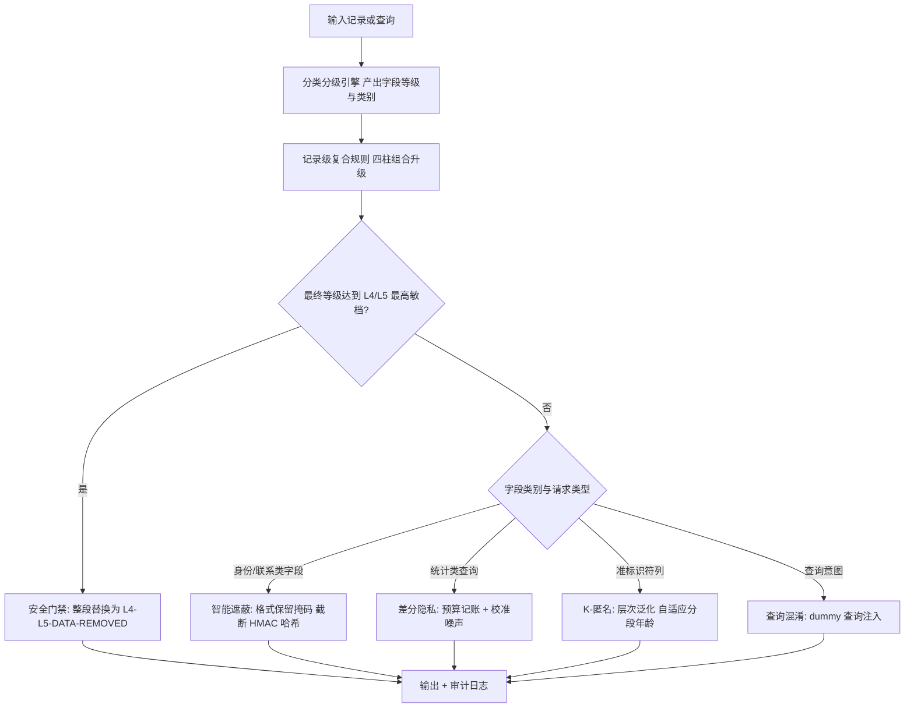
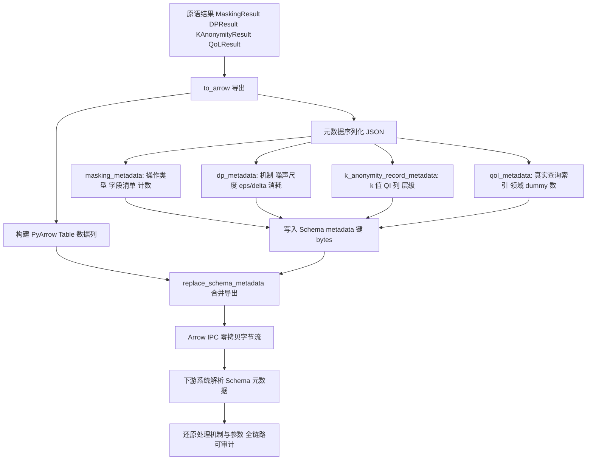
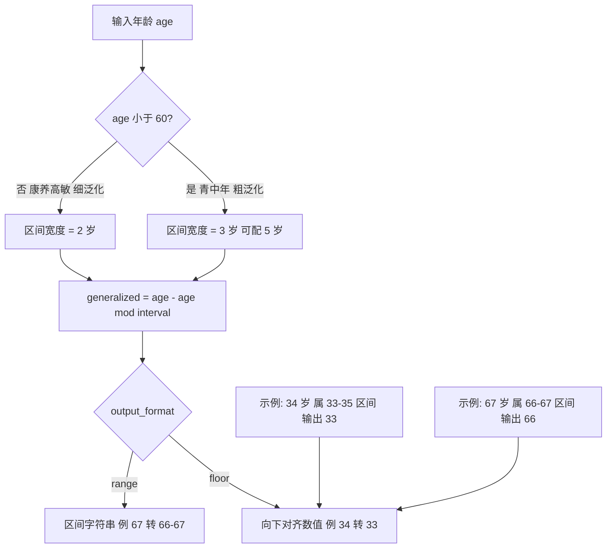
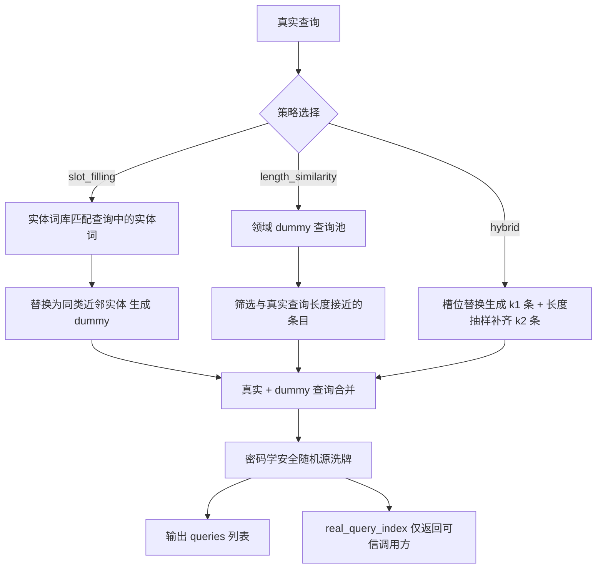
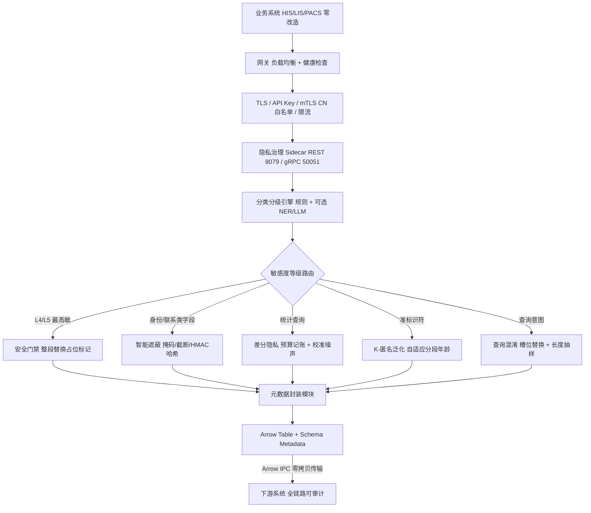

# 发明专利申请书

## 发明名称

**基于 Sidecar 架构的医疗数据隐私治理方法、系统及存储介质**

## 申请信息（拟）

| 项目 | 内容                                                        |
|---|-------------------------------------------------------------|
| 技术领域分类号（建议） | G06F 21/62（数据访问保护）、H04L 67/10（网络服务协议/代理） |
| 申请人 | 深圳数联天下智能科技有限公司、柳州市大数据发展局            |
| 发明人 | 陈少伟                                                      |
| 申请号 / 申请日 | （递交时填写）                                              |
| 代理机构 / 代理人 | （递交时填写）                                              |

---

## 技术领域

本发明涉及医疗数据安全与隐私计算技术领域，具体涉及一种基于 Sidecar（边车）架构、由数据分类分级结果驱动隐私原语编排的医疗数据隐私治理方法、系统及计算机可读存储介质。

## 背景技术

医疗数据在诊疗、科研、公共卫生等场景间高频流转，需在可用性与隐私保护之间取得平衡。现有技术存在以下缺陷：

1. **侵入式改造成本高**：脱敏、差分隐私等逻辑直接嵌入各业务系统，策略分散、版本不一、难以统一审计；存量 HIS/LIS/PACS 系统改造周期长、风险高。
2. **处理上下文丢失**：数据经脱敏后进入下游系统时，下游无从知晓"哪些字段被处理、采用何种机制、依据何种敏感等级"，跨系统流转后隐私处理链路断裂，无法满足全链路合规审计要求。
3. **一刀切泛化损害效用**：K-匿名泛化对全部人群采用统一粒度，未区分人群敏感度差异——例如老年人康养照护、慢病管理场景中年龄是高敏因子，需要更审慎的差异化泛化策略。
4. **查询日志推理攻击**：用户向医疗数据平台提交的查询序列可被分析出个体健康意图（如连续查询某罕见病），现有方案缺乏面向查询意图层的混淆手段。
5. **保护强度与等级脱节**：脱敏策略多为静态配置，不随数据敏感等级动态调整，高敏残留数据可能以明文形式漏出。

## 发明内容

### 一、要解决的技术问题

本发明旨在解决：（1）隐私保护能力的无侵入统一接入问题；（2）隐私处理上下文在数据流转中的可携带与可审计问题；（3）准标识符泛化的人群差异化效用问题；（4）查询意图层的推理攻击防护问题；（5）保护强度随敏感等级动态升级问题。

### 二、技术方案

本发明提供一种基于 Sidecar 架构的医疗数据隐私治理方法，包括：

**（一）边车代理接入。**
在业务系统旁以独立进程/容器部署隐私治理 Sidecar，对外暴露 REST 与 gRPC 双协议接口；业务系统通过网关将数据/查询流量路由至 Sidecar，业务代码零改造。网关对后端 Worker 池执行健康检查与负载均衡，支持横向扩展；可选启用 TLS、API Key 鉴权、mTLS 客户端证书鉴权（按证书 CN 白名单授予权限范围）与速率限制。

**（二）分类分级驱动的隐私原语编排。**
Sidecar 内置分类分级引擎（规则引擎及可选的实体识别/大模型层），对输入数据的每个字段产出安全标签与最终敏感度等级，并据此自动编排隐私原语：
1. **智能遮蔽（Masking）**：按字段名感知识别手机号、身份证、姓名、银行卡、邮箱、地址等类型，执行格式保留掩码、截断或加盐 HMAC 哈希；支持标量、批量、DataFrame、流式分块多模式处理；
2. **差分隐私（DP）**：对统计类查询经预算记账后注入 Laplace/Gaussian 校准噪声（详见本系列专利 3）；
3. **K-匿名泛化**：对准标识符（年龄、邮编、性别等）按泛化层次执行区间/集合/前缀泛化或抑制；
4. **查询混淆（QoL）**：对查询意图注入虚假查询降低日志推理风险。

设字段等级 \(l\)、字段类别 \(c\)、请求类型 \(q\)，隐私原语选择函数按式 (1) 路由：

\[
\Pi(l, c, q) = \begin{cases}
\text{安全门禁}, & l \ge l_{max}\\
\text{智能遮蔽}, & c \in C_{PII}\\
\text{差分隐私}, & q = \text{statistical}\\
\text{K-匿名泛化}, & c \in C_{QI}\\
\text{查询混淆}, & q = \text{query}
\end{cases} \tag{1}
\]

**（三）高敏等级安全门禁。**
分类分级结果驱动的门禁策略：当字段最终等级达到最高敏感档（如 L4/L5）时，即便脱敏后仍存在残留语义，执行整段替换为固定占位标记（如 `[L4-L5-DATA-REMOVED]`），保证最高敏数据绝不以任何残留形式流出。门禁判定按式 (2)：

\[
l \ge l_{max} \implies output = [L4\text{-}L5\text{-}DATA\text{-}REMOVED] \tag{2}
\]

**（四）隐私元数据随列式数据流转。**
每类隐私原语的结果均可导出为携带 Schema 元数据的列式数据表（优选 Apache Arrow 格式）：
1. 脱敏结果附带 `masking_metadata`（操作类型、被脱敏字段清单、脱敏计数）；
2. DP 结果附带 `dp_metadata`（噪声机制、噪声尺度、ε/δ 消耗、置信区间）；
3. K-匿名结果附带 `k_anonymity_record_metadata`（k 值、准标识符列、应用层级、所用泛化层次）；
4. 查询混淆结果附带 `qol_metadata`（真实查询索引、领域、虚假查询数）。
元数据嵌入 Schema 随 Arrow IPC 零拷贝传输，下游系统可据此还原完整隐私处理链路，实现跨系统可审计。元数据编码方式按式 (3)：

\[
schema.metadata[key_{primitive}] = bytes(JSON(meta_{primitive})) \tag{3}
\]

其中 \(key_{primitive} \in \{masking\_metadata,\ dp\_metadata,\ k\_anonymity\_record\_metadata,\ qol\_metadata\}\)。

**（五）自适应分段年龄泛化。**
针对年龄准标识符按人群敏感度差异化泛化：60 岁以下人群年龄精细度对健康建议影响较小，采用较粗区间（默认 3 岁，可配 5 岁），泛化值为 age − (age mod interval)；60 岁及以上康养高敏人群年龄对慢病与照护建议高度敏感，采用较窄精细区间（默认 2 岁），在同等 k-匿名保证下保留更多有效信息；支持输出向下对齐数值或区间字符串两种格式；无法解析的脏数据原样返回并告警，避免静默错误泛化。区间宽度与泛化值按式 (4)、(5)：

\[
interval(age) = \begin{cases}
w_1 = 3, & age < 60\\
w_2 = 2, & age \ge 60
\end{cases} \tag{4}
\]

\[
generalized(age) = age - (age \bmod interval(age)) \tag{5}
\]

其中 \(w_2 < w_1\)：阈值及以上康养高敏人群采用更窄区间，在同等匿名保证下保留更多有效信息。

**（六）查询混淆三策略。**
1. **语义槽位替换**：从领域实体词库（医疗疾病/药品实体）匹配真实查询中的实体词，替换为同类近邻实体生成虚假查询，使真假查询语义分布一致；
2. **长度相近抽样**：从领域虚假查询池抽取与真实查询长度接近的条目，抵御基于长度的区分攻击；
3. **混合策略**：槽位替换生成部分虚假查询、长度抽样补齐剩余；真假查询随机排列，真实查询索引仅返回给可信调用方；随机源默认使用密码学安全随机源，可选显式种子用于测试复现。

混淆输出按式 (6)、(7)：

\[
Q' = shuffle_{CSPRNG}\left( \{q\} \cup D_{slot} \cup D_{len} \right) \tag{6}
\]

\[
real\_query\_index = index(q, Q') \tag{7}
\]

其中 \(D_{slot}\) 为槽位替换生成的虚假查询集合，\(D_{len}\) 为长度相近抽样集合，虚假查询总数为 \(|D_{slot}| + |D_{len}|\)。

**（七）多格式输入自适应。**
统一的数据适配层自动识别并转换 pandas DataFrame、NumPy 数组、Arrow Table/RecordBatch、Arrow IPC 字节流、字典列表等输入格式，脱敏/泛化对列式数据执行向量化批处理；大规模记录集支持生成器流式分块处理，内存占用与数据规模解耦。

本发明还提供实现上述方法的隐私治理系统与计算机可读存储介质。

### 三、有益效果

1. **零侵入接入**：业务系统不改代码即获得完整隐私治理能力，存量系统改造成本趋近于零。
2. **全链路可审计**：隐私元数据随列式数据流转，任意下游节点均可验证数据经历了何种保护处理及其参数。
3. **效用最大化**：自适应分段泛化在同等匿名保证下对高敏人群保留更多有效信息，兼顾隐私与科研效用。
4. **意图层防护**：查询混淆抵御针对查询日志的推理攻击，补齐"数据层脱敏 + 统计层噪声"之外的意图层缺口。
5. **等级联动**：最高敏等级安全门禁确保保护强度随分类分级结果动态升级，杜绝高敏残留漏出。
6. **规模自适应**：多格式输入自适应与生成器流式分块使内存占用与数据规模解耦，支撑超大规模数据集治理。

### 四、与现有技术的对比

| 对比维度 | 最接近现有技术 | 本发明区别特征 | 带来的技术效果 |
|---|---|---|---|
| 部署接入 | 侵入式改造，在业务系统内嵌隐私逻辑 | Sidecar 旁挂 + REST/gRPC 双协议统一接入 | 业务系统零改造即获得完整隐私治理能力 |
| 处理可审计 | 处理信息不随数据流转，下游无从知晓 | 隐私元数据嵌入 Arrow Schema 随 IPC 零拷贝流转 | 全链路任意节点可还原处理机制与参数 |
| K-匿名泛化 | 统一区间宽度泛化，效用损失大 | 自适应分段泛化（高敏人群窄区间） | 同等匿名保证下对高敏人群保留更多有效信息 |
| 意图层防护 | 仅数据层脱敏，查询意图暴露 | 查询混淆三策略 + CSPRNG + 真实索引仅回可信方 | 抵御针对查询日志的推理攻击 |
| 高敏残留 | 高敏字段可能部分脱敏残留 | 等级驱动安全门禁整段替换 | 杜绝 L4/L5 最高敏数据残留漏出 |

### 五、策略编排、组合隐私与跨系统安全

**（一）创新点强化**

1. Sidecar 不仅代理请求，而是以“数据等级、字段类型、请求目的、主体权限和预算状态”共同计算策略计划，再执行隐私原语。
2. 将 L4/L5 整段门禁置于所有可逆脱敏和统计处理之前，形成不可绕过的 fail-closed 顺序约束。
3. 通过受控 Arrow 元数据传递策略上下文，同时对字段名、参数、预算和查询索引分级脱敏，避免元数据成为侧信道。
4. 查询混淆、K-匿名和 DP 组合采用显式预算与顺序模型，避免多个原语“都执行了但无法说明总体保护强度”。

**（二）策略计划与组合规则**

Sidecar 为每次请求生成不可变 `PolicyPlan`：`plan_id、policy_version、input_level、purpose、subject_scope、operations、budget_reservation、fail_action`。计划校验顺序固定为：身份与目的授权→输入分级→高敏门禁→字段级 masking→K-匿名泛化→DP 统计→查询混淆→元数据封装；任一步失败按等级选择拒绝或安全占位，不允许跳到后续步骤输出原文。

同一数据集的 DP 消耗采用账本预留后提交，组合预算按机制顺序累计；K-匿名和查询混淆保存等价组/候选池标识但不泄露真实查询索引。年龄区间、泛化宽度和最小 `k` 不写死为唯一值，而由数据域策略配置并通过最小等价组和效用阈值校验。

**（三）接口与故障边界**

REST 与 gRPC 使用相同的 `PolicyPlan` 和幂等请求号；流式输入按块校验累计大小、字段 schema 和预算预留，块间不得改变策略版本。Sidecar 重启、下游超时、Arrow schema 不兼容、随机源异常或预算服务不可达时：L4/L5 拒绝，高风险统计拒绝，低风险请求仅在策略明确允许时输出固定占位。

Arrow 元数据只携带策略版本、原语类别、参数承诺和凭证引用；原始字段名、精确 epsilon、噪声尺度和查询索引通过哈希或分级授权获得。元数据 schema 变更使用版本号和向后兼容校验，禁止下游把未知元数据当作“无保护”。

**（四）验证指标与从属保护点**

应补充原语顺序不可绕过、预算预留回滚、流式跨块一致性、元数据反推、Sidecar 重启和下游重试测试，测量高敏明文泄露率、预算超扣率、策略版本混用率、元数据可识别信息量和 P95 延迟。可从属限定：计划签名、策略版本 fencing、原子替换占位、分级元数据读取、DP 预算预留/提交两阶段协议以及跨 Sidecar 的请求幂等。

## 术语与符号说明

| 术语/符号 | 含义 |
|---|---|
| Sidecar 边车 | 与业务系统并行部署的独立隐私治理进程/容器 |
| 双协议接口 | 同时暴露 REST 与 gRPC 两类接入协议 |
| 隐私原语 | 智能遮蔽、差分隐私、K-匿名泛化、查询混淆等保护操作 |
| 安全门禁 | 最高敏感档数据的整段替换策略（`[L4-L5-DATA-REMOVED]`） |
| Arrow IPC | Apache Arrow 列式交换格式的进程间零拷贝传输 |
| Schema 元数据 | 嵌入列式数据表 Schema 的键值元数据，随数据流转 |
| 准标识符 QI | 可联合识别个体的属性（年龄、邮编、性别等） |
| 泛化层次 | K-匿名泛化的粒度层级（区间/集合/前缀/抑制） |
| 自适应分段 | 按年龄阈值分段采用不同区间宽度的泛化策略 |
| 槽位替换 | 以同类近邻实体替换真实查询实体词生成虚假查询 |
| 长度相近抽样 | 从虚假查询池抽取与真实查询长度接近的条目 |
| 混合策略 | 槽位替换与长度抽样组合生成虚假查询集 |
| CSPRNG | 密码学安全随机源（如 Python secrets 模块） |
| real_query_index | 真实查询在混淆输出列表中的位置索引，仅返回可信调用方 |
| 向量化批处理 | 对列式数据整体执行的原语运算，避免逐行解释开销 |
| 流式分块 | 以生成器按块处理超大规模记录集，内存与规模解耦 |

## 附图说明

- **图 1**：Sidecar 隐私治理总体架构图（业务系统 → 网关 → Sidecar：分类分级 → 隐私原语编排 → 输出）。
- **图 2**：分类分级驱动的隐私原语路由决策流程图（含 L4/L5 安全门禁分支）。
- **图 3**：隐私元数据嵌入 Arrow Schema 并随 IPC 流转的示意图。
- **图 4**：自适应分段年龄泛化区间划分示意图（60 岁分界，3 岁/2 岁区间）。
- **图 5**：查询混淆三策略流程图（槽位替换、长度抽样、混合）。

## 附图详览（图 2 ~ 图 5）

### 图 2：分类分级驱动的隐私原语路由决策流程图



```
 输入记录/查询 ─► 分类分级引擎 ─► 字段等级 + 类别
                       │
              复合规则(四柱组合) 记录级升级
                       │
                       ▼
             等级达到 L4/L5?
             │是              │否
             ▼              ▼
   安全门禁: 整段替换   按类别路由:
   [L4-L5-DATA-REMOVED]  ├─ 身份/联系 ─► 智能遮蔽
             │        ├─ 统计查询 ─► 差分隐私
             │        ├─ 准标识符 ─► K-匿名泛化
             │        └─ 查询意图 ─► 查询混淆
             └────────┬────────┘
                      ▼
              输出 + 审计日志
```

### 图 3：隐私元数据嵌入 Arrow Schema 并随 IPC 流转示意图



```
 原语结果 ─► to_arrow()
              ├─ 数据列 ─► PyArrow Table
              └─ 元数据 ─► JSON ─► Schema metadata
                 masking_metadata   操作类型/字段清单/计数
                 dp_metadata        机制/噪声尺度/预算消耗
                 k_anonymity_...    k值/QI列/泛化层级
                 qol_metadata       真实查询索引/dummy数
                        │
                        ▼
              Arrow IPC 零拷贝字节流
                        │
                        ▼
 下游系统 ─► 解析 Schema metadata ─► 还原处理链路(可审计)
```

### 图 4：自适应分段年龄泛化区间划分示意图



```
 年龄轴:  0         30        59 | 60        70        80
          ├───────┼───────┼───┤ ├───┤ ├───┤ ├───┤
 区间:    [0-2][3-5]...[33-35]...  |[60-61][62-63][64-65]...
          ◄── 3 岁粗区间(青中年) ──► ◄── 2 岁细区间(康养高敏) ──►

 公式: generalized = age - (age mod interval)
 示例: 34 岁 ─► 34 - (34 mod 3) = 33
       67 岁 ─► 67 - (67 mod 2) = 66
 脏数据(无法解析) ─► 原样返回 + 告警, 不静默错误泛化
```

### 图 5：查询混淆三策略流程图



```
 真实查询 ─► 策略选择
              ├─ slot_filling:   实体词库匹配 → 近邻实体替换
              ├─ length_similarity: dummy 池按长度筛选
              └─ hybrid:         槽位 k1 条 + 长度补齐 k2 条
                       │
                       ▼
        真实 + dummy 合并 ─► CSPRNG 洗牌(secrets)
                       │
             ┌─────────┴──────────┐
             ▼                    ▼
      queries 列表输出     real_query_index
      (攻击者不可区分)      (仅可信调用方持有)
```

## 具体实施方式

**实施例 1：边车部署与接入。**
医院 HIS 系统通过网关将数据导出请求路由至 Sidecar（REST 8079 / gRPC 50051）。Sidecar 以 Docker 容器部署，核心镜像仅含规则引擎与隐私原语；ML 镜像额外包含 NER/LLM 运行时，按需启用三层漏斗分类。

**实施例 2：分级驱动编排。**
一条患者记录进入 Sidecar：`id_card` 字段命中规则判定 L4 → 执行身份证掩码（保留前 3 后 4）；`diagnosis` 自由文本经 LLM 判定 L3 → 执行实体级脱敏；`name` 字段判定 L3 → HMAC 加盐哈希保留关联分析能力；整记录经复合规则判定含"诊断+用药+病因"四柱组合，记录级等级上调。

**实施例 3：L4/L5 门禁。**
某病历附件字段经多模态分类判定为 L5（基因/生物特征级），Sidecar 不尝试部分脱敏，直接替换为 `[L4-L5-DATA-REMOVED]` 占位标记并记录审计。

**实施例 4：元数据随数据流转。**
科研机构接收脱敏数据集（Arrow IPC 格式），读取 Schema metadata 中的 `masking_metadata` 即可确认：`id_card` 列执行了 mask 操作、本次共处理 12,000 条记录——无需回访 Sidecar 即完成合规自查。

**实施例 5：自适应年龄泛化。**
科研导出数据集中年龄列执行自适应泛化：34 岁 → "33"（3 岁区间向下对齐）；67 岁 → "66"（2 岁区间）。相较统一 5 岁区间方案，老年段人群在保持 k≥5 匿名性的同时，年龄信息粒度损失降低约 60%。

**实施例 6：查询混淆。**
用户提交真实查询"2 型糖尿病合并高血压的用药方案"，Sidecar 以混合策略生成 3 条虚假查询：槽位替换产出"1 型糖尿病合并高血脂的用药方案"，长度抽样补齐 2 条医疗池条目；4 条查询随机排列返回，真实查询索引经加密通道告知可信调用方。攻击者分析查询日志无法区分真假。

**实施例 7：多格式输入与流式分块。**
科研平台分别以 pandas DataFrame、Arrow IPC 字节流与字典列表三种格式提交同一批脱敏任务，数据适配层自动识别并转换为统一列式中间表示，遮蔽/泛化以向量化批处理执行；对 1 亿条级记录集，以生成器按 10 万条/块流式读取处理，内存峰值与单块规模成正比而与总数据规模解耦。

**实施例 8：双协议与安全接入。**
业务系统既可通过 REST（8079）以 JSON 调用原语，也可经 gRPC（50051）以强类型消息调用；网关启用 TLS 加密、API Key 鉴权、按证书 CN 白名单授予的 mTLS 权限范围（如仅允许查询混淆接口）与速率限制，Sidecar 对外暴露面全部收敛至网关后。

**实施例 9：关键参数配置表。**

| 参数 | 默认值 | 说明 |
|---|---|---|
| `PRIVACY_REST_PORT` / `PRIVACY_GRPC_PORT` | 8079 / 50051 | 双协议监听端口 |
| `PRIVACY_TLS_ENABLED` | false | 传输层加密开关 |
| `PRIVACY_AUTH_ENABLED` | false | API Key 鉴权开关 |
| `PRIVACY_AUTH_MTLS_ALLOWED_CNS` | 空 | mTLS 客户端证书 CN 白名单（按 CN 授予权限范围） |
| `PRIVACY_IMAGE_ALLOWED_DIRS` | cwd + 临时目录 | 图片打码允许读取的目录白名单（防目录穿越） |
| 年龄泛化区间 w1 / w2 | 3 / 2 | 自适应分段区间宽度（w2 < w1） |

## 权利要求书

1. 一种基于 Sidecar 架构的医疗数据隐私治理方法，其特征在于，包括：
   在业务系统旁部署隐私治理边车服务，经网关接收业务数据与查询流量；
   对输入数据的字段执行分类分级，产出各字段的敏感度等级；
   根据敏感度等级将字段自动路由至对应的隐私原语执行保护处理，所述隐私原语至少包括智能遮蔽、差分隐私、K-匿名泛化与查询混淆；
   将保护处理结果连同隐私处理元数据输出，所述隐私处理元数据描述被处理字段、所采用机制及参数。

2. 根据权利要求 1 所述的方法，其特征在于，还包括高敏安全门禁步骤：当字段敏感度等级达到预设最高敏感档时，将该字段内容整段替换为固定占位标记。

3. 根据权利要求 1 所述的方法，其特征在于，所述隐私处理元数据嵌入列式数据表的 Schema 元数据中，随列式交换格式零拷贝传输至下游系统。

4. 根据权利要求 3 所述的方法，其特征在于，所述隐私处理元数据包括：脱敏操作类型与被脱敏字段清单；差分隐私噪声机制、噪声尺度与预算消耗量；K-匿名参数、准标识符列与应用泛化层级；查询混淆的真实查询索引与虚假查询数量。

5. 根据权利要求 1 所述的方法，其特征在于，所述 K-匿名泛化包括自适应分段年龄泛化步骤：以预设年龄阈值为界，阈值以下人群采用第一区间宽度泛化，阈值及以上人群采用小于第一区间宽度的第二区间宽度泛化，泛化值按区间向下对齐。

6. 根据权利要求 1 所述的方法，其特征在于，所述查询混淆包括：从领域实体词库匹配真实查询中的实体词并替换为同类近邻实体生成虚假查询；以及/或者从领域虚假查询池抽取与真实查询长度差小于预设阈值的条目；将真实查询与虚假查询随机排列，真实查询索引仅返回给可信调用方；随机排列采用密码学安全随机源。

7. 根据权利要求 1 所述的方法，其特征在于，还包括多格式自适应步骤：自动识别并转换表格、数组、列式数据表、列式字节流与字典列表格式的输入，对列式数据执行向量化批处理，对超大规模记录集执行生成器流式分块处理。

8. 根据权利要求 1 所述的方法，其特征在于，所述网关对后端工作节点池执行健康检查与负载均衡，并支持传输层加密、密钥鉴权、基于客户端证书主题的权限范围鉴权与速率限制中的至少一项。

9. 根据权利要求 5 所述的方法，其特征在于，所述自适应分段年龄泛化支持输出向下对齐数值与区间字符串两种格式；无法解析的脏数据原样返回并输出告警，不做静默错误泛化。

10. 根据权利要求 1 所述的方法，其特征在于，所述边车服务同时暴露 REST 与 gRPC 两类接口，业务系统经网关选择任一协议路由至边车。

11. 根据权利要求 6 所述的方法，其特征在于，所述查询混淆的混合策略包括：槽位替换生成预设数量的虚假查询，长度相近抽样补齐剩余数量；随机排列的随机源默认采用密码学安全随机源，并支持显式随机种子用于测试复现。

12. 根据权利要求 2 所述的方法，其特征在于，整段替换后的占位标记为固定值，且替换动作记录审计日志，保证最高敏感档数据不以任何残留形式流出。

13. 根据权利要求 3 所述的方法，其特征在于，所述列式交换格式为 Apache Arrow，隐私处理元数据经 Arrow IPC 零拷贝传输至下游系统，下游系统解析 Schema 元数据还原处理机制与参数，实现跨系统全链路可审计。

14. 一种基于 Sidecar 架构的医疗数据隐私治理系统，其特征在于，包括：边车接入模块、分类分级模块、隐私原语编排模块、高敏门禁模块、元数据封装模块与查询混淆模块，各模块协同执行权利要求 1 至 13 任一项所述的方法。

15. 一种计算机可读存储介质，其上存储有计算机程序，其特征在于，所述计算机程序被处理器执行时实现权利要求 1 至 13 任一项所述的方法。

16. 一种电子设备，其特征在于，包括处理器以及存储有计算机程序的存储器，所述计算机程序被所述处理器执行时实现权利要求 1 至 13 任一项所述的方法。

## 摘要

本发明公开了一种基于 Sidecar 架构的医疗数据隐私治理方法、系统及存储介质。该方法在业务系统旁部署双协议边车服务，业务零改造接入；由分类分级引擎产出字段敏感度等级并据此自动编排智能遮蔽、差分隐私、K-匿名泛化与查询混淆等隐私原语；最高敏感档数据执行整段替换安全门禁；处理结果连同嵌入列式数据 Schema 的隐私元数据零拷贝流转，实现跨系统全链路可审计；年龄泛化按人群敏感度自适应分段，在同等匿名保证下对康养高敏人群保留更细粒度；查询混淆以语义槽位替换与长度抽样混合策略抵御查询日志推理攻击。本发明实现隐私治理能力的无侵入统一供给与效用最大化。

## 摘要附图（图 1：Sidecar 隐私治理总体架构图）

### Mermaid 版本



### ASCII 版本

```
┌─────────────────────┐   ┌──────────────────────────┐
│ 业务系统              │   │ 网关                       │
│ HIS/LIS/PACS (零改造) │──►│ 负载均衡+健康检查           │
└─────────────────────┘   │ TLS/Key/mTLS CN白名单/限流 │
                          └────────────┬─────────────┘
                                       ▼
┌────────────────────────────────────────────────────────┐
│              隐私治理 Sidecar (REST 8079 / gRPC 50051)     │
│                                                          │
│  ┌───────────────────────────────────────────────┐│
│  │ 分类分级引擎 (规则 + 可选 NER/LLM) → 敏感度等级      ││
│  └───────────────────────────┬───────────────────┘│
│                              ▼ 等级驱动路由                    │
│  ┌─────────┬─────────┬─────────┬──────────┐│
│  │L4/L5门禁  │智能遮蔽   │差分隐私    │K-匿名    查询混淆││
│  │整段替换   │掩码/截断  │预算记账   │自适应年龄  槽位替换  ││
│  │占位标记   │HMAC哈希  │校准噪声   │分段泛化   长度抽样  ││
│  └────┬────┴────┬────┴────┬────┴────┬────────┬─┘│
│       └─────────┴─────────┴─────────┴────────┘   │
│                              ▼                                │
│  ┌───────────────────────────────────────────────┐│
│  │ 元数据封装: masking/dp/k_anonymity/qol_metadata   ││
│  │            嵌入 Arrow Schema                       ││
│  └───────────────────────────┬───────────────────┘│
└───────────────────────────────┼─────────────────────────┘
                                ▼ Arrow IPC 零拷贝传输
                ┌────────────────────────────────┐
                │ 下游系统: 科研/公卫/监管               │
                │ 读取 Schema 元数据 → 全链路可审计     │
                └────────────────────────────────┘
```
