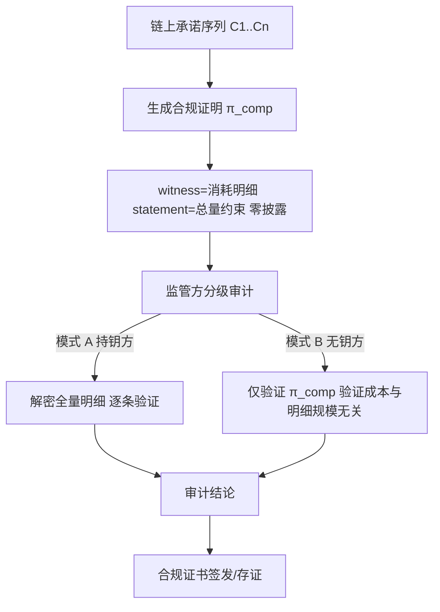
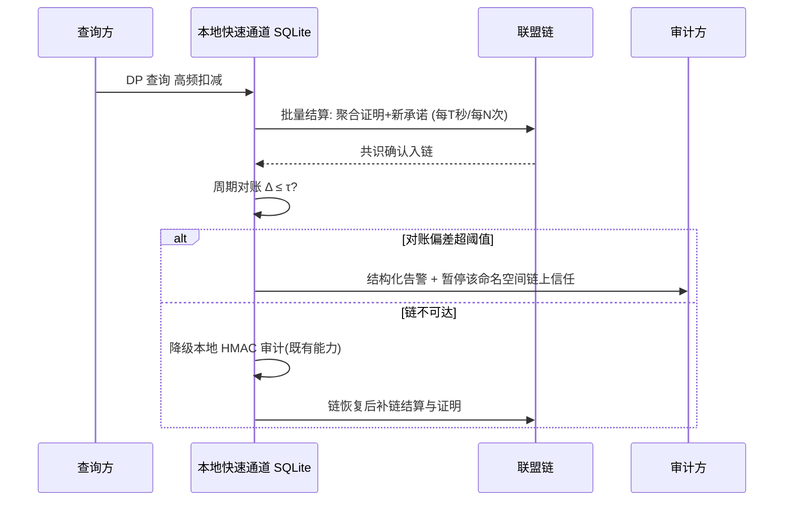
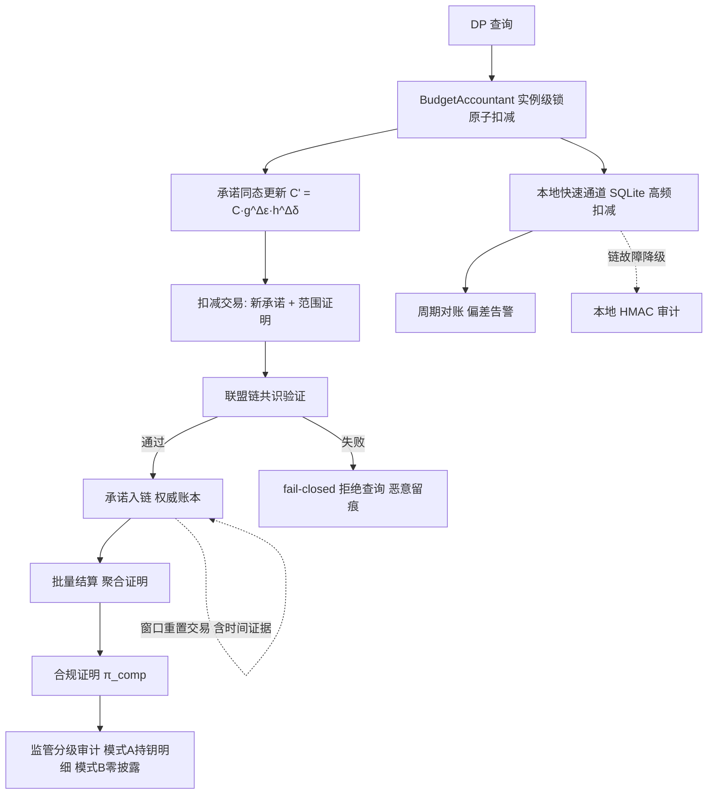

# 发明专利申请书

## 发明名称

**基于区块链与零知识证明的差分隐私预算链上记账与合规证明方法、系统及存储介质**

## 申请信息（拟）

| 项目 | 内容 |
|---|---|
| 技术领域分类号（建议） | G06F 21/62（数据访问保护）、H04L 9/32（数字认证）、H04L 9/08（密钥分配/区块链） |
| 申请人 | 深圳数联天下智能科技有限公司、柳州市大数据发展局 |
| 发明人 | （待补充） |
| 申请号 / 申请日 | （递交时填写） |
| 代理机构 / 代理人 | （递交时填写） |

---

## 技术领域

本发明涉及隐私计算、数据安全与区块链技术领域，具体涉及一种面向差分隐私（Differential Privacy, DP）查询的隐私预算链上记账方法、基于零知识证明（Zero-Knowledge Proof, ZKP）的预算合规证明方法，以及相应的系统与计算机可读存储介质。

## 背景技术

差分隐私查询的隐私保证强度由隐私预算（ε, δ）约束，预算"记账的可信性"是保证成立的前提：若记账方可以单方面修改已消耗量或伪造审计记录，则对外宣称的隐私保证即失效。现有技术存在以下缺陷：

1. **自证式审计的单点信任**：审计记录采用本地密钥签名的 HMAC 链（如本系列专利 3 所述），密钥由记账方持有——密钥泄露即可伪造任意历史记录；审计方必须持有密钥才能验签，信任模型完全单点化，无法向不信任方自证清白。
2. **共享存储的共谋风险**：多实例一致性依赖共享数据库（如 SQLite），拥有数据库读写权限的运维方可事后回滚预算状态、改写窗口起点，且不留公开痕迹；审计日志与数据库同机存放，可被整体替换。
3. **合规审计泄露业务隐私**：向监管方证明"预算未被超限消耗"通常需提交全量审计日志，日志中的查询时间戳与消耗序列可被反推查询频率与业务节奏，属于竞争敏感信息；"证明合规"与"保守业务秘密"无法兼得。
4. **窗口重置不可公开验证**：预算重置规则在本地数据库内执行，重置动作缺乏公开、可审计、多方可独立验证的记录载体，多实例间的重置边界仅能依赖共享存储的自律。
5. **跨机构场景互不信任**：医疗健康数据联盟中，各机构自报"预算已消耗量"缺乏可被全体成员独立验证的机制，联盟层面的累计隐私保证无法成立。

## 发明内容

### 一、要解决的技术问题

本发明旨在解决：（1）预算记账与审计的信任单点化问题；（2）共享存储共谋篡改问题；（3）合规审计与业务隐私的矛盾问题；（4）窗口重置的公开可验证问题；（5）跨机构联盟场景下的互信记账问题。

### 二、技术方案

本发明提供一种基于区块链与零知识证明的差分隐私预算链上记账方法，包括：

**（一）预算状态承诺与链上锚定。**
预算会计对命名空间维护状态 \(S = (\varepsilon_s, \delta_s, start, window, \varepsilon_t, \delta_t)\)，其中 \((\varepsilon_s, \delta_s)\) 为累计已消耗量、\(start\) 为窗口起点、\(window\) 为重置窗口长度、\((\varepsilon_t, \delta_t)\) 为预算总量。每次扣减后计算状态承诺 \(C\) 并随扣减交易提交联盟链：

\[
C = g^{\varepsilon_s} \cdot h^{\delta_s} \cdot u^{start} \tag{1}
\]

其中 \(g, h, u\) 为公开的群生成元（Pedersen 向量承诺）。承诺具有**加法同态性**：单次扣减 \((\Delta\varepsilon, \Delta\delta)\) 后，新承诺按式 (2) 由旧承诺与扣减量的承诺相乘得到，全程无需披露任何具体数值：

\[
C' = C \cdot g^{\Delta\varepsilon} \cdot h^{\Delta\delta} \tag{2}
\]

链上仅保存承诺序列与扣减交易摘要；共识确认后，链上承诺即成为预算状态的权威快照，任何单一实例或运维方均无法单方面修改历史状态。

**（二）链上原子扣减与范围证明。**
扣减交易携带新承诺 \(C'\) 及范围证明，共识节点在不获取具体数值的前提下验证：更新后的已消耗量非负、且不超过预算总量。采用对数大小的范围证明（如 Bulletproofs）完成验证：

\[
Verify_{range}\left(C', \varepsilon_t, \delta_t\right) = 1 \iff 0 \le \varepsilon_s' \le \varepsilon_t \wedge 0 \le \delta_s' \le \delta_t \tag{3}
\]

验证失败则交易不入链、对应查询被拒绝（fail-closed）；验证通过后新承诺生效，实例本地同步更新快速通道状态。恶意超限提交本身留痕，且不阻塞其他命名空间的正常记账。

**（三）零知识合规证明（对外审计）。**
面向不持有记账密钥的外部监管方，生成合规证明 \(\pi_{comp}\)，证明如下关系而不披露任何一次查询的消耗明细：

\[
R_{comp} = \left\{ (C, \varepsilon_t, \delta_t) : \exists\, \varepsilon_s, \delta_s,\ \varepsilon_s \le \varepsilon_t \wedge \delta_s \le \delta_t \wedge C = g^{\varepsilon_s} h^{\delta_s} \right\} \tag{4}
\]

支持**分级审计**两种模式：模式 A（持钥方）解密并验证全量明细；模式 B（无钥方）仅验证合规证明，验证计算与明细规模无关。两种模式独立可用，审计结论均可签发合规证书。

**（四）递归证明聚合。**
对长期运行的连续扣减（每轮一个合规证明 \(\pi_i\)），采用递归证明将历史证明聚合成单条证明：

\[
\pi_{1..N} = RecAgg\left( \pi_{1..N-1},\ \pi_N \right) \tag{5}
\]

聚合后单条证明的验证成本与累计查询次数无关（O(1)），适合千万级查询的长期服务；聚合过程离线执行，不影响在线扣减延迟。

**（五）窗口重置上链。**
重置动作以交易提交：交易包含旧窗口起点承诺、新窗口起点承诺与公开时间戳证据；共识节点验证重置条件式 (6) 成立后接受重置交易：

\[
reset \iff now \ge start + window \tag{6}
\]

重置后的状态承诺对全体实例一致生效，并发提交的多个重置交易仅首个通过共识者生效，杜绝多实例双重重置。

**（六）双账本架构与降级。**
本地快速通道（内存/SQLite，保留本系列专利 3 的实例级锁、构造保护与线程级连接复用）承接高频扣减；链上账本按批量结算：每 \(T\) 秒或每 \(N\) 次扣减，将期间的扣减聚合为一个递归证明与状态承诺上链。周期对账按式 (7) 校验：

\[
\Delta = \left| \varepsilon_s^{chain} - \varepsilon_s^{local} \right| \le \tau \tag{7}
\]

偏差超阈值输出结构化告警并暂停该命名空间的链上承诺信任；链不可达时自动降级为本地 HMAC 审计（既有能力），链恢复后补齐结算与证明，期间本地记账不中断。

**（七）与既有体系集成。**
预算注册表（BudgetRegistry）增加链上适配层：`get_or_create` 获取语义、构造保护（`__new__` 禁止直接构造、`__init__` 空操作）、实例级锁与 SQLite 线程级连接复用全部保持；BudgetAuditLogger 增加"链上账本端点"作为与本地日志并行的审计通道；RDP 会计挂接结果作为消耗量来源之一参与承诺更新。

本发明还提供实现上述方法的预算记账系统与计算机可读存储介质。

### 三、有益效果

1. **信任去单点化**：共识记账取代单点密钥自证，任何实例或运维方无法独立篡改历史预算状态，审计方无需信任记账方。
2. **合规零披露**：零知识证明使"可证明合规"与"保守业务隐私"兼得——监管验证不再以披露查询消耗明细为代价。
3. **验证成本恒定**：递归证明使长期运行服务的审计验证成本与累计查询次数无关。
4. **平滑升级兼容**：快速通道 + 链上结算双账本，现有 SQLite/HMAC 能力可无中断演进，链故障自动降级。
5. **联盟互信**：医疗数据联盟中各机构预算消耗可被全体成员独立公开验证，联盟累计隐私保证得以成立。

### 四、与现有技术的对比

| 对比维度 | 最接近现有技术 | 本发明区别特征 | 带来的技术效果 |
|---|---|---|---|
| 记账信任模型 | 单点密钥 HMAC 自证式审计（本系列专利 3） | 联盟链共识记账 + Pedersen 加法同态承诺 | 任一实例或运维方无法独立篡改历史预算状态，审计无需信任记账方 |
| 合规审计 | 提交全量明文日志，泄露查询频率与业务节奏 | 零知识合规证明，消耗明细作 witness 零披露 | 证明合规与保守业务隐私兼得 |
| 审计验证成本 | 随累计查询次数线性增长 O(N) | 递归证明聚合，单条证明 O(1) 验证 | 千万级查询长期服务的审计验证成本恒定 |
| 窗口重置 | 本地数据库自律执行，不可公开验证 | 重置交易含时间戳证据上链，共识校验 | 杜绝多实例双重重置，重置边界公开可验证 |
| 可用性 | 引入链依赖后记账可用性受限 | 快速通道 + 链上结算双账本，链故障自动降级 HMAC | 既有能力无中断演进，链不可达不阻塞记账 |

### 五、密码学协议、双账本一致性与合规验证

**（一）创新点强化**

1. 将 epsilon、delta、窗口编号、累计消耗和策略版本编码进同一承诺状态，并用零知识约束证明每次更新的合法性，而非仅把日志写入区块链。
2. 以本地高频账本和链上权威账本组成带 fencing 的双账本：链不可达时只能在预授权额度内运行，恢复后按序补链，防止离线期间无限超扣。
3. 将范围证明、窗口重置证明和策略合规证明绑定到同一前置状态哈希，避免证明来自不同窗口或不同规则版本。
4. 通过分级审计仅公开合规事实或承诺，不要求监管方获得医疗查询明细。

**（二）承诺与证明约束**

对非负定点整数 `E、D` 使用固定精度编码，承诺为 `C=g^E h^r`（实际系统为每个状态字段使用独立生成元或向量承诺）；随机盲因子 `r` 永不复用并通过密钥管理服务保存。交易同时证明：`E_new=E_old+ΔE`、`D_new=D_old+ΔD`、`0≤E_new≤E_limit`、`0≤D_new≤D_limit`、`window_new` 与时间状态机一致，以及 `policy_hash` 与查询策略一致。

证明电路的公开输入至少包含前后状态承诺、窗口编号、策略摘要和交易序号；私有输入包含旧值、增量和盲因子。任何定点溢出、delta 格式不合法、窗口回退或重复交易均验证失败。递归聚合只在具体证明系统支持递归验证时启用，不将验证复杂度笼统表述为必然 O(1)，而以电路、递归层数和实测数据限定。

**（三）双账本状态机与降级规则**

本地账本为每个 namespace 分配单调 `lease_id、local_seq、reserved_limit`，离线扣减不得超过已获链上确认的预授权额度；每条本地记录保存前置哈希。链恢复后按 `local_seq` 批量提交，链上只接受连续序列和匹配前置承诺，冲突进入冻结队列，不自动覆盖。对账偏差、证明失败或预授权耗尽时立即 fail-closed，保留异常证据并要求人工/治理节点处理。

**（四）验证指标与从属保护点**

应补充定点编码边界、盲因子随机性、重复交易、链分叉、节点重放、长时间离线、递归证明失败和密钥轮换测试，测量证明拒绝率、离线超额扣减次数、补链顺序错误数、验证时间、链上字节成本及状态恢复偏差。可从属限定：向量承诺字段独立生成元、交易序列 fencing、预授权额度、证明版本撤销、分级监管验证和链上/本地审计摘要对账。

## 术语与符号说明

| 术语/符号 | 含义 |
|---|---|
| 状态承诺 C | 对预算状态（已消耗量、窗口起点）的 Pedersen 向量承诺 |
| 加法同态 | 承诺满足 C' = C·commit(Δ)，扣减更新无需披露数值 |
| 范围证明 | 证明承诺打开的数值落在合法区间而不披露具体值 |
| Bulletproofs | 证明体积对数值范围的常用范围证明方案 |
| 合规证明 π_comp | 证明累计消耗满足总量约束的零知识证明 |
| 递归证明 RecAgg | 将多轮证明聚合为单条证明，验证成本 O(1) |
| 锚定交易 | 将承诺/凭证摘要写入链上的交易 |
| 双账本 | 本地快速通道（高频）与链上结算账本（权威）并存 |
| 批量结算 | 每 T 秒或每 N 次扣减聚合上链一次 |
| 对账阈值 τ | 快速通道与链上账本允许的偏差上限 |
| 联盟链 | 多机构共同维护共识的许可链 |
| witness / statement | 零知识证明的私有输入 / 公开输入 |
| fail-closed | 链上验证失败不入链并拒绝查询，保证隐私保证不失效 |
| 权威快照 | 共识确认后的链上承诺，作为预算状态的唯一可信状态 |

## 附图说明

- **图 1**：链上预算记账与合规证明总体架构图（DP 查询 → 扣减交易 → 承诺上链 → ZKP 合规证明 → 分级审计）。
- **图 2**：链上原子扣减与承诺更新流程图（范围证明验证分支）。
- **图 3**：零知识合规证明生成与分级审计流程图。
- **图 4**：递归证明聚合与 O(1) 验证示意图。
- **图 5**：双账本（快速通道 + 链上结算）对账与降级时序图。

## 附图详览（图 2 ~ 图 5）

### 图 2：链上原子扣减与承诺更新流程图


```
 DP 查询(Δε, Δδ)
    │
    ▼
 实例级锁: 读取本地状态
    │
    ▼
 C' = C · g^Δε · h^Δδ    (承诺同态更新, 不披露数值)
    │
    ▼
 扣减交易 [C' | 范围证明 RangeProof]
    │
    ▼
 联盟链共识节点验证 (0 ≤ εs' ≤ εt ∧ 0 ≤ δs' ≤ δt)
    │
    ├─ 通过 ─► 新承诺入链 ─► 本地同步 ─► 批量结算缓冲
    │
    └─ 失败 ─► 交易拒绝 + 查询拒绝 (fail-closed)
                    │
                    ▼
              恶意提交留痕, 不阻塞其他命名空间
```

### 图 3：零知识合规证明生成与分级审计流程图



```
 链上承诺序列 C1...Cn
    │
    ▼
 生成合规证明 π_comp
   witness = 消耗明细(私有)
   statement = 总量约束(公开)
    │
    ▼
 监管方审计 ──┬─ 模式A(持钥): 解密明细逐条验证
              └─ 模式B(无钥): 仅验证 π_comp, 零披露
    │
    ▼
 审计结论 → 合规证书签发/存证
```

### 图 4：递归证明聚合与 O(1) 验证示意图

```mermaid
graph TB
    A[扣减1 证明π1] --> P1[聚合 π1..2]
    B[扣减2 证明π2] --> P1
    P1 --> P2[聚合 π1..3]
    C[扣减3 证明π3] --> P2
    P2 --> P3[聚合 π1..N 单条证明]
    D[扣减N 证明πN] --> P3
    P3 --> V[验证成本 O(1) 与累计查询次数无关]
    P3 --> W[聚合过程离线执行 不影响在线扣减延迟]
```

```
 π1 ─┐
     ├─► π1..2 ─┐
 π2 ─┘          ├─► π1..3 ─┐
 π3 ────────────┘          ├─► π1..N ─► 验证 O(1)
 π4 ───────────────────────┘
 ...
 (聚合离线执行, 在线扣减零延迟)
```

### 图 5：双账本对账与降级时序图



```
 查询方         本地快速通道(SQLite)          联盟链          审计方
   │  DP高频扣减 ──►│                          │              │
   │               │ 批量结算(每T秒/N次) ────►│              │
   │               │◄── 共识确认入链 ──────────│              │
   │               │ 周期对账 Δ ≤ τ            │              │
   │               │ 偏差超阈值 ───────────────│──► 告警      │
   │               │ 链不可达: 降级本地HMAC    │              │
   │               │ 链恢复: 补链结算 ────────►│              │
```

## 具体实施方式

**实施例 1：联盟链部署与承诺锚定。**
三家医院与监管方共同维护联盟链。DP 服务启动后经注册表获取命名空间会计实例；首次扣减后计算状态承诺 \(C\) 并随交易上链，共识节点确认后写入链上账本；后续每次扣减按式 (2) 同态更新承诺，本地仅缓存最新承诺快照。

**实施例 2：链上扣减与范围证明。**
请求消耗 (ε=0.1, δ=0)：实例锁内计算新承诺与 Bulletproofs 范围证明，构造交易提交；节点验证"新消耗量 ∈ [0, ε_t]"成立后入链。若某实例恶意提交超限承诺，交易被拒、该实例查询被拒（fail-closed），且恶意尝试本身在链上留痕。

**实施例 3：监管合规证明（分级审计）。**
季度审计时，监管方未持有记账密钥：仅需验证审计期内承诺序列对应的单条聚合合规证明 \(\pi_{comp}\)，确认累计 ε/δ 消耗未超总量、窗口重置均符合规则；全程未接触任何单次查询的时间戳与消耗明细。持钥的监管方仍可选择模式 A 解密全量明细逐条核对。

**实施例 4：窗口重置上链。**
配置 `window=86400` 秒。窗口到期后的首个扣减交易附带旧/新窗口起点承诺与公开时间戳证据，节点验证式 (6) 成立后接受重置；三实例并发提交重置交易时，仅首个通过共识的重置生效，杜绝双重重置。

**实施例 5：递归证明聚合。**
全年累计 1000 万次扣减：每轮扣减生成合规证明，后台递归聚合器逐层聚合（如每 2^10 条聚合一层），最终全年审计仅需验证一条证明，验证耗时与次数无关；聚合器离线运行，不影响在线扣减延迟。

**实施例 6：双账本对账与降级。**
本地 SQLite 承接秒级高频扣减（线程级连接复用）；每 60 秒批量结算一次上链。对账发现 |Δ|>τ 时告警并暂停该命名空间的链上承诺信任；联盟链故障期间自动降级为本地 HMAC 审计（专利 3 既有能力），恢复后补齐结算与证明。

**实施例 7：与既有 BudgetAccountant 集成。**
BudgetRegistry 的 `get_or_create` 语义不变；BudgetAccountant 增加 `chain_adapter` 组件，`spend()` 在本地扣减成功后异步构造链上交易；构造保护（`__new__` 禁止直接构造、`__init__` 空操作）、实例级锁与 SQLite 线程级连接复用全部保持；RDP 会计挂接的组合消耗结果作为承诺更新输入之一。

**实施例 8：关键参数配置表。**

| 参数 | 默认值 | 说明 |
|---|---|---|
| `PRIVACY_BUDGET_CHAIN_ENABLED` | false | 链上记账总开关 |
| `PRIVACY_BUDGET_CHAIN_ENDPOINTS` | 空 | 联盟链节点地址列表 |
| `PRIVACY_BUDGET_SETTLE_SECONDS` | 60 | 批量结算周期 T |
| `PRIVACY_BUDGET_SETTLE_BATCH` | 1000 | 批量结算条数 N（T/N 先到先触发） |
| `PRIVACY_BUDGET_RECONCILE_TOLERANCE` | 1e-6 | 对账阈值 τ |
| `PRIVACY_BUDGET_CHAIN_FALLBACK` | true | 链不可达时降级本地 HMAC 审计 |

## 权利要求书

1. 一种基于区块链与零知识证明的差分隐私预算链上记账方法，其特征在于，包括：
   对预算状态计算具有加法同态性的状态承诺，所述状态承诺隐藏已消耗预算的具体数值；
   每次预算扣减后基于同态性质由旧承诺与扣减量承诺更新出新承诺，并将新承诺连同扣减交易提交至区块链，经共识节点验证后入链；
   以链上承诺序列作为预算状态的权威记录，任一记账实例无法单方面修改历史预算状态。

2. 根据权利要求 1 所述的方法，其特征在于，所述验证包括范围证明验证：共识节点在不获取具体数值的情况下证明更新后的已消耗量非负且不超过预算总量，验证失败时交易不入链且拒绝查询。

3. 根据权利要求 1 所述的方法，其特征在于，还包括零知识合规证明步骤：向不持有记账密钥的审计方生成合规证明，证明累计已消耗量满足总量约束且承诺正确打开，且证明过程不披露任何单次查询的消耗明细。

4. 根据权利要求 3 所述的方法，其特征在于，还包括分级审计步骤：持密钥审计方解密验证全量明细，无密钥审计方仅验证合规证明，两种模式相互独立。

5. 根据权利要求 3 所述的方法，其特征在于，还包括递归证明聚合步骤：对多轮扣减产生的合规证明进行递归聚合，聚合后的单条证明验证成本与累计扣减次数无关。

6. 根据权利要求 1 所述的方法，其特征在于，还包括窗口重置上链步骤：窗口重置以交易形式提交，交易包含旧窗口起点承诺、新窗口起点承诺与公开时间戳证据，共识节点验证当前时间超出窗口起点加窗口长度后接受重置，重置后的状态承诺对全部实例一致生效。

7. 根据权利要求 1 所述的方法，其特征在于，还包括双账本步骤：本地快速通道承接高频扣减，按预设周期或预设条数将期间扣减聚合为批量结算交易上链；周期对账校验本地状态与链上承诺的偏差，偏差超阈值输出告警。

8. 根据权利要求 7 所述的方法，其特征在于，区块链不可达时自动降级为本地密钥签名审计，区块链恢复后补齐批量结算与证明，期间本地记账不中断。

9. 根据权利要求 7 所述的方法，其特征在于，所述批量结算将期间扣减聚合为单个递归证明与单个状态承诺，减少链上交易数量。

10. 根据权利要求 1 所述的方法，其特征在于，所述状态承诺采用 Pedersen 向量承诺，承诺生成元为公开群元素，扣减量承诺与状态承诺相乘即得新承诺。

11. 根据权利要求 1 所述的方法，其特征在于，预算会计实例的获取与创建语义、实例级锁、构造保护与线程级数据库连接复用保持既有实现，链上记账以适配层方式接入。

12. 根据权利要求 1 所述的方法，其特征在于，链上记录与合规证明均不包含噪声尺度与置信区间等由数据推断的元数据，延续元数据侧信道防护。

13. 根据权利要求 1 所述的方法，其特征在于，恶意或超限的扣减交易被拒绝并留痕，拒绝行为不阻塞其他命名空间的正常记账。

14. 一种基于区块链与零知识证明的差分隐私预算链上记账系统，其特征在于，包括：承诺计算模块、链上交易模块、范围证明验证模块、合规证明生成模块、递归聚合模块与双账本对账模块，各模块协同执行权利要求 1 至 13 任一项所述的方法。

15. 一种计算机可读存储介质，其上存储有计算机程序，其特征在于，所述计算机程序被处理器执行时实现权利要求 1 至 13 任一项所述的方法。

16. 一种电子设备，其特征在于，包括处理器以及存储有计算机程序的存储器，所述计算机程序被所述处理器执行时实现权利要求 1 至 13 任一项所述的方法。

## 摘要

本发明公开了一种基于区块链与零知识证明的差分隐私预算链上记账与合规证明方法、系统及存储介质。该方法对预算状态计算具有加法同态性的 Pedersen 向量承诺，每次扣减以承诺同态更新并随扣减交易上链，共识节点经范围证明验证累计消耗非负且不超总量，验证失败不入链并拒绝查询，实现预算记账的共识化与信任去单点化；面向不持密钥的监管方生成零知识合规证明，在不披露任何单次查询消耗明细的前提下证明预算合规，并支持递归证明聚合使审计验证成本与查询次数无关；窗口重置以含时间证据的交易上链，杜绝多实例双重重置；本地快速通道与链上结算双账本并存，偏差对账告警、链故障自动降级为本地审计。本发明使差分隐私预算的记账与审计在跨机构场景下可被公开独立验证。

## 摘要附图（图 1：链上预算记账与合规证明总体架构图）

### Mermaid 版本



### ASCII 版本

```
 DP 查询 ──► BudgetAccountant (实例级锁原子扣减)
                  │
                  ▼
      承诺同态更新 C' = C · g^Δε · h^Δδ   (不披露数值)
                  │
                  ▼
      扣减交易 [C' | 范围证明] ──► 联盟链共识验证
                                      │
                          ┌─ 通过 ────┴──── 失败 ─┐
                          ▼                      ▼
                    承诺入链(权威账本)      fail-closed 拒绝查询
                          │                  恶意提交留痕
                          ▼
               批量结算: 递归聚合证明
                          │
                          ▼
               合规证明 π_comp ──► 监管分级审计
                                      ├─ 模式A: 持钥解密全量明细
                                      └─ 模式B: 无钥零披露验证
   本地快速通道(SQLite 高频扣减) ── 周期对账 ── 链上承诺
                        │                (偏差超阈值告警)
                        链故障 ──► 降级本地 HMAC 审计
                        链恢复 ──► 补链结算与证明
```
