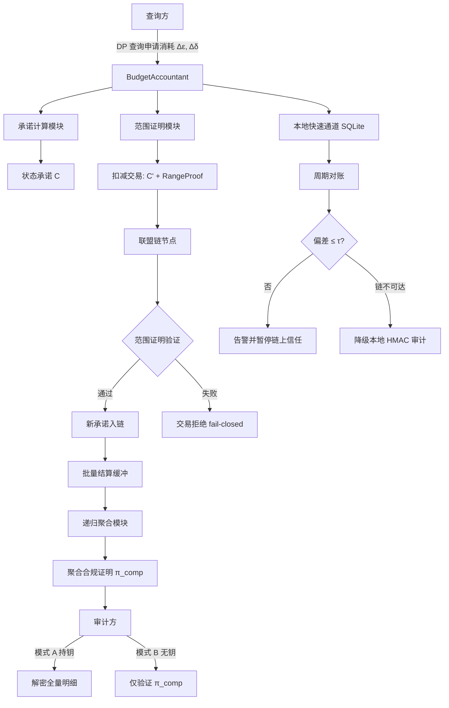
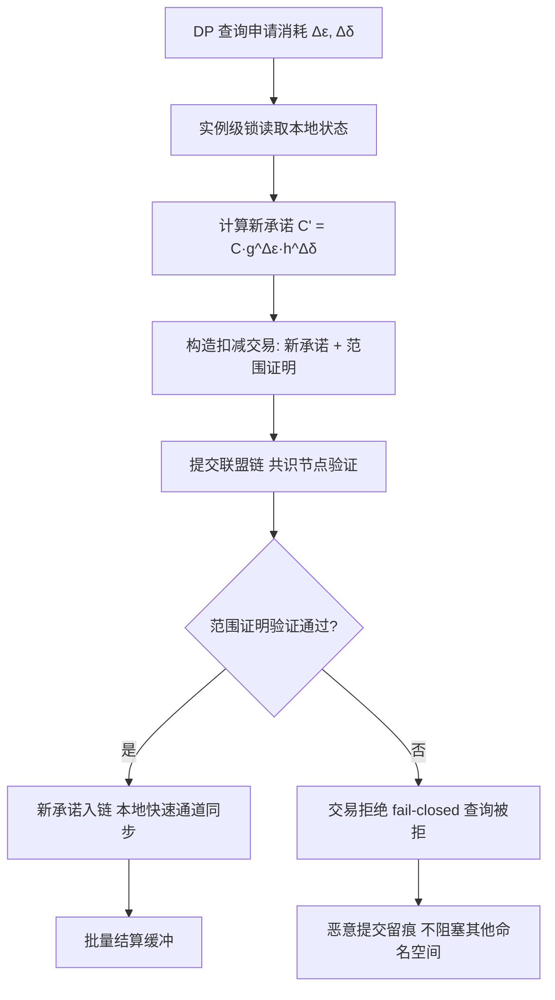
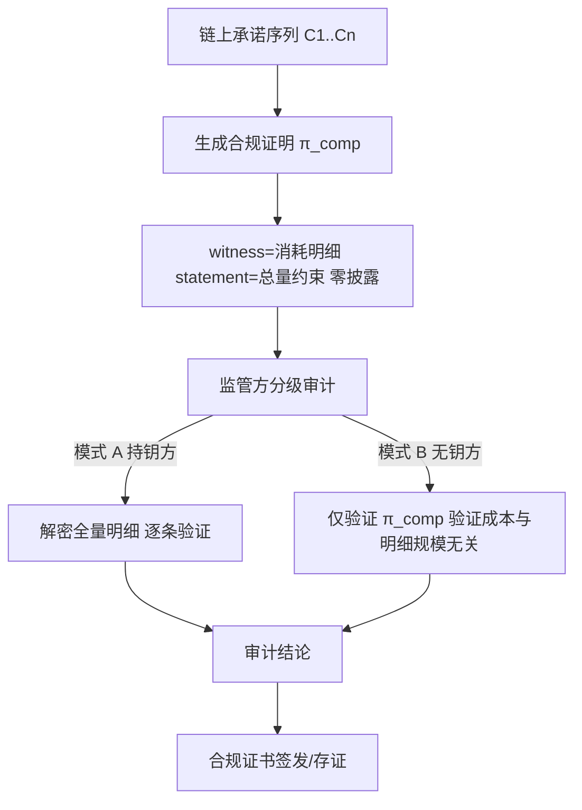
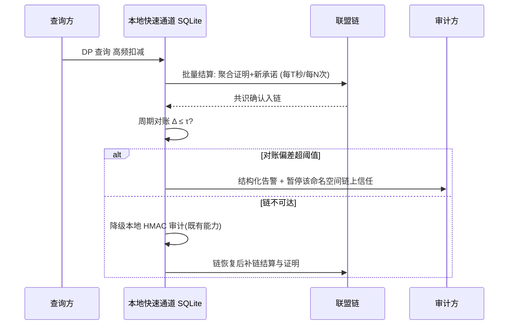

|                                  |
|:--------------------------------:|
| **深圳数联天下智能科技有限公司** |
|      **专利技术交底书模板**      |

编号：HZL-02-R01 版本号：2022

**专利申请用技术交底书模板**

***以下带 \* 信息务必填写，涉及奖金的发放*，谢谢！~**

交底书名称：基于区块链与零知识证明的差分隐私预算链上记账与合规证明方法

\*\*发明人姓名：陈少伟

\*\*第一发明人姓名和身份证号码：陈少伟

申请人：深圳数联天下智能科技有限公司

通信地址（邮编）：

\*\*交底书撰写人：陈少伟

\*\*联系电话：

\*\*Email：

**交底技术书信息登记页**

***以下带 \* 信息务必填写，方便进行知识产权维护***

\*\*提交部门：

\*\*项目号：

\*\*项目名称/所属产品(可多个，靠近公司的主营业务)：隐私本地代理（Privacy Local Agent）

\*\*技术应用领域：数据安全、隐私计算、医疗健康数据联盟、区块链

\*\*相关技术方向：差分隐私、零知识证明、联盟链、隐私预算管理、同态承诺

\*\*技术方案概述：
本发明公开一种基于区块链与零知识证明的差分隐私预算链上记账与合规证明方法、系统及存储介质。该方法对差分隐私（Differential Privacy, DP）预算状态构造具有加法同态性的佩德森向量承诺（Pedersen Vector Commitment），每次扣减基于同态性质更新承诺并随扣减交易提交联盟链，由共识节点通过范围证明（Range Proof）在不披露具体消耗数值的前提下验证累计消耗非负且不超预算总量；向不持有记账密钥的外部监管方生成零知识合规证明（Zero-Knowledge Compliance Proof），证明预算状态满足总量约束而不泄露任何单次查询明细；支持递归证明聚合（Recursive Proof Aggregation）使长期审计验证成本与累计查询次数无关；窗口重置以含时间证据的交易上链，由共识机制保证多实例重置边界一致；本地快速通道与链上结算组成双账本架构，周期对账并在链故障时降级为本地审计。本发明解决了差分隐私预算记账中的单点信任、共享存储共谋、合规审计泄露业务隐私、窗口重置不可公开验证以及跨机构互不信任问题。

**交底书注意事项：**

1.  代理人并不是技术专家，交底书要使代理人能看懂，尤其是背景技术和详细技术方案，一定要写得全面、清楚。

2.  英文缩写要提供中文译文及英文全拼，避免只使用英文单词。

3.  全文对同一事物的叫法应统一，避免出现一种东西多种叫法。

4.  和代理人沟通时，对于代理人的疑问请认真讲解，要求补充的材料应及时补充。

5.  专利法规定：

&nbsp;

1.  专利必须是一个技术方案，应该阐述发明目的是通过什么技术方案来实现的，不能只有原理，也不能只做功能介绍；

2.  专利必须充分公开，以本领域技术人员不需付出创造性劳动即可实现为准。

对申请人来说，必须满足上述规定，专利才能批准；但为了不让竞争对手完全掌握该项技术，在满足上述规定的前提下，可以在一些细节上做一些加工，如隐藏，或别的实现方式。

**缩略语和关键术语定义列表（交底书中如有的话，请说明）**

1.  **DP（Differential Privacy，差分隐私）**：一种严格的数学隐私保护框架，通过向查询结果注入随机噪声，使得单条数据的存在与否难以被推断。隐私预算（Privacy Budget）ε 与 δ 定量刻画隐私保护强度。

2.  **ZKP（Zero-Knowledge Proof，零知识证明）**：一种密码学协议，允许证明者向验证者证明某个陈述为真，而无需披露除该陈述真假之外的任何私有信息。

3.  **Pedersen 向量承诺（Pedersen Vector Commitment）**：基于离散对数困难假设的承诺方案，具有加法同态性（Additive Homomorphism），即两个承诺的乘积对应于被承诺值之和的承诺，且隐藏被承诺的具体数值。

4.  **范围证明（Range Proof）**：零知识证明的一种，用于证明某个被承诺的数值落在指定区间内（例如非负且不超过预算上限），而不泄露该数值本身。

5.  **Bulletproofs（防弹证明）**：一种对数大小、无需可信设置的范围证明方案，适合在区块链等带宽受限环境中验证承诺数值的范围约束。

6.  **RDP（Renyi Differential Privacy，瑞尼差分隐私）**：差分隐私的一种变体，使用瑞尼散度（Renyi Divergence）刻画隐私损失，可转换为（ε, δ）-DP 进行组合分析。

7.  **HMAC（Hash-based Message Authentication Code，基于哈希的消息认证码）**：使用哈希函数和密钥生成的消息认证码，用于验证消息完整性和真实性。

8.  **联盟链（Consortium Blockchain）**：由多个预先授权的机构共同维护、采用共识机制达成一致的部分去中心化区块链，兼具可审计性与可控准入特性。

9.  **命名空间（Namespace）**：预算会计中的逻辑隔离单元，不同命名空间拥有独立的预算总量、窗口策略与消耗状态。

10. **fail-closed（失效关闭/安全失败）**：当安全条件验证失败时，系统拒绝执行目标操作而非降级放行，以防止隐私保证失效。

11. **witness/statement（见证/陈述）**：在零知识证明中，witness 是证明者持有的私有输入，statement 是公开输入与待验证的断言。

**交底书撰写说明：由交底书撰写人在以下各部分用黑色字体，按标题下提示的相关要求书写即可。（交底书撰写完成后，请删除各部分蓝红色字体的提示内容！）**

1.  **相关技术背景（背景技术），与本发明最相近似的现有实现方案（现有技术）**

1.1 背景技术

差分隐私（Differential Privacy, DP）通过在查询结果或模型参数中注入可控随机噪声，为个体数据提供可量化的隐私保证。其隐私保证强度由隐私预算（Privacy Budget）参数（ε, δ）约束，其中 ε 控制隐私损失的上界，δ 表示允许的小概率失败。隐私预算的管理通常采用预算会计（Budget Accountant）机制：系统为每个命名空间（Namespace）维护一个累计已消耗预算量，每次查询前申请消耗（Δε, Δδ），若累计消耗加上本次申请不超过预算总量则批准执行，否则拒绝查询。

隐私预算记账的可信性是差分隐私保证成立的前提。一旦记账方能够单方面修改已消耗量、伪造审计记录或篡改窗口起点，即使算法本身满足 DP，对外宣称的隐私保证也将失效。因此，预算会计不仅需要精确计算每次查询的隐私损失，还必须保证消耗记录不可伪造、不可回滚、可被独立验证。

在单机或小规模部署中，预算状态通常保存在内存或本地 SQLite 数据库中，并通过实例级锁保证并发扣减的原子性；在需要审计追踪的场景中，部分方案采用基于密钥的 HMAC 链对审计日志进行签名。然而，上述方案均建立在记账方可信的基础之上，难以满足跨机构数据联盟、外部监管审计以及高可信生产环境的需求。区块链（Blockchain）技术提供了多方共同维护、不可篡改、可公开验证的分布式账本；零知识证明（Zero-Knowledge Proof, ZKP）技术允许在不泄露隐私数据的前提下验证计算正确性。将二者结合用于隐私预算记账，可以从密码学和共识机制两个层面提升预算状态的可信度与可审计性。

1.2 与本发明相关的现有技术一

1.2.1 现有技术一的技术方案

现有技术一为本地 SQLite 数据库结合 HMAC 签名链的预算审计方案，也是本系列专利 3 所采用的实现方式。其技术方案如下：

预算会计（BudgetAccountant）为每个命名空间维护状态 S=(ε_s, δ_s, start, window, ε_t, δ_t)，其中 (ε_s, δ_s) 为累计已消耗量，start 为窗口起点，window 为重置窗口长度，(ε_t, δ_t) 为预算总量。状态存储于本地 SQLite 数据库中，通过实例级锁保证并发扣减的原子性；数据库连接按线程复用，避免连接泄漏。每次扣减成功后，BudgetAuditLogger 生成一条审计日志，记录本次扣减的命名空间、时间戳、消耗量、剩余预算及操作结果。审计日志采用 HMAC（Hash-based Message Authentication Code，基于哈希的消息认证码）链式签名：每条日志附带前一条日志的摘要哈希与当前日志的 HMAC 值，HMAC 密钥由记账方持有。审计方持有相同密钥时可逐条验证日志链的完整性与真实性。窗口重置由 BudgetAccountant 在本地根据当前时间与窗口起点计算，满足 now ≥ start + window 时执行重置，将累计消耗清零并前移窗口起点。

1.2.2 现有技术一的缺点

现有技术一存在以下技术缺陷：

（1）**自证式审计的单点信任问题**：HMAC 密钥由记账方单方面持有，审计方必须持有密钥才能验签。一旦密钥泄露或被滥用，攻击者即可伪造任意历史审计记录；同时，审计方与记账方共享密钥，本质上仍是记账方的自我证明，无法向不持有密钥的外部方自证清白。

（2）**共享存储的共谋与回滚风险**：多实例一致性依赖共享 SQLite 数据库，拥有数据库读写权限的运维方可在事后回滚预算状态、改写窗口起点，且操作不留公开痕迹；审计日志与数据库通常同机存放，存在被整体替换或选择性删除的风险。

（3）**合规审计泄露业务隐私**：向监管方证明"预算未被超限消耗"通常需要提交全量审计日志。日志中的查询时间戳、消耗序列与命名空间信息可被反推查询频率、业务节奏与敏感业务规模，导致"证明合规"与"保守业务秘密"无法兼得。

（4）**窗口重置不可公开验证**：预算重置规则在本地数据库内执行，重置动作缺乏公开、可审计、多方可独立验证的记录载体。在多实例并发场景下，多个实例可能同时触发重置，产生窗口边界不一致或双重重置问题，且只能依赖共享存储的自律进行协调。

（5）**跨机构场景互不信任问题**：在医疗健康数据联盟等多机构协作场景中，各机构自报"预算已消耗量"缺乏可被全体成员独立验证的机制。联盟层面的累计隐私保证无法成立，任一参与方少报、瞒报或篡改均难以被及时发现。

1.3 与本发明相关的现有技术二

1.3.1 现有技术二的技术方案

现有技术二为将审计日志直接写入公有链或联盟链的通用区块链存证方案。其技术方案如下：

每次差分隐私查询执行后，记账方将审计日志（包括命名空间、查询时间戳、消耗量、查询摘要等）以明文或哈希形式打包为交易，提交至区块链网络。区块链共识节点对交易进行排序与打包，生成不可篡改的账本记录。监管方或审计方通过读取链上交易，核对日志内容来验证预算消耗是否合规。部分方案在链上记录预算状态的默克尔根（Merkle Root），通过默克尔证明验证某条日志是否被包含；也有方案采用简单哈希链将多笔审计记录锚定到区块链，以利用区块链的时间戳服务。

1.3.2 现有技术二的缺点

现有技术二存在以下技术缺陷：

（1）**链上明文泄露业务隐私**：若日志以明文上链，则联盟内所有节点均可读取单次查询的消耗明细、时间戳与命名空间信息，严重泄露业务隐私；若仅上链哈希，则监管方仍需依赖链下披露才能验证语义，未从根本上解决"证明合规"与"保守秘密"的矛盾。

（2）**验证成本随查询次数线性增长**：链上存证仅解决了"不可篡改"问题，未解决"高效验证"问题。监管方若要确认累计消耗未超预算，需要遍历并求和链上所有相关交易，验证成本与累计查询次数成正比 O(N)，无法支撑千万级查询的长期服务。

（3）**缺乏密码学约束验证**：普通区块链存证不验证每笔扣减是否满足"非负"与"不超预算总量"等预算规则。记账方仍可提交超限或错误的扣减交易，监管方只能事后发现而无法在交易入链前拒绝。

（4）**未解决窗口重置一致性问题**：通用存证方案未对窗口重置动作设计专门的密码学与共识验证规则，重置边界仍依赖链下协调，多实例双重重置风险依然存在。

（5）**链依赖导致可用性下降**：每笔查询都直接提交链上交易，受区块链出块延迟与吞吐能力限制，高频查询场景下记账延迟显著增加；链不可达时缺乏降级机制，可能导致查询服务中断。

2.  **本发明技术方案的详细阐述（发明内容）**

2.1 本发明所要解决的技术问题（发明目的）

针对现有技术存在的上述缺陷，本发明要解决以下技术问题：

（1）**预算记账与审计的信任单点化问题**：现有 HMAC 自证式审计依赖记账方持有的密钥，审计方与记账方共享信任根。本发明旨在用区块链共识机制取代单点密钥自证，使预算状态成为多方可独立验证的权威记录。

（2）**共享存储的共谋篡改问题**：本地数据库与链下日志可被拥有权限的运维方回滚或替换。本发明旨在将预算状态的权威快照锚定于链上承诺，任何单一实例或运维方均无法单方面修改历史状态。

（3）**合规审计与业务隐私的矛盾问题**：向监管方证明合规通常需要披露全量审计日志。本发明旨在通过零知识证明技术，使监管方能够在不获取单次查询消耗明细的前提下验证预算合规，实现"可证明合规"与"保守业务秘密"的兼得。

（4）**窗口重置的公开可验证问题**：现有方案的窗口重置在本地执行，缺乏公开可验证性。本发明旨在将窗口重置以交易形式提交链上，由共识节点验证重置条件，确保多实例间重置边界一致且不可双重重置。

（5）**跨机构联盟场景下的互信记账问题**：医疗数据联盟中各机构自报预算消耗缺乏独立验证机制。本发明旨在使各机构的预算消耗可被联盟全体成员公开独立验证，从而支撑联盟层面的累计隐私保证。

（6）**审计验证成本随查询次数增长的问题**：长期运行服务产生千万级查询，现有方案验证成本线性增长。本发明旨在通过递归证明聚合，使审计方仅需验证单条聚合证明即可确认长期合规，验证成本与累计查询次数无关。

（7）**链上记账引入的可用性风险**：区块链出块延迟与可达性问题可能影响高频查询。本发明旨在通过本地快速通道与链上结算的双账本架构，在链故障时自动降级，保证本地记账不中断。

2.2 本发明提供的完整技术方案（发明方案）

本发明提供一种基于区块链与零知识证明的差分隐私预算链上记账与合规证明方法，并相应地提供实现该方法的系统与计算机可读存储介质。下面结合系统框图与流程图，对本发明的完整技术方案进行详细说明。

**2.2.1 系统总体架构**

本发明的系统总体架构如图 1 所示，主要包括以下组成部分：

（1）**查询方（Query Client）**：发起差分隐私查询并申请消耗隐私预算。

（2）**BudgetAccountant（预算会计）**：负责维护命名空间级别的预算状态，执行原子扣减，调用链上适配层。

（3）**本地快速通道（Local Fast Lane）**：基于内存或 SQLite 的高频扣减通道，保留实例级锁、构造保护与线程级连接复用。

（4）**承诺计算模块（Commitment Module）**：负责生成与更新 Pedersen 向量承诺。

（5）**范围证明模块（Range Proof Module）**：负责生成与验证扣减交易的范围证明。

（6）**联盟链节点（Consortium Blockchain Nodes）**：负责共识确认、验证链上交易并维护权威账本。

（7）**零知识合规证明模块（ZKP Compliance Module）**：负责生成面向监管方的合规证明。

（8）**递归聚合模块（Recursive Aggregation Module）**：负责将多轮证明递归聚合成单条证明。

（9）**审计方（Auditor）**：对预算状态进行分级审计，可持密钥或不持密钥。



**2.2.2 预算状态承诺与链上锚定**

预算会计对每个命名空间维护状态 S=(ε_s, δ_s, start, window, ε_t, δ_t)，其中 (ε_s, δ_s) 为累计已消耗量，start 为窗口起点，window 为重置窗口长度，(ε_t, δ_t) 为预算总量。每次扣减前，系统读取当前本地状态并计算状态承诺 C：

C = g^{ε_s} · h^{δ_s} · u^{start}            （公式 1）

其中 g、h、u 为公开的群生成元，构成 Pedersen 向量承诺（Pedersen Vector Commitment）。该承诺具有加法同态性（Additive Homomorphism）：单次扣减 (Δε, Δδ) 后，新承诺 C' 由旧承诺 C 与扣减量的承诺相乘得到，全程无需披露任何具体数值：

C' = C · g^{Δε} · h^{Δδ}                   （公式 2）

链上仅保存承诺序列与扣减交易摘要；共识确认后，链上承诺即成为预算状态的权威快照。由于承诺的绑定性与隐藏性，任何单一实例或运维方均无法在不改变承诺的情况下单方面修改历史状态。

**2.2.3 链上原子扣减与范围证明**

每次扣减交易携带新承诺 C' 及范围证明（Range Proof），提交至联盟链。共识节点在不获取具体数值的前提下验证：更新后的已消耗量非负，且不超过预算总量。本发明采用对数大小的范围证明方案 Bulletproofs 完成验证：

Verify_range(C', ε_t, δ_t) = 1 ⟺ 0 ≤ ε_s' ≤ ε_t ∧ 0 ≤ δ_s' ≤ δ_t   （公式 3）

验证失败则交易不入链，对应查询被拒绝（fail-closed）；验证通过后新承诺生效，实例本地同步更新快速通道状态。恶意或超限的提交本身在链上留痕，且不阻塞其他命名空间的正常记账。

图 2 为链上原子扣减与承诺更新流程图。



**2.2.4 零知识合规证明与分级审计**

面向不持有记账密钥的外部监管方，本发明生成零知识合规证明 π_comp，证明如下关系而不披露任何一次查询的消耗明细：

R_comp = {(C, ε_t, δ_t) : ∃ ε_s, δ_s, ε_s ≤ ε_t ∧ δ_s ≤ δ_t ∧ C = g^{ε_s} h^{δ_s}}   （公式 4）

其中 C 与 (ε_t, δ_t) 为公开输入 statement，ε_s、δ_s 及其打开路径为私有输入 witness。

本发明支持分级审计（Tiered Audit）两种模式：

模式 A（持钥方审计）：审计方持有记账密钥，可解密并验证全量明细，执行逐条核对。

模式 B（无钥方审计）：审计方不持有密钥，仅验证合规证明 π_comp，验证计算与明细规模无关。两种模式独立可用，审计结论均可签发合规证书。

图 3 为零知识合规证明生成与分级审计流程图。



**2.2.5 递归证明聚合**

对于长期运行的连续扣减，每轮产生一个合规证明 π_i。本发明采用递归证明聚合（Recursive Proof Aggregation）将历史证明聚合成单条证明：

π_{1..N} = RecAgg(π_{1..N-1}, π_N)           （公式 5）

聚合后单条证明的验证成本与累计查询次数无关，适合千万级查询的长期服务；聚合过程离线执行，不影响在线扣减延迟。递归聚合仅在具体证明系统支持递归验证时启用，并以电路、递归层数和实测数据限定性能边界。

图 4 为递归证明聚合与 O(1) 验证示意图。

```mermaid
graph TB
    A[扣减1 证明π1] --> P1[聚合 π1..2]
    B[扣减2 证明π2] --> P1
    P1 --> P2[聚合 π1..3]
    C[扣减3 证明π3] --> P2
    P2 --> P3[聚合 π1..N 单条证明]
    D[扣减N 证明πN] --> P3
    P3 --> V[验证成本 O(1) 与累计查询次数无关]
    P3 --> W[聚合过程离线执行 不影响在线扣减延迟]
```

**2.2.6 窗口重置上链**

预算重置动作以交易形式提交链上。交易包含旧窗口起点承诺、新窗口起点承诺与公开时间戳证据。共识节点验证重置条件成立后接受重置交易：

reset ⟺ now ≥ start + window               （公式 6）

重置后的状态承诺对全体实例一致生效。并发提交的多个重置交易仅首个通过共识者生效，从而杜绝多实例双重重置。

**2.2.7 双账本架构与降级机制**

本地快速通道（内存/SQLite）承接高频扣减，保留实例级锁、构造保护与线程级连接复用；链上账本按批量结算方式运行：每 T 秒或每 N 次扣减，将期间的扣减聚合为一个递归证明与状态承诺上链。周期对账按如下公式校验本地状态与链上承诺的偏差：

Δ = |ε_s^{chain} - ε_s^{local}| ≤ τ        （公式 7）

其中 τ 为对账阈值。偏差超阈值时输出结构化告警并暂停该命名空间的链上承诺信任；链不可达时自动降级为本地 HMAC 审计，链恢复后补齐结算与证明，期间本地记账不中断。

离线期间，本地账本为每个命名空间分配单调 lease_id、local_seq 与 reserved_limit，离线扣减不得超过已获链上确认的预授权额度；每条本地记录保存前置哈希。链恢复后按 local_seq 批量提交，链上只接受连续序列和匹配前置承诺，冲突进入冻结队列，不自动覆盖。对账偏差、证明失败或预授权耗尽时立即 fail-closed，保留异常证据并要求人工或治理节点处理。

图 5 为双账本对账与降级时序图。



**2.2.8 承诺与证明约束细节**

对非负定点整数 E、D 使用固定精度编码；承诺形式为 C = g^E h^r（实际系统为每个状态字段使用独立生成元或向量承诺）。随机盲因子 r 永不复用并通过密钥管理服务保存。每笔交易同时证明：E_new = E_old + ΔE、D_new = D_old + ΔD、0 ≤ E_new ≤ E_limit、0 ≤ D_new ≤ D_limit、window_new 与时间状态机一致，以及 policy_hash 与查询策略一致。

证明电路的公开输入至少包含前后状态承诺、窗口编号、策略摘要和交易序号；私有输入包含旧值、增量和盲因子。任何定点溢出、delta 格式不合法、窗口回退或重复交易均导致验证失败。

**2.2.9 与既有体系集成**

本发明与既有 BudgetAccountant/BudgetRegistry 体系集成：BudgetRegistry 的 get_or_create 获取语义不变；BudgetAccountant 增加 chain_adapter 组件，spend() 在本地扣减成功后异步构造链上交易；构造保护（__new__ 禁止直接构造、__init__ 空操作）、实例级锁与 SQLite 线程级连接复用全部保持；RDP（Renyi Differential Privacy，瑞尼差分隐私）会计挂接的组合消耗结果作为承诺更新输入之一。链上记录与合规证明均不包含噪声尺度与置信区间等由数据推断的元数据，延续元数据侧信道防护。

2.3 本发明技术方案带来的有益效果

（1）**信任去单点化**：联盟链共识记账取代单点密钥自证，任何实例或运维方无法独立篡改历史预算状态，审计方无需信任记账方即可独立验证。

（2）**合规零披露**：零知识证明使"可证明合规"与"保守业务隐私"兼得——监管验证不再以披露查询消耗明细、时间戳与业务节奏为代价。

（3）**验证成本恒定**：递归证明聚合使长期运行服务的审计验证成本与累计查询次数无关，适合千万级查询场景。

（4）**窗口重置公开可验证**：窗口重置以含时间证据的交易上链，由共识节点验证，杜绝多实例双重重置，重置边界可被联盟全体成员独立验证。

（5）**联盟互信**：医疗数据联盟中各机构预算消耗可被全体成员独立公开验证，联盟层面的累计隐私保证得以成立。

（6）**平滑升级与可用性保障**：快速通道与链上结算双账本并存，现有 SQLite/HMAC 能力可无中断演进；链故障时自动降级，恢复后补链，期间本地记账不中断。

（7）**密码学强约束**：范围证明、窗口重置证明和策略合规证明绑定到同一前置状态哈希，任何定点溢出、窗口回退、重复交易或策略版本不一致均验证失败，提升系统安全性。

3.  **针对2中的技术方案，是否还有别的替代方案同样能完成发明目的**

存在以下替代方案，同样可以完成本发明的发明目的：

（1）**承诺方案替代**：状态承诺可使用 KZG 多项式承诺（KZG Polynomial Commitment）、基于椭圆曲线的向量承诺或其他满足加法同态或更新可验证性质的承诺方案，替代 Pedersen 向量承诺。KZG 承诺具有常数大小打开证明，但依赖可信设置；Pedersen 承诺无需可信设置。根据信任假设与性能需求可选择不同方案。

（2）**范围证明方案替代**：范围证明可使用 zk-SNARKs、zk-STARKs、Ligero、Groth16 等零知识证明系统替代 Bulletproofs。zk-SNARKs 证明体积更小但依赖可信设置；zk-STARKs 无需可信设置且量子抗性更强但证明体积较大。选择依据为证明大小、验证时间、是否需要可信设置及链上字节成本。

（3）**区块链类型替代**：联盟链可替换为公有链、侧链或基于 BFT（Byzantine Fault Tolerant，拜占庭容错）共识的许可链。联盟链适用于多机构可控准入场景；公有链适用于更高去中心化需求，但成本与延迟更高。

（4）**双账本结算策略替代**：批量结算周期 T 与批量条数 N 可根据业务负载动态调整，例如基于负载自适应的滑动窗口结算、基于gas成本优化的批量策略等；对账阈值 τ 也可根据定点精度与业务容忍度设置。

（5）**分级审计模式替代**：模式 A 与模式 B 可扩展为多级审计，例如部分授权审计方仅可查看聚合统计、治理节点可查看异常明细、普通成员仅可验证合规证书。

（6）**降级通道替代**：链不可达时的降级通道除本地 HMAC 审计外，也可采用预授权签名令牌、可信执行环境（TEE, Trusted Execution Environment）本地证明或多签阈值审计等方式，保证离线期间的安全边界。

（7）**递归聚合拓扑替代**：递归证明聚合可采用线性链式聚合、二叉树聚合或批量聚合方案；聚合可在链下由专门聚合器执行，也可由链上合约触发。不同拓扑影响聚合延迟、证明大小与验证复杂度。

4.  **本发明的技术关键点和欲保护点是什么？**

（1）**基于加法同态承诺的差分隐私预算状态链上锚定**：将命名空间级别的预算状态（累计消耗 ε_s、δ_s 及窗口起点 start）编码为 Pedersen 向量承诺，利用同态更新性质在链上维护不可单方面篡改的预算状态快照。

（2）**携带范围证明的链上原子扣减**：每次预算扣减交易附带新承诺与范围证明，共识节点在不披露具体消耗数值的前提下验证扣减后状态非负且不超预算总量，验证失败时拒绝交易并 fail-closed 拒绝对应查询。

（3）**零知识合规证明与分级审计机制**：面向不持密钥的外部监管方生成合规证明，证明累计消耗满足总量约束且承诺正确打开，同时支持持钥方全量审计与无钥方零披露审计两种独立模式。

（4）**递归证明聚合实现 O(1) 审计验证**：对多轮扣减产生的合规证明进行递归聚合，使长期运行场景下的审计验证成本与累计查询次数无关。

（5）**窗口重置上链与共识校验**：将窗口重置作为特殊交易提交联盟链，携带旧/新窗口起点承诺与公开时间戳证据，由共识节点验证重置条件，确保多实例重置边界一致。

（6）**本地快速通道与链上结算的双账本架构**：本地 SQLite/内存通道承接高频扣减，按周期或批量将聚合状态与证明上链，周期对账并在偏差超阈值时告警、链不可达时降级为本地审计。

（7）**离线预授权与 fail-closed 安全边界**：离线扣减受限于已获链上确认的预授权额度，本地记录保存前置哈希与单调序列，链恢复后按序补链；异常情况下立即 fail-closed 并保留证据。

（8）**与既有 BudgetAccountant 的适配集成**：通过 chain_adapter 以适配层方式接入现有预算会计体系，保留 get_or_create 语义、实例级锁、构造保护与线程级连接复用，支持无中断演进。

附件：

1、《专利技术申请自我声明》

2、参考文献（如专利/论文）
