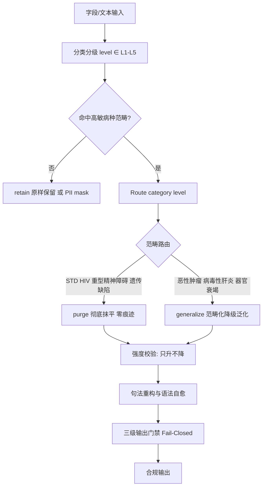
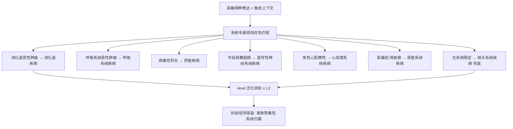
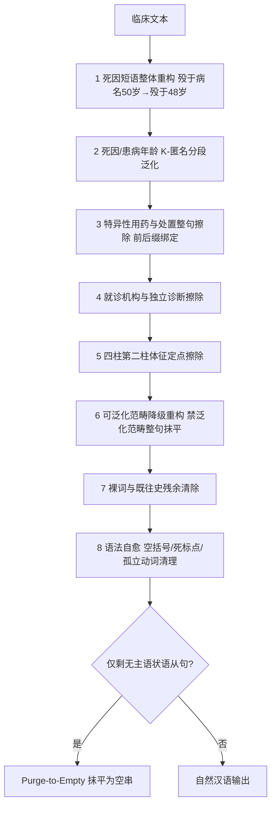
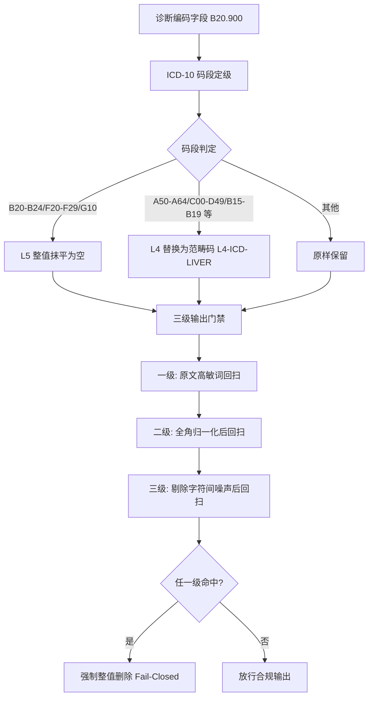
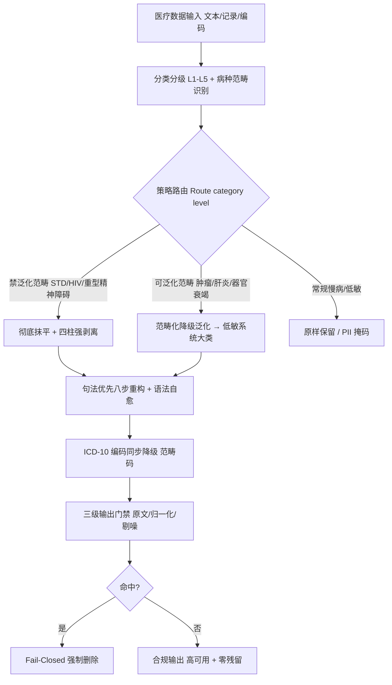

# 发明专利申请书

## 发明名称

**基于范畴化降级泛化与四柱强剥离的高敏医疗数据抹平方法、系统及存储介质**

## 申请信息（拟）

| 项目 | 内容                                                                                    |
|---|-----------------------------------------------------------------------------------------|
| 技术领域分类号（建议） | G06F 21/62（数据访问保护）、G16H 10/60（患者相关记录）、G06F 40/30（自然语言生成/改写） |
| 申请人 | 深圳数联天下智能科技有限公司                                                            |
| 发明人 | 陈少伟                                                                                  |
| 申请号 / 申请日 | （递交时填写）                                                                          |
| 代理机构 / 代理人 | （递交时填写）                                                                          |

---

## 技术领域

本发明涉及医疗数据安全与隐私计算技术领域，具体涉及一种面向高敏感医疗信息的「范畴化降级泛化 + 彻底抹平」差异化脱敏治理方法、基于四柱强剥离与句法优先重构的无痕抹平系统，以及相应的计算机可读存储介质。

## 背景技术

医疗数据（电子病历、医保结算、家族史、检验检查等）包含大量高敏感诊疗信息。现有脱敏技术对该类信息的处置普遍存在两极化缺陷：

1. **全量擦除导致可用性坍塌**：将高敏病种及其上下文整段删除后，家族史、病程演变、用药结构等科研与统计价值随之消失。例如"外婆殁于亨廷顿舞蹈病（50 岁）"被整句删除后，家族遗传聚集性这一核心科研信号完全丢失；大规模执行"一刀切"擦除的数据集在科研场景中几乎不可用。
2. **全量泛化导致残余泄露**：另一极端是将所有敏感词简单替换为占位标签（如 `[L4-HIV-MASKED]`），占位标签本身即暴露"此处存在某类高敏信息"的事实，且标签中常残留敏感词根（如标签含 "HIV" 字样），反而构成侧信道泄露；对极高社会污名化病种（性传播疾病、HIV/AIDS、重型精神障碍）的任何泛化保留都可被上下文推断还原。
3. **上下文反推通道未封堵**：即便病名被擦除，病因（不洁性接触史）、体征（无痛性溃疡）、检查（TPPA/RPR 阳性）、用药（特异性抗逆转录药物）四类强关联特征仍留在文本中，攻击者可据任意单柱特征反推高敏病史，形成"擦病名不擦证据"的泄露面。
4. **机械擦除破坏语言结构并遗留线索**：逐词替换会产生悬空动词、死因介词、空括号、孤立标点等句法残渣（如"因去世"、"母亲患。"），既破坏可读性，又隐含"此处曾存在被删除的高敏内容"的结构性线索。
5. **结构化编码旁路泄露**：诊断名称脱敏后，ICD-10 诊断编码字段（如 B20.900、C34.900、F20.000）仍精确指代高敏病种，构成与文本平行的独立泄露通道，现有方案普遍忽略编码字段的同步降级。
6. **分级与处置策略硬绑定**：现有方案将敏感等级与处置方式一一绑定（如 L4 一律泛化、L5 一律删除），无法表达"同为 L4 级，性病须彻底抹平而肿瘤可降级泛化"的临床差异化需求，也无法在不改代码的前提下随政策调整策略路由。
7. **变体绕过缺乏系统防护**：全角字符（`ＨＩＶ`）、字符间插入噪声（`H I V`、`艾-滋-病`）、拼音变体（`meidu`）等绕过手法可轻易穿透基于精确词表的擦除引擎。

## 发明内容

### 一、要解决的技术问题

本发明旨在解决：（1）高敏信息"全删则不可用、全泛化则泄露"的两难问题；（2）四类关联特征构成的上下文反推通道问题；（3）机械擦除产生的句法残渣与结构性线索问题；（4）ICD-10 编码字段的旁路泄露问题；（5）敏感等级与处置策略硬绑定导致的路由僵化问题；（6）全角/插噪/拼音等变体绕过问题。

### 二、技术方案

本发明提供一种高敏医疗数据抹平与降级治理方法，其核心思想是：**将"数据有多敏感"（分级）与"如何处置"（治理策略）解耦为两个正交维度**，对高敏信息按病种范畴差异化路由——对极高污名化范畴执行零痕迹彻底抹平，对具有科研保留价值的范畴执行**范畴化降级泛化**（重构为低敏的同器官/系统疾病大类而非删除），并以四柱强剥离、句法优先重构、编码同步降级与三级输出门禁构成完整防护闭环。

**（一）分级—策略正交化与四档策略路由。**
定义敏感等级空间 \(L = \{L1, L2, L3, L4, L5\}\) 与治理策略空间：

\[
S = \{retain,\ mask,\ generalize,\ purge\} \tag{1}
\]

策略强度按信息消除程度排序 \(retain < mask < generalize < purge\)。策略路由函数按病种范畴而非仅按等级裁定处置方式：

\[
strategy = Route(category,\ level),\quad strength(strategy) \ge strength(Default(level)) \tag{2}
\]

即：策略允许在等级默认策略之上升级（任意 L4 范畴可升级为彻底抹平），但禁止降级弱化。等级相同（同为 L4）的范畴可路由到不同策略：性传播疾病（STD）、艾滋病/HIV、重型精神障碍路由至 \(purge\)；恶性肿瘤、病毒性肝炎、严重器官损害路由至 \(generalize\)；常规慢病原样 \(retain\)。

**（二）范畴化降级泛化映射。**
对允许泛化的范畴，不删除信息而是将其重构为低敏的同器官/系统疾病大类，形成降级泛化映射：

\[
G: (category,\ context) \rightarrow label,\quad level(label) \le L2 \tag{3}
\]

其中 \(context\) 为触发上下文（如"家族史""聚集倾向"），\(label\) 为泛化目标标签。典型映射：消化道恶性肿瘤 → 消化道疾病；呼吸系统恶性肿瘤 → 呼吸系统疾病；病毒性肝炎 → 肝脏疾病；亨廷顿舞蹈病等遗传缺陷 → 遗传性神经系统疾病；急性心肌梗死 → 心血管系统疾病；尿毒症/肾功能衰竭 → 肾脏系统疾病；无系统限定的恶性肿瘤 → 相关系统疾病（通用兜底）。**泛化顺序约束**：系统专属规则先于通用兜底规则执行，防止"呼吸系统肿瘤"被兜底规则误泛化为其他系统疾病（张冠李戴）。泛化后信息的统计与科研价值（家族聚集性、系统性疾病史）得以保留，而具体高敏病种不可复原。

**（三）四柱强剥离。**
对路由至彻底抹平的范畴，仅擦除病名不足以阻断反推，须全链条擦除四类强关联特征柱：

\[
F = \{f_{病因},\ f_{体征},\ f_{诊断检查},\ f_{用药处置}\} \tag{4}
\]

第一柱（病因/诱因）：不洁性接触史、高危接触史、输血史、特定基因突变；第二柱（现象/体征）：外阴赘生物、无痛性溃疡（硬下疳）、命令性幻听、舞蹈样动作；第三柱（诊断/检查）：醋酸白试验阳性、TPPA/RPR 滴度、CD4+ 计数、病毒载量；第四柱（用药/处置）：特异性抗病毒/抗精神病药物、激光灼除术、抗逆转录治疗方案。四柱特征均以句法正则整块识别与擦除，任意单柱残留即视为剥离失败。

**（四）句法优先的八步重构与语法自愈。**
为防止"先切病名后重构"导致死因动词悬空（如"殁于''"），文本处理严格按**句法优先**的八步编排执行：
1. 死因短语整体重构——"殁于'亨廷顿舞蹈病'(50岁)"整句重构为"殁于 48 岁"（病名剥离的同时对年龄施加 K-匿名分段泛化）；
2. 死因/患病年龄 K-匿名——<60 岁按 3 岁区间（\(age' = age - (age \bmod 3)\)）、≥60 岁按 2 岁区间（\(age' = age - (age \bmod 2)\)）；
3. 特异性用药与处置整句擦除——绑定前缀（口服/给予/启动…）与后缀（抗病毒治疗/控制症状）防裸词误伤；
4. 就诊机构与独立诊断短语整句消除；
5. 四柱第二柱特征体征定点擦除；
6. 综合句法擦除与范畴化降级泛化——可泛化范畴按式 (3) 重构，禁止泛化范畴整句抹平；
7. 裸词与既往史残余清除；
8. 语法自愈与残渣清理——消除空括号、死标点、孤立动词/介词，单字边界保护；对仅剩无主语状语从句的结果执行 Purge-to-Empty（干净抹平为空串）。

**（五）ICD-10 编码同步降级。**
诊断编码字段按 ICD-10 章节码段独立定级并同步降级，封堵结构化旁路：

\[
Redact_{icd}(code) = \begin{cases} \varnothing & code \in R_{L5} \\ [L4\text{-}CATE] & code \in R_{L4} \\ code & otherwise \end{cases} \tag{5}
\]

其中 \(R_{L5}\) 为极高敏码段（B20–B24 HIV、F20–F29 精神分裂症、G10 亨廷顿舞蹈病）整值抹平为空；\(R_{L4}\) 为高敏码段（A50–A64 性病、C00–D49 肿瘤、B15–B19 病毒性肝炎、I21–I22 心肌梗死、N18–N19 肾衰竭、J44 慢阻肺）替换为不含敏感词根的范畴码（如 `[L4-ICD-LIVER]` 而非 `[L4-ICD-HEPATITIS]`，防止范畴标签本身成为新的敏感词触发二次泄露）。

**（六）三级输出门禁（Fail-Closed）。**
脱敏输出在放行前经三级回扫门禁：一级对原文高敏词回扫；二级对全角归一化（全角字母数字 → 半角，保留中文标点）后的文本回扫，捕获 `ＨＩＶ` 变体；三级对剔除字符间噪声（空格/点/连字符/零宽字符）后的文本回扫，捕获 `H I V`、`艾-滋-病` 插噪变体。任一级命中即强制整值删除或占位替换（Fail-Closed），禁止带残输出；门禁同时回扫脱敏过程产生的替换标签本身，防止标签回流。

**（七）抗绕过匹配引擎。**
词库编译为"字符间容许可选分隔符"的正则：普通字符间以有界量词 \(sep\{0,1\}\) 连接（容忍至多一个分隔符，匹配复杂度保持线性，杜绝 ReDoS）；词项自带空白编译为 \(\backslash s*\)（兼容"CD4+ T细胞"与"CD4+T细胞"双写法）；ASCII 词项首尾附加零宽词边界断言 \(?<![A-Za-z0-9]\) 与 \(?![A-Za-z0-9]\)，防止 "archive" 中的 "hiv"、"hearing aids" 中的 "aids" 等良性英文子串被整值门禁误抹（可用性事故防护）；长词优先排序保证复合词不被子词抢先截断。超长文本（超阈值）降级为纯词库擦除路径，切断句法正则在恶意输入上的灾难性回溯攻击面。

**（八）声明式策略配置与热重载。**
抹平/泛化的范畴路由经声明式配置（YAML `redaction_strategy` 节）管理：`purge_categories`（彻底抹平范畴）、`generalization_categories`（范畴化泛化范畴）、`replacement_labels`（范畴名 → 抽象替换标签映射）三节完整描述治理策略；配置加载校验范畴合法性与 purge/泛化重叠（重叠时 purge 静默胜出并告警），支持运行时热重载；配置缺失或解析失败时自动回退代码内置默认值，保证零配置可运行。运维人员可在不修改代码的前提下将任意泛化范畴升级为抹平范畴。

本发明还提供实现上述方法的高敏医疗数据抹平系统与计算机可读存储介质。

### 三、有益效果

1. **可用性与安全性的双提升**：范畴化降级泛化使高敏信息的系统归属、家族聚集性等科研信号得以保留（如"消化道恶性肿瘤家族史"→"消化道疾病家族史"），而"一刀切"擦除将丧失全部此类信号；对极高污名化范畴的彻底抹平则保证最敏感信息零残留。
2. **反推通道全封堵**：四柱强剥离使病因、体征、检查、用药四类证据链同步消失，杜绝"擦病名不擦证据"的上下文反推。
3. **零句法残渣**：句法优先的八步编排与语法自愈消除悬空动词、死标点等结构性线索，输出为自然汉语，不再隐含"此处曾删除高敏内容"的信号。
4. **旁路同步封堵**：ICD-10 编码与诊断名称同步降级，且范畴码不含敏感词根，结构化通道不再泄露。
5. **策略可运营**：分级与策略解耦后，策略路由可在声明式配置中热调整（只升不降的安全约束由路由函数强制），政策变化无需改代码。
6. **系统性抗绕过**：全角归一化、插噪容忍、词边界保护与三级门禁联动，变体绕过在输出前被 Fail-Closed 拦截。

### 四、与现有技术的对比

| 对比维度 | 最接近现有技术 | 本发明区别特征 | 带来的技术效果 |
|---|---|---|---|
| 高敏信息处置 | 全量删除或全量占位替换（二选一） | 分级—策略正交化，按病种范畴路由 purge/generalize | 可泛化范畴保留科研价值，禁泛化范畴零残留 |
| 反推防护 | 仅擦除病名关键词 | 四柱（病因/体征/检查/用药）全链条句法剥离 | 任意单柱残留路径被封堵 |
| 擦除后文本质量 | 逐词替换遗留句法残渣与结构线索 | 句法优先八步编排 + 语法自愈 + Purge-to-Empty | 输出自然汉语，无"曾删除"结构性暗示 |
| 编码字段 | 仅脱敏诊断名称，编码原样保留 | ICD-10 码段独立定级，L5 抹平 / L4 范畴码降级 | 结构化旁路被封堵 |
| 策略管理 | 等级与处置硬绑定，改策略需改代码 | YAML 声明式路由 + 热重载 + 只升不降约束 | 策略可运营、可审计、零代码调整 |
| 变体防护 | 精确词表匹配，全角/插噪即绕过 | 字符间分隔符容忍 + 全角归一化 + 三级门禁 Fail-Closed | 变体绕过在输出前被强制拦截 |

### 五、可用性度量与降级安全边界

**（一）创新点强化**

1. 以"范畴 × 上下文"二元组为泛化决策单元（式 (3)），同一病种在不同上下文（家族史 vs 现病史）可路由到不同泛化目标，粒度细于"整字段统一替换"。
2. 泛化目标标签与抹平替换标签统一使用抽象类别码（如 IMMUNODEFICIENCY 替代 HIV_AIDS、ICD_LIVER 替代 ICD_HEPATITIS），从词表层面保证"替换文本本身不含任何高敏词根"，避免替换即泄露。
3. 年龄 K-匿名与死因重构原子绑定：剥离病名的同时对括号内年龄施加分段泛化（<60 岁 3 岁区间、≥60 岁 2 岁区间），防止精确死亡年龄成为准标识符。
4. 枚举型分类字段（科室、医疗类别等封闭枚举）豁免自由文本扫描，防止"皮肤性病科"因含"性病"子串被误改为"皮肤科"的可用性事故。

**（二）可用性度量**

定义脱敏输出的可用性函数 \(U\)，以信息保留维度加权：

\[
U(out) = \sum_i w_i \cdot keep_i(out) \tag{6}
\]

其中 \(keep_i\) 为第 \(i\) 个信息维度（系统归属、家族聚集性、时间间隔、年龄分段、慢病用药结构）的保留指示，\(w_i\) 为场景权重。本发明保证：常规慢病信息 \(retain\) 零篡改（\(U=1\)）；可泛化范畴保留系统级信息；仅禁泛化范畴 \(U \to 0\)。配套质量指标：召回率 ≥ 99.5%、精确率 ≥ 95%、语法完整率 ≥ 99%、误伤率 ≤ 2%、处理延迟 P99 ≤ 100ms。

**（三）降级安全边界**

策略路由的单调性约束（式 (2)）保证配置错误只能使处置"更严格"而不能"更宽松"：purge 与 generalize 范畴重叠时 purge 胜出；未知范畴落入默认抹平词库扫描；门禁任一级失败即整值删除而非放行。脱敏服务不可用时涉敏字段一律拒绝输出（Fail-Closed），禁止降级放行明文。

## 术语与符号说明

| 术语/符号 | 含义 |
|---|---|
| 彻底抹平 (Purge) | 对禁泛化范畴执行整句/整块零痕迹擦除，禁止任何形式的泛化保留 |
| 范畴化降级泛化 (Generalization) | 将高敏病种重构为同器官/系统的低敏（≤L2）疾病大类，保留统计与科研价值 |
| 四柱 (Four Pillars) | 病因/诱因、现象/体征、诊断/检查、用药/处置四类高敏强关联特征 |
| 分级—策略正交 | 敏感等级（L1~L5）与治理策略（retain/mask/generalize/purge）为两个独立维度，不逐条绑定 |
| Route(category, level) | 按病种范畴与等级裁定治理策略的路由函数，策略只可升级不可弱化 |
| G(category, context) | 降级泛化映射函数，输出低敏泛化标签 |
| 句法优先 | 先整句捕获重构（死因/用药/就诊机构），后裸词擦除的八步编排顺序 |
| 语法自愈 | 消除擦除后空括号、死标点、孤立动词/介词的清理流水线 |
| Purge-to-Empty | 对仅剩无主语状语从句的残渣直接抹平为空串 |
| 范畴码 | ICD-10 高敏编码替换后的抽象类别码（不含敏感词根，如 [L4-ICD-LIVER]） |
| 三级输出门禁 | 原文/全角归一化/剔噪三级回扫校验，命中即 Fail-Closed |
| Fail-Closed | 失败即拒绝输出的安全策略，禁止降级放行明文 |
| redaction_strategy | 声明式治理策略配置节（purge_categories / generalization_categories / replacement_labels） |
| U(out) | 脱敏输出可用性度量，按信息维度保留加权 |

## 附图说明

- **图 1**：高敏数据抹平与降级治理总体架构图（分级 → 策略路由 → 四柱剥离/降级泛化 → 语法自愈 → 三级门禁）。
- **图 2**：分级—策略正交化与四档策略路由示意图。
- **图 3**：范畴化降级泛化映射与执行顺序示意图。
- **图 4**：句法优先八步重构与语法自愈流程图。
- **图 5**：ICD-10 编码同步降级与三级输出门禁流程图。

## 附图详览（图 2 ~ 图 5）

### 图 2：分级—策略正交化与四档策略路由示意图



```
 输入 ──► 分级 level ∈ {L1..L5}
             │
             ▼
      命中高敏病种范畴?
        │           │
       否           是
        │           │
        ▼           ▼
  retain / PII mask   Route(category, level)
                        │
          ┌─────────────┴─────────────┐
          ▼                           ▼
  STD/HIV/重型精神障碍/遗传缺陷      恶性肿瘤/病毒性肝炎/器官衰竭
          │                           │
          ▼                           ▼
    purge 彻底抹平              generalize 范畴化降级泛化
    (零痕迹擦除)               (→ 低敏系统疾病大类)
          │                           │
          └─────────────┬─────────────┘
                        ▼
        强度校验: strength(strategy) ≥ Default(level) (只升不降)
                        │
                        ▼
        句法优先重构 + 语法自愈 ──► 三级门禁 Fail-Closed ──► 合规输出
```

### 图 3：范畴化降级泛化映射与执行顺序示意图



```
 高敏病种表达 + 上下文(家族史/聚集倾向)
        │
        ▼
 ① 系统专属规则优先匹配 (防张冠李戴)
   消化道恶性肿瘤 ──► 消化道疾病
   呼吸系统恶性肿瘤 ──► 呼吸系统疾病
   病毒性肝炎 ──► 肝脏疾病
   亨廷顿舞蹈病 ──► 遗传性神经系统疾病
   急性心肌梗死 ──► 心血管系统疾病
   尿毒症/肾衰竭 ──► 肾脏系统疾病
        │
        ▼
 ② 通用兜底规则: 恶性肿瘤(无系统限定) ──► 相关系统疾病
        │
        ▼
 泛化目标 level ≤ L2
        │
        ▼
 科研信号保留 (家族聚集性/系统归属) ∧ 具体病种不可复原
```

### 图 4：句法优先八步重构与语法自愈流程图



```
 临床文本
    │
    ▼
 ① 死因短语整体重构 ("殁于'亨廷顿舞蹈病'(50岁)" → "殁于48岁")
    ▼
 ② 年龄 K-匿名 (<60岁: age-(age%3); ≥60岁: age-(age%2))
    ▼
 ③ 特异性用药/处置整句擦除 (前缀[口服/给予/启动] + 后缀[抗病毒治疗])
    ▼
 ④ 就诊机构与独立诊断擦除 ("曾就诊于精神卫生中心")
    ▼
 ⑤ 四柱第二柱体征擦除 (无痛性溃疡/赘生物/命令性幻听)
    ▼
 ⑥ 可泛化范畴 → 降级重构 | 禁泛化范畴 → 整句抹平
    ▼
 ⑦ 裸词与既往史残余清除
    ▼
 ⑧ 语法自愈: 空括号/死标点/孤立动词介词清理
    ▼
 仅剩无主语状语从句? ──是──► Purge-to-Empty (输出空串)
    │否
    ▼
 自然汉语输出 (语法完整率 ≥ 99%)
```

### 图 5：ICD-10 编码同步降级与三级输出门禁流程图



```
 诊断编码 (B20.900 / C34.900 / F20.000)
    │
    ▼
 ICD-10 码段定级
   L5 码段 (B20-B24, F20-F29, G10) ──► 整值抹平为空
   L4 码段 (A50-A64, C00-D49, B15-B19, I21-I22, N18-N19, J44)
        ──► 替换范畴码 [L4-ICD-LIVER] (不含敏感词根)
   其他 ──► 原样保留
    │
    ▼
 三级输出门禁 (对全部脱敏输出)
   一级: 原文高敏词回扫
   二级: 全角归一化(ＨＩＶ→HIV)后回扫
   三级: 剔除字符间噪声(H I V→HIV)后回扫
    │
    ▼
 任一级命中? ──是──► 强制整值删除 / 占位替换 (Fail-Closed)
    │否
    ▼
 放行合规输出
```

## 具体实施方式

**实施例 1：家族史范畴化降级泛化（可用性保留）。**
输入：`外婆殁于'亨廷顿舞蹈病'(50岁)，伯父由'食管静脉曲张'破裂出血导致去世。`
处理：死因句法整体重构（步骤 1）→ 病名剥离并对括号年龄 K-匿名（50 岁 → 48 岁，<60 岁 3 岁区间）→ 语法自愈。
输出：`外婆殁于48岁，伯父因病去世。`
效果：家族早逝聚集信号保留，遗传病种零残留。

**实施例 2：隐式性病四柱全剥离（彻底抹平）。**
输入：`患者1月前发现外阴多发菜花状赘生物，醋酸白试验阳性。行CO2激光灼除术。`
处理：文本不含病名裸词，但第二柱（菜花状赘生物）、第三柱（醋酸白试验阳性）、第四柱（CO2 激光灼除术）特征命中句法正则，整块擦除后仅剩无主语状语从句，执行 Purge-to-Empty。
输出：`""`（空串）。
效果：无病名也无反推证据，且空串不携带"曾删除"结构线索。

**实施例 3：混合 PII + 高敏临床联动。**
输入：`患者李四，男，45岁，HIV抗体阳性，现住上海市浦东新区。`
处理：PII 掩码（姓名"李*"）+ L4-AIDS 范畴路由至 purge（临床片段整句擦除）+ 地址泛化保留至市级。
输出：`患者李*，男，45岁，现住上海市。`

**实施例 4：常规慢病零篡改（效用最大化）。**
输入：`原发性高血压病史10年，口服硝苯地平控释片。`
处理：首字符预筛与三级检测均未命中高敏词库，Fast-Path 原样放行。
输出：与输入完全一致（\(U = 1\)）。

**实施例 5：ICD-10 编码同步降级（医保结算场景）。**
输入：诊断编码字段 `B16.900`（急性乙型病毒性肝炎）。
处理：码段判定 B15–B19 → L4 → 替换为范畴码 `[L4-ICD-LIVER]`；若为 `B20.900`（HIV）则整值抹平为空。范畴码不含 "HEPATITIS" 等词库敏感词根，避免被最终门禁二次命中。

**实施例 6：变体绕过的三级门禁拦截。**
输入含全角变体 `ＨＩＶ抗体阳性` 与插噪变体 `H I V`：一级回扫未命中，二级经全角归一化后命中，三级经剔除字符间噪声后命中；任一级命中即强制整值删除（Fail-Closed），禁止带残输出。

**实施例 7：策略热调整（零代码）。**
运维将 `rules/domains/medical.yaml` 的 `redaction_strategy.purge_categories` 新增 `MALIGNANT_NEOPLASM`：热重载后恶性肿瘤范畴由降级泛化升级为彻底抹平；加载器校验范畴合法性与 purge/泛化重叠并告警；YAML 缺失或解析失败时自动回退代码默认值（L5 全范畴 + STD 抹平，其余 L4 范畴泛化），服务不中断。

**实施例 8：关键参数配置表。**

| 参数/配置项 | 默认值 | 说明 |
|---|---|---|
| `redaction_strategy.purge_categories` | HIV_AIDS / PSYCHIATRIC_DISORDER / GENETIC_DEFECT / STD_VENEREAL | 彻底抹平范畴（严禁泛化） |
| `redaction_strategy.generalization_categories` | MALIGNANT_NEOPLASM / HEPATITIS_VIRUS / SEVERE_ORGAN_DAMAGE | 范畴化降级泛化范畴 |
| `redaction_strategy.replacement_labels` | HIV_AIDS → IMMUNODEFICIENCY 等 | 范畴名 → 抽象替换标签映射 |
| `_REDACT_MAX_TEXT_LENGTH` | 50000 | 超长文本降级为纯词库擦除的阈值（ReDoS 防护） |
| 年龄 K-匿名区间 | <60 岁 3 岁 / ≥60 岁 2 岁 | 死因与患病年龄的分段泛化粒度 |
| 质量指标 | 召回 ≥99.5%、精确 ≥95%、语法完整 ≥99%、误伤 ≤2%、P99 ≤100ms | 输出门禁与可用性验收基线 |

## 权利要求书

1. 一种高敏医疗数据抹平与降级治理方法，其特征在于，包括：
   将敏感等级与治理策略解耦为正交维度，所述治理策略至少包括原样保留、标识掩码、范畴化降级泛化与彻底抹平四档；
   按病种范畴与敏感等级经策略路由函数裁定治理策略，所述路由函数满足策略强度单调约束：裁定策略的强度不得低于该等级对应的默认策略强度，允许升级、禁止弱化。

2. 根据权利要求 1 所述的方法，其特征在于，所述范畴化降级泛化包括：将命中可泛化病种范畴的表达重构为同器官或系统的低敏疾病大类标签，所述泛化目标标签的敏感等级不高于预设阈值；系统专属泛化规则先于通用兜底规则执行。

3. 根据权利要求 2 所述的方法，其特征在于，所述泛化以病种范畴与触发上下文的二元组为决策单元，同一病种在不同上下文中路由至不同泛化目标；常规慢病与通用诊疗描述执行原样保留。

4. 根据权利要求 1 所述的方法，其特征在于，对路由至彻底抹平的病种范畴执行四柱强剥离：全链条擦除病因/诱因、现象/体征、诊断/检查、用药/处置四类强关联特征柱的句法表达。

5. 根据权利要求 1 所述的方法，其特征在于，文本抹平按句法优先的编排顺序执行：先整句捕获并重构死因短语、用药处置短语、就诊机构与独立诊断短语，再执行裸词与既往史擦除，最后执行语法自愈。

6. 根据权利要求 5 所述的方法，其特征在于，所述死因短语重构在剥离病名的同时对其中出现的年龄施加 K-匿名分段泛化；所述语法自愈包括消除空括号、孤立动词与介词、冗余标点，并对仅剩无主语状语从句的结果执行整体抹平为空串。

7. 根据权利要求 1 所述的方法，其特征在于，还包括诊断编码同步降级步骤：按 ICD-10 章节码段对诊断编码独立定级，极高敏码段整值抹平为空，高敏码段替换为不含敏感词根的抽象范畴码，其余编码原样保留。

8. 根据权利要求 1 所述的方法，其特征在于，还包括三级输出门禁步骤：对脱敏输出依次执行原文高敏词回扫、全角归一化后回扫、剔除字符间噪声后回扫；任一级命中即强制整值删除或占位替换，脱敏服务不可用时涉敏字段拒绝输出。

9. 根据权利要求 8 所述的方法，其特征在于，所述回扫对象还包括脱敏过程产生的替换标签；所述替换标签与范畴码均采用不含高敏词根的抽象类别码。

10. 根据权利要求 1 所述的方法，其特征在于，高敏词库编译为字符间容许可选分隔符的正则模式，所述分隔符以有界量词连接；ASCII 词项附加词边界零宽断言防止良性英文子串误命中；长词优先排序防止复合词被子词截断。

11. 根据权利要求 1 所述的方法，其特征在于，所述治理策略经声明式配置文件管理，包括彻底抹平范畴列表、范畴化泛化范畴列表与替换标签映射三节，支持运行时热重载；配置缺失或解析失败时回退至代码内置默认值；抹平范畴与泛化范畴重叠时以抹平优先并告警。

12. 根据权利要求 1 所述的方法，其特征在于，封闭枚举取值字段豁免自由文本高敏词扫描与抹平触发；超过预设长度阈值的文本降级为纯词库擦除路径。

13. 根据权利要求 1 所述的方法，其特征在于，所述方法同时适用于数据库离线批量治理模式与 Sidecar 单条流式代理模式，两种模式共用同一策略路由与门禁规则。

14. 一种高敏医疗数据抹平与降级治理系统，其特征在于，包括：分类分级模块、策略路由模块、四柱强剥离模块、范畴化降级泛化模块、句法重构与语法自愈模块、编码降级模块与三级输出门禁模块，各模块协同执行权利要求 1 至 13 任一项所述的方法。

15. 一种计算机可读存储介质，其上存储有计算机程序，其特征在于，所述计算机程序被处理器执行时实现权利要求 1 至 13 任一项所述的方法。

16. 一种电子设备，其特征在于，包括处理器以及存储有计算机程序的存储器，所述计算机程序被所述处理器执行时实现权利要求 1 至 13 任一项所述的方法。

## 摘要

本发明公开了一种基于范畴化降级泛化与四柱强剥离的高敏医疗数据抹平方法、系统及存储介质。该方法将敏感等级与治理策略解耦为正交维度，按病种范畴差异化路由：对性传播疾病、HIV/AIDS、重型精神障碍等极高污名化范畴执行零痕迹彻底抹平，并全链条剥离病因、体征、诊断检查、用药处置四柱关联特征以封堵上下文反推通道；对恶性肿瘤、病毒性肝炎、严重器官衰竭等范畴执行范畴化降级泛化，将其重构为低敏的同器官/系统疾病大类而非删除，保留家族聚集性与系统归属等科研信号；文本处理采用句法优先的八步编排与语法自愈，消除悬空动词与结构性线索；ICD-10 诊断编码按码段同步降级，三级输出门禁对全角与插噪变体 Fail-Closed 拦截。本发明在保障极高敏信息零残留的同时大幅提升脱敏数据的可用性，治理策略经声明式配置热调整，无需修改代码。

## 摘要附图（图 1：高敏数据抹平与降级治理总体架构图）

### Mermaid 版本



### ASCII 版本

```
 医疗数据输入 (临床文本 / 结构化记录 / 诊断编码)
        │
        ▼
 分类分级 L1-L5 + 病种范畴识别
        │
        ▼
 策略路由 Route(category, level)  [只升不降]
        │
   ┌────┼─────────────────────────┐
   ▼    ▼                         ▼
 禁泛化范畴          可泛化范畴            常规慢病/低敏
 (STD/HIV/           (肿瘤/肝炎/           │
  重型精神障碍)       器官衰竭)             ▼
   │                    │            原样保留 / PII 掩码
   ▼                    ▼
 彻底抹平 +        范畴化降级泛化
 四柱强剥离        (→ 低敏系统疾病大类,
 (病因/体征/        保留科研信号)
  检查/用药)            │
   └────────┬───────────┘
            ▼
 句法优先八步重构 + 语法自愈 (死因重构/年龄K-匿名/残渣清理)
            │
            ▼
 ICD-10 编码同步降级 (L5 抹平 / L4 范畴码 [L4-ICD-LIVER])
            │
            ▼
 三级输出门禁: 原文回扫 → 全角归一化回扫 → 剔噪回扫
            │
   ┌────────┴────────┐
   ▼                 ▼
 命中 → Fail-Closed   未命中 → 放行
 强制整值删除         合规输出 (高可用 ∧ 极高敏零残留)
```
