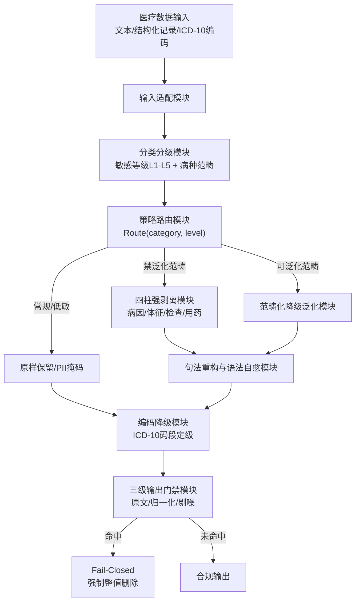
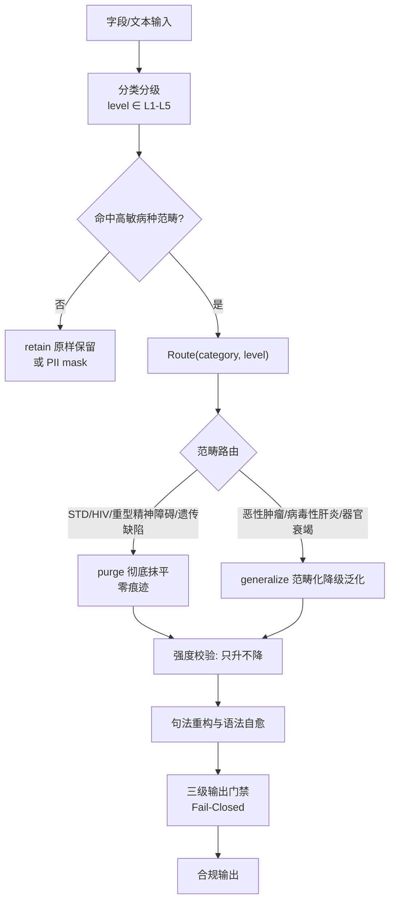
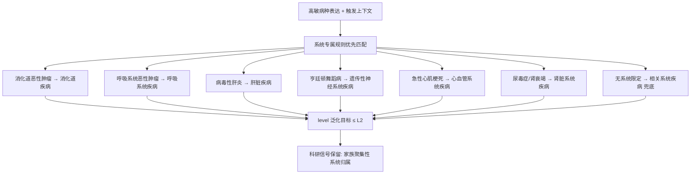
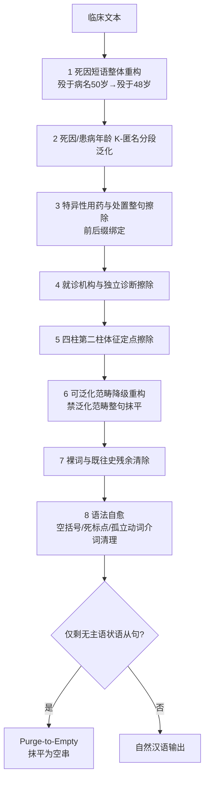
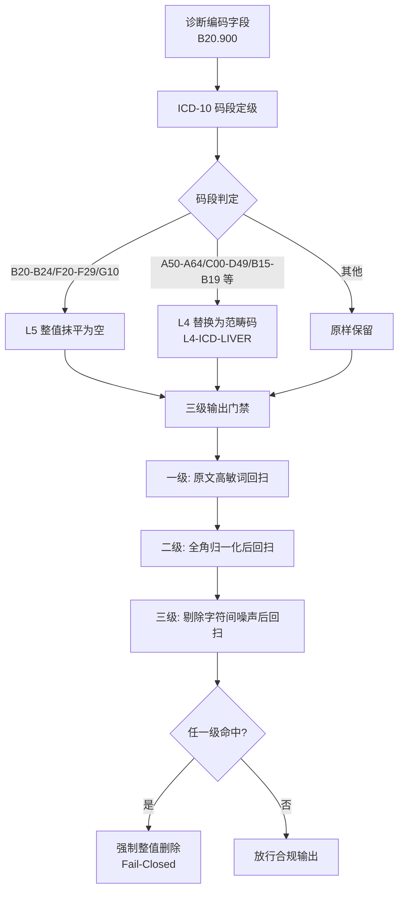

|                                  |
|:--------------------------------:|
| **深圳数联天下智能科技有限公司** |
|      **专利技术交底书模板**      |

编号：HZL-02-R01 版本号：2022

**专利申请用技术交底书模板**

***以下带 \* 信息务必填写，涉及奖金的发放*，谢谢！~**

交底书名称：基于范畴化降级泛化与四柱强剥离的高敏医疗数据抹平方法及系统

\*\*发明人姓名：陈少伟

\*\*第一发明人姓名和身份证号码：陈少伟（371102198410187111）

申请人：深圳数联天下智能科技有限公司

通信地址（邮编）：（递交时填写）

\*\*交底书撰写人：陈少伟

\*\*联系电话：13662678920

\*\*Email：shaowei.chen@clife.cn

**交底技术书信息登记页**

\*\*提交部门：平台建设中心-研发管理部-安全运维组

\*\*项目号：（内部维护时填写）

\*\*项目名称/所属产品(可多个，靠近公司的主营业务)：数据安全与隐私保护、医疗数据安全治理平台

\*\*技术应用领域：医疗数据安全、隐私计算、人工智能（Artificial Intelligence，AI）辅助数据治理

\*\*相关技术方向：自然语言处理（Natural Language Processing，NLP）、数据脱敏、差分隐私、K-匿名、医疗信息学

\*\*技术方案概述：本发明公开一种基于范畴化降级泛化与四柱强剥离的高敏医疗数据抹平方法及系统。将敏感等级与治理策略解耦为正交维度，按病种范畴差异化路由：对性传播疾病（Sexually Transmitted Disease，STD）、人类免疫缺陷病毒（Human Immunodeficiency Virus，HIV）/获得性免疫缺陷综合征（Acquired Immunodeficiency Syndrome，AIDS）、重型精神障碍等极高污名化范畴执行零痕迹彻底抹平，并全链条剥离病因、体征、诊断检查、用药处置四柱关联特征；对恶性肿瘤、病毒性肝炎、严重器官衰竭等范畴执行范畴化降级泛化，将其重构为低敏的同器官/系统疾病大类；文本处理采用句法优先的八步编排与语法自愈；国际疾病分类第十次修订本（International Classification of Diseases 10th Revision，ICD-10）诊断编码按码段同步降级；三级输出门禁对全角与插噪变体 Fail-Closed 拦截。治理策略经 YAML Ain't Markup Language（YAML）声明式配置热调整，无需修改代码。

**交底书注意事项：**

**缩略语和关键术语定义列表（交底书中如有的话，请说明）**

> 1、PII：Personal Identifiable Information，个人可识别信息。指姓名、住址、身份证号、联系方式等可直接或间接识别特定自然人的信息。
>
> 2、STD：Sexually Transmitted Disease，性传播疾病。
>
> 3、HIV：Human Immunodeficiency Virus，人类免疫缺陷病毒；AIDS：Acquired Immunodeficiency Syndrome，获得性免疫缺陷综合征。
>
> 4、ICD-10：International Classification of Diseases 10th Revision，国际疾病分类第十次修订本。
>
> 5、YAML：YAML Ain't Markup Language，YAML 标记语言，一种可读性高的数据序列化语言。
>
> 6、ReDoS：Regular Expression Denial of Service，正则表达式拒绝服务攻击。
>
> 7、K-匿名（K-Anonymity）：一种隐私保护模型，要求数据集中任一记录至少与 K-1 条其他记录在某些准标识符属性上不可区分。
>
> 8、Fail-Closed：失败即安全/失败即关闭策略，指安全校验不通过或服务异常时拒绝输出，禁止降级放行明文。

**交底书撰写说明**

1.  **相关技术背景（背景技术），与本发明最相近似的现有实现方案（现有技术）**

1.1 背景技术

医疗数据（电子病历、医保结算、家族史、检验检查报告、处方医嘱等）蕴含巨大的临床科研与公共卫生价值，同时也包含大量高敏感诊疗信息。随着《个人信息保护法》《数据安全法》《医疗卫生机构网络安全管理办法》等法规的落地，医疗数据在院内共享、院外流转、科研利用及人工智能模型训练等场景下，均需经过严格的脱敏/去标识化处理。医疗数据高敏感性主要体现在以下方面：

（1）病种本身的强污名化属性。STD、HIV/AIDS、重型精神障碍、遗传性疾病等一旦被泄露，可能导致患者遭受歧视、社会排斥或保险/就业不公。

（2）多源异构与半结构化特征。高敏信息不仅出现在自由文本病程记录中，也存在于 ICD-10 诊断编码、检查检验编码、药品编码、科室字段、医保结算字段等结构化/半结构化字段中，形成多通道泄露风险。

（3）上下文关联性强。疾病诊断通常与病因/诱因、体征/症状、检查/检验、用药/处置四类临床证据柱强耦合，仅删除病名关键词往往不足以阻断反向推断。

（4）数据可用性要求严苛。科研场景需要保留家族聚集性、系统归属、时间间隔、慢病用药结构等统计信号，"一刀切"擦除会显著降低数据价值。

因此，医疗数据脱敏治理需要在"隐私安全"与"数据可用"之间取得精确平衡，并同步处理文本、编码、变体、策略运营等多维度问题。

1.2 与本发明相关的现有技术一

1.2.1 现有技术一的技术方案

与本发明最接近的第一类现有技术为基于关键词/规则匹配的敏感内容检索擦除方案，其代表性公开文献为中国发明专利申请 **CN116304186A《一种医疗文档后结构化处理方法及系统》**（申请人：江苏斯普德科技有限公司；申请公布日：2023 年 6 月 23 日）。该专利公开的技术方案为：获取非结构化医疗文档数据，按数据格式分类为图像类与文字类数据并分别转换整合；根据用户预设敏感数据类型进行脱敏等级分类（一般设置 4~5 个等级）并设置对应脱敏规则；根据预设脱敏等级获取对应数据脱敏规则；再根据所述数据脱敏规则将结果文档数据进行**敏感数据检索与删除**，得到数字化文本数据，等级越大所涉及的敏感数据越多、对应删除的敏感数据也越多。

以该专利为代表的此类方案，其共性技术特征为：维护一个高敏感词表或敏感数据类型规则集（如疾病名称、药品名称、检查项目名称等），通过字符串精确匹配或简单正则匹配定位敏感内容，将命中的敏感词替换为固定占位符（如 `[MASKED]`、`[敏感信息]`）或直接删除。处理流程通常为：输入文本 → 分词/关键词扫描 → 命中敏感词 → 替换为空串或占位标签 → 输出脱敏文本。

在部分增强方案中，会引入简单的敏感等级（如 L1~L5），并将等级与处置方式一一绑定，例如 L4 统一替换为 `[L4-MASKED]`，L5 统一删除。部分方案还会对 PII 进行单独处理，例如将姓名替换为"*"、地址截取到省市级等。

1.2.2 现有技术一的缺点

以 CN116304186A 为代表的检索擦除方案存在以下缺点：

（1）全量擦除导致可用性坍塌。该类方案按脱敏等级直接检索并删除敏感数据，将高敏病种及其上下文整段删除后，家族史、病程演变、用药结构等科研与统计价值随之消失。例如"外婆殁于亨廷顿舞蹈病（50 岁）"被整句删除后，家族遗传聚集性这一核心科研信号完全丢失；大规模执行"一刀切"擦除的数据集在科研场景中几乎不可用。

（2）上下文反推通道未封堵。即便病名被擦除，病因（不洁性接触史）、体征（无痛性溃疡）、检查（梅毒螺旋体颗粒凝集试验/快速血浆反应素环状卡片试验阳性）、用药（特异性抗逆转录药物）四类强关联特征仍留在文本中，攻击者可据任意单柱特征反推高敏病史，形成"擦病名不擦证据"的泄露面。CN116304186A 的方案仅按预设敏感数据类型逐项检索删除，未对病种与临床证据之间的关联结构做任何建模。

（3）机械擦除破坏语言结构并遗留线索。逐词替换会产生悬空动词、死因介词、空括号、孤立标点等句法残渣（如"因去世"、"母亲患。"），既破坏可读性，又隐含"此处曾存在被删除的高敏内容"的结构性线索。

（4）分级与处置策略硬绑定。该类方案将脱敏等级与处置方式一一绑定（如 L4 一律泛化、L5 一律删除），无法表达"同为 L4 级，STD 须彻底抹平而肿瘤可降级泛化"的临床差异化需求，也无法在不改代码的前提下随政策调整策略路由。

1.3 与本发明相关的现有技术二

1.3.1 现有技术二的技术方案

现有技术二为基于占位标签的全量泛化方案。该方案不删除敏感信息，而是将识别出的敏感词统一替换为语义更宽泛的类别标签，例如将"HIV 抗体阳性"替换为 `[L4-HIV-MASKED]`，将"肺癌"替换为 `[L4-TUMOR-MASKED]`，将"精神分裂症"替换为 `[L5-PSYCHIATRIC-MASKED]`。部分方案还会引入 ICD-10 码表进行同义词扩展，以提高召回率。

在增强方案中，会采用命名实体识别（Named Entity Recognition，NER）模型自动发现词表未覆盖的敏感实体，并生成对应的占位标签；部分方案还会对标签进行分级，用不同颜色或前缀表示敏感度。

1.3.2 现有技术二的缺点

（1）全量泛化导致残余泄露。占位标签本身即暴露"此处存在某类高敏信息"的事实，且标签中常残留敏感词根（如标签含 "HIV"、"TUMOR"、"PSYCHIATRIC" 字样），反而构成侧信道泄露；对极高社会污名化病种（STD、HIV/AIDS、重型精神障碍）的任何泛化保留都可被上下文推断还原。

（2）标签语义粗糙，可用性受限。所有病种统一映射为粗粒度占位符，科研场景需要的"系统归属""器官归属"等信号完全丢失，无法满足流行病学统计、药物经济学分析等需求。

（3）结构化编码旁路泄露。诊断名称脱敏后，ICD-10 诊断编码字段（如 B20.900、C34.900、F20.000）仍精确指代高敏病种，构成与文本平行的独立泄露通道，现有方案普遍忽略编码字段的同步降级。

（4）变体绕过缺乏系统防护。全角字符（`ＨＩＶ`）、字符间插入噪声（`H I V`、`艾-滋-病`）、拼音变体（`meidu`）等绕过手法可轻易穿透基于精确词表的匹配引擎。

2.  **本发明技术方案的详细阐述（发明内容）**

2.1 本发明所要解决的技术问题（发明目的）

针对现有全量擦除与全量泛化方案存在的上述缺陷，本发明旨在解决以下技术问题：

（1）高敏信息"全删则不可用、全泛化则泄露"的两难问题。需要在对极高污名化病种实现零残留抹平的同时，对具有科研保留价值的病种保留系统级、器官级统计信号。

（2）四类关联特征构成的上下文反推通道问题。需要全链条擦除病因/诱因、体征/症状、诊断/检查、用药/处置四类强关联特征柱，避免"擦病名不擦证据"。

（3）机械擦除产生的句法残渣与结构性线索问题。需要在抹平后输出语法完整的自然汉语，消除空括号、悬空动词、死标点等泄露线索。

（4）ICD-10 编码字段的旁路泄露问题。需要实现诊断文本与诊断编码的同步降级，封堵结构化通道。

（5）敏感等级与处置策略硬绑定导致的路由僵化问题。需要将"数据有多敏感"与"如何处置"解耦，支持按病种范畴差异化路由，并通过声明式配置热调整。

（6）全角/插噪/拼音等变体绕过问题。需要构建抗绕过匹配引擎与多级输出门禁，确保变体表达在输出前被 Fail-Closed 拦截。

2.2 本发明提供的完整技术方案（发明方案）

本发明提供一种高敏医疗数据抹平与降级治理方法，以及实现该方法的高敏医疗数据抹平系统与计算机可读存储介质。其核心思想是：将"数据有多敏感"（分级）与"如何处置"（治理策略）解耦为两个正交维度，对高敏信息按病种范畴差异化路由——对极高污名化范畴执行零痕迹彻底抹平，对具有科研保留价值的范畴执行范畴化降级泛化（重构为低敏的同器官/系统疾病大类而非删除），并以四柱强剥离、句法优先重构、编码同步降级与三级输出门禁构成完整防护闭环。

2.2.1 系统组成与总体架构

本发明所述高敏医疗数据抹平系统包括以下功能模块：

（1）输入适配模块：支持自由文本、结构化记录、ICD-10 编码字段、半结构化医疗文档等多形态输入；支持数据库离线批量治理模式与 Sidecar 单条流式代理模式。

（2）分类分级模块：对输入数据进行敏感等级判定（L1~L5）与病种范畴识别。

（3）策略路由模块：基于病种范畴与敏感等级，经路由函数裁定治理策略，并校验策略强度单调性。

（4）四柱强剥离模块：对路由至彻底抹平（purge）策略的文本，全链条识别并擦除病因/诱因、体征/症状、诊断/检查、用药/处置四类强关联特征柱。

（5）范畴化降级泛化模块：对路由至泛化（generalize）策略的文本，按系统专属规则优先、通用兜底规则次之的顺序，将高敏病种重构为低敏系统/器官疾病大类。

（6）句法重构与语法自愈模块：按句法优先的八步编排执行文本处理，并消除擦除残渣。

（7）编码降级模块：对 ICD-10 诊断编码字段独立定级并同步降级。

（8）三级输出门禁模块：对脱敏输出依次执行原文回扫、全角归一化后回扫、剔除字符间噪声后回扫；任一级命中即强制整值删除或占位替换。

（9）枚举豁免模块：对科室、医疗类别等封闭枚举取值字段豁免自由文本高敏词扫描，防止误伤受控分类词表。

（10）声明式策略配置模块：通过 YAML 配置文件管理治理策略，支持运行时热重载与缺省回退。

图 1 为本发明所述高敏医疗数据抹平系统的总体架构框图。

2.2.2 分级—策略正交化与四档策略路由

定义敏感等级空间 \(\mathcal{L} = \{L1, L2, L3, L4, L5\}\) 与治理策略空间：

\[
\mathcal{S} = \{retain, mask, generalize, purge\} \tag{1}
\]

其中，\(retain\) 为原样保留，\(mask\) 为 PII 掩码（如姓名"李*"、地址截取到市级），\(generalize\) 为范畴化降级泛化，\(purge\) 为彻底抹平。策略强度按信息消除程度排序：\(retain < mask < generalize < purge\)。

策略路由函数按病种范畴而非仅按等级裁定处置方式：

\[
strategy = Route(category, level), \quad strength(strategy) \ge strength(Default(level)) \tag{2}
\]

式（2）表明：策略允许在等级默认策略之上升级（任意 L4 范畴可升级为彻底抹平），但禁止降级弱化。等级相同（同为 L4）的范畴可路由到不同策略：STD、HIV/AIDS、重型精神障碍、遗传缺陷路由至 \(purge\)；恶性肿瘤、病毒性肝炎、严重器官损害路由至 \(generalize\)；常规慢病原样 \(retain\)。

图 2 为分级—策略正交化与四档策略路由流程图。

2.2.3 范畴化降级泛化映射

对允许泛化的范畴，不删除信息而是将其重构为低敏的同器官/系统疾病大类，形成降级泛化映射：

\[
G: (category, context) \rightarrow label, \quad level(label) \le L2 \tag{3}
\]

其中，\(category\) 为病种范畴，\(context\) 为触发上下文（如"家族史""聚集倾向"），\(label\) 为泛化目标标签。典型映射关系如下：

| 高敏病种范畴 | 触发上下文 | 泛化目标标签 |
|---|---|---|
| 消化道恶性肿瘤 | 家族史/现病史 | 消化道疾病 |
| 呼吸系统恶性肿瘤 | 家族史/现病史 | 呼吸系统疾病 |
| 病毒性肝炎 | 现病史/检查史 | 肝脏疾病 |
| 亨廷顿舞蹈病等遗传缺陷 | 家族史 | 遗传性神经系统疾病 |
| 急性心肌梗死 | 现病史 | 心血管系统疾病 |
| 尿毒症/肾功能衰竭 | 现病史 | 肾脏系统疾病 |
| 无系统限定的恶性肿瘤 | 通用兜底 | 相关系统疾病 |

泛化顺序约束：系统专属规则先于通用兜底规则执行，防止"呼吸系统肿瘤"被兜底规则误泛化为其他系统疾病（张冠李戴）。泛化后信息的统计与科研价值（家族聚集性、系统性疾病史）得以保留，而具体高敏病种不可复原。

图 3 为范畴化降级泛化映射与执行顺序示意图。

2.2.4 四柱强剥离

对路由至彻底抹平的范畴，仅擦除病名不足以阻断反推，须全链条擦除四类强关联特征柱：

\[
\mathcal{F} = \{f_{病因}, f_{体征}, f_{诊断检查}, f_{用药处置}\} \tag{4}
\]

第一柱（病因/诱因）：不洁性接触史、高危接触史、输血史、特定基因突变等。

第二柱（现象/体征）：外阴赘生物、无痛性溃疡（硬下疳）、命令性幻听、舞蹈样动作等。

第三柱（诊断/检查）：醋酸白试验阳性、梅毒螺旋体颗粒凝集试验/快速血浆反应素环状卡片试验滴度、CD4+ 计数、病毒载量等。

第四柱（用药/处置）：特异性抗病毒/抗精神病药物、激光灼除术、抗逆转录治疗方案等。

四柱特征均以句法正则整块识别与擦除，任意单柱残留即视为剥离失败。

2.2.5 句法优先的八步重构与语法自愈

为防止"先切病名后重构"导致死因动词悬空（如"殁于''"），文本处理严格按句法优先的八步编排执行：

步骤 1：死因短语整体重构。例如"殁于'亨廷顿舞蹈病'(50岁)"整句重构为"殁于48岁"，病名剥离的同时对年龄施加 K-匿名分段泛化。

步骤 2：死因/患病年龄 K-匿名。<60 岁按 3 岁区间（\(age' = age - (age \bmod 3)\)）泛化，≥60 岁按 2 岁区间（\(age' = age - (age \bmod 2)\)）泛化。

步骤 3：特异性用药与处置整句擦除。绑定前缀（口服/给予/启动/行…）与后缀（抗病毒治疗/控制症状/激光灼除术…），防止裸词误伤。

步骤 4：就诊机构与独立诊断短语整句消除。

步骤 5：四柱第二柱特征体征定点擦除。

步骤 6：综合句法擦除与范畴化降级泛化。可泛化范畴按式（3）重构，禁止泛化范畴整句抹平。

步骤 7：裸词与既往史残余清除。

步骤 8：语法自愈与残渣清理。消除空括号、死标点、孤立动词/介词，单字边界保护；对仅剩无主语状语从句的结果执行 Purge-to-Empty（干净抹平为空串）。

图 4 为句法优先八步重构与语法自愈流程图。

2.2.6 ICD-10 编码同步降级

诊断编码字段按 ICD-10 章节码段独立定级并同步降级，封堵结构化旁路：

\[
Redact_{icd}(code) = \begin{cases} \varnothing & code \in \mathcal{R}_{L5} \\ [L4\text{-}CATE] & code \in \mathcal{R}_{L4} \\ code & otherwise \end{cases} \tag{5}
\]

其中，\(\mathcal{R}_{L5}\) 为极高敏码段（B20–B24 HIV、F20–F29 精神分裂症、G10 亨廷顿舞蹈病）整值抹平为空；\(\mathcal{R}_{L4}\) 为高敏码段（A50–A64 STD、C00–D49 肿瘤、B15–B19 病毒性肝炎、I21–I22 心肌梗死、N18–N19 肾衰竭、J44 慢性阻塞性肺疾病等）替换为不含敏感词根的范畴码（如 `[L4-ICD-LIVER]` 而非 `[L4-ICD-HEPATITIS]`，防止范畴标签本身成为新的敏感词触发二次泄露）。

图 5 为 ICD-10 编码同步降级与三级输出门禁流程图。

2.2.7 三级输出门禁（Fail-Closed）

脱敏输出在放行前经三级回扫门禁：一级对原文高敏词回扫；二级对全角归一化（全角字母数字 → 半角，保留中文标点）后的文本回扫，捕获 `ＨＩＶ` 变体；三级对剔除字符间噪声（空格/点/连字符/零宽字符）后的文本回扫，捕获 `H I V`、`艾-滋-病` 插噪变体。任一级命中即强制整值删除或占位替换（Fail-Closed），禁止带残输出；门禁同时回扫脱敏过程产生的替换标签本身，防止标签回流。

2.2.8 抗绕过匹配引擎

高敏词库编译为"字符间容许可选分隔符"的正则模式：普通字符间以有界量词连接（容忍至多一个分隔符，匹配复杂度保持线性，杜绝 ReDoS）；词项自带空白编译为 `\s*`（兼容"CD4+ T细胞"与"CD4+T细胞"双写法）；ASCII 词项首尾附加零宽词边界断言，防止 "archive" 中的 "hiv"、"hearing aids" 中的 "aids" 等良性英文子串被整值门禁误抹；长词优先排序保证复合词不被子词抢先截断。超长文本（超过预设长度阈值）降级为纯词库擦除路径，切断句法正则在恶意输入上的灾难性回溯攻击面。

2.2.9 枚举型分类字段豁免

对于科室、医疗类别、费别等封闭枚举取值字段，直接豁免自由文本高敏词扫描与抹平触发。该类字段取值来自受控词表，其字面可能包含高敏子串（如"皮肤性病科"），但字段语义为分类标签而非临床描述，若按自由文本扫描会触发误改（如"皮肤性病科"被误改为"皮肤科"），造成可用性事故。通过字段类型白名单机制，封闭枚举字段仅执行 PII 掩码或原样保留，不进入高敏病种范畴路由与四柱剥离流程。

2.2.10 声明式策略配置与热重载

抹平/泛化的范畴路由经声明式配置（YAML `redaction_strategy` 节）管理，包含以下三节：

（1）`purge_categories`：彻底抹平范畴列表。

（2）`generalization_categories`：范畴化泛化范畴列表。

（3）`replacement_labels`：范畴名 → 抽象替换标签映射。

配置加载时校验范畴合法性与 purge/泛化重叠（重叠时 purge 静默胜出并告警），支持运行时热重载；配置缺失或解析失败时自动回退代码内置默认值，保证零配置可运行。运维人员可在不修改代码的前提下将任意泛化范畴升级为抹平范畴。

2.3 本发明技术方案带来的有益效果

（1）可用性与安全性的双提升。范畴化降级泛化使高敏信息的系统归属、家族聚集性等科研信号得以保留（如"消化道恶性肿瘤家族史"→"消化道疾病家族史"），而"一刀切"擦除将丧失全部此类信号；对极高污名化范畴的彻底抹平则保证最敏感信息零残留。

（2）反推通道全封堵。四柱强剥离使病因、体征、检查、用药四类证据链同步消失，杜绝"擦病名不擦证据"的上下文反推。

（3）零句法残渣。句法优先的八步编排与语法自愈消除悬空动词、死标点等结构性线索，输出为自然汉语，不再隐含"此处曾删除高敏内容"的信号。

（4）旁路同步封堵。ICD-10 编码与诊断名称同步降级，且范畴码不含敏感词根，结构化通道不再泄露。

（5）策略可运营。分级与策略解耦后，策略路由可在声明式配置中热调整（只升不降的安全约束由路由函数强制），政策变化无需改代码。

（6）系统性抗绕过。全角归一化、插噪容忍、词边界保护与三级门禁联动，变体绕过在输出前被 Fail-Closed 拦截。

（7）可量化的治理基线。配套质量指标包括：召回率 ≥ 99.5%、精确率 ≥ 95%、语法完整率 ≥ 99%、误伤率 ≤ 2%、单条处理延迟 P99 ≤ 100ms，使脱敏效果具备工程可验收性。

3.  **针对2中的技术方案，是否还有别的替代方案同样能完成发明目的**

3.1 范畴化降级泛化的替代实现

（1）基于语义相似度的自动泛化：不依赖预定义映射表，而是利用医疗领域预训练语言模型计算病种与候选泛化标签之间的语义相似度，自动选择最邻近的低敏系统/器官类别作为泛化目标。该方案可减少人工维护映射表的成本，但需要保证模型输出稳定可控，并附加白名单校验防止过度泛化。

（2）基于 ICD-10 码位截断的泛化：直接截取 ICD-10 编码的前 2~3 位作为泛化标签。例如 C34.900（支气管和肺恶性肿瘤）截断为 C34（呼吸道恶性肿瘤），进一步截断为 C30-C39（呼吸系统恶性肿瘤）。该方案实现简单，但截断结果可能仍包含敏感词根，需配合敏感词根过滤。

3.2 四柱强剥离的替代实现

（1）基于医疗知识图谱的关联扩展：以病名为入口节点，在医学知识图谱中沿"病因—体征—检查—用药"边扩展关联实体，对扩展结果集统一擦除。该方案覆盖更全面，但依赖知识图谱质量与更新时效。

（2）基于规则与模型协同的四柱识别：用 NER 模型识别四柱实体，再用规则校验并补全。该方案对未登录词覆盖更好，但模型推理延迟与资源占用较高。

3.3 语法自愈的替代实现

（1）基于依存句法分析的重建：利用依存句法树定位被擦除节点与其父/子节点的关系，自动修补缺失的状语、宾语等成分。该方案语法恢复更精确，但计算复杂度高于当前规则式残渣清理。

（2）基于 seq2seq 模型的复述生成：将被擦除后的残缺文本输入受控文本生成模型，生成语法完整且语义等价的低敏复述。该方案输出更自然，但需要专门训练医疗领域可控生成模型，并防范模型幻觉。

3.4 三级输出门禁的替代实现

（1）音似/形似扩展：在第三级门禁中增加拼音归一化（`aizi`→`艾滋`）和形近字归一化（`艾兹病`→`艾滋病`）回扫，进一步覆盖拼音变体与 typo 绕过。

（2）阈值动态调整：根据输入字段敏感度与下游使用场景动态调整门禁命中后的处置强度，如对极高敏字段强制空串，对一般高敏字段替换为占位符。

3.5 策略配置与热重载的替代实现

（1）数据库存储策略：将策略路由表存储于关系型数据库或配置中心，通过版本号与审计日志管理策略变更，适合多实例分布式部署。

（2）Web 控制台管理：提供可视化策略编辑界面，支持规则测试、灰度发布与一键回滚，降低运维门槛。

4.  **本发明的技术关键点和欲保护点是什么？**

本发明的技术关键点与欲保护点包括：

（1）敏感等级与治理策略的正交解耦，以及按病种范畴差异化路由的单调性约束（式（2））：允许升级、禁止弱化，确保配置错误不会导致泄露。

（2）范畴化降级泛化映射（式（3）），特别是以"病种范畴 × 触发上下文"二元组为决策单元，系统专属规则优先、通用兜底规则次之的执行顺序，以及泛化目标标签不含敏感词根的设计。

（3）四柱强剥离机制：对路由至彻底抹平的范畴，全链条擦除病因/诱因、体征/症状、诊断/检查、用药/处置四类强关联特征柱，任意单柱残留视为剥离失败。

（4）句法优先的八步重构编排与语法自愈流水线：先整句捕获重构死因短语、用药处置短语、就诊机构与独立诊断短语，后裸词擦除，再执行空括号/死标点/孤立动词清理与 Purge-to-Empty。

（5）ICD-10 诊断编码字段的独立定级与同步降级，以及不含敏感词根的抽象范畴码设计。

（6）三级输出门禁与抗绕过匹配引擎：原文回扫、全角归一化回扫、剔除字符间噪声回扫三级联动；字符间可选分隔符正则、零宽词边界断言、长词优先排序、超长文本降级纯词库擦除等机制。

（7）封闭枚举取值字段（科室、医疗类别等）的自由文本高敏词扫描豁免机制，防止受控分类词表被误伤。

（8）YAML 声明式策略配置与运行时热重载，以及配置异常时自动回退内置默认值的 Fail-Closed 设计。

（9）上述方法在数据库离线批量治理模式与 Sidecar 单条流式代理模式中的统一应用。

附件：

1、《专利技术申请自我声明》

2、参考文献（如专利/论文）

---

## 参考文献（对比文献）

[1] 江苏斯普德科技有限公司. 一种医疗文档后结构化处理方法及系统: 中国发明专利申请 CN116304186A[P]. 2023-06-23.
[2] 医疗数据脱敏方法及装置: 中国发明专利 CN114580007B[P].
[3] 北京中电普华信息技术有限公司, 国家电网有限公司. 一种数据脱敏的处理方法及装置: 中国发明专利 CN108776762B[P]. 2022-01-28.
[4] 蔷薇智慧科技有限公司. 数据脱敏方法及装置: 中国发明专利申请 CN109815742A[P]. 2019-05-28.
[5] 中国建设银行股份有限公司. 电子文档中敏感数据的脱敏处理方法及装置: 中国发明专利申请 CN113204949A[P]. 2021-08-03.
[6] Sweeney L. k-anonymity: a model for protecting privacy[J]. International Journal of Uncertainty, Fuzziness and Knowledge-Based Systems, 2002, 10(5): 557-570.
[7] Machanavajjhala A, Kifer D, Gehrke J, et al. l-diversity: privacy beyond k-anonymity[C]//Proceedings of the 22nd International Conference on Data Engineering (ICDE). IEEE, 2006: 24-35.
[8] 国家市场监督管理总局, 国家标准化管理委员会. GB/T 37964—2019 信息安全技术 个人信息去标识化指南[S]. 2019.
