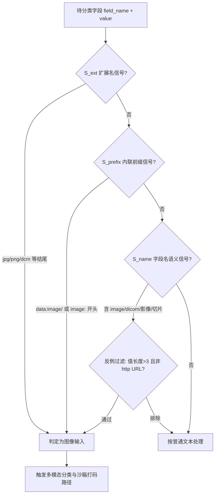
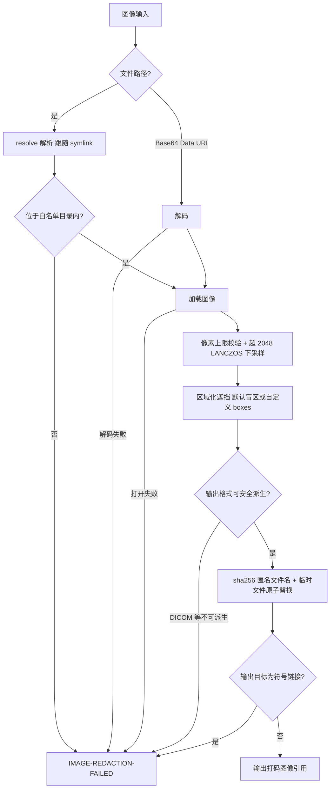
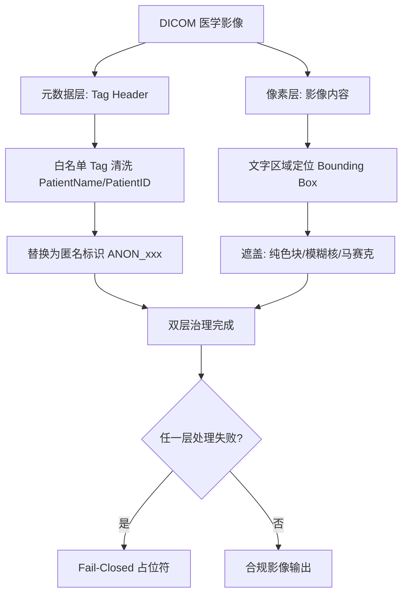
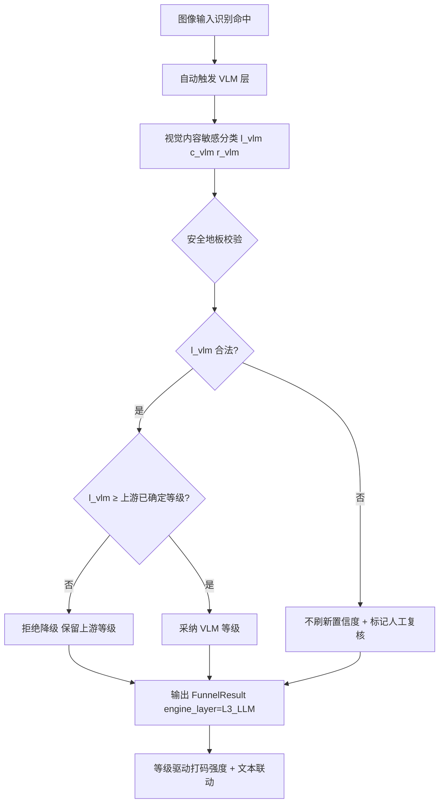
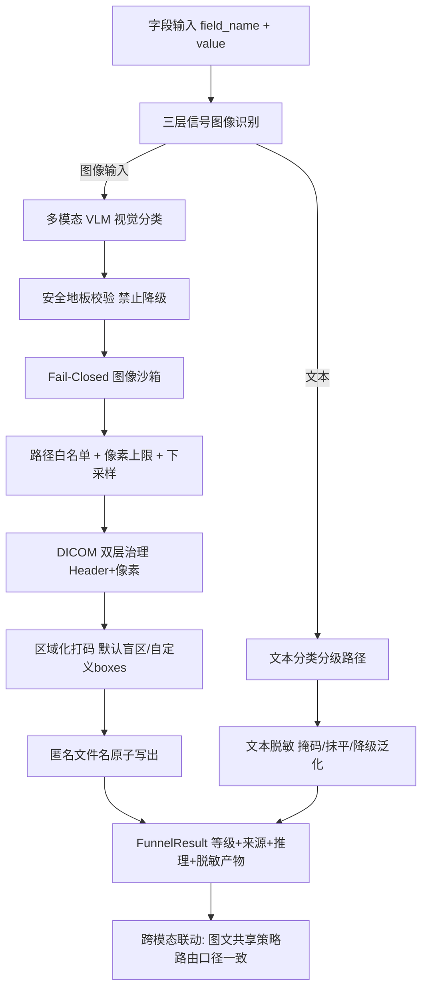

# 发明专利申请书

## 发明名称

**面向医疗数据的多模态图像安全打码与文本-图像联动脱敏方法、系统及存储介质**

## 申请信息（拟）

| 项目 | 内容                                                                          |
|---|-------------------------------------------------------------------------------|
| 技术领域分类号（建议） | G06F 21/62（数据访问保护）、G06T 7/00（图像分析）、G16H 30/20（医学影像处理） |
| 申请人 | 深圳数联天下智能科技有限公司                                                  |
| 发明人 | 陈少伟                                                                        |
| 申请号 / 申请日 | （递交时填写）                                                                |
| 代理机构 / 代理人 | （递交时填写）                                                                |

---

## 技术领域

本发明涉及医疗数据安全、计算机视觉与多模态大模型技术领域，具体涉及一种面向医学影像与病例图片输入的三层信号识别、多模态分类分级、Fail-Closed 图像安全沙箱打码方法，以及图像打码结果与文本脱敏策略的跨模态联动脱敏系统。

## 背景技术

医疗数据不仅包含结构化记录与临床文本，还包含大量医学影像（DICOM、CT、MRI、X-Ray、病理切片、病例拍照等）。现有文本脱敏与分类分级技术无法直接处理图像输入，而传统图像脱敏方案在医疗场景下存在以下缺陷：

1. **图像输入识别单一信号漏检**：仅依赖文件扩展名判断图像类型，无法识别 Base64 内联图像（`data:image/...`）、字段名语义暗示的影像字段（如 `dicom_file`、`病例图片`），也无法排除"图片链接说明文本"（`image_url` 指向 http URL）等反例，漏检与误判并存。
2. **DICOM 双层敏感面未同步治理**：医学影像的敏感信息分布在两个独立层面——DICOM Tag Header 元数据（PatientName/ID 等嵌入字段）与像素层（影像中烧录的化验单文字、姓名、签名）。现有方案只处理其一，另一层构成旁路泄露。
3. **图像解析引入攻击面**：脱敏服务直接解析调用方指定路径的图像，存在目录穿越（`../../`）与符号链接逃逸导致的任意文件读取风险；恶意构造的超大图像（Decompression Bomb）与超高分辨率图像可耗尽内存造成拒绝服务。
4. **打码强度与分类等级割裂**：传统图像脱敏对所有图像执行固定强度打码，无法根据敏感等级差异化选择遮挡范围（L5 生物特征级应全图遮蔽，L2 常规影像仅需局部遮挡），也无法与同一记录中文本字段的脱敏策略联动。
5. **失败路径泄露原图**：当图像格式无法安全处理（如 DICOM 无法安全派生为普通位图）时，现有方案常将原值原样返回或抛出异常，等价于把未脱敏图像直接交给调用方。
6. **视觉内容语义理解缺失**：基于 OCR 或固定模板的像素级处理无法理解影像内容的语义敏感度（如"影像中可见罕见病特征"），无法给出可审计的分级理由。

## 发明内容

### 一、要解决的技术问题

本发明旨在解决：（1）图像/医学影像输入的多信号可靠识别与反例排除问题；（2）DICOM 元数据层与像素层双敏感面的同步治理问题；（3）图像解析过程的任意文件读取与拒绝服务攻击面问题；（4）打码强度与敏感等级及文本脱敏策略的联动问题；（5）异常路径下绝不泄露原图的 Fail-Closed 保障问题；（6）影像视觉内容的语义级分级与可审计问题。

### 二、技术方案

本发明提供一种面向医疗数据的多模态图像安全打码与文本-图像联动脱敏方法，包括：

**（一）三层信号的图像输入识别。**
对每个待分类字段（字段名 + 字段值）并行检测三类信号，任一命中即判定为图像输入：

\[
IsImg(f) = S_{ext}(v) \vee S_{prefix}(v) \vee \left( S_{name}(f) \wedge \neg Excl(v) \right) \tag{1}
\]

其中 \(S_{ext}\) 为扩展名信号（值以 `.jpg/.jpeg/.png/.bmp/.webp/.tif/.tiff/.dcm/.dicom` 结尾且长度不超过路径上限）；\(S_{prefix}\) 为内联前缀信号（值以 `data:image/` 或 `image:` 开头，覆盖 Base64 内联图像）；\(S_{name}\) 为字段名语义信号（含 `image/photo/pic/dicom/xray/ct_scan/mri/img` 词边界匹配或中文"切片/病例图片/影像"子串）；\(Excl(v)\) 为反例过滤（值长度 ≤ 3 或值为 http(s) URL 时排除），防止"图片链接说明文本"误判为图像输入触发解析。

**（二）多模态 LLM 视觉分类与安全地板。**
识别为图像输入后自动触发多模态大模型层（VLM）对视觉内容进行敏感分类分级，输出候选等级、置信度与推理说明：

\[
(l_{vlm},\ c_{vlm},\ r_{vlm}) = VLM(img,\ prompt_{medical}) \tag{2}
\]

VLM 输出受**安全地板**约束：最终等级不得低于上游规则层/NER 层已确定的等级（禁止大模型降级放行）；未返回合法等级时不刷新置信度并标记人工复核（\(needs\_human\_review = true\)）。分级理由 \(r_{vlm}\) 随结果交付，供审计追溯。

**（三）DICOM 双层提取与差异化治理。**
对医学影像执行双层敏感面治理：元数据层按 Tag 白名单清洗 DICOM Header 中的 PatientName/PatientID 等身份字段（替换为匿名标识）；像素层对影像中烧录的文字区域定位文本框（Bounding Box）并执行遮盖（纯色块/模糊核）。两层治理相互独立、缺一不可：仅清洗 Header 时像素文字仍泄露，仅遮盖像素时 Header 元数据仍泄露。

**（四）Fail-Closed 图像安全沙箱。**
图像读取与写出全程受沙箱约束，任何校验失败一律返回固定失败占位符 \([IMAGE\text{-}REDACTION\text{-}FAILED]\)，绝不返回原图：
1. **路径沙箱**：输入路径经 `resolve()`（跟随符号链接）解析后，必须位于可配置目录白名单（`PRIVACY_IMAGE_ALLOWED_DIRS`）内，前缀匹配同时拦截目录穿越与 symlink 逃逸；resolve 失败一律拒绝；
2. **资源防护**：设置像素总数上限（Decompression Bomb 防护）；宽或高超过阈值（2048）时自动 LANCZOS 高质量下采样（OOM 防护）；
3. **格式白名单派生**：输出格式仅允许可安全派生的映射（JPG→JPEG、TIF→TIFF 等），DICOM 等无法安全派生的格式直接返回失败占位，绝不尝试解析写出；
4. **写出安全**：输出文件名以原文件名的哈希摘要前缀匿名化（防文件名泄露患者信息），经临时文件原子替换（防并发读半成品），拒绝覆盖符号链接形式的输出路径；输出目录文件数超过上限自动轮转清理（磁盘防满）。

**（五）区域化差异化打码。**
按敏感等级与场景选择遮挡策略：默认盲区遮挡为图像顶部 16%（姓名/证件区）与底部 18%（诊断文字/签名区）；支持调用方以比例坐标或像素坐标传入自定义遮挡框 \(boxes = \{(ymin,xmin,ymax,xmax)\}\)，坐标全部落于 \([0,1]\) 判为比例坐标并按图像实际尺寸换算，否则按绝对像素处理；L5 级（生物特征/基因影像）执行全图遮蔽或整段占位替换。

**（六）文本-图像跨模态联动。**
在单次分类调用 \(classify\_field(field\_name, value, sanitize=true)\) 中完成跨模态闭环：图像字段的分级结果与同记录文本字段共享策略路由——图像判定为高敏范畴时，关联文本字段按同一范畴治理策略执行抹平或降级泛化；文本字段判定为高敏时，图像字段同步提升打码强度。联动结果封装于统一漏斗结果结构：

\[
FunnelResult = (level,\ confidence,\ engine\_layer,\ needs\_human\_review,\ reasoning,\ sanitized\_value) \tag{3}
\]

其中 \(engine\_layer\) 标记决策来源（\(L3\_LLM\) 表示多模态大模型裁定），\(sanitized\_value\) 为文本脱敏值或打码后图像引用，实现"一次调用、双模态治理、结果可审计"。

**（七）全路径 Fail-Closed 汇总。**
以下所有异常路径均返回失败占位符而非原值：PIL 依赖缺失、沙箱外路径、图像打开失败、Base64 解码失败、无法安全派生的输出格式、符号链接输出目标。输入"看起来是图像"但无法安全处理时，宁可缺失脱敏产物也不降级放行明文，并记录结构化告警日志。

本发明还提供实现上述方法的多模态联动脱敏系统与计算机可读存储介质。

### 三、有益效果

1. **三信号识别消除漏检与误判**：扩展名、内联前缀、字段名语义三信号并集加反例过滤，覆盖文件路径、Base64 内联与语义暗示三类图像输入形态。
2. **双层同步封堵 DICOM 旁路**：Header 元数据清洗与像素文字遮盖并行执行，医学影像两个独立泄露面被同时治理。
3. **攻击面系统性收敛**：路径沙箱、像素上限、下采样、格式白名单、原子写出构成纵深防护，任意文件读取与拒绝服务攻击在解析前被拦截。
4. **等级驱动的差异化打码**：打码强度随分类等级动态调整，并与文本脱敏策略共享同一路由，同一记录的图像与文本治理口径一致。
5. **零原图泄露**：全路径 Fail-Closed，任何处理失败都输出固定占位符，调用方无法通过构造异常输入获得未脱敏图像。
6. **语义级可审计分级**：多模态大模型提供分级理由并受安全地板约束，分级结果既可解释又不可被大模型私自降级。

### 四、与现有技术的对比

| 对比维度 | 最接近现有技术 | 本发明区别特征 | 带来的技术效果 |
|---|---|---|---|
| 图像输入识别 | 仅文件扩展名判断 | 扩展名 + 内联前缀 + 字段名语义三信号并集与反例过滤 | Base64 内联与语义暗示输入不再漏检，URL 说明文本不再误判 |
| DICOM 治理 | 仅清洗 Header 或仅处理像素 | Header Tag 清洗与像素文本框遮盖双层同步 | 双敏感面旁路同时封堵 |
| 解析安全 | 直接解析调用方路径图像 | resolve 白名单沙箱 + 像素上限 + 下采样 + 格式白名单 | 目录穿越/symlink 逃逸/Decompression Bomb/OOM 全拦截 |
| 打码强度 | 固定强度一刀切 | 等级驱动差异化遮挡 + 与文本策略联动路由 | L5 全图遮蔽、常规影像局部遮挡，口径统一 |
| 失败行为 | 异常时原样返回或抛错 | 全路径 Fail-Closed 固定占位符 | 构造异常输入无法获得未脱敏图像 |
| 分级可解释性 | OCR/模板像素处理无语义 | VLM 语义分级 + 安全地板 + 推理说明审计 | 分级可解释且不可被大模型降级放行 |

### 五、沙箱形式化与联动一致性

**（一）创新点强化**

1. 沙箱校验采用"先 resolve 后前缀比对"次序：符号链接在比对前已被展开，指向白名单外的 symlink 目标无法伪装成白名单内路径；输出侧同样拒绝符号链接目标，读写双向防逃逸。
2. 输出文件名匿名化使用原文件名的哈希摘要（确定性派生）：同一原图多次打码输出同名文件（幂等覆盖），同时切断文件名与患者身份/病种的语义关联。
3. 图像打码与文本抹平共享同一领域策略注册表（DomainStrategyRegistry）：医疗领域注册的文本脱敏回调与图像打码入口挂载于同一分类服务，跨模态联动无需跨模块硬编码。
4. 多模态 LLM 层与三层漏斗复用同一安全地板与置信度策略：图像分级与文本分级在"禁止降级放行、低置信转人工"等语义上完全一致，避免双标准漂移。

**（二）沙箱准入函数**

\[
Admit(p) = Resolve(p) \neq \bot \wedge \exists d \in Whitelist:\ Resolve(p) \preceq d \tag{4}
\]

其中 \(\preceq\) 表示路径前缀包含关系，\(Whitelist\) 为可配置的受信目录集合（默认为工作目录下的数据/上传/样本子目录与系统临时目录）。沙箱外路径、resolve 失败、符号链接输出目标三类输入均映射到失败占位符：

\[
Out(x) = \begin{cases} Redact(x) & Admit \wedge Parseable \wedge Derivable \\ [IMAGE\text{-}REDACTION\text{-}FAILED] & otherwise \end{cases} \tag{5}
\]

**（三）联动一致性约束**

对同一记录 \(R\)，图像字段 \(f_{img}\) 与文本字段 \(f_{txt}\) 的最终策略满足单调一致性：

\[
level(f_{img}) \ge L4 \Rightarrow strategy(f_{txt}) \in \{generalize,\ purge\} \tag{6}
\]

即图像判定达到高敏档时，关联文本字段不得执行弱于泛化的处置；反向亦然。该约束由共享策略路由表在编排层强制，防止"图像重打码、文本轻放行"的口径分裂。

## 术语与符号说明

| 术语/符号 | 含义 |
|---|---|
| 三层信号识别 | 扩展名信号、内联前缀信号、字段名语义信号的并集判定 |
| 反例过滤 Excl | 值为短串或 http(s) URL 时排除字段名语义信号 |
| VLM | 多模态（视觉-语言）大模型，执行影像视觉内容敏感分类 |
| 安全地板 | 大模型裁定等级不得低于上游已确定等级的强约束 |
| DICOM 双层 | Tag Header 元数据层与像素烧录文字层两个独立敏感面 |
| Fail-Closed | 失败即拒绝输出原图的安全策略，返回固定失败占位符 |
| 路径沙箱 | resolve 后必须位于目录白名单内的准入校验 |
| Decompression Bomb | 恶意构造的高压缩比超大图像，解压时耗尽内存 |
| 格式白名单派生 | 仅允许可安全派生的输出格式映射，DICOM 直接失败 |
| 原子替换 | 临时文件写出后 rename 覆盖，防并发读半成品 |
| boxes | 自定义遮挡框集合，比例坐标或像素坐标双制式 |
| FunnelResult | 承载等级、置信度、决策来源、复核标记与脱敏产物的统一结果结构 |

## 附图说明

- **图 1**：多模态图像安全打码与文本-图像联动脱敏总体架构图。
- **图 2**：三层信号图像输入识别与反例过滤流程图。
- **图 3**：Fail-Closed 图像安全沙箱准入与写出流程图。
- **图 4**：DICOM 双层提取与差异化打码示意图。
- **图 5**：多模态 LLM 视觉分类与安全地板校验流程图。

## 附图详览（图 2 ~ 图 5）

### 图 2：三层信号图像输入识别与反例过滤流程图



```
 字段 (field_name, value)
    │
    ├─ S_ext:  以 .jpg/.png/.dcm/.dicom... 结尾? ──是──► 图像输入
    │
    ├─ S_prefix: 以 data:image/ 或 image: 开头? ──是──► 图像输入
    │
    └─ S_name: 字段名含 image/dicom/xray/影像/切片?
         │是
         ▼
       反例过滤: 值长度 > 3 且非 http(s) URL?
         │通过            │排除
         ▼                ▼
      图像输入          按普通文本处理 (image_url 说明文本)
         │
         ▼
 触发多模态分类 + 沙箱打码路径
```

### 图 3：Fail-Closed 图像安全沙箱准入与写出流程图



```
 图像输入
   │
   ├─ 文件路径 ──► resolve(跟随 symlink) ──► 白名单目录内?
   │                                            │否 → FAILED 占位
   │                                            │是
   ├─ Base64 ───► 解码 ──失败──► FAILED 占位    ▼
   └──────────────────────────────────────► 加载图像
                                              │打开失败 → FAILED 占位
                                              ▼
                          像素上限校验 + 超2048 LANCZOS 下采样
                                              │
                                              ▼
                          区域化遮挡 (默认盲区 / 自定义 boxes)
                                              │
                                              ▼
                          输出格式可安全派生? ──DICOM──► FAILED 占位
                                              │是
                                              ▼
                          sha256 匿名文件名 + tmp→rename 原子替换
                                              │
                          输出目标是符号链接? ──是──► FAILED 占位
                                              │否
                                              ▼
                          输出打码图像引用 (全路径零原图泄露)
```

### 图 4：DICOM 双层提取与差异化打码示意图



```
 DICOM 医学影像
   │
   ├─ 元数据层 (Tag Header)
   │    PatientName/PatientID 等身份 Tag ──► 匿名标识替换 (ANON_xxx)
   │
   └─ 像素层 (影像内容)
        烧录文字区域 (化验单/姓名/签名) ──► Bounding Box 定位
                                        ──► 纯色块/模糊核/马赛克遮盖
   │
   ▼
 双层治理完成 (仅做其一即构成旁路泄露)
   │
   ▼
 任一层失败? ──是──► Fail-Closed 占位符
   │否
   ▼
 合规影像输出
```

### 图 5：多模态 LLM 视觉分类与安全地板校验流程图



```
 图像输入识别命中
    │
    ▼
 自动触发 VLM 层 (多模态大模型)
    │
    ▼
 视觉敏感分类: (l_vlm, c_vlm, r_vlm=推理说明)
    │
    ▼
 安全地板校验
   l_vlm 合法? ──否──► 不刷新置信度 + needs_human_review
    │是
   l_vlm ≥ 上游已确定等级? ──否──► 拒绝降级, 保留上游等级
    │是
   采纳 VLM 等级
    │
    ▼
 FunnelResult(level, confidence, engine_layer=L3_LLM, reasoning)
    │
    ▼
 等级驱动打码强度 ∧ 关联文本字段同策略联动
```

## 具体实施方式

**实施例 1：三信号识别与反例过滤。**
`patient_avatar` = `/data/images/123.jpg` → 扩展名信号 + 字段名语义信号命中；`dicom_file` = `data:image/png;base64,iVBOR...` → 内联前缀信号 + 语义信号命中；`image_url` = `http://example.com/ct.jpg` → 语义信号命中但反例过滤排除（http URL）；`report_note` = "影像显示肺部结节" → 值非图像形态，按普通文本处理。

**实施例 2：多模态分类与安全地板。**
DICOM 影像路径输入，VLM 输出 `{level: "L4", confidence: 0.92, reasoning: "影像包含患者姓名与诊断文字"}`；若上游规则已判定 L5（基因/生物特征级），VLM 输出 L4 被安全地板拒绝，保留 L5 并标记人工复核，杜绝大模型私自降级放行。

**实施例 3：沙箱打码全流程。**
输入 `/data/images/case_123.jpg`（分类 L4）：沙箱校验通过 → 加载后尺寸 3000×4000 超 2048，LANCZOS 下采样至 1500×2000 → 默认遮挡顶部 16%（y:0-320）与底部 18%（y:1640-2000）→ 输出至 `sanitized_<sha256前12位>.jpg` 并原子替换。文件名匿名化切断与患者身份的语义关联。

**实施例 4：DICOM 失败处理（Fail-Closed）。**
输入 `/data/dicom/scan.dcm`：像素打码完成但输出格式无法安全派生（DICOM 不在格式白名单），返回 `[IMAGE-REDACTION-FAILED]`；分类结果不受影响，仅脱敏产物缺失——调用方绝无可能获得原图。

**实施例 5：目录穿越与 symlink 逃逸拦截。**
输入 `../../etc/passwd.png`：resolve 后位于白名单外，准入失败返回占位符；输入指向沙箱外的符号链接 `link.png → /secret/scan.png`：resolve 跟随链接后前缀比对失败，同样拦截。

**实施例 6：跨模态联动单次调用。**
调用 `classify_field("dicom_image", "/data/dicom/ct.dcm", sanitize=true)`：三信号识别 → VLM 分级（L4）→ 沙箱打码（失败占位）→ 返回 `FunnelResult(final_level=L4, engine_layer=L3_LLM, needs_human_review=false, sanitized_value=[IMAGE-REDACTION-FAILED])`；同记录文本字段按 L4 范畴策略同步执行抹平或降级泛化，图文口径一致。

**实施例 7：自定义遮挡框。**
调用方传入 `boxes=[(0.10, 0.05, 0.30, 0.60)]`（比例坐标）：四坐标均落于 [0,1] 判为比例制式，按图像实际尺寸换算像素区域后遮盖；若任一坐标 > 1 则按绝对像素处理，双制式自动判别。

**实施例 8：关键参数配置表。**

| 参数 | 默认值 | 说明 |
|---|---|---|
| `PRIVACY_IMAGE_ALLOWED_DIRS` | cwd 数据子目录 + 系统临时目录 | 图像读取目录白名单（os.pathsep 分隔） |
| `PRIVACY_LLM_AUTO_ON_IMAGE` | true | 检测到图像/DICOM 输入时自动触发多模态 LLM 层 |
| `MAX_IMAGE_PIXELS` | 25,000,000 | Decompression Bomb 像素总数上限 |
| 下采样阈值 | 2048×2048 | 超出即 LANCZOS 下采样（OOM 防护） |
| 默认遮挡区域 | 顶部 16% + 底部 18% | 姓名/证件区与诊断/签名区盲区遮挡 |
| 输出文件轮转上限 | 200 | 超限按最旧优先自动清理（磁盘防满） |
| 失败占位符 | `[IMAGE-REDACTION-FAILED]` | 全路径 Fail-Closed 统一输出 |

## 权利要求书

1. 一种面向医疗数据的多模态图像安全打码与文本-图像联动脱敏方法，其特征在于，包括：
   接收包含字段名与字段值的待分类字段；
   基于文件扩展名信号、内联图像前缀信号与字段名图像语义信号的并集判定字段值是否为图像或医学影像输入，其中字段名语义信号受反例过滤约束；
   对识别为图像输入的字段触发多模态大模型进行视觉内容敏感分类分级，并对模型输出执行安全地板校验；
   对图像字段执行目录白名单沙箱校验、资源防护与区域化敏感内容遮挡，对文本字段执行字段名感知脱敏；
   输出包含最终敏感等级、置信度、决策引擎来源、人工复核标记与脱敏产物的统一结果结构。

2. 根据权利要求 1 所述的方法，其特征在于，所述反例过滤包括：字段值长度不超过预设阈值或字段值为 http/https 统一资源定位符时，排除字段名语义信号的判定结果。

3. 根据权利要求 1 所述的方法，其特征在于，所述安全地板校验包括：模型输出等级不合法时不刷新置信度并标记人工复核；模型输出等级低于上游已确定等级时拒绝采纳并保留上游等级。

4. 根据权利要求 1 所述的方法，其特征在于，所述沙箱校验包括：将输入路径经符号链接解析后与可配置目录白名单执行前缀比对；解析失败或比对不通过时返回固定失败占位符；写出阶段拒绝符号链接形式的输出目标。

5. 根据权利要求 1 所述的方法，其特征在于，所述资源防护包括：设置像素总数上限拦截解压炸弹；图像宽或高超过预设阈值时执行高质量下采样；输出目录文件数超过上限时按最旧优先轮转清理。

6. 根据权利要求 1 所述的方法，其特征在于，所述区域化遮挡包括：默认遮挡图像顶部与底部的预设比例区域；或接收遮挡框参数集合，当全部坐标落于单位区间时按比例坐标换算，否则按绝对像素坐标处理。

7. 根据权利要求 1 所述的方法，其特征在于，对医学影像执行双层治理：元数据层清洗 DICOM 标签头中的身份字段并替换为匿名标识，像素层对影像中的文字区域定位文本框并执行遮盖。

8. 根据权利要求 1 所述的方法，其特征在于，输出格式经白名单映射派生，无法安全派生的格式返回固定失败占位符；输出文件名由原文件名的哈希摘要派生，经临时文件原子替换写出。

9. 根据权利要求 1 所述的方法，其特征在于，以下异常路径均返回固定失败占位符而非原始值：图像处理依赖缺失、沙箱外路径、图像打开失败、内联编码解码失败、输出格式不可派生。

10. 根据权利要求 1 所述的方法，其特征在于，还包括跨模态联动步骤：图像字段的分级结果与同一记录的文本字段共享策略路由，图像字段达到预设高敏档时关联文本字段执行不低于泛化强度的处置。

11. 根据权利要求 1 所述的方法，其特征在于，所述统一结果结构携带决策引擎来源标记与分级推理说明，多模态大模型裁定的结果以独立引擎层标识供下游审计。

12. 根据权利要求 1 所述的方法，其特征在于，图像打码入口与文本脱敏回调注册于同一领域策略注册表，跨模态联动经注册表分发而非跨模块硬编码。

13. 根据权利要求 1 所述的方法，其特征在于，所述方法同时适用于单条流式代理模式与批量数据集治理模式，两模式共用同一识别、沙箱与联动规则。

14. 一种面向医疗数据的多模态图像安全打码与文本-图像联动脱敏系统，其特征在于，包括：图像输入识别模块、多模态分类模块、图像安全沙箱模块、双层影像治理模块、区域化打码模块与跨模态联动编排模块，各模块协同执行权利要求 1 至 13 任一项所述的方法。

15. 一种计算机可读存储介质，其上存储有计算机程序，其特征在于，所述计算机程序被处理器执行时实现权利要求 1 至 13 任一项所述的方法。

16. 一种电子设备，其特征在于，包括处理器以及存储有计算机程序的存储器，所述计算机程序被所述处理器执行时实现权利要求 1 至 13 任一项所述的方法。

## 摘要

本发明公开了一种面向医疗数据的多模态图像安全打码与文本-图像联动脱敏方法、系统及存储介质。该方法通过文件扩展名、内联图像前缀与字段名语义三层信号识别图像与医学影像输入并施以反例过滤；自动触发多模态大模型对视觉内容进行敏感分类分级，并以安全地板禁止模型降级放行；对 DICOM 影像执行元数据标签清洗与像素文字遮盖的双层同步治理；图像读取与写出全程受 Fail-Closed 沙箱约束——路径解析白名单、解压炸弹像素上限、超分辨率下采样、格式白名单派生、哈希匿名文件名原子替换，任何异常路径均返回固定失败占位符而绝不泄露原图；打码强度随敏感等级差异化调整，并与同一记录文本字段的脱敏策略共享路由联动。本发明解决了医学影像输入漏检、图像解析攻击面与图文治理口径割裂的问题，适用于电子病历附件、DICOM 影像与病例图片的隐私治理场景。

## 摘要附图（图 1：多模态图像安全打码与文本-图像联动脱敏总体架构图）

### Mermaid 版本



### ASCII 版本

```
 字段输入 (field_name, value)
        │
        ▼
 三层信号图像识别 (扩展名 ∨ 内联前缀 ∨ 字段名语义) + 反例过滤
        │
   ┌────┴────────────────────┐
   ▼                         ▼
 图像输入                   文本输入
   │                         │
   ▼                         ▼
 多模态 VLM 视觉分类        文本分类分级路径
   │                         │
   ▼                         ▼
 安全地板校验 (禁止降级)     文本脱敏 (掩码/抹平/降级泛化)
   │                         │
   ▼                         │
 Fail-Closed 图像沙箱         │
   路径白名单 + 像素上限 + 下采样│
   DICOM 双层治理 (Header+像素)│
   区域化打码 (盲区/boxes)     │
   匿名文件名原子写出          │
   │                         │
   └────────┬────────────────┘
            ▼
 FunnelResult (等级 + 引擎来源 + 推理说明 + 脱敏产物)
            │
            ▼
 跨模态联动: 图文共享策略路由, 口径一致 (图像高敏 → 文本不弱于泛化)
            │
   异常路径 ──► [IMAGE-REDACTION-FAILED] 固定占位 (零原图泄露)
```
