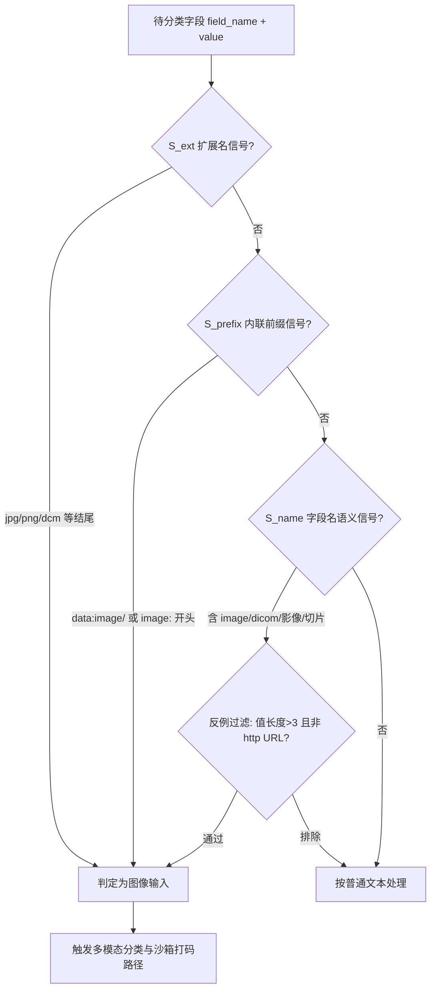
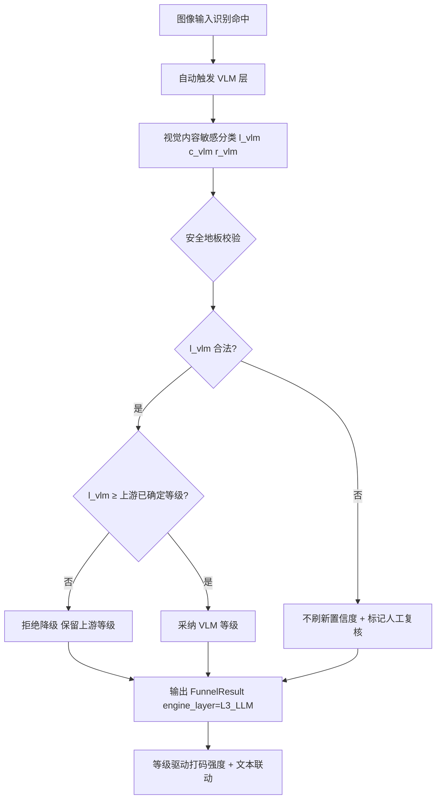
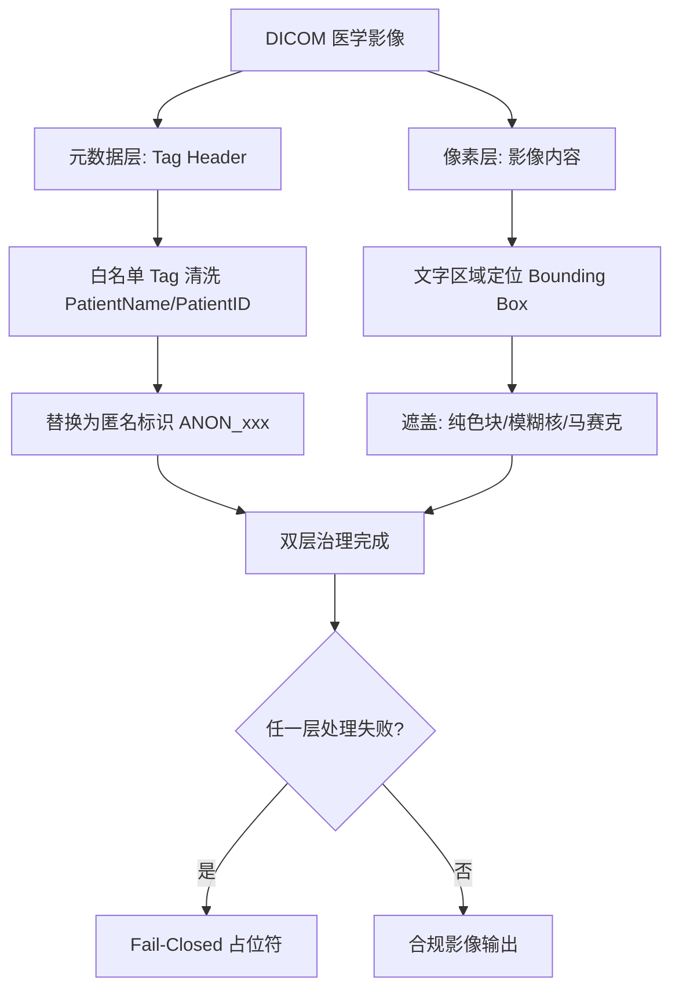
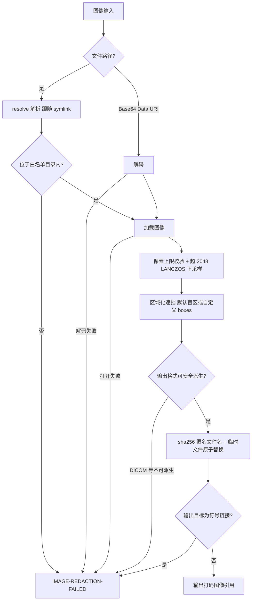

|                                  |
|:--------------------------------:|
| **深圳数联天下智能科技有限公司** |
|      **专利技术交底书模板**      |

编号：HZL-02-R01 版本号：2022

**专利申请用技术交底书模板**

**交底书名称：**

面向医疗数据的多模态图像安全打码与文本-图像联动脱敏方法及系统

\*\*发明人姓名：陈少伟

\*\*第一发明人姓名和身份证号码：陈少伟（371102198410187111）

申请人：深圳数联天下智能科技有限公司

通信地址（邮编）：（递交时填写）

\*\*交底书撰写人：陈少伟

\*\*联系电话：13662678920

\*\*Email：shaowei.chen@clife.cn

**交底技术书信息登记页**

\*\*提交部门：平台建设中心-研发管理部-安全运维组

\*\*项目号：（内部维护时填写）

\*\*项目名称/所属产品(可多个，靠近公司的主营业务)：数据安全与隐私保护、医疗数据安全治理平台

**技术应用领域：**

医疗数据安全、人工智能隐私计算、计算机视觉、多模态大模型

**相关技术方向：**

计算机视觉、深度学习、医学影像处理、自然语言处理、隐私增强技术

**技术方案概述：**

本发明公开一种面向医疗数据的多模态图像安全打码与文本-图像联动脱敏方法及系统。该方法基于文件扩展名、内联图像前缀和字段名语义三层信号识别图像与医学影像输入，并施以反例过滤排除非图像说明文本；对识别为图像输入的字段自动触发多模态视觉-语言大模型进行视觉内容敏感分类分级，并以安全地板机制禁止模型降级放行；对 DICOM（Digital Imaging and Communications in Medicine，医学数字成像和通信标准）影像执行元数据标签头清洗与像素文字遮盖的双层同步治理；图像读取与写出全程受 Fail-Closed 图像安全沙箱约束，任何异常路径均返回固定失败占位符而不泄露原图；打码强度随敏感等级差异化调整，并与同一记录中文本字段的脱敏策略共享路由联动，实现一次调用、双模态治理、结果可审计。

**交底书注意事项：**

1.  代理人并不是技术专家，交底书要使代理人能看懂，尤其是背景技术和详细技术方案，一定要写得全面、清楚。
2.  英文缩写要提供中文译文及英文全拼，避免只使用英文单词。
3.  全文对同一事物的叫法应统一，避免出现一种东西多种叫法。
4.  和代理人沟通时，对于代理人的疑问请认真讲解，要求补充的材料应及时补充。
5.  专利法规定：

    1.  专利必须是一个技术方案，应该阐述发明目的是通过什么技术方案来实现的，不能只有原理，也不能只做功能介绍；
    2.  专利必须充分公开，以本领域技术人员不需付出创造性劳动即可实现为准。

    对申请人来说，必须满足上述规定，专利才能批准；但为了不让竞争对手完全掌握该项技术，在满足上述规定的前提下，可以在一些细节上做一些加工。

**缩略语和关键术语定义列表**

1.  **DICOM**：Digital Imaging and Communications in Medicine，医学数字成像和通信标准，医疗影像设备广泛使用的文件格式与通信协议。
2.  **VLM**：Vision-Language Model，视觉-语言大模型，能够同时接收图像与文本输入并输出语义理解结果的多模态深度学习模型。
3.  **LLM**：Large Language Model，大语言模型，基于 Transformer 架构的大规模预训练语言模型。
4.  **NER**：Named Entity Recognition，命名实体识别，用于从文本中抽取人名、身份证号、病历号等敏感实体的自然语言处理技术。
5.  **OCR**：Optical Character Recognition，光学字符识别，用于将图像中的文字转换为机器可读文本的技术。
6.  **CT**：Computed Tomography，计算机断层扫描，一种医学影像获取方式。
7.  **MRI**：Magnetic Resonance Imaging，磁共振成像，一种医学影像获取方式。
8.  **X-Ray**：X 射线影像，一种常规医学影像获取方式。
9.  **URL**：Uniform Resource Locator，统一资源定位符，用于标识互联网上资源位置的字符串。
10. **Base64**：一种基于 64 个可打印字符对二进制数据进行编码的表示方法，常用于在文本中内联传输图像。
11. **PIL**：Python Imaging Library，Python 图像处理库，本发明中用于图像解码、重采样与像素级操作的图像处理依赖。
12. **Bounding Box**：边界框，用于定位图像中目标区域或文字区域的矩形坐标表示。
13. **Fail-Closed**：失败即关闭/失败即拒绝，一种安全设计原则，当处理失败或异常时拒绝输出原始敏感内容，转而输出安全的失败占位。
14. **FunnelResult**：漏斗结果结构，本发明中承载最终敏感等级、置信度、决策引擎来源、人工复核标记与脱敏产物的统一结果结构。
15. **LANCZOS**：一种高质量图像重采样滤波算法，用于在缩小图像时保持较高视觉质量。
16. **Decompression Bomb**：解压炸弹，指恶意构造的高压缩比图像文件，在解压时会急剧膨胀并耗尽系统内存。

**交底书撰写说明**

下文按照本模板章节结构，对本发明的技术方案、有益效果、替代方案及关键保护点进行详细阐述。

1.  **相关技术背景（背景技术），与本发明最相近似的现有实现方案（现有技术）**

1.1 背景技术

医疗数据是高度敏感的个人隐私数据，不仅包括电子病历、检查报告等结构化或半结构化文本，还包括大量医学影像数据，例如 DICOM 影像、CT（Computed Tomography，计算机断层扫描）影像、MRI（Magnetic Resonance Imaging，磁共振成像）影像、X-Ray 影像、病理切片数字化图像以及医生或患者拍摄的病例照片等。随着医院信息系统、影像归档和通信系统（PACS，Picture Archiving and Communication System）以及互联网医疗平台的普及，医疗影像在临床诊断、科研分析、医保结算、远程会诊和人工智能辅助诊断等场景中被频繁传输与共享。

在医疗数据共享与流通的过程中，保护患者隐私是法律法规和行业规范的核心要求。国内外均已出台多部数据安全与隐私保护法规，对医疗数据的采集、存储、使用和对外提供提出了严格要求。医疗影像中往往同时包含患者身份信息、疾病诊断信息、生物特征信息和基因相关信息等多维度敏感内容，一旦泄露将直接威胁患者隐私安全，并可能引发歧视、诈骗等次生风险。因此，如何对医疗影像进行可靠识别、准确分级、安全脱敏，并与文本脱敏策略保持一致口径，已成为医疗数据安全治理的关键技术问题。

现有的数据脱敏技术主要面向结构化字段和文本内容，例如通过字段名规则匹配、正则表达式、命名实体识别（NER，Named Entity Recognition）或规则引擎对文本中的姓名、身份证号、手机号、病历号等敏感实体进行掩码、抹平或泛化处理。然而，这些方法难以直接适用于图像与医学影像输入。医学影像文件具有格式特殊（如 DICOM）、体积较大、语义复杂等特点，其敏感信息可能同时存在于文件元数据标签头和影像像素中，传统的文本脱敏技术无法覆盖这些非文本敏感面。

近年来，随着深度学习技术的发展，基于计算机视觉和 OCR（Optical Character Recognition，光学字符识别）的图像脱敏方案逐渐出现。这类方案能够在像素层定位文字区域并进行遮盖，但在医疗场景下仍然存在识别信号单一、DICOM 双层敏感面未同步治理、解析过程存在攻击面、打码强度与敏感等级割裂、失败路径可能泄露原图以及缺乏语义级可解释分级等缺陷。

1.2 与本发明相关的现有技术一

1.2.1 现有技术一的技术方案

与本发明最接近的第一类现有技术为基于文件扩展名识别与固定模板处理的医学影像脱敏方案，其代表性公开文献为中国发明专利申请 **CN113889227A《一种基于 DICOM 的医学图像脱敏及清洗方法》**（申请人：新疆大学；申请公布日：2022 年 1 月 4 日）。该专利公开的技术方案为：对 DICOM 标准的 CT 医学图像原始数据进行批件审核；将医学图像中涉及患者隐私的数据根据脱敏策略进行数据脱敏，其中患者 PatientID 采用可恢复的对称加密算法处理，其余数据使用无效化、数值变换的方法进行脱敏；再对脱敏后图像进行 PatientID 解敏以辅助数据清洗，剔除重复或错误数据后归类输出。

以该专利为代表的此类方案，其共性技术特征为：在接收到待处理记录后，首先根据字段值的文件扩展名判断是否为图像输入，例如识别以 `.jpg`、`.jpeg`、`.png`、`.bmp`、`.webp`、`.tif`、`.tiff`、`.dcm`、`.dicom` 等扩展名结尾的字符串；若判定为图像，则直接调用操作系统文件接口或第三方图像库（如 PIL，Python Imaging Library）从调用方指定的路径加载图像数据；随后对整幅图像执行固定强度的像素级处理，例如对整个图像区域施加纯色块覆盖、马赛克或高斯模糊；对于 DICOM 影像，则如 CN113889227A 所示，仅读取 DICOM 标签头（Tag Header）中的患者姓名（PatientName）、患者 ID（PatientID）等身份字段并进行加密、无效化或数值变换，或仅对影像像素层进行简单遮盖。处理完成后，将脱敏后的图像保存到输出目录并返回输出路径或处理结果；若在加载、解析或保存过程中发生异常，则通常将原始字段值原样返回或向上抛出异常。

1.2.2 现有技术一的缺点

以 CN113889227A 为代表的此类方案存在以下缺点：

（1）图像输入识别信号单一。现有技术仅依赖文件扩展名判断图像类型，无法识别内联的 Base64 编码图像（例如 `data:image/png;base64,...`），也无法根据字段名语义（例如 `dicom_file`、`病例图片`、`xray_image`）识别未携带扩展名的图像引用，导致大量图像输入漏检。同时，字段名虽然包含图像语义但字段值仅为图片 URL（Uniform Resource Locator，统一资源定位符）说明文本时会被误判为图像输入，触发不必要的图像解析，增加系统开销并引入误报。

（2）DICOM 双层敏感面未同步治理。医学影像的敏感信息分布在 DICOM 标签头元数据层与像素烧录文字层两个独立层面。CN113889227A 的方案仅处理标签头中的身份字段，对像素层中烧录的患者姓名、诊断文字完全未加治理；反之，仅做像素遮盖的方案则保留标签头中的患者身份信息，未治理的层面构成旁路泄露通道。此外，其对 PatientID 采用可恢复的对称加密，为辅助清洗还需执行解敏还原，进一步扩大了敏感信息的暴露面。

（3）图像解析引入攻击面。现有技术直接解析调用方指定的路径，未对路径进行沙箱校验，存在目录穿越（例如 `../../etc/passwd.png`）与符号链接逃逸导致的任意文件读取风险；同时，对图像的像素总数、宽高尺寸和压缩比缺乏限制，恶意构造的超大图像（Decompression Bomb）与超高分辨率图像可耗尽内存，造成拒绝服务攻击。

（4）打码强度与敏感等级割裂。现有技术对所有图像执行固定强度打码，无法根据敏感等级差异化选择遮挡范围。例如，L5 级生物特征或基因影像应当执行全图遮蔽，而 L2 级常规影像仅需局部遮挡，统一处理导致过度脱敏或脱敏不足并存；同时，图像打码策略与同一记录中文本字段的脱敏策略相互独立，难以保证治理口径一致。

（5）失败路径可能泄露原图。当图像格式无法安全处理（例如 DICOM 无法安全派生为普通位图）或发生异常时，现有技术常将原值原样返回或抛出异常，等价于将未脱敏图像直接交给调用方，违反 Fail-Closed 安全原则；CN113889227A 对脱敏失败数据的处置亦依赖人工审核与溯源核对，无法在处理链路内自动阻断原图流出。

1.3 与本发明相关的现有技术二

1.3.1 现有技术二的技术方案

现有技术二为基于 OCR 与像素级处理的医学影像脱敏方案，主要面向包含文字的医学影像（如化验单、诊断报告扫描件、病例拍照等），其代表性公开文献为中国发明专利申请 **CN113936764A《一种医疗报告单照片中敏感信息脱敏方法及系统》**（申请号：202111265566.3；申请公布日：2022 年 1 月 14 日）。该专利公开的技术方案为：基于先验知识构建敏感信息范围（敏感信息匹配关键词列表与医院名称关键词列表）；通过 OCR 模型检测医疗报告单照片中的文本框并识别文本内容；结合关键词匹配与序列标注网络中的命名实体识别方法对每个文本框的文本内容进行敏感信息检测与识别；对识别出的敏感信息进行像素级坐标定位；最后根据定位坐标对敏感信息位置进行打码脱敏处理。

该类方案首先通过 OCR 模型识别影像像素中的文字区域，生成 Bounding Box（边界框）坐标；然后根据规则库或模板匹配判断文字内容是否属于敏感信息，例如识别患者姓名、身份证号、诊断结论等；对于被判定为敏感的文字区域，使用纯色块覆盖、模糊核或马赛克等方式进行局部遮盖。部分方案进一步结合深度学习目标检测模型定位影像中的人脸、指纹等生物特征区域并进行遮蔽。处理完成后，将脱敏后的图像返回给下游系统。对于 DICOM 影像，部分方案会在 OCR 处理前转换格式或直接读取像素数据。

1.3.2 现有技术二的缺点

（1）视觉内容语义理解缺失。基于 OCR 或固定模板的像素级处理只能识别影像中的文字信息，无法理解影像内容的语义敏感度，例如影像中可见罕见病特征、基因相关标志或特殊病变形态等，无法给出可审计的分级理由。

（2）分级可解释性不足。现有技术通常基于固定规则或模板判断敏感度，难以处理多样化和未见过的医疗影像类型，且无法解释为何将某张影像判定为某一敏感等级，导致分级结果难以满足合规审计要求。

（3）模型降级风险未受约束。当引入大语言模型（Large Language Model，LLM）或多模态模型进行分级时，若模型输出等级低于上游规则引擎或 NER（Named Entity Recognition，命名实体识别）已确定的敏感等级，现有方案缺乏安全地板约束，可能导致模型私自降级放行高敏影像。

（4）DICOM 双层治理不完整。现有技术二仍侧重于像素层文字遮盖，通常忽略或简化 DICOM 标签头中的患者身份元数据清洗，导致标签头元数据层与像素层不同步，存在旁路泄露风险。

（5）图文策略无法联动。现有技术对图像和文本分别独立处理，图像字段的脱敏结果不会反馈到同一记录中相关文本字段的治理策略，反之亦然，容易造成同一患者记录内部治理口径不一致。

2.  **本发明技术方案的详细阐述（发明内容）**

2.1 本发明所要解决的技术问题

针对现有技术的上述缺陷，本发明提供一种面向医疗数据的多模态图像安全打码与文本-图像联动脱敏方法及系统，所要解决的技术问题包括：

（1）图像与医学影像输入的多信号可靠识别与反例排除问题。医疗数据字段中图像输入可能以文件路径、Base64 内联编码、字段名语义暗示等多种形式出现，现有单一扩展名识别方式存在漏检与误判，需要一种能够同时覆盖多类形态并排除 URL 说明文本等反例的识别机制。

（2）DICOM 影像元数据层与像素层双敏感面的同步治理问题。DICOM 影像的患者身份信息既嵌入在标签头元数据中，也可能烧录在影像像素内，仅治理其中一层将留下旁路泄露通道，需要双层同步治理方案。

（3）图像解析过程的任意文件读取与拒绝服务攻击面问题。调用方指定的图像路径不可信，需要路径沙箱校验、资源上限控制、超高分辨率下采样和格式白名单机制，防止目录穿越、符号链接逃逸、Decompression Bomb 和内存耗尽攻击。

（4）打码强度与敏感等级及文本脱敏策略的联动问题。不同敏感等级的影像应采用差异化的打码强度，并且图像字段的治理策略应与同一记录中文本字段的脱敏策略相互联动，避免治理口径割裂。

（5）异常路径下绝不泄露原图的 Fail-Closed 保障问题。当图像处理依赖缺失、路径校验失败、图像解析失败、输出格式无法安全派生或写出阶段发生异常时，现有方案可能返回原图，需要全路径失败占位机制。

（6）影像视觉内容的语义级分级与可审计问题。需要借助多模态视觉-语言大模型理解影像语义敏感度，同时以安全地板机制约束模型输出，并提供分级理由供审计追溯。

2.2 本发明提供的完整技术方案（发明方案）

本发明提供一种面向医疗数据的多模态图像安全打码与文本-图像联动脱敏方法，并同时提供实现该方法的多模态联动脱敏系统和计算机可读存储介质。所述方法可由部署在本地或边缘计算节点上的隐私本地代理执行，所述系统包括图像输入识别模块、多模态视觉分类模块、Fail-Closed 图像安全沙箱模块、DICOM 双层治理模块、区域化打码模块和文本-图像跨模态联动编排模块。各模块协同工作，共同完成医疗影像的安全识别、分级、脱敏与审计。

下面结合系统框图与流程图对本发明的技术方案进行详细说明。

**图 1 多模态图像安全打码与文本-图像联动脱敏总体架构图**


```
 字段输入 (field_name, value)
        │
        ▼
 三层信号图像识别 (扩展名 ∨ 内联前缀 ∨ 字段名语义) + 反例过滤
        │
   ┌────┴────────────────────┐
   ▼                         ▼
 图像输入                   文本输入
   │                         │
   ▼                         ▼
 多模态 VLM 视觉分类        文本分类分级路径
   │                         │
   ▼                         ▼
 安全地板校验 (禁止降级)     文本脱敏 (掩码/抹平/降级泛化)
   │                         │
   ▼                         │
 Fail-Closed 图像沙箱         │
   路径白名单 + 像素上限 + 下采样│
   DICOM 双层治理 (Header+像素)│
   区域化打码 (盲区/boxes)     │
   匿名文件名原子写出          │
   │                         │
   └────────┬────────────────┘
            ▼
 FunnelResult (等级 + 引擎来源 + 推理说明 + 脱敏产物)
            │
            ▼
 跨模态联动: 图文共享策略路由, 口径一致 (图像高敏 → 文本不弱于泛化)
            │
   异常路径 ──► [IMAGE-REDACTION-FAILED] 固定占位 (零原图泄露)
```

**（一）三层信号的图像输入识别模块**

对每个待分类字段，所述图像输入识别模块并行检测字段名与字段值上的三类信号，任一信号命中即判定该字段为图像输入。所述三类信号包括扩展名信号、内联前缀信号和字段名语义信号，并通过反例过滤排除非图像说明文本：

\[
IsImg(f) = S_{ext}(v) \vee S_{prefix}(v) \vee \left( S_{name}(f) \wedge \neg Excl(v) \right)
\]

其中，\(S_{ext}(v)\) 为扩展名信号，表示字段值 \(v\) 以 `.jpg`、`.jpeg`、`.png`、`.bmp`、`.webp`、`.tif`、`.tiff`、`.dcm`、`.dicom` 等图像或医学影像扩展名结尾，且路径长度不超过系统路径上限；\(S_{prefix}(v)\) 为内联前缀信号，表示字段值以 `data:image/` 或 `image:` 开头，覆盖 Base64 内联图像场景；\(S_{name}(f)\) 为字段名语义信号，表示字段名 \(f\) 包含 `image`、`photo`、`pic`、`dicom`、`xray`、`ct_scan`、`mri`、`img` 等词边界匹配项，或包含中文“切片”、“病例图片”、“影像”等子串；\(Excl(v)\) 为反例过滤条件，当字段值长度不超过预设阈值（例如 3）或字段值为 http/https 统一资源定位符时，排除字段名语义信号的判定结果，防止将“图片链接说明文本”误判为图像输入。

**图 2 三层信号图像输入识别与反例过滤流程图**



```
 字段 (field_name, value)
    │
    ├─ S_ext:  以 .jpg/.png/.dcm/.dicom... 结尾? ──是──► 图像输入
    │
    ├─ S_prefix: 以 data:image/ 或 image: 开头? ──是──► 图像输入
    │
    └─ S_name: 字段名含 image/dicom/xray/影像/切片?
         │是
         ▼
       反例过滤: 值长度 > 3 且非 http(s) URL?
         │通过            │排除
         ▼                ▼
      图像输入          按普通文本处理 (image_url 说明文本)
         │
         ▼
 触发多模态分类 + 沙箱打码路径
```

**（二）多模态视觉分类与安全地板模块**

当字段被识别为图像输入后，所述多模态视觉分类模块自动触发多模态视觉-语言大模型（VLM，Vision-Language Model）对视觉内容进行敏感分类分级，输出候选敏感等级、置信度和推理说明：

\[
(l_{vlm},\ c_{vlm},\ r_{vlm}) = VLM(img,\ prompt_{medical})
\]

其中，\(l_{vlm}\) 为模型输出的敏感等级，\(c_{vlm}\) 为置信度，\(r_{vlm}\) 为模型生成的分级推理说明。所述 VLM 输出受安全地板约束：最终等级不得低于上游规则层或 NER（Named Entity Recognition，命名实体识别）层已确定的敏感等级，禁止大模型私自降级放行。若 VLM 未返回合法等级，则不刷新置信度并标记需要人工复核（\(needs\_human\_review = true\)）。所述分级理由 \(r_{vlm}\) 随结果交付，供审计追溯。

**图 5 多模态 LLM 视觉分类与安全地板校验流程图**



```
 图像输入识别命中
    │
    ▼
 自动触发 VLM 层 (多模态大模型)
    │
    ▼
 视觉敏感分类: (l_vlm, c_vlm, r_vlm=推理说明)
    │
    ▼
 安全地板校验
   l_vlm 合法? ──否──► 不刷新置信度 + needs_human_review
    │是
   l_vlm ≥ 上游已确定等级? ──否──► 拒绝降级, 保留上游等级
    │是
   采纳 VLM 等级
    │
    ▼
 FunnelResult(level, confidence, engine_layer=L3_LLM, reasoning)
    │
    ▼
 等级驱动打码强度 ∧ 关联文本字段同策略联动
```

**（三）DICOM 双层治理模块**

对识别为医学影像的 DICOM（Digital Imaging and Communications in Medicine，医学数字成像和通信标准）文件，所述 DICOM 双层治理模块执行元数据层与像素层的双层同步治理。在元数据层，按 Tag 白名单清洗 DICOM 标签头中的患者姓名（PatientName）、患者 ID（PatientID）等身份字段，并将其替换为匿名标识；在像素层，对影像中烧录的文字区域定位 Bounding Box（边界框）并执行遮盖处理，所述遮盖包括但不限于纯色块覆盖、模糊核处理或马赛克处理。两层治理相互独立、缺一不可：仅清洗标签头时像素文字仍可能泄露，仅遮盖像素时标签头元数据仍可能泄露。

**图 4 DICOM 双层提取与差异化打码示意图**



```
 DICOM 医学影像
   │
   ├─ 元数据层 (Tag Header)
   │    PatientName/PatientID 等身份 Tag ──► 匿名标识替换 (ANON_xxx)
   │
   └─ 像素层 (影像内容)
        烧录文字区域 (化验单/姓名/签名) ──► Bounding Box 定位
                                        ──► 纯色块/模糊核/马赛克遮盖
   │
   ▼
 双层治理完成 (仅做其一即构成旁路泄露)
   │
   ▼
 任一层失败? ──是──► Fail-Closed 占位符
   │否
   ▼
 合规影像输出
```

**（四）Fail-Closed 图像安全沙箱模块**

所述图像安全沙箱模块对图像读取与写出全过程施加约束，任何校验失败一律返回固定失败占位符 \([IMAGE\text{-}REDACTION\text{-}FAILED]\)，绝不返回原图。所述沙箱约束包括：

1.  **路径沙箱**：输入路径经 `resolve()` 解析（跟随符号链接）后，必须与可配置目录白名单（`PRIVACY_IMAGE_ALLOWED_DIRS`）中的受信目录满足前缀包含关系；解析失败或比对不通过一律拒绝，从而同时拦截目录穿越与符号链接逃逸攻击。
2.  **资源防护**：设置像素总数上限以拦截 Decompression Bomb 攻击；当图像宽度或高度超过预设阈值（例如 2048 像素）时，使用 LANCZOS 滤波算法执行高质量下采样，防止内存耗尽导致的拒绝服务。
3.  **格式白名单派生**：输出格式仅允许可安全派生的映射关系（例如 JPG→JPEG、TIF→TIFF 等），DICOM 等无法安全派生的格式直接返回失败占位符，绝不尝试解析写出。
4.  **写出安全**：输出文件名以原文件名的哈希摘要前缀匿名化，防止文件名泄露患者信息；写出过程采用临时文件原子替换机制，防止并发读取半成品；拒绝覆盖符号链接形式的输出路径；输出目录文件数超过上限时按最旧优先自动轮转清理，防止磁盘写满。

所述沙箱准入函数可形式化表示为：

\[
Admit(p) = Resolve(p) \neq \bot \wedge \exists d \in Whitelist:\ Resolve(p) \preceq d
\]

其中，\(\preceq\) 表示路径前缀包含关系，\(Whitelist\) 为可配置的受信目录集合。所述输出函数为：

\[
Out(x) = \begin{cases} Redact(x) & Admit \wedge Parseable \wedge Derivable \\ [IMAGE\text{-}REDACTION\text{-}FAILED] & otherwise \end{cases}
\]

**图 3 Fail-Closed 图像安全沙箱准入与写出流程图**



```
 图像输入
   │
   ├─ 文件路径 ──► resolve(跟随 symlink) ──► 白名单目录内?
   │                                            │否 → FAILED 占位
   │                                            │是
   ├─ Base64 ───► 解码 ──失败──► FAILED 占位    ▼
   └──────────────────────────────────────► 加载图像
                                              │打开失败 → FAILED 占位
                                              ▼
                          像素上限校验 + 超2048 LANCZOS 下采样
                                              │
                                              ▼
                          区域化遮挡 (默认盲区 / 自定义 boxes)
                                              │
                                              ▼
                          输出格式可安全派生? ──DICOM──► FAILED 占位
                                              │是
                                              ▼
                          sha256 匿名文件名 + tmp→rename 原子替换
                                              │
                          输出目标是符号链接? ──是──► FAILED 占位
                                              │否
                                              ▼
                          输出打码图像引用 (全路径零原图泄露)
```

**（五）区域化差异化打码模块**

所述区域化打码模块根据敏感等级与场景选择遮挡策略。默认情况下，对图像顶部 16% 区域与底部 18% 区域执行盲区遮挡，分别对应姓名/证件区与诊断文字/签名区；同时支持调用方以比例坐标或像素坐标传入自定义遮挡框集合 \(boxes = \{(ymin, xmin, ymax, xmax)\}\)。当所有坐标均落于 \([0, 1]\) 区间时，判定为比例坐标并按图像实际尺寸换算为像素区域；否则按绝对像素坐标处理。对于 L5 级（生物特征级或基因影像级）高敏图像，执行全图遮蔽或整段占位替换。

**（六）文本-图像跨模态联动编排模块**

所述跨模态联动编排模块在单次分类调用中完成图文双模态治理闭环。图像字段经识别、分级、沙箱打码后的结果，与同记录中的文本字段共享策略路由：当图像字段被判定为高敏范畴时，关联文本字段按同一范畴治理策略执行抹平或降级泛化；当文本字段被判定为高敏时，图像字段同步提升打码强度。所述联动结果封装于统一的漏斗结果结构：

\[
FunnelResult = (level,\ confidence,\ engine\_layer,\ needs\_human\_review,\ reasoning,\ sanitized\_value)
\]

其中，\(engine\_layer\) 标记决策来源（例如 \(L3\_LLM\) 表示多模态大模型裁定），\(sanitized\_value\) 为文本脱敏值或打码后图像引用，实现一次调用、双模态治理、结果可审计。

对同一记录 \(R\)，图像字段 \(f_{img}\) 与文本字段 \(f_{txt}\) 的最终策略满足单调一致性约束：

\[
level(f_{img}) \ge L4 \Rightarrow strategy(f_{txt}) \in \{generalize,\ purge\}
\]

即图像字段达到高敏档时，关联文本字段不得执行弱于泛化的处置；反向约束同样成立。该约束由共享策略路由表在编排层强制，防止“图像重打码、文本轻放行”的口径分裂。

**（七）全路径 Fail-Closed 汇总**

以下所有异常路径均返回失败占位符而非原始值：图像处理依赖缺失、沙箱外路径、图像打开失败、Base64 解码失败、无法安全派生的输出格式、符号链接输出目标。当输入“看起来是图像”但无法安全处理时，宁可缺失脱敏产物也不降级放行明文，并记录结构化告警日志。

2.3 本发明技术方案带来的有益效果

（1）三信号识别消除漏检与误判。通过文件扩展名、内联图像前缀和字段名语义三信号并集判定，并配合反例过滤，能够覆盖文件路径、Base64 内联和语义暗示三类图像输入形态，同时避免将 URL 说明文本误判为图像输入。

（2）双层同步封堵 DICOM 旁路。对 DICOM 影像同时执行标签头元数据清洗和像素文字遮盖，医学影像中两个独立的敏感泄露面被同时治理，杜绝因单层治理遗漏导致的旁路泄露。

（3）攻击面系统性收敛。路径沙箱、像素总数上限、超高分辨率下采样、输出格式白名单和原子写出机制构成纵深防护，目录穿越、符号链接逃逸、Decompression Bomb 和内存耗尽攻击在图像解析前即被拦截。

（4）等级驱动的差异化打码。打码强度随分类等级动态调整，低敏影像局部遮挡，高敏影像全图遮蔽，并与文本脱敏策略共享同一路由，保证同一记录内部治理口径一致。

（5）零原图泄露。全路径 Fail-Closed 设计使得任何处理失败都输出固定占位符，调用方无法通过构造异常输入获得未脱敏图像，满足医疗数据安全合规要求。

（6）语义级可审计分级。多模态视觉-语言大模型提供分级理由，并受安全地板约束，分级结果既可解释又不可被大模型私自降级，满足审计和合规要求。

3.  **针对 2 中的技术方案，是否还有别的替代方案同样能完成发明目的**

本发明还可以采用以下替代方案实现相同或相近的发明目的：

（1）在图像输入识别阶段，可仅使用扩展名信号与字段名语义信号两种信号的组合，或采用深度学习分类器对字段名与字段值进行联合编码后再判断是否为图像输入，同样可实现多形态图像输入识别。

（2）在多模态视觉分类阶段，可采用单独的视觉模型和文本模型分别提取图像特征与提示文本特征，再通过特征融合层输出分类结果，替代端到端的视觉-语言大模型。

（3）在 DICOM 双层治理阶段，可先对 DICOM 影像进行格式转换后再统一处理元数据与像素，或采用医学影像专用脱敏库对标签头进行匿名化处理，同样可实现双层同步治理。

（4）在 Fail-Closed 图像安全沙箱中，路径沙箱校验可采用 chroot 容器、命名空间隔离或操作系统级沙箱替代纯软件路径前缀比对；资源防护除像素总数上限外，还可结合容器内存配额和超时熔断机制。

（5）在区域化打码阶段，除默认盲区遮挡和自定义 Bounding Box 外，还可采用敏感目标检测模型自动定位人脸、姓名条、诊断文字等区域，再执行局部遮盖。

（6）在输出文件名匿名化阶段，除使用哈希摘要前缀外，还可采用基于患者标识的确定性伪匿名映射或随机 UUID（Universally Unique Identifier，通用唯一识别码）作为文件名，以切断文件名与患者身份的语义关联。

（7）在跨模态联动阶段，图像字段与文本字段可分别由独立的分类服务处理，通过消息队列或共享缓存同步敏感等级，再分别执行对应的治理策略，同样可实现图文策略一致。

（8）在系统部署形态上，本发明既可作为单体服务运行于本地服务器或边缘设备，也可拆分为识别服务、分类服务、沙箱服务和策略服务等多个微服务，通过 REST（Representational State Transfer，表述性状态转移）接口或 gRPC（Google Remote Procedure Call，谷歌远程过程调用）接口协同工作。

4.  **本发明的技术关键点和欲保护点是什么？**

本发明的技术关键点和欲保护点包括：

（1）基于文件扩展名信号、内联图像前缀信号与字段名语义信号的三层图像输入识别方法，并结合反例过滤排除 URL 说明文本等误报来源。

（2）对识别为图像输入的字段自动触发多模态视觉-语言大模型进行视觉内容敏感分类分级，并以安全地板机制禁止模型输出等级低于上游已确定等级。

（3）对 DICOM 医学影像执行元数据标签头清洗与像素文字遮盖的双层同步治理方法。

（4）Fail-Closed 图像安全沙箱机制，包括路径解析白名单准入、像素总数上限、超高分辨率 LANCZOS 下采样、输出格式白名单派生、哈希匿名文件名和临时文件原子替换写出。

（5）基于敏感等级的区域化差异化打码方法，包括默认盲区遮挡、自定义比例/像素坐标遮挡框以及 L5 级高敏影像全图遮蔽。

（6）文本字段与图像字段在同一分类调用中的跨模态策略联动方法，通过共享策略路由表保证图文治理口径一致。

（7）统一的 FunnelResult 结果结构，承载最终敏感等级、置信度、决策引擎来源、人工复核标记、分级推理说明和脱敏产物，实现结果可审计。

**附件：**

1.  《专利技术申请自我声明》
2.  参考文献（如有）

---

**附录 A：权利要求书**

1. 一种面向医疗数据的多模态图像安全打码与文本-图像联动脱敏方法，其特征在于，包括：
   接收包含字段名与字段值的待分类字段；
   基于文件扩展名信号、内联图像前缀信号与字段名图像语义信号的并集判定字段值是否为图像或医学影像输入，其中字段名语义信号受反例过滤约束；
   对识别为图像输入的字段触发多模态大模型进行视觉内容敏感分类分级，并对模型输出执行安全地板校验；
   对图像字段执行目录白名单沙箱校验、资源防护与区域化敏感内容遮挡，对文本字段执行字段名感知脱敏；
   输出包含最终敏感等级、置信度、决策引擎来源、人工复核标记与脱敏产物的统一结果结构。

2. 根据权利要求 1 所述的方法，其特征在于，所述反例过滤包括：字段值长度不超过预设阈值或字段值为 http/https 统一资源定位符时，排除字段名语义信号的判定结果。

3. 根据权利要求 1 所述的方法，其特征在于，所述安全地板校验包括：模型输出等级不合法时不刷新置信度并标记人工复核；模型输出等级低于上游已确定等级时拒绝采纳并保留上游等级。

4. 根据权利要求 1 所述的方法，其特征在于，所述沙箱校验包括：将输入路径经符号链接解析后与可配置目录白名单执行前缀比对；解析失败或比对不通过时返回固定失败占位符；写出阶段拒绝符号链接形式的输出目标。

5. 根据权利要求 1 所述的方法，其特征在于，所述资源防护包括：设置像素总数上限拦截解压炸弹；图像宽或高超过预设阈值时执行高质量下采样；输出目录文件数超过上限时按最旧优先轮转清理。

6. 根据权利要求 1 所述的方法，其特征在于，所述区域化遮挡包括：默认遮挡图像顶部与底部的预设比例区域；或接收遮挡框参数集合，当全部坐标落于单位区间时按比例坐标换算，否则按绝对像素坐标处理。

7. 根据权利要求 1 所述的方法，其特征在于，对医学影像执行双层治理：元数据层清洗 DICOM 标签头中的身份字段并替换为匿名标识，像素层对影像中的文字区域定位文本框并执行遮盖。

8. 根据权利要求 1 所述的方法，其特征在于，输出格式经白名单映射派生，无法安全派生的格式返回固定失败占位符；输出文件名由原文件名的哈希摘要派生，经临时文件原子替换写出。

9. 根据权利要求 1 所述的方法，其特征在于，以下异常路径均返回固定失败占位符而非原始值：图像处理依赖缺失、沙箱外路径、图像打开失败、内联编码解码失败、输出格式不可派生。

10. 根据权利要求 1 所述的方法，其特征在于，还包括跨模态联动步骤：图像字段的分级结果与同一记录的文本字段共享策略路由，图像字段达到预设高敏档时关联文本字段执行不低于泛化强度的处置。

11. 根据权利要求 1 所述的方法，其特征在于，所述统一结果结构携带决策引擎来源标记与分级推理说明，多模态大模型裁定的结果以独立引擎层标识供下游审计。

12. 根据权利要求 1 所述的方法，其特征在于，图像打码入口与文本脱敏回调注册于同一领域策略注册表，跨模态联动经注册表分发而非跨模块硬编码。

13. 根据权利要求 1 所述的方法，其特征在于，所述方法同时适用于单条流式代理模式与批量数据集治理模式，两模式共用同一识别、沙箱与联动规则。

14. 一种面向医疗数据的多模态图像安全打码与文本-图像联动脱敏系统，其特征在于，包括：图像输入识别模块、多模态分类模块、图像安全沙箱模块、双层影像治理模块、区域化打码模块与跨模态联动编排模块，各模块协同执行权利要求 1 至 13 任一项所述的方法。

15. 一种计算机可读存储介质，其上存储有计算机程序，其特征在于，所述计算机程序被处理器执行时实现权利要求 1 至 13 任一项所述的方法。

16. 一种电子设备，其特征在于，包括处理器以及存储有计算机程序的存储器，所述计算机程序被所述处理器执行时实现权利要求 1 至 13 任一项所述的方法。

---

**附录 B：摘要及摘要附图**

**摘要**

本发明公开了一种面向医疗数据的多模态图像安全打码与文本-图像联动脱敏方法、系统及存储介质。该方法通过文件扩展名、内联图像前缀与字段名语义三层信号识别图像与医学影像输入并施以反例过滤；自动触发多模态大模型对视觉内容进行敏感分类分级，并以安全地板禁止模型降级放行；对 DICOM 影像执行元数据标签清洗与像素文字遮盖的双层同步治理；图像读取与写出全程受 Fail-Closed 沙箱约束——路径解析白名单、解压炸弹像素上限、超分辨率下采样、格式白名单派生、哈希匿名文件名原子替换，任何异常路径均返回固定失败占位符而绝不泄露原图；打码强度随敏感等级差异化调整，并与同一记录文本字段的脱敏策略共享路由联动。本发明解决了医学影像输入漏检、图像解析攻击面与图文治理口径割裂的问题，适用于电子病历附件、DICOM 影像与病例图片的隐私治理场景。

**摘要附图（图 1：多模态图像安全打码与文本-图像联动脱敏总体架构图）**

见本交底书第 2.2 节“本发明提供的完整技术方案（发明方案）”中的图 1。

---

**附录 C：具体实施方式**

**实施例 1：三信号识别与反例过滤。**

字段 `patient_avatar` 的值为 `/data/images/123.jpg`，扩展名信号 `.jpg` 命中且字段名语义信号命中，判定为图像输入；字段 `dicom_file` 的值为 `data:image/png;base64,iVBOR...`，内联前缀信号 `data:image/` 命中且字段名语义信号命中，判定为图像输入；字段 `image_url` 的值为 `http://example.com/ct.jpg`，字段名语义信号虽命中，但字段值为 http 统一资源定位符，反例过滤生效，排除图像判定，按普通文本处理；字段 `report_note` 的值为“影像显示肺部结节”，值本身非图像形态，按普通文本处理。

**实施例 2：多模态分类与安全地板。**

输入为 DICOM 影像路径，多模态视觉-语言大模型输出 `{level: "L4", confidence: 0.92, reasoning: "影像包含患者姓名与诊断文字"}`；若上游规则引擎已判定该字段为 L5 级（基因/生物特征级），则安全地板校验拒绝 L4 结果，保留 L5 并标记人工复核，杜绝大模型私自降级放行。

**实施例 3：沙箱打码全流程。**

输入为 `/data/images/case_123.jpg`，分类等级为 L4：沙箱校验通过；加载后图像尺寸为 3000×4000，超过 2048 阈值，使用 LANCZOS 算法下采样至 1500×2000；默认遮挡顶部 16%（y: 0–320）与底部 18%（y: 1640–2000）；输出文件名由原始文件名的哈希摘要前 12 位派生，经临时文件原子替换写出。文件名匿名化切断了与患者身份的语义关联。

**实施例 4：DICOM 失败处理（Fail-Closed）。**

输入为 `/data/dicom/scan.dcm`，像素打码完成但输出格式无法安全派生（DICOM 不在输出格式白名单映射内），返回 `[IMAGE-REDACTION-FAILED]`；分类结果不受影响，仅脱敏产物缺失，调用方绝无可能获得原图。

**实施例 5：目录穿越与符号链接逃逸拦截。**

输入为 `../../etc/passwd.png`，经 `resolve()` 解析后位于白名单目录之外，准入失败并返回失败占位符；输入为指向沙箱外路径的符号链接 `link.png → /secret/scan.png`，解析后跟随链接目标，前缀比对失败，同样被拦截。

**实施例 6：跨模态联动单次调用。**

调用 `classify_field("dicom_image", "/data/dicom/ct.dcm", sanitize=true)`：三层信号识别命中；触发 VLM 分级为 L4；沙箱打码因输出格式不可派生返回失败占位；返回 `FunnelResult(final_level=L4, engine_layer=L3_LLM, needs_human_review=false, sanitized_value=[IMAGE-REDACTION-FAILED])`；同记录文本字段按 L4 范畴策略同步执行抹平或降级泛化，图文治理口径一致。

**实施例 7：自定义遮挡框。**

调用方传入 `boxes=[(0.10, 0.05, 0.30, 0.60)]`，四坐标均落于 [0,1] 区间，判定为比例坐标制式，按图像实际尺寸换算为像素区域后执行遮盖；若任一坐标大于 1，则按绝对像素坐标处理，双制式自动判别。

**实施例 8：关键参数配置表。**

| 参数 | 默认值 | 说明 |
|---|---|---|
| `PRIVACY_IMAGE_ALLOWED_DIRS` | 工作目录下数据子目录 + 系统临时目录 | 图像读取目录白名单，使用系统路径分隔符分隔 |
| `PRIVACY_LLM_AUTO_ON_IMAGE` | true | 检测到图像或 DICOM 输入时自动触发多模态大模型层 |
| `MAX_IMAGE_PIXELS` | 25,000,000 | 像素总数上限，用于拦截解压炸弹 |
| 下采样阈值 | 2048×2048 | 图像宽度或高度超出阈值时使用 LANCZOS 下采样 |
| 默认遮挡区域 | 顶部 16% + 底部 18% | 姓名/证件区与诊断/签名区盲区遮挡 |
| 输出文件轮转上限 | 200 | 目录文件数超过上限时按最旧优先自动清理 |
| 失败占位符 | `[IMAGE-REDACTION-FAILED]` | 全路径 Fail-Closed 统一输出 |

---

**附图说明**

- **图 1**：多模态图像安全打码与文本-图像联动脱敏总体架构图。
- **图 2**：三层信号图像输入识别与反例过滤流程图。
- **图 3**：Fail-Closed 图像安全沙箱准入与写出流程图。
- **图 4**：DICOM 双层提取与差异化打码示意图。
- **图 5**：多模态 LLM 视觉分类与安全地板校验流程图。


---

## 参考文献（对比文献）

[1] 新疆大学. 一种基于DICOM的医学图像脱敏及清洗方法: 中国发明专利申请 CN113889227A[P]. 2022-01-04.
[2] 一种医疗报告单照片中敏感信息脱敏方法及系统: 中国发明专利申请 CN113936764A[P]. 2022-01-14.
[3] 武汉理工大学. 一种垂直领域下的智能化多模态数据脱敏方法和装置: 中国发明专利申请 CN111625858A[P]. 2020-09-04.
[4] 江苏斯普德科技有限公司. 一种医疗文档后结构化处理方法及系统: 中国发明专利申请 CN116304186A[P]. 2023-06-23.
[5] 中国建设银行股份有限公司. 电子文档中敏感数据的脱敏处理方法及装置: 中国发明专利申请 CN113204949A[P]. 2021-08-03.
[6] National Electrical Manufacturers Association. DICOM PS3.15: Security and System Management Profiles[S]. NEMA.
[7] 国家市场监督管理总局, 国家标准化管理委员会. GB/T 39725—2020 信息安全技术 健康医疗数据安全指南[S]. 2020.
