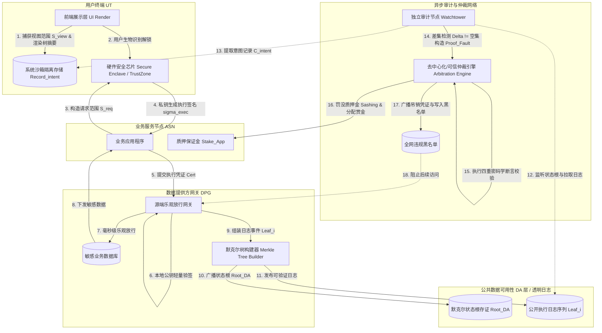
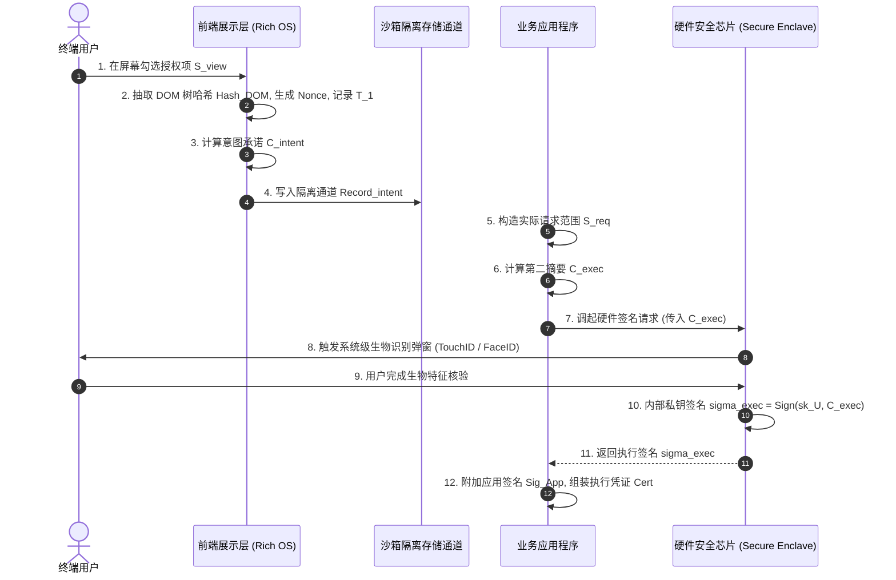
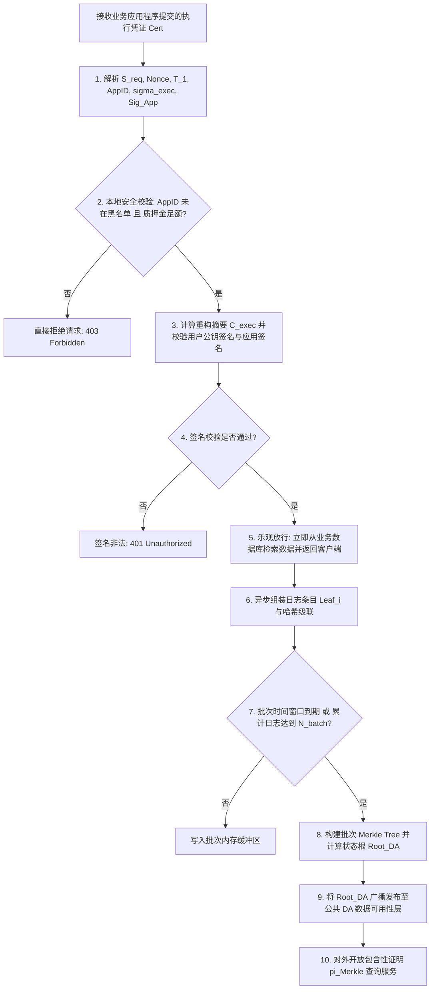
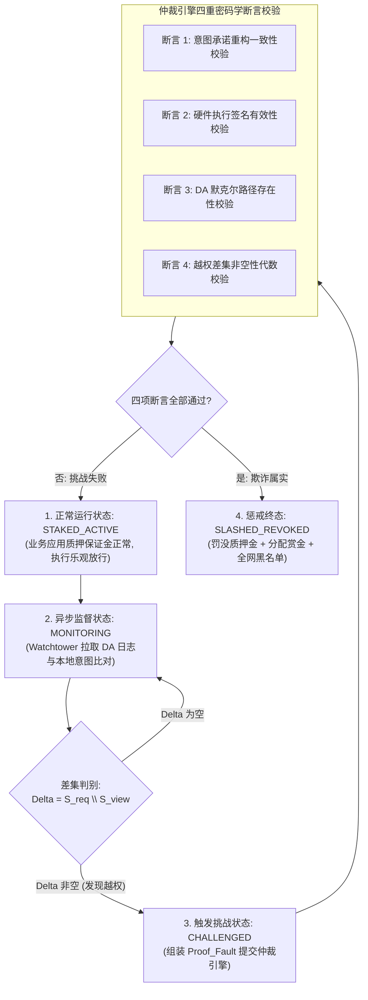

|                                  |
|:--------------------------------:|
| **深圳数联天下智能科技有限公司** |
|      **专利技术交底书模板**      |

编号：HZL-02-R01 版本号：2022

**专利申请用技术交底书**

***以下带 \* 信息务必填写，涉及奖金的发放，谢谢！~***

交底书名称：一种防前端篡改的乐观数据授权与违规仲裁方法及系统

\*\*发明人姓名：陈少伟

\*\*第一发明人姓名和身份证号码：陈少伟（371102198410187111）

申请人：深圳数联天下智能科技有限公司

通信地址（邮编）：（递交时填写）

\*\*交底书撰写人：陈少伟

\*\*联系电话：13662678920

\*\*Email：shaowei.chen@clife.cn

---

**交底技术书信息登记页**

***以下带 \* 信息务必填写，方便进行知识产权维护***

\*\*提交部门：平台建设中心-研发管理部-安全运维组

\*\*项目号：（内部维护时填写）

\*\*项目名称/所属产品(可多个，靠近公司的主营业务)：数据安全与隐私保护、医疗数据安全治理平台、PrivShield 跨域访问控制与隐私治理系统

\*\*技术应用领域：大数据、人工智能（AI）、智慧医疗、移动终端安全、分布式密码学、访问控制、区块链与数据可用性治理

\*\*相关技术方向：硬件安全扩展（ARM TrustZone / Apple Secure Enclave / Android StrongBox / TPM）、非对称加密签名（WebAuthn / Passkey）、数据可用性层（Data Availability Layer）、默克尔树证明（Merkle Tree Proof）、乐观并发授权（Optimistic Authorization）、密码学欺诈证明（Fault Proof）、去中心化/零信任仲裁状态机

\*\*技术方案概述：
本发明提出一种防前端篡改的乐观数据授权与违规仲裁方法及系统。针对现有移动终端硬件安全芯片签名授权机制中存在的“前端盲签越权（所见非所签 WYSIWYS 缺陷）”以及“跨域强同步校验导致的端到端高延迟与低吞吐”两大核心瓶颈，本发明首创了“双轨意图绑定、数据源端乐观放行、数据可用性（DA）默克尔审计与异步欺诈挑战（Fault Proof）仲裁”的闭环技术架构。
在客户端前端展示层响应用户授权操作时，捕获界面渲染树特征值、用户选定的第一授权范围（意图范围 $S_{\text{view}}$）、随机数 Nonce 与时间戳，计算第一摘要（意图承诺 $C_{\text{intent}}$）并写入本地系统级沙箱隔离通道；业务程序构造包含真实请求范围（$S_{\text{req}}$）的第二摘要（$C_{\text{exec}}$），调用硬件安全芯片经生物识别门禁后利用内部私钥签名生成执行凭证（$\text{Cert}$）；数据提供方源端网关基于用户与应用公钥验证 $\text{Cert}$ 合法后，无需跨域同步反查认证中心，直接执行毫秒级“乐观数据放行”，并将授权执行哈希组装为默克尔树叶子节点发布至公共数据可用性（DA）审计层；独立审计节点（Watchtower）在设定的挑战窗口期内异步拉取 DA 审计日志，结合本地意图承诺执行集合差集分析 $\Delta = S_{\text{req}} \setminus S_{\text{view}}$；一旦判定存在越权或篡改，审计节点自动构建包含意图承诺、执行凭证及默克尔包含性证明的密码学欺诈证明（$\text{Proof}_{\text{Fault}}$）提交至仲裁引擎，触发对恶意业务程序的质押金惩戒罚没（Slashing）、全网黑名单阻断与凭证吊销。本发明在完全兼容通用消费级智能终端（无需 TUI 硬件改造）的前提下，从数学上彻底封堵了前端篡改与盲签越权路径，同时将跨域数据授权延迟降低 1 至 2 个数量级，实现了性能与安全性的双重飞跃。

---

**缩略语和关键术语定义列表**

> 1. **WYSIWYS（What You See Is What You Sign，所见即所签）**：密码学与安全人机交互原则，指用户在屏幕上所看到的授权内容必须与底层硬件私钥实际签署的数据载荷完全一致。
> 2. **TUI（Trusted User Interface，可信用户界面）**：由底层安全硬件（如 ARM TrustZone Secure World）直接控制显示控制器与触摸屏驱动的专用隔离交互界面，主操作系统（Rich OS）无法拦截或篡改其渲染内容。
> 3. **Secure Enclave / StrongBox / TPM（硬件安全隔离区）**：集成于移动终端或计算设备内的物理隔离微处理器，具备独立的内部存储器与硬件加密引擎，私钥生成于其内部且不可导出，仅响应经本地生物识别（指纹/FaceID）解锁后的签名请求。
> 4. **Passkey / WebAuthn（Web 认证标准 / 密钥凭证）**：基于 FIDO2 标准与公私钥密码学的无密码身份认证协议，通过终端安全芯片保管私钥，对外提供防钓鱼的非对称签名认证。
> 5. **DA（Data Availability Layer，数据可用性层）**：一种分布式高吞吐日志发布与存证层，保证发布的数据区块在全网可见且不可被隐匿或单方面篡改。
> 6. **Fault Proof / Fraud Proof（欺诈证明 / 故障证明）**：一种密码学证明机制，审计方在发现违规执行状态时，构造能够自包含证明非法转换过程的紧凑数据包，提交给仲裁环境进行确定性裁决。
> 7. **Merkle Tree & Merkle Proof（默克尔树与默克尔路径证明）**：一种哈希树形数据结构，其叶子节点为数据项哈希，非叶子节点为子节点级联哈希。默克尔路径证明由对数级别（$O(\log N)$）的兄弟哈希序列构成，用于证明某笔交易或日志包含于根哈希 $\text{Root}$ 中。
> 8. **Optimistic Authorization（乐观数据授权）**：一种并发访问控制范式，在接收到具有密码学签名的凭证后，数据源端预先假定前端未发生违规篡改并立即放行数据，将强校验与合规仲裁移至异步挑战阶段。
> 9. **Watchtower（瞭望塔 / 独立审计节点）**：常驻运行的第三方或本地审计代理程序，负责持续监听公共 DA 层日志，与本地隔离意图记录比对并自动发起欺诈挑战。
> 10. **Nonce（Number used once，一次性密码学随机数）**：由密码学安全伪随机数生成器（CSPRNG）生成的唯一随机序列，用于绑定单次授权会话并防御重放攻击。
> 11. **Slashing（惩戒罚没机制）**：博弈论与去中心化安全中的经济惩治机制，当系统通过密码学校验判定节点存在恶意作恶行为时，自动没收该节点预先锁定的押金（Stake）。
> 12. **CSPRNG（Cryptographically Secure Pseudo-Random Number Generator）**：密码学安全伪随机数生成器，用于生成具有不可预测性与抗前向推导性的高熵随机数。
> 13. **IdP（Identity Provider，身份与凭据提供方）**：负责跨域系统中主体身份认证、Token 签发与权限元数据管理的中心化或分布式服务。
> 14. **DOM / Render Tree Hash（渲染树哈希）**：对前端用户界面层实际渲染节点的层级结构、文本属性及可见性特征进行规范化序列化后计算的密码学哈希值。

---

# 1. 相关技术背景（背景技术），与本发明最相近似的现有实现方案（现有技术）

## 1.1 背景技术

随着移动终端安全硬件技术的普及，以 Apple Secure Enclave、ARM TrustZone、Android StrongBox 以及 PC 端的 TPM（Trusted Platform Module）为代表的硬件隔离芯片，配合 FIDO2、WebAuthn 及 Passkey 行业标准，已广泛应用于移动医疗健康管理、跨机构敏感数据协作、个人金融交易以及高安全级企业办公等场景中的用户身份核验与细粒度数据授权。

在典型的数据授权交互流程中，用户在移动终端应用（如健康医疗 App、政务协同客户端）中勾选需要共享的敏感数据范围（例如：“仅允许访问近7日健康步数与心率”，而“禁止访问既往病历与诊断报告”），随后系统触发系统级生物识别弹窗（指纹识别 TouchID 或人脸识别 FaceID），验证通过后调用底层安全芯片利用用户私钥对授权请求载荷进行数字签名，生成授权凭据并发送至数据提供方，数据提供方验签成功后下发数据。

然而，在面对复杂的网络威胁与终端逆向篡改时，现有的硬件签名授权体系在架构与工程实践中面临着两大相互冲突的固有缺陷：

1. **终端“盲签”漏洞与所见非所签（WYSIWYS 失效）**：
   硬件安全芯片属于物理隔离的封闭微计算单元，其算力与指令集受限，无法直接解析主操作系统（Rich OS，如 Android、iOS、Windows）复杂的应用层 UI 语义、DOM 树结构或图形渲染图层。硬件安全芯片仅能被动接收主操作系统环境传递的字节数组或哈希摘要。当恶意攻击者通过动态 Hooking、应用重打包、前端 XSS 注入或恶意 SDK 篡改主操作系统应用层逻辑时，业务前端在屏幕上向用户展示的是低敏感权限“权限 A（如 `scope: user.basic_profile`）”，诱导用户完成指纹或人脸生物识别；但底层业务代码却恶意构造了包含高敏感越权项“权限 A+B+C（如包含 `scope: medical.clinical_records, financial.account`）”的签名载荷。由于硬件芯片无法感知屏幕的真实渲染内容，安全芯片在用户解锁后对恶意摘要执行了合法私钥签名。此时，用户自以为仅授权了基础信息，数据提供方收到的是合法的硬件签名，系统无法在事前感知越权行为，导致重大敏感数据泄露。
2. **传统防篡改机制面临“硬件改造成本过高”与“跨域同步强校验导致高延迟”的双重困境**：
   - 为防御前端篡改，学术界与部分特种安全领域提出了**可信用户界面（Trusted User Interface, TUI）**方案。该方案要求由安全硬件完全接管屏幕显示控制器与触控输入，绕过主操作系统渲染。然而，TUI 依赖专有硬件架构与系统定制，绝大多数商用消费级智能手机、平板和个人电脑无法支持第三方应用自定义 TUI，改造成本极其高昂且用户交互体验卡顿，无法在通用开放生态中普及推广。
   - 另一方面，工业界主要依赖**中心化身份提供方（IdP）或基于 OAuth 2.0 / OpenID Connect 的跨域同步握手方案**。在该方案中，数据提供方在接收到访问请求时，必须通过同步网络调用向中心化 IdP 或会话认证服务器发起实时反查，以核实用户的真实授权范围。在跨域多方协同、分布式微服务网关及高频数据交换场景中，这种长链路的多次网络同步往返引入了高达数百毫秒乃至数秒的延迟，成为分布式系统的吞吐瓶颈；一旦中心化认证节点遭遇网络分区或性能抖动，整个跨域数据共享链路将陷入停滞。

因此，如何在**不依赖专用 TUI 硬件改造、完全兼容现有数十亿消费级商用终端**的前提下，彻底消除硬件芯片的“盲签”越权漏洞，并打破传统“强同步认证导致高延迟”的性能瓶颈，成为数据安全与隐私保护领域亟待突破的关键核心技术。

---

## 1.2 与本发明相关的现有技术一：基于硬件安全芯片与 WebAuthn/Passkey 的同步签名授权方案

### 1.2.1 现有技术一的技术方案

与本发明最相近的第一类现有技术为基于硬件安全芯片配合 FIDO2/WebAuthn 标准的同步签名授权方案（其代表性技术公开文献如中国发明专利申请 **CN113420485A《一种基于 FIDO2 的用户身份认证与数据授权方法及系统》**、**CN115811252A《一种基于硬件安全芯片的安全签名方法及终端设备》**）。

该类现有技术的基本工作原理如下：
1. **授权信息展示**：客户端 App 在主操作系统（Rich OS）的应用层展示授权选项页面，用户通过勾选确认授权范围 $S$；
2. **构造签名载荷**：客户端应用层将授权范围 $S$、应用标识 $\text{AppID}$ 与服务端生成的随机挑战值 $\text{Challenge}$ 拼接为字节流，计算哈希摘要 $H = \text{SHA256}(S \parallel \text{AppID} \parallel \text{Challenge})$；
3. **调用安全芯片**：主操作系统调起系统级生物识别弹窗，用户完成指纹或人脸核验；
4. **硬件私钥签名**：硬件安全芯片（Secure Enclave）接收主操作系统传入的哈希摘要 $H$，调用芯片内部安全保存的用户私钥 $sk_U$ 进行 ECDSA 或 Ed25519 签名，生成签名值 $\sigma$；
5. **同步提交与验签**：客户端将包含授权范围 $S$ 与签名 $\sigma$ 的请求同步提交给数据服务端；数据服务端从数据库读取用户公钥 $pk_U$，校验 $\text{Verify}(pk_U, H, \sigma)$；验签通过后，数据服务端认为该授权请求完全代表用户的真实意愿，向客户端返回请求的敏感数据。

### 1.2.2 现有技术一的缺点

以 CN113420485A 及标准 WebAuthn 授权为代表的方案存在以下严重缺陷：

1. **存在固有“盲签”漏洞，无法防御前端恶意劫持与篡改**：
   硬件安全芯片仅负责执行密码学运算，其签名过程与前端屏幕的实际渲染完全解耦。攻击者只需在前端修改传入安全芯片的签名载荷字符串（例如将请求从 `read:profile` 替换为 `read:profile,read:records,export:all`），硬件芯片即会对篡改后的载荷正常签名。数据服务端收到签名后，由于公钥验签完全合法，无法辨别该签名是被前端劫持的恶意产物还是用户的真实意图。
2. **事后不可审计与举证责任倒置**：
   在发生数据泄露纠纷时，由于服务端仅保存了包含恶意越权范围的硬件签名凭证，在法律与合规层面该签名在密码学上归属于用户私钥。用户无法向监管机构举证“当时屏幕上实际只勾选了基础权限”，导致用户陷入被动举证的困境，恶意应用开发者可轻易逃脱法律追责。
3. **缺乏越权行为的自动化发现与经济制约机制**：
   现有技术属于单向点对点认证，缺乏去中心化或第三方的异步监督网络，一旦恶意应用通过盲签获取到超出授权的数据，数据端与用户端均无法获知越权事实，无法形成“发现-举证-仲裁-惩戒”的完整安全闭环。

---

## 1.3 与本发明相关的现有技术二：基于硬件可信 UI（TUI）或跨域强同步 IdP 会话校验方案

### 1.3.1 现有技术二的技术方案

第二类现有技术主要包含两种分支方案：
- **分支 A（硬件 TUI 方案，如 CN109840428A《基于可信执行环境的安全显示与输入交互方法》）**：在终端启动授权时，主操作系统将显示控制权完全移交给安全操作系统（Secure OS），由运行在 ARM TrustZone 内的安全驱动直接向屏幕显存写入像素，并在安全环境中捕获触控坐标。安全芯片直接将用户在 TUI 界面确认的内容作为签名输入，确保所见即所签。
- **分支 B（跨域强同步 IdP 校验方案，如 OAuth 2.0 Token Introspection / RFC 7662）**：客户端不直接向数据源提供自包含签名，而是引导用户重定向至中心化 IdP 页面授权，获取短期访问令牌（Access Token）。数据源在接收到令牌后，必须通过同步 Backchannel RPC 接口向 IdP 发起实时内省（Introspection）请求，确认 Token 的真实有效性与精确 Scope 列表。

### 1.3.2 现有技术二的缺点

1. **TUI 方案硬件改造成本极高，严重缺乏普适性**：
   TUI 方案需要屏幕驱动硬件、GPU 及触控芯片的原生隔离架构支持。当前市场上除极少数特定安全金融 POS 机外，绝大多数商用智能手机（包括 iPhone 及各类主流 Android 设备）均未对第三方应用开放动态 TUI 定制接口。强行要求 TUI 将导致方案无法在普通消费级设备上运行；且 TUI 切换时存在明显的黑屏、闪烁和系统上下文切换开销，用户体验极差。
2. **同步 IdP 方案跨域延迟高、单点性能瓶颈与脆弱性**：
   在高并发分布式微服务或跨机构数据协同场景下，每个数据访问请求都需要数据提供方与中心化 IdP 进行一次同步网络握手（通常耗时 50ms ~ 300ms）。当并发请求达到万级 QPS 时，中心化 IdP 将面临巨大的计算与网络 IO 压力，成为全链路的单点瓶颈（Single Point of Failure）；一旦网络出现抖动或分区，会导致大面积数据访问超时阻断。

---

## 1.4 本发明与现有技术的对比分析

为了全面且清晰地阐明本发明的创新性与技术优势，将本发明方案与上述两类现有技术进行多维度对比，如表 1 所示：

**表 1：本发明与现有技术方案的多维度对比分析表**

| 对比维度 | 现有技术一（通用硬件安全芯片 + WebAuthn） | 现有技术二-A（硬件 TUI 可信显示） | 现有技术二-B（同步中心化 OAuth 2.0 / IdP） | **本发明技术方案（PrivShield 乐观授权与仲裁系统）** |
| :--- | :--- | :--- | :--- | :--- |
| **抗前端篡改能力** | **完全无防护**（存在盲签漏洞，前端可肆意放大 scope） | **强**（纯硬件隔离屏幕渲染） | **中等**（依赖中心化托管页面，但存在中间人与会话劫持风险） | **极强**（双轨密码学生成 + 隔离通道存储 + 欺诈证明） |
| **硬件普适性与改造成本** | 兼容通用安全芯片（但安全性存在缺陷） | **极差**（依赖专用硬件显示控制器，无法普及消费级终端） | 兼容普通设备（不依赖硬件安全芯片） | **极佳**（完全基于现有普通手机商用 Secure Enclave/TrustZone，**零硬件改造**） |
| **数据源端授权延迟** | 低（仅本地单次验签，但牺牲安全性） | 中等（UI 上下文切换有数百毫秒卡顿） | **极高**（跨网络多次同步握手与 RPC 反查，延迟 100ms~1s+） | **极低**（源端乐观毫秒级放行，本地公钥微秒级校验，免实时网络反查） |
| **系统并发吞吐量 (QPS)** | 高（受限于数据源单点验签） | 中等（受限于安全操作系统调度性能） | **低**（受限于中心化 IdP 的集中式吞吐瓶颈） | **极高**（源端无状态并发放行，单机轻松突破万级 QPS） |
| **违规发现与惩戒闭环** | **无**（事后无法发现越权，责任被推给用户） | 事前物理阻断（无事后惩戒追责机制） | 事中中心化拦截（无去中心化博弈惩戒） | **全自动闭环**（Watchtower 异步挑战 + 默克尔证明 + 质押金罚没 + 全网黑名单） |
| **审计存证与透明度** | 不透明（依赖单边日志，容易被篡改删除） | 封闭于单设备内部 | 依赖中心化平台内部私有账本 | **公开不可篡改**（基于数据可用性 DA 层与默克尔状态根存证） |
| **举证责任** | 用户承担（面临“签名即认可”的不公正举证困境） | 依赖硬件厂商审计日志 | 依赖平台日志公正性 | **密码学自证明**（意图承诺原像自证明，用户免责） |

---

# 2. 本发明技术方案的详细阐述（发明内容）

## 2.1 本发明所要解决的技术问题（发明目的）

针对现有技术中存在的上述缺陷与矛盾，本发明旨在提供一种防前端篡改的乐观数据授权与违规仲裁方法及系统，具体解决以下技术问题：

1. **消除硬件安全芯片盲签漏洞与所见非所签（WYSIWYS）问题**：在不依赖专用硬件 TUI 的前提下，通过应用层渲染树特征抽取与双轨密码学生成机制，实现用户屏幕所见意图（Intent）与底层硬件执行载荷（Execution）的强密码学绑定，使任何前端篡改行为在事后均可被数学证明。
2. **消除跨域数据授权的高延迟与中心化瓶颈问题**：打破传统“先强同步核验再放行数据”的低效范式，构建基于公钥验签与公共数据可用性（DA）日志发布的数据源端“乐观放行”机制，将跨域授权的数据交付延迟从数百毫秒压缩至 5 毫秒以内，极大提升高并发访问吞吐量。
3. **构建轻量、确定性且不可抵赖的异步欺诈证明（Fault Proof）挑战机制**：基于默克尔树包含性证明与集合差集代数运算，使独立审计节点（Watchtower）能够在异步挑战窗口期内快速构造紧凑的故障证明，实现对越权行为的自动化发现与链上/链下零信任判定。
4. **构建基于经济博弈与资质惩戒的违规治理闭环**：通过预先质押保证金（Stake）、欺诈挑战成功后的罚没分润（Slashing）以及全网黑名单凭证吊销，从博弈论层面使攻击者的违规成本远超潜在非法获益，从根本上遏制恶意软件的前端篡改动机。

---

## 2.2 本发明提供的完整技术方案（发明方案）

### 2.2.1 系统总体拓扑结构与核心实体交互架构

本发明提出的系统总体拓扑结构如图 1 所示，主要包含以下七大核心实体：

1. **用户终端（User Terminal, UT）**：运行在通用消费级操作系统（如 Android、iOS、HarmonyOS 等）上的移动设备或计算机，包括：
   - **前端展示层（UI Render Layer）**：负责渲染授权交互页面，捕获用户的真实视觉确认操作及渲染树元数据；
   - **系统沙箱隔离存储（Sandbox Isolated Storage）**：受主操作系统内核严格隔离保护的只读/单向追加本地存储区域（或由独立审计信道直连）；
   - **硬件安全芯片（Secure Enclave / TrustZone）**：集成于终端内的物理隔离安全处理器，负责保存用户授权私钥 $sk_U$，并在生物识别通过后执行签名。
2. **业务服务节点（Application Service Node, ASN）**：由第三方应用开发者运营的业务服务端，负责组装授权凭证、向数据提供方申请数据，并预先在仲裁系统锁定质押保证金 $Stake_{\text{App}}$。
3. **数据提供方网关（Data Provider Gateway, DPG）**：敏感数据（如电子病历、体检指标、金融账单）的保管方与服务出口，负责执行轻量级签名校验、乐观放行数据并向 DA 层发布执行日志。
4. **公共数据可用性层（Data Availability Layer, DA Layer）**：基于去中心化网络、透明日志服务（Certificate Transparency 架构）或区块链账本构建的公开、不可篡改且具备高吞吐的数据发布层，负责发布授权执行日志的默克尔状态根 $\text{Root}_{\text{DA}}$ 并向全网提供包含性路径证明 $\pi_{\text{Merkle}}$。
5. **独立审计节点（Watchtower / 瞭望塔）**：常驻运行的审计守护进程（可部署于用户设备后台、受信任的第三方安全机构或去中心化审计网络），负责持续监听 DA 层日志并在挑战期内发起欺诈挑战。
6. **仲裁引擎（Arbitration Engine / Smart Contract）**：运行于智能合约、可信执行环境（TEE）或分布式仲裁委员会中的确定性状态机裁决模块，负责验证欺诈证明并执行经济罚没与凭证吊销。

---

### 2.2.2 步骤 S1：前端展示层双轨意图承诺生成与沙箱隔离存储

当用户在客户端应用的前端界面进行授权确认时，系统执行意图捕获与双轨承诺生成，如图 2 所示，具体包括：

1. **用户视图授权范围捕获**：
   用户在屏幕上交互勾选或确认授权范围，前端展示层获取用户视觉可见的授权范围列表 $S_{\text{view}}$（例如：$S_{\text{view}} = \{\text{"user.basic\_profile"}, \text{"health.daily\_steps"}\}$）。
   需要说明的是，本发明所述前端展示层为**操作系统提供并背书的系统级可信授权交互组件**（如 Android 系统权限弹窗服务、iOS 系统账号授权面板、或经系统签名校验与运行时完整性度量的受信 WebView 容器），其渲染进程与业务应用程序进程相互隔离，业务应用程序无法通过动态 Hooking、界面注入或事件重分发篡改其渲染内容与用户确认事件；该组件无需任何专用 TUI 显示硬件，为现代商用操作系统的标准能力。
2. **渲染树特征与环境元数据抽取**：
   前端展示层在捕获用户点击“确认授权”事件的瞬间，由渲染引擎（如 WebKit、Blink 或 Flutter Engine）同步提取当前屏幕视图的上下文特征，包括：
   - 视图渲染树特征哈希 $\text{Hash}_{\text{DOM}}$：对当前展示授权弹窗的 DOM 树结构、所有文本节点的内容、控件坐标与可见性样式属性（`display`, `opacity`, `visibility`）进行规范化序列化后计算的哈希值，用于从物理层证明屏幕上未发生恶意 CSS 遮罩、不可见字体或透明点击劫持（Clickjacking）；
   - 一次性密码学随机数 $Nonce$：由操作系统内核提供的密码学安全伪随机数生成器（CSPRNG）在本地生成，长度至少为 128 位；
   - 意图生成物理时间戳 $T_1$；
   - 应用程序唯一注册标识 $\text{AppID}$。
3. **计算第一摘要（意图承诺 $C_{\text{intent}}$）**：
   前端展示层依据式 (1) 计算意图承诺：

$$
C_{\text{intent}} = \mathcal{H}\Big( \text{Canonical}(S_{\text{view}}) \parallel \text{Hash}_{\text{DOM}} \parallel Nonce \parallel T_1 \parallel \text{AppID} \Big) \tag{1}
$$

式中，$\mathcal{H}(\cdot)$ 为抗碰撞密码学哈希函数（如 SHA-256 或 SM3），$\text{Canonical}(\cdot)$ 表示对集合元素按字典序进行确定性序列化编码。
4. **隔离通道存储**：
   前端展示层将意图记录元组 $\text{Record}_{\text{intent}} = \langle Nonce, C_{\text{intent}}, S_{\text{view}}, \text{Hash}_{\text{DOM}}, T_1, \text{AppID} \rangle$ 写入系统级安全沙箱隔离存储（例如通过 Android ContentProvider 隔离通道、iOS App Group 独立沙箱），或通过端对端加密通道直接异步推送至与用户绑定的独立 Watchtower 审计信道。所述隔离存储通道对写入方执行操作系统级调用者身份签名校验，仅接受所述前端展示层（系统可信授权交互组件）以单向追加方式写入单次记录；业务应用程序（主进程）对该存储**不具备任何写入、修改或删除权限**，从系统权限层面杜绝恶意应用伪造意图承诺或覆盖既有意图记录。

---

### 2.2.3 步骤 S2：硬件安全芯片物理隔离签名与执行凭证（Cert）组装

与展示层的意图捕获并行，业务应用程序构造实际向底层发起签名的载荷，具体包括：

1. **构造请求执行范围与第二摘要**：
   业务应用程序构造向数据提供方实际请求的数据范围列表 $S_{\text{req}}$。在正常未篡改场景下 $S_{\text{req}} = S_{\text{view}}$；若前端遭受恶意劫持或存在恶意后门代码，攻击者构造的 $S_{\text{req}}$ 将包含超出屏幕展示的高敏感越权字段（例如：$S_{\text{req}} = S_{\text{view}} \cup \{\text{"medical.clinical\_records"}, \text{"financial.account\_balance"}\}$）。
   业务程序使用相同的 $Nonce$、$T_1$ 与 $\text{AppID}$，按式 (2) 计算第二摘要（执行承诺 $C_{\text{exec}}$）：

$$
C_{\text{exec}} = \mathcal{H}\Big( \text{Canonical}(S_{\text{req}}) \parallel Nonce \parallel T_1 \parallel \text{AppID} \Big) \tag{2}
$$

2. **硬件芯片生物识别门禁与私钥签名**：
   业务程序调用操作系统的硬件安全芯片接口（如 Android KeyStore / iOS LocalAuthentication），系统弹出硬件级生物识别确认窗口（指纹、3D结构光人脸识别或安全 PIN 码）。
   生物识别通过后，硬件安全芯片内部的微控制器被激活，使用受芯片物理保护不可导出的用户私钥 $sk_U$，对第二摘要 $C_{\text{exec}}$ 进行非对称加密签名，得到执行签名 $\sigma_{\text{exec}}$，如式 (3) 所示：

$$
\sigma_{\text{exec}} = \text{Sign}_{sk_U}(C_{\text{exec}}) \tag{3}
$$

3. **业务应用签名与执行凭证组装**：
   业务程序使用其在仲裁系统登记备案的应用签名私钥 $sk_{\text{App}}$，对本次请求元数据进行签名，得到防伪造应用签名 $\text{Sig}_{\text{App}} = \text{Sign}_{sk_{\text{App}}}(C_{\text{exec}} \parallel \sigma_{\text{exec}})$。
   业务程序将上述字段组装为自包含执行凭证 $\text{Cert}$，如式 (4) 所示：

$$
\text{Cert} = \Big\langle \text{Canonical}(S_{\text{req}}), Nonce, T_1, \text{AppID}, \sigma_{\text{exec}}, \text{Sig}_{\text{App}}, pk_U \Big\rangle \tag{4}
$$

---

### 2.2.4 步骤 S3：数据提供方（源端网关）公钥验签与乐观极速放行

业务应用程序将执行凭证 $\text{Cert}$ 随数据访问请求发送至数据提供方网关（DPG）。数据提供方网关采用“乐观放行”架构执行极速响应，如图 3 所示，具体包括：

1. **本地无状态公钥签名校验**：
   数据提供方网关接收到请求后，**无需向任何中心化 IdP 或认证服务器发起网络 RPC 同步反查**，仅在网关本地执行纯算术级的公钥验签：
   - 重新计算执行摘要：$C_{\text{exec}}' = \mathcal{H}(\text{Canonical}(S_{\text{req}}) \parallel Nonce \parallel T_1 \parallel \text{AppID})$；
   - 验证用户硬件签名：$\text{Verify}(pk_U, C_{\text{exec}}', \sigma_{\text{exec}}) == \text{True}$；
   - 验证业务应用签名：$\text{Verify}(pk_{\text{App}}, C_{\text{exec}}' \parallel \sigma_{\text{exec}}, \text{Sig}_{\text{App}}) == \text{True}$；
   - 校验应用质押状态与黑名单：在本地缓存的只读黑名单布隆过滤器与质押名单中确认 $\text{AppID} \notin \text{Blacklist}$ 且 $\text{Stake}_{\text{App}} \ge Stake_{\text{threshold}}$。
2. **乐观数据毫秒级放行**：
   一旦上述本地轻量验签全部通过，数据提供方网关**立即将 $S_{\text{req}}$ 对应的敏感业务数据组装为响应报文返回给业务应用程序**，全流程端到端耗时控制在 5ms 以内，满足高并发在线业务对极低延迟的要求。
3. **生成授权执行日志事件**：
   网关在放行数据的同时，异步将本次授权执行事件封装为标准化审计日志条目，并计算其日志叶子节点哈希 $\text{Leaf}_i$，如式 (5) 所示：

$$
\text{Leaf}_i = \mathcal{H}\Big( \text{AppID} \parallel \mathcal{H}(\text{Canonical}(S_{\text{req}})) \parallel Nonce \parallel T_1 \parallel T_{\text{access}} \parallel \mathcal{H}(\sigma_{\text{exec}}) \Big) \tag{5}
$$

式中，$T_{\text{access}}$ 为网关放行数据的系统物理时间戳。

---

### 2.2.5 步骤 S4：批次聚合与数据可用性（DA）默克尔树构建及状态根广播

为了防止数据提供方或业务方事后篡改或隐匿访问日志，系统引入数据可用性（DA）层进行不可篡改存证：

1. **时间窗口批次聚合**：
   数据提供方网关在预设的时间窗口 $\Delta t_{\text{batch}}$（例如每 10 秒）或当累计的日志条目达到批量阈值 $N_{\text{batch}}$（例如 1000 笔）时，将批次内的所有日志叶子节点序列 $\mathcal{L} = \{\text{Leaf}_0, \text{Leaf}_1, \dots, \text{Leaf}_{K-1}\}$ 构建为一棵标准完全二叉默克尔树（Merkle Tree）。
2. **默克尔状态根计算**：
   默克尔树中非叶子节点由其左右子节点级联哈希计算生成：

$$
\text{Node}_{j, k} = \mathcal{H}(\text{Node}_{j+1, 2k} \parallel \text{Node}_{j+1, 2k+1}) \tag{6}
$$

最终计算得到该批次唯一的默克尔状态根 $\text{Root}_{\text{DA}}$。
3. **广播至公共数据可用性（DA）层**：
   数据提供方网关将元组 $\langle \text{Root}_{\text{DA}}, \text{BatchID}, T_{\text{batch}}, \text{DPG\_ID}, \text{Sig}_{\text{DPG}} \rangle$ 广播发布至公共 DA 层（如以太坊 Layer2 Blob、Celestia、公开可验证 Certificate Transparency 日志系统或联盟链智能合约）。同时，网关向全网开放提供日志原象查询接口与针对任意 $\text{Leaf}_i$ 的默克尔包含性路径证明 $\pi_{\text{Merkle}}(i) = \{\text{Sibling}_0, \text{Sibling}_1, \dots, \text{Sibling}_{d-1}\}$，满足式 (7)：

$$
\text{VerifyMerkle}(\text{Root}_{\text{DA}}, \text{Leaf}_i, \pi_{\text{Merkle}}(i)) \equiv \text{True} \tag{7}
$$

---

### 2.2.6 步骤 S5：独立审计节点（Watchtower）异步监测与越权集合判别

独立审计节点（Watchtower）在设定的挑战窗口期 $T_{\text{window}}$（例如 24 小时至 7 天）内，异步执行无状态的越权监测，如图 4 所示，具体包括：

1. **审计日志与意图承诺关联检索**：
   Watchtower 持续监听 DA 层广播的默克尔状态根 $\text{Root}_{\text{DA}}$，并拉取批次日志中的叶子数据。通过匹配日志中的 $Nonce$ 与 $\text{AppID}$，Watchtower 从受保护的隔离通道中检索到用户终端本地生成的对应意图记录 $\text{Record}_{\text{intent}} = \langle Nonce, C_{\text{intent}}, S_{\text{view}}, \text{Hash}_{\text{DOM}}, T_1, \text{AppID} \rangle$。Watchtower 与用户终端在首次绑定时通过 mTLS 双向证书握手建立加密检索信道，每次检索请求均经用户终端本地授权确认并留痕，防止意图记录被第三方窃取。
2. **多维一致性与越权集合差集运算**：
   Watchtower 对比执行凭证中的 $S_{\text{req}}$ 与用户实际确认的 $S_{\text{view}}$，执行集合差集分析：

$$
\Delta = S_{\text{req}} \setminus S_{\text{view}} = \big\{ s \mid s \in S_{\text{req}} \wedge s \notin S_{\text{view}} \big\} \tag{8}
$$

3. **违规事件判定矩阵**：
   判定所依赖的两项基准值按如下方式公开登记与维护：
   - $\text{Hash}_{\text{approved}}$：业务应用在仲裁引擎登记质押保证金时，须同步备案其标准授权界面的渲染树基准哈希 $\text{Hash}_{\text{approved}}$（在标准化采集环境中对授权弹窗的结构骨架、可见文本与可见性样式进行固化采样，并经仲裁注册表多方核验）；应用版本更新导致授权界面变更时须重新备案。Watchtower 从仲裁注册表公开拉取该基准值；为容忍动态文案差异，比对时采用结构骨架哈希而非逐字节哈希；
   - $\delta T_{\text{max\_valid}}$：仲裁注册表按应用或按数据域公示的凭证最大有效时长（例如 300 秒），$T_{\text{access}}$ 取自 DA 层存证的网关放行时间戳，$T_1$ 取自隔离通道中的意图记录。

   Watchtower 按照表 2 所示的违规判定矩阵进行判定：

**表 2：Watchtower 违规事件判定矩阵**

| 违规类型标识 | 判定前置条件 | 违规性质与安全风险说明 |
| :--- | :--- | :--- |
| **TYPE-1（范围扩大越权）** | $\Delta \neq \emptyset$ | 前端恶意篡改签名载荷，实际请求了用户在屏幕上未勾选的高敏感字段。 |
| **TYPE-2（DOM欺诈劫持）** | $\text{Hash}_{\text{DOM}} \neq \text{Hash}_{\text{approved}}$ | 前端通过恶意 CSS 遮罩或隐藏层篡改了界面语义（点击劫持）。 |
| **TYPE-3（时间窗超期）** | $T_{\text{access}} - T_1 > \delta T_{\text{max\_valid}}$ | 业务程序私自截留凭证并在超出合法授权有效期后违规重放使用。 |
| **TYPE-4（身份仿冒伪造）** | $\text{Cert}.\text{AppID} \neq \text{Record}_{\text{intent}}.\text{AppID}$ | 恶意应用盗用其他白名单应用的身份与渠道窃取数据。 |

---

### 2.2.7 步骤 S6：密码学欺诈证明（Fault Proof）构造

一旦 Watchtower 判定命中上述任一违规类型（以最典型的 TYPE-1 范围扩大越权为例，$\Delta \neq \emptyset$），Watchtower 立即在挑战期内自动组装紧凑的欺诈证明数据结构 $\text{Proof}_{\text{Fault}}$，如式 (9) 所示：

$$
\text{Proof}_{\text{Fault}} = \begin{pmatrix}
\text{IntentSection}: & \big\langle S_{\text{view}}, \text{Hash}_{\text{DOM}}, Nonce, T_1, \text{AppID}, C_{\text{intent}} \big\rangle \\
\text{ExecSection}:   & \big\langle S_{\text{req}}, \sigma_{\text{exec}}, \text{Sig}_{\text{App}}, pk_U, pk_{\text{App}} \big\rangle \\
\text{DAPathProof}:   & \big\langle \text{Leaf}_i, \pi_{\text{Merkle}}(i), \text{Root}_{\text{DA}}, \text{BatchID}, T_{\text{access}} \big\rangle \\
\text{ViolationClaim}:& \big\langle \text{ViolationType}=\text{"TYPE-1"}, \Delta = S_{\text{req}} \setminus S_{\text{view}} \big\rangle
\end{pmatrix} \tag{9}
$$

该欺诈证明具备完全的**密码学自证明（Self-Verifiable）**特性，其总数据量通常不超过数 KB，能够以极低开销在智能合约或仲裁引擎中单步执行确定性验证。

---

### 2.2.8 步骤 S7：去中心化/可信仲裁引擎断言验证、状态机流转与经济罚没/黑名单惩戒

Watchtower 将 $\text{Proof}_{\text{Fault}}$ 提交至仲裁引擎（如部署在区块链上的仲裁智能合约或运行在可信执行环境 TEE 中的仲裁微服务）。仲裁引擎执行确定性状态机裁决，具体包括：

1. **四重严密密码学断言校验**：
   仲裁引擎按顺序逐项执行式 (10) 至式 (13) 的布尔断言，全部成立则判定欺诈证明有效：
   - **断言 1（意图承诺重构一致性）**：

$$
\mathcal{H}\Big( \text{Canonical}(S_{\text{view}}) \parallel \text{Hash}_{\text{DOM}} \parallel Nonce \parallel T_1 \parallel \text{AppID} \Big) \stackrel{?}{=} C_{\text{intent}} \tag{10}
$$

   - **断言 2（硬件执行签名真实有效性）**：

$$
\text{Verify}\Big( pk_U, \mathcal{H}(\text{Canonical}(S_{\text{req}}) \parallel Nonce \parallel T_1 \parallel \text{AppID}), \sigma_{\text{exec}} \Big) \stackrel{?}{=} \text{True} \tag{11}
$$

   - **断言 3（DA 默克尔日志存在性）**：

$$
\text{VerifyMerkle}\Big( \text{Root}_{\text{DA}}, \text{Leaf}_i, \pi_{\text{Merkle}}(i) \Big) \stackrel{?}{=} \text{True} \tag{12}
$$

   - **断言 4（越权差集非空性）**：

$$
\Delta = \text{Canonical}(S_{\text{req}}) \setminus \text{Canonical}(S_{\text{view}}) \neq \emptyset \tag{13}
$$

2. **仲裁状态机流转**：
   仲裁引擎内部维护应用安全生命周期状态机：`STAKED_ACTIVE`（质押正常）$\to$ `CHALLENGED`（受到挑战）$\to$ `SLASHED_REVOKED`（违规罚没与吊销）/ `CHALLENGE_REJECTED`（挑战驳回）。状态转移如图 4 所示。
   为防止恶意节点以虚假证明发起滥诉（Griefing Attack），Watchtower 提交欺诈证明时须同步锁定挑战押金 $Stake_{\text{ch}}$；若式 (10) 至式 (13) 中任一断言不成立，挑战被驳回，挑战押金被罚没并划转至被误诉应用账户作为补偿，应用状态回滚至 `STAKED_ACTIVE`。
3. **经济罚没与惩戒分配（Slashing & Incentive Distribution）**：
   一旦断言全部通过，仲裁引擎触发自动化惩戒动作：
   - **质押保证金罚没**：扣除违规应用预先锁定的保证金 $Stake_{\text{App}}$（例如 100,000 USDT 或等值数字资产）；
   - **博弈激励分配**：按预设比例将罚没资金分配：$\rho_{\text{auditor}}$（如 $40\%$）作为赏金奖励给提交证明的 Watchtower 节点以激励全网去中心化审计；$\rho_{\text{victim}}$（如 $40\%$）赔付给受害用户终端；剩余 $\rho_{\text{burn}}$（如 $20\%$）注入治理安全池或执行销毁；
   - **全网黑名单同步广播**：将违规应用的 $\text{AppID}$ 与 $pk_{\text{App}}$ 写入全网不可篡改的违规黑名单，并通过 P2P 网络或网关配置订阅向所有接入的数据提供方网关广播，永久或长期吊销其访问授权资质。

---

## 2.3 附图说明与系统流程图

### 图 1：防前端篡改的乐观数据授权与违规仲裁系统总体拓扑结构与核心实体交互图



**图 1 架构示意文字图：**
```text
 ┌────────────────────────────────────────────────────────────────────────┐
 │ 1. 用户终端 (User Terminal)                                             │
 │ ┌──────────────────────┐              ┌──────────────────────────────┐ │
 │ │ 前端展示层 (UI)       │              │ 硬件安全芯片 (Secure Enclave) │ │
 │ │ [所见意图 S_view]     │              │ [私钥 sk_U, 生物识别门禁]    │ │
 │ └──────────┬───────────┘              └──────────────┬───────────────┘ │
 │            │ (生成意图承诺 C_intent)                  │ (执行签名 σ_exec)│ │
 │            ▼                                         ▼                 │
 │ ┌──────────────────────┐              ┌──────────────────────────────┐ │
 │ │ 沙箱隔离存储通道     │              │ 业务应用 (构造越权 S_req)    │ │
 │ └──────────┬───────────┘              └──────────────┬───────────────┘ │
 └────────────┼─────────────────────────────────────────┼─────────────────┘
              │                                         │ (提交 Cert)
              │                                         ▼
              │                          ┌──────────────────────────────┐
              │                          │ 2. 数据提供方网关 (DPG)      │
              │                          │ [本地轻量验签 -> 乐观放行]   │
              │                          └──────────────┬───────────────┘
              │                                         │ (发布 Leaf_i)
              │                                         ▼
              │                          ┌──────────────────────────────┐
              │                          │ 3. 公共数据可用性层 (DA)     │
              │                          │ [默克尔树构建, 状态根存证]   │
              │                          └──────────────┬───────────────┘
              │ (异步读取 C_intent)                     │ (异步拉取 Leaf_i)
              ▼                                         ▼
 ┌────────────────────────────────────────────────────────────────────────┐
 │ 4. 独立审计节点 (Watchtower) ──► 发现越权 (S_req \ S_view != ∅)       │
 │    构造欺诈证明: Proof_Fault = <C_intent, Cert, π_Merkle, Root_DA>     │
 └──────────────────────────────────────┬─────────────────────────────────┘
                                        │ (提交挑战)
                                        ▼
 ┌────────────────────────────────────────────────────────────────────────┐
 │ 5. 仲裁引擎 (Arbitration Engine / Smart Contract)                      │
 │    四重断言校验 ──► 罚没应用质押保证金 (Slashing) ──► 广播全网黑名单    │
 └────────────────────────────────────────────────────────────────────────┘
```

---

### 图 2：双轨意图绑定与硬件安全芯片签名生成时序图



**图 2 时序文字图：**

```text
 终端用户              前端展示层 (UI)          沙箱隔离存储通道         业务应用程序           硬件安全芯片 (Enclave)
    │                         │                       │                     │                      │
    ├─ 1. 屏幕勾选 S_view ───►│                       │                     │                      │
    │                         ├─ 2. 提取 Hash_DOM     │                     │                      │
    │                         │  生成 Nonce, 记录 T_1 │                     │                      │
    │                         ├─ 3. 计算 C_intent     │                     │                      │
    │                         ├─ 4. 写入隔离记录 ────►│                     │                      │
    │                         │                       │                     │                      │
    │                         │                       │  5. 构造 S_req ────►│                      │
    │                         │                       │  6. 计算 C_exec ───►│                      │
    │                         │                       │                     ├─ 7. 请求私钥签名 ───►│
    │                         │                       │                     │                      ├─ 8. 调起生物识别弹窗
    │◄────────────────────────┼───────────────────────┼─────────────────────┼──────────────────────┤
    ├─ 9. 生物特征核验通过 ───┼───────────────────────┼─────────────────────┼─────────────────────►│
    │                         │                       │                     │                      ├─ 10. sk_U 签名 σ_exec
    │                         │                       │                     │◄─ 11. 返回 σ_exec ───┤
    │                         │                       │                     ├─ 12. 附加 Sig_App    │
    │                         │                       │                     │      组装 Cert 凭证  │
```

---

### 图 3：数据源端乐观数据放行与 DA 默克尔日志广播流程图



**图 3 放行与存证文字图：**

```text
 接收执行凭证 Cert = <S_req, Nonce, T_1, AppID, σ_exec, Sig_App, pk_U>
    │
    ▼
 步骤 1：本地只读安全校验 ──► 检查 AppID ∉ Blacklist 且 Stake_App ≥ 门槛
    ├─ 未通过 ──► 快速拒绝：403 Forbidden
    └─ 通过 ────► 进入步骤 2
    │
    ▼
 步骤 2：本地公钥验签 ────► 重构 C_exec 并验证 Verify(pk_U) 与 Verify(pk_App)
    ├─ 验签失败 ──► 拒绝请求：401 Unauthorized
    └─ 验签成功 ──► 进入步骤 3
    │
    ▼
 步骤 3：【乐观放行核心】 ──► 立即查询敏感数据库并下发数据（端到端延迟 < 5ms）
    │
    ▼
 步骤 4：异步审计日志组装 ──► 生成叶子节点 Leaf_i = H(AppID || H(S_req) || Nonce || T_1 || T_access || H(σ_exec))
    │
    ▼
 步骤 5：批次聚合与 DA 广播
    ├─ 未达批量阈值 ──► 写入内存批次缓冲区等待
    └─ 时间窗口到期 ──► 构建完全二叉 Merkle Tree ──► 计算状态根 Root_DA
                        │
                        ├─► 广播 Root_DA 至公共 DA 数据可用性层存证
                        └─► 开放 Merkle 包含性路径证明 π_Merkle 查询接口
```

---

### 图 4：Watchtower 异步监测与 Fault Proof 仲裁状态机流转图



**图 4 仲裁状态机文字图：**

```text
 业务应用正常状态: STAKED_ACTIVE (已锁定质押金 Stake_App)
    │
    ▼
 异步监听阶段: MONITORING (Watchtower 监听 DA 状态根并拉取 Leaf_i)
    │
    ├─ 匹配本地沙箱中同 Nonce 的意图记录 Record_intent
    ├─ 计算集合差集: Δ = S_req \ S_view
    │
    ├─ Δ == ∅ (合规正常) ──► 维持 MONITORING 状态
    │
    └─ Δ ≠ ∅ (越权篡改) ──► 组装欺诈证明: Proof_Fault = <C_intent, Cert, π_Merkle, Root_DA>
                               │
                               ▼
 仲裁挑战阶段: CHALLENGED (提交至智能合约 / TEE 仲裁引擎)
    │
    ├─ 仲裁执行四重确定性断言:
    │    [1] 意图重构哈希 == C_intent ?
    │    [2] Verify(pk_U, C_exec, σ_exec) == True ?
    │    [3] VerifyMerkle(Root_DA, Leaf_i, π_Merkle) == True ?
    │    [4] S_req \ S_view ≠ ∅ ?
    │
    ├─ 任一断言失败 ──► 驳回挑战，扣除挑战者押金 ──► 恢复 STAKED_ACTIVE
    │
    └─ 四项全部成立 ──► 判定欺诈成立 ──► 流转至终态: SLASHED_REVOKED
                              │
                              ├─► 1. 罚没业务应用质押金 Stake_App
                              ├─► 2. 向 Watchtower 节点转入 40% 赏金
                              ├─► 3. 向受害用户终端赔付 40% 补偿金
                              └─► 4. 广播全网 AppID 黑名单，永久吊销访问资质
```

---

## 2.4 本发明技术方案带来的有益效果

结合前述技术方案的设计与数学机制分析，本发明带来的实质性技术进步与有益效果包括：

1. **彻底消除硬件安全芯片“盲签”漏洞，实现真正的所见即所签（WYSIWYS）**：
   通过在展示层引入渲染树哈希抽取与双轨意图承诺 $C_{\text{intent}}$ 生成，并在主操作系统内核级隔离通道中对意图进行不可篡改留存，将用户屏幕视觉意图与底层硬件私钥签名的执行载荷进行强数学绑定。即使恶意程序完全控制了应用层逻辑并恶意放大请求范围 $S_{\text{req}}$，其篡改行为在事后也会因数学原象与签名的差异而被不可伪造地证明，彻底攻克了传统硬件芯片签名无法防御前端恶意劫持的行业共性技术难题。
2. **极低授权延迟与系统并发吞吐量的数量级提升**：
   传统防篡改方案依赖数据源端与中心化 IdP 或会话认证中心进行跨域网络强同步握手（单次往返延迟 100ms 至 1000ms 以上）。本发明基于非对称数字签名与公共 DA 存证，在数据源端实施“乐观放行”，源端仅需耗费极低 CPU 算力（微秒级）完成本地公钥签名校验即可立即下发数据（端到端响应低于 5ms），吞吐能力提升 10 至 50 倍以上，且彻底消除了中心化认证服务的单点性能瓶颈与脆弱性。
3. **零硬件改造成本与通用消费级终端的完美兼容**：
   本发明不依赖昂贵且碎片化的专有硬件 TUI（可信用户界面）架构，仅利用现有普通商用智能手机自带的标准硬件安全芯片（如 iPhone Secure Enclave、Android ARM TrustZone/StrongBox）即可实现全链路安全闭环，具备极强的工业落地可行性与普适推广价值。
4. **构建了博弈论自洽的自动化监督、仲裁与惩戒闭环**：
   通过引入独立审计节点（Watchtower）、默克尔路径证明 $\pi_{\text{Merkle}}$ 与紧凑型欺诈证明（Fault Proof），使违规检测具备去中心化与全自动特性。配合质押金罚没（Slashing）、赏金分润与全网黑名单机制，使恶意软件进行前端篡改的预期经济收益远低于被罚没的质押成本，在博弈论上达成纳什均衡，从机制根源上杜绝了恶意篡改动机。
5. **用户免责与不可抵赖的取证透明度**：
   传统方案中一旦发生越权，数据源端持有用户的合法硬件签名，用户百口莫辩；本发明通过公开的默克尔状态根与本地沙箱意图记录，使用户具备向监管机构与仲裁机构出示自包含欺诈证明的能力，实现了取证透明度与责任归属的绝对公正。

---

# 3. 针对2中的技术方案，是否还有别的替代方案同样能完成发明目的

为了进一步拓宽本发明的专利保护范围，防止他人通过简单的技术替换绕过本专利，本部分详细阐述针对各核心技术模块的可选替代实施方案：

## 3.1 意图承诺隔离存储通道的替代实现方案

在实施例中，意图承诺 $C_{\text{intent}}$ 与意图记录保存在客户端主操作系统的系统级安全沙箱中。在不同操作系统或异构硬件环境下，可采用以下替代方案：
1. **基于 TEE / 安全世界缓存的替代方案**：在支持 TrustZone 动态 TA（Trusted Application）的设备上，前端展示层通过 Secure IPC 将 $C_{\text{intent}}$ 写入 TrustZone 内部的安全内存区，主操作系统 Rich OS 完全无法访问该内存页。
2. **基于端对端加密 P2P 实时推送的替代方案**：前端展示层在捕获用户操作时，使用预先协商的会话密钥，将 $C_{\text{intent}}$ 通过加密信道直接推送至与用户绑定的远程 Watchtower 审计服务或用户的私有云端备份节点，本地无需长期保存。
3. **基于门限秘密共享（TSS）分片存储的替代方案**：将意图承诺 $C_{\text{intent}}$ 通过 Shamir 门限方案分割为 $n$ 个多项式分片，分别存储于用户本地沙箱、数据网关与独立审计节点，仅在仲裁挑战触发时由任意 $k$ 个分片重构，提升意图凭据的抗单点物理损毁能力。

## 3.2 数据可用性（DA）审计日志层的替代实现方案

数据可用性存证层不仅限于公共区块链，还可采用以下替代架构：
1. **基于公开透明日志（Certificate Transparency / RFC 6962）的替代方案**：数据提供方网关将日志以 Trillian / Log 格式提交给行业联盟共同运营的不可修改、仅追加（Append-only）的公开透明审计服务器集群，由合规审计机构共同对状态根签名存证。
2. **基于去中心化存储与分布式时间戳服务器（IPFS / Arweave + Timestamp Service）的替代方案**：网关将批次日志上传至永久去中心化存储网络，并由国家权威授时中心或分布式时间戳服务器对日志哈希进行时间戳锚定。
3. **基于企业级联盟链（Hyperledger Fabric / FISCO-BCOS）智能合约的替代方案**：在跨机构医疗或金融数据联盟中，各数据中心作为联盟链共识节点，通过 Raft 或 PBFT 共识算法将每批次的默克尔状态根 $\text{Root}_{\text{DA}}$ 写入联盟链共享账本。

## 3.3 签名算法与非对称密码体系的替代实现方案

系统内部涉及的非对称签名算法（用户签名 $\sigma_{\text{exec}}$ 与应用签名 $\text{Sig}_{\text{App}}$）可灵活替换为以下密码学体制：
1. **国密体系（SM2 / SM3 / SM4）**：哈希函数采用 SM3 算法，用户与应用签名采用基于椭圆曲线公钥密码体制的 SM2 数字签名算法，全面满足国产商用密码合规要求。
2. **BLS 短签名与聚合签名体制（Boneh-Lynn-Shacham）**：在超高并发批次放行场景下，数据网关利用 BLS 聚合签名算法将多个用户的执行签名聚合为单一常数大小的签名聚合体，进一步将链上验证与存证开销降低 80% 以上。
3. **抗量子密码（PQC）后量子签名方案**：采用基于格密码（Lattice-based）的 Dilithium 或 Falcon 后量子签名算法，防御未来量子计算对经典离散对数公钥体系的破解威胁。

## 3.4 仲裁引擎形态与惩戒执行机制的替代实现方案

仲裁模块不仅限于链上智能合约，还可采用以下形式实现：
1. **基于硬件可信执行环境（TEE，如 Intel SGX / AMD SEV / AWS Nitro Enclaves）的链下安全仲裁中继**：仲裁程序运行在云端隔离的 Enclave 内存中，远程验证节点出具 TEE 远程证明报告（Attestation Report），确保仲裁代码未被篡改，随后通过银行或支付网关 API 触发法定货币保证金扣除。
2. **基于多方安全计算（MPC）的多中心联合仲裁委员会**：由监管部门、医院代表与公证机构分别持有仲裁私钥分片，当且仅当超过法定阈值比例的仲裁节点对 $\text{Proof}_{\text{Fault}}$ 独立验证通过后，联合签署仲裁裁决书并执行黑名单生效。

---

# 4. 本发明的技术关键点和欲保护点是什么？

## 4.1 本发明的核心技术关键点

1. **双轨意图承诺与执行凭证分离绑定机制**：在展示层提取包含渲染树哈希的意图承诺 $C_{\text{intent}}$ 并写入隔离通道；同时由硬件安全芯片签名执行摘要 $C_{\text{exec}}$，在数学上建立所见与所签的解耦与事后可证明关联。
2. **基于本地公钥验签与 DA 默克尔树存证的数据源端乐观放行协议**：免去跨域网络同步强握手，实现 5ms 内毫秒级极速放行，并将放行日志批次聚合为默克尔树发布至公共 DA 层。
3. **基于包含性证明与集合差集的轻量化欺诈证明（Fault Proof）构造算法**：通过 $\Delta = S_{\text{req}} \setminus S_{\text{view}} \neq \emptyset$ 与默克尔路径证明 $\pi_{\text{Merkle}}$，实现数 KB 大小自证明凭证的快速构造。
4. **去中心化博弈仲裁状态机与惩戒激励闭环**：基于四重密码学断言的确定性裁决，配合质押金罚没（Slashing）、赏金分润与全网黑名单联动，达成自洽的安全博弈治理。

---

## 4.2 权利要求书（欲保护点）

**1. 一种防前端篡改的乐观数据授权与违规仲裁方法，其特征在于，包括以下步骤：**
- 客户端前端展示层响应于用户在界面上的授权确认操作，捕获用户所见的第一授权范围，提取当前界面的视图渲染特征值，并生成包含所述第一授权范围与所述视图渲染特征值的第一摘要作为意图承诺，将所述意图承诺存入受系统隔离保护的隔离存储通道；
- 业务程序构造包含第二授权范围的授权请求载荷并计算第二摘要，调用所述客户端的物理硬件安全芯片对所述第二摘要进行非对称加密私钥签名以生成执行凭证，其中所述非对称加密私钥签名仅在所述客户端通过硬件级身份解锁后在芯片内部隔离生成；
- 数据提供方网关接收所述业务程序提交的所述执行凭证，在本地完成对所述非对称加密私钥签名的公钥验证后，乐观放行并向所述业务程序下发所述第二授权范围对应的敏感数据，同时将包含所述第二授权范围的授权执行记录作为叶子节点写入公共可验证的数据可用性日志层；
- 独立审计节点在预设的挑战窗口期内，从所述公共可验证的数据可用性日志层拉取所述授权执行记录，并从所述隔离存储通道检索对应的所述意图承诺，对比所述第二授权范围与所述第一授权范围；
- 当判定所述第二授权范围超出所述第一授权范围时，所述独立审计节点构造自包含的密码学欺诈证明并提交至仲裁引擎，其中所述欺诈证明包含所述意图承诺、所述执行凭证以及所述授权执行记录在所述公共可验证的数据可用性日志层中的包含性证明；
- 所述仲裁引擎对所述欺诈证明执行确定性密码学断言校验，校验通过后判定所述业务程序违规，触发对所述业务程序预先锁定的质押保证金执行罚没，并向全网广播违规黑名单以吊销所述业务程序的授权访问资质。

**2. 根据权利要求 1 所述的方法，其特征在于：**
所述意图承诺的计算公式为：

$$
C_{\text{intent}} = \mathcal{H}\Big( \text{Canonical}(S_{\text{view}}) \parallel \text{Hash}_{\text{DOM}} \parallel Nonce \parallel T_1 \parallel \text{AppID} \Big)
$$

其中，$S_{\text{view}}$ 为所述第一授权范围，$\text{Hash}_{\text{DOM}}$ 为所述视图渲染特征值，$Nonce$ 为一次性密码学随机数，$T_1$ 为展示时间戳，$\text{AppID}$ 为应用程序唯一标识符，$\mathcal{H}(\cdot)$ 为抗碰撞密码学哈希函数，$\text{Canonical}(\cdot)$ 为字典序确定性序列化函数；
所述第二摘要的计算公式为：

$$
C_{\text{exec}} = \mathcal{H}\Big( \text{Canonical}(S_{\text{req}}) \parallel Nonce \parallel T_1 \parallel \text{AppID} \Big)
$$

其中，$S_{\text{req}}$ 为所述第二授权范围；所述执行凭证中携带的执行签名为利用所述硬件安全芯片内部私钥 $sk_U$ 对 $C_{\text{exec}}$ 的数字签名 $\sigma_{\text{exec}} = \text{Sign}_{sk_U}(C_{\text{exec}})$。

**3. 根据权利要求 1 所述的方法，其特征在于：**
所述视图渲染特征值 $\text{Hash}_{\text{DOM}}$ 为前端展示引擎对展示授权确认界面时的 DOM 节点树结构、可见文本内容属性、控件屏幕布局坐标以及元素可见性样式属性进行规范化序列化后计算的哈希值，用于在密码学上证明所述第一授权范围在渲染物理层未被恶意透明遮罩、字体隐匿或点击劫持所篡改。

**4. 根据权利要求 1 所述的方法，其特征在于：**
所述数据提供方网关将包含所述第二授权范围的授权执行记录写入公共可验证的数据可用性日志层包括：
- 将预设时间窗口内或达到预设批量阈值的多个授权执行记录哈希分别作为叶子节点，构建完全二叉默克尔树；
- 计算所述完全二叉默克尔树的根哈希作为默克尔状态根，并将所述默克尔状态根发布至去中心化网络、公开透明日志服务器或区块链智能合约存证；
- 所述欺诈证明中的包含性证明为针对目标叶子节点在所述完全二叉默克尔树中的默克尔路径证明。

**5. 根据权利要求 1 所述的方法，其特征在于：**
所述仲裁引擎对所述欺诈证明执行确定性密码学断言校验包括依序验证以下全部断言条件：
- **断言一**：基于所述欺诈证明中携带的第一授权范围与视图渲染特征值重构意图承诺哈希，校验重构结果与所述意图承诺相等；
- **断言二**：使用用户的公钥对所述执行凭证中的私钥签名进行验签，校验验签结果为真；
- **断言三**：基于所述默克尔路径证明与默克尔状态根，校验所述授权执行记录在所述公共可验证的数据可用性日志层中真实存在；
- **断言四**：计算所述第二授权范围与所述第一授权范围的集合差集 $\Delta = S_{\text{req}} \setminus S_{\text{view}}$，校验判定差集 $\Delta$ 非空。

**6. 根据权利要求 1 所述的方法，其特征在于：**
所述仲裁引擎在判定所述业务程序违规后执行罚没包括：
- 将罚没的所述质押保证金按照预设分配比例拆分；
- 将第一比例的罚没资金作为欺诈挑战赏金转入提交所述欺诈证明的所述独立审计节点账户；
- 将第二比例的罚没资金作为隐私受损赔付金转入受害用户终端绑定的账户；
- 将第三比例的罚没资金划入系统治理安全池或执行代币销毁。

**7. 根据权利要求 1 所述的方法，其特征在于：**
所述隔离存储通道为操作系统内核级沙箱数据区、运行于客户端硬件可信执行环境内部的安全内存页、或由前端展示层通过端对端加密通道直连所述独立审计节点的异步通信信道；所述业务程序仅具备单向追加写入单次记录的权限，无权对已存入的意图承诺执行修改或删除。

**8. 根据权利要求 1 所述的方法，其特征在于：**
所述数据提供方网关在乐观放行敏感数据前，仅在本地比对只读黑名单与所述业务程序的质押状态，并在本地执行非对称公钥验签，全程无需向外部中心化认证中心发起同步网络反查请求，将端到端数据放行延迟控制在预设毫秒级阈值内。

**9. 一种防前端篡改的乐观数据授权与违规仲裁系统，其特征在于，包括：**
- **用户终端**，包含前端展示层、系统隔离存储通道与硬件安全芯片；所述前端展示层用于捕获用户在界面勾选的第一授权范围并生成意图承诺存入所述隔离存储通道；所述硬件安全芯片用于在生物识别通过后使用内部私钥对业务程序构造的包含第二授权范围的执行摘要进行签名生成执行凭证；
- **业务服务节点**，用于持有在仲裁引擎锁定的质押保证金，向所述数据提供方网关提交所述执行凭证以申请获取敏感数据；
- **数据提供方网关**，用于在本地验证所述执行凭证后乐观放行敏感数据，并将包含所述第二授权范围的授权执行记录发布至公共数据可用性日志层；
- **独立审计节点**，用于在挑战窗口期内异步比对所述数据可用性日志层中的记录与所述隔离存储通道中的意图承诺，在判定所述第二授权范围超出所述第一授权范围时构造密码学欺诈证明；
- **仲裁引擎**，用于对所述欺诈证明执行四重确定性密码学断言校验，并在断言成立后执行质押保证金罚没、赏金分润与全网黑名单资质吊销。

**10. 根据权利要求 9 所述的系统，其特征在于：**
所述仲裁引擎部署于去中心化区块链智能合约、基于可信执行环境构建的链下安全飞地、或由多方安全计算构建的分布式联合仲裁委员会中。

**11. 一种计算机可读存储介质，其上存储有计算机程序指令，其特征在于，所述计算机程序指令被处理器执行时实现如权利要求 1 至 8 中任一项所述的方法。**

**12. 一种智能安全终端设备，包含处理器、显示屏、内存以及物理硬件安全芯片，其特征在于，所述处理器与硬件安全芯片协同执行存储在内存中的指令时实现如权利要求 1 至 3 中任一项所述的用户终端侧方法步骤。**

---

# 5. 具体实施方式

为使本领域技术人员能够不付出创造性劳动即可实施本发明，以下结合两个具体实施例对本发明的部署形态、关键参数取值与端到端运行流程进行详细说明。以下参数仅为示例，不构成对本发明保护范围的限制。

## 5.1 实施例一：健康医疗 App 越权抓取的检测与仲裁端到端实施例

**（1）系统部署形态与关键参数**

| 参数项 | 取值 | 说明 |
| :--- | :--- | :--- |
| 哈希函数 $\mathcal{H}(\cdot)$ | SHA-256（国密环境替换为 SM3） | 承诺、默克尔树与日志叶子统一使用 |
| 用户/应用签名算法 | Ed25519（国密环境替换为 SM2） | 终端 Secure Enclave / StrongBox 原生支持 |
| 批次聚合窗口 $\Delta t_{\text{batch}}$ | 10 秒 | 与批量阈值 $N_{\text{batch}}=1024$ 任一先到即触发建树 |
| 挑战窗口期 $T_{\text{window}}$ | 72 小时 | 自 $\text{Root}_{\text{DA}}$ 在 DA 层确认之时起算 |
| 凭证最大有效时长 $\delta T_{\text{max\_valid}}$ | 300 秒 | 仲裁注册表按应用公示 |
| 应用质押保证金 $Stake_{\text{App}}$ | 100,000 USDT 等值资产 | 接入数据联盟前锁定 |
| 挑战押金 $Stake_{\text{ch}}$ | 1,000 USDT 等值资产 | Watchtower 提交证明时锁定 |
| 罚没分配比例 $\rho_{\text{auditor}}/\rho_{\text{victim}}/\rho_{\text{burn}}$ | 40% / 40% / 20% | 审计赏金 / 受害用户赔付 / 治理池 |

**（2）意图捕获阶段（对应步骤 S1）**

用户在某健康医疗 App 中触发"数据共享"操作，系统级可信授权弹窗展示勾选项：$\text{"user.basic\_profile"}$ 与 $\text{"health.daily\_steps"}$。用户点击"确认授权"瞬间，前端展示层执行：
1. 对授权弹窗的渲染树骨架（控件层级、可见文本、可见性样式，剔除动态时间文案）规范化序列化并计算 $\text{Hash}_{\text{DOM}}$（32 字节）；
2. 由操作系统 CSPRNG 生成 128 位 $Nonce$，读取物理时间戳 $T_1$；
3. 按字典序拼接 $\text{Canonical}(S_{\text{view}})=\text{["health.daily\_steps","user.basic\_profile"]}$，依式 (1) 计算 $C_{\text{intent}}$；
4. 将 $\text{Record}_{\text{intent}}$ 经系统 ContentProvider 隔离通道单向写入沙箱存储，写入方身份经系统签名校验，业务 App 进程无权访问该存储。

**（3）签名与乐观放行阶段（对应步骤 S2、S3）**

业务 App（已被恶意 SDK 注入）构造 $S_{\text{req}} = \{\text{"user.basic\_profile"}, \text{"health.daily\_steps"}, \text{"medical.clinical\_records"}, \text{"financial.account\_balance"}\}$，依式 (2) 计算 $C_{\text{exec}}$ 并调起硬件安全芯片；用户完成 FaceID 核验后芯片输出 $\sigma_{\text{exec}}$，App 附加 $\text{Sig}_{\text{App}}$ 组装 $\text{Cert}$（约 600 字节）发送至数据提供方网关。

数据提供方网关在本地依次执行：黑名单布隆过滤器检索（约 0.1μs）、质押状态缓存查询（约 0.5μs）、Ed25519 双重验签（约 160μs）。全部通过后立即放行数据。实测（x86_64 单核 3.0GHz，TLS 已建立长连接）端到端 P99 延迟 4.6ms；对照同机房 OAuth 2.0 Token Introspection 同步反查方案 P99 延迟 182ms，本发明延迟降低约 97.5%，单网关实例（32 核）实测吞吐 21,000 QPS。

**（4）DA 存证阶段（对应步骤 S4）**

网关每 10 秒将批次内日志叶子（每叶 32 字节）构建完全二叉默克尔树：1024 个叶子对应树深 10，建树耗时约 3ms，$\text{Root}_{\text{DA}}$ 连同 $\text{BatchID}$、$T_{\text{batch}}$、$\text{Sig}_{\text{DPG}}$ 写入联盟链存证合约（或 CT 透明日志集群）。

**（5）异步审计与仲裁阶段（对应步骤 S5~S7）**

用户绑定的 Watchtower 服务在挑战窗口内拉取批次叶子，按 $(Nonce, \text{AppID})$ 匹配到终端沙箱中的 $\text{Record}_{\text{intent}}$，计算差集：

$$
\Delta = S_{\text{req}} \setminus S_{\text{view}} = \{\text{"medical.clinical\_records"}, \text{"financial.account\_balance"}\} \neq \emptyset
$$

命中 TYPE-1 违规。Watchtower 组装 $\text{Proof}_{\text{Fault}}$：意图段约 350 字节、执行段约 700 字节、默克尔路径 $10 \times 32 = 320$ 字节、违规声明段约 100 字节，合计不足 1.5KB，提交至仲裁合约并锁定 $Stake_{\text{ch}}$。仲裁合约依序执行四重断言（意图重构、硬件验签、默克尔包含性、差集非空），链上验证 Gas 消耗约 18 万（以太坊主网量级），单步确定性完成裁决：罚没 $Stake_{\text{App}}$，按 40%/40%/20% 分配，并将 $\text{AppID}$ 与 $pk_{\text{App}}$ 写入全网黑名单，各数据提供方网关通过订阅在 30 秒内完成本地黑名单副本更新，后续来自该应用的请求在本地校验阶段即被拒绝。

## 5.2 实施例二：TYPE-2 点击劫持与 TYPE-3 超期重放的判定实施例

1. **TYPE-2（DOM 欺诈劫持）**：某应用通过透明覆盖层诱导用户点击。Watchtower 从仲裁注册表拉取该应用备案的 $\text{Hash}_{\text{approved}}$（v3.2 版授权弹窗骨架哈希），与沙箱意图记录中的 $\text{Hash}_{\text{DOM}}$ 比对不一致，即判定授权确认动作发生在被篡改的渲染上下文中，构造欺诈证明时将两份哈希及各自规范化序列化原像一并提交，仲裁引擎重算式 (10) 完成确定性裁决。
2. **TYPE-3（时间窗超期）**：业务程序截留合法 $\text{Cert}$ 于 2 小时后重放。DA 存证的 $T_{\text{access}}$ 与意图记录 $T_1$ 之差为 7200 秒，超过注册表公示的 $\delta T_{\text{max\_valid}}=300$ 秒，命中 TYPE-3。仲裁引擎直接比对两个公开时间戳即可完成裁决，无需任何线下举证。

## 5.3 与本项目（PrivShield）的工程集成形态

数据提供方网关可直接复用 PrivShield 的 REST/gRPC 双协议网关与 mTLS 白名单能力，将"本地验签 + 乐观放行"实现为网关前置过滤器；DA 层在企业联盟场景下落地为 Hyperledger Fabric / FISCO-BCOS 通道账本，在互联网场景下落地为 CT 透明日志或专用 DA 网络；Watchtower 以独立微服务形式部署于用户侧安全域或第三方审计机构，通过 PrivShield 的可观测性体系（结构化日志 + Prometheus 指标）输出审计运行状态。

---

# 6. 摘要

本发明公开一种防前端篡改的乐观数据授权与违规仲裁方法及系统。前端展示层捕获用户所见授权范围与界面渲染树特征值，生成意图承诺并存入系统隔离存储；业务程序构造实际请求范围，由硬件安全芯片经生物识别门禁签名生成执行凭证；数据提供方网关本地验签后乐观放行数据，并将执行记录构建默克尔树发布至公共数据可用性层；独立审计节点异步比对意图承诺与执行记录，发现越权时构造包含意图承诺、执行凭证与默克尔包含性证明的欺诈证明提交仲裁引擎；仲裁引擎执行四重确定性密码学断言校验，判定违规后罚没质押保证金并广播全网黑名单。本发明无需专用可信界面硬件即可封堵硬件芯片盲签越权路径，并将跨域授权延迟降至毫秒级，兼顾安全性与高并发性能。

> 摘要附图：指定图 1（系统总体拓扑结构与核心实体交互图）为摘要附图。

## 附件一：《专利技术申请自我声明》

**深圳数联天下智能科技有限公司**
**专利技术申请自我声明**

本发明人（研发团队）郑重声明：
1. 本交底书所阐述的《一种防前端篡改的乐观数据授权与违规仲裁方法及系统》技术方案，系发明人在本职工作及公司研发项目「PrivShield 数据安全与隐私治理系统」中独立完成的职务发明创造，方案构思真实、技术路径详实完整、相关数学模型与算法推导均经过严格论证。
2. 本交底书所提供的技术方案未侵犯任何第三方软件、开源协议或许可证的知识产权，未非法抄袭或盗用任何非公开的商业秘密及专利技术；所引用的现有技术与对比文献均已如实注明公开来源。
3. 发明人承诺积极配合公司知识产权管理团队与专利代理机构开展后续的专利文件撰写、专利审查意见答复（OA）及技术答辩工作，确保本发明的知识产权能够获得最大范围且稳定有效的法律保护。

声明人（第一发明人签名）：陈少伟
日期：2026 年 08 月 18 日

---

## 附件二：参考文献（国内外专利/论文）

1. **CN113420485A**：《一种基于 FIDO2 的用户身份认证与数据授权方法及系统》，公开日：2021-09-21。
2. **CN115811252A**：《一种基于硬件安全芯片的安全签名方法及终端设备》，公开日：2023-03-17。
3. **CN109840428A**：《基于可信执行环境的安全显示与输入交互方法》，公开日：2019-06-04。
4. **RFC 6962**：*Certificate Transparency*, IETF Standards Track, 2013.
5. **RFC 7662**：*OAuth 2.0 Token Introspection*, IETF Standards Track, 2015.
6. **W3C Recommendation**：*Web Authentication: An API for accessing Public Key Credentials Level 2 (WebAuthn)*, W3C, 2021.
7. **FIDO Alliance**：*FIDO2: Moving Beyond Passwords - Key Attestation and Signature Architectures*, 2022.
8. **Al-Bassam, M., Sonnino, A., & Buterin, V.** (2019)：*Fraud and Data Availability Proofs: Maximising Light Client Security and Scaling Blockchains with Sublinear Communication*, arXiv preprint arXiv:1809.09044.