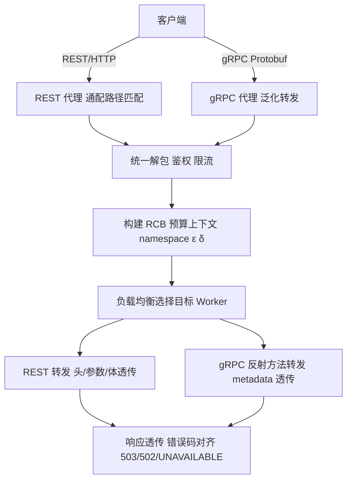
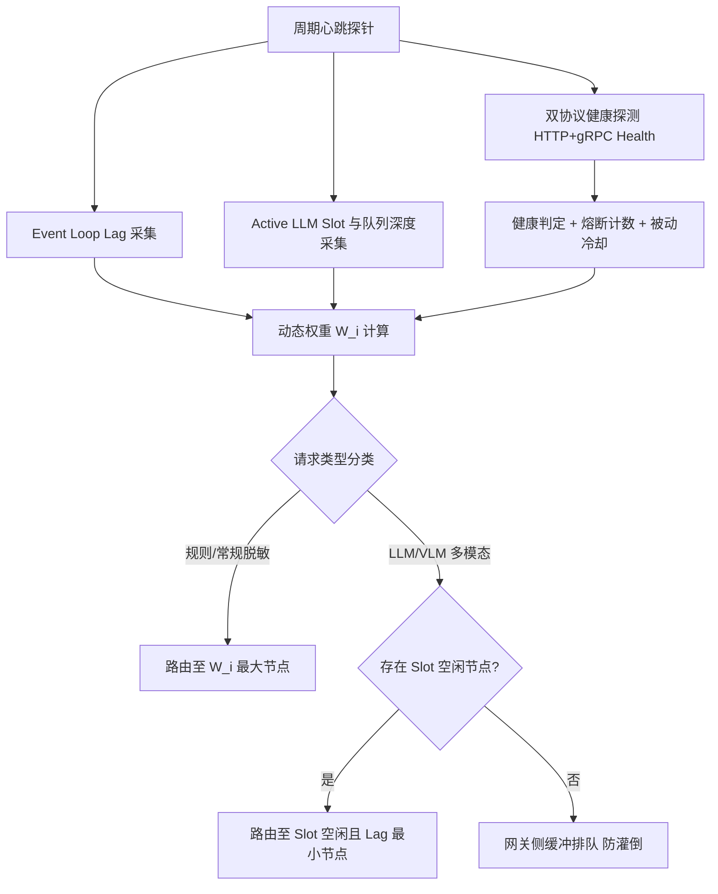
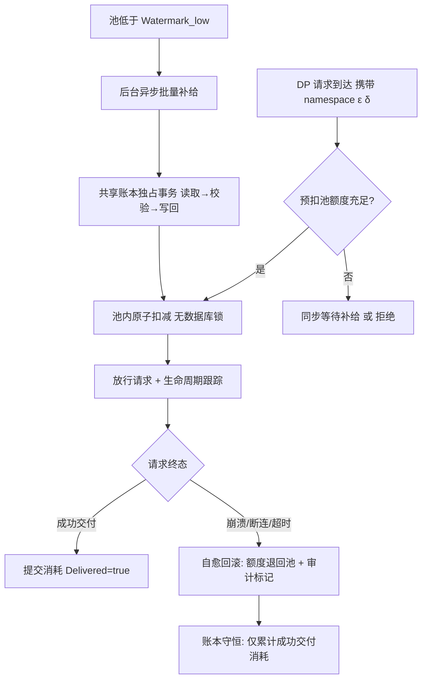
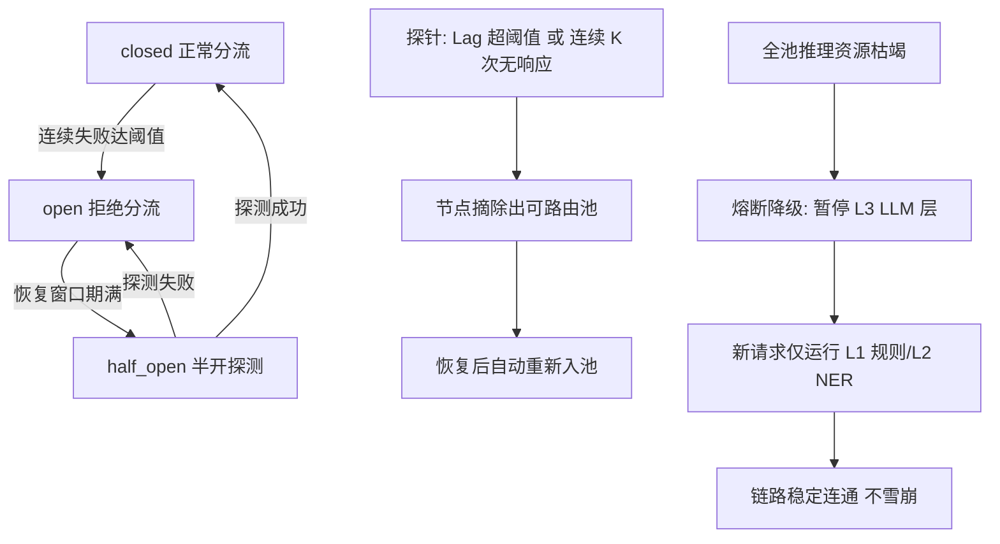
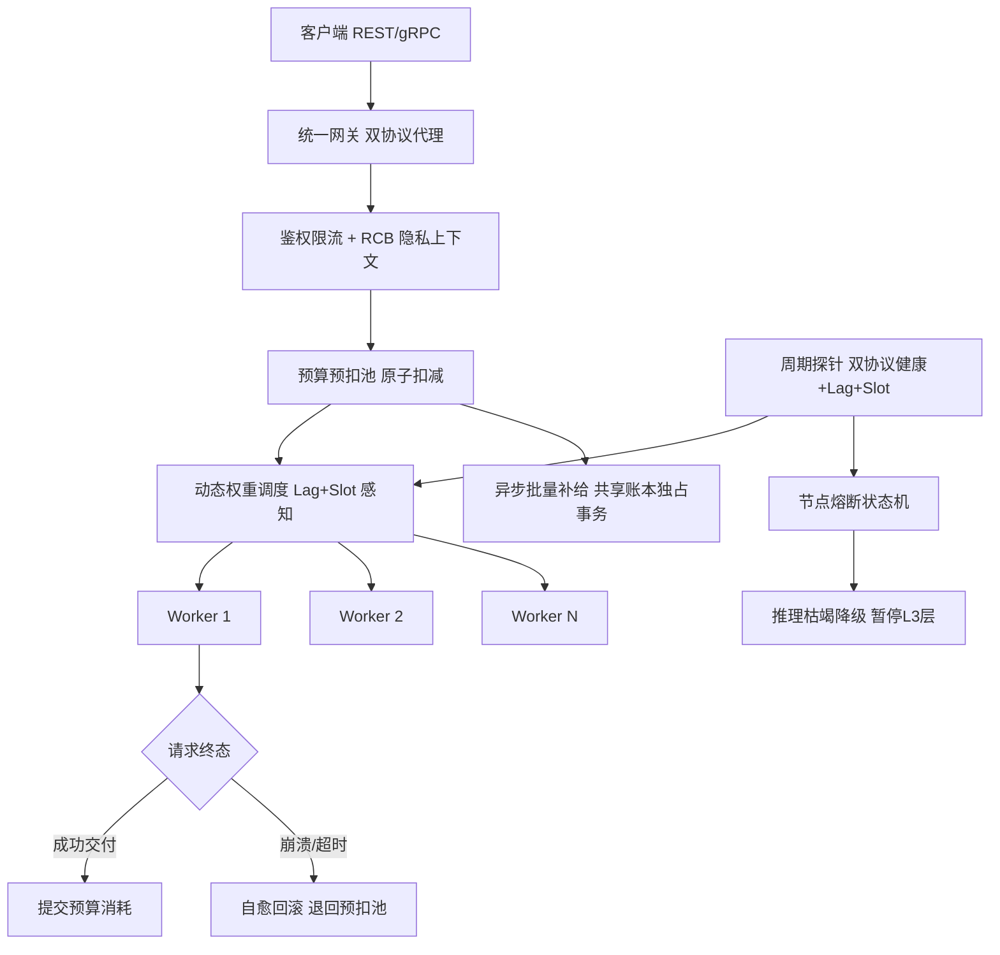

# 发明专利申请书

## 发明名称

**面向隐私计算网关的双协议负载均衡与分布式预算一致性自愈方法、系统及存储介质**

## 申请信息（拟）

| 项目 | 内容 |
|---|---|
| 技术领域分类号（建议） | G06F 21/62（数据访问保护）、H04L 67/10（网络服务协议/负载均衡）、H04L 67/60（消息分发与调度） |
| 申请人 | 深圳数联天下智能科技有限公司 |
| 发明人 | 陈少伟 |
| 申请号 / 申请日 | （递交时填写） |
| 代理机构 / 代理人 | （递交时填写） |

---

## 技术领域

本发明涉及计算机网络、分布式微服务与隐私计算技术领域，具体涉及一种支持 REST 与 gRPC 双协议的高并发代理网关技术、面向混合推理负载（规则引擎 + LLM/VLM）的事件循环感知动态负载均衡方法，以及网关层分布式差分隐私预算预扣减、崩溃自愈回滚与熔断降级方法。

## 背景技术

在大型医疗数据中心或跨机构数据协同场景中，隐私治理 Sidecar 往往作为后端 Worker 集群部署，前置网关（Gateway）作为统一入口层承接高并发数据流与查询请求。现有网关与负载均衡技术在隐私计算场景下面临以下突出矛盾：

1. **双协议接入与隐私上下文割裂**：业务系统可能通过 HTTP/REST 提交 JSON 文本，也可能通过高并发 gRPC Protobuf 提交二进制数据。传统网关需部署两套独立代理，身份鉴权、速率限制与隐私策略上下文（预算命名空间、策略版本）无法统一治理；且 gRPC 代理通常需为每个 RPC 方法手写转发函数，后端 proto 新增方法后网关必须同步修改，维护成本高。
2. **常规负载均衡忽视事件循环阻塞与推理槽位**：隐私计算 Worker 混合轻量级正则匹配与重量级 LLM/VLM 推理。传统轮询（Round Robin）或连接数负载均衡无法感知 Python 等 Worker 的异步事件循环（Event Loop）延迟与 LLM 信号量占用，极易将新请求分配给事件循环已被大模型推理卡死的 Worker，引发长尾延迟与请求超时崩溃。
3. **高并发下共享预算数据库成为写热点**：差分隐私（DP）查询场景下，若每个请求都直接竞争后端共享账本（SQLite 等）执行预算扣减，极端并发下出现数据库锁冲突与写超时；更严重的是，Worker 崩溃或网络超时中断时，已扣减的预算无法恢复，账本状态不一致且用户隐私预算被"无效消耗"。
4. **异步客户端的事件循环绑定陷阱**：事件循环切换或进程 fork 后，缓存的异步 HTTP 客户端可能绑定到已关闭的 Loop，抛出 `Event loop is closed` 异常，传统连接池复用策略无感知。
5. **故障节点缺乏隔离与自愈**：后端 Worker 故障后若无主动摘除与熔断机制，请求持续灌入故障节点；若推理资源枯竭时无降级路径，全链路被最重的推理层拖垮。

## 发明内容

### 一、要解决的技术问题

本发明旨在解决：（1）REST 与 gRPC 双协议在网关层的统一反向代理、泛化转发与隐私上下文透传问题；（2）混合推理负载下 Worker 事件循环感知与智能路由问题；（3）高并发隐私预算记账的写热点瓶颈与节点崩溃后的预算自愈问题；（4）异步客户端事件循环绑定的连接复用安全问题；（5）故障节点隔离、熔断与推理资源枯竭时的优雅降级问题。

### 二、技术方案

本发明提供一种面向隐私计算网关的双协议负载均衡与分布式预算一致性自愈方法，包括以下步骤：

**步骤 S1：双协议统一接入与隐私上下文透传。**
网关在同一进程内同时暴露 REST 代理服务（通配路径匹配全部 HTTP 方法与路径）与 gRPC 代理服务，统一解包请求并构建请求控制块（Request Control Block, RCB）：
1. 提取认证凭据（API Key/Token 或 mTLS 客户端证书 CN）完成统一身份鉴权与速率限制；
2. 提取隐私上下文标识（预算命名空间 \(namespace\)、本次请求预算需求 \((\varepsilon_{req}, \delta_{req})\)、请求类型与策略版本）；
3. RCB 随代理转发全程携带，实现双协议元数据的零损耗透传；REST 侧以请求头/查询参数承载，gRPC 侧以 metadata 承载，两协议语义对齐。

**步骤 S2：双协议泛化转发与事件循环感知复用。**
1. **gRPC 泛化转发**：网关初始化时反射后端服务描述符中的全部 RPC 方法并动态绑定统一转发函数，后端 proto 新增方法后网关零代码适配；后端错误以原状态码与描述透传（`RpcError.code()/details()`）；
2. **事件循环感知复用**：网关复用全局单例异步 HTTP 客户端与 gRPC channel/stub 以降低连接建立开销；每次取用前比对当前运行事件循环与客户端绑定的事件循环，不一致即自动重建客户端，根治 `Event loop is closed` 异常；
3. **回源安全**：网关到后端回源链路支持可选 TLS/mTLS（CA 校验 fail-fast），gRPC 回源通道按后端消息上限对齐收发长度，防止大表/图像分类场景连接被重置。

**步骤 S3：Worker 状态探针与事件循环延迟感知。**
网关向后端 Worker 池建立持久化心跳通道，周期性收集实时健康指标：
- **双协议健康探测**：对每个节点同时执行 HTTP 健康端点与 gRPC Health RPC，仅两者均通过才标记健康，任一失败即计入熔断计数并进入被动冷却期；
- **异步事件循环延迟（Event Loop Lag）**：Worker 内部定时器回调的实际延迟与设定间隔之差，反映单线程事件循环阻塞程度；
- **LLM 推理槽位占用（Active LLM Slot）与等待队列深度**：Worker 进程级 LLM 信号量当前占用数与排队请求数。

**步骤 S4：负载均衡权重动态调整与请求分类路由。**
根据综合健康度计算各 Worker 动态权重：

\[
W_i = \frac{C_{capacity}}{(1 + \alpha \cdot Lag_i) \cdot (1 + \beta \cdot ActiveSlot_i)} \cdot MemFree_i \tag{1}
\]

其中 \(Lag_i\) 为事件循环延迟，\(ActiveSlot_i\) 为推理槽位占用数，\(MemFree_i\) 为可用内存因子，\(C_{capacity}\) 为节点基准容量，\(\alpha,\beta\) 为敏感度系数。在加权轮询（含 Nginx 平滑加权轮询）、加权随机、最小连接数等基础策略之上叠加动态权重，并按请求类型分类路由：
- 纯规则/常规脱敏请求：路由至 \(W_i\) 最大的健康节点；
- 需调用 LLM/VLM 的多模态请求：优先路由至 \(ActiveSlot_i < MaxSlot_i\) 且 \(Lag_i\) 最小的节点；全部节点槽位满载时在网关侧缓冲排队，防止过载请求灌倒 Worker。

**步骤 S5：网关层预算预扣减缓冲池（Pre-allocation Budget Pool）。**
为消除共享账本写热点：
1. 网关在内存中为高频 \(namespace\) 维护预扣减配额池，按批次向共享账本申请额度：

\[
Quota_{pool} \leftarrow Quota_{pool} + Q_{batch},\quad 当\ Quota_{pool} < Watermark_{low} \tag{2}
\]

2. 请求到达时优先在网关预扣池内执行原子扣减，成功即放行，全程无数据库事务写锁；
3. 预扣池低于安全警戒水位 \(Watermark_{low}\) 时，后台异步触发批量补给，补给与扣减互不阻塞；
4. 批次补给在共享账本侧以独占事务（读取已消耗量 → 校验上限 → 写回）完成，保证与既有记账体系的一致性语义不变。

**步骤 S6：Worker 崩溃与超时后的预算一致性自愈。**
1. 网关为每个已放行请求建立生命周期跟踪（请求 ID ↔ 预扣额度 ↔ 目标节点）；
2. Worker 处理中崩溃、断连或网关超时（Gateway Timeout）时，判定该查询未向调用方交付有效数据；
3. 触发**预算自愈回滚协议**：将该请求预扣的 \((\varepsilon_{req}, \delta_{req})\) 原子退回网关预扣池，审计日志记录"异常回滚"标记。账本守恒不变式：

\[
Consumed_{final} = \sum_{r \in Delivered} (\varepsilon_r, \delta_r) \tag{3}
\]

即最终消耗仅累计成功交付的请求，处理失败的请求不消耗用户隐私预算。

**步骤 S7：节点熔断、健康自愈与优雅降级。**
1. 每节点配置独立熔断器，状态机为 \(closed \rightarrow open \rightarrow half\_open\)：连续失败达阈值（如 5 次）后打开熔断拒绝分流，经恢复窗口（如 30s）进入半开态允许探测，探测成功即闭合复位；
2. 探针检测到节点连续 \(K\) 次无响应或事件循环延迟超过熔断阈值（如 > 3000ms）时，将节点从可路由池摘除；恢复后自动重新纳入并刷新健康指标；
3. 若 Worker 池整体推理资源枯竭，网关触发**熔断降级**：新请求降级为仅运行 L1 规则层/L2 Small-NER 层，暂停 L3 LLM 推理层调用，保证高并发链路稳定连通；
4. 无可用节点时返回协议对齐的拒绝响应（HTTP 503 / gRPC UNAVAILABLE），连接超时返回 HTTP 502，杜绝静默丢弃。

本发明还提供一种实现上述方法的代理网关系统及计算机可读存储介质。

### 三、有益效果

1. **统一双协议治理**：REST 与 gRPC 共用鉴权、限流与隐私上下文模型，泛化转发使网关对 proto 演进零维护。
2. **感知事件循环的智能调度**：以 Event Loop Lag 与 LLM 槽位作为权重因子，从根本上消除异步 Worker 被大模型推理卡死引发的长尾延迟。
3. **预算记账吞吐量数量级提升**：预扣池将高频数据库并发写转换为网关内存原子扣减 + 异步批量结算，消除写热点。
4. **预算状态完全自愈**：崩溃与超时请求的预扣预算自动退回，账本只累计成功交付的消耗，杜绝"计算失败但预算被扣"的损失。
5. **故障隔离与优雅降级**：节点级熔断 + 被动冷却 + 推理枯竭降级三层防护，局部故障不扩散，链路整体可用。

### 四、与现有技术的对比

| 对比维度 | 最接近现有技术 | 本发明区别特征 | 带来的技术效果 |
|---|---|---|---|
| 协议接入 | REST 与 gRPC 双网关分离部署 | 单进程双协议统一代理 + RCB 上下文透传 + gRPC 泛化转发 | 身份/限流/预算上下文统一治理，proto 演进零维护 |
| 调度依据 | 轮询/连接数，无事件循环感知 | Event Loop Lag + LLM Slot 动态权重（式 1）+ 请求分类路由 | 推理卡死节点不再接收新请求，长尾延迟消除 |
| 预算记账 | 每请求直接竞争共享账本写锁 | 网关预扣池原子扣减 + 水位补给（式 2） | 写热点消除，记账吞吐数量级提升 |
| 故障预算 | 崩溃后预算被静默消耗 | 生命周期跟踪 + 自愈回滚协议 + 账本守恒不变式（式 3） | 失败请求零预算损失，账本状态一致 |
| 容错 | 故障节点持续接收流量 | 节点级熔断状态机 + 双协议健康探测 + 推理枯竭降级 | 故障隔离自愈，链路不被最重推理层拖垮 |
| 连接复用 | 缓存客户端绑定已关闭 Loop 即报错 | 事件循环比对不一致即重建客户端 | `Event loop is closed` 异常根治 |

### 五、预扣池水位、回滚协议与熔断语义

**（一）创新点强化**

1. 预扣池以 \(namespace\) 为粒度隔离：不同预算命名空间的配额互不挤占，高频命名空间独享补给通道；低频命名空间按需懒加载入池，内存占用有界。
2. 补给与回滚共用同一原子通道：补给是"账本 → 预扣池"的批量转入，回滚是"请求 → 预扣池"的单笔退回，两者在同一池内串行化，无需跨系统两阶段提交。
3. 生命周期跟踪粒度为请求级而非节点级：同一节点崩溃时仅回滚该节点上未交付的请求，已成功交付的请求不受影响，回滚精度最大化。
4. 熔断降级与分类分级漏斗层对齐：降级动作直接映射为"暂停 L3 层、保留 L1/L2 层"，网关无需理解脱敏语义即可执行安全降级。

**（二）预算守恒与回滚正确性**

设网关预扣池在时间窗内的额度变化序列，守恒式恒成立：

\[
Quota_{pool}(t) = Quota_{pool}(t_0) + \sum Refill - \sum Deduct_{ok} + \sum Rollback \tag{4}
\]

回滚协议的正确性判据：请求进入"已放行"状态后，仅当收到完整有效响应时标记 \(Delivered = true\) 并提交消耗；任何异常终态（节点崩溃、断连、超时、5xx）均触发 \(Rollback\)。两个互斥终态保证每笔预扣额度最终且仅被结算一次（exactly-once settlement）。

**（三）熔断状态机与半开探测**

熔断器以单调时钟计时：\(open\) 态经 \(recovery\_timeout\) 自动迁移 \(half\_open\)；半开态放行探测请求，成功即 \(closed\) 并清零失败计数，失败即重新 \(open\)。健康判定同时受被动冷却约束（转发失败即短暂标记不健康直至冷却期满），主动探测与被动标记双通道互补，节点恢复后无需人工干预重新入池。

## 术语与符号说明

| 术语/符号 | 含义 |
|---|---|
| RCB（请求控制块） | 统一封装认证凭据与隐私上下文的网关内部请求结构 |
| Event Loop Lag | 异步事件循环定时器回调实际延迟，反映单线程阻塞程度 |
| Active LLM Slot | Worker 进程级 LLM 推理信号量当前占用数 |
| W_i | Worker i 的动态调度权重（式 1） |
| 预扣减配额池 | 网关内存中按 namespace 预批量申请的预算额度缓冲池 |
| Watermark_low | 预扣池安全警戒水位，低于即触发异步批量补给 |
| 自愈回滚 | 请求异常终态时网关自动退回预扣预算的协议 |
| Consumed_final | 仅累计成功交付请求消耗的账本最终消耗量（式 3） |
| 熔断器 | 节点级 closed→open→half_open 状态机，隔离故障节点 |
| 被动冷却 | 转发失败后节点短暂标记不健康的冷却期 |
| 泛化转发 | 反射服务描述符动态绑定全部 RPC 方法的零代码代理 |
| 事件循环感知复用 | 比对客户端绑定 Loop 与当前 Loop，不一致即重建 |

## 附图说明

- **图 1**：隐私计算网关双协议负载均衡与预算自愈总体架构图。
- **图 2**：双协议统一接入与泛化转发流程图。
- **图 3**：事件循环感知探针与动态权重路由示意图。
- **图 4**：预算预扣池补给、扣减与自愈回滚流程图。
- **图 5**：节点熔断状态机与推理枯竭降级流程图。

## 附图详览（图 2 ~ 图 5）

### 图 2：双协议统一接入与泛化转发流程图



```
 客户端
   ├─ REST/HTTP ──► REST 代理 (通配路径 {path:path}, 全方法)
   └─ gRPC ─────► gRPC 代理 (反射绑定全部 RPC, 零代码适配新方法)
   │
   ▼
 统一解包: API Key/mTLS CN 鉴权 + 速率限制
   │
   ▼
 构建 RCB: namespace + (ε_req, δ_req) + 策略版本
   │
   ▼
 负载均衡选择目标 Worker
   │
   ├─ REST 转发 (headers/params/body 透传)
   └─ gRPC 转发 (metadata 透传, RpcError 状态码/描述透传)
   │
   ▼
 响应透传 + 错误对齐 (503 / 502 / UNAVAILABLE)
```

### 图 3：事件循环感知探针与动态权重路由示意图



```
 周期心跳探针
   ├─ 双协议健康探测 (HTTP /health ∧ gRPC Health RPC, 须双通过)
   ├─ Event Loop Lag 采集 (定时器回调实际延迟)
   └─ Active LLM Slot + 等待队列深度采集
   │
   ▼
 动态权重: W_i = C_cap / [(1+α·Lag_i)(1+β·Slot_i)] × MemFree_i
   │
   ▼
 请求类型分类路由
   ├─ 规则/常规脱敏 ──► W_i 最大的健康节点
   └─ LLM/VLM 多模态 ──► Slot 空闲 ∧ Lag 最小节点
                          │全满载
                          ▼
                    网关侧缓冲排队 (防过载灌倒 Worker)
```

### 图 4：预算预扣池补给、扣减与自愈回滚流程图



```
 DP 请求 (namespace, ε_req, δ_req)
   │
   ▼
 预扣池额度充足? ──否──► 同步等待补给 / 拒绝
   │是
   ▼
 池内原子扣减 (内存操作, 无数据库写锁)
   │                          ▲
   ▼                          │ 批量补给 (异步)
 放行 + 生命周期跟踪            │ 池 < Watermark_low 触发
   │                          │ 共享账本独占事务: 读取→校验→写回
   ▼
 请求终态?
   ├─ 成功交付 ──► 提交消耗 (Delivered=true)
   └─ 崩溃/断连/超时 ──► 自愈回滚: (ε_req,δ_req) 原子退回池
                        + 审计日志"异常回滚"标记
   │
   ▼
 账本守恒: Consumed_final = Σ 成功交付请求的消耗 (失败零损失)
```

### 图 5：节点熔断状态机与推理枯竭降级流程图



```
 节点熔断状态机 (每节点独立):
   closed ──连续失败≥阈值──► open ──恢复窗口期满──► half_open
      ▲                                               │
      └──────────探测成功──────────────────────────────┘
                 探测失败 ──► 重新 open

 探针摘除: Lag > 3000ms 或 连续 K 次无响应 ──► 摘除出可路由池
          恢复 ──► 自动重新入池 (无需人工干预)

 推理枯竭降级:
   全池 LLM Slot 枯竭 ──► 暂停 L3 LLM 层调用
                      ──► 新请求仅运行 L1 规则 / L2 Small-NER
                      ──► 高并发链路稳定连通 (不雪崩)
```

## 具体实施方式

**实施例 1：双协议统一接入。**
业务系统 A 以 REST 提交 `/dp/count`（JSON + `x-privacy-namespace: hr_dataset`），业务系统 B 以 gRPC 调用 `DPCount`（metadata 携带同命名空间）：网关统一鉴权后构建 RCB，两协议请求进入同一预算命名空间记账，策略上下文口径一致。

**实施例 2：gRPC 泛化转发零维护。**
后端 proto 新增 `KAnonymityDataset` 方法：网关启动时反射服务描述符自动绑定转发函数，无需修改网关代码；后端返回 `INVALID_ARGUMENT` 时网关以原状态码与描述透传给调用方。

**实施例 3：事件循环感知调度。**
Worker-2 正在执行 VLM 推理，事件循环延迟升至 4200ms、LLM Slot 满载：探针上报后其 \(W_i\) 趋近于零，新规则请求全部路由至空闲的 Worker-1/3；新多模态请求在网关缓冲排队，避免灌倒 Worker-2。

**实施例 4：预扣池消除写热点。**
`hr_dataset` 命名空间 QPS 达 800：网关按批 100ε 向共享账本补给，池水位低于警戒线时异步续补；请求在池内原子扣减（内存操作），共享 SQLite 写操作由每请求一次降为每分钟数次，无锁冲突。

**实施例 5：崩溃自愈回滚。**
请求 R-42 预扣 (ε=0.5, δ=0) 后转发至 Worker-3，Worker-3 处理中 OOM 崩溃：网关检测到连接中断，判定未交付，将 (0.5, 0) 原子退回预扣池并记录"异常回滚"审计标记；调用方收到 502 重试，重试成功时重新扣减——预算不被无效消耗。

**实施例 6：账本守恒验证。**
时间窗内放行 1000 笔请求、成功交付 985 笔、崩溃/超时 15 笔：账本最终消耗恰为 985 笔之和（式 3），15 笔失败请求的预扣额度全部经回滚通道退回（式 4 守恒），exactly-once 结算成立。

**实施例 7：熔断与降级。**
Worker-4 连续 5 次转发失败：熔断器打开，该节点 30s 内不再接收流量；恢复窗口后半开探测成功，自动闭合复位。极端场景全池 LLM 槽位枯竭：网关触发降级，新请求仅运行 L1 规则层与 L2 NER 层，暂停 L3 LLM 调用，链路保持连通。

**实施例 8：事件循环感知复用。**
网关进程 fork 后新子进程的事件循环与缓存 `httpx.AsyncClient` 绑定 Loop 不一致：取用前比对发现不匹配，自动重建客户端，`Event loop is closed` 异常不再发生。

**实施例 9：关键参数配置表。**

| 参数 | 默认值 | 说明 |
|---|---|---|
| 健康检查间隔 | 5s | HTTP + gRPC 双协议健康探测周期 |
| 熔断失败阈值 | 5 次 | 连续失败达阈值后熔断器打开 |
| 熔断恢复窗口 | 30s | open → half_open 迁移等待时长 |
| Event Loop Lag 熔断阈值 | 3000ms | 超过即摘除节点 |
| 预扣池补给批次 \(Q_{batch}\) | 按命名空间 QPS 配置 | 单次账本补给额度 |
| 预扣池警戒水位 \(Watermark_{low}\) | 批次额度的 20%（示例） | 低于即异步补给 |
| gRPC 回源消息上限 | 64 MiB | 与后端收发消息上限对齐 |
| 错误响应对齐 | 503 / 502 / UNAVAILABLE | 无可用节点 / 连接超时 / gRPC 透传 |

## 权利要求书

1. 一种面向隐私计算网关的双协议负载均衡与分布式预算一致性自愈方法，其特征在于，包括：
   在同一网关进程内同时提供 REST 代理服务与 gRPC 代理服务，统一解包请求并构建携带认证凭据与隐私上下文的请求控制块；
   周期性采集后端工作节点的健康状态、异步事件循环延迟与推理槽位占用指标；
   依据所述指标计算各节点动态调度权重，并按请求类型分类路由至目标工作节点；
   在网关内存中按预算命名空间维护预扣减配额池，请求放行前在池内执行原子扣减；
   对工作节点崩溃或请求超时导致未交付的请求，将预扣预算原子退回预扣池并记录审计标记。

2. 根据权利要求 1 所述的方法，其特征在于，所述隐私上下文至少包含预算命名空间、本次请求预算需求与策略版本；REST 侧经请求头或查询参数承载，gRPC 侧经 metadata 承载，两协议语义对齐。

3. 根据权利要求 1 所述的方法，其特征在于，所述 gRPC 代理在初始化时反射后端服务描述符中的全部 RPC 方法并动态绑定统一转发函数；后端新增 RPC 方法无需修改网关代码；后端错误以原状态码与描述透传。

4. 根据权利要求 1 所述的方法，其特征在于，所述动态调度权重以事件循环延迟与推理槽位占用数为衰减因子、可用内存为增益因子计算；纯规则请求路由至权重最大的健康节点，多模态推理请求路由至推理槽位空闲且事件循环延迟最小的节点，全部节点槽位满载时在网关侧缓冲排队。

5. 根据权利要求 1 所述的方法，其特征在于，所述健康状态采集包括对每个节点同时执行 HTTP 健康端点探测与 gRPC 健康远程过程调用探测，仅两者均通过时标记节点健康；转发失败使节点进入被动冷却期。

6. 根据权利要求 1 所述的方法，其特征在于，所述预扣减配额池的补给包括：池额度低于安全警戒水位时，后台异步向共享预算账本申请批量额度；补给在共享账本侧以独占事务执行读取已消耗量、校验上限与写回新消耗量。

7. 根据权利要求 1 所述的方法，其特征在于，还包括账本守恒约束：最终预算消耗仅累计成功交付请求的消耗；每笔预扣额度最终且仅被结算一次。

8. 根据权利要求 1 所述的方法，其特征在于，还包括生命周期跟踪步骤：为每个已放行请求记录请求标识、预扣额度与目标节点的绑定关系；仅当收到完整有效响应时提交消耗，崩溃、断连或超时终态均触发退回。

9. 根据权利要求 1 所述的方法，其特征在于，还包括节点级熔断步骤：每节点维护闭合、打开、半开三态熔断器；连续失败达阈值后打开并拒绝分流，经恢复窗口进入半开态放行探测，探测成功闭合复位。

10. 根据权利要求 1 所述的方法，其特征在于，还包括优雅降级步骤：当工作节点池整体推理资源枯竭时，将新请求降级为仅运行规则层与轻量实体识别层，暂停大模型推理层调用。

11. 根据权利要求 1 所述的方法，其特征在于，还包括事件循环感知复用步骤：复用全局单例异步客户端与远程过程调用通道，取用前比对当前运行事件循环与客户端绑定的事件循环，不一致时重建客户端。

12. 根据权利要求 1 所述的方法，其特征在于，还包括回源安全步骤：网关到后端回源链路支持按配置证书颁发机构校验的传输层安全或双向认证；配置缺失时启动即失败；回源消息长度上限与后端对齐。

13. 根据权利要求 1 所述的方法，其特征在于，还包括错误对齐步骤：无可用节点时返回协议对齐的拒绝响应，连接超时返回网关错误响应，后端远程过程调用错误透传状态码与描述。

14. 一种面向隐私计算网关的双协议负载均衡与分布式预算一致性自愈系统，其特征在于，包括：双协议代理模块、泛化转发模块、状态探针模块、动态权重调度模块、预算预扣池模块、自愈回滚模块与熔断降级模块，各模块协同执行权利要求 1 至 13 任一项所述的方法。

15. 一种计算机可读存储介质，其上存储有计算机程序，其特征在于，所述计算机程序被处理器执行时实现权利要求 1 至 13 任一项所述的方法。

16. 一种电子设备，其特征在于，包括处理器以及存储有计算机程序的存储器，所述计算机程序被所述处理器执行时实现权利要求 1 至 13 任一项所述的方法。

## 摘要

本发明公开了一种面向隐私计算网关的双协议负载均衡与分布式预算一致性自愈方法、系统及存储介质。该方法在单一网关进程内统一代理 REST 与 gRPC 流量，经请求控制块透传身份凭据与预算命名空间等隐私上下文，并以反射式泛化转发零维护适配新增 RPC 方法；周期性采集后端节点的事件循环延迟与大模型推理槽位占用，据此计算动态调度权重并按请求类型分类路由，杜绝请求被分配至推理卡死的节点；网关按命名空间维护内存预算预扣池，以原子扣减替代高频数据库写锁，池水位低于警戒线时异步批量补给；对崩溃或超时未交付的请求执行自愈回滚，预扣预算原子退回，账本仅累计成功交付的消耗；节点级熔断状态机与推理资源枯竭时的分层降级保障链路稳定。本发明解决了隐私计算服务横向扩展时的写热点、预算不一致与长尾延迟问题。

## 摘要附图（图 1：隐私计算网关双协议负载均衡与预算自愈总体架构图）

### Mermaid 版本



### ASCII 版本

```
 客户端 (REST / gRPC)
        │
        ▼
 统一网关 (双协议代理)
   鉴权 + 限流 + RCB(namespace, ε_req, δ_req)
        │
        ▼
 预算预扣池: 池内原子扣减 ──► 放行
   ▲                │
   │自愈回滚         ▼
   │(未交付退回)   动态权重调度 W_i = f(Lag, Slot, MemFree)
   │                │
   │       ┌────────┼────────┐
   │       ▼        ▼        ▼
   │    Worker-1  Worker-2  Worker-N
   │       │        │        │
   │       └────────┼────────┘
   │                ▼
   │        请求终态?
   │   成功交付 → 提交消耗 | 崩溃/超时 → 自愈回滚
   │                │
   └────────────────┘
 异步批量补给: 池 < 水位 → 共享账本独占事务补给

 周期探针: 双协议健康 ∧ Event Loop Lag ∧ LLM Slot
   ├─► 节点熔断状态机 (closed→open→half_open)
   └─► 推理枯竭降级 (暂停 L3, 保留 L1/L2, 链路不雪崩)
```
