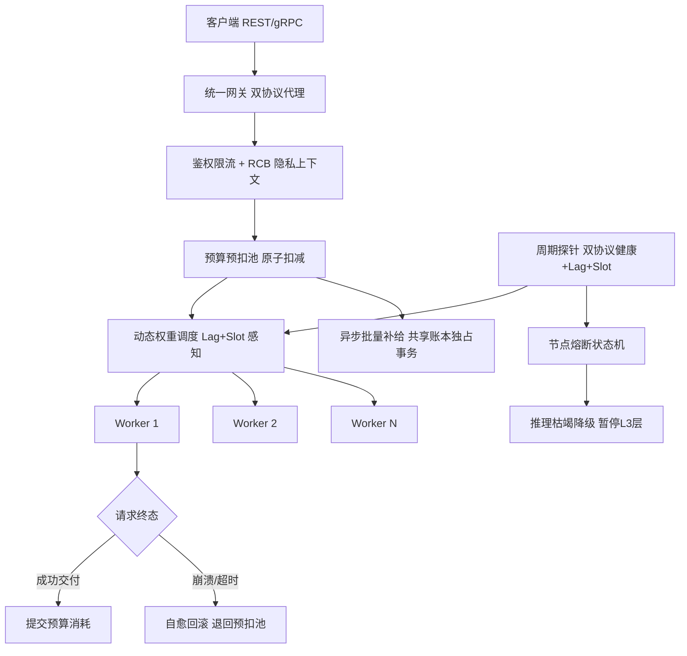
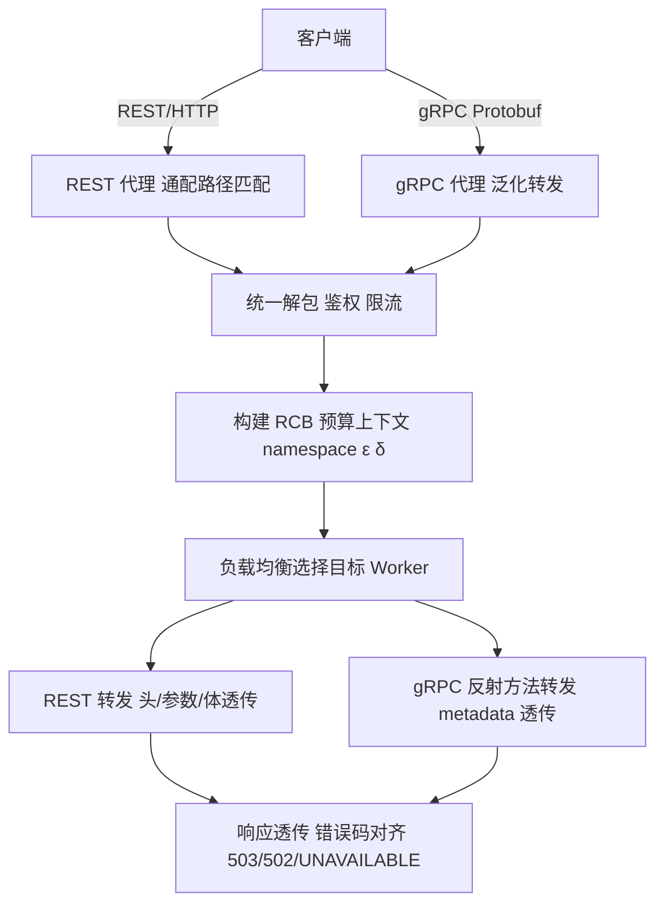
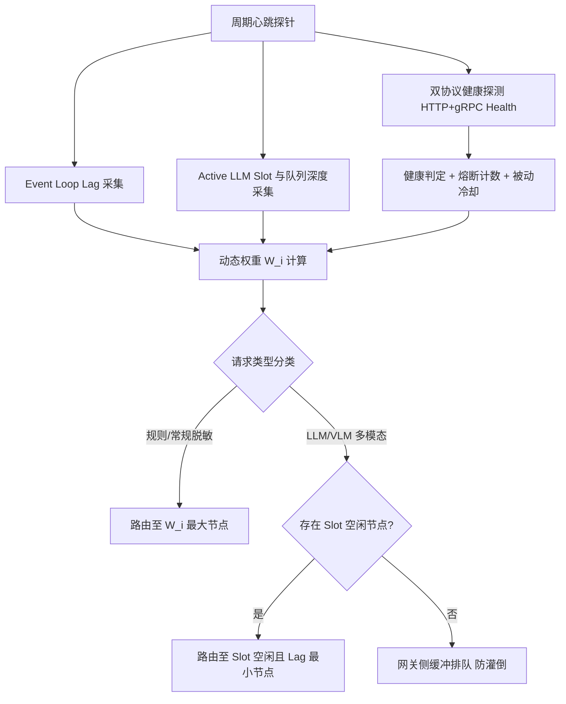
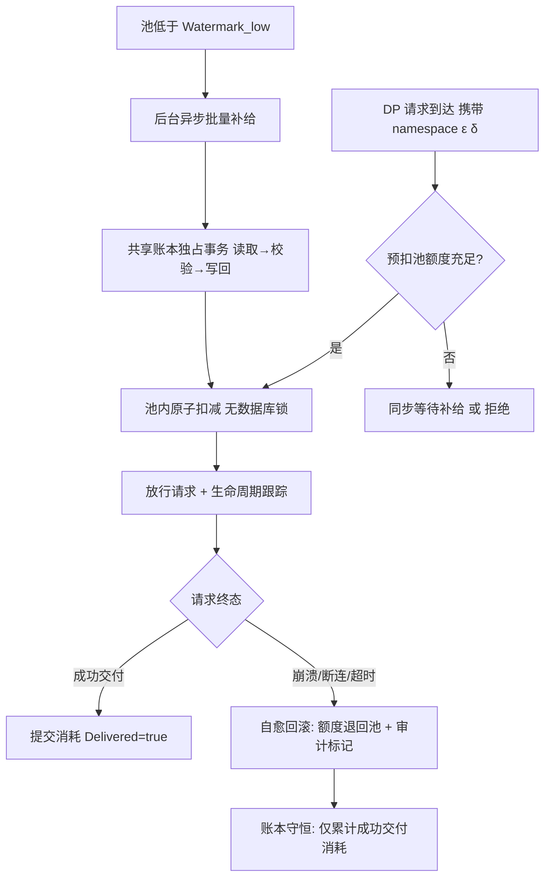
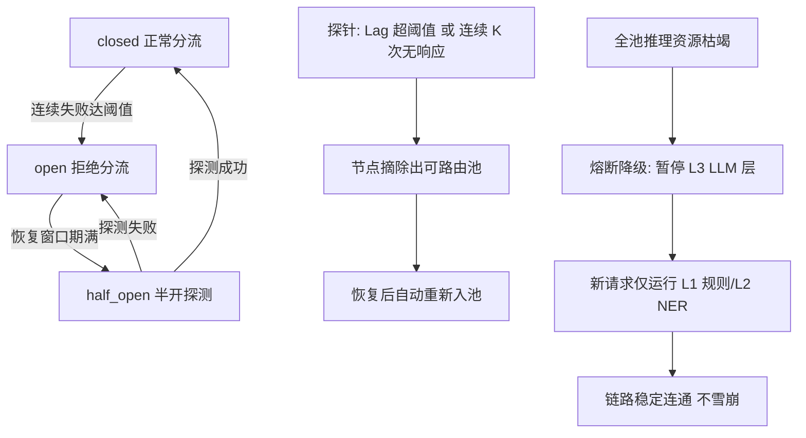

|                                  |
|:--------------------------------:|
| **深圳数联天下智能科技有限公司** |
|      **专利技术交底书模板**      |

编号：HZL-02-R01 版本号：2022

**专利申请用技术交底书模板**

***以下带 \* 信息务必填写，涉及奖金的发放*，谢谢！~**

交底书名称：面向隐私计算网关的双协议负载均衡与分布式预算一致性自愈方法及系统

\*\*发明人姓名：陈少伟

\*\*第一发明人姓名和身份证号码：陈少伟

申请人：深圳数联天下智能科技有限公司

通信地址（邮编）：

\*\*交底书撰写人：

\*\*联系电话：

\*\*Email：

**交底技术书信息登记页**

***以下带 \* 信息务必填写，方便进行知识产权维护***

\*\*提交部门：

\*\*项目号：

\*\*项目名称/所属产品(可多个，靠近公司的主营业务)：隐私本地代理（Privacy Local Agent）

\*\*技术应用领域：大数据、人工智能、隐私计算、智慧医疗

\*\*相关技术方向：分布式系统、网关负载均衡、差分隐私、微服务治理

\*\*技术方案概述：
本发明在单一网关进程内统一代理表述性状态转移（Representational State Transfer，REST）与gRPC（Google Remote Procedure Call）双协议流量，通过请求控制块（Request Control Block，RCB）透传身份凭据与隐私上下文；基于反射机制实现gRPC泛化转发，后端新增RPC方法无需修改网关代码；周期性采集后端工作节点的异步事件循环延迟（Event Loop Lag）与大语言模型/视觉语言模型（Large Language Model/Visual Language Model，LLM/VLM）推理槽位占用，计算动态调度权重并按请求类型分类路由；在网关内存中按差分隐私（Differential Privacy，DP）预算命名空间维护预扣减配额池，以原子扣减替代高频共享账本写锁，对崩溃或超时未交付的请求执行自愈回滚，保证账本仅累计成功交付的消耗；同时通过节点级熔断状态机与推理资源枯竭时的分层降级，保障高并发隐私计算链路稳定。

**交底书注意事项：**

1.  代理人并不是技术专家，交底书要使代理人能看懂，尤其是背景技术和详细技术方案，一定要写得全面、清楚。
2.  英文缩写要提供中文译文及英文全拼，避免只使用英文单词。
3.  全文对同一事物的叫法应统一，避免出现一种东西多种叫法。
4.  和代理人沟通时，对于代理人的疑问请认真讲解，要求补充的材料应及时补充。
5.  专利法规定：

&nbsp;

1.  专利必须是一个技术方案，应该阐述发明目的是通过什么技术方案来实现的，不能只有原理，也不能只做功能介绍；
2.  专利必须充分公开，以本领域技术人员不需付出创造性劳动即可实现为准。

对申请人来说，必须满足上述规定，专利才能批准；但为了不让竞争对手完全掌握该项技术，在满足上述规定的前提下，可以在一些细节上做一些加工，如隐藏，或别的实现方式。

**缩略语和关键术语定义列表（交底书中如有的话，请说明）**

> 1、REST（Representational State Transfer，表述性状态转移）：一种基于HTTP/HTTPS的分布式系统架构风格，常用于Web服务接口。
> 2、gRPC（Google Remote Procedure Call，Google远程过程调用）：基于HTTP/2和Protobuf（Protocol Buffers）的高性能远程过程调用框架。
> 3、DP（Differential Privacy，差分隐私）：通过向查询结果或聚合统计注入可控噪声，使得单条记录的存在与否难以被推断的隐私保护模型。
> 4、RCB（Request Control Block，请求控制块）：本发明中网关内部统一封装认证凭据与隐私上下文的请求结构。
> 5、Event Loop Lag（事件循环延迟）：异步事件循环定时器回调的实际延迟与设定间隔之差，反映单线程事件循环的阻塞程度。
> 6、LLM/VLM（Large Language Model/Visual Language Model，大语言模型/视觉语言模型）：分别指处理自然语言与多模态输入的大规模深度学习模型。
> 7、API Key（Application Programming Interface Key，应用程序编程接口密钥）：用于调用方身份鉴权的令牌。
> 8、mTLS（Mutual Transport Layer Security，双向传输层安全）：客户端与服务端互相校验证书的TLS扩展机制。
> 9、QPS（Queries Per Second，每秒查询率）：衡量系统并发处理能力的指标。
> 10、OOM（Out Of Memory，内存溢出）：进程因可用内存耗尽而被操作系统终止的异常状态。

**交底书撰写说明：由交底书撰写人在以下各部分用黑色字体，按标题下提示的相关要求书写即可。**

1.  **相关技术背景（背景技术），与本发明最相近似的现有实现方案（现有技术）**

1.1 背景技术

在大型医疗数据中心、跨机构数据协同平台以及联邦学习（Federated Learning）场景中，隐私治理Sidecar通常作为后端Worker集群部署，前置网关作为统一入口层承接高并发数据流与查询请求。该Sidecar负责执行数据脱敏、差分隐私查询、K-匿名化、动态分级分类等多类隐私 primitives（原语），并通过REST与gRPC双协议对外暴露服务。

由于隐私计算任务具有计算异构性强、资源消耗差异大、隐私预算需严格 accounting（记账）等特点，前置网关不仅需要完成传统反向代理、负载均衡、鉴权限流功能，还必须理解并透传隐私上下文（如预算命名空间、本次请求的隐私预算消耗、策略版本等）。然而，现有通用网关与负载均衡技术在设计之初并未考虑隐私计算场景的上述需求，导致在横向扩展、高并发与故障恢复时频繁出现协议割裂、调度失配、预算写热点与状态不一致等问题。

1.2 与本发明相关的现有技术一

1.2.1 现有技术一的技术方案

现有技术一为传统分离式双协议网关部署方案。该方案中，REST流量由一台HTTP反向代理（如Nginx、HAProxy或基于Python/Node.js的异步代理）承接，gRPC流量由另一台支持HTTP/2的代理（如Envoy、gRPC Gateway或手写转发服务）承接。两台代理各自维护鉴权、速率限制与路由规则。

REST侧通过路径匹配将JSON请求转发至对应Worker；gRPC侧通常为每个RPC方法手写转发函数，将客户端的Protobuf请求反序列化后重新序列化并发送至后端，再将后端响应原路返回。Worker集群采用轮询（Round Robin）或最小连接数策略进行负载均衡，各Worker独立处理请求，并通过共享数据库（如SQLite、MySQL、PostgreSQL）记录差分隐私预算消耗。

1.2.2 现有技术一的缺点

（1）双协议接入与隐私上下文割裂。REST与gRPC分别由两套代理处理，身份鉴权、速率限制与隐私策略上下文无法统一治理；调用方在REST请求头中携带的预算命名空间、策略版本等信息，在gRPC侧需通过metadata重新声明，语义不一致且容易遗漏。

（2）gRPC代理维护成本高。后端proto文件新增RPC方法后，网关必须同步修改手写转发函数，否则新接口无法被代理；版本迭代过程中网关代码与后端proto强耦合。

（3）负载均衡缺乏事件循环感知。隐私计算Worker内部同时运行轻量级规则匹配与重量级LLM/VLM推理。传统轮询或连接数策略无法感知Python异步事件循环（Event Loop）阻塞程度与LLM信号量占用，极易将新请求分配给事件循环已被大模型推理卡死的Worker，导致长尾延迟、请求超时甚至链路崩溃。

1.3 与本发明相关的现有技术二

1.3.1 现有技术二的技术方案

现有技术二为基于共享账本的每请求差分隐私预算扣减方案。该方案中，每个隐私计算请求到达Worker后，Worker直接以独占事务访问共享数据库：读取当前命名空间已消耗预算、校验剩余预算是否满足本次请求、写入新的累计消耗量。事务提交成功后，Worker才执行实际的隐私计算并返回结果。数据库作为预算权威账本，所有Worker共享同一份持久化状态。

1.3.2 现有技术二的缺点

（1）高并发下共享数据库成为写热点。每个请求都需竞争数据库写锁，极端并发下出现锁冲突、写超时与连接池耗尽，预算扣减吞吐量成为系统瓶颈。

（2）节点崩溃后预算无法恢复。Worker已扣减预算但尚未返回结果时若发生OOM或断连，已扣减的预算被静默消耗；调用方重试后需再次扣减，导致用户隐私预算被无效浪费，账本状态与实际交付结果不一致。

（3）缺乏请求级生命周期跟踪。现有方案通常在节点级或事务级记录扣减，无法精确识别“已扣减但未交付”的异常请求，回滚粒度粗、正确性难以保证。

2.  **本发明技术方案的详细阐述（发明内容）**

2.1 本发明所要解决的技术问题（发明目的）

针对现有技术的上述缺点，本发明所要解决的技术问题包括：

（1）REST与gRPC双协议在网关层的统一反向代理、泛化转发与隐私上下文透传问题；

（2）混合推理负载下Worker事件循环阻塞程度与LLM/VLM推理槽位占用的智能感知与动态路由问题；

（3）高并发隐私预算记账的写热点瓶颈与节点崩溃、超时后的预算自愈问题；

（4）异步客户端在多进程fork或事件循环切换后绑定已关闭Loop的连接复用安全问题；

（5）故障节点隔离、熔断与推理资源枯竭时的优雅降级问题。

2.2 本发明提供的完整技术方案（发明方案）

本发明提供一种面向隐私计算网关的双协议负载均衡与分布式预算一致性自愈方法，运行于统一网关进程内，包括以下步骤：

**步骤S1：双协议统一接入与隐私上下文透传。**

网关在同一进程内同时暴露REST代理服务与gRPC代理服务。REST代理采用通配路径匹配全部HTTP方法与路径；gRPC代理基于HTTP/2监听gRPC调用。两类请求进入网关后，统一解包并构建请求控制块（RCB），RCB包含：

（1）认证凭据，包括API Key/Token或mTLS客户端证书中的通用名称（Common Name，CN），用于完成统一身份鉴权与速率限制；

（2）隐私上下文标识，包括预算命名空间（namespace）、本次请求预算需求（ε_req，δ_req）、请求类型与策略版本；

（3）RCB随代理转发全程携带，实现双协议元数据的零损耗透传。REST侧以请求头或查询参数承载上述信息；gRPC侧以metadata承载，两协议语义对齐。

**步骤S2：双协议泛化转发与事件循环感知复用。**

（1）gRPC泛化转发：网关初始化时通过gRPC反射（reflection）机制获取后端服务描述符（service descriptor），枚举全部RPC方法并动态绑定统一转发函数。后端proto文件新增RPC方法后，网关无需修改代码即可自动适配；后端返回的错误以原状态码与描述透传，即透传RpcError.code()与RpcError.details()。

（2）事件循环感知复用：网关复用全局单例异步HTTP客户端与gRPC通道/存根（channel/stub），以降低连接建立开销。每次取用前，比对当前运行事件循环与客户端绑定的事件循环；若不一致，则自动重建客户端，从而根治“Event loop is closed”异常。

（3）回源安全：网关到后端回源链路支持可选TLS/mTLS，证书颁发机构（Certificate Authority，CA）校验采用fail-fast策略，配置缺失时启动即失败；gRPC回源通道按后端消息上限对齐收发长度，防止大表或图像分类场景连接被重置。

**步骤S3：Worker状态探针与事件循环延迟感知。**

网关向后端Worker池建立持久化心跳通道，周期性收集实时健康指标，包括：

（1）双协议健康探测：对每个节点同时执行HTTP健康端点探测与gRPC Health RPC探测，仅两者均通过时才标记该节点健康，任一失败即计入熔断计数并进入被动冷却期；

（2）异步事件循环延迟（Event Loop Lag）：Worker内部定时器回调的实际延迟与设定间隔之差，反映单线程事件循环阻塞程度；

（3）LLM推理槽位占用（Active LLM Slot）与等待队列深度：Worker进程级LLM信号量当前占用数与排队请求数。

**步骤S4：负载均衡权重动态调整与请求分类路由。**

根据综合健康度计算各Worker动态权重：

W_i = C_capacity / [(1 + α · Lag_i) · (1 + β · ActiveSlot_i)] · MemFree_i  ……（1）

其中，Lag_i为节点i的事件循环延迟，ActiveSlot_i为节点i的推理槽位占用数，MemFree_i为节点i的可用内存因子，C_capacity为节点基准容量，α、β为敏感度系数。

在加权轮询、加权随机、最小连接数等基础策略之上叠加动态权重，并按请求类型分类路由：

（1）纯规则/常规脱敏请求：路由至W_i最大的健康节点；

（2）需调用LLM/VLM的多模态请求：优先路由至ActiveSlot_i < MaxSlot_i且Lag_i最小的节点；全部节点槽位满载时，在网关侧缓冲排队，防止过载请求灌倒Worker。

**步骤S5：网关层预算预扣减缓冲池（Pre-allocation Budget Pool）。**

为消除共享账本写热点：

（1）网关在内存中为高频namespace维护预扣减配额池，按批次向共享账本申请额度：

Quota_pool ← Quota_pool + Q_batch，当Quota_pool < Watermark_low  ……（2）

（2）请求到达时优先在网关预扣池内执行原子扣减，成功即放行，全程无数据库事务写锁；

（3）预扣池低于安全警戒水位Watermark_low时，后台异步触发批量补给，补给与扣减互不阻塞；

（4）批次补给在共享账本侧以独占事务（读取已消耗量→校验上限→写回）完成，保证与既有记账体系的一致性语义不变。

**步骤S6：Worker崩溃与超时后的预算一致性自愈。**

（1）网关为每个已放行请求建立生命周期跟踪，记录请求ID与预扣额度、目标节点的绑定关系；

（2）Worker处理中崩溃、断连或网关超时时，判定该查询未向调用方交付有效数据；

（3）触发预算自愈回滚协议：将该请求预扣的（ε_req，δ_req）原子退回网关预扣池，审计日志记录“异常回滚”标记。账本守恒不变式为：

Consumed_final = Σ_{r∈Delivered} (ε_r，δ_r)  ……（3）

即最终消耗仅累计成功交付的请求，处理失败的请求不消耗用户隐私预算。

**步骤S7：节点熔断、健康自愈与优雅降级。**

（1）每节点配置独立熔断器，状态机为closed→open→half_open：连续失败达阈值（如5次）后打开熔断并拒绝分流，经恢复窗口（如30秒）进入半开态允许探测，探测成功即闭合复位；

（2）探针检测到节点连续K次无响应或事件循环延迟超过熔断阈值（如大于3000毫秒）时，将节点从可路由池摘除；节点恢复后自动重新纳入并刷新健康指标；

（3）若Worker池整体推理资源枯竭，网关触发熔断降级：新请求降级为仅运行第一层（Layer 1，L1）规则层与第二层（Layer 2，L2）Small-NER（Small Named Entity Recognition，轻量级命名实体识别）层，暂停第三层（Layer 3，L3）LLM推理层调用，保证高并发链路稳定连通；

（4）无可用节点时返回协议对齐的拒绝响应，REST侧返回503 Service Unavailable，连接超时返回502 Bad Gateway；gRPC侧返回UNAVAILABLE状态码，杜绝静默丢弃。

附图说明：

**图1：隐私计算网关双协议负载均衡与预算自愈总体架构图。**



文字附图：

```
 客户端 (REST / gRPC)
        │
        ▼
 统一网关 (双协议代理)
   鉴权 + 限流 + RCB(namespace, ε_req, δ_req)
        │
        ▼
 预算预扣池: 池内原子扣减 ──► 放行
   ▲                │
   │自愈回滚         ▼
   │(未交付退回)   动态权重调度 W_i = f(Lag, Slot, MemFree)
   │                │
   │       ┌────────┼────────┐
   │       ▼        ▼        ▼
   │    Worker-1  Worker-2  Worker-N
   │       │        │        │
   │       └────────┼────────┘
   │                ▼
   │        请求终态?
   │   成功交付 → 提交消耗 | 崩溃/超时 → 自愈回滚
   │                │
   └────────────────┘
 异步批量补给: 池 < 水位 → 共享账本独占事务补给

 周期探针: 双协议健康 ∧ Event Loop Lag ∧ LLM Slot
   ├─► 节点熔断状态机 (closed→open→half_open)
   └─► 推理枯竭降级 (暂停 L3, 保留 L1/L2, 链路不雪崩)
```

**图2：双协议统一接入与泛化转发流程图。**



文字附图：

```
 客户端
   ├─ REST/HTTP ──► REST 代理 (通配路径 {path:path}, 全方法)
   └─ gRPC ─────► gRPC 代理 (反射绑定全部 RPC, 零代码适配新方法)
   │
   ▼
 统一解包: API Key/mTLS CN 鉴权 + 速率限制
   │
   ▼
 构建 RCB: namespace + (ε_req, δ_req) + 策略版本
   │
   ▼
 负载均衡选择目标 Worker
   │
   ├─ REST 转发 (headers/params/body 透传)
   └─ gRPC 转发 (metadata 透传, RpcError 状态码/描述透传)
   │
   ▼
 响应透传 + 错误对齐 (503 / 502 / UNAVAILABLE)
```

**图3：事件循环感知探针与动态权重路由示意图。**



文字附图：

```
 周期心跳探针
   ├─ 双协议健康探测 (HTTP /health ∧ gRPC Health RPC, 须双通过)
   ├─ Event Loop Lag 采集 (定时器回调实际延迟)
   └─ Active LLM Slot + 等待队列深度采集
   │
   ▼
 动态权重: W_i = C_cap / [(1+α·Lag_i)(1+β·Slot_i)] × MemFree_i
   │
   ▼
 请求类型分类路由
   ├─ 规则/常规脱敏 ──► W_i 最大的健康节点
   └─ LLM/VLM 多模态 ──► Slot 空闲 ∧ Lag 最小节点
                          │全满载
                          ▼
                    网关侧缓冲排队 (防过载灌倒 Worker)
```

**图4：预算预扣池补给、扣减与自愈回滚流程图。**



文字附图：

```
 DP 请求 (namespace, ε_req, δ_req)
   │
   ▼
 预扣池额度充足? ──否──► 同步等待补给 / 拒绝
   │是
   ▼
 池内原子扣减 (内存操作, 无数据库写锁)
   │                          ▲
   ▼                          │ 批量补给 (异步)
 放行 + 生命周期跟踪            │ 池 < Watermark_low 触发
   │                          │ 共享账本独占事务: 读取→校验→写回
   ▼
 请求终态?
   ├─ 成功交付 ──► 提交消耗 (Delivered=true)
   └─ 崩溃/断连/超时 ──► 自愈回滚: (ε_req,δ_req) 原子退回池
                        + 审计日志"异常回滚"标记
   │
   ▼
 账本守恒: Consumed_final = Σ 成功交付请求的消耗 (失败零损失)
```

**图5：节点熔断状态机与推理枯竭降级流程图。**



文字附图：

```
 节点熔断状态机 (每节点独立):
   closed ──连续失败≥阈值──► open ──恢复窗口期满──► half_open
      ▲                                               │
      └──────────探测成功──────────────────────────────┘
                 探测失败 ──► 重新 open

 探针摘除: Lag > 3000ms 或 连续 K 次无响应 ──► 摘除出可路由池
          恢复 ──► 自动重新入池 (无需人工干预)

 推理枯竭降级:
   全池 LLM Slot 枯竭 ──► 暂停 L3 LLM 层调用
                      ──► 新请求仅运行 L1 规则 / L2 Small-NER
                      ──► 高并发链路稳定连通 (不雪崩)
```

2.3 本发明技术方案带来的有益效果

（1）统一双协议治理：REST与gRPC共用同一鉴权、限流与隐私上下文模型，泛化转发使网关对后端proto演进零维护；调用方无论采用何种协议，预算命名空间与策略版本口径一致。

（2）感知事件循环的智能调度：以Event Loop Lag与LLM/VLM推理槽位作为动态权重因子，从根本上消除异步Worker被大模型推理卡死引发的长尾延迟；请求分类路由避免轻量请求被重推理节点拖慢。

（3）预算记账吞吐量数量级提升：预扣池将高频数据库并发写转换为网关内存原子扣减与异步批量结算，共享账本写操作由每请求一次降低为按水位异步补给，消除写热点。

（4）预算状态完全自愈：崩溃与超时请求的预扣预算自动退回预扣池，账本只累计成功交付的消耗，杜绝“计算失败但预算被扣”的损失，保证 exactly-once 结算语义。

（5）故障隔离与优雅降级：节点级熔断、被动冷却与推理枯竭降级三层防护协同工作，局部故障不扩散，链路整体可用性提升。

3.  **针对2中的技术方案，是否还有别的替代方案同样能完成发明目的**

（1）双协议统一接入的替代方案：可采用协议转换层将gRPC调用转换为REST调用后再进入网关，或将REST调用统一封装为gRPC。该方案可减少网关内部双栈实现复杂度，但会引入额外的序列化开销与协议语义损失，适用于对延迟不敏感、协议单一化的内部系统。

（2）动态权重因子的替代方案：除Event Loop Lag与Active LLM Slot外，可额外引入CPU利用率、GPU显存占用、近期P99延迟等作为权重因子；也可采用机器学习模型预测节点未来负载进行调度。该替代方案适用于异构算力环境，但会增加探针数据维度与模型训练成本。

（3）预扣池补给策略的替代方案：可预先将共享账本中各namespace的预算额度全额加载至网关内存，由网关自行扣减并定期回写，从而彻底避免运行期数据库访问。该方案适用于预算总量较小、namespace数量有限的场景，但会在网关侧引入状态持久化需求，多网关实例间需同步。

（4）自愈回滚的替代方案：可采用预扣池额度定时失效机制，即预扣额度在请求超时窗口后自动释放，无需请求级生命周期跟踪。该方案实现简单，但回滚延迟取决于超时窗口长度，且无法精确对应“已放行但未交付”的单个请求。

（5）熔断降级的替代方案：可将降级决策下沉至Worker节点，由Worker在LLM信号量满载时直接拒绝L3推理并返回降级标记；网关仅根据标记决定是否重试其他节点。该方案分散了决策压力，但需Worker暴露内部状态接口，且网关无法主动提前规避过载节点。

4.  **本发明的技术关键点和欲保护点是什么？**

（1）单进程内REST与gRPC双协议统一代理，以及基于RCB的隐私上下文零损耗透传机制；

（2）基于gRPC反射的服务描述符泛化转发方法，实现后端RPC方法新增时网关零代码适配；

（3）事件循环感知复用策略，即比对当前运行事件循环与客户端绑定事件循环，不一致时自动重建异步客户端与RPC通道；

（4）以Event Loop Lag、Active LLM Slot与可用内存为因子的动态权重计算，以及按请求类型（规则/常规脱敏 vs LLM/VLM多模态）的分类路由方法；

（5）网关内存中按namespace隔离的预算预扣减配额池，及其原子扣减、水位触发异步批量补给机制；

（6）请求级生命周期跟踪、异常终态判定与预算自愈回滚协议，保证账本仅累计成功交付请求的消耗；

（7）节点级熔断状态机（closed→open→half_open）与推理资源枯竭时的分层降级策略；

（8）协议对齐的错误响应机制，包括无可用节点时返回503/UNAVAILABLE、连接超时返回502、后端RPC错误透传状态码与描述。

附件：

1、《专利技术申请自我声明》
2、参考文献（如专利/论文）
